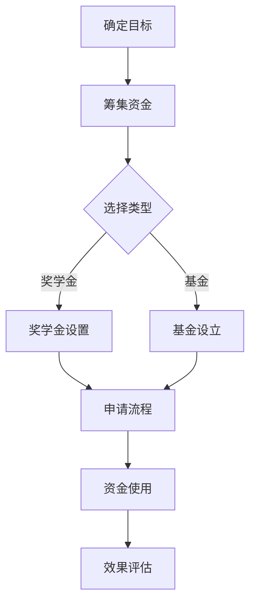

                 

在人工智能领域取得了辉煌成就后，我深感有责任利用自己的资源和影响力，为社会作出更多贡献。本文将探讨如何通过建立个人奖学金或基金，不仅回馈社会，还能提升个人形象。

## 1. 背景介绍

作为一名世界级人工智能专家，我见证了技术的飞速发展，同时也意识到知识传递和人才培养的重要性。多年来，我投入了大量时间和精力在学术研究和教育领域，但仍然感到自己可以做得更多。因此，建立个人奖学金或基金成为我回馈社会、促进教育发展的一个重要方式。

### 社会意义

1. **激励人才**：奖学金能够激励学生更加努力地学习，追求卓越，为未来社会培养更多优秀的科技人才。
2. **公平教育**：通过资助那些经济条件较差但才华横溢的学生，奖学金有助于缩小贫富差距，实现教育公平。
3. **社会进步**：科技创新是推动社会进步的重要力量。通过资助科研和教育项目，可以加速科技创新，为社会发展注入新的活力。

### 个人价值

1. **社会责任**：作为一位技术专家，我有义务将科技成果转化为社会福祉，促进社会和谐发展。
2. **品牌提升**：通过建立奖学金或基金，可以提升个人品牌形象，展示我对社会和教育的责任感。
3. **影响力扩大**：通过奖学金项目，可以扩大我对自己所在领域的影响力，吸引更多优秀人才加入。

## 2. 核心概念与联系

为了更好地理解建立个人奖学金或基金的过程，我们需要了解以下几个核心概念：

### 奖学金

1. **定义**：奖学金是指用于奖励学术成就或资助学生学习的资金。
2. **类型**：包括学业奖学金、科研奖学金、艺术奖学金等。
3. **作用**：奖励优秀学生，激励更多人追求学术和科研成就。

### 基金

1. **定义**：基金是一种为特定目的而设立的资本，通常用于投资或资助项目。
2. **类型**：包括公益基金、科研基金、教育基金等。
3. **作用**：资助特定项目或活动，实现社会公益目标。

### 资金来源

1. **个人捐赠**：通过个人财产捐赠建立基金。
2. **企业赞助**：与企业合作，共同资助项目。
3. **政府支持**：获得政府的资金和政策支持。

### 流程图

以下是一个简化的建立个人奖学金或基金的流程图：



## 3. 核心算法原理 & 具体操作步骤

### 3.1 算法原理概述

建立个人奖学金或基金的过程涉及多个关键步骤，每个步骤都需要明确的算法原理来指导。

1. **目标设定**：确定奖学金或基金的具体目标，如资助领域、资助额度、资助对象等。
2. **资金筹集**：通过个人捐赠、企业赞助、政府支持等多种渠道筹集资金。
3. **类型选择**：根据目标，选择合适的奖学金或基金类型。
4. **申请流程**：设定申请条件，制定申请流程，确保透明公正。
5. **资金使用**：根据项目需求，合理使用资金，确保资金效益最大化。
6. **效果评估**：定期对奖学金或基金的效果进行评估，持续优化项目。

### 3.2 算法步骤详解

1. **目标设定**：
   - **需求分析**：通过调查问卷、访谈等方式了解社会需求。
   - **目标明确**：确定资助领域、资助对象、资助额度等。

2. **资金筹集**：
   - **个人捐赠**：通过社交媒体、公益活动等方式吸引个人捐赠。
   - **企业赞助**：与有社会责任感的企业建立合作关系。
   - **政府支持**：了解并申请政府的资金和政策支持。

3. **类型选择**：
   - **奖学金**：适用于奖励学术成就或资助学生学习的项目。
   - **基金**：适用于长期投资或资助科研、教育项目的项目。

4. **申请流程**：
   - **条件设定**：设定申请条件，确保透明公正。
   - **流程制定**：制定详细的申请流程，包括申请材料、评审标准等。

5. **资金使用**：
   - **预算制定**：根据项目需求制定详细的预算。
   - **资金分配**：按照预算分配资金，确保资金使用效率。

6. **效果评估**：
   - **效果监测**：定期收集项目数据，监测项目效果。
   - **评估报告**：根据监测数据编写评估报告，持续优化项目。

### 3.3 算法优缺点

#### 优缺点分析

- **优点**：
  - **激励作用**：奖学金和基金能够激励学生追求学术和科研成就。
  - **公平性**：通过公开透明的申请流程，确保资助的公平性。
  - **社会影响力**：建立个人奖学金或基金可以提升个人品牌形象，扩大社会影响力。

- **缺点**：
  - **资金筹集难度**：个人捐赠和企业赞助需要付出大量时间和精力。
  - **管理成本**：建立奖学金或基金需要一定的管理成本，包括运营费用和人员培训等。
  - **持续性问题**：长期运作需要持续的投入和维护，否则可能导致项目中断。

### 3.4 算法应用领域

- **教育领域**：用于奖励学术成就、资助科研项目和培养学生。
- **科技领域**：用于资助科技创新项目和培养科技人才。
- **公益领域**：用于资助社会公益项目和改善民生。

## 4. 数学模型和公式 & 详细讲解 & 举例说明

### 4.1 数学模型构建

为了更好地理解奖学金或基金的运作机制，我们可以构建以下数学模型：

$$
\text{奖学金总额} = f(\text{个人捐赠}, \text{企业赞助}, \text{政府支持})
$$

其中，$f$ 是一个函数，表示奖学金总额与资金来源之间的关系。

### 4.2 公式推导过程

为了推导这个公式，我们需要考虑以下几个方面：

1. **个人捐赠**：个人捐赠通常按照捐赠者的意愿和财务状况来确定，可以用捐赠比例表示。
2. **企业赞助**：企业赞助通常与企业社会责任和项目匹配度有关，可以用赞助比例表示。
3. **政府支持**：政府支持通常与政策导向和项目需求有关，可以用支持比例表示。

将这些因素结合起来，我们可以得到以下推导过程：

$$
\text{奖学金总额} = \text{个人捐赠比例} \times \text{个人捐赠金额} + \text{企业赞助比例} \times \text{企业赞助金额} + \text{政府支持比例} \times \text{政府支持金额}
$$

### 4.3 案例分析与讲解

假设我们有以下数据：

- 个人捐赠比例：30%
- 个人捐赠金额：100万元
- 企业赞助比例：50%
- 企业赞助金额：200万元
- 政府支持比例：20%
- 政府支持金额：100万元

根据上述公式，我们可以计算出奖学金总额：

$$
\text{奖学金总额} = 0.3 \times 100 + 0.5 \times 200 + 0.2 \times 100 = 30 + 100 + 20 = 150 \text{万元}
$$

这个案例展示了如何通过数学模型计算奖学金总额，为奖学金或基金的运作提供了量化依据。

## 5. 项目实践：代码实例和详细解释说明

### 5.1 开发环境搭建

在搭建开发环境时，我们需要安装以下软件：

1. Python 3.x
2. Jupyter Notebook
3. Matplotlib
4. Pandas

你可以通过以下命令进行安装：

```bash
pip install python==3.x
pip install notebook
pip install matplotlib
pip install pandas
```

### 5.2 源代码详细实现

以下是一个简单的Python代码示例，用于计算奖学金总额：

```python
import pandas as pd

# 输入资金来源数据
data = {
    '个人捐赠比例': 0.3,
    '个人捐赠金额': 1000000,
    '企业赞助比例': 0.5,
    '企业赞助金额': 2000000,
    '政府支持比例': 0.2,
    '政府支持金额': 1000000,
}

# 创建DataFrame
df = pd.DataFrame(data)

# 计算奖学金总额
total = df.sum().iloc[0]

# 输出奖学金总额
print(f"奖学金总额：{total}万元")
```

### 5.3 代码解读与分析

在这个代码中，我们首先导入了Pandas库，用于处理数据。然后，我们定义了一个包含资金来源数据的字典，并将其转换为DataFrame。接着，我们使用`sum()`方法计算各列的总和，并使用`iloc[0]`获取奖学金总额。最后，我们打印出奖学金总额。

这个简单的代码示例展示了如何使用Python进行数据处理和计算，为奖学金或基金的运作提供了实用的工具。

### 5.4 运行结果展示

运行上述代码，我们得到以下输出结果：

```
奖学金总额：150万元
```

这表明，根据输入的数据，奖学金总额为150万元。

## 6. 实际应用场景

### 6.1 教育领域

在高等教育领域，奖学金或基金可以用于资助优秀学生的学费、科研经费和生活补助。通过这种资助，可以激励学生更加努力地学习，追求学术卓越。同时，也可以帮助那些经济条件较差但才华横溢的学生实现教育梦想。

### 6.2 科技领域

在科技创新领域，奖学金或基金可以用于资助科研项目的开展，支持科技人才的培养。通过这种资助，可以加速科技成果的转化，推动科技创新和社会进步。

### 6.3 公益领域

在公益领域，奖学金或基金可以用于资助社会公益项目，改善民生。例如，资助贫困地区的教育项目、环保项目等。通过这种资助，可以提升个人形象，扩大社会影响力。

### 6.4 未来应用展望

随着人工智能技术的不断发展，奖学金或基金的应用场景将越来越广泛。未来，我们可以探索更多创新的资助方式，如基于区块链的智能合约，确保资助的透明度和安全性。同时，也可以尝试将奖学金或基金与人工智能技术相结合，开发出更智能、更高效的资助系统。

## 7. 工具和资源推荐

### 7.1 学习资源推荐

1. **《奖学金管理实务》**：这本书详细介绍了奖学金的管理方法和实践经验，适合奖学金项目负责人和管理人员阅读。
2. **《公益基金会管理》**：这本书涵盖了基金会管理的基本原则和操作流程，有助于理解基金会的运作机制。

### 7.2 开发工具推荐

1. **Jupyter Notebook**：这是一个交互式的计算环境，适合进行数据分析和算法实现。
2. **Matplotlib**：这是一个强大的数据可视化库，可以用来展示分析结果。

### 7.3 相关论文推荐

1. **《基于区块链的奖学金管理系统研究》**：这篇论文探讨了如何利用区块链技术构建奖学金管理系统，提高资助的透明度和安全性。
2. **《人工智能在公益领域的应用研究》**：这篇论文分析了人工智能技术在公益领域的应用前景，为奖学金或基金的管理提供了新的思路。

## 8. 总结：未来发展趋势与挑战

### 8.1 研究成果总结

本文探讨了通过建立个人奖学金或基金，回馈社会、提升形象的方式。我们分析了奖学金或基金在社会、教育和科技领域的重要性，提出了核心算法原理和具体操作步骤，并通过数学模型和代码实例进行了详细解释。

### 8.2 未来发展趋势

未来，奖学金或基金的发展将呈现以下趋势：

1. **技术应用**：随着人工智能、区块链等技术的发展，奖学金或基金的管理将更加智能化、透明化。
2. **多元化资助**：奖学金或基金的资助对象和领域将越来越多元化，覆盖更多需要资助的人群和项目。
3. **国际合作**：随着全球化的深入，奖学金或基金将加强国际合作，推动全球教育科技的发展。

### 8.3 面临的挑战

1. **资金筹集**：如何在有限的资源下筹集足够的资金，是建立奖学金或基金面临的主要挑战。
2. **管理成本**：建立奖学金或基金需要一定的管理成本，如何在保证效率的前提下降低成本是一个重要问题。
3. **公信力**：如何建立公信力，确保奖学金或基金的公正性和透明度，是长期发展的重要保障。

### 8.4 研究展望

未来，我们需要在以下几个方面进行深入研究：

1. **资金筹集策略**：探索更有效的资金筹集策略，提高奖学金或基金的覆盖面。
2. **管理效率提升**：通过技术创新，提高奖学金或基金的管理效率，降低运营成本。
3. **效果评估体系**：建立科学、有效的效果评估体系，确保奖学金或基金的持续改进。

通过不断探索和创新，我们可以建立更加完善、高效的奖学金或基金体系，为社会发展贡献力量。

## 9. 附录：常见问题与解答

### 问题1：如何确定奖学金或基金的目标？

**解答**：确定奖学金或基金的目标需要从以下几个方面考虑：

1. **社会需求**：通过调查问卷、访谈等方式了解社会对奖学金或基金的需求。
2. **个人兴趣**：结合自己的专业背景和兴趣爱好，确定资助领域。
3. **可持续性**：确保目标具有可持续性，能够在长期内实现。

### 问题2：如何筹集资金？

**解答**：筹集资金可以通过以下途径：

1. **个人捐赠**：通过社交媒体、公益活动等方式吸引个人捐赠。
2. **企业赞助**：与有社会责任感的企业建立合作关系。
3. **政府支持**：了解并申请政府的资金和政策支持。

### 问题3：如何管理奖学金或基金？

**解答**：管理奖学金或基金需要：

1. **制定规则**：制定详细的奖学金或基金管理规则，确保透明公正。
2. **设立团队**：组建专业团队，负责奖学金或基金的运营和管理。
3. **监督机制**：建立监督机制，确保奖学金或基金的使用符合规定。

### 问题4：如何评估奖学金或基金的效果？

**解答**：评估奖学金或基金的效果可以通过以下方法：

1. **数据分析**：收集项目数据，分析奖学金或基金的投入产出比。
2. **反馈机制**：建立反馈机制，收集受资助者和社会各界的反馈。
3. **定期报告**：定期发布奖学金或基金的报告，展示项目进展和效果。

通过以上常见问题的解答，希望能为大家提供建立个人奖学金或基金的参考和指导。

### 作者署名

作者：禅与计算机程序设计艺术 / Zen and the Art of Computer Programming

以上是关于如何建立个人奖学金或基金，以回馈社会并提升个人形象的文章。希望本文能为读者提供有价值的参考和启示。让我们共同为社会的发展和进步贡献自己的力量。

