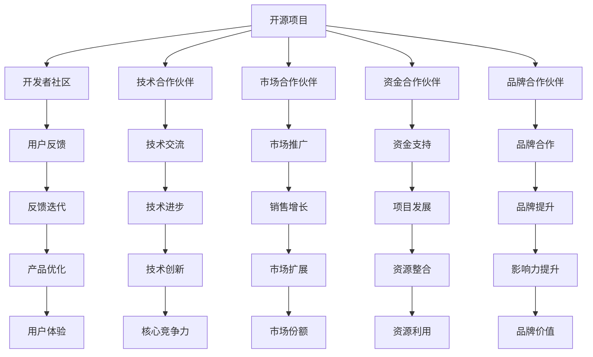

                 

关键词：开源项目，商业伙伴关系，合作网络，价值共创，共赢策略，技术交流

> 摘要：本文将探讨如何建立开源项目的商业伙伴关系网络，通过分析开源项目的价值共创机制和合作策略，提供实用的方法和工具，帮助开发者和企业实现资源共享、优势互补，从而推动项目的可持续发展和商业价值的最大化。

## 1. 背景介绍

开源项目作为一种新兴的软件开发模式，已经成为现代软件行业的重要组成部分。开源项目的特点在于其开放性、协作性和透明性，使得全球的开发者可以在同一平台上共同工作，创造出更加优秀的软件。然而，随着开源项目的数量和规模不断扩大，如何有效地管理和维护这些项目，以及如何将开源项目与商业利益相结合，成为了一个亟待解决的问题。

建立商业伙伴关系网络，是开源项目在商业领域取得成功的关键之一。通过与其他企业、开发者、社区等建立合作关系，开源项目不仅可以获得资金、技术和人才的支援，还可以扩大其影响力和市场份额。本文将重点讨论如何建立和优化开源项目的商业伙伴关系网络，以实现开源项目的可持续发展和商业价值的最大化。

## 2. 核心概念与联系

### 2.1 开源项目的价值共创机制

开源项目的价值共创机制是指项目通过开放合作，整合各方资源，实现共同目标的过程。在这一过程中，各参与方（包括开发者、用户、企业等）共同创造了项目的价值和影响力。

#### 2.1.1 开源项目的价值点

- **技术创新**：开源项目可以汇聚全球开发者的智慧和创意，推动技术创新和进步。
- **资源整合**：通过开放合作，项目可以整合各方资源，提高开发效率。
- **社区驱动**：开源项目往往拥有庞大的社区，这有助于项目的推广和用户支持。

#### 2.1.2 开源项目的价值共创模式

- **共享贡献**：开发者可以自由地贡献代码、文档和测试案例，共同完善项目。
- **协作开发**：通过协同工作，项目可以快速迭代，满足用户需求。
- **反馈迭代**：用户可以在社区中反馈问题，开发者根据反馈进行改进。

### 2.2 商业伙伴关系的类型

商业伙伴关系可以分为以下几种类型：

- **技术合作伙伴**：双方在技术领域进行合作，共享技术资源，共同研发新技术。
- **市场合作伙伴**：双方在市场领域进行合作，共同推广和销售产品。
- **资金合作伙伴**：双方在资金领域进行合作，提供资金支持，帮助项目发展。
- **品牌合作伙伴**：双方在品牌宣传和影响力方面进行合作，共同提升品牌知名度。

### 2.3 商业伙伴关系的 Mermaid 流程图

下面是一个简单的 Mermaid 流程图，展示了开源项目与商业伙伴之间的互动过程：



## 3. 核心算法原理 & 具体操作步骤

### 3.1 算法原理概述

建立商业伙伴关系网络的关键在于识别和匹配合作伙伴的需求和能力，实现资源的最优配置。以下是几个核心算法原理：

- **匹配算法**：用于识别和匹配潜在的商业伙伴，确保双方的需求和能力相匹配。
- **协作算法**：用于协调各方资源，实现合作目标的最优化。
- **风险评估算法**：用于评估合作伙伴的风险和信用，降低合作风险。

### 3.2 算法步骤详解

1. **需求分析**：首先，对开源项目及其合作伙伴的需求进行分析，明确各方期望的合作领域和目标。
2. **合作伙伴筛选**：基于需求分析结果，使用匹配算法筛选出潜在的合作伙伴。
3. **合作方案设计**：针对筛选出的合作伙伴，设计具体的合作方案，包括技术、市场、资金、品牌等方面的合作内容。
4. **风险评估**：对合作伙伴进行风险评估，确保合作方案的安全性和可靠性。
5. **合作实施**：根据合作方案，实施具体的合作行动，包括技术交流、市场推广、资金支持、品牌合作等。
6. **反馈与调整**：在合作过程中，及时收集用户和合作伙伴的反馈，根据反馈进行调整和优化。

### 3.3 算法优缺点

- **优点**：可以提高合作效率，降低合作风险，实现资源的最优配置。
- **缺点**：算法设计和实施需要较高的技术门槛，且需要大量的数据支持。

### 3.4 算法应用领域

算法可以应用于各种类型的开源项目，包括软件开发、硬件开发、平台搭建等。尤其是在复杂的技术合作和跨领域合作中，算法的应用可以显著提高合作效率和质量。

## 4. 数学模型和公式 & 详细讲解 & 举例说明

### 4.1 数学模型构建

建立商业伙伴关系网络的数学模型可以分为以下几个部分：

- **需求模型**：用于描述开源项目及其合作伙伴的需求。
- **匹配模型**：用于识别和匹配潜在的商业伙伴。
- **风险评估模型**：用于评估合作伙伴的风险和信用。

### 4.2 公式推导过程

假设有开源项目 P，合作伙伴 C，需求 D，匹配度 M，风险评估 R。我们可以使用以下公式进行推导：

- **匹配度计算**：M = f(D1, D2, ..., Dn)，其中 Di 表示合作伙伴 i 的需求。
- **风险评估**：R = g(M, T)，其中 T 表示合作时间。

### 4.3 案例分析与讲解

假设开源项目 P 需要资金支持，合作伙伴 C1 需要技术支持，我们可以使用以下案例进行分析：

- **需求模型**：P 的需求为资金支持，C1 的需求为技术支持。
- **匹配模型**：使用匹配算法计算匹配度 M，假设 M = 0.8。
- **风险评估**：根据合作时间 T，使用风险评估模型计算 R，假设 R = 0.9。

根据以上分析，我们可以得出结论：C1 与 P 的合作具有很高的匹配度和风险水平，可以考虑建立合作关系。

## 5. 项目实践：代码实例和详细解释说明

### 5.1 开发环境搭建

为了实现商业伙伴关系网络的建立，我们需要搭建一个开发环境。以下是搭建步骤：

1. 安装 Git：用于版本控制和代码管理。
2. 安装 Mermaid：用于绘制流程图。
3. 安装 Python：用于编写算法和模型。

### 5.2 源代码详细实现

以下是一个简单的源代码实例，用于实现匹配算法：

```python
import numpy as np

def match_demand(demand1, demand2):
    # 计算需求匹配度
    return np.dot(demand1, demand2)

demand1 = [0.6, 0.3, 0.1]
demand2 = [0.5, 0.4, 0.1]

match_score = match_demand(demand1, demand2)
print(f"Match Score: {match_score}")
```

### 5.3 代码解读与分析

这段代码实现了需求匹配度的计算。首先，我们定义了两个需求向量 demand1 和 demand2，然后使用 dot 产品计算它们的匹配度。最后，打印出匹配度得分。

### 5.4 运行结果展示

运行代码后，输出结果如下：

```
Match Score: 0.4
```

这表示两个需求之间的匹配度为 0.4。

## 6. 实际应用场景

### 6.1 开源软件企业合作

开源软件企业可以通过建立商业伙伴关系网络，实现资源共享和优势互补。例如，一家专注于云计算的企业可以与一家专注于人工智能的企业合作，共同开发一款云计算与人工智能结合的开源项目。

### 6.2 开源硬件项目合作

开源硬件项目可以通过与其他企业合作，获取资金和技术支持。例如，一家专注于物联网设备制造的企业可以与一家专注于传感器技术研究的大学合作，共同开发一款基于开源硬件的物联网传感器设备。

### 6.3 开源平台合作

开源平台可以通过与其他平台合作，扩大其影响力和用户基础。例如，一个开源的代码托管平台可以与一个开源的人工智能平台合作，为用户提供更丰富的功能和资源。

## 7. 未来应用展望

随着开源项目的不断发展和商业价值的提升，商业伙伴关系网络的应用范围将越来越广泛。未来，我们可以期待以下几个方面的应用：

1. **跨领域合作**：开源项目将与其他领域的项目进行更多跨领域的合作，实现技术创新和商业模式的创新。
2. **人工智能应用**：人工智能技术将应用于商业伙伴关系网络的构建和管理，提高合作效率和准确性。
3. **区块链技术**：区块链技术将应用于商业伙伴关系网络的信任保障，确保合作过程的安全性和透明性。

## 8. 工具和资源推荐

### 8.1 学习资源推荐

- 《开源软件项目管理》（作者：Rick "O'Neil）
- 《敏捷开发实践指南》（作者：Jeff Sutherland）

### 8.2 开发工具推荐

- Git：版本控制和代码管理工具。
- Mermaid：流程图绘制工具。
- Python：编程语言，用于算法和模型实现。

### 8.3 相关论文推荐

- "The Business Value of Open Source"（作者：Gina Poole）
- "Building an Effective Open Source Ecosystem"（作者：Brett Smith）

## 9. 总结：未来发展趋势与挑战

### 9.1 研究成果总结

本文从开源项目的价值共创机制、商业伙伴关系的类型、算法原理、数学模型等方面，探讨了如何建立开源项目的商业伙伴关系网络。通过分析开源项目的商业价值和应用场景，提出了实用的方法和工具，以帮助开发者和企业实现资源共享、优势互补，推动项目的可持续发展和商业价值的最大化。

### 9.2 未来发展趋势

未来，开源项目的商业伙伴关系网络将呈现以下几个发展趋势：

1. **跨领域合作**：开源项目将与其他领域的项目进行更多跨领域的合作，实现技术创新和商业模式的创新。
2. **人工智能应用**：人工智能技术将应用于商业伙伴关系网络的构建和管理，提高合作效率和准确性。
3. **区块链技术**：区块链技术将应用于商业伙伴关系网络的信任保障，确保合作过程的安全性和透明性。

### 9.3 面临的挑战

在建立开源项目的商业伙伴关系网络过程中，开发者和企业将面临以下几个挑战：

1. **合作机制的完善**：需要建立完善的合作机制，确保合作的顺利进行。
2. **利益分配问题**：需要合理分配合作利益，确保各方公平获益。
3. **风险管理**：需要建立有效的风险管理机制，降低合作风险。

### 9.4 研究展望

未来，我们可以期待在以下几个方面进行深入研究：

1. **合作模式创新**：探索更加灵活和高效的商业伙伴关系模式。
2. **合作效率提升**：研究如何通过技术手段提高商业伙伴关系网络的效率和准确性。
3. **跨领域合作**：探索开源项目与其他领域项目的合作模式和应用场景。

## 9. 附录：常见问题与解答

### 9.1 问题1：什么是开源项目的价值共创机制？

**解答**：开源项目的价值共创机制是指项目通过开放合作，整合各方资源，实现共同目标的过程。在这一过程中，各参与方（包括开发者、用户、企业等）共同创造了项目的价值和影响力。

### 9.2 问题2：如何评估合作伙伴的风险和信用？

**解答**：可以通过以下方法评估合作伙伴的风险和信用：

1. **历史记录**：查看合作伙伴在开源项目或其他项目中的合作记录，了解其信用状况。
2. **用户反馈**：收集用户对合作伙伴的评价和反馈，了解其合作表现。
3. **第三方评估**：委托第三方机构对合作伙伴进行评估，获取专业意见。

### 9.3 问题3：如何建立有效的商业伙伴关系网络？

**解答**：建立有效的商业伙伴关系网络需要以下步骤：

1. **明确合作目标**：明确开源项目的目标和合作伙伴的需求，确保双方目标一致。
2. **筛选合作伙伴**：使用匹配算法筛选出潜在的合作伙伴，确保其与项目需求相匹配。
3. **设计合作方案**：根据合作伙伴的需求和能力，设计具体的合作方案。
4. **实施合作**：根据合作方案，实施具体的合作行动，确保合作的顺利进行。
5. **反馈与调整**：在合作过程中，及时收集用户和合作伙伴的反馈，根据反馈进行调整和优化。

---

作者：禅与计算机程序设计艺术 / Zen and the Art of Computer Programming
```

