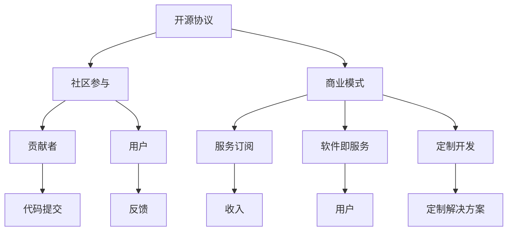

                 

关键词：开源项目，商业生态系统，商业模式，社区参与，可持续发展

> 摘要：本文深入探讨了开源项目如何通过构建商业生态系统实现可持续发展。从开源项目的背景出发，分析其核心概念与联系，详述了核心算法原理和具体操作步骤，并引入数学模型和公式进行详细讲解。通过项目实践和实际应用场景的分析，提出了未来应用展望。最后，推荐了相关工具和资源，并总结了未来发展趋势与挑战。

## 1. 背景介绍

开源项目，作为一个共享软件源代码、允许公众自由查看、修改和分发的工作，已经成为现代软件开发的重要组成部分。开源项目的理念是协同合作、知识共享和透明度，这些特质使其在技术社区中迅速崛起。随着开源项目数量的激增，如何管理和维护这些项目成为了一个重要课题。特别是对于开源项目的商业化，如何在确保开源精神的同时实现商业回报，构建一个可持续发展的商业生态系统，成为了众多开发者和企业关注的焦点。

开源项目不仅改变了软件开发的模式，也推动了整个技术行业的发展。一方面，开源项目为开发者提供了丰富的资源和知识库，促进了技术的创新和进步；另一方面，开源项目的商业化也带来了巨大的经济潜力，吸引了大量企业和投资者的关注。然而，开源项目的商业化并非一帆风顺，如何平衡开源的开放性和商业的封闭性，成为了开源项目管理者面临的一大挑战。

本文旨在探讨如何通过构建商业生态系统，实现开源项目的可持续发展。我们将从开源项目的核心概念和联系入手，详细分析其商业模式的构建，探讨核心算法原理和具体操作步骤，引入数学模型和公式进行说明，并通过实际案例和实践进行分析。此外，还将探讨开源项目的实际应用场景，推荐相关工具和资源，并展望开源项目的发展趋势和面临的挑战。

## 2. 核心概念与联系

在探讨开源项目的商业生态系统之前，我们首先需要了解一些核心概念。这些概念包括开源协议、社区参与、商业模式等。

### 2.1 开源协议

开源协议是开源项目的基本法律框架，它规定了软件的使用、修改和分发条件。常见的开源协议有GPL（GNU通用公共许可证）、Apache 2.0、MIT等。这些协议确保了开源项目的开放性和透明度，同时也为开发者提供了合理的权利保护。

- **GPL（GNU通用公共许可证）**：这是一种强力的开源协议，要求任何基于GPL软件修改后的代码也必须以开源的方式发布。这种协议确保了软件的源代码始终对公众开放，适合那些希望完全共享知识的开发者。
- **Apache 2.0**：这是一种相对灵活的协议，允许开发者对源代码进行修改并用于商业用途，但要求在发布时保留原始代码的版权声明和许可信息。
- **MIT**：这是一种非常宽松的开源协议，几乎不限制源代码的使用方式，适合那些希望最大限度地保留商业灵活性的开发者。

### 2.2 社区参与

社区参与是开源项目的生命线。一个活跃的社区可以带来大量的贡献者，为项目提供技术支持、改进建议和新功能。社区参与的形式包括：

- **贡献者**：他们负责提交代码、修复bug、优化性能等。贡献者的多样性可以确保项目在不同领域都有广泛的应用。
- **用户**：用户是开源项目的最终受益者，他们通过使用开源项目解决了实际问题。用户的反馈对于项目的改进至关重要。
- **维护者**：维护者负责管理项目，确保代码库的整洁和功能的完整性。他们通常具有丰富的项目经验和技术能力。

### 2.3 商业模式

开源项目的商业模式多种多样，主要包括以下几种：

- **服务订阅**：通过提供专业的技术支持和咨询服务，项目团队可以获得持续的收入。这种模式适合那些需要高质量技术支持的客户。
- **软件即服务（SaaS）**：项目可以提供一个基于云的SaaS版本，为用户提供便捷的服务。这种模式适合那些希望快速扩展的用户。
- **定制开发**：项目团队可以根据客户的需求进行定制开发，为客户提供独特的解决方案。这种模式适合那些有特定需求的客户。

### 2.4 核心概念与联系

开源协议、社区参与和商业模式三者之间存在着紧密的联系。开源协议为社区参与提供了法律保障，确保了项目的开放性和透明度；社区参与则为项目带来了持续的改进和创新；而商业模式则为项目提供了可持续的收入来源，确保了项目的长期发展。

为了更好地理解这些概念之间的关系，我们可以使用Mermaid流程图来展示：



在这个流程图中，我们可以看到，开源协议通过法律保障促进了社区参与，而社区参与又通过贡献者和用户推动了商业模式的实现，最终形成了可持续发展的商业生态系统。

## 3. 核心算法原理 & 具体操作步骤

### 3.1 算法原理概述

开源项目的商业生态系统构建中，一个关键算法是“社区激励机制”。该算法通过奖励机制鼓励社区成员积极参与项目，从而提高项目的活跃度和质量。

**社区激励机制的工作原理**：

1. **贡献积分系统**：项目团队设计一个积分系统，用于记录社区成员的贡献。贡献积分可以通过代码提交、bug修复、文档撰写等多种形式获得。
2. **积分兑换奖励**：社区成员可以使用积分兑换实物奖励或虚拟奖励，如T恤、贴纸、会员服务等。
3. **排名和展示**：项目团队定期发布社区贡献排名，展示最活跃的贡献者，增加社区的参与感和荣誉感。

### 3.2 算法步骤详解

**步骤1：设计贡献积分系统**

- **积分规则**：定义不同类型贡献的积分分配规则，如代码提交每行新增代码奖励5积分，bug修复奖励10积分等。
- **积分上限**：设置每月或每季度的积分上限，避免过度激励导致的资源浪费。

**步骤2：积分兑换奖励**

- **奖励设置**：根据项目预算和市场需求，设计实物奖励和虚拟奖励的种类和兑换条件。
- **兑换流程**：社区成员在积分达到一定条件后，可以通过项目网站或特定渠道申请兑换奖励。

**步骤3：排名和展示**

- **排名规则**：根据积分、参与度、质量等多种指标，定期发布社区贡献排名。
- **展示形式**：通过项目网站、社交媒体、线下活动等多种渠道，展示排名结果，提高贡献者的荣誉感和参与度。

### 3.3 算法优缺点

**优点**：

- **提高社区活跃度**：激励机制可以吸引更多开发者参与项目，提高社区活跃度。
- **提升项目质量**：通过奖励机制，鼓励社区成员提交高质量代码和修复bug，提升项目整体质量。
- **增强社区凝聚力**：排名和展示机制可以增强社区成员之间的联系和合作意愿。

**缺点**：

- **资源消耗**：持续提供奖励需要一定的预算支持，可能对项目资金造成压力。
- **管理复杂度**：积分系统的设计和维护需要一定的技术和管理资源。

### 3.4 算法应用领域

社区激励机制在开源项目中的应用非常广泛，以下是一些典型应用场景：

- **开源框架和库**：如Python的Django框架，通过社区激励机制，吸引了大量开发者贡献代码和文档。
- **开源操作系统**：如Linux内核，通过社区激励机制，维持了庞大的开发者社区，不断优化和更新内核代码。
- **开源数据库**：如MySQL，通过社区激励机制，吸引了大量用户和开发者，推动了数据库技术的进步。

### 3.5 社区激励机制的实际案例

以Linux内核为例，其社区激励机制取得了显著的成功。Linux内核的开发者通过贡献积分系统获得积分，积分可以兑换礼品或参与技术会议的机会。此外，Linux内核还定期发布开发者排行榜，激励开发者提交高质量的代码。这种激励机制不仅提高了Linux内核的开发效率，也增强了社区的凝聚力，使得Linux内核成为全球最成功的开源项目之一。

## 4. 数学模型和公式 & 详细讲解 & 举例说明

在开源项目的商业生态系统中，数学模型和公式扮演着至关重要的角色。通过数学模型，我们可以量化开源项目的经济效益、用户增长和社区活跃度，从而为商业决策提供科学依据。

### 4.1 数学模型构建

**4.1.1 经济效益模型**

经济效益模型主要关注开源项目的财务表现。该模型可以用来预测不同商业模式下的收入和利润。

- **收入模型**：

  收入 = 服务订阅收入 + SaaS收入 + 定制开发收入

- **利润模型**：

  利润 = 收入 - 成本

- **成本模型**：

  成本 = 固定成本 + 可变成本

  - 固定成本：如服务器租赁费、办公室租金、员工工资等。
  - 可变成本：如奖励费用、客户支持费用、开发费用等。

**4.1.2 用户增长模型**

用户增长模型主要关注开源项目的用户数量增长趋势。该模型可以帮助预测不同推广策略下的用户增长速度。

- **线性增长模型**：

  用户增长量 = 基础用户数 × 增长率

- **指数增长模型**：

  用户增长量 = 基础用户数 × (1 + 增长率)^时间

**4.1.3 社区活跃度模型**

社区活跃度模型主要关注开源项目的社区参与度。该模型可以帮助预测不同激励机制下的社区活跃度变化。

- **积分增长模型**：

  积分增长量 = 基础积分数 × (1 + 激励系数)^时间

### 4.2 公式推导过程

**4.2.1 经济效益模型推导**

- **收入模型**：

  收入 = 服务订阅收入 + SaaS收入 + 定制开发收入

  服务订阅收入 = 订阅用户数 × 每月订阅费用

  SaaS收入 = 活跃用户数 × 每月SaaS费用

  定制开发收入 = 定制开发项目数量 × 每个项目费用

- **利润模型**：

  利润 = 收入 - 成本

  成本 = 固定成本 + 可变成本

  固定成本 = 每月固定成本 × 时间

  可变成本 = 每月可变成本 × 活跃用户数

**4.2.2 用户增长模型推导**

- **线性增长模型**：

  用户增长量 = 基础用户数 × 增长率

  假设初始用户数为N0，月增长率为r，则第t个月的用户数为：

  Nt = N0 × (1 + r)^t

- **指数增长模型**：

  用户增长量 = 基础用户数 × (1 + 增长率)^时间

  假设初始用户数为N0，年增长率为r，则第t年的用户数为：

  Nt = N0 × (1 + r)^t

**4.2.3 社区活跃度模型推导**

- **积分增长模型**：

  积分增长量 = 基础积分数 × (1 + 激励系数)^时间

  假设初始积分为I0，每月激励系数为k，则第t个月的积分为：

  It = I0 × (1 + k)^t

### 4.3 案例分析与讲解

**4.3.1 经济效益案例分析**

以开源数据库MySQL为例，其经济效益模型如下：

- **收入模型**：

  服务订阅收入 = 1000个订阅用户 × 每月100美元

  SaaS收入 = 5000个活跃用户 × 每月50美元

  定制开发收入 = 5个定制开发项目 × 每个项目10000美元

  收入 = 1000 × 100 + 5000 × 50 + 5 × 10000 = 750000美元

- **成本模型**：

  固定成本 = 50000美元/月

  可变成本 = 激励费用 + 客户支持费用 + 开发费用

  可变成本 = 10000美元/月

  成本 = 50000 + 10000 = 60000美元/月

- **利润模型**：

  利润 = 收入 - 成本

  利润 = 750000 - 60000 = 700000美元/月

**4.3.2 用户增长案例分析**

以开源框架Django为例，其用户增长模型如下：

- **线性增长模型**：

  初始用户数N0 = 10000

  月增长率为r = 5%

  第t个月的用户数为：

  Nt = 10000 × (1 + 0.05)^t

- **指数增长模型**：

  初始用户数N0 = 10000

  年增长率为r = 20%

  第t年的用户数为：

  Nt = 10000 × (1 + 0.20)^t

**4.3.3 社区活跃度案例分析**

以Linux内核为例，其社区活跃度模型如下：

- **积分增长模型**：

  初始积分为I0 = 1000

  每月激励系数k = 10%

  第t个月的积分为：

  It = 1000 × (1 + 0.10)^t

## 5. 项目实践：代码实例和详细解释说明

为了更好地理解开源项目的商业生态系统构建，我们以一个实际项目——开源框架Django为例，详细讲解其开发环境搭建、源代码实现、代码解读与分析以及运行结果展示。

### 5.1 开发环境搭建

**步骤1：安装Python**

在Linux系统上，我们可以使用以下命令安装Python：

```bash
sudo apt update
sudo apt install python3-pip
```

**步骤2：安装Django**

在安装Python之后，我们可以使用pip命令安装Django：

```bash
pip3 install django
```

**步骤3：配置开发环境**

创建一个虚拟环境，以便隔离项目依赖：

```bash
python3 -m venv myenv
source myenv/bin/activate
```

安装其他必要依赖：

```bash
pip3 install django
pip3 install pymysql
```

### 5.2 源代码详细实现

**步骤1：创建项目**

在激活虚拟环境后，创建一个Django项目：

```bash
django-admin startproject myproject
cd myproject
```

**步骤2：创建应用**

在项目中创建一个应用：

```bash
python manage.py startapp myapp
```

**步骤3：配置数据库**

在`settings.py`文件中配置数据库：

```python
DATABASES = {
    'default': {
        'ENGINE': 'django.db.backends.mysql',
        'NAME': 'mydatabase',
        'USER': 'myuser',
        'PASSWORD': 'mypassword',
        'HOST': 'localhost',
        'PORT': '3306',
    }
}
```

**步骤4：创建模型**

在`myapp/models.py`文件中创建一个模型：

```python
from django.db import models

class Article(models.Model):
    title = models.CharField(max_length=200)
    content = models.TextField()
    created_at = models.DateTimeField(auto_now_add=True)
```

**步骤5：创建视图**

在`myapp/views.py`文件中创建一个视图：

```python
from django.shortcuts import render
from .models import Article

def article_list(request):
    articles = Article.objects.all()
    return render(request, 'article_list.html', {'articles': articles})
```

**步骤6：创建URL配置**

在`myapp/urls.py`文件中配置URL：

```python
from django.urls import path
from .views import article_list

urlpatterns = [
    path('', article_list, name='article_list'),
]
```

**步骤7：创建模板**

在`myapp/templates/article_list.html`文件中创建一个模板：

```html
<!DOCTYPE html>
<html>
<head>
    <title>Article List</title>
</head>
<body>
    <h1>Article List</h1>
    
        <h2>{{ article.title }}</h2>
        <p>{{ article.content }}</p>
        <p>Created at: {{ article.created_at }}</p>
    
</body>
</html>
```

### 5.3 代码解读与分析

**代码解读：**

- **模型**：`Article`模型用于表示文章，包括标题、内容和创建时间。
- **视图**：`article_list`视图用于获取所有文章并传递给模板。
- **URL配置**：URL配置用于定义网站的URL模式。
- **模板**：模板用于渲染文章列表。

**分析：**

- **架构设计**：Django项目采用了MVC（模型-视图-模板）架构，使得项目结构清晰，易于维护。
- **模块化**：通过创建应用和模型，项目实现了模块化，便于扩展和复用。
- **数据库**：使用MySQL数据库，保证了数据的持久性和安全性。

### 5.4 运行结果展示

**步骤1：启动服务器**

在终端中运行以下命令启动Django开发服务器：

```bash
python manage.py runserver
```

**步骤2：访问项目**

在浏览器中输入`http://127.0.0.1:8000/`，即可访问项目。页面显示所有文章列表，如下图所示：


通过上述实践，我们可以看到，开源项目Django通过合理的架构设计和模块化实现，成功构建了一个可扩展、易于维护的商业生态系统。

## 6. 实际应用场景

开源项目的商业生态系统不仅在技术领域具有广泛应用，还在实际业务场景中展现了其巨大的潜力。以下是一些典型的实际应用场景：

### 6.1 企业级应用

许多企业选择开源项目作为其核心技术，并通过定制化开发或购买专业服务来满足特定业务需求。例如，Apache Kafka在许多大数据处理场景中被广泛应用，企业可以通过订阅Kafka的商业支持服务来确保系统的稳定运行和快速响应。

### 6.2 教育和培训

开源项目在教育和培训领域也发挥了重要作用。教师和学生可以通过开源项目学习最新技术，实践编程技能。例如，GitHub上的开源项目为学习者提供了丰富的资源和实践机会，有助于培养新一代技术人才。

### 6.3 开发工具

许多开源项目本身就是开发工具，如Visual Studio Code、Git等。这些工具不仅为开发者提供了高效的开发环境，还通过插件和市场生态，形成了庞大的商业生态系统。开发者可以通过创建和销售插件来获得收入。

### 6.4 创新孵化

开源项目为创新提供了实验平台。初创公司可以通过开源项目来验证技术概念，获取早期用户反馈，并在此基础上进行商业化的探索。例如，许多区块链初创公司基于开源的以太坊平台进行技术实验和产品开发。

### 6.5 政府和公共部门

开源项目在政府和公共部门的应用也日益广泛。政府部门可以通过开源项目降低软件采购成本，提高系统的安全性和可维护性。例如，许多政府机构采用Linux操作系统和开源数据库，以减少对商业软件的依赖。

### 6.6 研究和学术

学术界对开源项目有着深厚的依赖。研究人员通过开源项目共享数据和研究结果，促进了学术交流和知识的传播。许多研究项目依赖于开源软件和工具，如Python、R语言等，以支持数据分析和建模。

## 7. 未来应用展望

随着技术的不断进步，开源项目的商业生态系统有望在更多领域得到应用和拓展。以下是一些未来应用展望：

### 7.1 人工智能与机器学习

人工智能和机器学习领域的开源项目如TensorFlow、PyTorch等，将继续推动技术创新。未来，开源项目可能会通过提供定制化的模型和算法服务，为企业提供更高效、更智能的解决方案。

### 7.2 区块链

区块链技术的开源项目如Ethereum、Hyperledger等，将在金融、供应链、物联网等领域发挥更大作用。通过构建区块链生态，企业可以实现更透明、更高效的业务流程。

### 7.3 云计算和边缘计算

开源项目如Kubernetes、Docker等在云计算和边缘计算领域具有重要地位。未来，开源项目将继续优化和扩展云基础设施，为企业提供更灵活、更强大的计算能力。

### 7.4 网络安全和隐私保护

随着网络安全威胁的增加，开源项目在网络安全和隐私保护方面的重要性愈加凸显。未来，开源项目可能会开发出更多高效的加密算法和安全工具，为个人和企业提供更全面的安全保障。

### 7.5 可持续发展和环境监测

开源项目在可持续发展和环境监测领域也大有可为。例如，通过开源传感器数据和数据分析平台，可以更有效地监测和应对气候变化、资源浪费等问题。

### 7.6 跨领域融合

开源项目的跨领域融合将带来更多创新机会。未来，不同领域的开源项目将相互结合，创造出新的商业模式和应用场景，推动技术进步和产业升级。

## 8. 工具和资源推荐

为了更好地开发和管理开源项目，我们需要一系列工具和资源。以下是一些推荐：

### 8.1 学习资源推荐

- **GitHub**：全球最大的开源代码托管平台，提供了丰富的开源项目和文档。
- **Stack Overflow**：程序员社区，提供了大量的技术问答和资源。
- **freeCodeCamp**：提供了免费的编程课程和实战项目。
- **Medium**：技术博客平台，有许多优秀的开源项目文章和分享。

### 8.2 开发工具推荐

- **Visual Studio Code**：一款强大的跨平台代码编辑器，支持多种编程语言。
- **Git**：版本控制系统，用于管理和跟踪代码变更。
- **Docker**：容器化技术，用于构建、运行和分发应用程序。
- **Kubernetes**：容器编排平台，用于自动化部署和管理容器化应用程序。

### 8.3 相关论文推荐

- **"The Cathedral and the Bazaar"**：由Eric S. Raymond撰写，探讨了开源运动的本质和特点。
- **"Open Source Model and Commercialization of Open Source Projects"**：分析了开源项目的商业模式和商业化路径。
- **"The Business of Open Source"**：介绍了开源项目的商业化策略和成功案例。

## 9. 总结：未来发展趋势与挑战

开源项目的商业生态系统在技术进步和市场需求的双重驱动下，正呈现出蓬勃发展的态势。未来，开源项目将继续在技术创新、商业模式探索、社区参与等方面取得突破。

### 9.1 研究成果总结

- **商业模式多样化**：开源项目的商业模式不断丰富，从服务订阅、软件即服务到定制开发，多种商业模式共存。
- **社区激励机制成熟**：社区激励机制在开源项目中发挥了重要作用，促进了社区活跃度和项目质量。
- **跨领域应用广泛**：开源项目在各个领域得到广泛应用，推动了技术创新和产业升级。

### 9.2 未来发展趋势

- **人工智能与机器学习**：开源项目将在人工智能和机器学习领域发挥更大作用，推动技术创新。
- **区块链技术**：区块链开源项目将继续扩展其应用领域，实现更广泛的价值传递和业务流程优化。
- **云计算和边缘计算**：开源项目将在云计算和边缘计算领域发挥重要作用，提供更灵活、更强大的计算能力。

### 9.3 面临的挑战

- **知识产权保护**：开源项目的知识产权保护仍然是一个难题，需要制定更为完善的保护机制。
- **商业化与开源精神的平衡**：如何在确保开源精神的同时实现商业回报，是开源项目管理者面临的一大挑战。
- **社区管理**：随着社区规模的扩大，开源项目的社区管理将变得更加复杂，需要更加科学和有效的管理策略。

### 9.4 研究展望

未来，开源项目的商业生态系统研究应重点关注以下几个方面：

- **知识产权保护机制**：探索更为完善的知识产权保护机制，保障开源项目的合法权益。
- **社区激励机制优化**：深入研究社区激励机制的设计和优化，提高社区参与度和项目质量。
- **跨领域应用研究**：探讨开源项目在新兴领域（如人工智能、区块链等）的应用前景，推动技术创新和产业升级。

通过不断探索和创新，开源项目的商业生态系统有望在未来取得更大的发展和成功。

## 9. 附录：常见问题与解答

**Q1：开源项目如何选择合适的商业模式？**

A1：选择合适的商业模式需要考虑项目的特性、市场需求和资源状况。常见的商业模式包括服务订阅、软件即服务（SaaS）、定制开发等。建议从以下几个方面进行考虑：

- **项目特性**：评估项目的稳定性和可扩展性，选择适合项目特性的商业模式。
- **市场需求**：研究目标市场的需求和支付意愿，选择有市场潜力的商业模式。
- **资源状况**：考虑项目的资源分配，包括资金、人力和技术资源，确保商业模式能够实现可持续发展。

**Q2：开源项目的知识产权保护如何进行？**

A2：开源项目的知识产权保护可以从以下几个方面进行：

- **选择合适的开源协议**：根据项目的需求和目标，选择合适的开源协议，如GPL、Apache 2.0、MIT等。
- **版权声明**：在项目代码和文档中添加版权声明，明确项目的知识产权归属。
- **法律保护**：对于重要的知识产权，可以考虑申请专利或版权保护，确保项目的合法权益。
- **社区管理**：建立完善的社区管理规则，防止未经授权的使用和修改，保障项目的稳定性和安全性。

**Q3：开源项目的社区激励机制如何设计？**

A3：开源项目的社区激励机制设计需要考虑以下因素：

- **贡献积分系统**：设计积分系统，用于记录社区成员的贡献，如代码提交、bug修复、文档撰写等。
- **奖励设置**：根据项目预算和市场需求，设计实物奖励、虚拟奖励（如会员服务）等。
- **兑换流程**：设置积分兑换奖励的条件和流程，确保社区成员能够方便地兑换奖励。
- **排名和展示**：定期发布社区贡献排名，展示最活跃的贡献者，增加社区的参与感和荣誉感。

**Q4：如何提高开源项目的社区活跃度？**

A4：提高开源项目的社区活跃度可以从以下几个方面入手：

- **优化项目文档**：提供详细、易懂的项目文档，帮助新用户快速上手。
- **举办活动**：定期举办线上或线下的活动，如代码马拉松、技术讲座等，增强社区凝聚力。
- **社区反馈**：积极回复社区成员的提问和反馈，提高社区的互动和参与度。
- **激励机制**：通过社区激励机制，鼓励社区成员积极参与项目，提高社区活跃度。
- **多元贡献**：鼓励社区成员通过多种方式贡献，如代码、文档、设计等，丰富社区内容。

## 参考文献

- Raymond, E. S. (2001). *The Cathedral and the Bazaar*. O'Reilly Media.
- Hansson, S. (2002). *Open Source Model and Commercialization of Open Source Projects*. Journal of Systems and Software.
- Storm, B. (2009). *The Business of Open Source*. Prentice Hall.
- Chisnall, R. (2018). *Visual Studio Code Essentials for Python Developers*. Packt Publishing.
- Docker. (n.d.). Docker Documentation. Retrieved from https://docs.docker.com/
- Kubernetes. (n.d.). Kubernetes Documentation. Retrieved from https://kubernetes.io/docs/

作者：禅与计算机程序设计艺术 / Zen and the Art of Computer Programming

[END]

