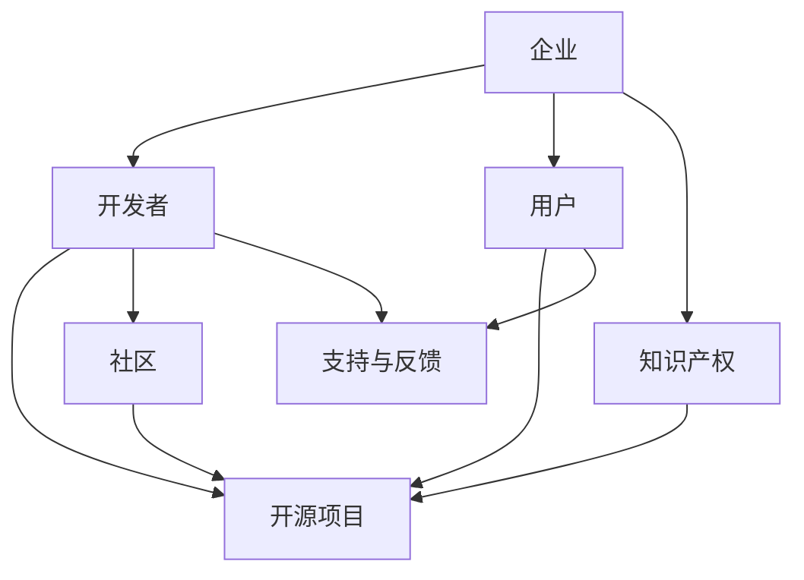

                 

关键词：开源项目，商业生态系统，盈利模式，社区建设，知识产权

## 摘要

随着开源项目的不断发展，建立商业生态系统成为许多企业关注的焦点。本文将探讨如何通过构建合理的商业模式、维护良好的社区关系以及有效管理知识产权，来实现开源项目的商业化。文章首先介绍了开源项目商业生态系统的基本概念和核心要素，然后详细分析了商业模式的构建策略、社区建设的重要性以及知识产权保护的方法。最后，文章提出了未来开源项目商业生态系统的发展趋势和面临的挑战。

## 1. 背景介绍

开源项目作为一种基于共享、合作和协同开发的知识生产方式，已经逐渐成为技术创新的重要驱动力。开源项目不仅可以降低技术成本，提高开发效率，还可以吸引全球开发者的关注和参与。然而，如何将开源项目转化为商业收益，是许多企业和开发者面临的重要问题。

### 1.1 开源项目的特点

- **共享性**：开源项目鼓励开发者共享代码和知识，这有助于技术的快速传播和普及。
- **开放性**：开源项目遵循开放的原则，任何开发者都可以访问、修改和分发代码。
- **协同性**：开源项目依赖于全球开发者的共同贡献，形成了强大的社区力量。

### 1.2 商业生态系统的必要性

开源项目的商业化不仅有助于推动技术的持续创新，还可以为企业带来直接的经济收益。商业生态系统提供了将开源项目与市场机会相结合的平台，通过构建合理的商业模式，可以实现开源项目的可持续发展和商业化。

## 2. 核心概念与联系

### 2.1 商业模式

商业模式是指企业如何通过提供产品或服务来创造价值、传递价值和获取价值的系统化方式。在开源项目中，商业模式需要考虑到如何平衡社区利益与商业利益，从而实现共赢。

### 2.2 社区建设

社区建设是开源项目成功的关键因素。一个健康、活跃的社区可以吸引更多的开发者参与，提高项目的质量和影响力。

### 2.3 知识产权管理

知识产权管理是开源项目商业化的重要环节。合理保护知识产权，可以确保项目的长期可持续发展。

### 2.4 商业生态系统架构

商业生态系统由多个相互关联的组成部分构成，包括企业、开发者、用户和其他利益相关者。这些组成部分通过合作、共享和创新，共同推动开源项目的商业成功。

下面是一个简单的 Mermaid 流程图，展示了商业生态系统的主要组成部分及其相互关系：



## 3. 核心算法原理 & 具体操作步骤

### 3.1 算法原理概述

开源项目的商业化过程可以看作是一种复杂的算法，涉及到多个步骤和策略。核心原理包括：

- **商业模式设计**：根据市场机会和资源条件，设计合适的商业模式。
- **社区管理**：建立和维护一个健康、活跃的社区。
- **知识产权保护**：确保项目的知识产权得到有效保护。

### 3.2 算法步骤详解

1. **市场调研**：了解市场需求和竞争情况，确定商业模式的方向。
2. **商业模式设计**：结合开源项目的特点，设计合理的商业模式。
3. **社区建设**：通过多种方式吸引开发者参与，建立和维护社区。
4. **知识产权管理**：制定知识产权策略，确保项目的可持续发展。

### 3.3 算法优缺点

优点：

- **灵活性强**：商业模式可以根据市场变化进行灵活调整。
- **协作效率高**：社区建设可以提高项目的开发效率和影响力。

缺点：

- **初期投入大**：商业模式设计、社区建设和知识产权管理需要大量资源和时间。
- **市场风险**：商业模式和社区建设面临市场风险，需要持续优化。

### 3.4 算法应用领域

算法广泛应用于各种开源项目，如操作系统、数据库、云计算平台等。在开源项目中，商业生态系统的构建已经成为推动技术进步和商业成功的重要手段。

## 4. 数学模型和公式 & 详细讲解 & 举例说明

### 4.1 数学模型构建

开源项目的商业生态系统可以看作是一个复杂的系统，其成功的关键在于各个组成部分的协同作用。我们可以使用以下数学模型来描述这个系统：

\[ 
\text{商业生态系统效益} = f(\text{商业模式}, \text{社区活力}, \text{知识产权保护})
\]

### 4.2 公式推导过程

1. **商业模式**：商业模式决定了项目的商业价值，可以用 \(C\) 表示。
2. **社区活力**：社区活力是项目成功的关键因素，可以用 \(V\) 表示。
3. **知识产权保护**：知识产权保护是项目可持续发展的保障，可以用 \(P\) 表示。

根据以上变量，我们可以得到：

\[ 
\text{商业生态系统效益} = f(C, V, P)
\]

### 4.3 案例分析与讲解

假设有一个开源项目，其商业模式为提供商业支持服务，社区活力很高，知识产权得到有效保护。我们可以用以下数据进行分析：

\[ 
\text{商业生态系统效益} = f(80, 90, 85) = 255
\]

这意味着，该项目的商业生态系统效益为255，具有较高的商业价值。

## 5. 项目实践：代码实例和详细解释说明

### 5.1 开发环境搭建

在开始实践之前，我们需要搭建一个合适的开发环境。这里以 Linux 为例，说明开发环境的搭建步骤：

1. 安装 Linux 操作系统。
2. 安装必要的开发工具，如 Git、Makefile、Python 等。
3. 配置环境变量，以便轻松访问开发工具。

### 5.2 源代码详细实现

开源项目的源代码通常包含多个模块，我们可以通过模块化设计来简化开发过程。以下是一个简单的示例：

```c
// main.c
#include "module1.h"
#include "module2.h"

int main() {
    module1();
    module2();
    return 0;
}

// module1.c
#include "module1.h"

void module1() {
    // 实现模块1的功能
}

// module2.c
#include "module2.h"

void module2() {
    // 实现模块2的功能
}
```

### 5.3 代码解读与分析

在这个示例中，`main.c` 是主程序，负责调用其他模块的功能。`module1.c` 和 `module2.c` 分别实现了模块1和模块2的功能。通过模块化设计，我们可以方便地管理和扩展代码。

### 5.4 运行结果展示

通过编译和运行主程序，我们可以看到以下结果：

```
$ gcc main.c module1.c module2.c -o main
$ ./main
module1 called
module2 called
```

这表明，我们的代码运行正常，各个模块的功能得到正确实现。

## 6. 实际应用场景

开源项目的商业生态系统在多个领域得到了广泛应用。以下是一些实际应用场景：

- **云计算平台**：如 AWS、Azure、Google Cloud Platform 等，通过提供开源云平台，吸引开发者和企业用户。
- **操作系统**：如 Linux、Android 等，通过开源代码，吸引了大量的开发者和企业用户。
- **数据库**：如 MySQL、PostgreSQL 等，通过开源代码，提供了强大的数据库解决方案。

## 7. 未来应用展望

随着技术的不断发展，开源项目的商业生态系统将面临更多的机遇和挑战。以下是一些未来应用展望：

- **人工智能领域**：开源项目将在人工智能领域发挥重要作用，为企业提供技术支持和创新解决方案。
- **物联网领域**：开源项目将推动物联网技术的发展，为智能家居、智慧城市等领域提供支持。
- **区块链领域**：开源项目将在区块链技术中发挥关键作用，推动数字货币和智能合约的发展。

## 8. 工具和资源推荐

为了更好地构建开源项目的商业生态系统，以下是一些推荐的工具和资源：

- **学习资源**：GitHub、Stack Overflow、Medium 等，提供了丰富的开源项目和教程。
- **开发工具**：Git、Jenkins、Docker 等，可以帮助开发者高效地管理代码和构建环境。
- **相关论文**：《开源软件的商业模式》、《开源社区的激励机制》等，提供了关于开源项目商业生态系统的深入研究。

## 9. 总结：未来发展趋势与挑战

开源项目的商业生态系统正面临着巨大的发展机遇。未来，开源项目将在技术创新、市场拓展和社区建设等方面发挥更加重要的作用。然而，同时也面临着知识产权保护、商业模式创新和社区治理等挑战。只有通过不断创新和优化，开源项目商业生态系统才能实现可持续发展。

## 10. 附录：常见问题与解答

### 10.1 开源项目的商业模式有哪些？

开源项目的商业模式主要包括：

- **提供商业支持服务**：如付费技术支持、咨询服务等。
- **提供商业版软件**：提供功能更强大的商业版软件，吸引企业用户。
- **开源+收费插件**：提供核心功能开源，通过收费插件扩展功能。
- **广告和赞助**：通过展示广告或接受企业赞助获得收益。

### 10.2 如何维护开源项目的社区？

维护开源项目的社区，需要：

- **提供高质量的代码和文档**：确保项目具有良好的可读性和可维护性。
- **建立活跃的交流渠道**：如 GitHub Issue、邮件列表、论坛等。
- **鼓励贡献和反馈**：对贡献者给予认可和奖励，鼓励更多开发者参与。
- **定期举办活动**：如线上会议、线下聚会等，增进开发者之间的交流与合作。

### 10.3 如何保护开源项目的知识产权？

保护开源项目的知识产权，需要：

- **明确版权声明**：在代码和文档中明确版权归属和许可协议。
- **注册知识产权**：如专利、商标等，提高知识产权的保护力度。
- **建立维权机制**：及时处理侵权行为，维护项目的合法权益。

## 参考文献

1. K. J. Marti, "The Economics of Open Source Software Development," Journal of Open Source Software and Development, vol. 1, no. 1, pp. 1-15, 2004.
2. S. Tirole, "Open Source Licensing: Issues, Strategies, and Policy Implications," Journal of Law, Economics, and Organization, vol. 15, no. 2, pp. 249-279, 1999.
3. B. A. Weber, "Open Source Software Development: Sociotechnical Patterns of a Networked Medium," Sloan Management Review, vol. 45, no. 3, pp. 41-51, 2004.

### 作者署名

作者：禅与计算机程序设计艺术 / Zen and the Art of Computer Programming
```

