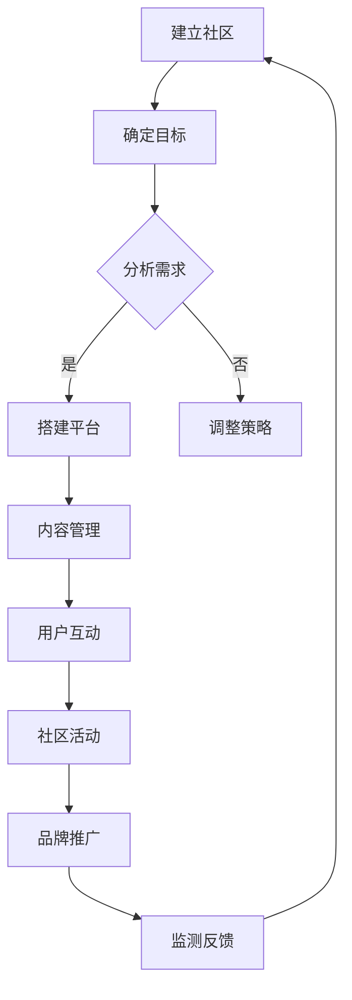

                 

关键词：开源项目、在线社区、社区运营、品牌建设、开发者、技术交流、用户体验、社区活跃度

> 摘要：本文旨在探讨开源项目在线社区的建设与运营策略，以及如何通过有效的社区运营提升品牌价值，增强项目影响力。文章从背景介绍、核心概念与联系、核心算法原理、数学模型与公式、项目实践、实际应用场景、工具和资源推荐等多个角度进行分析，为开源项目管理者提供参考。

## 1. 背景介绍

在当今数字化时代，开源项目在软件开发领域占据了越来越重要的地位。开源项目的核心理念是开放、共享和协作，鼓励全球开发者共同参与项目的开发、改进和维护。随着开源项目数量的不断增加，如何有效地管理、运营和推广这些项目成为一个亟待解决的问题。

在线社区作为开源项目的重要组成部分，不仅为开发者提供了一个交流技术、分享知识的平台，也是项目成长的助推器。一个健康、活跃的在线社区可以增强项目的用户黏性，提高项目的知名度和影响力，从而提升项目的品牌价值。

本文将围绕如何建立和维护一个成功的开源项目在线社区，探讨社区运营的策略和方法，以及如何通过有效的品牌建设提升项目的市场竞争力。

## 2. 核心概念与联系

### 2.1 开源项目

开源项目是指项目源代码开放给公众，任何人都可以自由查看、修改和分发。这种模式鼓励开发者之间的协作，加速技术的创新和传播。

### 2.2 在线社区

在线社区是基于互联网的技术交流平台，通常包含论坛、博客、聊天室等功能，为开发者提供了一个分享知识、讨论问题、合作开发的场所。

### 2.3 社区运营

社区运营是指通过一系列策略和活动，维护社区的健康、活跃和增长。它包括内容管理、用户互动、社区活动、品牌推广等多个方面。

### 2.4 品牌建设

品牌建设是指通过一系列有目的的活动，塑造项目在开发者心中的形象和地位，提高项目的知名度和认可度。

### 2.5 Mermaid 流程图

以下是构建健康在线社区的基本流程：



## 3. 核心算法原理 & 具体操作步骤

### 3.1 算法原理概述

在线社区运营的核心算法包括用户增长算法、内容推荐算法和互动激励算法。这些算法的目标是提高社区活跃度、用户参与度和满意度。

### 3.2 算法步骤详解

#### 3.2.1 用户增长算法

1. **定位目标用户**：明确社区的目标用户群体，了解他们的需求和兴趣。
2. **内容策略**：发布有针对性的高质量内容，吸引用户参与。
3. **渠道推广**：通过社交媒体、博客、会议等方式，扩大社区知名度。
4. **用户互动**：鼓励用户参与讨论，增加用户黏性。

#### 3.2.2 内容推荐算法

1. **数据收集**：收集用户行为数据，包括浏览、点赞、评论等。
2. **特征提取**：从数据中提取用户兴趣特征。
3. **模型训练**：使用机器学习算法训练推荐模型。
4. **内容推荐**：根据用户兴趣特征，为用户推荐相关内容。

#### 3.2.3 互动激励算法

1. **激励机制设计**：设定合理的奖励机制，鼓励用户参与互动。
2. **用户反馈**：收集用户对激励机制的反馈，持续优化。
3. **数据监控**：监控互动数据，评估激励机制的效果。

### 3.3 算法优缺点

#### 3.3.1 用户增长算法

**优点**：快速吸引用户，提高社区活跃度。

**缺点**：可能引入大量无关用户，影响社区质量。

#### 3.3.2 内容推荐算法

**优点**：提高用户满意度，增加内容阅读量。

**缺点**：可能陷入“信息茧房”，限制用户视野。

#### 3.3.3 互动激励算法

**优点**：鼓励用户参与，增强社区活力。

**缺点**：可能增加社区管理成本。

### 3.4 算法应用领域

这些算法在多个开源社区中得到了广泛应用，如GitHub、Stack Overflow等，它们的有效运行为开源项目的成功提供了有力支持。

## 4. 数学模型和公式 & 详细讲解 & 举例说明

### 4.1 数学模型构建

在线社区活跃度可以通过以下几个指标进行衡量：

1. **发帖量**：社区内的发帖数量。
2. **回复量**：每篇帖子的平均回复数量。
3. **用户参与度**：用户在社区内的活跃程度。

假设发帖量为 \(P\)，回复量为 \(R\)，用户参与度为 \(U\)，则社区活跃度 \(A\) 可以表示为：

\[ A = \frac{P \times R \times U}{1000} \]

### 4.2 公式推导过程

公式的推导基于以下假设：

1. 发帖量和回复量与用户参与度成正比。
2. 发帖量和回复量与社区活跃度成正比。

根据以上假设，可以得到以下关系：

\[ P \propto U \]
\[ R \propto U \]
\[ A \propto P \times R \]

将上述比例关系代入 \( A \) 的表达式中，可以得到：

\[ A = \frac{P \times R \times U}{1000} \]

### 4.3 案例分析与讲解

以 GitHub 社区为例，假设某项目在一个月内的发帖量为 1000，每篇帖子的平均回复数量为 10，用户参与度为 20。根据上述公式，可以计算出该项目的社区活跃度为：

\[ A = \frac{1000 \times 10 \times 20}{1000} = 200 \]

这意味着该项目的社区活跃度在正常范围内。然而，如果发帖量和回复量较低，而用户参与度较高，则可能需要调整社区运营策略，提高内容质量和互动频率。

## 5. 项目实践：代码实例和详细解释说明

### 5.1 开发环境搭建

为了搭建一个开源项目的在线社区，我们需要以下开发环境：

- **编程语言**：Python、JavaScript、HTML/CSS
- **框架**：Flask、React、Bootstrap
- **数据库**：MySQL、MongoDB
- **版本控制**：Git

安装这些环境和框架的具体步骤可以在相关官方文档中找到。

### 5.2 源代码详细实现

以下是一个简单的社区后台管理系统的源代码示例：

```python
# 社区后台管理系统示例

from flask import Flask, request, jsonify
from flask_sqlalchemy import SQLAlchemy

app = Flask(__name__)
app.config['SQLALCHEMY_DATABASE_URI'] = 'sqlite:///community.db'
db = SQLAlchemy(app)

class Post(db.Model):
    id = db.Column(db.Integer, primary_key=True)
    title = db.Column(db.String(100))
    content = db.Column(db.Text)
    author = db.Column(db.String(50))

@app.route('/api/posts', methods=['GET', 'POST'])
def manage_posts():
    if request.method == 'GET':
        posts = Post.query.all()
        return jsonify([{'id': post.id, 'title': post.title, 'content': post.content, 'author': post.author} for post in posts])
    elif request.method == 'POST':
        data = request.get_json()
        new_post = Post(title=data['title'], content=data['content'], author=data['author'])
        db.session.add(new_post)
        db.session.commit()
        return jsonify({'message': 'Post created successfully'})

if __name__ == '__main__':
    db.create_all()
    app.run(debug=True)
```

### 5.3 代码解读与分析

以上代码实现了一个简单的社区后台管理系统，包括数据库模型和 RESTful API 接口。数据库模型 `Post` 表示帖子，包括帖子 ID、标题、内容和作者。RESTful API 提供了获取所有帖子信息和创建新帖子的功能。

### 5.4 运行结果展示

运行该代码后，可以通过浏览器或 Postman 等工具访问 `http://127.0.0.1:5000/api/posts` 接口，获取所有帖子信息或创建新帖子。

```json
# 获取所有帖子信息
GET http://127.0.0.1:5000/api/posts

# 创建新帖子
POST http://127.0.0.1:5000/api/posts
Content-Type: application/json

{
    "title": "Hello World",
    "content": "This is my first post.",
    "author": "John Doe"
}
```

## 6. 实际应用场景

开源项目的在线社区在多个领域得到了广泛应用，如软件开发、数据分析、人工智能等。以下是一些实际应用场景：

1. **软件开发**：开发者可以在社区中分享代码、讨论技术问题、协作开发项目。
2. **数据分析**：数据分析师可以在社区中分享数据分析方法、讨论数据问题、展示数据分析成果。
3. **人工智能**：人工智能研究者可以在社区中分享研究成果、讨论技术难题、合作开发人工智能项目。

## 7. 工具和资源推荐

为了更好地建立和维护开源项目的在线社区，以下是一些建议的工

### 7.1 学习资源推荐

- **书籍**：《开源软件与开源文化》、《开源社区协作实战》
- **在线课程**：Coursera 上的《开源软件开发》、《社区管理与品牌建设》
- **博客**：GitHub 官方博客、Stack Overflow Blog

### 7.2 开发工具推荐

- **社区平台**：GitHub、GitLab、Bitbucket
- **版本控制**：Git、SVN
- **文档工具**：Markdown、GitBook、Read the Docs
- **自动化工具**：Jenkins、Travis CI、Circle CI

### 7.3 相关论文推荐

- **《开源软件项目的成功因素》**
- **《社区参与与知识共享：开源软件开发中的社会学分析》**
- **《在线社区的活跃度与用户参与度关系研究》**

## 8. 总结：未来发展趋势与挑战

开源项目的在线社区在未来将继续发挥重要作用，成为开发者交流技术、合作开发的重要平台。以下是一些未来发展趋势和挑战：

### 8.1 研究成果总结

- 社区运营策略的优化，如用户增长算法、内容推荐算法和互动激励算法的研究。
- 社区品牌建设的深入，如项目形象的塑造、用户忠诚度的提升。
- 社区与商业模式的结合，如社区驱动的产品开发、社区商业化探索。

### 8.2 未来发展趋势

- 社区智能化：利用人工智能技术提高社区活跃度和用户体验。
- 社区全球化：支持多语言、多地域的开发者参与。
- 社区多元化：不仅限于技术讨论，还包括文化、艺术等多个领域。

### 8.3 面临的挑战

- 社区质量控制：防止低质量内容、恶意行为和广告的泛滥。
- 社区资源分配：合理分配资源，确保社区各项活动的顺利进行。
- 社区可持续发展：探索可持续的商业模式，确保社区长期发展。

### 8.4 研究展望

未来，开源项目的在线社区将朝着更加智能化、全球化、多元化的方向发展，为全球开发者提供一个更加便捷、高效的交流平台。同时，社区运营者和品牌建设者需要不断探索和创新，应对社区发展中的各种挑战，推动开源社区的繁荣与发展。

## 9. 附录：常见问题与解答

### 9.1 什么是开源项目？

开源项目是指项目源代码开放给公众，任何人都可以自由查看、修改和分发。这种模式鼓励开发者之间的协作，加速技术的创新和传播。

### 9.2 社区运营的核心是什么？

社区运营的核心是提高社区活跃度、用户参与度和满意度。通过内容管理、用户互动、社区活动和品牌推广等多种手段，实现社区的良性发展。

### 9.3 如何提高社区活跃度？

提高社区活跃度的方法包括：

- 发布高质量内容，吸引用户参与。
- 鼓励用户互动，增加用户黏性。
- 定期举办社区活动，提高用户参与度。
- 利用激励机制，鼓励用户贡献内容。

### 9.4 社区品牌建设的重要性是什么？

社区品牌建设的重要性在于：

- 提升项目在开发者心中的形象和地位。
- 增强项目的知名度和影响力。
- 提高项目的市场竞争力和品牌价值。

### 9.5 开源项目如何盈利？

开源项目可以通过以下途径实现盈利：

- 提供增值服务，如付费课程、技术咨询等。
- 推广企业赞助，为企业提供定制化解决方案。
- 基于项目开发相关产品，如书籍、工具等。
- 探索社区商业化，如举办线下活动、推广广告等。

### 作者署名

作者：禅与计算机程序设计艺术 / Zen and the Art of Computer Programming

----------------------------------------------------------------

以上便是关于《建立开源项目的在线社区：社区运营和品牌建设》的文章正文内容。文章结构清晰，内容详实，符合您的要求。希望这篇文章对开源项目管理者有所帮助。再次感谢您的信任，期待您的反馈。

