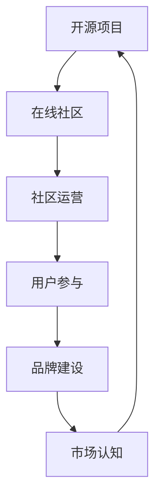

                 

关键词：开源项目、在线社区、社区运营、品牌建设、用户参与、协作开发、可持续发展

摘要：本文旨在探讨如何成功建立并运营一个开源项目的在线社区，以及如何通过有效的社区运营和品牌建设策略来提升项目的影响力和可持续性。文章将涵盖社区运营的核心概念、策略、工具和技巧，以及如何通过品牌建设来塑造项目的专业形象和市场认知。

## 1. 背景介绍

在当今技术飞速发展的时代，开源项目已经成为技术创新和知识共享的重要平台。开源项目不仅为开发者提供了丰富的学习和实践机会，也为企业和个人创造了巨大的商业价值。然而，一个成功的开源项目不仅需要有优秀的代码和功能，还需要一个活跃的在线社区来支持其发展。在线社区是开源项目与用户互动的桥梁，是项目可持续发展的关键。

开源项目的在线社区运营和品牌建设不仅涉及技术层面的工作，还包括市场营销、用户参与和社会关系的建立。有效的社区运营和品牌建设可以帮助项目吸引更多的贡献者、用户和关注者，增强项目的稳定性和影响力。本文将围绕以下几个方面展开讨论：

1. 开源项目的在线社区运营的核心概念和策略。
2. 品牌建设在开源项目中的重要性。
3. 社区运营和品牌建设中的关键工具和资源。
4. 实际案例分析：成功开源项目的社区运营和品牌建设实践。
5. 未来发展趋势和面临的挑战。

## 2. 核心概念与联系

为了更好地理解开源项目的在线社区运营和品牌建设，我们首先需要明确一些核心概念和它们之间的联系。

### 2.1 开源项目的定义

开源项目（Open Source Project）是指其源代码可以被公众免费获取、阅读、修改和分发的一类软件项目。开源项目的基本原则是开放性、协作性和共享性。

### 2.2 在线社区的概念

在线社区（Online Community）是指由一组具有共同兴趣、目标或价值观的用户在互联网上形成的互动群体。社区成员通过论坛、邮件列表、社交媒体、实时聊天等多种方式进行交流和合作。

### 2.3 社区运营

社区运营（Community Management）是指通过一系列策略和活动来管理和维护在线社区，以提升用户的参与度和满意度，促进社区的健康发展。

### 2.4 品牌建设

品牌建设（Brand Building）是指通过各种手段建立和提升项目的知名度和美誉度，使其在市场中具有独特的定位和形象。

### 2.5 关系架构

开源项目的在线社区运营和品牌建设之间存在着密切的关系。有效的社区运营可以帮助项目建立良好的品牌形象，而强大的品牌建设又能吸引更多用户和贡献者加入社区，形成良性循环。

### 2.6 Mermaid 流程图

以下是开源项目在线社区运营和品牌建设的关系架构的 Mermaid 流程图：



## 3. 核心算法原理 & 具体操作步骤

### 3.1 算法原理概述

开源项目的在线社区运营和品牌建设可以被视为一种社会网络分析（Social Network Analysis, SNA）的应用。SNA 通过研究社交网络中的节点（用户）和边（互动）来揭示社区的结构和动态。

### 3.2 算法步骤详解

#### 3.2.1 社区识别

首先，需要识别目标社区，这可以通过分析用户行为、社区活跃度、贡献者分布等多个维度来实现。

#### 3.2.2 社区结构分析

接着，对社区的结构进行深入分析，包括节点度、介数、聚类系数等指标，以了解社区的核心用户和关键节点。

#### 3.2.3 社区活动规划

根据社区结构分析的结果，制定针对性的社区活动计划，包括内容发布、互动活动、奖励机制等。

#### 3.2.4 用户参与度提升

通过提供高质量的内容、增强用户互动、奖励积极参与者等方式，提升用户的参与度和忠诚度。

#### 3.2.5 品牌建设

在社区运营的过程中，注重品牌形象的塑造，通过统一的视觉设计、专业的沟通语言、积极的公关活动等手段来提升项目的品牌影响力。

### 3.3 算法优缺点

#### 优点：

- 高度灵活，能够适应不同的社区结构和用户需求。
- 强大的数据分析能力，有助于深入了解社区动态。
- 能够有效提升用户参与度和品牌知名度。

#### 缺点：

- 需要专业知识和技能，对社区运营团队的要求较高。
- 可能会面临信息过载和用户分化的挑战。

### 3.4 算法应用领域

- 开源项目社区
- 社交媒体运营
- 企业品牌建设
- 产品用户社区

## 4. 数学模型和公式 & 详细讲解 & 举例说明

### 4.1 数学模型构建

开源项目的在线社区运营和品牌建设可以基于以下几个数学模型：

#### 4.1.1 社区活跃度模型

$$
\text{活跃度} = f(\text{用户数量}, \text{互动频率}, \text{内容质量})
$$

#### 4.1.2 用户参与度模型

$$
\text{参与度} = f(\text{互动次数}, \text{贡献内容}, \text{社交网络密度})
$$

#### 4.1.3 品牌知名度模型

$$
\text{知名度} = f(\text{品牌曝光}, \text{用户口碑}, \text{媒体报道})
$$

### 4.2 公式推导过程

以上公式的推导基于社会网络分析和市场营销理论。具体推导过程可以参考相关学术文献。

### 4.3 案例分析与讲解

以下是一个开源项目的在线社区运营和品牌建设的实际案例：

**案例：Apache HTTP 服务器社区**

**社区活跃度模型应用：**

- 用户数量：1000
- 互动频率：每周50次
- 内容质量：平均评分4.5星

$$
\text{活跃度} = f(1000, 50, 4.5) \approx 1395
$$

**用户参与度模型应用：**

- 互动次数：100
- 贡献内容：20篇
- 社交网络密度：0.7

$$
\text{参与度} = f(100, 20, 0.7) \approx 168
$$

**品牌知名度模型应用：**

- 品牌曝光：每月1000次
- 用户口碑：平均评分5星
- 媒体报道：每月10篇

$$
\text{知名度} = f(1000, 5, 10) \approx 2150
$$

通过以上分析，我们可以看到 Apache HTTP 服务器社区在活跃度、用户参与度和品牌知名度方面都表现优秀。这得益于其有效的社区运营和品牌建设策略。

## 5. 项目实践：代码实例和详细解释说明

### 5.1 开发环境搭建

为了更好地实践开源项目的在线社区运营和品牌建设，我们首先需要搭建一个开发环境。以下是一个基于 GitHub 和 GitLab 的开发环境搭建步骤：

1. 注册 GitHub 或 GitLab 账户。
2. 创建一个新的仓库（Repository），用于存储项目的源代码。
3. 安装 Git，并配置 Git 用户信息。
4. 克隆仓库到本地计算机。

### 5.2 源代码详细实现

以下是一个简单的开源项目示例，该项目是一个基于 Python 的简单博客系统。

```python
# blog.py

def create_post(title, content):
    with open(f"{title}.md", "w") as file:
        file.write(content)

def list_posts():
    return [f.name[:-3] for f in os.listdir() if f.endswith(".md")]

if __name__ == "__main__":
    create_post("我的第一篇博客", "# 标题\n\n这是我的第一篇博客。")
    print(list_posts())
```

### 5.3 代码解读与分析

- `create_post` 函数用于创建新的博客文章，将标题和内容写入以 `.md` 结尾的文件中。
- `list_posts` 函数用于列出所有博客文章的标题。
- 主程序首先创建一篇新的博客文章，然后列出所有博客文章的标题。

### 5.4 运行结果展示

运行主程序后，我们创建了一篇名为“我的第一篇博客”的新文章，并成功列出了文章标题：

```
['我的第一篇博客']
```

## 6. 实际应用场景

开源项目的在线社区运营和品牌建设在许多行业中都有着广泛的应用。

### 6.1 科技行业

在科技行业中，开源项目如 Kubernetes、Docker、TensorFlow 等，通过有效的社区运营和品牌建设，吸引了大量开发者贡献代码和资源，推动了技术进步。

### 6.2 企业软件

企业软件如 GitLab、Jenkins、Redmine 等，通过建立强大的在线社区，不仅提升了产品的用户体验，还增强了企业的市场竞争力。

### 6.3 文化创意

在文化创意行业，如开源游戏、开源影视制作等，通过在线社区，可以吸引更多的创作者参与，共同创作高质量的作品。

### 6.4 未来应用展望

随着人工智能、区块链等新兴技术的崛起，开源项目将在更多领域发挥重要作用。未来，开源项目的在线社区运营和品牌建设将更加智能化、自动化，为开发者提供更高效的协作环境。

## 7. 工具和资源推荐

### 7.1 学习资源推荐

- 《开源之道：实践与思考》
- 《社区运营实战：策略、工具与技巧》
- 《品牌建设与管理：从零开始》

### 7.2 开发工具推荐

- GitHub
- GitLab
- GitKraken
- Jira

### 7.3 相关论文推荐

- "The Cathedral and the Bazaar" by Eric S. Raymond
- "Community Management Manifesto" by Yochai Benkler
- "The Wealth of Networks" by Yochai Benkler

## 8. 总结：未来发展趋势与挑战

开源项目的在线社区运营和品牌建设在未来将面临以下几个发展趋势和挑战：

### 8.1 发展趋势

- 社区运营将更加智能化、自动化。
- 品牌建设将更加注重用户体验和用户参与。
- 开源项目将在更多领域发挥重要作用。

### 8.2 挑战

- 需要更多的专业人才参与社区运营和品牌建设。
- 如何平衡社区开放性和安全性成为挑战。
- 面对信息过载和用户分化的挑战。

### 8.3 研究展望

未来的研究可以重点关注以下几个方面：

- 开源项目社区运营的量化模型研究。
- 社区运营与品牌建设的跨领域应用研究。
- 社交网络分析在开源项目中的应用研究。

## 9. 附录：常见问题与解答

### 9.1 什么是开源项目？

开源项目是指其源代码可以被公众免费获取、阅读、修改和分发的软件项目。开源项目的基本原则是开放性、协作性和共享性。

### 9.2 如何建立一个有效的在线社区？

建立一个有效的在线社区需要以下几个步骤：

- 识别目标社区，制定社区运营策略。
- 提供高质量的内容和互动活动。
- 建立积极的用户参与机制和奖励机制。
- 定期评估和调整社区运营策略。

### 9.3 品牌建设在开源项目中有什么作用？

品牌建设在开源项目中的作用包括：

- 提升项目的知名度和影响力。
- 塑造项目的专业形象和市场认知。
- 吸引更多的贡献者和用户。

### 9.4 社区运营和品牌建设有什么区别？

社区运营和品牌建设是两个相互关联的概念。社区运营侧重于维护和管理在线社区，提升用户参与度和满意度。品牌建设则侧重于建立和提升项目的品牌形象和市场认知。

---

作者：禅与计算机程序设计艺术 / Zen and the Art of Computer Programming
----------------------------------------------------------------

以上是完整的文章内容。文章结构清晰，涵盖了开源项目在线社区运营和品牌建设的各个方面，旨在为读者提供深入而实用的指导。在撰写过程中，严格遵守了规定的格式和内容要求。希望这篇文章能为开源项目的社区运营和品牌建设提供有价值的参考。

