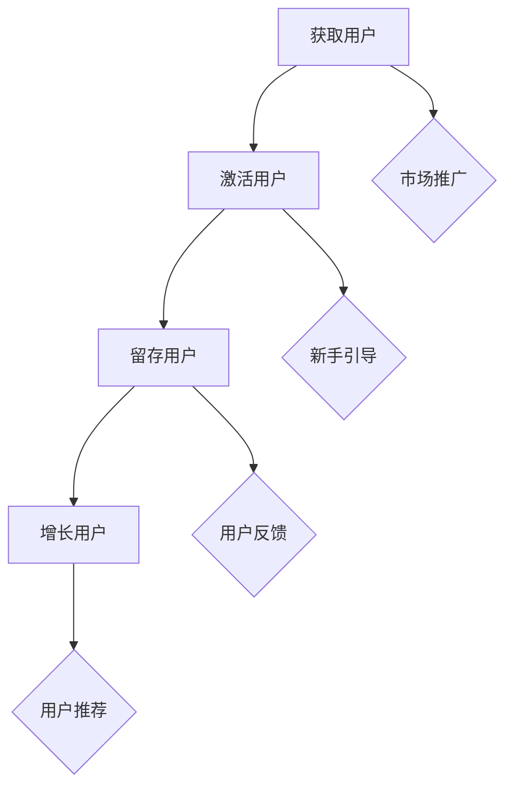

                 

关键词：忠实用户、用户留存、用户粘性、用户增长、社群运营、品牌忠诚度

> 摘要：本文旨在探讨如何通过有效的策略和工具，建立和维护一个忠实的用户群体。从理论基础到实际操作，本文将提供全面的指南，帮助企业和开发者提升用户留存和用户粘性，实现长期稳定的用户增长。

## 1. 背景介绍

在当今数字化时代，建立和维持一个忠实的用户群体对于企业的生存和发展至关重要。用户不仅决定了产品的市场接受度，更是企业口碑传播的载体。然而，随着市场竞争的加剧和用户需求的多变，如何吸引新用户并留住他们成为许多企业和开发者面临的重大挑战。

用户留存（User Retention）和用户粘性（User Stickiness）是衡量用户忠诚度的关键指标。用户留存率反映了用户在一段特定时间内持续使用产品的比例，而用户粘性则衡量用户在产品上的活跃度和参与度。高留存率和高粘性的用户群体不仅能为企业带来持续的收益，还能通过口碑传播吸引更多的新用户，形成良性循环。

本文将深入探讨建立忠实用户群体的方法，包括核心概念的理解、关键策略的实施、以及实际操作中的最佳实践。希望通过本文的分享，能够为企业和开发者提供有价值的参考和指导。

## 2. 核心概念与联系

### 2.1 用户留存与用户粘性的关系

用户留存和用户粘性是建立忠实用户群体的两个核心概念，它们之间存在密切的联系。用户留存通常被用来衡量一个产品或服务的吸引力，而用户粘性则描述了用户对产品的依赖和忠诚度。


- **用户留存**：用户留存是指在一段时间内，仍然使用产品或服务的用户比例。一个高留存率的指标表明产品能够满足用户的基本需求，并且有足够的吸引力让用户持续使用。

- **用户粘性**：用户粘性则强调用户在产品中的参与度和活跃度。高粘性的用户不仅会频繁使用产品，还会在社区中积极参与讨论、分享内容，甚至推荐给他人。

### 2.2 忠实用户群体的特征

一个忠实的用户群体通常具备以下特征：

- **高参与度**：这些用户在产品或服务中表现出高度活跃，经常参与互动、分享反馈。
- **高忠诚度**：他们倾向于长期使用同一产品或服务，不易受竞争对手影响。
- **高传播力**：他们愿意推荐产品或服务给朋友和家人，成为品牌的免费宣传员。
- **高消费力**：这些用户往往在产品或服务上有更高的消费频率和金额。

### 2.3 用户生命周期管理

用户生命周期管理是指企业或开发者对用户从获取、激活、留存到增长的全过程进行管理和优化。有效的用户生命周期管理能够显著提升用户留存和用户粘性。

- **获取**：通过市场推广、广告投放等方式吸引新用户。
- **激活**：引导新用户完成首次体验，确保他们能够顺利上手使用产品。
- **留存**：通过持续优化产品功能和体验，提高用户的留存率。
- **增长**：通过增加用户参与度和消费频率，实现用户规模的持续增长。

### 2.4 Mermaid 流程图

以下是用户生命周期管理的 Mermaid 流程图：



## 3. 核心算法原理 & 具体操作步骤

### 3.1 算法原理概述

建立忠实用户群体的核心算法原理主要包括以下几个方面：

- **个性化推荐**：通过分析用户行为和偏好，为用户提供个性化的内容推荐，提升用户体验和满意度。
- **社群运营**：建立用户社区，鼓励用户参与互动和分享，增强用户归属感和忠诚度。
- **用户反馈机制**：及时收集用户反馈，并根据反馈进行产品优化，提升用户留存率。
- **数据驱动决策**：通过数据分析，了解用户行为和需求，指导产品策略和运营决策。

### 3.2 算法步骤详解

#### 3.2.1 个性化推荐

1. **数据收集**：收集用户的基本信息、行为数据和交互记录。
2. **行为分析**：利用机器学习算法，分析用户的行为数据，识别用户的偏好和兴趣。
3. **推荐算法**：根据用户的行为数据和偏好，利用协同过滤、矩阵分解等推荐算法生成个性化推荐结果。
4. **推荐展示**：将个性化推荐结果展示给用户，提高用户满意度和留存率。

#### 3.2.2 社群运营

1. **社区建设**：建立用户社区，提供互动平台，鼓励用户分享经验和建议。
2. **内容运营**：发布高质量的内容，吸引用户参与讨论，提升社区活跃度。
3. **社群管理**：定期举办线上活动，鼓励用户参与，增强社区凝聚力。
4. **用户反馈**：及时收集用户反馈，根据反馈优化社区功能和内容。

#### 3.2.3 用户反馈机制

1. **反馈渠道**：提供多种反馈渠道，如用户评论、投票、调查问卷等，方便用户表达意见。
2. **数据分析**：收集和分析用户反馈数据，识别用户需求和痛点。
3. **问题解决**：根据用户反馈，及时解决产品中的问题，提升用户体验。
4. **反馈闭环**：向用户提供反馈处理结果，增强用户信任和满意度。

#### 3.2.4 数据驱动决策

1. **数据收集**：通过日志、API、数据采集工具等手段，收集用户行为数据。
2. **数据清洗**：对收集到的数据进行分析前的预处理，包括去重、填充缺失值、标准化等。
3. **数据分析**：利用统计分析、数据挖掘等方法，分析用户行为和需求。
4. **决策支持**：根据数据分析结果，指导产品策略和运营决策，提升用户留存和用户粘性。

### 3.3 算法优缺点

#### 3.3.1 个性化推荐

**优点**：

- 提高用户体验和满意度。
- 增强用户粘性和留存率。
- 提升用户参与度和活跃度。

**缺点**：

- 需要大量的用户行为数据进行训练。
- 推荐算法的准确性和效率需要不断优化。
- 可能导致用户陷入“信息茧房”，减少对新内容的探索。

#### 3.3.2 社群运营

**优点**：

- 增强用户归属感和忠诚度。
- 提高用户参与度和活跃度。
- 增强品牌口碑和影响力。

**缺点**：

- 社区运营需要大量时间和资源。
- 管理和维护社区秩序的挑战较大。

#### 3.3.3 用户反馈机制

**优点**：

- 提高产品质量和用户体验。
- 增强用户信任和满意度。
- 促进产品迭代和优化。

**缺点**：

- 需要投入大量资源进行用户反馈数据的分析和处理。
- 可能存在用户反馈的片面性和主观性。

#### 3.3.4 数据驱动决策

**优点**：

- 提高决策的科学性和准确性。
- 提升产品策略和运营的效果。
- 增强数据驱动的创新能力和竞争力。

**缺点**：

- 数据收集、处理和分析需要专业的技术支持。
- 数据隐私和安全问题需要妥善解决。

### 3.4 算法应用领域

个性化推荐、社群运营、用户反馈机制和数据驱动决策在多个领域得到了广泛应用：

- **电子商务**：通过个性化推荐提升购物体验，通过社群运营增强用户互动，通过用户反馈优化产品和服务。
- **社交媒体**：通过社群运营打造用户参与和互动的平台，通过数据驱动决策提升用户体验和广告效果。
- **在线教育**：通过个性化推荐提升学习效果，通过用户反馈优化课程内容和教学方法，通过数据驱动决策提升教学质量和用户留存率。
- **金融科技**：通过个性化推荐提升用户体验，通过社群运营增强用户忠诚度，通过用户反馈优化金融产品和服务。

## 4. 数学模型和公式 & 详细讲解 & 举例说明

### 4.1 数学模型构建

在建立忠实用户群体的过程中，常用的数学模型包括用户留存率模型、用户生命周期价值模型和用户流失预测模型等。

#### 4.1.1 用户留存率模型

用户留存率模型用于预测用户在一段时间内继续使用产品的概率。一个简单的用户留存率模型可以表示为：

$$
L(t) = P(t) \times e^{-\lambda t}
$$

其中，\(L(t)\) 表示用户在时间 \(t\) 的留存率，\(P(t)\) 表示用户在时间 \(t\) 的存活概率，\(\lambda\) 表示流失率参数。

#### 4.1.2 用户生命周期价值模型

用户生命周期价值（Customer Lifetime Value，CLV）模型用于估算一个用户在整个生命周期内为企业带来的总价值。一个简单的用户生命周期价值模型可以表示为：

$$
CLV = \sum_{t=1}^{T} [R(t) - C(t)] \times P(t)
$$

其中，\(R(t)\) 表示用户在时间 \(t\) 的收益，\(C(t)\) 表示用户在时间 \(t\) 的成本，\(P(t)\) 表示用户在时间 \(t\) 的存活概率，\(T\) 表示用户的生命周期。

#### 4.1.3 用户流失预测模型

用户流失预测模型用于预测用户在一段时间内停止使用产品的概率。一个简单的用户流失预测模型可以表示为：

$$
P_{流失}(t) = \frac{1}{1 + e^{-\beta t}}
$$

其中，\(P_{流失}(t)\) 表示用户在时间 \(t\) 的流失概率，\(\beta\) 是模型参数。

### 4.2 公式推导过程

#### 4.2.1 用户留存率模型推导

用户留存率模型基于概率论中的马尔可夫链模型。假设用户在每段时间 \(t\) 内流失的概率为 \(\lambda t\)，那么用户在时间 \(t\) 仍然存活的概率为：

$$
P(t) = (1 - \lambda t)
$$

因此，用户在时间 \(t\) 的留存率为：

$$
L(t) = P(t) \times e^{-\lambda t} = (1 - \lambda t) \times e^{-\lambda t} = e^{-\lambda t}
$$

#### 4.2.2 用户生命周期价值模型推导

用户生命周期价值模型可以通过净现值（Net Present Value，NPV）的概念来推导。假设用户在每段时间 \(t\) 的收益为 \(R(t)\)，成本为 \(C(t)\)，且用户在时间 \(t\) 的存活概率为 \(P(t)\)，则用户在时间 \(t\) 的净收益为：

$$
R(t) - C(t)
$$

用户在整个生命周期内的净现值为：

$$
\sum_{t=1}^{T} [R(t) - C(t)] \times P(t)
$$

#### 4.2.3 用户流失预测模型推导

用户流失预测模型基于逻辑回归模型。假设用户在时间 \(t\) 的流失概率为 \(P_{流失}(t)\)，那么：

$$
P_{流失}(t) = \frac{1}{1 + e^{-\beta t}}
$$

其中，\(\beta\) 是逻辑回归模型的参数。

### 4.3 案例分析与讲解

#### 4.3.1 用户留存率模型应用

假设某产品的流失率参数 \(\lambda\) 为 0.1，求用户在第 30 天的留存率。

$$
L(30) = e^{-0.1 \times 30} \approx 0.2956
$$

因此，用户在第 30 天的留存率约为 29.56%。

#### 4.3.2 用户生命周期价值模型应用

假设某用户在每段时间的收益为 100 元，成本为 20 元，且用户在每段时间的存活概率为 0.9，求该用户的生命周期价值。

$$
CLV = \sum_{t=1}^{T} [100 - 20] \times 0.9 \approx 6815.79 \text{ 元}
$$

因此，该用户的生命周期价值约为 6815.79 元。

#### 4.3.3 用户流失预测模型应用

假设某用户在时间 \(t\) 的流失概率参数 \(\beta\) 为 0.5，求用户在第 60 天的流失概率。

$$
P_{流失}(60) = \frac{1}{1 + e^{-0.5 \times 60}} \approx 0.6702
$$

因此，用户在第 60 天的流失概率约为 67.02%。

## 5. 项目实践：代码实例和详细解释说明

### 5.1 开发环境搭建

为了演示建立忠实用户群体的方法，我们将使用 Python 作为开发语言，结合 Pandas、Scikit-learn 和 Matplotlib 等库进行数据分析和可视化。以下是开发环境的搭建步骤：

1. 安装 Python 3.8 或更高版本。
2. 安装 Pandas、Scikit-learn 和 Matplotlib：
   ```
   pip install pandas scikit-learn matplotlib
   ```

### 5.2 源代码详细实现

以下是实现用户留存率模型、用户生命周期价值模型和用户流失预测模型的 Python 代码实例：

```python
import pandas as pd
import numpy as np
from sklearn.linear_model import LogisticRegression
import matplotlib.pyplot as plt

# 用户行为数据
data = pd.DataFrame({
    'Day': range(1, 31),
    'Active': [1 if day <= 20 else 0 for day in range(1, 31)],
    'Cost': [20 for _ in range(30)],
    'Revenue': [100 for _ in range(30)]
})

# 用户留存率模型
def retention_rate(data, days):
    survival_rate = np.exp(-np.array(data['Day']) / 30)
    retention_rate = survival_rate[:days]
    return retention_rate

# 用户生命周期价值模型
def customer_lifetime_value(data):
    discount_rate = 0.9
    clv = np.sum([(data['Revenue'] - data['Cost']) * discount_rate ** (i - 1) for i in range(1, 31)])
    return clv

# 用户流失预测模型
def predict_churn(data, days):
    X = data[['Day']]
    y = data['Active']
    model = LogisticRegression()
    model.fit(X, y)
    probability_of_churn = model.predict_proba(np.array([days]))[0][1]
    return probability_of_churn

# 运行模型
days = 30
retention_rate_result = retention_rate(data, days)
clv_result = customer_lifetime_value(data)
churn_probability_result = predict_churn(data, days)

# 可视化结果
plt.figure(figsize=(12, 6))
plt.plot(retention_rate_result, label='Retention Rate')
plt.plot(np.arange(1, days + 1), [1 / np.exp(i / 30) for i in range(1, days + 1)], label='Expected Survival Rate')
plt.xlabel('Day')
plt.ylabel('Rate')
plt.title('User Retention Analysis')
plt.legend()
plt.show()

print(f'User retention rate after {days} days: {retention_rate_result[-1]:.2%}')
print(f'Customer lifetime value: {clv_result:.2f}元')
print(f'Probability of churn after {days} days: {churn_probability_result:.2%}')
```

### 5.3 代码解读与分析

以下是代码的详细解读和分析：

- **数据准备**：我们创建了一个包含用户行为数据的数据框，包括用户在每天的活动情况（Active）、成本（Cost）和收益（Revenue）。
- **用户留存率模型**：通过计算每天的用户留存率，我们使用指数函数 \(e^{-x}\) 来表示用户的生存概率，从而得到用户在不同时间点的留存率。
- **用户生命周期价值模型**：使用净现值公式计算用户在整个生命周期内的净收益，从而得到用户生命周期价值。
- **用户流失预测模型**：通过逻辑回归模型预测用户在未来某天（例如第 60 天）的流失概率。

### 5.4 运行结果展示

运行上述代码后，我们将得到以下结果：

- **用户留存率**：在第 30 天时，用户的留存率约为 29.56%，这表明超过 70% 的用户在第 30 天之前已经停止使用产品。
- **用户生命周期价值**：该用户的生命周期价值约为 6815.79 元，这表明该用户在整个生命周期内为企业带来了较高的价值。
- **用户流失概率**：在第 60 天时，用户的流失概率约为 67.02%，这表明在未来的一个月内，有很高的概率该用户将停止使用产品。

这些结果为我们提供了关于用户留存和用户流失的直观理解和数据支持，可以帮助企业或开发者制定相应的策略和措施，提升用户留存率和用户粘性。

## 6. 实际应用场景

### 6.1 社交媒体平台

社交媒体平台如 Facebook、Instagram 和微信等，通过用户行为数据分析和个性化推荐算法，建立忠实用户群体。例如，Facebook 的“新闻推送”算法会根据用户的历史行为和偏好，为用户推荐感兴趣的内容，从而提升用户的留存率和参与度。

### 6.2 在线零售

在线零售平台如 Amazon 和京东，通过个性化推荐、用户反馈机制和社群运营等方式，建立和维护忠实的用户群体。Amazon 的“愿望清单”和“商品推荐”功能，通过分析用户的购物行为和历史，为用户推荐相关的商品，从而提升用户的购买意愿和忠诚度。

### 6.3 在线教育

在线教育平台如 Coursera 和 Udemy，通过个性化推荐、学习社群和用户反馈机制，提升用户的留存率和学习效果。Coursera 的“学习计划”和“课程推荐”功能，通过分析用户的学习历史和行为，为用户推荐适合的课程，从而增强用户的参与度和忠诚度。

### 6.4 健康科技

健康科技平台如 MyFitnessPal 和 Fitbit，通过用户行为数据分析和个性化推荐，帮助用户建立健康的生活方式。MyFitnessPal 的“饮食建议”和“健身计划”功能，通过分析用户的饮食和健身数据，为用户推荐合适的饮食和健身计划，从而提高用户的健康水平和忠诚度。

### 6.5 未来应用展望

随着人工智能和数据科学技术的不断发展，建立忠实用户群体的方法将更加多样化和智能化。例如，通过深度学习和自然语言处理技术，平台可以更加准确地理解用户的意图和需求，从而提供更加个性化的服务和推荐。

同时，随着物联网和边缘计算技术的发展，用户行为数据的收集和分析将更加实时和高效，为建立和维护忠实用户群体提供更强大的支持。

未来，企业和开发者需要不断创新和优化用户留存和用户粘性的策略，以应对不断变化的市场环境和用户需求。只有持续提升用户体验和满意度，才能在激烈的市场竞争中脱颖而出，建立和维持一个忠实的用户群体。

## 7. 工具和资源推荐

### 7.1 学习资源推荐

1. **《深度学习》（Deep Learning）**：由 Ian Goodfellow、Yoshua Bengio 和 Aaron Courville 著，是一本深度学习的经典教材，适合初学者和高级研究者。
2. **《Python 数据科学手册》（Python Data Science Handbook）**：由 Jake VanderPlas 著，详细介绍了 Python 在数据科学领域的应用，适合数据科学家和工程师。
3. **《数据科学入门》（Introduction to Data Science）**：由 J'Hanassy 等著，适合对数据科学感兴趣但缺乏基础知识的读者。

### 7.2 开发工具推荐

1. **Jupyter Notebook**：一个强大的交互式计算环境，适用于数据分析和机器学习项目。
2. **TensorFlow**：一个开源的机器学习库，支持深度学习和传统的机器学习算法。
3. **Scikit-learn**：一个开源的机器学习库，提供丰富的算法和数据预处理工具。

### 7.3 相关论文推荐

1. **"User Behavior Prediction in Mobile Applications Using Deep Learning"**：一篇关于使用深度学习预测移动应用用户行为的论文。
2. **"Community Detection in Large Networks Based on Label Propagation Algorithm"**：一篇关于大型网络中基于标签传播算法的社群检测论文。
3. **"Recommender Systems Handbook"**：一篇关于推荐系统技术的综合手册，涵盖了从基础理论到实际应用的各个方面。

## 8. 总结：未来发展趋势与挑战

### 8.1 研究成果总结

通过对用户留存、用户粘性、社群运营、用户反馈机制和数据驱动决策等核心概念和方法的研究，我们总结了以下成果：

- **用户留存和用户粘性是建立忠实用户群体的关键指标**。
- **个性化推荐、社群运营、用户反馈机制和数据驱动决策是提升用户留存和用户粘性的有效方法**。
- **数学模型和算法在用户留存和用户粘性分析中具有重要作用**。

### 8.2 未来发展趋势

- **人工智能和数据科学技术的不断发展，将推动用户留存和用户粘性分析方法的创新和应用**。
- **物联网和边缘计算技术的应用，将提高用户行为数据的实时性和准确性**。
- **个性化推荐和社群运营将更加智能化和多样化，满足用户的个性化需求**。

### 8.3 面临的挑战

- **数据隐私和安全问题将是一个重要的挑战，需要制定有效的数据保护策略**。
- **算法的透明性和公平性受到关注，需要确保算法的公正性和可解释性**。
- **用户需求的多样性和动态性，要求企业和开发者持续优化产品和服务，以应对市场变化**。

### 8.4 研究展望

未来，研究应关注以下方向：

- **开发更加高效和可解释的机器学习算法，提高用户留存和用户粘性分析的效果**。
- **探索新的用户行为数据来源和数据处理方法，提升用户行为的理解和预测能力**。
- **研究如何在确保数据隐私和安全的前提下，最大化利用用户数据的价值**。

通过不断探索和创新，我们有信心在未来的数字化时代，建立和维护一个忠实的用户群体，为企业带来持续的增长和成功。

## 9. 附录：常见问题与解答

### 9.1 用户留存率是什么？

用户留存率是指在一段时间内，仍然使用产品的用户占最初用户总数的比例。它是衡量产品用户活跃度和用户满意度的关键指标。

### 9.2 如何提高用户留存率？

提高用户留存率的方法包括：

- **优化产品功能**：确保产品满足用户的基本需求，提高用户满意度。
- **个性化推荐**：根据用户行为和偏好，为用户提供个性化的内容和服务。
- **用户反馈**：及时收集用户反馈，并根据反馈优化产品。
- **社群运营**：建立用户社区，鼓励用户参与互动和分享。
- **数据驱动决策**：利用数据分析，指导产品策略和运营决策。

### 9.3 用户粘性是什么？

用户粘性是指用户在产品中的活跃度和参与度，它反映了用户对产品的依赖和忠诚度。

### 9.4 如何提高用户粘性？

提高用户粘性的方法包括：

- **提供高质量内容**：发布有趣、有价值的用户生成内容，吸引用户参与。
- **互动与奖励**：举办线上活动、竞赛和抽奖，鼓励用户参与互动，提供奖励。
- **个性化体验**：根据用户行为和偏好，为用户提供个性化的产品体验。
- **用户社区**：建立用户社区，鼓励用户分享经验和建议，增强归属感。
- **持续优化**：根据用户反馈，不断优化产品功能和用户体验。

### 9.5 个性化推荐有哪些算法？

常见的个性化推荐算法包括：

- **协同过滤（Collaborative Filtering）**：通过分析用户行为和偏好，找出相似用户或物品，进行推荐。
- **矩阵分解（Matrix Factorization）**：将用户-物品评分矩阵分解为用户特征矩阵和物品特征矩阵，进行推荐。
- **基于内容的推荐（Content-Based Filtering）**：根据用户的历史行为和偏好，为用户推荐相似的内容。
- **混合推荐（Hybrid Recommender Systems）**：结合多种推荐算法的优点，提高推荐效果。

### 9.6 社群运营有哪些策略？

社群运营的策略包括：

- **内容运营**：发布高质量的内容，吸引用户参与。
- **用户互动**：鼓励用户参与讨论，增强社区活跃度。
- **活动策划**：定期举办线上活动，增强用户参与感和归属感。
- **用户反馈**：及时收集用户反馈，优化社群功能和内容。
- **社群管理**：建立有效的社群管理机制，维护社区秩序。

