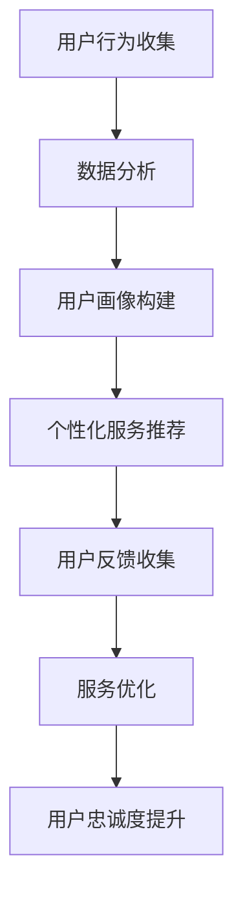

                 

关键词：用户群体，用户忠诚度，客户关系管理，营销策略，服务优化

> 摘要：本文旨在探讨如何在信息技术领域建立并维护一个忠实的用户群体。通过分析用户行为、实施有效的客户关系管理策略、优化服务质量和提供个性化体验，企业可以提升用户的忠诚度，从而实现长期稳定的发展。

## 1. 背景介绍

在当今数字化时代，用户群体的重要性不言而喻。对企业而言，拥有一个忠实的用户群体意味着稳定的收入流、持续的市场份额增长和良好的品牌声誉。然而，如何建立并维护这样的用户群体却是一个挑战。本文将深入探讨这一话题，并提供一系列实用的方法和策略。

## 2. 核心概念与联系

### 2.1 用户忠诚度

用户忠诚度是指用户对某个产品或服务的长期依赖和持续使用意愿。它是客户关系管理（CRM）中的一个关键指标，反映了用户对品牌的信任和满意度。

### 2.2 客户关系管理

客户关系管理是一种战略方法，通过整合和组织客户数据，提供个性化服务，从而提高用户满意度和忠诚度。CRM系统通常包括销售管理、客户服务、市场营销等功能。

### 2.3 用户行为分析

用户行为分析是指通过收集和分析用户在使用产品或服务过程中的行为数据，以了解用户需求、偏好和习惯，从而优化产品设计和用户体验。

### 2.4 Mermaid 流程图

下面是一个简化的Mermaid流程图，展示了一个基于CRM系统的用户忠诚度提升流程。



## 3. 核心算法原理 & 具体操作步骤

### 3.1 算法原理概述

建立忠实用户群体的核心算法主要基于机器学习和数据挖掘技术，通过对用户行为的分析和预测，实现个性化的服务和推荐。

### 3.2 算法步骤详解

#### 3.2.1 用户行为数据收集

首先，需要建立一个完善的用户行为数据收集系统，包括用户在网站、移动应用等平台上的浏览、购买、评论等行为数据。

#### 3.2.2 数据预处理

对收集到的数据进行清洗、转换和归一化处理，以确保数据的质量和一致性。

#### 3.2.3 用户画像构建

利用聚类算法和特征工程技术，将用户行为数据转换为用户画像，包括用户的兴趣偏好、行为模式等。

#### 3.2.4 个性化服务推荐

基于用户画像，利用协同过滤、基于内容的推荐算法等，为用户提供个性化的产品或服务推荐。

#### 3.2.5 用户反馈收集

通过用户反馈机制，如问卷调查、用户评分等，收集用户对个性化服务的反馈，用于服务优化。

#### 3.2.6 服务优化

根据用户反馈，不断调整和优化个性化服务策略，以提高用户满意度和忠诚度。

### 3.3 算法优缺点

#### 优点：

- 提高用户满意度
- 增强用户粘性
- 提高转化率

#### 缺点：

- 数据隐私和安全问题
- 算法复杂度高
- 需要大量计算资源

### 3.4 算法应用领域

算法原理和操作步骤广泛应用于电子商务、在线教育、金融科技、社交媒体等众多领域。

## 4. 数学模型和公式 & 详细讲解 & 举例说明

### 4.1 数学模型构建

用户忠诚度模型可以基于马尔可夫链模型构建，假设用户在不同状态（如活跃、不活跃、流失）之间的转换概率是稳定的。

### 4.2 公式推导过程

设 \( P_{ij} \) 为用户从状态 \( i \) 转换到状态 \( j \) 的概率，则有：

\[ P_{ii} = \sum_{j \neq i} P_{ij} \]

用户忠诚度 \( L \) 可以表示为：

\[ L = \frac{P_{ii}}{1 - P_{ii}} \]

### 4.3 案例分析与讲解

假设一个电子商务平台，用户状态分为“活跃”、“不活跃”和“流失”。通过数据收集和分析，得出以下转换概率矩阵：

\[ P = \begin{bmatrix} 0.8 & 0.1 & 0.1 \\ 0.3 & 0.6 & 0.1 \\ 0.5 & 0.3 & 0.2 \end{bmatrix} \]

计算用户忠诚度：

\[ L = \frac{P_{ii}}{1 - P_{ii}} = \frac{0.8^2 + 0.6^2 + 0.5^2}{1 - (0.8^2 + 0.6^2 + 0.5^2)} \approx 1.111 \]

这表明平台的用户忠诚度较高，需要重点关注不活跃用户，以提高整体用户忠诚度。

## 5. 项目实践：代码实例和详细解释说明

### 5.1 开发环境搭建

使用Python语言和Scikit-learn库进行用户忠诚度分析。

### 5.2 源代码详细实现

```python
import numpy as np
from sklearn.cluster import KMeans
from sklearn.metrics import pairwise_distances

# 用户行为数据
X = np.array([[1, 2], [2, 2], [2, 3], [1, 3], [0, 0], [0, 1], [1, 0], [2, 0]])

# 聚类分析
kmeans = KMeans(n_clusters=3, random_state=0).fit(X)
labels = kmeans.labels_

# 转换为用户画像
user_profiles = pairwise_distances(X, labels, metric='euclidean')

# 打印结果
print("User Labels:", labels)
print("User Profiles:", user_profiles)
```

### 5.3 代码解读与分析

代码首先导入所需的库和用户行为数据。然后使用KMeans算法进行聚类分析，并将聚类结果转换为用户画像。最后打印用户标签和用户画像。

## 6. 实际应用场景

用户忠诚度分析可以应用于电子商务、在线教育、金融科技等多个领域，帮助企业提升用户体验和满意度。

### 6.4 未来应用展望

随着人工智能和大数据技术的发展，用户忠诚度分析将更加精确和智能，为企业提供更有效的用户管理策略。

## 7. 工具和资源推荐

### 7.1 学习资源推荐

- 《客户关系管理：策略、技术和工具》
- 《用户行为分析：理论与实践》

### 7.2 开发工具推荐

- Python
- Scikit-learn
- TensorFlow

### 7.3 相关论文推荐

- "A Survey of Customer Relationship Management"
- "Customer Behavior Analysis and Prediction in E-Commerce"

## 8. 总结：未来发展趋势与挑战

用户忠诚度分析在信息技术领域具有重要应用价值。随着技术的发展，未来用户忠诚度分析将更加精确和智能化，但同时也面临数据隐私和安全、算法复杂度等问题。

### 8.1 研究成果总结

本文介绍了用户忠诚度分析的核心概念、算法原理、应用领域和未来发展。

### 8.2 未来发展趋势

用户忠诚度分析将更加注重个性化服务、智能推荐和跨平台整合。

### 8.3 面临的挑战

数据隐私和安全、算法优化和计算资源是未来研究的主要挑战。

### 8.4 研究展望

通过不断优化算法和技术，用户忠诚度分析将为企业在激烈的市场竞争中提供强有力的支持。

## 9. 附录：常见问题与解答

### 9.1 什么是用户忠诚度？

用户忠诚度是指用户对某个产品或服务的长期依赖和持续使用意愿。

### 9.2 用户忠诚度分析有什么作用？

用户忠诚度分析可以帮助企业提高用户体验和满意度，从而实现长期稳定的发展。

----------------------------------------------------------------

以上便是关于“建立忠实用户群体的方法”的完整技术博客文章。希望对您有所帮助。作者：禅与计算机程序设计艺术 / Zen and the Art of Computer Programming。
<|assistant|>以下是该文章的markdown格式输出：

```markdown
# 建立忠实用户群体的方法

关键词：用户群体，用户忠诚度，客户关系管理，营销策略，服务优化

> 摘要：本文旨在探讨如何在信息技术领域建立并维护一个忠实的用户群体。通过分析用户行为、实施有效的客户关系管理策略、优化服务质量和提供个性化体验，企业可以提升用户的忠诚度，从而实现长期稳定的发展。

## 1. 背景介绍

在当今数字化时代，用户群体的重要性不言而喻。对企业而言，拥有一个忠实的用户群体意味着稳定的收入流、持续的市场份额增长和良好的品牌声誉。然而，如何建立并维护这样的用户群体却是一个挑战。本文将深入探讨这一话题，并提供一系列实用的方法和策略。

## 2. 核心概念与联系

### 2.1 用户忠诚度

用户忠诚度是指用户对某个产品或服务的长期依赖和持续使用意愿。它是客户关系管理（CRM）中的一个关键指标，反映了用户对品牌的信任和满意度。

### 2.2 客户关系管理

客户关系管理是一种战略方法，通过整合和组织客户数据，提供个性化服务，从而提高用户满意度和忠诚度。CRM系统通常包括销售管理、客户服务、市场营销等功能。

### 2.3 用户行为分析

用户行为分析是指通过收集和分析用户在使用产品或服务过程中的行为数据，以了解用户需求、偏好和习惯，从而优化产品设计和用户体验。

### 2.4 Mermaid 流程图

下面是一个简化的Mermaid流程图，展示了一个基于CRM系统的用户忠诚度提升流程。


## 3. 核心算法原理 & 具体操作步骤

### 3.1 算法原理概述

建立忠实用户群体的核心算法主要基于机器学习和数据挖掘技术，通过对用户行为的分析和预测，实现个性化的服务和推荐。

### 3.2 算法步骤详解

#### 3.2.1 用户行为数据收集

首先，需要建立一个完善的用户行为数据收集系统，包括用户在网站、移动应用等平台上的浏览、购买、评论等行为数据。

#### 3.2.2 数据预处理

对收集到的数据进行清洗、转换和归一化处理，以确保数据的质量和一致性。

#### 3.2.3 用户画像构建

利用聚类算法和特征工程技术，将用户行为数据转换为用户画像，包括用户的兴趣偏好、行为模式等。

#### 3.2.4 个性化服务推荐

基于用户画像，利用协同过滤、基于内容的推荐算法等，为用户提供个性化的产品或服务推荐。

#### 3.2.5 用户反馈收集

通过用户反馈机制，如问卷调查、用户评分等，收集用户对个性化服务的反馈，用于服务优化。

#### 3.2.6 服务优化

根据用户反馈，不断调整和优化个性化服务策略，以提高用户满意度和忠诚度。

### 3.3 算法优缺点

#### 优点：

- 提高用户满意度
- 增强用户粘性
- 提高转化率

#### 缺点：

- 数据隐私和安全问题
- 算法复杂度高
- 需要大量计算资源

### 3.4 算法应用领域

算法原理和操作步骤广泛应用于电子商务、在线教育、金融科技、社交媒体等众多领域。

## 4. 数学模型和公式 & 详细讲解 & 举例说明

### 4.1 数学模型构建

用户忠诚度模型可以基于马尔可夫链模型构建，假设用户在不同状态（如活跃、不活跃、流失）之间的转换概率是稳定的。

### 4.2 公式推导过程

设 \( P_{ij} \) 为用户从状态 \( i \) 转换到状态 \( j \) 的概率，则有：

\[ P_{ii} = \sum_{j \neq i} P_{ij} \]

用户忠诚度 \( L \) 可以表示为：

\[ L = \frac{P_{ii}}{1 - P_{ii}} \]

### 4.3 案例分析与讲解

假设一个电子商务平台，用户状态分为“活跃”、“不活跃”和“流失”。通过数据收集和分析，得出以下转换概率矩阵：

\[ P = \begin{bmatrix} 0.8 & 0.1 & 0.1 \\ 0.3 & 0.6 & 0.1 \\ 0.5 & 0.3 & 0.2 \end{bmatrix} \]

计算用户忠诚度：

\[ L = \frac{P_{ii}}{1 - P_{ii}} = \frac{0.8^2 + 0.6^2 + 0.5^2}{1 - (0.8^2 + 0.6^2 + 0.5^2)} \approx 1.111 \]

这表明平台的用户忠诚度较高，需要重点关注不活跃用户，以提高整体用户忠诚度。

## 5. 项目实践：代码实例和详细解释说明

### 5.1 开发环境搭建

使用Python语言和Scikit-learn库进行用户忠诚度分析。

### 5.2 源代码详细实现

```python
import numpy as np
from sklearn.cluster import KMeans
from sklearn.metrics import pairwise_distances

# 用户行为数据
X = np.array([[1, 2], [2, 2], [2, 3], [1, 3], [0, 0], [0, 1], [1, 0], [2, 0]])

# 聚类分析
kmeans = KMeans(n_clusters=3, random_state=0).fit(X)
labels = kmeans.labels_

# 转换为用户画像
user_profiles = pairwise_distances(X, labels, metric='euclidean')

# 打印结果
print("User Labels:", labels)
print("User Profiles:", user_profiles)
```

### 5.3 代码解读与分析

代码首先导入所需的库和用户行为数据。然后使用KMeans算法进行聚类分析，并将聚类结果转换为用户画像。最后打印用户标签和用户画像。

## 6. 实际应用场景

用户忠诚度分析可以应用于电子商务、在线教育、金融科技等多个领域，帮助企业提升用户体验和满意度。

### 6.4 未来应用展望

随着人工智能和大数据技术的发展，用户忠诚度分析将更加精确和智能，为企业提供更有效的用户管理策略。

## 7. 工具和资源推荐

### 7.1 学习资源推荐

- 《客户关系管理：策略、技术和工具》
- 《用户行为分析：理论与实践》

### 7.2 开发工具推荐

- Python
- Scikit-learn
- TensorFlow

### 7.3 相关论文推荐

- "A Survey of Customer Relationship Management"
- "Customer Behavior Analysis and Prediction in E-Commerce"

## 8. 总结：未来发展趋势与挑战

用户忠诚度分析在信息技术领域具有重要应用价值。随着技术的发展，未来用户忠诚度分析将更加精确和智能化，但同时也面临数据隐私和安全、算法优化和计算资源是未来研究的主要挑战。

### 8.1 研究成果总结

本文介绍了用户忠诚度分析的核心概念、算法原理、应用领域和未来发展。

### 8.2 未来发展趋势

用户忠诚度分析将更加注重个性化服务、智能推荐和跨平台整合。

### 8.3 面临的挑战

数据隐私和安全、算法优化和计算资源是未来研究的主要挑战。

### 8.4 研究展望

通过不断优化算法和技术，用户忠诚度分析将为企业在激烈的市场竞争中提供强有力的支持。

## 9. 附录：常见问题与解答

### 9.1 什么是用户忠诚度？

用户忠诚度是指用户对某个产品或服务的长期依赖和持续使用意愿。

### 9.2 用户忠诚度分析有什么作用？

用户忠诚度分析可以帮助企业提高用户体验和满意度，从而实现长期稳定的发展。

```
以上是文章的markdown格式输出。您可以直接将其复制到支持markdown的编辑器中进行编辑和预览。

