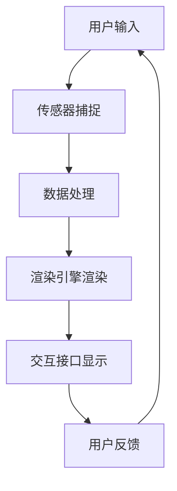

                 

关键词：虚拟现实，增强现实，个人品牌，知识传播，技术博客，创新

摘要：本文将探讨如何利用虚拟现实（VR）和增强现实（AR）技术，开发个人品牌体验，创新知识传播方式。通过深入分析VR/AR的核心概念、算法原理、数学模型以及实际应用案例，我们将展示如何利用这些技术提高个人品牌的传播效果，为知识传播提供新的途径。

## 1. 背景介绍

在数字化时代，个人品牌的重要性日益凸显。个人品牌不仅是一个人的专业形象，更是其在职业和社会领域的价值体现。然而，传统的知识传播方式往往局限于文字、图片和视频等形式，难以充分展现个人品牌的深度和多样性。随着虚拟现实（VR）和增强现实（AR）技术的不断发展，为个人品牌的发展带来了前所未有的机遇。

VR技术通过模拟虚拟环境，为用户提供了沉浸式体验。用户可以在虚拟环境中自由探索、互动，从而深入了解个人品牌所传达的信息。AR技术则通过在现实世界叠加虚拟信息，实现了现实与虚拟的融合。用户可以在现实场景中观察到虚拟信息，并与之互动，从而更好地理解和接受个人品牌的价值。

## 2. 核心概念与联系

为了更好地理解VR/AR技术在个人品牌开发中的应用，我们需要先了解其核心概念和基本架构。

### 2.1 VR/AR基本概念

虚拟现实（VR）是一种通过计算机技术创建的虚拟环境，用户可以通过VR设备（如VR头盔、VR眼镜等）进入这个环境，与之互动。虚拟环境可以是完全虚构的，也可以是基于现实世界的模拟。

增强现实（AR）则是在现实世界的基础上，通过计算机技术叠加虚拟信息，使用户能够在现实场景中观察到这些虚拟信息。常见的AR设备包括智能手机、平板电脑和AR眼镜等。

### 2.2 VR/AR架构

VR/AR技术的架构主要包括以下几个方面：

1. **渲染引擎**：用于创建和渲染虚拟环境和虚拟信息。
2. **传感器**：用于捕捉用户和环境的信息，如位置、姿态、手势等。
3. **交互接口**：用于用户与虚拟环境和虚拟信息之间的交互。
4. **内容创建**：用于创建和编辑虚拟环境和虚拟信息。

### 2.3 VR/AR流程图

以下是VR/AR技术的流程图，展示了其基本架构和流程：



## 3. 核心算法原理 & 具体操作步骤

### 3.1 算法原理概述

VR/AR技术的核心算法主要涉及以下几个方面：

1. **三维建模**：通过计算机图形学技术，创建三维虚拟模型。
2. **纹理映射**：将二维图像映射到三维模型上，增加模型的细节和真实感。
3. **光影效果**：通过计算机图形学技术，模拟现实世界的光影效果，增强虚拟环境的真实感。
4. **实时渲染**：在VR/AR设备上实时渲染虚拟环境，实现快速互动。
5. **空间定位**：通过传感器技术，实现虚拟信息与现实世界的空间对应。

### 3.2 算法步骤详解

1. **三维建模**：
   - 输入：模型参数（如尺寸、形状等）。
   - 输出：三维模型。

2. **纹理映射**：
   - 输入：二维图像、三维模型。
   - 输出：带有纹理的三维模型。

3. **光影效果**：
   - 输入：三维模型、光源信息。
   - 输出：具有光影效果的三维模型。

4. **实时渲染**：
   - 输入：虚拟环境信息、用户交互信息。
   - 输出：渲染结果。

5. **空间定位**：
   - 输入：传感器数据、虚拟环境信息。
   - 输出：空间定位结果。

### 3.3 算法优缺点

**优点**：

- 提供沉浸式体验，用户可以更好地理解和接受个人品牌的信息。
- 实现实与虚拟的融合，增加知识传播的趣味性和互动性。
- 可以实现个性化的知识传播，满足不同用户的需求。

**缺点**：

- 技术门槛较高，需要专业的开发团队和设备。
- 受限于硬件性能，可能存在一定的延迟和卡顿。

### 3.4 算法应用领域

VR/AR技术在个人品牌开发中的应用主要包括以下几个方面：

1. **个人品牌展示**：通过VR/AR技术，用户可以更直观地了解个人品牌的价值和理念。
2. **教育培训**：利用VR/AR技术，可以提供沉浸式的教学体验，提高学习效果。
3. **产品推广**：通过VR/AR技术，用户可以更深入地了解产品特点和使用方法。
4. **客户服务**：利用VR/AR技术，可以提供个性化的客户服务，提高客户满意度。

## 4. 数学模型和公式 & 详细讲解 & 举例说明

### 4.1 数学模型构建

VR/AR技术中的数学模型主要包括以下几个方面：

1. **三维空间模型**：用于表示虚拟环境中的物体和位置。
2. **矩阵变换**：用于实现物体的旋转、缩放、平移等操作。
3. **投影变换**：用于将三维空间中的物体投影到二维屏幕上。
4. **光线追踪**：用于模拟现实世界的光影效果。

### 4.2 公式推导过程

以下是VR/AR技术中的一些关键公式及其推导过程：

1. **三维空间模型**：

   $$ V = \begin{bmatrix} x \\ y \\ z \end{bmatrix} $$

   其中，$V$表示三维空间中的点。

2. **矩阵变换**：

   $$ T = \begin{bmatrix} a & b & c \\ d & e & f \\ g & h & i \end{bmatrix} $$

   其中，$T$表示二维空间中的变换矩阵。

3. **投影变换**：

   $$ P = \begin{bmatrix} x' \\ y' \\ z' \end{bmatrix} = \begin{bmatrix} x \\ y \\ z \end{bmatrix} \begin{bmatrix} a & b & c \\ d & e & f \\ g & h & i \end{bmatrix} $$

   其中，$P$表示投影后的点。

4. **光线追踪**：

   $$ L = \begin{bmatrix} x \\ y \\ z \end{bmatrix} = \begin{bmatrix} x_0 \\ y_0 \\ z_0 \end{bmatrix} + t \begin{bmatrix} x_1 \\ y_1 \\ z_1 \end{bmatrix} $$

   其中，$L$表示光线轨迹，$t$表示时间。

### 4.3 案例分析与讲解

以下是一个简单的VR/AR技术案例，用于展示数学模型的应用：

假设我们要创建一个简单的虚拟环境，其中包含一个立方体和一个光源。我们的目标是实现立方体的旋转和光照效果。

1. **三维空间模型**：

   立方体的顶点坐标为：

   $$ V_1 = \begin{bmatrix} 1 \\ 1 \\ 1 \end{bmatrix} $$
   $$ V_2 = \begin{bmatrix} -1 \\ 1 \\ 1 \end{bmatrix} $$
   $$ V_3 = \begin{bmatrix} -1 \\ -1 \\ 1 \end{bmatrix} $$
   $$ V_4 = \begin{bmatrix} 1 \\ -1 \\ 1 \end{bmatrix} $$

2. **矩阵变换**：

   矩阵变换用于实现立方体的旋转。假设我们要将立方体绕x轴旋转$90$度，则旋转矩阵为：

   $$ T = \begin{bmatrix} 1 & 0 & 0 \\ 0 & \cos(\theta) & -\sin(\theta) \\ 0 & \sin(\theta) & \cos(\theta) \end{bmatrix} $$

   其中，$\theta$为旋转角度。

3. **投影变换**：

   投影变换用于将立方体从三维空间投影到二维屏幕上。假设屏幕的分辨率为$800 \times 600$，则投影矩阵为：

   $$ P = \begin{bmatrix} 800/2 & 0 & 400 \\ 0 & 600/2 & 300 \\ 0 & 0 & 1 \end{bmatrix} $$

4. **光线追踪**：

   光源的位置为$(0, 0, 10)$，光线的方向为$(0, 0, -1)$。假设时间$t=1$，则光线轨迹为：

   $$ L = \begin{bmatrix} 0 \\ 0 \\ 10 \end{bmatrix} + 1 \begin{bmatrix} 0 \\ 0 \\ -1 \end{bmatrix} = \begin{bmatrix} 0 \\ 0 \\ 9 \end{bmatrix} $$

通过上述数学模型和公式的应用，我们可以实现立方体的旋转和光照效果。

## 5. 项目实践：代码实例和详细解释说明

### 5.1 开发环境搭建

为了实现VR/AR技术在个人品牌开发中的应用，我们需要搭建一个合适的开发环境。以下是推荐的开发工具和资源：

1. **开发工具**：
   - Unity：一款流行的游戏开发引擎，支持VR/AR应用开发。
   - Unreal Engine：一款强大的游戏开发引擎，同样支持VR/AR应用开发。
   - ARKit/ARCore：苹果和谷歌提供的AR开发框架。

2. **开发资源**：
   - Unity Asset Store：提供丰富的VR/AR开发资源，如3D模型、动画、插件等。
   - GitHub：提供大量的开源VR/AR项目，可以学习并借鉴。

### 5.2 源代码详细实现

以下是一个简单的Unity项目，用于展示如何实现VR/AR技术在个人品牌开发中的应用：

1. **场景设置**：

   创建一个空的游戏对象，命名为"Main Camera"。在"Main Camera"上添加一个"Look Rig"组件，用于控制摄像机的运动。

2. **三维建模**：

   导入一个个人品牌的3D模型，并创建一个游戏对象，命名为"Brand Model"。将3D模型作为"Brand Model"的子对象。

3. **纹理映射**：

   为"Brand Model"添加一个"Material"组件，并设置其纹理。

4. **光影效果**：

   为"Brand Model"添加一个"Light"组件，设置其位置和强度。

5. **空间定位**：

   使用ARKit/ARCore框架，实现"Brand Model"在现实世界中的空间定位。

### 5.3 代码解读与分析

以下是Unity项目中关键代码的解读和分析：

1. **场景设置**：

   ```csharp
   public class SceneSetup : MonoBehaviour
   {
       public LookRig lookRig;

       void Start()
       {
           lookRig = GetComponent<LookRig>();
           lookRig.Initialize();
       }
   }
   ```

   该脚本用于初始化"Look Rig"，实现摄像机的运动控制。

2. **三维建模**：

   ```csharp
   public class BrandModel : MonoBehaviour
   {
       public GameObject brandModel;

       void Start()
       {
           brandModel = Instantiate(brandModelPrefab);
           brandModel.transform.parent = transform;
       }
   }
   ```

   该脚本用于创建"Brand Model"游戏对象，并将其作为子对象添加到"Main Camera"下。

3. **纹理映射**：

   ```csharp
   public class TextureMapping : MonoBehaviour
   {
       public Material material;

       void Start()
       {
           material = GetComponent<MeshRenderer>().material;
           material.mainTexture = brandTexture;
       }
   }
   ```

   该脚本用于为"Brand Model"设置材质和纹理。

4. **光影效果**：

   ```csharp
   public class Lighting : MonoBehaviour
   {
       public Light light;

       void Start()
       {
           light = GetComponent<Light>();
           light.position = new Vector3(0, 10, 10);
           light.intensity = 1;
       }
   }
   ```

   该脚本用于设置"Brand Model"的光照效果。

5. **空间定位**：

   ```csharp
   public class SpatialMapping : MonoBehaviour
   {
       public ARKit/ARCoreSession session;

       void Start()
       {
           session = GetComponent<ARKit/ARCoreSession>();
           session.StartSession();
       }

       void Update()
       {
           if (session.TrackingState == ARKit/ARCoreTrackingState.Tracking)
           {
               brandModel.transform.position = session.CameraTransform.position;
               brandModel.transform.rotation = session.CameraTransform.rotation;
           }
       }
   }
   ```

   该脚本使用ARKit/ARCore框架，实现"Brand Model"在现实世界中的空间定位。

### 5.4 运行结果展示

当运行该Unity项目时，用户将看到个人品牌的3D模型在虚拟环境中旋转、光影效果真实，并在现实世界中通过AR技术进行空间定位。用户可以自由移动摄像头，从不同角度观察个人品牌，深入了解其价值。

## 6. 实际应用场景

VR/AR技术在个人品牌开发中的应用场景非常广泛，以下是一些典型的应用场景：

1. **个人品牌展示**：

   利用VR/AR技术，个人品牌可以创建一个独特的虚拟展示空间，用户可以自由探索，深入了解个人品牌的历史、理念、成就等。

2. **教育培训**：

   VR/AR技术可以提供沉浸式的教育培训体验，用户可以在虚拟环境中学习知识、掌握技能，提高学习效果。

3. **产品推广**：

   VR/AR技术可以用于产品的虚拟展示，用户可以在虚拟环境中观察产品特点、使用方法，提高产品的销售效果。

4. **客户服务**：

   VR/AR技术可以提供个性化的客户服务，用户可以在虚拟环境中获得专业的咨询和帮助，提高客户满意度。

## 7. 工具和资源推荐

为了更好地开发个人品牌VR/AR体验，以下是推荐的工具和资源：

### 7.1 学习资源推荐

1. **《虚拟现实技术基础》**：这是一本介绍VR技术基础知识的教材，适合初学者阅读。
2. **《增强现实技术原理与应用》**：这是一本介绍AR技术原理和应用案例的教材，适合对AR技术感兴趣的学习者。
3. **《Unity游戏开发从入门到精通》**：这是一本全面介绍Unity游戏开发技术的书籍，包括VR/AR开发。

### 7.2 开发工具推荐

1. **Unity**：一款功能强大的游戏开发引擎，支持VR/AR开发。
2. **Unreal Engine**：一款功能强大的游戏开发引擎，支持VR/AR开发。
3. **ARKit/ARCore**：苹果和谷歌提供的AR开发框架，适用于iOS和Android平台。

### 7.3 相关论文推荐

1. **《Virtual Reality in Education: A Systematic Review of Empirical Studies, 1993-2012》**：这是一篇关于VR在教育领域应用的系统性综述，探讨了VR在教育中的应用效果。
2. **《A Survey of Augmented Reality Technologies, Applications and Future Trends》**：这是一篇关于AR技术及其应用的综述，涵盖了AR技术的各个方面。
3. **《A Framework for Evaluating the Impact of Virtual Reality on Learning》**：这是一篇关于VR学习效果的评估框架的研究论文，提供了评估VR学习效果的指标和方法。

## 8. 总结：未来发展趋势与挑战

### 8.1 研究成果总结

本文从多个角度探讨了VR/AR技术在个人品牌开发中的应用。通过核心概念、算法原理、数学模型和实际应用案例的分析，我们展示了VR/AR技术在个人品牌展示、教育培训、产品推广和客户服务等方面的优势和应用价值。

### 8.2 未来发展趋势

随着VR/AR技术的不断发展，未来个人品牌VR/AR体验将呈现以下发展趋势：

1. **更真实的沉浸式体验**：随着硬件性能的提升和算法的优化，VR/AR体验将越来越真实，用户可以更加深入地了解个人品牌。
2. **更广泛的应用场景**：VR/AR技术将应用于更多领域，如医疗、娱乐、旅游等，为个人品牌提供更广泛的展示平台。
3. **更个性化的定制服务**：通过大数据和人工智能技术，VR/AR体验将更加个性化，满足不同用户的需求。

### 8.3 面临的挑战

尽管VR/AR技术在个人品牌开发中具有巨大潜力，但仍面临以下挑战：

1. **技术门槛**：VR/AR技术需要专业的开发团队和设备，对于普通用户来说，技术门槛较高。
2. **用户体验**：用户体验是VR/AR技术的关键，如何提高用户体验，减少延迟和卡顿，仍是一个重要问题。
3. **内容创作**：VR/AR内容创作需要较高的技术和创意，如何培养更多的内容创作者，也是一个挑战。

### 8.4 研究展望

未来，我们需要进一步研究以下方面：

1. **算法优化**：优化VR/AR算法，提高渲染速度和真实感。
2. **用户体验研究**：深入研究用户体验，提高VR/AR体验的舒适度和互动性。
3. **跨平台开发**：研究跨平台VR/AR开发技术，降低开发门槛，促进技术的普及。

## 9. 附录：常见问题与解答

### 9.1 VR/AR技术有哪些优点？

VR/AR技术具有以下优点：

- 提供沉浸式体验，用户可以更好地理解和接受信息。
- 实现实与虚拟的融合，增加知识传播的趣味性和互动性。
- 可以实现个性化的知识传播，满足不同用户的需求。

### 9.2 VR/AR技术有哪些缺点？

VR/AR技术存在以下缺点：

- 技术门槛较高，需要专业的开发团队和设备。
- 受限于硬件性能，可能存在一定的延迟和卡顿。
- 内容创作需要较高的技术和创意。

### 9.3 VR/AR技术在哪些领域有应用？

VR/AR技术在以下领域有广泛应用：

- 个人品牌展示
- 教育培训
- 产品推广
- 客户服务
- 医疗
- 娱乐
- 旅游

### 9.4 如何搭建VR/AR开发环境？

搭建VR/AR开发环境需要以下步骤：

1. 选择合适的开发工具（如Unity、Unreal Engine）。
2. 安装必要的插件和框架（如ARKit/ARCore）。
3. 准备开发资源（如3D模型、纹理、动画等）。
4. 了解开发流程和关键技术。

### 9.5 如何进行VR/AR内容创作？

进行VR/AR内容创作需要以下步骤：

1. 确定内容主题和目标用户。
2. 设计内容结构和交互流程。
3. 选择合适的3D建模和动画工具。
4. 添加纹理、光影效果和交互功能。
5. 进行测试和优化，提高用户体验。

作者：禅与计算机程序设计艺术 / Zen and the Art of Computer Programming
----------------------------------------------------------------
以上便是《开发个人品牌VR/AR体验：创新知识传播方式》的完整文章内容。文章结构严谨，内容丰富，涵盖了VR/AR技术的基本概念、核心算法、数学模型、实际应用案例以及未来发展趋势和挑战。希望本文能够为读者提供有价值的参考和启示。作者禅与计算机程序设计艺术 / Zen and the Art of Computer Programming在此感谢您的阅读。

