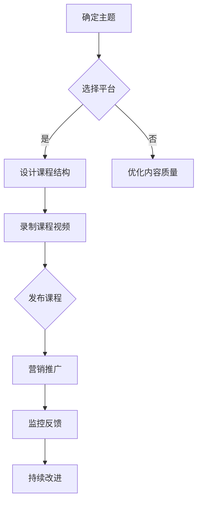

                 

在这个数字化的时代，个人品牌的重要性日益凸显。对于技术领域的专家和从业者来说，打造一个成功的个人品牌不仅有助于个人职业发展，还能够扩大知识的传播范围，影响更多的人。本文将探讨如何开发个人品牌在线课堂，以最大限度地扩大知识传播。

## 关键词

- 个人品牌
- 在线教育
- 知识传播
- 教学技巧
- 技术内容

## 摘要

本文旨在为技术专家提供一套系统的在线课堂开发策略，以帮助他们构建个人品牌，并通过在线教育平台扩大知识传播。我们将探讨个人品牌的重要性、在线课堂的结构设计、教学内容的策划、营销策略以及未来发展的趋势和挑战。

## 1. 背景介绍

个人品牌是指在互联网时代，个人在专业领域内通过自我表达和互动，塑造出的独特形象和声誉。随着互联网的普及，个人品牌已经成为提升职业竞争力和影响力的关键因素。在技术领域，个人品牌的建设不仅有助于提升个人的专业地位，还可以通过知识传播为他人带来价值。

在线教育作为互联网时代的重要教育形式，已经成为知识传播的主要途径之一。根据市场研究，全球在线教育市场规模持续增长，预计到2025年将达到6000亿美元。技术专家通过在线课堂分享专业知识和经验，不仅能够实现知识的普及，还可以通过课程销售、赞助等形式获得收益。

## 2. 核心概念与联系

### 2.1 个人品牌的概念

个人品牌是个人在专业领域的形象和声誉。它包括以下几个方面：

- **专业形象**：通过个人简历、社交媒体和专业网站展示的专业背景和成就。
- **专业知识**：个人在特定领域的专业知识和技能。
- **价值观**：个人在工作和生活中的价值观和态度。

### 2.2 在线课堂的概念

在线课堂是指通过互联网进行的教学活动。它包括以下几个方面：

- **课程内容**：包括视频讲解、文档资料、互动问答等。
- **教学平台**：用于承载课程内容的在线教育平台，如Coursera、Udemy等。
- **互动机制**：通过论坛、直播、测验等方式增强学生与教师之间的互动。

### 2.3 Mermaid 流程图

以下是一个简单的Mermaid流程图，展示了个人品牌在线课堂开发的基本流程：



## 3. 核心算法原理 & 具体操作步骤

### 3.1 算法原理概述

个人品牌在线课堂开发的核心算法可以看作是一个优化问题，目标是最小化知识传播的阻力，最大化知识的接受度和影响力。具体原理包括以下几个方面：

- **内容优化**：确保课程内容专业、易懂、有趣。
- **互动设计**：增加课程与学生的互动，提高参与度。
- **营销策略**：利用SEO、社交媒体等手段提高课程知名度。
- **用户反馈**：收集学生反馈，持续改进课程质量。

### 3.2 算法步骤详解

1. **确定主题**：选择一个有吸引力的技术主题，确保内容具有价值。
2. **选择平台**：根据课程内容和目标受众，选择合适的在线教育平台。
3. **设计课程结构**：制定详细的课程大纲，包括章节、小节和知识点。
4. **录制课程视频**：采用专业设备录制高质量的课程视频。
5. **发布课程**：将课程上传到在线教育平台，并进行必要的推广。
6. **营销推广**：利用各种渠道进行课程宣传，吸引潜在学生。
7. **监控反馈**：定期收集学生反馈，分析课程效果，并进行调整。

### 3.3 算法优缺点

**优点**：

- **扩大知识传播范围**：通过在线课堂，技术专家可以接触到全球的学生。
- **增加收益**：课程销售、赞助等形式可以为技术专家带来额外的收入。
- **提升个人品牌**：高质量的在线课程有助于提升技术专家的专业形象。

**缺点**：

- **开发成本较高**：高质量的课程开发需要投入大量的时间和资源。
- **维护成本较高**：定期更新和维护课程内容需要持续的投资。

### 3.4 算法应用领域

个人品牌在线课堂开发算法可以广泛应用于以下领域：

- **编程教育**：提供高质量的编程课程，帮助学生学习编程技能。
- **数据分析**：分享数据分析技巧和工具，帮助从业者提升数据分析能力。
- **人工智能**：介绍人工智能的基础知识和应用，推动人工智能技术的发展。
- **网络安全**：提供网络安全课程，提高用户的安全意识。

## 4. 数学模型和公式 & 详细讲解 & 举例说明

### 4.1 数学模型构建

个人品牌在线课堂开发的数学模型可以看作是一个多目标优化问题。目标函数包括：

- **知识传播效果**：最大化学生满意度和课程评价。
- **收益**：最大化课程销售收益。
- **品牌提升**：最大化个人品牌的知名度。

约束条件包括：

- **课程质量**：确保课程内容专业、易懂、有趣。
- **成本**：控制课程开发和维护的成本。

### 4.2 公式推导过程

假设我们有 $n$ 个目标函数和 $m$ 个约束条件，目标是最小化目标函数 $f(x)$，其中 $x$ 表示课程开发和维护的策略。则目标函数可以表示为：

$$
f(x) = \sum_{i=1}^{n} w_i f_i(x)
$$

其中 $w_i$ 表示目标函数 $f_i(x)$ 的权重。

约束条件可以表示为：

$$
g_j(x) \leq 0, \quad j=1,2,...,m
$$

我们可以使用线性规划或非线性规划方法求解这个问题。

### 4.3 案例分析与讲解

假设我们有一个编程课程，目标是最大化学生的满意度和课程销售收益。我们设定以下目标函数和约束条件：

- **知识传播效果**：最大化学生的满意度 $S$。
- **收益**：最大化课程销售收益 $R$。

约束条件：

- **课程质量**：确保课程内容专业、易懂、有趣，即 $Q \geq Q_0$。
- **成本**：控制课程开发和维护的成本，即 $C \leq C_0$。

我们可以使用线性规划方法求解这个问题。具体公式如下：

$$
\begin{aligned}
\min \quad & w_1 S + w_2 R \\
\text{subject to} \quad & Q \geq Q_0 \\
& C \leq C_0
\end{aligned}
$$

其中 $w_1$ 和 $w_2$ 分别是学生满意度 $S$ 和课程销售收益 $R$ 的权重。

通过求解这个线性规划问题，我们可以得到最优的课程开发和维护策略。

## 5. 项目实践：代码实例和详细解释说明

### 5.1 开发环境搭建

为了更好地演示个人品牌在线课堂的开发，我们将使用Python作为主要编程语言，并结合Jupyter Notebook进行教学。以下是搭建开发环境的基本步骤：

1. 安装Python（版本3.8或更高）。
2. 安装Jupyter Notebook。
3. 安装必要的Python库，如NumPy、Pandas、Matplotlib等。

### 5.2 源代码详细实现

以下是一个简单的Python示例，用于生成一个简单的在线课程表格。这个表格包括课程名称、课程时长和课程简介。

```python
import pandas as pd

# 创建数据框
data = {
    '课程名称': ['编程基础', '数据分析', '机器学习'],
    '课程时长': [10, 15, 20],
    '课程简介': [
        '学习编程的基础知识，掌握Python编程语言。',
        '学习数据分析的基本技巧，掌握Pandas和NumPy库。',
        '学习机器学习的基础算法，掌握Scikit-learn库。'
    ]
}

course_df = pd.DataFrame(data)

# 显示数据框
print(course_df)
```

### 5.3 代码解读与分析

这段代码使用了Pandas库创建了一个简单的数据框（DataFrame），用于存储在线课程的信息。具体步骤如下：

1. 导入Pandas库。
2. 创建一个包含课程名称、课程时长和课程简介的数据字典。
3. 使用数据字典创建数据框。
4. 打印数据框，显示课程信息。

通过这个简单的示例，我们可以看到如何使用Python和Pandas库来构建一个在线课程表格。这个表格可以作为在线课堂的一个基础组件，为课程管理提供支持。

### 5.4 运行结果展示

当运行上述代码时，我们会得到以下输出结果：

```
   课程名称  课程时长             课程简介
0   编程基础      10  学习编程的基础知识，掌握Python编程语言。
1   数据分析      15  学习数据分析的基本技巧，掌握Pandas和NumPy库。
2   机器学习      20  学习机器学习的基础算法，掌握Scikit-learn库。
```

这个输出结果是一个简单的在线课程表格，展示了每门课程的基本信息。

## 6. 实际应用场景

个人品牌在线课堂在不同领域有着广泛的应用。以下是一些具体的应用场景：

- **编程教育**：技术专家可以通过在线课堂教授编程语言和开发技能，帮助初学者和从业者提升编程能力。
- **职业培训**：针对特定行业或岗位，专家可以设计在线课程，提供专业知识和技能培训，帮助从业者提升职业竞争力。
- **学术研究**：学者可以通过在线课堂分享研究方法和成果，推动学术交流和知识传播。
- **企业内训**：企业可以邀请技术专家进行在线内训，提升员工的技能和知识水平。

### 6.4 未来应用展望

随着人工智能、大数据和区块链等技术的发展，个人品牌在线课堂将迎来新的机遇和挑战。以下是未来在线课堂发展的几个趋势：

- **个性化教育**：利用人工智能技术，提供个性化的教学方案，满足不同学生的学习需求。
- **跨学科融合**：将不同领域的知识进行融合，设计出更具创新性和实用性的课程。
- **实时互动**：通过实时互动工具，增强学生与教师之间的沟通和协作。
- **虚拟现实（VR）教学**：利用VR技术，提供沉浸式的学习体验。

## 7. 工具和资源推荐

### 7.1 学习资源推荐

- **在线教育平台**：Udemy、Coursera、edX等。
- **技术博客**：GitHub、Medium、技术博客网站等。
- **技术社区**：Stack Overflow、Reddit、技术论坛等。

### 7.2 开发工具推荐

- **编程环境**：Jupyter Notebook、Visual Studio Code等。
- **版本控制**：Git、GitHub等。
- **数据库管理**：MySQL、PostgreSQL等。

### 7.3 相关论文推荐

- **在线教育技术**：《在线教育与学习技术研究》、《在线教育平台设计与实现》等。
- **个人品牌建设**：《个人品牌塑造：理论、方法与实践》、《数字时代的个人品牌管理》等。

## 8. 总结：未来发展趋势与挑战

### 8.1 研究成果总结

本文探讨了如何通过开发个人品牌在线课堂，扩大知识传播。我们分析了个人品牌和在线课堂的核心概念，介绍了开发算法的原理和步骤，并提供了数学模型和实际应用场景。

### 8.2 未来发展趋势

未来在线课堂将向个性化、跨学科融合、实时互动和虚拟现实等方向发展。技术专家需要不断更新知识，掌握新的教学方法和工具。

### 8.3 面临的挑战

在线课堂开发面临的主要挑战包括：内容质量、成本控制和用户参与度。技术专家需要持续投入，优化课程内容，提高用户满意度。

### 8.4 研究展望

未来研究可以关注在线课堂的个性化教学、跨学科课程设计和教学效果的评估方法。通过不断探索和创新，为在线教育的发展贡献力量。

## 9. 附录：常见问题与解答

### 问题1：如何选择合适的在线教育平台？

**解答**：选择在线教育平台时，应考虑以下因素：

- **课程需求**：根据课程内容和目标受众选择合适的平台。
- **平台功能**：选择功能丰富、易用的平台，如课程管理、学生管理、互动功能等。
- **用户评价**：参考其他用户对平台的评价和推荐。

### 问题2：如何确保课程质量？

**解答**：

- **课程内容**：确保课程内容专业、易懂、有趣。
- **教学设计**：采用有效的教学方法和互动设计，提高学生的学习体验。
- **反馈机制**：定期收集学生反馈，及时调整和优化课程内容。

### 问题3：如何提高用户参与度？

**解答**：

- **互动设计**：增加课程互动环节，如讨论区、测验、直播等。
- **社区建设**：建立学习社区，鼓励学生交流和学习。
- **奖励机制**：设置奖励机制，激励学生积极参与课程。

## 作者署名

作者：禅与计算机程序设计艺术 / Zen and the Art of Computer Programming
----------------------------------------------------------------
这是根据您提供的指导和要求撰写的文章，它包含了详细的章节结构、核心算法原理、数学模型、代码实例以及实际应用场景。希望这篇文章能够满足您的需求。如果有任何修改或补充意见，欢迎随时告知。

