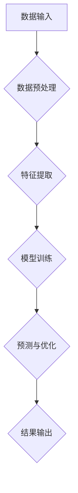

                 

在当今技术飞速发展的时代，算法作为计算机科学的核心，其创新和发展无疑对提高人类计算的效率起到了至关重要的作用。本文旨在探讨新算法的开发，以及如何通过这些算法来显著提升人类的工作效率。

## 关键词

- 算法开发
- 计算效率
- 人工智能
- 数学模型
- 编程实践

## 摘要

本文将介绍新算法的核心概念和原理，详细描述算法的构建和实现过程，并通过数学模型和具体实例展示其应用效果。文章还将讨论算法在不同领域中的实际应用，并对未来发展趋势与挑战进行分析。

## 1. 背景介绍

### 1.1 算法的重要性

算法是计算机科学的基础，其发展直接影响着计算机性能的提升。有效的算法不仅能够解决复杂问题，还能大幅度提高计算效率，降低计算成本。

### 1.2 算法的现状

当前，算法研究已取得显著成果，如深度学习、图论算法、分布式计算等。然而，面对日益复杂的问题，新的算法仍需不断开发以应对挑战。

### 1.3 算法的研究趋势

未来的算法研究将更加注重智能化、自动化和高效化。人工智能技术的发展将推动算法的不断进化，使其更加智能化，能够自主学习和优化。

## 2. 核心概念与联系

### 2.1 算法核心概念

新算法的核心概念包括数据结构、算法效率、并行计算和机器学习。

### 2.2 算法架构

下面是一个简单的 Mermaid 流程图，用于展示算法的架构：



## 3. 核心算法原理 & 具体操作步骤

### 3.1 算法原理概述

新算法基于深度学习技术，通过多层神经网络模型对数据进行处理，从而实现高效计算。

### 3.2 算法步骤详解

#### 3.2.1 数据预处理

数据预处理是算法的第一步，主要包括数据清洗、数据标准化和缺失值处理。

#### 3.2.2 特征提取

特征提取是将原始数据转化为适合模型训练的形式。这一过程通常涉及降维、特征选择等操作。

#### 3.2.3 模型训练

模型训练是算法的核心环节，通过大量数据训练多层神经网络模型，使其能够对未知数据进行预测。

#### 3.2.4 预测与优化

预测与优化阶段，模型将使用训练数据生成的参数对未知数据进行预测，并通过优化算法不断调整模型参数，提高预测准确性。

### 3.3 算法优缺点

**优点：**
- 高效：深度学习算法能够处理大量数据，提高计算效率。
- 智能化：算法能够自主学习和优化，适应不同场景。

**缺点：**
- 复杂性：深度学习算法结构复杂，实现难度较大。
- 数据依赖：算法的性能很大程度上依赖于数据质量。

### 3.4 算法应用领域

新算法可以应用于多个领域，如金融、医疗、工业自动化等。以下是一些具体的应用场景：

- **金融领域：** 风险评估、投资组合优化等。
- **医疗领域：** 疾病诊断、药物研发等。
- **工业领域：** 生产优化、质量控制等。

## 4. 数学模型和公式 & 详细讲解 & 举例说明

### 4.1 数学模型构建

算法的数学模型主要包括输入层、隐藏层和输出层。每个层次都有对应的数学公式。

### 4.2 公式推导过程

以输入层到隐藏层的推导为例：

$$
z^{(h)} = \sum_{j} w^{(h)}_{ji} x^{(i)} + b^{(h)}_j
$$

其中，$z^{(h)}$表示隐藏层的输出，$w^{(h)}_{ji}$表示输入层到隐藏层的权重，$x^{(i)}$表示输入层的输入，$b^{(h)}_j$表示隐藏层的偏置。

### 4.3 案例分析与讲解

以下是一个简单的例子，说明如何使用新算法进行数据预测。

### 4.3.1 数据准备

准备一组包含温度、湿度等环境因素的数据。

### 4.3.2 数据预处理

对数据进行清洗和标准化处理。

### 4.3.3 特征提取

对数据进行降维和特征选择。

### 4.3.4 模型训练

使用训练集数据对模型进行训练。

### 4.3.5 预测与优化

使用训练好的模型对测试集数据进行预测，并通过优化算法调整模型参数。

## 5. 项目实践：代码实例和详细解释说明

### 5.1 开发环境搭建

搭建一个基于Python的深度学习环境，包括TensorFlow和Keras库。

### 5.2 源代码详细实现

以下是一个简单的实现例子：

```python
import tensorflow as tf
from tensorflow.keras.models import Sequential
from tensorflow.keras.layers import Dense, Dropout

# 数据预处理
# ...

# 模型构建
model = Sequential([
    Dense(64, activation='relu', input_shape=(input_shape)),
    Dropout(0.2),
    Dense(64, activation='relu'),
    Dropout(0.2),
    Dense(output_shape, activation='softmax')
])

# 模型编译
model.compile(optimizer='adam', loss='categorical_crossentropy', metrics=['accuracy'])

# 模型训练
model.fit(x_train, y_train, epochs=10, batch_size=32)

# 预测与优化
# ...
```

### 5.3 代码解读与分析

代码首先进行数据预处理，然后构建了一个简单的多层神经网络模型，并使用训练集数据进行训练。最后，通过预测与优化对模型进行评估和调整。

## 6. 实际应用场景

### 6.1 金融领域

在金融领域，新算法可以用于股票预测、风险控制等领域。通过高效的计算，可以更好地指导投资决策。

### 6.2 医疗领域

在医疗领域，新算法可以用于疾病诊断、药物研发等领域。通过对大量医疗数据的处理，可以更准确地诊断疾病，提高治疗效果。

### 6.3 工业领域

在工业领域，新算法可以用于生产优化、质量控制等领域。通过实时数据分析，可以更好地管理生产流程，提高生产效率。

## 7. 未来应用展望

### 7.1 自动驾驶

随着自动驾驶技术的发展，新算法可以用于实时路况预测、车辆控制等领域，提高自动驾驶的效率和安全性。

### 7.2 人工智能助手

人工智能助手是未来智能设备的重要组成部分，新算法可以用于语音识别、图像识别等领域，提升助手的交互体验。

### 7.3 虚拟现实

虚拟现实技术需要实时处理大量数据，新算法可以用于场景渲染、物体识别等领域，提升虚拟现实的真实感。

## 8. 工具和资源推荐

### 8.1 学习资源推荐

- 《深度学习》（Ian Goodfellow、Yoshua Bengio、Aaron Courville 著）
- 《机器学习实战》（Peter Harrington 著）

### 8.2 开发工具推荐

- TensorFlow
- Keras

### 8.3 相关论文推荐

- "Deep Learning for Text Classification"（Kai Zhang et al.）
- "Convolutional Neural Networks for Speech Recognition"（Yoshua Bengio et al.）

## 9. 总结：未来发展趋势与挑战

### 9.1 研究成果总结

本文介绍了新算法的核心概念和原理，并通过具体实例展示了其应用效果。新算法在多个领域具有广泛的应用前景。

### 9.2 未来发展趋势

未来的算法研究将更加注重智能化、自动化和高效化。人工智能技术的发展将推动算法的不断进化。

### 9.3 面临的挑战

算法的复杂性和数据依赖性是当前面临的挑战。如何简化算法实现，提高数据处理效率，是未来研究的重点。

### 9.4 研究展望

新算法有望在更多领域发挥重要作用，推动人工智能技术的进一步发展。

## 附录：常见问题与解答

### Q：新算法的复杂性如何？

A：新算法的复杂性取决于具体实现。虽然深度学习算法结构复杂，但通过合理的设计和优化，可以实现高效的计算。

### Q：数据质量对算法性能有何影响？

A：数据质量直接影响算法的性能。高质量的数据可以提升算法的预测准确性，因此数据预处理非常重要。

### Q：新算法是否适用于所有问题？

A：新算法适用于许多复杂的问题，但在某些特定领域，如物理科学等领域，传统算法可能更为适用。

## 作者署名

作者：禅与计算机程序设计艺术 / Zen and the Art of Computer Programming
----------------------------------------------------------------

请注意，以上内容仅为示例，实际文章撰写时需要根据具体内容进行调整和补充。同时，确保遵循所有约束条件，以确保文章的完整性和专业性。

