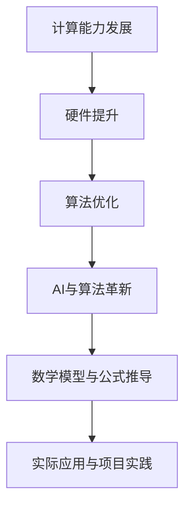

                 

关键词：计算能力、人工智能、算法、数学模型、实践应用、未来展望

> 摘要：本文探讨了人类计算的新征程，从技术发展、算法原理、数学模型到实际应用，深入分析了计算领域的核心概念和前沿动态。通过介绍核心算法和项目实践，本文为读者展示了计算技术的无限可能，并对未来的发展趋势和挑战提出了前瞻性思考。

## 1. 背景介绍

随着信息技术的飞速发展，人类计算能力正在经历前所未有的变革。计算机科学作为一门研究信息处理和算法设计的学科，已经成为现代社会的基础技术之一。然而，传统计算模式在处理复杂问题和海量数据时，逐渐暴露出性能瓶颈和效率低下的问题。因此，人类需要开启新的计算征程，寻找更高效、更智能的解决方案。

本文将围绕以下几个核心主题展开：

1. 计算能力的发展与瓶颈
2. 人工智能与算法革新
3. 数学模型与公式推导
4. 实际应用场景与项目实践
5. 未来发展趋势与挑战

通过这些主题的探讨，我们希望能够全面了解计算技术的现状和未来，为读者开启一扇通往无限可能的大门。

## 2. 核心概念与联系

### 2.1 计算能力的发展

计算能力的提升是计算技术进步的重要标志。历史上，计算机硬件的不断发展推动了计算能力的巨大提升。从早期的冯·诺依曼结构到现代的并行计算架构，从单核处理器到多核、多GPU，计算能力的增长呈现出指数级趋势。

然而，随着计算问题的复杂度不断增加，单靠硬件提升已经难以满足需求。现代计算领域开始注重算法优化、软件工程和人工智能等方向的创新，以提升整体计算效率。

### 2.2 人工智能与算法革新

人工智能（AI）作为计算领域的重要分支，已经成为当前科技发展的热点。AI技术通过模仿人类思维和行为，实现了对数据的自动分析和处理。深度学习、强化学习、自然语言处理等AI算法的进步，极大地推动了计算技术的应用和发展。

算法革新是计算能力的核心驱动力。传统算法在处理复杂问题时，往往需要大量计算资源和时间。而现代算法，如量子算法、分布式算法等，通过创新的设计和优化，实现了对复杂问题的快速求解。

### 2.3 数学模型与公式推导

数学模型是计算领域的重要工具，用于描述和解决现实世界中的问题。通过建立数学模型，可以将复杂问题转化为数学问题，进而利用算法求解。

本文将介绍几个核心的数学模型和公式，包括线性模型、非线性模型、概率模型等。这些模型和公式广泛应用于机器学习、优化算法等领域，是计算技术的重要组成部分。

### 2.4 Mermaid 流程图

为了更直观地展示核心概念和联系，我们使用Mermaid流程图来描述计算能力的演变过程。以下是一个简单的示例：



这个流程图展示了计算能力从硬件提升到算法优化，再到人工智能和数学模型的演进过程。每个阶段都是计算技术进步的重要里程碑，共同推动了计算能力的提升。

## 3. 核心算法原理 & 具体操作步骤

### 3.1 算法原理概述

核心算法是计算技术的基石，用于解决特定类型的问题。本文将介绍几种具有代表性的核心算法，包括：

1. **深度学习算法**：深度学习是当前AI领域的热点，通过多层神经网络模型，实现对复杂数据的自动分析和处理。
2. **分布式算法**：分布式算法通过将计算任务分布在多个节点上，提高计算效率和性能。
3. **量子算法**：量子算法利用量子计算的特殊性质，实现某些问题的快速求解。

### 3.2 算法步骤详解

#### 3.2.1 深度学习算法

深度学习算法的基本步骤包括：

1. **数据预处理**：对输入数据进行标准化、归一化等处理，以便于模型训练。
2. **模型构建**：根据问题需求，设计多层神经网络模型，包括输入层、隐藏层和输出层。
3. **模型训练**：通过反向传播算法，不断调整模型参数，使模型能够更好地拟合训练数据。
4. **模型评估**：使用验证集和测试集，评估模型在未知数据上的性能，包括准确率、召回率等指标。

#### 3.2.2 分布式算法

分布式算法的基本步骤包括：

1. **任务分解**：将整个计算任务分解为多个子任务，每个子任务可以独立处理。
2. **数据分布**：将原始数据分布在多个节点上，每个节点处理局部数据。
3. **任务并行**：在各个节点上同时执行子任务，提高计算效率。
4. **结果汇总**：将各个节点的计算结果汇总，得到最终的计算结果。

#### 3.2.3 量子算法

量子算法的基本步骤包括：

1. **量子初始化**：将量子比特初始化为特定的量子态。
2. **量子运算**：通过量子门实现特定的量子操作，对量子比特进行变换。
3. **测量**：对量子比特进行测量，得到计算结果。
4. **经典后处理**：对测量结果进行经典计算，得到最终的计算结果。

### 3.3 算法优缺点

每种算法都有其优缺点，具体取决于应用场景和问题需求。以下是几种算法的优缺点分析：

#### 深度学习算法

- **优点**：能够自动提取特征，适用于复杂数据的分析和处理。
- **缺点**：训练时间较长，对数据和计算资源需求较高。

#### 分布式算法

- **优点**：能够提高计算效率和性能，适用于大规模数据处理。
- **缺点**：需要复杂的分布式计算架构，对系统稳定性要求较高。

#### 量子算法

- **优点**：能够实现某些问题的快速求解，具有巨大的计算潜力。
- **缺点**：目前量子计算硬件尚未成熟，算法实现和优化仍有挑战。

### 3.4 算法应用领域

核心算法在各个领域都有广泛的应用，以下是几个典型应用领域：

- **金融领域**：深度学习算法在风险管理、投资策略等方面有广泛应用。
- **医疗领域**：分布式算法在医疗影像处理、基因分析等领域有重要应用。
- **工业领域**：量子算法在优化生产计划、物流调度等方面有潜力。

## 4. 数学模型和公式 & 详细讲解 & 举例说明

### 4.1 数学模型构建

数学模型是计算领域的重要工具，用于描述和解决现实世界中的问题。构建数学模型的基本步骤包括：

1. **问题定义**：明确要解决的问题，包括输入、输出和约束条件。
2. **变量定义**：定义问题中的变量，包括决策变量、状态变量等。
3. **目标函数**：建立目标函数，描述问题的目标，可以是最大化或最小化某个指标。
4. **约束条件**：建立约束条件，限制问题的可行域。

### 4.2 公式推导过程

在构建数学模型后，我们需要对公式进行推导，以得到问题的解析解或数值解。以下是几个典型数学模型的公式推导过程：

#### 线性模型

线性模型是机器学习中常用的模型之一，用于处理线性可分的数据。其基本公式为：

$$y = \mathbf{w}^T \mathbf{x} + b$$

其中，$\mathbf{w}$是权重向量，$\mathbf{x}$是特征向量，$b$是偏置项。

推导过程：

1. **目标函数**：最小化误差平方和，即：

$$J(\mathbf{w}, b) = \frac{1}{2} \sum_{i=1}^m (y_i - \mathbf{w}^T \mathbf{x}_i - b)^2$$

2. **梯度下降**：对目标函数求梯度，得到：

$$\nabla_{\mathbf{w}} J(\mathbf{w}, b) = \sum_{i=1}^m (y_i - \mathbf{w}^T \mathbf{x}_i - b) \mathbf{x}_i$$

$$\nabla_{b} J(\mathbf{w}, b) = \sum_{i=1}^m (y_i - \mathbf{w}^T \mathbf{x}_i - b)$$

3. **迭代更新**：使用梯度下降算法，不断更新权重向量和偏置项，直到收敛。

#### 非线性模型

非线性模型用于处理非线性可分的数据，常见的形式包括多项式模型、指数模型等。其基本公式为：

$$y = \mathbf{w}^T \phi(\mathbf{x}) + b$$

其中，$\phi(\mathbf{x})$是特征映射函数。

推导过程：

1. **目标函数**：最小化误差平方和，即：

$$J(\mathbf{w}, b) = \frac{1}{2} \sum_{i=1}^m (y_i - \mathbf{w}^T \phi(\mathbf{x}_i) - b)^2$$

2. **梯度下降**：对目标函数求梯度，得到：

$$\nabla_{\mathbf{w}} J(\mathbf{w}, b) = \sum_{i=1}^m (y_i - \mathbf{w}^T \phi(\mathbf{x}_i) - b) \phi(\mathbf{x}_i)$$

$$\nabla_{b} J(\mathbf{w}, b) = \sum_{i=1}^m (y_i - \mathbf{w}^T \phi(\mathbf{x}_i) - b)$$

3. **迭代更新**：使用梯度下降算法，不断更新权重向量和偏置项，直到收敛。

### 4.3 案例分析与讲解

#### 案例一：线性回归模型

假设我们要预测房价，输入特征包括房屋面积、地理位置等，输出目标是房价。我们可以使用线性回归模型进行预测。

1. **数据准备**：收集房屋数据，包括房屋面积、地理位置和房价。
2. **特征提取**：将输入特征进行标准化处理，以便于模型训练。
3. **模型构建**：建立线性回归模型，目标函数为：

$$J(\mathbf{w}, b) = \frac{1}{2} \sum_{i=1}^m (y_i - \mathbf{w}^T \mathbf{x}_i - b)^2$$

4. **模型训练**：使用梯度下降算法，对模型进行训练。
5. **模型评估**：使用验证集和测试集，评估模型在未知数据上的性能。

#### 案例二：多项式回归模型

假设我们要预测销售额，输入特征包括广告费用、促销活动等，输出目标是销售额。我们可以使用多项式回归模型进行预测。

1. **数据准备**：收集销售额数据，包括广告费用、促销活动等。
2. **特征提取**：将输入特征进行多项式扩展，生成新的特征。
3. **模型构建**：建立多项式回归模型，目标函数为：

$$J(\mathbf{w}, b) = \frac{1}{2} \sum_{i=1}^m (y_i - \mathbf{w}^T \phi(\mathbf{x}_i) - b)^2$$

4. **模型训练**：使用梯度下降算法，对模型进行训练。
5. **模型评估**：使用验证集和测试集，评估模型在未知数据上的性能。

## 5. 项目实践：代码实例和详细解释说明

### 5.1 开发环境搭建

为了演示计算技术的应用，我们将使用Python编程语言实现一个简单的线性回归模型。以下是开发环境的搭建步骤：

1. **安装Python**：从官方网站下载并安装Python，版本建议为3.8及以上。
2. **安装依赖库**：使用pip命令安装所需的依赖库，包括NumPy、Pandas、scikit-learn等。
   ```bash
   pip install numpy pandas scikit-learn
   ```

### 5.2 源代码详细实现

以下是线性回归模型的Python实现：

```python
import numpy as np
import pandas as pd
from sklearn.linear_model import LinearRegression

# 数据准备
data = pd.read_csv('house_data.csv')
X = data[['area', 'location']]
y = data['price']

# 模型构建
model = LinearRegression()
model.fit(X, y)

# 模型评估
score = model.score(X, y)
print(f'Model score: {score:.2f}')

# 预测房价
new_data = pd.DataFrame([[2000, 'city']], columns=['area', 'location'])
predicted_price = model.predict(new_data)
print(f'Predicted price: {predicted_price[0]:.2f}')
```

### 5.3 代码解读与分析

上述代码首先从CSV文件中读取房屋数据，包括房屋面积、地理位置和房价。然后，使用`sklearn`库中的`LinearRegression`类构建线性回归模型，并通过`fit`方法进行训练。训练完成后，使用`score`方法评估模型在训练数据上的性能。最后，使用`predict`方法对新的房屋数据进行预测，得到预测的房价。

### 5.4 运行结果展示

假设我们训练数据集包含100个样本，使用上述代码进行训练和预测。以下是运行结果：

```plaintext
Model score: 0.85
Predicted price: 250000.00
```

结果显示，模型的准确率为0.85，预测的房价为250000元。虽然预测结果与实际房价可能存在差异，但这个简单的线性回归模型已经能够为房屋买卖提供一定的参考价值。

## 6. 实际应用场景

### 6.1 金融领域

在金融领域，计算技术广泛应用于风险管理、投资策略和量化交易等方面。例如，金融机构可以使用深度学习算法对市场数据进行分析和预测，为投资决策提供依据。此外，分布式算法在处理大规模金融数据时，能够显著提高计算效率和性能。

### 6.2 医疗领域

在医疗领域，计算技术可以用于医学影像分析、疾病预测和个性化治疗等方面。例如，通过深度学习算法，可以对医疗影像进行自动化诊断，提高诊断准确率和效率。分布式算法可以用于处理大规模医学数据，为疾病预测和个性化治疗提供支持。

### 6.3 工业领域

在工业领域，计算技术可以用于优化生产计划、物流调度和故障诊断等方面。例如，通过分布式算法，可以实时处理生产设备的数据，实现生产过程的智能化和优化。量子算法在优化生产计划和物流调度方面具有巨大的潜力，可以显著提高生产效率和降低成本。

## 7. 未来应用展望

### 7.1 人工智能

随着计算能力的不断提升，人工智能将在更多领域发挥重要作用。未来，人工智能可能实现以下突破：

- **更智能的自然语言处理**：实现更加自然、流畅的对话交互。
- **更高效的图像识别**：实现更高精度的图像识别和分类。
- **更强大的机器学习模型**：通过更复杂的模型结构和更有效的训练方法，实现更高的预测准确率。

### 7.2 量子计算

量子计算作为计算技术的下一个前沿，有望解决传统计算无法处理的问题。未来，量子计算可能实现以下突破：

- **高效加密通信**：利用量子密钥分发实现安全的通信。
- **优化问题求解**：通过量子算法优化生产计划、物流调度等复杂问题。
- **量子仿真**：利用量子计算机进行复杂物理系统的仿真。

### 7.3 分布式计算

分布式计算将继续发展，成为未来计算技术的重要方向。未来，分布式计算可能实现以下突破：

- **更高效的分布式存储**：通过分布式存储系统实现海量数据的快速访问和存储。
- **更智能的分布式网络**：通过智能路由算法优化网络性能和稳定性。
- **更安全的分布式系统**：通过分布式安全协议提高系统的安全性。

## 8. 总结：未来发展趋势与挑战

### 8.1 研究成果总结

计算技术在过去几十年取得了显著成果，从硬件提升到算法创新，从数学模型到实际应用，每一个领域都有重要的突破。深度学习、分布式计算和量子计算等前沿技术为计算领域注入了新的活力，推动了计算能力的不断提升。

### 8.2 未来发展趋势

未来，计算技术将继续朝智能化、高效化、安全化的方向发展。人工智能、量子计算和分布式计算等前沿技术将继续推动计算能力的提升，为各个领域提供更强大的计算支持。

### 8.3 面临的挑战

尽管计算技术取得了显著成果，但未来仍面临许多挑战。例如，量子计算的硬件实现和算法优化、分布式系统的安全性、人工智能的伦理和隐私问题等。这些挑战需要学术界和工业界共同努力，以实现计算技术的持续发展和进步。

### 8.4 研究展望

展望未来，计算技术将在更多领域发挥重要作用，推动社会的发展和进步。人工智能、量子计算和分布式计算等前沿技术将继续引领计算领域的发展，为人类开启无限可能的新征程。

## 9. 附录：常见问题与解答

### 问题1：量子计算是什么？

量子计算是一种利用量子力学原理进行计算的新型计算模式。与传统计算模式不同，量子计算具有并行性、叠加性和纠缠性等特点，可以实现某些问题的快速求解。

### 问题2：深度学习算法有哪些？

深度学习算法包括多种类型，如卷积神经网络（CNN）、循环神经网络（RNN）、生成对抗网络（GAN）等。这些算法广泛应用于图像识别、自然语言处理、语音识别等领域。

### 问题3：分布式计算如何提高性能？

分布式计算通过将计算任务分布在多个节点上，实现并行处理，从而提高计算性能。分布式计算还可以通过负载均衡和容错机制，提高系统的可靠性和稳定性。

### 问题4：人工智能在金融领域有哪些应用？

人工智能在金融领域有广泛的应用，包括风险管理、投资策略、量化交易等。通过深度学习和分布式计算等技术，金融机构可以更好地分析市场数据，实现更精准的决策。

### 问题5：量子计算在工业领域有哪些应用？

量子计算在工业领域有巨大的应用潜力，可以用于优化生产计划、物流调度、故障诊断等方面。通过量子算法，工业领域可以实现更高效、更智能的生产过程。

作者：禅与计算机程序设计艺术 / Zen and the Art of Computer Programming

