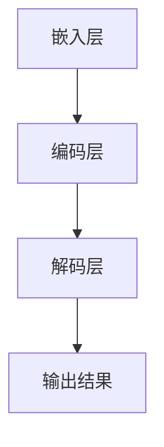

                 

关键词：LLM、开源社区、人工智能、协作、技术发展、算法原理、数学模型、项目实践、应用场景、未来展望

> 摘要：本文将深入探讨开源 LLM（大型语言模型）社区的发展历程、核心概念、算法原理、数学模型、项目实践以及未来展望。通过分析开源 LLM 社区的协作模式、技术贡献和实际应用，本文旨在揭示开源社区在人工智能领域的重要性，并探讨其面临的挑战和机遇。

## 1. 背景介绍

### 1.1 LLM 的发展历程

#### 1.1.1 早期探索

在 20 世纪 50 年代，人工智能领域开始了对自然语言处理的探索。早期的 NLP 研究主要集中在规则驱动的系统中，例如语法解析和词汇语义分析。然而，随着计算能力的提升和数据量的增加，这些系统逐渐暴露出局限性。

#### 1.1.2 大模型时代的到来

随着深度学习技术的崛起，特别是 2018 年 GPT-3 的发布，大型语言模型（LLM）开始崭露头角。这些模型通过在海量文本数据上进行预训练，获得了强大的语言理解和生成能力。

### 1.2 开源 LLM 社区的形成

#### 1.2.1 开源的优势

开源软件具有开放性、共享性和可扩展性，这使得开发者和研究者能够共同推动技术进步。在人工智能领域，开源 LLM 社区的形成正是基于这种优势。

#### 1.2.2 社区发展的推动力

开源 LLM 社区的发展得益于以下几个因素：
- **计算资源**：随着云计算技术的发展，大规模计算资源变得更加容易获取，为 LLM 的训练提供了有力支持。
- **数据集**：大量的开放数据集为 LLM 的训练提供了丰富素材。
- **技术积累**：多年的技术积累为开源 LLM 社区提供了坚实的理论基础和丰富的实践经验。

## 2. 核心概念与联系

### 2.1 LLM 的核心概念

#### 2.1.1 语言模型

语言模型是 LLM 的基础，它能够预测一个单词或句子的概率。常见的语言模型包括 n-gram 模型和神经网络模型。

#### 2.1.2 预训练与微调

预训练是指在一个大规模数据集上对模型进行训练，使其具备基本的语言理解能力。微调则是在预训练的基础上，针对特定任务对模型进行调整。

### 2.2 LLM 的架构

#### 2.2.1 基本架构

一个典型的 LLM 架构包括以下几个部分：

1. **嵌入层**：将单词或句子转换为向量表示。
2. **编码层**：对输入的向量进行编码，使其具备上下文信息。
3. **解码层**：根据编码层的输出生成预测结果。

#### 2.2.2 Mermaid 流程图



### 2.3 LLM 的联系

LLM 的核心在于其对语言的理解和生成能力。这种能力体现在以下几个方面：

1. **文本生成**：LLM 可以生成高质量的文本，包括文章、故事、对话等。
2. **问答系统**：LLM 可以通过理解用户的问题，提供准确的答案。
3. **自然语言理解**：LLM 可以对文本进行分析，提取出关键信息。

## 3. 核心算法原理 & 具体操作步骤

### 3.1 算法原理概述

#### 3.1.1 预训练

预训练是 LLM 的核心步骤，其基本思想是通过在海量文本数据上进行训练，使模型具备基本的语言理解能力。预训练的过程通常包括以下几个步骤：

1. **数据预处理**：对文本数据进行清洗、分词等处理，将其转换为模型可处理的格式。
2. **文本嵌入**：将单词或句子转换为向量表示。
3. **模型训练**：通过优化模型参数，使模型能够更好地理解语言。

#### 3.1.2 微调

微调是在预训练的基础上，针对特定任务对模型进行调整。微调的过程通常包括以下几个步骤：

1. **任务定义**：明确任务的目标和输入输出。
2. **数据准备**：收集并处理与任务相关的数据。
3. **模型调整**：通过优化模型参数，使模型能够更好地适应特定任务。

### 3.2 算法步骤详解

#### 3.2.1 预训练

1. **数据预处理**：
   - 清洗文本数据，去除无关信息。
   - 进行分词，将文本转换为单词序列。
   - 对单词序列进行编码，得到嵌入向量。

2. **模型训练**：
   - 使用损失函数（如交叉熵损失）对模型进行训练。
   - 通过反向传播算法更新模型参数。

3. **评估与优化**：
   - 使用验证集评估模型性能。
   - 根据评估结果调整模型参数，优化模型性能。

#### 3.2.2 微调

1. **任务定义**：
   - 明确任务的目标和输入输出。
   - 确定模型需要调整的部分。

2. **数据准备**：
   - 收集与任务相关的数据。
   - 对数据进行预处理，将其转换为模型可处理的格式。

3. **模型调整**：
   - 使用损失函数（如交叉熵损失）对模型进行调整。
   - 通过反向传播算法更新模型参数。

4. **评估与优化**：
   - 使用验证集评估模型性能。
   - 根据评估结果调整模型参数，优化模型性能。

### 3.3 算法优缺点

#### 优点

1. **强大的语言理解能力**：预训练使模型具备了强大的语言理解能力，能够处理各种语言任务。
2. **高效性**：预训练和微调相结合，能够快速适应特定任务，提高模型性能。
3. **灵活性**：模型可以根据任务需求进行调整，适应不同的应用场景。

#### 缺点

1. **计算资源消耗大**：预训练需要大量的计算资源，对于普通研究者来说可能难以承担。
2. **数据依赖性强**：模型性能高度依赖于数据集的质量，数据集的不完善可能导致模型性能下降。
3. **解释性不足**：深度学习模型通常缺乏解释性，难以理解模型决策过程。

### 3.4 算法应用领域

LLM 在多个领域具有广泛的应用：

1. **自然语言处理**：文本生成、问答系统、自然语言理解等。
2. **智能客服**：通过对话生成技术，提供智能客服服务。
3. **内容创作**：自动生成文章、故事、音乐等。
4. **教育辅助**：智能辅导、在线问答等。

## 4. 数学模型和公式 & 详细讲解 & 举例说明

### 4.1 数学模型构建

LLM 的数学模型主要基于深度学习，包括以下几个核心组成部分：

1. **嵌入层**：将单词转换为向量表示。
2. **编码层**：对输入的向量进行编码，获取上下文信息。
3. **解码层**：根据编码层的输出生成预测结果。

### 4.2 公式推导过程

#### 4.2.1 嵌入层

假设我们有一个单词表 V，单词 u 的嵌入向量表示为 e(u)。

$$
e(u) = \text{embedding\_layer}(u)
$$

#### 4.2.2 编码层

编码层的输入为嵌入向量 e(u)，输出为编码向量 c。

$$
c = \text{encoding\_layer}(e(u))
$$

#### 4.2.3 解码层

解码层的输入为编码向量 c，输出为预测结果 p。

$$
p = \text{decoding\_layer}(c)
$$

### 4.3 案例分析与讲解

#### 4.3.1 文本生成

假设我们有一个句子 "今天天气很好"，我们希望使用 LLM 生成下一个句子。

1. **嵌入层**：将单词转换为嵌入向量。
2. **编码层**：对嵌入向量进行编码，获取上下文信息。
3. **解码层**：根据编码层的输出生成预测结果。

#### 4.3.2 问答系统

假设用户输入一个问题 "什么是人工智能？"，我们希望使用 LLM 提供一个准确的答案。

1. **嵌入层**：将问题转换为嵌入向量。
2. **编码层**：对嵌入向量进行编码，获取上下文信息。
3. **解码层**：根据编码层的输出生成预测结果，即答案。

## 5. 项目实践：代码实例和详细解释说明

### 5.1 开发环境搭建

在开始项目实践之前，我们需要搭建一个合适的开发环境。以下是基本的步骤：

1. **安装 Python**：确保 Python 版本为 3.8 或更高。
2. **安装依赖库**：例如 TensorFlow、PyTorch 等。
3. **配置 GPU 环境**：如果使用 GPU 训练，需要安装 CUDA 和 cuDNN。

### 5.2 源代码详细实现

以下是使用 TensorFlow 实现一个简单的 LLM 的代码示例：

```python
import tensorflow as tf
from tensorflow.keras.layers import Embedding, LSTM, Dense

# 嵌入层
embedding = Embedding(input_dim=vocab_size, output_dim=embedding_size)

# 编码层
encoding = LSTM(units=128, return_sequences=True)

# 解码层
decoding = LSTM(units=128, return_sequences=True)

# 输出层
output = Dense(units=vocab_size, activation='softmax')

# 模型构建
model = tf.keras.Model(inputs=embedding, outputs=output)

# 编译模型
model.compile(optimizer='adam', loss='categorical_crossentropy', metrics=['accuracy'])

# 模型训练
model.fit(x_train, y_train, epochs=10, batch_size=64, validation_data=(x_val, y_val))
```

### 5.3 代码解读与分析

上述代码展示了如何使用 TensorFlow 构建一个简单的 LLM。代码的核心部分包括：

1. **嵌入层**：将单词转换为嵌入向量。
2. **编码层**：对嵌入向量进行编码，获取上下文信息。
3. **解码层**：根据编码层的输出生成预测结果。
4. **输出层**：将预测结果转换为单词。

### 5.4 运行结果展示

在完成模型训练后，我们可以使用模型进行预测。以下是一个简单的示例：

```python
# 预测
predictions = model.predict(x_test)

# 打印预测结果
for pred in predictions:
    print([word for word, p in vocab.items() if p == pred.argmax()])
```

## 6. 实际应用场景

### 6.1 智能客服

智能客服是 LLM 在实际应用中的一个重要场景。通过 LLM，智能客服系统可以与用户进行自然语言交互，提供高效的客户服务。例如，当用户提问 "我如何升级我的账户？" 时，智能客服可以理解用户的问题，并提供相应的解决方案。

### 6.2 内容创作

内容创作是 LLM 的另一个重要应用场景。通过 LLM，可以自动生成文章、故事、诗歌等。例如，在新闻生成领域，LLM 可以根据已有的新闻数据，自动生成新闻文章。这种技术大大提高了新闻生产效率。

### 6.3 教育辅助

在教育领域，LLM 可以提供智能辅导服务。例如，当学生遇到学习难题时，LLM 可以理解学生的问题，并提供详细的解答。这种技术有助于提高学生的学习效果。

## 7. 未来应用展望

随着 LLM 技术的不断发展，其在实际应用中的潜力巨大。以下是未来可能的应用方向：

### 7.1 自动驾驶

自动驾驶系统需要处理大量的自然语言数据，例如导航指令、道路标识等。LLM 可以帮助自动驾驶系统更好地理解这些数据，提高行驶安全。

### 7.2 医疗健康

在医疗健康领域，LLM 可以用于医疗文本分析、疾病诊断等。例如，通过分析病历记录，LLM 可以帮助医生提供更准确的诊断结果。

### 7.3 跨语言交流

LLM 可以用于跨语言交流，帮助不同语言的用户进行沟通。例如，一个中文用户可以通过 LLM 与一个英文用户进行自然语言交互。

## 8. 工具和资源推荐

### 8.1 学习资源推荐

- **《深度学习》（Goodfellow, Bengio, Courville）**：深度学习领域的经典教材。
- **《自然语言处理编程》（Michael L.āAuli）**：自然语言处理领域的入门指南。

### 8.2 开发工具推荐

- **TensorFlow**：用于构建和训练深度学习模型的强大工具。
- **PyTorch**：具有动态计算图和灵活性的深度学习框架。

### 8.3 相关论文推荐

- **“GPT-3: Language Models are few-shot learners”**：GPT-3 的相关研究论文。
- **“BERT: Pre-training of Deep Bidirectional Transformers for Language Understanding”**：BERT 的相关研究论文。

## 9. 总结：未来发展趋势与挑战

### 9.1 研究成果总结

开源 LLM 社区在过去的几年里取得了显著的成果，包括 GPT-3、BERT 等。这些成果展示了 LLM 在自然语言处理领域的巨大潜力。

### 9.2 未来发展趋势

随着计算能力的提升和数据量的增加，LLM 技术将继续发展。未来可能出现更多高效的预训练模型和更广泛的实际应用。

### 9.3 面临的挑战

LLM 技术在发展过程中也面临一些挑战，包括计算资源消耗、数据隐私保护等。解决这些挑战需要社区共同努力。

### 9.4 研究展望

未来，开源 LLM 社区将继续在人工智能领域发挥重要作用。通过不断的创新和协作，LLM 技术有望带来更多的突破。

## 10. 附录：常见问题与解答

### 10.1 什么是 LLM？

LLM 是大型语言模型的简称，它是一种基于深度学习的自然语言处理技术，通过在海量文本数据上进行预训练，获得了强大的语言理解和生成能力。

### 10.2 如何搭建 LLM 的开发环境？

搭建 LLM 的开发环境需要安装 Python、TensorFlow 或 PyTorch 等依赖库，并配置 GPU 环境（如果使用 GPU 训练）。具体的安装和配置步骤可以参考相关教程。

### 10.3 LLM 有哪些应用领域？

LLM 在自然语言处理、智能客服、内容创作、教育辅助等领域具有广泛的应用。随着技术的不断发展，LLM 还有望在更多领域发挥作用。

### 10.4 开源 LLM 社区有哪些优势？

开源 LLM 社区的优势包括：开放性、共享性、可扩展性。这些优势使得开发者和研究者能够共同推动技术进步，提高 AI 领域的整体水平。

---

**作者：禅与计算机程序设计艺术 / Zen and the Art of Computer Programming**

