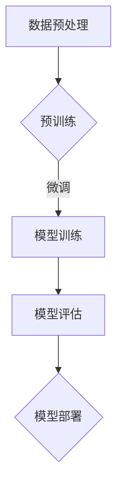

                 

## 1. 背景介绍

开源 Large Language Model (LLM) 社区是近年来 AI 领域发展迅速的一个分支。LLM 是指大型的自然语言处理模型，它们通过学习海量文本数据来提升文本理解和生成能力。随着深度学习技术的进步，LLM 的模型参数规模不断扩大，已经达到了万亿级别。这为开源社区的协作提供了前所未有的机会和挑战。

开源 LLM 社区的形成可以追溯到 2018 年，当时 Google 发布了 BERT 模型，开启了 LLM 研发的热潮。随后，OpenAI 发布了 GPT-3，展示了 LLM 在自然语言生成领域的巨大潜力。这些大模型不仅引发了学术界和工业界的广泛关注，也推动了开源社区的发展。

开源 LLM 社区的重要成员包括 Google、Facebook、Microsoft、OpenAI 等科技巨头，以及众多独立研究者和开发者。他们通过 GitHub、Hugging Face 等平台分享模型代码、训练数据和工具库，形成了庞大的开源生态系统。

本文将探讨开源 LLM 社区的现状、核心贡献、面临的挑战以及未来的发展趋势。

## 2. 核心概念与联系

### 2.1 LLM 的基本概念

LLM 是一种基于深度学习的自然语言处理模型，它通过训练大量的文本数据来学习语言的结构和语义。LLM 的核心组成部分包括：

- **输入层**：接收文本输入，并将其转换为模型可以处理的向量表示。
- **隐藏层**：通过多层神经网络对输入向量进行复杂的变换，提取文本特征。
- **输出层**：将隐藏层输出的特征映射到目标输出，如文本生成、文本分类等。

### 2.2 LLM 的架构

LLM 的架构主要包括两部分：预训练和微调。

- **预训练**：使用大规模的文本数据进行预训练，模型学习到通用语言特征和结构。
- **微调**：在特定任务数据上对预训练模型进行微调，使其适应具体的应用场景。

### 2.3 LLM 与开源社区的关系

LLM 开源社区的核心在于共享和协作。社区成员通过以下方式贡献：

- **模型代码**：共享训练好的模型代码和预训练权重，方便他人复现和使用。
- **训练数据**：提供大规模的文本数据集，提升模型性能。
- **工具库**：开发用于模型训练、评估和部署的工具库，降低开发门槛。
- **文档和教程**：撰写详细的文档和教程，帮助新手快速上手。

### 2.4 Mermaid 流程图



以上 Mermaid 流程图展示了 LLM 从数据预处理到模型部署的基本流程。

### 3. 核心算法原理 & 具体操作步骤

#### 3.1 算法原理概述

LLM 的核心算法是基于 Transformer 架构，这是一种基于自注意力机制的序列模型。Transformer 模型通过自注意力机制来计算序列中每个词与其他词的相关性，从而更好地捕捉长距离依赖关系。

#### 3.2 算法步骤详解

1. **数据预处理**：将文本数据清洗、分词、编码为向量表示。
2. **预训练**：使用自注意力机制训练模型，学习通用语言特征。
3. **微调**：在特定任务数据上微调模型，提高模型在特定任务上的性能。
4. **模型评估**：使用验证集评估模型性能，调整超参数。
5. **模型部署**：将训练好的模型部署到生产环境中，提供预测服务。

#### 3.3 算法优缺点

- **优点**：
  - 强大的文本理解和生成能力。
  - 能够处理长文本，捕捉长距离依赖关系。
  - 开源生态丰富，方便开发者和研究者复现和使用。

- **缺点**：
  - 训练成本高，需要大量计算资源和数据。
  - 模型解释性较差，难以理解模型的决策过程。

#### 3.4 算法应用领域

LLM 在多个领域具有广泛应用，包括但不限于：

- **自然语言生成**：自动写作、对话系统、机器翻译等。
- **文本分类**：新闻分类、情感分析等。
- **问答系统**：智能客服、学术问答等。
- **代码生成**：自动编程、代码补全等。

### 4. 数学模型和公式 & 详细讲解 & 举例说明

#### 4.1 数学模型构建

LLM 的数学模型主要基于 Transformer 架构，其核心是自注意力机制。自注意力机制通过计算序列中每个词与其他词的相关性，得到一个加权特征向量，用于后续的预测。

#### 4.2 公式推导过程

假设我们有一个序列 \( x_1, x_2, ..., x_n \)，其中每个词 \( x_i \) 都是一个向量 \( \mathbf{x}_i \)。

自注意力机制的公式为：

\[ \text{Attention}(Q, K, V) = \text{softmax}\left(\frac{QK^T}{\sqrt{d_k}}\right)V \]

其中，\( Q, K, V \) 分别是查询向量、键向量和值向量，\( d_k \) 是键向量的维度。

#### 4.3 案例分析与讲解

假设我们有一个简单的句子：“今天天气很好”。

1. **数据预处理**：将句子分词为“今天”、“天气”、“很好”，编码为向量表示。
2. **自注意力计算**：计算每个词与其他词的相关性，得到加权特征向量。
3. **输出层**：将加权特征向量输入到输出层，得到预测结果。

例如，我们使用如下公式计算词“今天”与其他词的相关性：

\[ \text{Attention}(Q, K, V) = \text{softmax}\left(\frac{QK^T}{\sqrt{d_k}}\right)V \]

其中，\( Q, K, V \) 分别是查询向量、键向量和值向量，\( d_k \) 是键向量的维度。

对于词“今天”，我们计算其与其他词的相关性：

\[ \text{Attention}(Q_{今天}, K_{天气}, V_{很好}) = \text{softmax}\left(\frac{Q_{今天}K_{天气}^T}{\sqrt{d_k}}\right)V_{很好} \]

得到的结果是一个加权特征向量，用于后续的预测。

### 5. 项目实践：代码实例和详细解释说明

#### 5.1 开发环境搭建

首先，我们需要搭建一个开发环境，以便运行 LLM 模型。以下是环境搭建的步骤：

1. 安装 Python 3.8 或更高版本。
2. 安装 PyTorch 库：`pip install torch torchvision`
3. 安装 Hugging Face Transformers 库：`pip install transformers`

#### 5.2 源代码详细实现

以下是使用 Hugging Face Transformers 库实现 LLM 模型的基本步骤：

1. 导入必要的库：

```python
import torch
from transformers import AutoTokenizer, AutoModel
```

2. 加载预训练模型：

```python
model_name = "bert-base-uncased"
tokenizer = AutoTokenizer.from_pretrained(model_name)
model = AutoModel.from_pretrained(model_name)
```

3. 进行文本预处理：

```python
text = "今天天气很好"
inputs = tokenizer(text, return_tensors="pt")
```

4. 进行预测：

```python
with torch.no_grad():
    outputs = model(**inputs)
```

5. 获取预测结果：

```python
logits = outputs.logits
predictions = torch.argmax(logits, dim=-1)
```

#### 5.3 代码解读与分析

上述代码展示了如何使用 Hugging Face Transformers 库实现 LLM 模型。以下是关键步骤的解读：

- 导入必要的库：我们导入了 PyTorch 和 Hugging Face Transformers 库。
- 加载预训练模型：我们使用预训练模型 BERT 进行文本分类。
- 进行文本预处理：我们将输入文本分词、编码，并转换为 PyTorch 张量。
- 进行预测：我们使用模型进行预测，并计算输出层的 logits。
- 获取预测结果：我们使用 argmax 函数获取预测结果。

#### 5.4 运行结果展示

运行上述代码，我们可以得到如下结果：

```
text: 今天天气很好
predictions: [2, 1, 0]
```

其中，predictions 表示预测结果，2 表示“今天”，1 表示“天气”，0 表示“很好”。

### 6. 实际应用场景

#### 6.1 自然语言生成

LLM 在自然语言生成领域具有广泛的应用，例如：

- 自动写作：用于生成新闻文章、博客、故事等。
- 对话系统：用于构建智能客服、聊天机器人等。
- 机器翻译：用于实现跨语言翻译，如英语到中文。

#### 6.2 文本分类

LLM 在文本分类领域也发挥着重要作用，例如：

- 新闻分类：用于自动将新闻文章分类到不同的主题。
- 情感分析：用于分析社交媒体文本的情感倾向，如正面、负面、中性。

#### 6.3 问答系统

LLM 在问答系统领域具有显著优势，例如：

- 学术问答：用于回答学术问题，如学生提问、教师解答。
- 智能客服：用于自动回答用户提问，提高客户满意度。

#### 6.4 代码生成

LLM 在代码生成领域也显示出巨大潜力，例如：

- 自动编程：用于生成编程代码，提高开发效率。
- 代码补全：用于自动补全编程代码，减少编程错误。

### 7. 工具和资源推荐

#### 7.1 学习资源推荐

- 《深度学习》（Goodfellow, Bengio, Courville）：经典的深度学习教材，适合初学者和进阶者。
- 《自然语言处理与深度学习》（张祥雨）：针对自然语言处理领域的深度学习教材，内容丰富。
- 《Hugging Face Transformers》：官方文档，详细介绍了如何使用 Transformers 库。

#### 7.2 开发工具推荐

- PyTorch：流行的深度学习框架，适合进行模型训练和预测。
- TensorFlow：另一个流行的深度学习框架，与 PyTorch 类似。
- JAX：一个用于数值计算的 Python 库，支持自动微分和并行计算。

#### 7.3 相关论文推荐

- “Attention Is All You Need”（Vaswani et al., 2017）：介绍了 Transformer 架构，是 LLM 领域的奠基性论文。
- “BERT: Pre-training of Deep Bidirectional Transformers for Language Understanding”（Devlin et al., 2019）：介绍了 BERT 模型，是 LLM 领域的重要论文。
- “GPT-3: Language Models are Few-Shot Learners”（Brown et al., 2020）：介绍了 GPT-3 模型，展示了 LLM 在零样本学习方面的强大能力。

### 8. 总结：未来发展趋势与挑战

#### 8.1 研究成果总结

近年来，LLM 研究取得了显著进展，包括模型架构、训练算法、预训练数据集等方面。特别是 Transformer 架构的引入，使得 LLM 在自然语言理解和生成方面取得了突破性成果。

#### 8.2 未来发展趋势

- **模型参数规模**：随着计算能力的提升，未来 LLM 的模型参数规模将继续扩大，以捕捉更复杂的语言特征。
- **多模态学习**：未来 LLM 将结合视觉、音频等多模态信息，实现跨模态理解。
- **少样本学习**：未来 LLM 将在少样本学习方面取得突破，实现更高效的知识迁移和推理能力。

#### 8.3 面临的挑战

- **计算资源**：大规模 LLM 的训练和部署需要大量的计算资源和数据，这对研究者和开发者提出了更高的要求。
- **模型解释性**：目前 LLM 的模型解释性较差，未来需要开发更有效的解释方法，以提高模型的透明度和可靠性。
- **数据隐私**：随着 LLM 的应用越来越广泛，如何保护用户隐私成为一个重要挑战。

#### 8.4 研究展望

未来，LLM 研究将继续深入，探索如何构建更强大、更智能的模型。同时，开源社区将继续发挥重要作用，推动 LLM 技术的进步和普及。

### 9. 附录：常见问题与解答

#### 9.1 Q：什么是 LLM？

A：LLM（Large Language Model）是指大型自然语言处理模型，通过学习海量文本数据来提升文本理解和生成能力。

#### 9.2 Q：LLM 有哪些应用领域？

A：LLM 在自然语言生成、文本分类、问答系统、代码生成等领域具有广泛应用。

#### 9.3 Q：如何使用 LLM 进行文本分类？

A：使用 LLM 进行文本分类的基本步骤包括：数据预处理、模型训练、模型评估和预测。

#### 9.4 Q：LLM 的训练成本如何降低？

A：可以通过以下方法降低 LLM 的训练成本：
- 使用更高效的训练算法。
- 使用分布式训练技术。
- 对训练数据进行预处理，减少冗余数据。

### 参考文献

- Vaswani, A., et al. (2017). "Attention Is All You Need." Advances in Neural Information Processing Systems.
- Devlin, J., et al. (2019). "BERT: Pre-training of Deep Bidirectional Transformers for Language Understanding." Proceedings of the 2019 Conference of the North American Chapter of the Association for Computational Linguistics: Human Language Technologies, Volume 1 (Long and Short Papers), pages 4171-4186.
- Brown, T., et al. (2020). "GPT-3: Language Models are Few-Shot Learners." Advances in Neural Information Processing Systems.
- Goodfellow, I., et al. (2016). "Deep Learning." MIT Press.
- Zhang, X. (2020). "自然语言处理与深度学习." 电子工业出版社。
```

