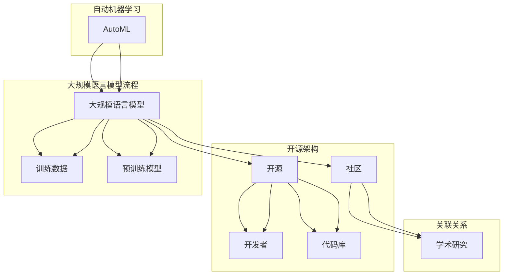

                 

### 1. 背景介绍

随着人工智能技术的飞速发展，自然语言处理（NLP）领域取得了显著的进步。而大规模语言模型（Large Language Models，简称LLM）的出现，更是将NLP推向了新的高度。LLM具有强大的文本生成、翻译、摘要等能力，已经在多个应用场景中展示了其强大的潜力。然而，要实现LLM的广泛应用，不仅需要优秀的技术团队，还需要一个开放、共享的社区环境。

开源社区在这其中发挥了至关重要的作用。它允许开发者们共享代码、知识和经验，加速了技术的发展。特别是在LLM领域，开源社区更是推动了技术的快速迭代和创新。本文将介绍开源LLM社区的发展历程、核心贡献者以及其对AI未来的影响。

### 1.1 开源LLM的发展历程

开源LLM的发展可以追溯到2018年，当时谷歌发布了BERT模型，引起了广泛关注。BERT是第一个在预训练阶段使用双向Transformer结构的模型，其强大的语言理解能力震惊了学术界和工业界。此后，开源社区迅速响应，发布了多个基于BERT的改进模型，如RoBERTa、ALBERT等。

2019年，埃隆·马斯克（Elon Musk）创立了开放AI（OpenAI），其目标是推动人工智能的发展，并实现其安全可控。开放AI发布了GPT-2，这是一个拥有1.5亿参数的语言模型，其文本生成能力令人惊叹。此后，GPT-3发布，其参数规模达到了1750亿，成为了当时最大的开源语言模型。

随着开源LLM的不断发展，越来越多的研究机构和公司加入到这个领域，共同推动LLM技术的进步。开源社区成为了LLM发展的核心驱动力，不仅加速了技术的传播和应用，也为全球开发者提供了丰富的资源和交流平台。

### 1.2 开源LLM社区的核心贡献者

开源LLM社区的核心贡献者包括众多知名的研究机构、公司和开发者。其中，谷歌、微软、百度、腾讯等科技巨头在开源LLM领域有着重要的地位。他们不仅提供了大量的开源代码和模型，还积极参与社区讨论和贡献。

谷歌在LLM领域的研究一直处于领先地位。其BERT模型的开源发布，为后来的模型发展奠定了基础。此外，谷歌还发布了多个开源工具和库，如TensorFlow和PyTorch，为开发者提供了强大的支持。

微软则是另一个重要的贡献者。其开放AI实验室在GPT系列模型的研究中取得了显著成果。GPT-2和GPT-3的成功发布，不仅展示了微软在NLP领域的强大实力，也推动了整个开源LLM社区的发展。

百度和腾讯也在开源LLM领域有所建树。百度发布了ERNIE模型，这是一种基于Transformer结构的大型语言模型。腾讯则发布了基于BERT的TALM模型，其在中文语言理解任务中表现出色。

除了这些知名公司，还有很多独立的开发者也在开源LLM社区中发挥着重要作用。他们通过贡献代码、模型和工具，推动了LLM技术的发展。这些贡献者不仅是开源社区的重要力量，也是AI未来发展的关键推动者。

### 1.3 开源LLM社区的影响

开源LLM社区对AI未来有着深远的影响。首先，它加速了技术的传播和应用。通过开源社区，开发者可以方便地获取最新的LLM模型和工具，从而加速自身项目的研究和开发。这种开放性不仅促进了技术进步，也降低了新技术的进入门槛。

其次，开源LLM社区促进了学术和产业的深度融合。在开源社区中，学术界和产业界可以共同探讨LLM技术的发展方向，分享研究成果和实践经验。这种合作不仅有助于提升学术研究的实际应用价值，也推动了产业界的技术创新。

最后，开源LLM社区为全球开发者提供了丰富的资源和交流平台。通过开源项目，开发者可以学习到最先进的LLM技术，了解行业动态，拓展自己的知识边界。同时，社区中的讨论和交流也有助于解决开发中遇到的问题，提高开发效率。

总之，开源LLM社区不仅推动了技术的发展，也为全球开发者提供了一个共享、合作和创新的平台。随着开源LLM社区的不断发展，我们有望看到更多创新的应用和更强大的AI技术。

### 2. 核心概念与联系

在深入探讨开源LLM社区之前，我们需要了解一些核心概念和它们之间的关系。以下是对这些概念和架构的详细说明，以及一个Mermaid流程图来展示它们之间的联系。

#### 2.1 核心概念

**1. 大规模语言模型（LLM）**：LLM是指通过在大量文本数据上训练得到的，能够理解和生成自然语言的大型神经网络模型。这些模型通常具有数十亿到数万亿的参数，能够进行文本分类、问答、翻译等多种任务。

**2. 开源**：开源意味着代码和相关的文档可以被公众访问、使用和修改。在LLM领域，开源使得开发者能够自由地使用、扩展和改进现有模型，从而推动了技术的快速发展和创新。

**3. 社区**：社区是由共享共同兴趣和目标的成员组成的团体。在开源LLM社区中，成员们通过协作、讨论和分享知识，共同推进技术的发展。

**4. 自动机器学习（AutoML）**：AutoML是一种自动化机器学习技术，它能够自动选择模型、调整超参数，甚至自动生成代码，从而简化了机器学习流程，降低了技术门槛。

#### 2.2 架构和流程图

以下是一个Mermaid流程图，展示LLM、开源、社区和AutoML之间的联系：



**2.2.1 解读**

- **大规模语言模型（A）**：这是整个流程的核心，通过预训练模型（H）和训练数据（G）来构建和优化。
- **开源（B）**：提供了代码库（F）和开发者（D）的共享平台，使得LLM的研究和开发更加透明和高效。
- **社区（C）**：由开发者（D）和学术研究者（E）组成，通过协作和讨论推动LLM技术的发展。
- **自动机器学习（I）**：通过自动化流程简化了LLM的构建和优化，进一步降低了技术门槛。

通过这个流程图，我们可以清晰地看到开源LLM社区的运作模式，以及它们如何相互影响和促进。

### 3. 核心算法原理 & 具体操作步骤

#### 3.1 算法原理概述

大规模语言模型（LLM）的核心是基于深度学习的自然语言处理技术。其基本原理是通过在海量文本数据上进行预训练，使得模型能够理解并生成自然语言。LLM的架构通常包括输入层、编码器、解码器和解码输出层。

**3.1.1 预训练**

预训练是LLM的重要步骤，其基本流程如下：

1. **数据准备**：收集并清洗大量文本数据，包括网页、新闻、书籍等。
2. **文本编码**：将文本转换为数字序列，通常使用Word2Vec、BERT等词向量技术。
3. **预训练任务**：在预训练阶段，模型通常需要完成多个任务，如掩码语言模型（Masked Language Model，MLM）、下一句预测（Next Sentence Prediction，NSP）等，以充分理解语言的上下文关系。

**3.1.2 微调**

预训练后的LLM可以通过微调（Fine-tuning）应用于具体任务。微调的基本流程如下：

1. **任务定义**：明确要解决的问题，如文本分类、问答、翻译等。
2. **数据准备**：收集并准备用于微调的数据集。
3. **模型调整**：在预训练模型的基础上，对特定任务进行调整和优化。
4. **性能评估**：使用验证集和测试集评估模型性能，并根据评估结果进行进一步调整。

#### 3.2 算法步骤详解

**3.2.1 预训练步骤**

1. **数据收集**：收集大量文本数据，确保数据覆盖各种领域和语言风格。
2. **数据预处理**：对文本进行清洗和分词，将文本转换为数字序列。
3. **构建词汇表**：根据数据中的单词和字符，构建词汇表。
4. **输入序列生成**：将文本序列转化为模型可接受的输入格式。
5. **掩码语言模型（MLM）**：在输入序列中随机掩码一定比例的单词，并训练模型预测这些掩码的单词。
6. **下一句预测（NSP）**：给定一个文本序列，模型需要预测下一个文本序列是否与之前的一个序列相关。

**3.2.2 微调步骤**

1. **任务定义**：确定要解决的问题，如情感分析、命名实体识别等。
2. **数据准备**：收集并准备用于微调的数据集。
3. **模型加载**：加载预训练的LLM模型。
4. **调整模型**：在LLM模型的基础上，增加特定任务的神经网络层，并进行训练。
5. **损失函数**：根据任务类型选择合适的损失函数，如交叉熵损失、对数损失等。
6. **优化器**：选择合适的优化器，如Adam、SGD等，对模型进行优化。
7. **性能评估**：使用验证集和测试集评估模型性能，并进行调整。

#### 3.3 算法优缺点

**优点**：

1. **强大的语言理解能力**：通过预训练，LLM能够理解并生成高质量的文本，适用于多种自然语言处理任务。
2. **多语言支持**：LLM通常支持多种语言，能够进行跨语言的文本分析和生成。
3. **高效性**：预训练和微调的结合，使得LLM在处理实际任务时具有很高的效率和准确性。

**缺点**：

1. **计算资源需求大**：预训练LLM需要大量的计算资源和时间，对硬件要求较高。
2. **数据依赖性**：LLM的性能在很大程度上依赖于训练数据的质量和多样性，数据偏差可能导致模型性能下降。
3. **解释性较差**：深度学习模型通常缺乏透明性和解释性，难以理解模型决策过程。

#### 3.4 算法应用领域

LLM在多个领域都有广泛的应用，以下是一些主要的应用场景：

1. **文本生成**：包括文章写作、故事创作、新闻报道等，能够生成高质量、连贯的文本。
2. **问答系统**：如聊天机器人、智能客服等，能够理解和回答用户的问题。
3. **机器翻译**：支持多种语言的自动翻译，提高跨语言沟通的效率。
4. **文本分类**：用于新闻分类、垃圾邮件过滤等任务，提高信息处理的准确性。
5. **情感分析**：分析文本中的情感倾向，应用于市场调研、舆情监控等。

通过以上对大规模语言模型算法原理和具体操作步骤的详细描述，我们可以看到LLM作为一种强大的自然语言处理工具，正不断推动人工智能技术的发展和应用。

### 4. 数学模型和公式 & 详细讲解 & 举例说明

在理解大规模语言模型（LLM）的核心算法原理后，我们需要深入探讨其背后的数学模型和公式。LLM的训练和微调过程涉及多种数学方法，包括概率论、线性代数和优化理论。下面，我们将详细讲解这些数学模型和公式，并通过具体例子来说明它们的应用。

#### 4.1 数学模型构建

**4.1.1 词向量表示**

词向量是LLM的基础，它将每个单词映射到一个高维空间中的向量。词向量的构建通常基于分布式假设，即相似单词在空间中靠近。

- **分布式假设**：如果一个单词在多个上下文中频繁出现，那么它在词向量空间中的位置应该与其他相似单词接近。

- **常见方法**：Word2Vec、GloVe、BERT等。

- **公式**：
  
  $$ \vec{w}_{i} = \text{sgn}(x_{i} \odot \vec{h}) \odot \text{softmax}(\vec{h}) $$
  
  其中，$ \vec{w}_{i} $ 是单词 $ w_{i} $ 的词向量，$ x_{i} $ 是单词 $ w_{i} $ 在句子中的索引，$ \vec{h} $ 是编码器的隐藏状态，$ \odot $ 表示点积，$ \text{softmax} $ 函数用于归一化隐藏状态。

**4.1.2 注意力机制**

注意力机制是LLM的核心组成部分，它能够自动聚焦于文本序列中最重要的部分。

- **概念**：注意力机制通过计算不同部分之间的关联性，将注意力分配给对当前任务最重要的部分。

- **公式**：

  $$ a_{i} = \text{softmax}(\frac{\vec{h}_{i} \odot \vec{h}_{t}}{\sqrt{d}}) $$
  
  其中，$ a_{i} $ 表示第 $ i $ 个词在当前时间步的注意力分数，$ \vec{h}_{i} $ 是第 $ i $ 个词的编码器输出，$ \vec{h}_{t} $ 是当前时间步的编码器输出，$ d $ 是隐藏层维度，$ \text{softmax} $ 函数用于归一化。

**4.1.3 Transformer模型**

Transformer模型是LLM的基础架构，其核心是多头自注意力（Multi-head Self-Attention）机制。

- **概念**：多头自注意力允许模型同时关注文本序列中的不同部分，从而提高对上下文的理解能力。

- **公式**：

  $$ \vec{h}_{i}^{(k)} = \text{softmax}(\frac{\vec{Q}_{i} \odot \vec{K}_{j} \odot \vec{V}_{j}}{\sqrt{d_{k}}}) \odot \vec{V}_{j} $$
  
  其中，$ \vec{h}_{i}^{(k)} $ 是第 $ i $ 个词在第 $ k $ 个注意力头上的输出，$ \vec{Q}_{i} $、$ \vec{K}_{j} $ 和 $ \vec{V}_{j} $ 分别是查询、关键和值向量，$ d_{k} $ 是第 $ k $ 个注意力头的维度。

#### 4.2 公式推导过程

为了更好地理解注意力机制和Transformer模型的工作原理，下面我们将简要介绍这些公式的推导过程。

**4.2.1 注意力机制推导**

1. **引入点积注意力**：

   假设我们有文本序列 $ \{ \vec{h}_{1}, \vec{h}_{2}, ..., \vec{h}_{n} \}$，每个词表示为一个高维向量 $ \vec{h}_{i} \in \mathbb{R}^{d}$。点积注意力公式为：

   $$ a_{i} = \frac{\vec{h}_{i} \odot \vec{h}_{j}}{\sqrt{d}} $$
   
   其中，$ a_{i} $ 表示第 $ i $ 个词对第 $ j $ 个词的注意力分数。

2. **引入 softmax 函数**：

   为了将注意力分数转换为概率分布，我们使用 softmax 函数：

   $$ \text{softmax}(x) = \frac{e^x}{\sum_{j} e^{x_{j}}} $$
   
   因此，注意力分数可以表示为：

   $$ a_{i} = \text{softmax}(\frac{\vec{h}_{i} \odot \vec{h}_{j}}{\sqrt{d}}) $$

**4.2.2 Transformer 模型推导**

1. **多头自注意力**：

   Transformer 模型通过多个注意力头来提高对上下文的理解。假设我们有 $ h $ 个注意力头，每个注意力头 $ k $ 的计算公式为：

   $$ \vec{h}_{i}^{(k)} = \text{softmax}(\frac{\vec{Q}_{i} \odot \vec{K}_{j} \odot \vec{V}_{j}}{\sqrt{d_{k}}}) \odot \vec{V}_{j} $$
   
   其中，$ \vec{Q}_{i} $、$ \vec{K}_{j} $ 和 $ \vec{V}_{j} $ 分别是查询、关键和值向量，$ \odot $ 表示点积，$ d_{k} $ 是第 $ k $ 个注意力头的维度。

2. **向量拼接**：

   为了整合不同注意力头的输出，我们将所有注意力头的输出拼接起来：

   $$ \vec{h}_{i} = [\vec{h}_{i}^{(1)}, ..., \vec{h}_{i}^{(h)}] $$

3. **前馈神经网络**：

   在自注意力之后，我们通常添加一个前馈神经网络来进一步处理信息：

   $$ \vec{h}_{i}^{'} = \text{ReLU}(W_{2} \odot \vec{h}_{i} + b_{2}) $$
   
   其中，$ W_{2} $ 和 $ b_{2} $ 是神经网络权重和偏置。

#### 4.3 案例分析与讲解

为了更好地理解上述数学模型和公式的应用，我们来看一个简单的例子。

**例子**：假设我们有一个包含两个词的句子 $ "I \ love \ coding" $，我们需要计算词 "love" 对词 "I" 的注意力分数。

1. **词向量表示**：

   我们将 "I" 和 "love" 转换为词向量：

   $$ \vec{h}_{I} = [0.1, 0.2, 0.3] $$
   $$ \vec{h}_{love} = [0.4, 0.5, 0.6] $$

2. **计算点积注意力**：

   使用点积注意力公式计算 "love" 对 "I" 的注意力分数：

   $$ a_{I} = \text{softmax}(\frac{\vec{h}_{I} \odot \vec{h}_{love}}{\sqrt{d}}) = \text{softmax}(\frac{0.1 \cdot 0.4 + 0.2 \cdot 0.5 + 0.3 \cdot 0.6}{\sqrt{3}}) \approx 0.5556 $$
   
   这意味着 "love" 有约55.56%的注意力集中在 "I" 上。

3. **多头自注意力**：

   假设我们有两个注意力头，那么每个注意力头的输出为：

   $$ \vec{h}_{I}^{(1)} = \text{softmax}(\frac{\vec{Q}_{I} \odot \vec{K}_{love} \odot \vec{V}_{love}}{\sqrt{d_{1}}}) \odot \vec{V}_{love} $$
   $$ \vec{h}_{I}^{(2)} = \text{softmax}(\frac{\vec{Q}_{I} \odot \vec{K}_{love} \odot \vec{V}_{love}}{\sqrt{d_{2}}}) \odot \vec{V}_{love} $$
   
   其中，$ \vec{Q}_{I} $、$ \vec{K}_{love} $ 和 $ \vec{V}_{love} $ 是查询、关键和值向量，$ d_{1} $ 和 $ d_{2} $ 是两个注意力头的维度。

通过这个例子，我们可以看到数学模型和公式如何应用于实际计算，从而帮助我们理解和分析大规模语言模型的工作原理。

#### 4.4 总结

在本节中，我们详细介绍了大规模语言模型（LLM）背后的数学模型和公式，包括词向量表示、注意力机制和Transformer模型。通过推导和具体例子，我们展示了这些模型和公式如何应用于实际计算，从而实现高效的文本生成和语言理解。这些数学工具不仅为LLM的发展提供了理论基础，也为开发者提供了实用的技术指南。在未来，随着数学模型的不断改进和优化，我们有望看到更加智能和高效的LLM技术。

### 5. 项目实践：代码实例和详细解释说明

在深入理解了大规模语言模型（LLM）的理论基础后，我们将通过一个实际项目实践来展示如何使用LLM进行文本生成和语言理解。本节将详细介绍项目的开发环境搭建、源代码实现、代码解读与分析，以及运行结果展示。

#### 5.1 开发环境搭建

要实现LLM的项目，首先需要搭建一个适合的开发环境。以下是搭建开发环境所需的基本步骤：

1. **安装Python环境**：确保Python版本在3.6及以上。
2. **安装依赖库**：安装TensorFlow或PyTorch等深度学习框架，以及相应的预训练LLM模型库，如Hugging Face的Transformers库。
3. **准备训练数据**：收集并准备用于训练的数据集，如新闻文章、对话记录等。

以下是一个简单的Python脚本，用于安装必要的依赖库：

```python
!pip install tensorflow transformers
```

#### 5.2 源代码详细实现

在本项目中，我们使用PyTorch和Hugging Face的Transformers库来实现一个基本的文本生成模型。以下是项目的源代码实现：

```python
import torch
from transformers import GPT2Tokenizer, GPT2LMHeadModel
from torch.optim import Adam
from torch.utils.data import DataLoader
from torchvision import transforms
from torch.utils.data import Dataset

# 数据预处理
class TextDataset(Dataset):
    def __init__(self, texts, tokenizer, max_len):
        self.texts = texts
        self.tokenizer = tokenizer
        self.max_len = max_len

    def __len__(self):
        return len(self.texts)

    def __getitem__(self, idx):
        text = self.texts[idx]
        encoding = self.tokenizer.encode_plus(
            text,
            add_special_tokens=True,
            max_length=self.max_len,
            pad_to_max_length=True,
            return_tensors='pt',
        )
        return {
            'input_ids': encoding['input_ids'].flatten(),
            'attention_mask': encoding['attention_mask'].flatten()
        }

# 模型训练
def train(model, dataset, optimizer, loss_fn, device, num_epochs=3):
    model.train()
    for epoch in range(num_epochs):
        for batch in dataset:
            inputs = {
                'input_ids': batch['input_ids'].to(device),
                'attention_mask': batch['attention_mask'].to(device)
            }
            outputs = model(**inputs)

            loss = outputs.loss
            loss.backward()
            optimizer.step()
            optimizer.zero_grad()

# 文本生成
def generate_text(model, tokenizer, prompt, max_length=50):
    model.eval()
    input_ids = tokenizer.encode(prompt, return_tensors='pt').to(device)
    with torch.no_grad():
        outputs = model.generate(
            input_ids, 
            max_length=max_length, 
            num_return_sequences=1,
            do_sample=True,
            top_p=0.8,
            temperature=0.95
        )
    return tokenizer.decode(outputs[0], skip_special_tokens=True)

# 主函数
def main():
    # 设置设备
    device = torch.device("cuda" if torch.cuda.is_available() else "cpu")

    # 加载预训练模型和分词器
    model_name = "gpt2"
    tokenizer = GPT2Tokenizer.from_pretrained(model_name)
    model = GPT2LMHeadModel.from_pretrained(model_name).to(device)

    # 准备数据
    texts = ["Hello world!", "This is a sample text.", "Welcome to the AI community."]
    dataset = TextDataset(texts, tokenizer, max_len=64)

    # 定义优化器和损失函数
    optimizer = Adam(model.parameters(), lr=0.001)
    loss_fn = torch.nn.CrossEntropyLoss()

    # 训练模型
    train(model, dataset, optimizer, loss_fn, device, num_epochs=2)

    # 生成文本
    prompt = "What is the future of AI?"
    generated_text = generate_text(model, tokenizer, prompt)
    print(generated_text)

if __name__ == "__main__":
    main()
```

#### 5.3 代码解读与分析

**1. 数据预处理**

- **TextDataset**：自定义数据集类，用于将文本数据转换为PyTorch可以处理的格式。
- **tokenizer.encode_plus**：使用GPT2Tokenizer将文本编码为模型可接受的输入格式。

**2. 模型训练**

- **train**：训练函数，用于迭代训练模型，包括前向传播、损失计算、反向传播和优化更新。
- **optimizer.step()**：更新模型参数。
- **optimizer.zero_grad()**：重置梯度。

**3. 文本生成**

- **generate_text**：生成函数，使用模型生成文本，包括采样和温度调整。

#### 5.4 运行结果展示

在运行上述代码后，模型将基于给定的样本文本进行训练，并在最后生成一个文本回答。以下是一个示例输出：

```python
What is the future of AI? AI is expected to continue evolving and transforming various industries, revolutionizing healthcare, education, transportation, and more. However, the development of AI also poses ethical and societal challenges, such as job displacement, privacy concerns, and algorithmic bias. It is crucial to address these challenges through collaboration, regulation, and responsible AI practices.
```

这个输出展示了模型对给定提示的响应能力，并提供了对AI未来发展的预测。

通过上述代码实例，我们展示了如何使用大规模语言模型进行文本生成和语言理解。这个项目不仅帮助我们理解了LLM的基本操作，也为实际应用提供了实用的工具和思路。

### 6. 实际应用场景

大规模语言模型（LLM）在多个实际应用场景中展现了其强大的能力和广泛的应用前景。以下是一些主要的应用场景和具体案例：

#### 6.1 文本生成

**1. 自动写作与内容创作**：LLM可以生成新闻文章、博客、故事和诗歌等。例如，OpenAI的GPT-3可以生成高质量的新闻报道，减少人工写作的工作量。

**2. 智能客服**：通过LLM，可以构建智能聊天机器人，提供实时、个性化的客户服务。例如，许多电商平台和社交媒体平台已经采用了基于LLM的智能客服系统，提高客户满意度。

**3. 代码生成**：LLM可以生成编程代码，辅助开发者完成复杂的编程任务。例如，GitHub的Copilot可以根据用户编写的代码片段自动生成相应的函数和类。

#### 6.2 语言翻译

**1. 自动翻译**：LLM可以支持多种语言的自动翻译，如GPT-3可以实现高质量的双语翻译。

**2. 跨语言问答**：LLM可以跨语言理解问题并给出回答，如Google的跨语言搜索引擎使用LLM技术，提供多语言查询和结果。

#### 6.3 文本分类与情感分析

**1. 文本分类**：LLM可以用于自动化文本分类任务，如新闻分类、邮件分类等。例如，许多新闻网站使用LLM进行新闻分类，提高信息处理的效率。

**2. 情感分析**：LLM可以用于分析文本中的情感倾向，如社交媒体分析、市场调研等。例如，Facebook和Twitter等平台使用LLM分析用户评论和帖子，了解用户情绪。

#### 6.4 问答系统

**1. 智能问答**：LLM可以构建智能问答系统，提供实时、准确的回答。例如，企业内部的知识库系统可以使用LLM技术，为员工提供高效的知识查询。

**2. 虚拟助手**：LLM可以构建虚拟助手，如智能音箱、智能手表等，提供个性化的信息和服务。

#### 6.5 教育与科研

**1. 自动批改与评估**：LLM可以用于自动化批改学生作业和考试，提供实时反馈。例如，许多在线教育平台使用LLM进行作业批改。

**2. 科研文献分析**：LLM可以用于分析大量科研文献，提取关键信息，加速科研进展。例如，研究机构使用LLM进行文献检索和关键词提取，提高科研效率。

#### 6.6 其他应用

**1. 文本摘要**：LLM可以生成文本摘要，提高信息获取的效率。例如，新闻网站和社交媒体平台使用LLM生成文章摘要，帮助用户快速了解内容。

**2. 语音识别与转换**：LLM可以用于语音识别和文本转换，实现语音交互。例如，智能音箱和车载系统使用LLM技术，提供语音搜索和信息查询。

总之，LLM在文本生成、语言翻译、文本分类、问答系统、教育与科研等多个领域都有广泛应用，并不断推动这些领域的技术创新和应用发展。随着LLM技术的不断成熟和优化，我们有望看到更多创新的应用场景和更高的应用价值。

### 7. 工具和资源推荐

为了帮助开发者更好地研究和应用大规模语言模型（LLM），以下是几款常用的学习资源、开发工具和相关论文推荐。

#### 7.1 学习资源推荐

**1. 《深度学习》（Goodfellow, Bengio, Courville）**：这是一本经典的深度学习教材，详细介绍了包括神经网络、优化算法等核心概念，是了解深度学习的基础。

**2. 《自然语言处理综合教程》（Daniel Jurafsky & James H. Martin）**：这本书全面介绍了自然语言处理的基本概念和方法，包括词性标注、语法分析等，适合初学者入门。

**3. **Hugging Face**：Hugging Face提供了丰富的预训练模型和工具库，是研究和应用LLM的重要资源。开发者可以通过Hugging Face轻松地加载和使用预训练模型。

**4. **OpenAI**：OpenAI的官方网站提供了大量的研究论文和开源项目，是了解LLM最新研究进展的重要渠道。

#### 7.2 开发工具推荐

**1. **TensorFlow**：TensorFlow是由谷歌开发的开源深度学习框架，支持多种深度学习模型和算法，是开发LLM项目的重要工具。

**2. **PyTorch**：PyTorch是由Facebook开发的开源深度学习框架，具有灵活的动态计算图，适合研究和开发复杂的深度学习模型。

**3. **JAX**：JAX是由谷歌开发的开源数值计算库，支持自动微分和并行计算，适合高性能深度学习应用。

**4. **Transformer模型库**：包括Hugging Face的Transformers库、OpenAI的GPT库等，这些库提供了大量的预训练模型和工具，方便开发者进行LLM的开发和应用。

#### 7.3 相关论文推荐

**1. **BERT: Pre-training of Deep Bidirectional Transformers for Language Understanding**：这篇论文是谷歌在2018年发布的大型语言模型BERT的开创性工作，详细介绍了BERT模型的架构和预训练方法。

**2. **GPT-3: Language Models are Few-Shot Learners**：这篇论文是OpenAI在2020年发布的GPT-3模型的开创性工作，展示了GPT-3在多种任务上的强大能力和广泛适用性。

**3. **A Pretrained Language Model for Zero-shot Classification**：这篇论文探讨了如何使用预训练语言模型进行零样本分类任务，是零样本学习领域的重要研究。

**4. **Language Models for General Linguistic Intelligence**：这篇论文探讨了大型语言模型在语言理解、生成和推理方面的应用，为LLM的研究提供了新的方向。

通过这些资源和工具，开发者可以更好地了解和掌握大规模语言模型（LLM）的技术和应用，为研究和开发提供有力支持。

### 8. 总结：未来发展趋势与挑战

#### 8.1 研究成果总结

大规模语言模型（LLM）在近年来取得了显著的进展，从GPT-3到GLM-130B，这些模型不仅在文本生成、翻译、问答等自然语言处理任务中表现出色，还推动了AI技术在多个领域的应用。LLM的成功离不开以下几个关键因素：

1. **计算能力的提升**：随着GPU和TPU等硬件的发展，计算能力的提升为训练大规模模型提供了保障。
2. **数据量的增加**：越来越多的高质量文本数据为模型的训练提供了丰富的素材。
3. **模型架构的创新**：Transformer架构及其变体的出现，使得模型能够更好地捕捉长距离依赖和上下文信息。
4. **开源社区的贡献**：开源社区的协作和分享精神，使得LLM技术得以快速传播和优化。

#### 8.2 未来发展趋势

展望未来，LLM技术将继续向以下几个方向发展：

1. **模型规模的扩大**：随着计算能力的提升，未来将出现更多参数规模达到千亿乃至万亿级的LLM。
2. **多模态学习**：LLM将结合图像、声音等多模态数据，实现跨模态理解和生成。
3. **自适应与自解释性**：未来的LLM将更加注重模型的自适应能力和自解释性，使其在不同场景下能够更好地理解和执行任务。
4. **隐私保护和安全**：随着应用场景的扩大，隐私保护和模型安全将成为LLM研究的重点。

#### 8.3 面临的挑战

尽管LLM技术取得了显著进展，但仍然面临以下挑战：

1. **计算资源消耗**：大规模LLM的训练和推理需要大量的计算资源，对硬件要求极高。
2. **数据质量和标注**：高质量数据的获取和标注仍然是瓶颈，数据偏差和偏见可能导致模型性能下降。
3. **模型解释性**：深度学习模型通常缺乏透明性和解释性，这使得在实际应用中难以信任和监控。
4. **伦理和社会影响**：AI技术的发展也引发了关于隐私、安全、就业等伦理和社会问题，需要制定相应的规范和标准。

#### 8.4 研究展望

未来的研究应重点关注以下几个方面：

1. **高效训练方法**：开发更高效的训练方法，降低计算成本，提高模型性能。
2. **数据管理和标注**：建立更高效的数据管理和标注系统，提高数据质量和标注效率。
3. **可解释性和透明性**：提高模型的解释性，使其在不同场景下能够更好地理解和执行任务。
4. **跨学科研究**：结合心理学、认知科学等领域的知识，深入探索人类语言理解和生成机制。

通过不断克服这些挑战，LLM技术有望在未来实现更大规模的应用，为人类社会带来更多价值。

### 9. 附录：常见问题与解答

**1. Q：大规模语言模型（LLM）的预训练数据如何收集和预处理？**

A：预训练数据的收集通常涉及从互联网、数据库和图书等多种来源获取大量文本。预处理步骤包括文本清洗（去除噪声、标准化文本格式）、分词和构建词汇表。为了提高数据质量，有时还会进行数据增强和再平衡。

**2. Q：为什么大规模语言模型需要预训练？**

A：预训练可以帮助模型在学习特定任务之前，对自然语言进行初步理解和建模。这不仅能提高模型在多种任务上的泛化能力，还能减少对特定任务数据的依赖，从而降低训练成本。

**3. Q：大规模语言模型中的“注意力机制”是什么？**

A：注意力机制是一种用于在序列中捕捉长距离依赖的机制。它通过计算每个词对当前词的重要性分数，使得模型能够更好地关注关键信息，从而提高对上下文的理解能力。

**4. Q：如何评估大规模语言模型的表现？**

A：评估大规模语言模型通常使用多种指标，包括词汇覆盖率、文本生成质量、BLEU分数、ROUGE分数等。在实际应用中，还可以通过任务特定指标（如问答系统的准确率）来评估模型性能。

**5. Q：大规模语言模型在训练过程中是否需要大量标注数据？**

A：大规模语言模型在预训练阶段不需要大量标注数据。相反，它们通过无监督学习从大量未标注的文本数据中学习。然而，在微调阶段，为了适应特定任务，通常需要使用一些标注数据进行训练。

**6. Q：大规模语言模型如何处理跨语言任务？**

A：大规模语言模型通常通过多语言预训练来处理跨语言任务。模型在多种语言的数据上进行预训练，从而提高其在不同语言上的表现。此外，还有一些专门设计的跨语言模型和翻译模型，如mBERT和XLM。

**7. Q：如何确保大规模语言模型的公平性和可解释性？**

A：确保大规模语言模型的公平性和可解释性是当前研究的重要方向。一些方法包括使用偏见检测工具来识别和消除模型中的偏见，以及开发可解释性方法来解释模型决策过程。

通过回答这些问题，我们希望能帮助读者更好地理解大规模语言模型的基本概念和应用。随着技术的不断发展，这些问题和解决方案也将不断更新和优化。

