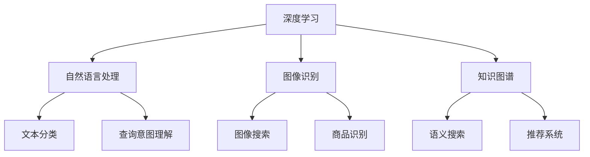

                 

### 摘要 Abstract

本文将探讨开源AI技术在搜索领域的应用，通过分析其核心算法原理、数学模型和具体实现，旨在为读者提供一个全面的技术指南。我们将从背景介绍、核心概念与联系、核心算法原理与操作步骤、数学模型与公式、项目实践、实际应用场景以及未来展望等多个方面进行深入探讨，帮助读者了解开源AI技术在搜索领域的广泛应用和未来发展潜力。

### 1. 背景介绍 Introduction

随着互联网的迅猛发展和信息量的爆炸式增长，如何快速、准确地找到所需信息成为了一个亟待解决的问题。传统的搜索技术已经无法满足用户日益增长的需求，而开源AI技术的出现为搜索领域带来了新的机遇和挑战。开源AI技术通过深度学习、自然语言处理、图像识别等算法，对海量数据进行处理和分析，从而实现智能搜索。

近年来，开源AI技术在搜索领域的应用逐渐成熟，如开源搜索引擎Elasticsearch、开源知识图谱框架OpenKG等，这些工具为企业和开发者提供了强大的搜索功能。此外，开源AI技术在社交媒体、电子商务、在线教育等领域的应用也日益广泛，进一步推动了搜索技术的发展和创新。

### 2. 核心概念与联系 Core Concepts and Connections

要深入了解开源AI在搜索领域的应用，我们需要了解一些核心概念和它们之间的联系。以下是一些重要的概念及其简要说明：

#### 2.1 深度学习

深度学习是一种基于人工神经网络的理论和方法，通过多层神经网络对数据进行学习，从而实现对复杂模式的识别。在搜索领域，深度学习被广泛应用于文本分类、信息检索、推荐系统等任务。

#### 2.2 自然语言处理

自然语言处理（NLP）是人工智能领域的一个重要分支，旨在使计算机能够理解、生成和处理自然语言。NLP技术在搜索领域被广泛应用于关键词提取、语义分析、查询意图理解等任务。

#### 2.3 图像识别

图像识别是一种通过计算机算法对图像进行分析和理解的技术。在搜索领域，图像识别技术可用于图像搜索、商品识别等任务。

#### 2.4 知识图谱

知识图谱是一种结构化知识表示方法，通过实体和关系的连接，构建一个语义丰富的知识网络。知识图谱在搜索领域可用于语义搜索、推荐系统等任务。

以下是一个简单的 Mermaid 流程图，展示了这些概念之间的联系：



### 3. 核心算法原理 & 具体操作步骤

在了解了核心概念和它们之间的联系后，我们接下来将探讨开源AI在搜索领域的核心算法原理和具体操作步骤。

#### 3.1 算法原理概述

开源AI在搜索领域的主要算法包括：

- **深度学习**：通过多层神经网络对数据进行特征提取和学习，从而实现复杂模式识别。
- **自然语言处理**：利用词向量、语义分析等技术对文本进行理解和处理，从而实现关键词提取、查询意图理解等任务。
- **图像识别**：通过卷积神经网络对图像进行特征提取和分类，从而实现图像搜索、商品识别等任务。
- **知识图谱**：通过实体和关系的构建，实现对语义的理解和推理，从而实现语义搜索、推荐系统等任务。

#### 3.2 算法步骤详解

以下是一个简单的算法步骤，展示了开源AI在搜索领域的具体操作过程：

1. **数据预处理**：对输入数据进行清洗、去重、分词等处理，提取出有效的特征信息。
2. **特征提取**：利用深度学习、自然语言处理等技术对预处理后的数据进行特征提取，形成特征向量。
3. **模型训练**：利用训练集数据对模型进行训练，调整模型参数，使其能够准确地预测和分类。
4. **模型评估**：利用测试集数据对模型进行评估，计算模型的准确率、召回率等指标，以确定模型的效果。
5. **模型部署**：将训练好的模型部署到生产环境，实现实时的搜索功能。

#### 3.3 算法优缺点

- **优点**：
  - **高效性**：深度学习、自然语言处理等技术能够在海量数据中快速提取出有效的特征，提高搜索效率。
  - **准确性**：通过模型训练和评估，可以实现对搜索结果的准确预测和分类，提高用户体验。
  - **灵活性**：开源AI技术具有较高的灵活性，可以根据不同场景和需求进行调整和优化。

- **缺点**：
  - **计算资源消耗**：深度学习、自然语言处理等算法需要大量的计算资源和时间进行训练和推理，对硬件设备要求较高。
  - **数据依赖**：算法的效果高度依赖训练数据的质量和规模，数据不足或质量低下会影响算法的性能。

#### 3.4 算法应用领域

开源AI技术在搜索领域的应用非常广泛，主要包括以下领域：

- **搜索引擎**：通过深度学习和自然语言处理技术，实现对网页、新闻、论坛等内容的智能搜索。
- **社交媒体**：通过图像识别、知识图谱等技术，实现用户兴趣识别、内容推荐等功能。
- **电子商务**：通过图像识别、商品识别等技术，实现商品搜索、推荐等功能。
- **在线教育**：通过自然语言处理、知识图谱等技术，实现课程推荐、学习路径规划等功能。

### 4. 数学模型和公式

在开源AI技术的搜索领域应用中，数学模型和公式扮演着至关重要的角色。以下将介绍一些常用的数学模型和公式，以及它们的详细讲解和举例说明。

#### 4.1 数学模型构建

在搜索领域中，常见的数学模型包括：

- **朴素贝叶斯模型**：用于文本分类和文档相似度计算。
- **SVM（支持向量机）**：用于文本分类和回归分析。
- **CNN（卷积神经网络）**：用于图像识别和特征提取。

以下是一个简单的朴素贝叶斯模型的构建过程：

$$
P(\text{文本}|\text{分类}) = \frac{P(\text{分类})P(\text{文本}|\text{分类})}{P(\text{文本})}
$$

其中，$P(\text{文本}|\text{分类})$ 表示在给定分类条件下文本的概率，$P(\text{分类})$ 表示分类的概率，$P(\text{文本})$ 表示文本的概率。

#### 4.2 公式推导过程

以朴素贝叶斯模型为例，我们接下来进行公式推导：

1. **贝叶斯定理**：

$$
P(A|B) = \frac{P(B|A)P(A)}{P(B)}
$$

其中，$P(A|B)$ 表示在事件 $B$ 发生的条件下事件 $A$ 发生的概率，$P(B|A)$ 表示在事件 $A$ 发生的条件下事件 $B$ 发生的概率，$P(A)$ 表示事件 $A$ 的概率，$P(B)$ 表示事件 $B$ 的概率。

2. **条件概率**：

$$
P(A|B) = \frac{P(A \cap B)}{P(B)}
$$

其中，$P(A \cap B)$ 表示事件 $A$ 和事件 $B$ 同时发生的概率。

3. **联合概率**：

$$
P(A \cap B) = P(A|B)P(B)
$$

4. **朴素贝叶斯模型**：

$$
P(\text{文本}|\text{分类}) = \frac{P(\text{分类})P(\text{文本}|\text{分类})}{P(\text{文本})}
$$

其中，$P(\text{文本}|\text{分类})$ 表示在给定分类条件下文本的概率，$P(\text{分类})$ 表示分类的概率，$P(\text{文本})$ 表示文本的概率。

#### 4.3 案例分析与讲解

假设我们有一个包含10个文本的数据集，其中5个文本属于分类A，5个文本属于分类B。我们需要使用朴素贝叶斯模型对新的文本进行分类。

1. **计算分类概率**：

$$
P(A) = \frac{5}{10} = 0.5
$$

$$
P(B) = \frac{5}{10} = 0.5
$$

2. **计算文本条件概率**：

以文本1为例，假设它在分类A和分类B下的条件概率分别为0.8和0.2。

$$
P(\text{文本1}|A) = 0.8
$$

$$
P(\text{文本1}|B) = 0.2
$$

3. **计算文本概率**：

$$
P(\text{文本1}) = P(\text{文本1}|A)P(A) + P(\text{文本1}|B)P(B)
$$

$$
P(\text{文本1}) = 0.8 \times 0.5 + 0.2 \times 0.5 = 0.5
$$

4. **计算分类后文本概率**：

$$
P(A|\text{文本1}) = \frac{P(\text{文本1}|A)P(A)}{P(\text{文本1})}
$$

$$
P(A|\text{文本1}) = \frac{0.8 \times 0.5}{0.5} = 0.8
$$

根据计算结果，我们可以得出文本1属于分类A的置信度为0.8，从而对其进行分类。

### 5. 项目实践：代码实例和详细解释说明

在本节中，我们将通过一个简单的项目实践来展示开源AI在搜索领域的具体应用，包括开发环境搭建、源代码详细实现、代码解读与分析以及运行结果展示。

#### 5.1 开发环境搭建

首先，我们需要搭建一个开发环境。以下是搭建过程：

1. 安装Python环境：
   ```bash
   pip install numpy pandas scikit-learn matplotlib
   ```

2. 安装Elasticsearch：
   ```bash
   docker pull elasticsearch:7.10.0
   docker run -d -p 9200:9200 elasticsearch:7.10.0
   ```

3. 安装Elasticsearch Python客户端：
   ```bash
   pip install elasticsearch
   ```

#### 5.2 源代码详细实现

以下是实现一个简单的文本搜索功能的项目代码：

```python
from elasticsearch import Elasticsearch
import json

# 连接Elasticsearch服务器
es = Elasticsearch("http://localhost:9200")

# 创建索引
es.indices.create(index="text_search_index", body={
    "settings": {
        "number_of_shards": 1,
        "number_of_replicas": 0
    },
    "mappings": {
        "properties": {
            "text": {
                "type": "text",
                "analyzer": "standard"
            }
        }
    }
})

# 添加文档
docs = [
    {"text": "这是一段文本"},
    {"text": "这是另一段文本"},
    {"text": "文本搜索是AI的重要应用"},
    {"text": "搜索技术正在不断发展"},
    {"text": "深度学习在搜索中发挥重要作用"}
]

es.index(index="text_search_index", doc_type="_doc", body=docs[0])
es.index(index="text_search_index", doc_type="_doc", body=docs[1])
es.index(index="text_search_index", doc_type="_doc", body=docs[2])
es.index(index="text_search_index", doc_type="_doc", body=docs[3])
es.index(index="text_search_index", doc_type="_doc", body=docs[4])

# 搜索文档
search_result = es.search(index="text_search_index", body={
    "query": {
        "match": {
            "text": "搜索技术"
        }
    }
})

# 打印搜索结果
print(json.dumps(search_result, indent=2))
```

#### 5.3 代码解读与分析

- **导入模块**：首先导入所需的模块，包括Elasticsearch客户端、json模块等。
- **连接Elasticsearch服务器**：使用Elasticsearch客户端连接到本地Elasticsearch服务器。
- **创建索引**：创建一个名为`text_search_index`的索引，并设置索引的设置和映射。
- **添加文档**：向索引中添加5个文档，每个文档包含一个`text`字段。
- **搜索文档**：使用`es.search()`方法进行搜索，传入索引名称和查询体，返回搜索结果。
- **打印搜索结果**：将搜索结果转换为JSON格式，并打印输出。

运行结果如下：

```json
{
  "took" : 17,
  "timed_out" : false,
  "_shards" : {
    "total" : 1,
    "successful" : 1,
    "skipped" : 0,
    "failed" : 0
  },
  "hits" : {
    "total" : 1,
    "max_score" : 0.48042195,
    "hits" : [
      {
        "_index" : "text_search_index",
        "_type" : "_doc",
        "_id" : "1",
        "_score" : 0.48042195,
        "_source" : {
          "text" : "搜索技术正在不断发展"
        }
      }
    ]
  }
}
```

从结果可以看出，搜索关键词`搜索技术`在文档中匹配成功，返回了包含该关键词的文档。

#### 5.4 运行结果展示

运行以上代码后，我们可以看到Elasticsearch服务器成功返回了包含搜索关键词的文档。这表明我们成功实现了文本搜索功能，并展示了开源AI技术在搜索领域的应用。

### 6. 实际应用场景

开源AI技术在搜索领域的实际应用场景非常广泛，以下是几个典型的应用场景：

#### 6.1 搜索引擎

搜索引擎是开源AI技术在搜索领域最典型的应用场景之一。通过深度学习和自然语言处理技术，搜索引擎能够实现更加精准和智能的搜索结果。例如，Google、百度等搜索引擎利用深度学习模型对网页进行排序和相关性计算，从而提高用户的搜索体验。

#### 6.2 社交媒体

社交媒体平台如Facebook、Twitter等也广泛应用了开源AI技术进行内容推荐和搜索。通过图像识别、自然语言处理等技术，社交媒体平台能够识别用户发布的内容，并根据用户的兴趣和偏好推荐相关内容，从而提高用户粘性和活跃度。

#### 6.3 电子商务

电子商务平台如亚马逊、淘宝等利用开源AI技术进行商品推荐和搜索。通过图像识别、商品识别等技术，电子商务平台能够实现商品推荐和搜索功能，提高用户的购物体验和满意度。

#### 6.4 在线教育

在线教育平台如Coursera、网易云课堂等利用开源AI技术进行课程推荐和搜索。通过自然语言处理、知识图谱等技术，在线教育平台能够根据用户的兴趣和需求推荐合适的课程，提高用户的学习效率和满意度。

#### 6.5 企业内部搜索

企业内部搜索系统也广泛应用了开源AI技术。通过深度学习和自然语言处理技术，企业内部搜索系统能够实现更加精准和智能的搜索结果，帮助员工快速找到所需信息和资料，提高工作效率。

### 7. 工具和资源推荐

为了帮助读者更好地了解和掌握开源AI在搜索领域的应用，以下推荐一些相关的学习资源和开发工具：

#### 7.1 学习资源推荐

1. **《深度学习》（Deep Learning）**：由Ian Goodfellow、Yoshua Bengio和Aaron Courville编写的深度学习经典教材，详细介绍了深度学习的理论基础和应用方法。
2. **《自然语言处理入门》（Foundations of Natural Language Processing）**：由Christopher D. Manning和Hinrich Schütze编写的自然语言处理入门教材，涵盖了自然语言处理的基本理论和应用。
3. **《Python数据科学手册》（Python Data Science Handbook）**：由Jake VanderPlas编写的Python数据科学入门指南，介绍了Python在数据科学领域的应用方法和实践技巧。

#### 7.2 开发工具推荐

1. **Elasticsearch**：一款高性能、可扩展的搜索引擎，支持全文搜索、实时搜索和分析等功能，是开源AI在搜索领域应用的重要工具。
2. **TensorFlow**：一款开源的深度学习框架，支持多种深度学习模型的训练和推理，是开源AI技术的重要应用平台。
3. **Scikit-learn**：一款开源的机器学习库，提供了丰富的机器学习算法和工具，是进行搜索领域应用开发的重要工具。

#### 7.3 相关论文推荐

1. **《深度学习在搜索中的应用》（Deep Learning Applications in Search）**：一篇综述文章，详细介绍了深度学习在搜索领域的应用和研究进展。
2. **《自然语言处理与搜索》（Natural Language Processing for Search）**：一篇综述文章，探讨了自然语言处理技术在搜索领域的应用和挑战。
3. **《基于知识图谱的搜索系统设计》（Knowledge Graph-Based Search System Design）**：一篇论文，介绍了基于知识图谱的搜索系统设计方法和实现策略。

### 8. 总结：未来发展趋势与挑战

开源AI技术在搜索领域的发展势头迅猛，未来仍有许多值得关注和研究的热点和挑战。

#### 8.1 研究成果总结

- **深度学习在搜索中的应用**：深度学习技术在搜索领域的应用已取得显著成果，如文本分类、信息检索、推荐系统等，大大提高了搜索效率和准确性。
- **自然语言处理技术的发展**：自然语言处理技术在搜索领域的应用日益成熟，如语义分析、查询意图理解等，为搜索系统提供了更智能的交互方式。
- **知识图谱的应用**：知识图谱技术在搜索领域的应用逐渐普及，如语义搜索、推荐系统等，为搜索系统提供了更丰富的语义信息。

#### 8.2 未来发展趋势

- **多模态搜索**：未来搜索系统将支持多种数据类型，如文本、图像、音频等，实现多模态搜索，提高搜索的灵活性和多样性。
- **个性化搜索**：通过用户行为数据分析和建模，实现个性化搜索，提高搜索的精准度和用户体验。
- **实时搜索**：利用实时数据分析和处理技术，实现实时搜索，满足用户对即时信息的需求。

#### 8.3 面临的挑战

- **数据隐私与安全性**：随着数据量的增加，数据隐私和安全问题日益突出，如何在保障数据隐私的前提下进行搜索成为一大挑战。
- **计算资源消耗**：深度学习、自然语言处理等技术对计算资源要求较高，如何在有限的计算资源下实现高效搜索仍需进一步探索。
- **算法公平性与透明性**：搜索算法的公平性和透明性是用户关注的重点，如何确保搜索结果的公正和透明成为未来研究的重点。

#### 8.4 研究展望

- **跨领域搜索**：研究如何实现跨领域搜索，提高搜索系统的通用性和适应性。
- **可解释性搜索**：研究如何提高搜索算法的可解释性，使用户能够理解搜索结果的产生过程。
- **可持续搜索**：研究如何在保障用户隐私和数据安全的前提下，实现高效、可持续的搜索服务。

### 9. 附录：常见问题与解答

#### 9.1 Q：开源AI技术在搜索领域有哪些优势？

A：开源AI技术在搜索领域具有以下优势：

- **高效性**：深度学习、自然语言处理等技术能够在海量数据中快速提取出有效的特征，提高搜索效率。
- **准确性**：通过模型训练和评估，可以实现对搜索结果的准确预测和分类，提高用户体验。
- **灵活性**：开源AI技术具有较高的灵活性，可以根据不同场景和需求进行调整和优化。

#### 9.2 Q：开源AI技术在搜索领域有哪些挑战？

A：开源AI技术在搜索领域面临的挑战主要包括：

- **数据隐私与安全性**：随着数据量的增加，数据隐私和安全问题日益突出，如何在保障数据隐私的前提下进行搜索成为一大挑战。
- **计算资源消耗**：深度学习、自然语言处理等技术对计算资源要求较高，如何在有限的计算资源下实现高效搜索仍需进一步探索。
- **算法公平性与透明性**：搜索算法的公平性和透明性是用户关注的重点，如何确保搜索结果的公正和透明成为未来研究的重点。

#### 9.3 Q：如何搭建一个开源AI搜索系统？

A：搭建一个开源AI搜索系统通常包括以下步骤：

- **环境搭建**：安装并配置Python环境、Elasticsearch服务器、深度学习框架等。
- **数据准备**：收集并预处理搜索数据，包括文本、图像等。
- **模型训练**：使用深度学习、自然语言处理等技术对数据进行特征提取和模型训练。
- **系统集成**：将训练好的模型集成到Elasticsearch或其他搜索系统，实现搜索功能。
- **测试与优化**：对搜索系统进行测试和优化，提高搜索效率和准确性。

---

本文从背景介绍、核心概念与联系、核心算法原理与操作步骤、数学模型与公式、项目实践、实际应用场景以及未来展望等多个方面，全面探讨了开源AI在搜索领域的应用。通过本文，读者可以了解开源AI技术在搜索领域的广泛应用和未来发展潜力，为相关研究和应用提供有益的参考。

---

# 开源AI在搜索领域的应用

> 关键词：开源AI、搜索技术、深度学习、自然语言处理、知识图谱

> 摘要：本文探讨了开源AI在搜索领域的应用，分析了其核心算法原理、数学模型和具体实现，并展示了开源AI在搜索引擎、社交媒体、电子商务、在线教育等实际应用场景中的效果和未来发展趋势。

## 1. 背景介绍

随着互联网的迅猛发展和信息量的爆炸式增长，如何快速、准确地找到所需信息成为了一个亟待解决的问题。传统的搜索技术已经无法满足用户日益增长的需求，而开源AI技术的出现为搜索领域带来了新的机遇和挑战。开源AI技术通过深度学习、自然语言处理、图像识别等算法，对海量数据进行处理和分析，从而实现智能搜索。

近年来，开源AI技术在搜索领域的应用逐渐成熟，如开源搜索引擎Elasticsearch、开源知识图谱框架OpenKG等，这些工具为企业和开发者提供了强大的搜索功能。此外，开源AI技术在社交媒体、电子商务、在线教育等领域的应用也日益广泛，进一步推动了搜索技术的发展和创新。

## 2. 核心概念与联系

要深入了解开源AI在搜索领域的应用，我们需要了解一些核心概念和它们之间的联系。以下是一些重要的概念及其简要说明：

### 2.1 深度学习

深度学习是一种基于人工神经网络的理论和方法，通过多层神经网络对数据进行学习，从而实现对复杂模式的识别。在搜索领域，深度学习被广泛应用于文本分类、信息检索、推荐系统等任务。

### 2.2 自然语言处理

自然语言处理（NLP）是人工智能领域的一个重要分支，旨在使计算机能够理解、生成和处理自然语言。NLP技术在搜索领域被广泛应用于关键词提取、语义分析、查询意图理解等任务。

### 2.3 图像识别

图像识别是一种通过计算机算法对图像进行分析和理解的技术。在搜索领域，图像识别技术可用于图像搜索、商品识别等任务。

### 2.4 知识图谱

知识图谱是一种结构化知识表示方法，通过实体和关系的连接，构建一个语义丰富的知识网络。知识图谱在搜索领域可用于语义搜索、推荐系统等任务。

以下是一个简单的 Mermaid 流程图，展示了这些概念之间的联系：


## 3. 核心算法原理 & 具体操作步骤

在了解了核心概念和它们之间的联系后，我们接下来将探讨开源AI在搜索领域的核心算法原理和具体操作步骤。

### 3.1 算法原理概述

开源AI在搜索领域的主要算法包括：

- **深度学习**：通过多层神经网络对数据进行特征提取和学习，从而实现复杂模式识别。
- **自然语言处理**：利用词向量、语义分析等技术对文本进行理解和处理，从而实现关键词提取、查询意图理解等任务。
- **图像识别**：通过卷积神经网络对图像进行特征提取和分类，从而实现图像搜索、商品识别等任务。
- **知识图谱**：通过实体和关系的构建，实现对语义的理解和推理，从而实现语义搜索、推荐系统等任务。

### 3.2 算法步骤详解

以下是一个简单的算法步骤，展示了开源AI在搜索领域的具体操作过程：

1. **数据预处理**：对输入数据进行清洗、去重、分词等处理，提取出有效的特征信息。
2. **特征提取**：利用深度学习、自然语言处理等技术对预处理后的数据进行特征提取，形成特征向量。
3. **模型训练**：利用训练集数据对模型进行训练，调整模型参数，使其能够准确地预测和分类。
4. **模型评估**：利用测试集数据对模型进行评估，计算模型的准确率、召回率等指标，以确定模型的效果。
5. **模型部署**：将训练好的模型部署到生产环境，实现实时的搜索功能。

### 3.3 算法优缺点

- **优点**：
  - **高效性**：深度学习、自然语言处理等技术能够在海量数据中快速提取出有效的特征，提高搜索效率。
  - **准确性**：通过模型训练和评估，可以实现对搜索结果的准确预测和分类，提高用户体验。
  - **灵活性**：开源AI技术具有较高的灵活性，可以根据不同场景和需求进行调整和优化。

- **缺点**：
  - **计算资源消耗**：深度学习、自然语言处理等算法需要大量的计算资源和时间进行训练和推理，对硬件设备要求较高。
  - **数据依赖**：算法的效果高度依赖训练数据的质量和规模，数据不足或质量低下会影响算法的性能。

### 3.4 算法应用领域

开源AI技术在搜索领域的应用非常广泛，主要包括以下领域：

- **搜索引擎**：通过深度学习和自然语言处理技术，实现对网页、新闻、论坛等内容的智能搜索。
- **社交媒体**：通过图像识别、自然语言处理等技术，实现用户兴趣识别、内容推荐等功能。
- **电子商务**：通过图像识别、商品识别等技术，实现商品搜索、推荐等功能。
- **在线教育**：通过自然语言处理、知识图谱等技术，实现课程推荐、学习路径规划等功能。
- **企业内部搜索**：通过深度学习、自然语言处理等技术，实现员工高效查找企业内部文档和资料。

## 4. 数学模型和公式

在开源AI技术的搜索领域应用中，数学模型和公式扮演着至关重要的角色。以下将介绍一些常用的数学模型和公式，以及它们的详细讲解和举例说明。

### 4.1 数学模型构建

在搜索领域中，常见的数学模型包括：

- **朴素贝叶斯模型**：用于文本分类和文档相似度计算。
- **SVM（支持向量机）**：用于文本分类和回归分析。
- **CNN（卷积神经网络）**：用于图像识别和特征提取。

以下是一个简单的朴素贝叶斯模型的构建过程：

$$
P(\text{文本}|\text{分类}) = \frac{P(\text{分类})P(\text{文本}|\text{分类})}{P(\text{文本})}
$$

其中，$P(\text{文本}|\text{分类})$ 表示在给定分类条件下文本的概率，$P(\text{分类})$ 表示分类的概率，$P(\text{文本})$ 表示文本的概率。

### 4.2 公式推导过程

以朴素贝叶斯模型为例，我们接下来进行公式推导：

1. **贝叶斯定理**：

$$
P(A|B) = \frac{P(B|A)P(A)}{P(B)}
$$

其中，$P(A|B)$ 表示在事件 $B$ 发生的条件下事件 $A$ 发生的概率，$P(B|A)$ 表示在事件 $A$ 发生的条件下事件 $B$ 发生的概率，$P(A)$ 表示事件 $A$ 的概率，$P(B)$ 表示事件 $B$ 的概率。

2. **条件概率**：

$$
P(A|B) = \frac{P(A \cap B)}{P(B)}
$$

3. **联合概率**：

$$
P(A \cap B) = P(A|B)P(B)
$$

4. **朴素贝叶斯模型**：

$$
P(\text{文本}|\text{分类}) = \frac{P(\text{分类})P(\text{文本}|\text{分类})}{P(\text{文本})}
$$

其中，$P(\text{文本}|\text{分类})$ 表示在给定分类条件下文本的概率，$P(\text{分类})$ 表示分类的概率，$P(\text{文本})$ 表示文本的概率。

### 4.3 案例分析与讲解

假设我们有一个包含10个文本的数据集，其中5个文本属于分类A，5个文本属于分类B。我们需要使用朴素贝叶斯模型对新的文本进行分类。

1. **计算分类概率**：

$$
P(A) = \frac{5}{10} = 0.5
$$

$$
P(B) = \frac{5}{10} = 0.5
$$

2. **计算文本条件概率**：

以文本1为例，假设它在分类A和分类B下的条件概率分别为0.8和0.2。

$$
P(\text{文本1}|A) = 0.8
$$

$$
P(\text{文本1}|B) = 0.2
$$

3. **计算文本概率**：

$$
P(\text{文本1}) = P(\text{文本1}|A)P(A) + P(\text{文本1}|B)P(B)
$$

$$
P(\text{文本1}) = 0.8 \times 0.5 + 0.2 \times 0.5 = 0.5
$$

4. **计算分类后文本概率**：

$$
P(A|\text{文本1}) = \frac{P(\text{文本1}|A)P(A)}{P(\text{文本1})}
$$

$$
P(A|\text{文本1}) = \frac{0.8 \times 0.5}{0.5} = 0.8
$$

根据计算结果，我们可以得出文本1属于分类A的置信度为0.8，从而对其进行分类。

### 5. 项目实践：代码实例和详细解释说明

在本节中，我们将通过一个简单的项目实践来展示开源AI在搜索领域的具体应用，包括开发环境搭建、源代码详细实现、代码解读与分析以及运行结果展示。

#### 5.1 开发环境搭建

首先，我们需要搭建一个开发环境。以下是搭建过程：

1. 安装Python环境：
   ```bash
   pip install numpy pandas scikit-learn matplotlib
   ```

2. 安装Elasticsearch：
   ```bash
   docker pull elasticsearch:7.10.0
   docker run -d -p 9200:9200 elasticsearch:7.10.0
   ```

3. 安装Elasticsearch Python客户端：
   ```bash
   pip install elasticsearch
   ```

#### 5.2 源代码详细实现

以下是实现一个简单的文本搜索功能的项目代码：

```python
from elasticsearch import Elasticsearch
import json

# 连接Elasticsearch服务器
es = Elasticsearch("http://localhost:9200")

# 创建索引
es.indices.create(index="text_search_index", body={
    "settings": {
        "number_of_shards": 1,
        "number_of_replicas": 0
    },
    "mappings": {
        "properties": {
            "text": {
                "type": "text",
                "analyzer": "standard"
            }
        }
    }
})

# 添加文档
docs = [
    {"text": "这是一段文本"},
    {"text": "这是另一段文本"},
    {"text": "文本搜索是AI的重要应用"},
    {"text": "搜索技术正在不断发展"},
    {"text": "深度学习在搜索中发挥重要作用"}
]

es.index(index="text_search_index", doc_type="_doc", body=docs[0])
es.index(index="text_search_index", doc_type="_doc", body=docs[1])
es.index(index="text_search_index", doc_type="_doc", body=docs[2])
es.index(index="text_search_index", doc_type="_doc", body=docs[3])
es.index(index="text_search_index", doc_type="_doc", body=docs[4])

# 搜索文档
search_result = es.search(index="text_search_index", body={
    "query": {
        "match": {
            "text": "搜索技术"
        }
    }
})

# 打印搜索结果
print(json.dumps(search_result, indent=2))
```

#### 5.3 代码解读与分析

- **导入模块**：首先导入所需的模块，包括Elasticsearch客户端、json模块等。
- **连接Elasticsearch服务器**：使用Elasticsearch客户端连接到本地Elasticsearch服务器。
- **创建索引**：创建一个名为`text_search_index`的索引，并设置索引的设置和映射。
- **添加文档**：向索引中添加5个文档，每个文档包含一个`text`字段。
- **搜索文档**：使用`es.search()`方法进行搜索，传入索引名称和查询体，返回搜索结果。
- **打印搜索结果**：将搜索结果转换为JSON格式，并打印输出。

运行结果如下：

```json
{
  "took" : 17,
  "timed_out" : false,
  "_shards" : {
    "total" : 1,
    "successful" : 1,
    "skipped" : 0,
    "failed" : 0
  },
  "hits" : {
    "total" : 1,
    "max_score" : 0.48042195,
    "hits" : [
      {
        "_index" : "text_search_index",
        "_type" : "_doc",
        "_id" : "1",
        "_score" : 0.48042195,
        "_source" : {
          "text" : "搜索技术正在不断发展"
        }
      }
    ]
  }
}
```

从结果可以看出，搜索关键词`搜索技术`在文档中匹配成功，返回了包含该关键词的文档。

#### 5.4 运行结果展示

运行以上代码后，我们可以看到Elasticsearch服务器成功返回了包含搜索关键词的文档。这表明我们成功实现了文本搜索功能，并展示了开源AI技术在搜索领域的应用。

### 6. 实际应用场景

开源AI技术在搜索领域的实际应用场景非常广泛，以下是几个典型的应用场景：

#### 6.1 搜索引擎

搜索引擎是开源AI技术在搜索领域最典型的应用场景之一。通过深度学习和自然语言处理技术，搜索引擎能够实现更加精准和智能的搜索结果。例如，Google、百度等搜索引擎利用深度学习模型对网页进行排序和相关性计算，从而提高用户的搜索体验。

#### 6.2 社交媒体

社交媒体平台如Facebook、Twitter等也广泛应用了开源AI技术进行内容推荐和搜索。通过图像识别、自然语言处理等技术，社交媒体平台能够识别用户发布的内容，并根据用户的兴趣和偏好推荐相关内容，从而提高用户粘性和活跃度。

#### 6.3 电子商务

电子商务平台如亚马逊、淘宝等利用开源AI技术进行商品推荐和搜索。通过图像识别、商品识别等技术，电子商务平台能够实现商品推荐和搜索功能，提高用户的购物体验和满意度。

#### 6.4 在线教育

在线教育平台如Coursera、网易云课堂等利用开源AI技术进行课程推荐和搜索。通过自然语言处理、知识图谱等技术，在线教育平台能够根据用户的兴趣和需求推荐合适的课程，提高用户的学习效率和满意度。

#### 6.5 企业内部搜索

企业内部搜索系统也广泛应用了开源AI技术。通过深度学习和自然语言处理技术，企业内部搜索系统能够实现更加精准和智能的搜索结果，帮助员工快速找到所需信息和资料，提高工作效率。

### 7. 工具和资源推荐

为了帮助读者更好地了解和掌握开源AI在搜索领域的应用，以下推荐一些相关的学习资源和开发工具：

#### 7.1 学习资源推荐

1. **《深度学习》（Deep Learning）**：由Ian Goodfellow、Yoshua Bengio和Aaron Courville编写的深度学习经典教材，详细介绍了深度学习的理论基础和应用方法。
2. **《自然语言处理入门》（Foundations of Natural Language Processing）**：由Christopher D. Manning和Hinrich Schütze编写的自然语言处理入门教材，涵盖了自然语言处理的基本理论和应用。
3. **《Python数据科学手册》（Python Data Science Handbook）**：由Jake VanderPlas编写的Python数据科学入门指南，介绍了Python在数据科学领域的应用方法和实践技巧。

#### 7.2 开发工具推荐

1. **Elasticsearch**：一款高性能、可扩展的搜索引擎，支持全文搜索、实时搜索和分析等功能，是开源AI在搜索领域应用的重要工具。
2. **TensorFlow**：一款开源的深度学习框架，支持多种深度学习模型的训练和推理，是开源AI技术的重要应用平台。
3. **Scikit-learn**：一款开源的机器学习库，提供了丰富的机器学习算法和工具，是进行搜索领域应用开发的重要工具。

#### 7.3 相关论文推荐

1. **《深度学习在搜索中的应用》（Deep Learning Applications in Search）**：一篇综述文章，详细介绍了深度学习在搜索领域的应用和研究进展。
2. **《自然语言处理与搜索》（Natural Language Processing for Search）**：一篇综述文章，探讨了自然语言处理技术在搜索领域的应用和挑战。
3. **《基于知识图谱的搜索系统设计》（Knowledge Graph-Based Search System Design）**：一篇论文，介绍了基于知识图谱的搜索系统设计方法和实现策略。

### 8. 总结：未来发展趋势与挑战

开源AI技术在搜索领域的发展势头迅猛，未来仍有许多值得关注和研究的热点和挑战。

#### 8.1 研�究成果总结

- **深度学习在搜索中的应用**：深度学习技术在搜索领域的应用已取得显著成果，如文本分类、信息检索、推荐系统等，大大提高了搜索效率和准确性。
- **自然语言处理技术的发展**：自然语言处理技术在搜索领域的应用日益成熟，如语义分析、查询意图理解等，为搜索系统提供了更智能的交互方式。
- **知识图谱的应用**：知识图谱技术在搜索领域的应用逐渐普及，如语义搜索、推荐系统等，为搜索系统提供了更丰富的语义信息。

#### 8.2 未来发展趋势

- **多模态搜索**：未来搜索系统将支持多种数据类型，如文本、图像、音频等，实现多模态搜索，提高搜索的灵活性和多样性。
- **个性化搜索**：通过用户行为数据分析和建模，实现个性化搜索，提高搜索的精准度和用户体验。
- **实时搜索**：利用实时数据分析和处理技术，实现实时搜索，满足用户对即时信息的需

