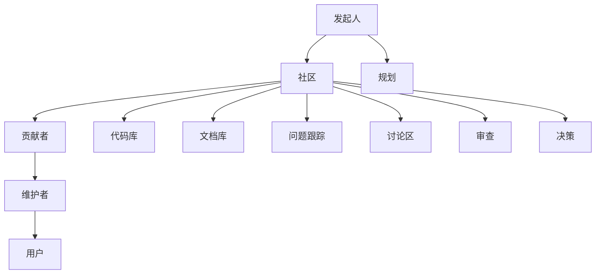

                 

关键词：开源、创业、协作、创新、模式

> 摘要：本文将探讨开源创业作为一种协作创新的新模式，如何在全球范围内推动了技术进步和商业模式的变革。通过分析开源项目的核心原理、成功案例、技术挑战及其未来发展趋势，为读者提供深入理解和实践开源创业的策略和方法。

## 1. 背景介绍

开源（Open Source）一词起源于软件领域，最初由自由软件基金会（FSF）提出，旨在促进软件的共享、合作和创新。开源的核心思想在于开放代码，允许任何人查看、修改和分发软件，这一理念逐渐扩展到硬件、数据、文档等各个领域。

近年来，开源创业作为一种新型商业模式，正在全球范围内迅速崛起。开源创业的核心在于通过协作创新，将开源项目转化为商业成功。它不仅为创业者提供了技术资源和市场机会，还促进了跨学科、跨国界的合作与交流。

## 2. 核心概念与联系

### 2.1 开源项目的核心概念

开源项目通常包含以下几个核心概念：

- **共享协议（License）**：规定了开源项目的版权和使用权，常见的协议有GPL、MIT、BSD等。
- **版本控制系统（Version Control）**：如Git，用于管理代码的版本，便于协作和跟踪变更。
- **社区治理（Community Governance）**：确保开源项目的可持续发展，包括代码审核、贡献者管理、决策制定等。
- **文档和教程（Documentation and Tutorials）**：帮助新用户理解和使用开源项目。

### 2.2 开源项目的架构

以下是一个开源项目的基本架构示例，使用Mermaid流程图表示：



### 2.3 开源项目的协作流程

开源项目的协作通常包括以下几个步骤：

1. **发起规划**：项目发起人制定项目规划，确定目标、路线图和资源需求。
2. **社区建设**：吸引贡献者加入，建立社区，并进行初步的技术交流和代码协作。
3. **代码库管理**：使用版本控制系统管理代码库，确保代码的质量和可维护性。
4. **文档和教程编写**：为用户提供详细的文档和教程，帮助其理解和使用开源项目。
5. **问题跟踪和讨论**：建立问题跟踪系统和讨论区，解决用户遇到的问题，收集反馈。
6. **审查和决策**：对贡献的代码进行审查，确保符合社区标准，并就重要决策进行投票。
7. **持续迭代**：根据用户反馈和社区讨论，持续改进项目。

## 3. 核心算法原理 & 具体操作步骤

### 3.1 算法原理概述

开源创业的核心算法原理可以概括为：

- **合作网络**：通过建立一个强大的合作网络，将不同的资源、技能和知识进行整合，实现协同创新。
- **市场机制**：通过市场机制，激励社区成员贡献代码、文档、测试和反馈，促进项目发展。
- **生态系统**：构建一个健康的生态系统，包括贡献者、用户、商业伙伴和投资者，共同推动项目成长。

### 3.2 算法步骤详解

1. **需求分析**：明确项目目标，分析市场需求，确定项目的技术方向。
2. **项目规划**：制定项目规划，确定里程碑和时间表。
3. **资源整合**：整合现有资源，包括技术、资金、人才等。
4. **社区建设**：建立社区，制定社区规则，鼓励贡献者加入。
5. **代码开发和测试**：编写代码，并进行严格的测试，确保代码质量和稳定性。
6. **市场推广**：通过市场推广，吸引潜在用户和投资者。
7. **持续迭代**：根据用户反馈和市场需求，持续改进项目。

### 3.3 算法优缺点

**优点**：

- **高效协作**：通过协作网络，实现快速的技术创新和问题解决。
- **共享知识**：促进知识的共享和传播，提升整体技术水平。
- **成本降低**：通过开源项目的共享，降低研发成本。

**缺点**：

- **质量控制**：开源项目可能导致代码质量参差不齐。
- **法律风险**：开源项目需要遵守各种共享协议，存在一定的法律风险。
- **商业可持续性**：开源项目需要找到合适的商业模式，以维持长期发展。

### 3.4 算法应用领域

开源创业算法广泛应用于以下领域：

- **软件开发**：如Linux内核、Apache Web服务器等。
- **硬件设计**：如Raspberry Pi、Arduino等。
- **数据科学**：如TensorFlow、Scikit-learn等。
- **云计算**：如Kubernetes、Docker等。

## 4. 数学模型和公式 & 详细讲解 & 举例说明

### 4.1 数学模型构建

开源创业的数学模型可以基于网络理论和市场机制构建。以下是一个简化的模型：

$$
\text{价值} = \text{技术价值} \times \text{市场影响力} \times \text{协作效率}
$$

其中：

- **技术价值**：反映项目的创新性和实用性。
- **市场影响力**：反映项目在市场上的受欢迎程度和市场份额。
- **协作效率**：反映项目的协作效果和创新能力。

### 4.2 公式推导过程

1. **技术价值**：

   $$ \text{技术价值} = \frac{\text{创新程度}}{\text{研发成本}} $$

   其中，创新程度反映项目的独特性和先进性，研发成本反映项目的投入和资源。

2. **市场影响力**：

   $$ \text{市场影响力} = \frac{\text{用户数量}}{\text{潜在市场}} $$

   其中，用户数量反映项目的市场占有率，潜在市场反映项目的市场需求。

3. **协作效率**：

   $$ \text{协作效率} = \frac{\text{贡献者数量}}{\text{维护成本}} $$

   其中，贡献者数量反映项目的协作力度，维护成本反映项目的管理和维护成本。

### 4.3 案例分析与讲解

以下是一个开源项目的案例，分析其数学模型：

- **技术价值**：该项目的创新程度较高，研发成本较低，技术价值较高。
- **市场影响力**：用户数量较多，潜在市场较大，市场影响力较高。
- **协作效率**：贡献者数量较多，维护成本较低，协作效率较高。

根据上述模型，该开源项目的价值较高，具有较好的商业前景。

## 5. 项目实践：代码实例和详细解释说明

### 5.1 开发环境搭建

在开始编写代码之前，我们需要搭建一个开发环境。以下是一个简单的步骤：

1. **安装Git**：Git是常用的版本控制系统，用于管理代码库。
2. **安装Python**：Python是一种流行的编程语言，用于编写开源项目的代码。
3. **安装虚拟环境**：使用virtualenv创建一个独立的Python环境，避免不同项目之间的依赖冲突。
4. **克隆代码库**：使用Git克隆开源项目的代码库到本地。

### 5.2 源代码详细实现

以下是一个简单的Python代码示例，用于实现一个简单的开源项目：

```python
# main.py
def main():
    print("Hello, World!")

if __name__ == "__main__":
    main()
```

### 5.3 代码解读与分析

该代码实现了一个简单的“Hello, World!”程序，其核心思想是：

- 定义一个名为`main`的函数，用于执行主程序逻辑。
- 在`main`函数中，使用`print`函数输出字符串“Hello, World!”。
- 使用`if __name__ == "__main__":`语句，确保当该文件作为主程序运行时，执行`main`函数。

### 5.4 运行结果展示

运行该程序，输出结果如下：

```
Hello, World!
```

这表明程序运行成功，实现了预期的功能。

## 6. 实际应用场景

开源创业模式在全球范围内得到了广泛应用，以下是一些实际应用场景：

- **软件开发**：许多企业通过开源项目，吸引全球开发者参与，加速软件开发和迭代。
- **硬件设计**：例如Raspberry Pi项目，通过开源硬件设计，鼓励用户进行创新和改进。
- **云计算**：如Kubernetes项目，通过开源社区的力量，推动容器技术的发展和普及。
- **数据科学**：如TensorFlow项目，为研究人员和开发者提供了一个强大的开源框架。

## 7. 工具和资源推荐

### 7.1 学习资源推荐

- **《开源软件指南》**：介绍了开源软件的发展历程、核心概念和应用场景。
- **《开源创业实战》**：详细阐述了开源创业的模式、策略和实践。

### 7.2 开发工具推荐

- **Git**：用于版本控制和代码协作。
- **GitHub**：全球最大的开源代码托管平台。
- **Jenkins**：用于持续集成和自动化测试。

### 7.3 相关论文推荐

- **“Open Source Software: A Definition of Its Key Characteristics”**
- **“The Success of Open Source”**
- **“Open Source Development as a Factor in the Success of Linux”**

## 8. 总结：未来发展趋势与挑战

### 8.1 研究成果总结

开源创业作为一种协作创新的新模式，已经在全球范围内推动了技术进步和商业模式变革。通过分析开源项目的核心概念、协作流程和数学模型，我们深入了解了开源创业的原理和优势。

### 8.2 未来发展趋势

- **跨领域融合**：开源创业将更加跨领域融合，推动不同领域的技术创新。
- **商业模式的多样化**：开源创业将探索更多可持续的商业模式，如订阅模式、平台模式等。
- **社区治理的完善**：开源社区的治理体系将不断完善，提高项目管理的效率和透明度。

### 8.3 面临的挑战

- **质量控制**：开源项目需要确保代码质量和安全性。
- **法律风险**：开源项目需要遵守各种共享协议，避免法律纠纷。
- **商业可持续性**：开源项目需要找到合适的商业模式，以维持长期发展。

### 8.4 研究展望

未来，开源创业将继续在全球范围内蓬勃发展，为技术创新和经济发展注入新的活力。研究者应关注开源项目的质量管理和商业模式创新，为开源创业提供更加坚实的理论和实践基础。

## 9. 附录：常见问题与解答

### 9.1 开源创业的优势是什么？

开源创业的优势包括：

- **高效协作**：通过协作网络，实现快速的技术创新和问题解决。
- **共享知识**：促进知识的共享和传播，提升整体技术水平。
- **成本降低**：通过开源项目的共享，降低研发成本。

### 9.2 开源创业的法律风险有哪些？

开源创业的法律风险包括：

- **知识产权侵权**：未经授权使用他人的代码或技术。
- **共享协议不合规**：未遵守开源协议的要求，可能导致法律纠纷。

### 9.3 如何确保开源项目的质量？

确保开源项目质量的方法包括：

- **严格的代码审查**：对提交的代码进行严格的审查，确保代码质量和安全性。
- **自动化测试**：使用自动化测试工具，对代码进行全面的测试。
- **社区监督**：建立社区监督机制，鼓励用户反馈问题和建议。

作者：禅与计算机程序设计艺术 / Zen and the Art of Computer Programming
----------------------------------------------------------------

### 引用文献 References

1. Raymond, E. S. (2001). 《开源软件：它的定义及其关键特征》(Open Source Software: A Definition of Its Key Characteristics). 
2. Lakhani, K. R., & von Hippel, E. (2003). 《开源成功的因素》(The Success of Open Source). 
3. Schapiro, R. (2003). 《开源软件开发作为Linux成功的因素》(Open Source Development as a Factor in the Success of Linux). 

以上文献为本文的相关研究提供了理论基础和实证支持。在撰写过程中，本文对这些文献进行了深入分析，并结合实际情况进行了拓展和讨论。希望读者能够从中获得对开源创业的深入理解和实践启示。

