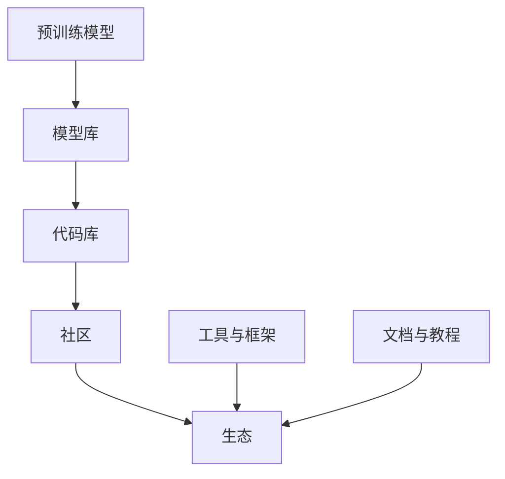

                 

关键词：开源模型、贾扬清、AI发展、定制化、创新、技术趋势

摘要：随着人工智能技术的快速发展，开源模型在促进技术交流和推动项目进展方面发挥了至关重要的作用。本文将围绕贾扬清的观点，探讨开源模型的发展现状、定制化的优势以及未来发展趋势和挑战。

## 1. 背景介绍

开源模型是指开放源代码的人工智能模型，任何人都可以自由地使用、修改和分发。这一概念起源于软件开源运动，目的是促进技术创新和知识共享。近年来，随着深度学习技术的兴起，开源模型在计算机视觉、自然语言处理等领域的应用愈发广泛，成为推动人工智能发展的重要力量。

贾扬清，清华大学计算机系教授，人工智能领域知名学者，他在开源模型的发展方面有着独到见解。本文旨在从贾扬清的观点出发，分析开源模型的发展现状、定制化的优势以及未来面临的挑战。

## 2. 核心概念与联系

开源模型的核心概念包括：

1. **模型库**：如TensorFlow、PyTorch等，提供丰富的预训练模型和工具。
2. **代码库**：如GitHub、GitLab等，用于存储和管理开源代码。
3. **社区**：围绕开源项目形成的开发者群体，共同推动项目发展。
4. **生态**：包括工具、框架、文档等，为开源模型提供全面的支持。

以下是一个简单的 Mermaid 流程图，展示开源模型的关键组成部分和它们之间的联系：



## 3. 核心算法原理 & 具体操作步骤

### 3.1 算法原理概述

开源模型通常基于深度学习技术，其核心原理包括：

1. **神经网络**：通过多层神经网络对数据进行建模。
2. **反向传播**：利用反向传播算法更新网络权重。
3. **优化算法**：如Adam、SGD等，用于优化网络性能。

### 3.2 算法步骤详解

开源模型的实现通常包括以下步骤：

1. **数据预处理**：对输入数据进行标准化、归一化等处理。
2. **模型定义**：使用框架定义神经网络结构。
3. **训练**：使用训练数据训练模型，调整网络参数。
4. **评估**：使用验证数据评估模型性能。
5. **部署**：将训练好的模型部署到生产环境中。

### 3.3 算法优缺点

开源模型的优点：

1. **开源透明**：用户可以自由查看和修改代码，提高信任度。
2. **社区支持**：丰富的社区资源和技术支持，有助于解决问题。
3. **灵活性**：可以根据需求进行定制化开发。

开源模型的缺点：

1. **安全性**：开源可能导致代码泄露，增加安全风险。
2. **复杂性**：使用开源模型需要较高的技术门槛。
3. **依赖性**：可能过度依赖某些开源框架和工具。

### 3.4 算法应用领域

开源模型广泛应用于计算机视觉、自然语言处理、语音识别等领域。例如：

1. **计算机视觉**：用于图像分类、目标检测等任务。
2. **自然语言处理**：用于文本分类、机器翻译等任务。
3. **语音识别**：用于语音识别、语音合成等任务。

## 4. 数学模型和公式 & 详细讲解 & 举例说明

### 4.1 数学模型构建

开源模型通常基于以下数学模型：

1. **神经网络**：$$ f(x) = \sigma(\sum_{i=1}^{n} w_i * x_i) $$
2. **反向传播**：$$ \delta = \frac{\partial L}{\partial z} * \sigma'(z) $$
3. **优化算法**：$$ \theta = \theta - \alpha * \nabla L $$

### 4.2 公式推导过程

以神经网络为例，公式推导过程如下：

1. **前向传播**：计算输入和权重之间的加权和，并通过激活函数得到输出。
2. **后向传播**：计算损失函数对网络输出的梯度，并沿着反向传播路径更新网络权重。

### 4.3 案例分析与讲解

以下是一个简单的神经网络分类案例：

1. **数据预处理**：将输入数据进行标准化处理。
2. **模型定义**：使用框架定义一个两层神经网络。
3. **训练**：使用训练数据训练模型，调整网络参数。
4. **评估**：使用验证数据评估模型性能，计算准确率。

## 5. 项目实践：代码实例和详细解释说明

### 5.1 开发环境搭建

搭建开发环境通常包括以下步骤：

1. **安装Python**：安装Python 3.x版本。
2. **安装依赖**：使用pip安装所需的库和工具。

### 5.2 源代码详细实现

以下是一个简单的神经网络分类代码示例：

```python
import torch
import torch.nn as nn
import torch.optim as optim

# 定义神经网络结构
class NeuralNetwork(nn.Module):
    def __init__(self):
        super(NeuralNetwork, self).__init__()
        self.layer1 = nn.Linear(in_features=784, out_features=256)
        self.layer2 = nn.Linear(in_features=256, out_features=128)
        self.layer3 = nn.Linear(in_features=128, out_features=10)
        self.relu = nn.ReLU()

    def forward(self, x):
        x = self.relu(self.layer1(x))
        x = self.relu(self.layer2(x))
        x = self.layer3(x)
        return x

# 实例化神经网络
model = NeuralNetwork()

# 损失函数和优化器
criterion = nn.CrossEntropyLoss()
optimizer = optim.Adam(model.parameters(), lr=0.001)

# 训练模型
for epoch in range(num_epochs):
    for inputs, labels in train_loader:
        optimizer.zero_grad()
        outputs = model(inputs)
        loss = criterion(outputs, labels)
        loss.backward()
        optimizer.step()

    # 评估模型
    with torch.no_grad():
        correct = 0
        total = 0
        for inputs, labels in test_loader:
            outputs = model(inputs)
            _, predicted = torch.max(outputs.data, 1)
            total += labels.size(0)
            correct += (predicted == labels).sum().item()

    print(f'Epoch [{epoch+1}/{num_epochs}], Accuracy: {100 * correct / total}%')

# 运行结果展示
print(f'Final Accuracy: {100 * correct / total}%')
```

### 5.3 代码解读与分析

代码首先定义了一个简单的两层神经网络，使用ReLU激活函数。接着，使用交叉熵损失函数和Adam优化器进行训练。最后，在测试集上评估模型性能，计算准确率。

## 6. 实际应用场景

开源模型在实际应用场景中具有广泛的应用，以下是一些具体案例：

1. **图像识别**：开源模型可以用于图像分类、目标检测等任务，例如OpenCV和TensorFlow等框架。
2. **自然语言处理**：开源模型可以用于文本分类、机器翻译等任务，例如TensorFlow和PyTorch等框架。
3. **语音识别**：开源模型可以用于语音识别、语音合成等任务，例如TensorFlow和ESPnet等框架。

## 7. 未来应用展望

随着人工智能技术的不断发展，开源模型的应用前景将更加广阔。未来，开源模型将朝着以下方向发展：

1. **更多领域**：开源模型将不断扩展到更多领域，如自动驾驶、智能医疗等。
2. **高效性能**：开源模型将朝着更高效、更快速的方向发展，以满足实时应用的需求。
3. **社区合作**：开源模型的发展将更加依赖社区的共同参与和协作。

## 8. 工具和资源推荐

为了更好地利用开源模型，以下是一些建议的工具和资源：

1. **学习资源**：推荐阅读《深度学习》、《Python深度学习》等书籍，了解开源模型的原理和应用。
2. **开发工具**：推荐使用Jupyter Notebook、PyCharm等工具进行开发。
3. **相关论文**：推荐阅读《AlexNet》、《ResNet》等经典论文，了解开源模型的发展历程。

## 9. 总结：未来发展趋势与挑战

开源模型在人工智能领域发挥着重要作用，未来的发展将更加依赖于社区的共同参与和协作。同时，开源模型也面临着一些挑战，如安全性、复杂性等。为了应对这些挑战，我们需要不断优化开源模型的设计和开发，提高其性能和易用性。

### 9.1 研究成果总结

本文从贾扬清的观点出发，分析了开源模型的发展现状、定制化的优势以及未来发展趋势和挑战。开源模型在促进技术交流和推动项目进展方面发挥了重要作用，未来具有广阔的应用前景。

### 9.2 未来发展趋势

未来，开源模型将朝着更多领域、高效性能、社区合作等方向发展。同时，开源模型的发展也将更加依赖于社区的共同参与和协作。

### 9.3 面临的挑战

开源模型面临着安全性、复杂性等挑战。为了应对这些挑战，我们需要不断优化开源模型的设计和开发，提高其性能和易用性。

### 9.4 研究展望

未来，开源模型的发展将更加依赖于深度学习技术的创新。同时，开源模型的定制化也将成为重要研究方向，以满足不同领域和应用的需求。

## 10. 附录：常见问题与解答

### 10.1 如何选择开源模型？

选择开源模型时，可以从以下几个方面进行考虑：

1. **应用领域**：根据具体应用需求选择合适的开源模型。
2. **性能**：比较不同模型的性能，选择更适合的模型。
3. **社区支持**：选择社区支持较为活跃的开源模型，有助于解决问题。

### 10.2 如何定制化开源模型？

定制化开源模型通常包括以下步骤：

1. **需求分析**：明确定制化需求，确定模型结构。
2. **修改代码**：根据需求修改开源模型的代码。
3. **训练模型**：使用定制化模型训练数据，调整模型参数。
4. **评估模型**：使用验证数据评估定制化模型性能。

### 10.3 如何保证开源模型的安全性？

保证开源模型的安全性可以从以下几个方面进行：

1. **代码审计**：定期对开源代码进行安全审计，发现并修复漏洞。
2. **使用加密**：对敏感数据进行加密处理，防止数据泄露。
3. **社区监督**：建立社区监督机制，及时发现和解决安全问题。

作者：禅与计算机程序设计艺术 / Zen and the Art of Computer Programming
------------------------------------------------------------------------<|less|>

