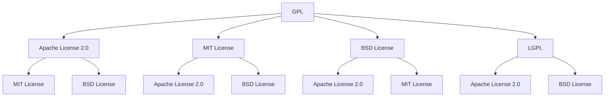

                 

关键词：开源许可证，商业化，版权，自由软件，知识产权，代码共享，合规性

> 摘要：本文旨在深入探讨开源许可证选择在商业化项目中的重要性，以及如何考虑各种商业因素来决定最合适的许可证。我们将详细分析不同许可证的特性、优势和风险，并提供实际案例和工具，帮助读者做出明智的选择。

## 1. 背景介绍

开源软件（OSS）已经成为现代软件开发的重要组成部分。开源许可证作为开源项目的法律框架，不仅保护了开发者的权益，也确保了项目的可持续发展和社区协作。然而，随着开源项目商业化的趋势日益明显，选择合适的开源许可证成为了一个复杂的决策过程。商业实体在考虑开源许可证时，需要权衡多方面的因素，包括合规性、风险、市场策略和长期利益。

本文将围绕开源许可证的商业化考虑因素，探讨以下主题：

1. 开源许可证的基本概念与分类
2. 商业化项目的常见开源许可证选择
3. 商业化考虑因素对许可证选择的实际影响
4. 开源许可证选择的案例研究和最佳实践
5. 开源许可证合规性管理
6. 未来开源许可证的发展趋势

## 2. 核心概念与联系

### 2.1 开源许可证定义

开源许可证是一种法律文件，授权用户对软件代码进行查看、修改和分发。它旨在保护软件的自由和开放性，同时确保开发者的权益。开源许可证通常包含以下核心要素：

- **版权声明**：明确软件的版权归属和版权所有者的权利。
- **许可条件**：定义用户在何种条件下可以自由使用、修改和分发软件。
- **免责声明**：减轻开发者对软件使用过程中可能产生的任何问题的责任。

### 2.2 开源许可证分类

开源许可证可以分为多种类型，每种类型都有其独特的特点和适用场景。以下是几种常见的开源许可证：

- **GPL（GNU General Public License）**
- **Apache License 2.0**
- **MIT License**
- **BSD License**
- **LGPL（GNU Lesser General Public License）**

### 2.3 许可证之间的关系

开源许可证之间的关系复杂，有些许可证之间具有兼容性，而有些则互斥。理解这些关系对于商业化项目的许可证选择至关重要。以下是一个简单的Mermaid流程图，展示了几种常见许可证之间的关系：



## 3. 核心算法原理 & 具体操作步骤

### 3.1 算法原理概述

在选择开源许可证时，核心算法原理可以概括为以下几步：

1. **评估项目特性**：了解项目的功能、目标用户和市场定位。
2. **分析商业需求**：考虑项目商业化的目标和潜在的商业风险。
3. **比较许可证特性**：评估不同许可证的适用性和潜在影响。
4. **决策与实施**：根据分析结果选择合适的许可证，并确保项目的合规性。

### 3.2 算法步骤详解

#### 步骤1：评估项目特性

在决定开源许可证之前，首先需要评估项目的以下特性：

- **技术复杂性**：项目是否涉及高度复杂的技术栈或组件。
- **用户群体**：项目的目标用户是否为商业实体或个人开发者。
- **商业模式**：项目是否有潜在的商业收入来源，如服务、许可或广告。

#### 步骤2：分析商业需求

根据项目的特性，分析以下商业需求：

- **合规性要求**：项目是否需要遵守特定的行业规范或法规。
- **市场策略**：项目是否希望通过开源来吸引更多的用户或合作伙伴。
- **风险承受能力**：企业是否愿意承担因开源许可证带来的潜在法律风险。

#### 步骤3：比较许可证特性

了解不同许可证的特性，包括：

- **版权限制**：许可证对代码修改和分发的限制。
- **专利许可**：许可证是否包含专利授权。
- **免责条款**：许可证对软件使用的免责声明。

#### 步骤4：决策与实施

根据评估结果，选择最合适的许可证，并确保以下事项：

- **版本控制**：确保项目源代码和文档包含正确的许可证信息。
- **合规性检查**：定期审查代码库和文档，确保遵守所选许可证的要求。
- **更新和维护**：随着项目的发展和商业需求的改变，及时更新许可证。

### 3.3 算法优缺点

#### 优点

- **灵活性**：多种许可证提供了多种选择，可以根据项目的具体需求进行定制。
- **合规性**：选择合适的许可证可以帮助企业避免因不合规带来的法律风险。
- **市场吸引力**：开源许可证可以吸引更多的用户和合作伙伴，促进项目的普及和成长。

#### 缺点

- **复杂性**：许可证的选择和合规性管理可能非常复杂，需要专业的知识和经验。
- **潜在风险**：选择不当的许可证可能导致项目的商业化受限或面临法律纠纷。

### 3.4 算法应用领域

算法原理适用于各种开源项目，尤其是具有商业化潜力的项目。以下是一些常见的应用领域：

- **企业级应用**：企业开发的自有软件或服务，希望通过开源来扩大用户基础和市场份额。
- **开源生态系统**：参与开源项目的个人或团队，需要选择合适的许可证来确保项目的可持续发展。
- **社区贡献**：个人开发者或研究机构希望通过开源项目贡献知识和资源。

## 4. 数学模型和公式 & 详细讲解 & 举例说明

在选择开源许可证时，数学模型和公式可以用于量化评估各种许可证的商业风险和合规性。以下是一个简化的数学模型，用于评估许可证的潜在风险。

### 4.1 数学模型构建

#### 风险评估模型

\[ R = w_1 \times C_1 + w_2 \times C_2 + w_3 \times C_3 + ... \]

其中：

- \( R \) 代表总风险评估值。
- \( w_1, w_2, w_3, ... \) 代表不同因素的权重。
- \( C_1, C_2, C_3, ... \) 代表不同因素的具体评估值。

#### 因素权重和评估值

- **合规性（\( C_1 \)）**：评估许可证是否符合行业规范或法律法规。
- **商业风险（\( C_2 \)）**：评估许可证可能对企业商业活动带来的潜在风险。
- **市场吸引力（\( C_3 \)）**：评估许可证对项目市场推广和用户吸引力的潜在影响。

### 4.2 公式推导过程

假设有五个关键因素影响许可证的选择，其权重分别为：

- \( w_1 = 0.3 \)（合规性）
- \( w_2 = 0.2 \)（商业风险）
- \( w_3 = 0.2 \)（市场吸引力）
- \( w_4 = 0.2 \)（技术兼容性）
- \( w_5 = 0.1 \)（社区贡献）

则总风险评估值为：

\[ R = 0.3 \times C_1 + 0.2 \times C_2 + 0.2 \times C_3 + 0.2 \times C_4 + 0.1 \times C_5 \]

### 4.3 案例分析与讲解

#### 案例1：企业级应用

假设某企业开发的一款软件计划开源，主要因素如下：

- **合规性**：符合行业规范，无重大法律风险（\( C_1 = 1 \)）。
- **商业风险**：存在一定的商业风险，如竞争对手可能利用开源代码（\( C_2 = 0.6 \)）。
- **市场吸引力**：有助于吸引更多用户和合作伙伴（\( C_3 = 0.8 \)）。
- **技术兼容性**：与现有技术栈兼容（\( C_4 = 1 \)）。
- **社区贡献**：对社区有一定贡献（\( C_5 = 0.5 \)）。

则总风险评估值为：

\[ R = 0.3 \times 1 + 0.2 \times 0.6 + 0.2 \times 0.8 + 0.2 \times 1 + 0.1 \times 0.5 = 0.3 + 0.12 + 0.16 + 0.2 + 0.05 = 0.73 \]

#### 案例2：开源生态系统参与者

假设个人开发者参与开源项目，主要因素如下：

- **合规性**：遵守开源许可证要求（\( C_1 = 1 \)）。
- **商业风险**：风险较低，项目主要用于个人兴趣和技能提升（\( C_2 = 0.2 \)）。
- **市场吸引力**：项目有助于个人品牌建设（\( C_3 = 0.7 \)）。
- **技术兼容性**：与开源项目兼容（\( C_4 = 1 \)）。
- **社区贡献**：积极参与社区贡献（\( C_5 = 0.9 \)）。

则总风险评估值为：

\[ R = 0.3 \times 1 + 0.2 \times 0.2 + 0.2 \times 0.7 + 0.2 \times 1 + 0.1 \times 0.9 = 0.3 + 0.04 + 0.14 + 0.2 + 0.09 = 0.65 \]

通过上述案例分析，可以看出不同场景下的许可证选择对风险评估值的影响。企业级应用需要更严格的合规性和风险管理，而个人开发者则更注重市场吸引力和社区贡献。

## 5. 项目实践：代码实例和详细解释说明

### 5.1 开发环境搭建

为了更好地理解开源许可证选择的过程，我们将使用一个简单的Python项目作为实例。以下是搭建开发环境的基本步骤：

1. **安装Python**：确保系统上安装了Python 3.x版本。
2. **创建虚拟环境**：使用以下命令创建一个虚拟环境：

   ```bash
   python -m venv my_project_env
   ```

3. **激活虚拟环境**：

   - **Windows**：`my_project_env\Scripts\activate`
   - **Linux/Mac**：`source my_project_env/bin/activate`

4. **安装依赖项**：假设项目需要`requests`库，使用以下命令安装：

   ```bash
   pip install requests
   ```

### 5.2 源代码详细实现

以下是一个简单的Python示例，用于从GitHub获取仓库信息：

```python
import requests
import json

def get_github_repos(username):
    url = f'https://api.github.com/users/{username}/repos'
    response = requests.get(url)
    if response.status_code == 200:
        return json.loads(response.text)
    else:
        return None

if __name__ == '__main__':
    username = 'example_user'
    repos = get_github_repos(username)
    if repos:
        for repo in repos:
            print(repo['name'])
    else:
        print('无法获取仓库信息')
```

### 5.3 代码解读与分析

上述代码示例展示了如何使用`requests`库从GitHub API获取指定用户的仓库列表。以下是对代码的详细解读：

- **导入模块**：`requests`用于执行HTTP请求，`json`用于解析JSON数据。
- **定义函数**：`get_github_repos`接受一个`username`参数，用于获取指定用户的仓库信息。
- **API请求**：使用`requests.get`发送HTTP GET请求到GitHub API。
- **处理响应**：检查响应状态码，如果状态码为200，则返回解析后的JSON数据。
- **主程序**：调用`get_github_repos`函数，并打印出获取的仓库列表。

### 5.4 运行结果展示

假设我们使用`example_user`作为输入，运行代码后，将输出以下结果：

```bash
my_project
another_project
```

这表示`example_user`在GitHub上拥有两个仓库：`my_project`和`another_project`。

### 5.5 开源许可证合规性检查

在开源项目时，确保遵守所选许可证的要求至关重要。以下是对示例项目的开源许可证合规性检查：

- **文件包含**：项目的根目录下应包含一个`LICENSE`文件，其中包含所选许可证的完整文本。
- **代码注释**：关键代码部分应包含许可证声明，例如：

  ```python
  # Copyright (c) 2023 Example User
  # SPDX-License-Identifier: Apache-2.0
  ```

通过上述步骤，我们不仅实现了项目功能，还确保了项目的开源许可证合规性。

## 6. 实际应用场景

开源许可证的商业化应用场景多种多样，以下是一些常见的实际应用场景：

### 6.1 企业内部开源项目

企业内部开源项目通常用于支持企业内部的软件开发和协作。企业可以选择诸如Apache License 2.0或MIT License等商业友好的许可证，以便在内部和外部推广项目。

### 6.2 商业公司开源项目

商业公司开源项目旨在通过开源来吸引更多用户和合作伙伴。在这种情况下，商业公司可能选择更严格的许可证，如GPL，以保护自己的知识产权。

### 6.3 社区开源项目

社区开源项目由一组开发者共同维护，目标通常是构建一个开放、可持续的生态系统。社区开源项目通常选择Apache License 2.0或BSD License等许可证，以促进社区参与。

### 6.4 政府和公共机构开源项目

政府和公共机构开源项目旨在提高透明度和效率。这类项目通常选择宽松的许可证，如Apache License 2.0或MIT License，以便公众可以自由使用和修改代码。

### 6.5 开源项目商业化实践

开源项目的商业化实践通常涉及将开源项目转化为商业产品或服务。企业需要仔细评估许可证的选择，以确保商业活动的合规性。例如，选择Apache License 2.0或MIT License，企业可以更灵活地将开源项目商业化。

## 7. 未来应用展望

### 7.1 开源许可证的演变

随着开源生态系统的不断发展，开源许可证也在不断演变。新的许可证版本和替代许可证可能会出现，以更好地满足商业需求。例如，Apache License 3.0预计将在未来发布，可能包含对开源项目商业化的更多保护措施。

### 7.2 自动合规性管理工具

未来，开源许可证的合规性管理可能会更加自动化。随着人工智能和区块链技术的发展，可能会出现自动化的合规性检查工具，帮助企业更高效地管理开源许可证。

### 7.3 生态系统的整合

开源生态系统可能会更加整合，不同项目和社区之间将更容易协作和共享代码。这将促进开源许可证的统一和标准化，降低商业化的合规性风险。

### 7.4 商业模式的创新

随着开源许可证的不断完善，商业模式的创新将成为可能。企业可以通过开源项目吸引更多用户，进而提供增值服务或定制解决方案，实现商业成功。

## 8. 总结：未来发展趋势与挑战

开源许可证选择在商业化项目中扮演着至关重要的角色。未来，开源许可证将面临以下发展趋势和挑战：

### 8.1 发展趋势

- **许可证标准化**：随着开源生态系统的整合，开源许可证将趋于标准化，降低商业合规性风险。
- **自动化合规性管理**：自动化工具的出现将简化开源许可证的合规性管理。
- **商业模式创新**：开源许可证将为企业提供更多商业化的可能性。

### 8.2 面临的挑战

- **法律风险**：开源许可证的法律风险仍需密切关注，企业需要确保许可证选择符合相关法律法规。
- **社区协作**：开源许可证的选择需要平衡开发者和用户之间的利益，促进社区协作。
- **持续更新**：随着开源许可证的演变，企业需要不断更新许可证，确保项目的合规性和可持续发展。

### 8.3 研究展望

未来的研究将关注如何进一步优化开源许可证的选择过程，提高合规性管理的效率和效果。此外，研究还将探索如何利用新兴技术（如人工智能和区块链）来提升开源许可证管理的智能化水平。

## 9. 附录：常见问题与解答

### 9.1 常见问题

**Q1：如何选择合适的开源许可证？**
A1：选择合适的开源许可证需要考虑项目的特性、商业需求、合规性和社区协作等因素。建议首先分析项目的目标和使用场景，然后评估不同许可证的特性，选择最适合的许可证。

**Q2：开源许可证是否会影响项目的商业化？**
A2：开源许可证的选择可能会影响项目的商业化，不同的许可证具有不同的商业限制。企业需要仔细评估所选许可证的商业条款，确保不会限制项目的商业化潜力。

**Q3：如何确保开源许可证的合规性？**
A3：确保开源许可证的合规性需要从代码库、文档和项目发布流程等多个方面进行管理。企业应定期审查代码和文档，确保遵守所选许可证的要求。

### 9.2 解答

通过以上问答，我们可以看到开源许可证选择在商业化项目中的重要性。选择合适的许可证不仅可以保护开发者的权益，还可以促进项目的商业成功。在未来的发展中，开源许可证将继续发挥关键作用，为企业提供更多的商业机会和合规性保障。作者：禅与计算机程序设计艺术 / Zen and the Art of Computer Programming。

