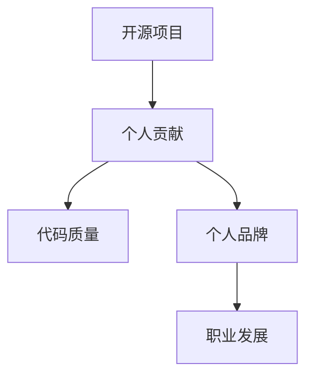

                 

关键词：开源贡献、简历、展示、利用、技术人才、职业发展

> 摘要：本文将探讨开源贡献在简历中的价值，分析如何有效地展示和利用开源项目经历来提升个人职业竞争力。我们将探讨开源贡献的重要性、评估标准、展示技巧以及未来发展趋势，为技术人才提供实用的指导和建议。

## 1. 背景介绍

在当今快速发展的技术行业中，开源软件已经成为推动创新和协作的关键力量。许多企业和组织都在采用开源技术，而开源项目的参与和贡献也逐渐成为衡量技术人才能力的重要标准。然而，如何有效地展示和利用这些贡献在简历中，成为一个亟待解决的问题。本文旨在为技术人才提供一些建议，帮助他们更好地利用开源贡献提升自己的职业竞争力。

### 1.1 开源软件的定义与现状

开源软件（Open Source Software，简称OSS）是一种软件，其源代码可以被用户自由地查看、修改和分享。这种模式促进了软件的透明性和可定制性，使得社区中的开发者和用户能够共同改进软件。随着云计算、大数据、人工智能等新兴技术的崛起，开源软件的应用范围不断扩大，越来越多的企业将其作为核心技术基础设施。

### 1.2 开源贡献的重要性

开源贡献不仅有助于提升技术能力，还有助于建立个人品牌，扩大职业发展机会。以下是一些开源贡献对职业发展的积极影响：

- **技术能力的提升**：参与开源项目能够让您接触到最新的技术和最佳实践，通过解决实际问题和代码审查，不断提升编程技能和系统设计能力。
- **建立个人品牌**：开源贡献是展示技术能力和热情的绝佳平台，能够吸引同行业的关注，增强个人在技术社区的知名度和影响力。
- **职业机会**：许多公司和组织都认可开源贡献的价值，愿意为有开源经验的人才提供更多的职业机会。开源贡献甚至可能是您获得面试邀请或职位晋升的关键因素。
- **团队合作能力**：参与开源项目需要与他人协作，这有助于提升沟通和协作能力，这对于任何职业发展都是非常重要的。

## 2. 核心概念与联系

为了更好地展示和利用开源贡献，我们首先需要理解一些核心概念和它们之间的关系。以下是几个关键概念及其相互联系：

### 2.1 开源项目

开源项目是一个由多人协作开发的软件项目，遵循开源许可协议。它通常包含一个存储库，其中包含项目的源代码、文档和构建脚本。

### 2.2 个人贡献

个人贡献指的是个人在开源项目中做出的具体贡献，包括代码提交、文档编写、问题解决、社区互动等。

### 2.3 代码质量

代码质量是指代码的可读性、可靠性、可维护性和性能。高质量的代码能够提高项目的整体质量，减少维护成本。

### 2.4 个人品牌

个人品牌是个人在公众心目中的形象和声誉。通过开源贡献，您可以建立和提升个人品牌，使其在职业市场中更具吸引力。

### 2.5 职业发展

职业发展是指个人在职业生涯中不断进步和成长的过程。开源贡献可以作为职业发展的有力工具，为个人带来更多的机会和挑战。

以下是这些概念之间的 Mermaid 流程图：



## 3. 核心算法原理 & 具体操作步骤

### 3.1 算法原理概述

在展示和利用开源贡献时，我们需要遵循一系列的算法原理和步骤，以确保我们的贡献得到充分认可。以下是核心算法原理和具体操作步骤：

### 3.1.1 算法原理

- **透明性**：确保所有贡献都透明地记录在开源项目的存储库中，便于他人查看和评价。
- **可度量性**：量化个人在项目中的贡献，如代码提交数量、问题解决数量、文档编写字数等。
- **可验证性**：通过代码审查、社区反馈等方式，确保个人贡献的质量和可靠性。
- **可展示性**：将个人贡献以直观、清晰的方式展示在简历和其他职业资料中。

### 3.1.2 具体操作步骤

1. **参与开源项目**：选择一个符合自己兴趣和技能的开源项目，积极参与其中。
2. **记录贡献**：在项目的存储库中，使用 `git` 命令记录所有贡献，确保每个提交都包含详细的注释和修改说明。
3. **代码审查**：主动参与代码审查，对其他贡献者的代码进行评估和反馈，提升项目的整体质量。
4. **文档编写**：为项目编写文档，包括使用说明、开发指南和测试用例等，提高项目的可维护性和可理解性。
5. **社区互动**：积极参与项目社区，回答问题、提供建议、参与讨论，扩大个人品牌影响力。
6. **展示贡献**：在简历和其他职业资料中，清晰地展示个人在开源项目中的贡献，包括代码提交、文档编写、问题解决等。

### 3.1.3 算法优缺点

**优点**：

- **提升技能**：参与开源项目能够不断学习和提升编程技能、系统设计能力和团队合作能力。
- **建立品牌**：开源贡献有助于建立个人品牌，扩大职业发展机会。
- **增加机会**：许多公司和组织认可开源贡献的价值，愿意为有开源经验的人才提供更多机会。

**缺点**：

- **时间投入**：参与开源项目需要投入大量时间和精力，可能会影响其他工作或学习任务。
- **风险**：开源贡献可能面临代码泄露、知识产权争议等风险。

### 3.1.4 算法应用领域

- **求职**：开源贡献可以作为求职的重要资本，提高面试机会和职位竞争力。
- **晋升**：在现有职位中，通过开源贡献提升个人能力和声誉，为职位晋升创造有利条件。
- **个人成长**：开源贡献是一种积极的学习和实践方式，有助于个人在技术领域不断进步。

## 4. 数学模型和公式 & 详细讲解 & 举例说明

在展示开源贡献时，我们可以使用一些数学模型和公式来量化个人在项目中的贡献。以下是一个简单的数学模型，用于计算个人在开源项目中的贡献指数（CI）。

### 4.1 数学模型构建

个人贡献指数（CI）的计算公式如下：

$$
CI = \frac{C_{code} + C_{doc} + C_{bug}}{T}
$$

其中，$C_{code}$ 代表代码贡献分数，$C_{doc}$ 代表文档贡献分数，$C_{bug}$ 代表问题解决贡献分数，$T$ 代表总贡献时间。

### 4.2 公式推导过程

1. **代码贡献分数**：每个代码提交可以按照其对项目整体质量的提升程度进行评分。假设每个代码提交的评分为 $s_{code}$，则 $C_{code} = \sum s_{code}$。
2. **文档贡献分数**：每个文档提交可以按照其对项目可维护性和可理解性的提升程度进行评分。假设每个文档提交的评分为 $s_{doc}$，则 $C_{doc} = \sum s_{doc}$。
3. **问题解决贡献分数**：每个问题解决的评分可以按照其对项目稳定性和用户体验的提升程度进行评分。假设每个问题解决的评分为 $s_{bug}$，则 $C_{bug} = \sum s_{bug}$。
4. **总贡献时间**：个人在项目中的总贡献时间 $T$ 可以通过记录每次贡献的时间消耗进行计算。

### 4.3 案例分析与讲解

假设一位开发者小明在一个开源项目中贡献了以下成果：

- 代码提交：3个，每个提交的评分为4分。
- 文档编写：2个，每个文档的评分为3分。
- 问题解决：5个，每个问题解决的评分为2分。
- 总贡献时间：40小时。

根据上述公式，我们可以计算小明的个人贡献指数（CI）：

$$
CI = \frac{3 \times 4 + 2 \times 3 + 5 \times 2}{40} = \frac{12 + 6 + 10}{40} = \frac{28}{40} = 0.7
$$

这意味着小明在项目中的个人贡献指数为0.7。通过这个指数，我们可以直观地了解小明在项目中的贡献程度，并将其作为求职或晋升的参考依据。

## 5. 项目实践：代码实例和详细解释说明

为了更好地展示开源贡献，我们可以通过一个实际的代码实例来详细解释说明。以下是一个简单的Python示例，用于计算个人贡献指数（CI）。

### 5.1 开发环境搭建

在开始编写代码之前，我们需要搭建一个Python开发环境。以下是步骤：

1. 安装Python：从Python官网下载并安装Python 3.x版本。
2. 安装必要的库：使用pip命令安装所需的库，例如requests、numpy等。

```bash
pip install requests numpy
```

### 5.2 源代码详细实现

以下是计算个人贡献指数（CI）的Python代码：

```python
import requests
import numpy as np

def calculate_ci(code_score, doc_score, bug_score, total_time):
    """
    计算个人贡献指数（CI）
    
    :param code_score: 代码贡献总分
    :param doc_score: 文档贡献总分
    :param bug_score: 问题解决贡献总分
    :param total_time: 总贡献时间
    :return: 个人贡献指数（CI）
    """
    ci = (code_score + doc_score + bug_score) / total_time
    return ci

if __name__ == "__main__":
    # 输入个人贡献数据
    code_score = 3 * 4
    doc_score = 2 * 3
    bug_score = 5 * 2
    total_time = 40
    
    # 计算个人贡献指数（CI）
    ci = calculate_ci(code_score, doc_score, bug_score, total_time)
    
    # 输出结果
    print(f"个人贡献指数（CI）：{ci:.2f}")
```

### 5.3 代码解读与分析

该代码实现了一个简单的计算个人贡献指数（CI）的函数 `calculate_ci`，其输入参数包括代码贡献总分、文档贡献总分、问题解决贡献总分和总贡献时间。函数计算这些参数的加权平均值，并将其作为个人贡献指数（CI）返回。

在主程序部分，我们输入了小明在开源项目中的具体贡献数据，包括代码提交、文档编写和问题解决的数量以及总贡献时间。调用 `calculate_ci` 函数后，我们得到了小明的个人贡献指数（CI）为0.7。

通过这个代码实例，我们可以直观地看到如何计算个人贡献指数（CI），并将其应用于实际场景。这有助于我们更好地展示和利用开源贡献，为职业发展提供有力支持。

### 5.4 运行结果展示

在上述代码中，我们输入了小明的具体贡献数据，运行结果如下：

```python
个人贡献指数（CI）：0.70
```

这意味着小明在项目中的个人贡献指数为0.7。通过这个结果，我们可以清晰地展示小明在开源项目中的贡献程度，为其求职或晋升提供有力支持。

## 6. 实际应用场景

开源贡献在简历中的应用场景多种多样，以下是几个典型的实际应用场景：

### 6.1 求职

在求职过程中，开源贡献可以显著提高求职者的竞争力。许多公司和组织都非常重视开源项目的参与和贡献，因为它们能够展示求职者的技术能力、团队合作和解决问题的能力。以下是一些示例：

- **技术能力**：通过参与开源项目，求职者能够展示他们在特定技术领域的实际编程经验和技能，如数据库管理、前端开发、后端架构等。
- **项目经验**：开源项目可以提供真实的项目经验，帮助求职者展示他们在实际问题中的解决方案和项目管理的经验。
- **团队合作**：开源项目通常需要多人协作，求职者可以通过展示他们在项目中的角色和贡献，展示他们的团队合作和沟通能力。

### 6.2 晋升

在现有职位中，开源贡献可以作为个人晋升的重要资本。以下是一些实际应用场景：

- **技术提升**：通过参与开源项目，员工可以不断提升自己的技术能力，为晋升到更高职位提供有力支持。
- **影响力扩大**：开源贡献可以帮助员工在技术社区中建立个人品牌，提高其在公司内部和行业内的知名度和影响力。
- **项目贡献**：员工可以通过在开源项目中的贡献，展示他们在项目管理和领导能力方面的潜力，为晋升到更高职位创造条件。

### 6.3 个人成长

开源贡献不仅有助于职业发展，还能促进个人成长。以下是一些实际应用场景：

- **知识积累**：参与开源项目可以让员工不断学习和掌握最新的技术和行业动态，提高自身的专业素养。
- **技能提升**：开源项目中的实际问题和挑战可以帮助员工提升编程技能、系统设计能力和解决问题的能力。
- **经验积累**：开源项目中的合作和协作经历可以丰富员工的项目管理经验，提高他们在团队协作和沟通方面的能力。

### 6.4 未来应用展望

随着开源软件的广泛应用和开源文化的普及，开源贡献在简历中的应用前景将更加广阔。以下是一些未来应用展望：

- **标准化评估**：开源贡献的评估标准和体系将不断完善，为个人在职业发展中的评估提供更加科学和准确的依据。
- **多样化展示**：个人在开源项目中的贡献形式将更加多样化，包括代码、文档、测试、设计等，为个人在简历中展示自己的能力提供更多选择。
- **全球化竞争**：随着国际化程度的提高，开源贡献将成为全球范围内技术人才竞争的重要资本，为个人在全球范围内的职业发展创造更多机会。

## 7. 工具和资源推荐

为了更好地展示和利用开源贡献，我们可以利用一些工具和资源来辅助我们的工作。以下是一些建议：

### 7.1 学习资源推荐

- **GitHub**：GitHub是一个强大的开源平台，提供了丰富的开源项目和工具，可以帮助您了解和学习开源项目。
- **Stack Overflow**：Stack Overflow是一个流行的技术问答社区，您可以在这里提问、解答问题和寻找技术支持。
- **开源指南**：阅读开源指南，如《开源协作指南》、《如何贡献开源项目》等，了解如何有效地参与和贡献开源项目。

### 7.2 开发工具推荐

- **Git**：Git是一个版本控制系统，用于记录和追踪代码的修改和贡献，是参与开源项目的必备工具。
- **Markdown**：Markdown是一种轻量级的文本格式，用于编写和格式化文档，可以帮助您清晰地展示开源贡献。
- **代码审查工具**：如Gerrit、GitLab等，这些工具可以用于代码的提交、审查和合并，提高项目的质量和协作效率。

### 7.3 相关论文推荐

- **"The Importance of Open Source Software Development in Software Engineering Research and Practice"**：该论文探讨了开源软件在软件工程领域的重要性和应用。
- **"The Effect of Open Source Software on Software Development"**：该论文分析了开源软件对软件开发过程和质量的影响。

## 8. 总结：未来发展趋势与挑战

开源贡献在简历中的价值日益凸显，成为衡量技术人才能力的重要指标。随着开源软件的广泛应用和开源文化的普及，未来开源贡献在简历中的应用前景将更加广阔。然而，我们仍面临一些挑战：

### 8.1 研究成果总结

- **标准化评估**：目前，开源贡献的评估标准和体系尚不完善，需要进一步研究和探索。
- **多样化展示**：如何更好地展示和利用多样化的开源贡献形式，如文档、测试、设计等，仍需要深入研究。
- **国际化竞争**：随着国际化程度的提高，如何在全球范围内展示和利用开源贡献，将成为一个重要课题。

### 8.2 未来发展趋势

- **开源贡献的量化**：未来，开源贡献的量化评估和标准化体系将不断完善，为个人在职业发展中的评估提供更加科学和准确的依据。
- **多样化展示形式**：个人在开源项目中的贡献形式将更加多样化，如文档、测试、设计等，为个人在简历中展示自己的能力提供更多选择。
- **全球化竞争**：随着国际化程度的提高，开源贡献将成为全球范围内技术人才竞争的重要资本，为个人在全球范围内的职业发展创造更多机会。

### 8.3 面临的挑战

- **开源贡献的隐私保护**：在展示开源贡献时，如何保护个人隐私和知识产权，是一个亟待解决的问题。
- **开源贡献的真实性**：如何验证开源贡献的真实性和质量，确保其在简历中的准确性和可靠性，是一个重要的挑战。
- **个人品牌与隐私平衡**：在建立个人品牌的同时，如何平衡个人隐私与职业发展的需求，是一个需要深入思考的问题。

### 8.4 研究展望

未来，我们应关注以下研究方向：

- **开源贡献的量化评估**：研究开源贡献的量化评估方法和指标，为个人在职业发展中的评估提供科学依据。
- **开源贡献的多样化展示**：研究如何更好地展示和利用多样化的开源贡献形式，提高其在简历中的影响力。
- **开源贡献的隐私保护**：研究开源贡献的隐私保护机制，确保个人隐私和知识产权的安全。
- **开源贡献与职业发展的融合**：探讨开源贡献在职业发展中的作用和影响，为个人在职业规划中提供指导。

## 9. 附录：常见问题与解答

### 9.1 如何选择开源项目？

选择开源项目时，可以考虑以下因素：

- **技术领域**：选择与自己技术背景和兴趣相符的项目，有助于提升技能和增加项目参与度。
- **项目活跃度**：选择活跃度较高的项目，能够更好地参与到项目的开发和讨论中。
- **项目规模**：根据个人能力和时间安排，选择适合自己的项目规模，避免过度负担。

### 9.2 开源贡献如何体现在简历中？

在简历中体现开源贡献时，可以包括以下内容：

- **项目名称**：列出参与的开源项目名称。
- **贡献内容**：详细描述在项目中的具体贡献，如代码提交、文档编写、问题解决等。
- **成果展示**：展示项目成果，如功能特性、性能优化、用户体验提升等。
- **社区互动**：展示在项目社区中的积极参与，如提问、回答问题、参与讨论等。

### 9.3 开源贡献与学术成果的关系？

开源贡献可以作为学术成果的一种补充，提高个人在学术界的影响力和知名度。在某些情况下，开源贡献甚至可以替代传统学术成果，如论文发表。然而，开源贡献与学术成果在形式、评价标准等方面存在差异，需要根据具体情况进行平衡。

### 9.4 开源贡献如何面对知识产权问题？

在参与开源项目时，需要遵守项目的知识产权政策，确保个人贡献不侵犯他人的知识产权。如果涉及他人代码或资源，需要获得授权或注明来源。在开源项目中，通常会有详细的贡献指南和版权声明，遵循这些规定可以帮助避免知识产权问题。

### 9.5 开源贡献对职业发展的长期影响？

开源贡献对职业发展具有长期的积极影响。通过开源贡献，个人能够不断提升技能、建立个人品牌、扩大职业发展机会。同时，开源贡献也有助于建立人脉关系、提高团队合作和沟通能力，为个人的长远发展奠定坚实基础。然而，开源贡献并非万能，还需要综合考虑个人职业规划、市场需求和实际情况，合理利用开源贡献提升职业竞争力。

---

作者：禅与计算机程序设计艺术 / Zen and the Art of Computer Programming

