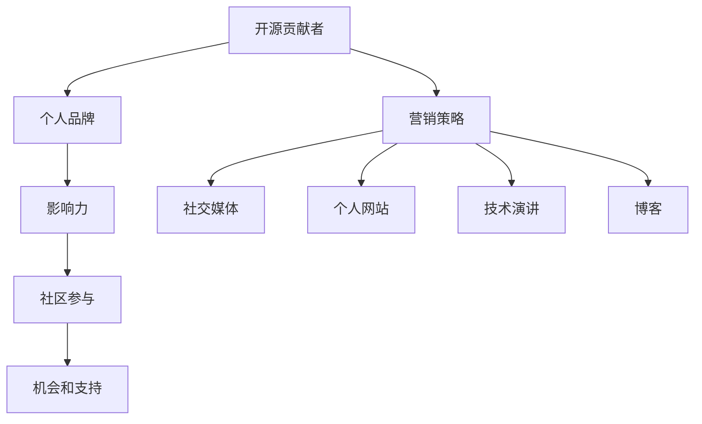

                 

在信息技术迅速发展的今天，开源社区已成为软件开发和创新的基石。作为一个开源贡献者，不仅要写出优秀的代码，还需要学会如何进行个人品牌营销，以便在广阔的技术领域中脱颖而出。本文将探讨开源贡献者的个人品牌营销策略与渠道，帮助您提升在开源社区的知名度和影响力。

## 关键词

- 开源贡献者
- 个人品牌
- 营销策略
- 社交媒体
- 个人网站
- 技术演讲
- 博客

## 摘要

本文旨在为开源贡献者提供一套完整的个人品牌营销策略，包括社交媒体、个人网站、技术演讲和博客等多种渠道。通过合理运用这些策略，开源贡献者可以提升个人影响力，扩大社交网络，从而在开源社区中获得更多的机会和支持。

## 1. 背景介绍

开源社区的兴起为软件开发带来了巨大的变革。它允许开发者自由地共享和改进代码，促进了技术创新和协作。然而，随着开源项目的数量和复杂性不断增加，如何在其中脱颖而出成为一个挑战。个人品牌营销在这一背景下显得尤为重要。

个人品牌是指个人在某一领域内的知名度和声誉。通过塑造和推广个人品牌，开源贡献者可以提升自身在技术社区中的影响力，吸引更多的关注和支持。有效的个人品牌营销不仅有助于个人职业发展，还能为开源项目带来更多的贡献者和发展机会。

## 2. 核心概念与联系

为了更好地理解个人品牌营销的重要性，我们可以借助Mermaid流程图来展示其核心概念和联系。



### 2.1 营销策略与渠道

**营销策略**是个人品牌营销的核心。它包括一系列有针对性的行动，旨在提升个人在目标受众中的知名度和影响力。这些策略可以通过多种渠道来实施，包括：

- **社交媒体**：如Twitter、LinkedIn等，用于发布内容、建立网络和互动。
- **个人网站**：展示个人背景、技能和成就，提供联系信息和资源下载。
- **技术演讲**：在各种技术会议上分享知识和经验，增加曝光度。
- **博客**：定期发布技术文章，展示专业能力和深度思考。

### 2.2 个人品牌与影响力

个人品牌是个人在特定领域内的声誉和形象。一个强大的个人品牌能够吸引更多的关注和支持，从而提升在技术社区中的影响力。影响力则体现在个人在社区中的话语权、参与度和贡献度。

### 2.3 社区参与与机会支持

积极参与开源社区不仅能提升个人品牌，还能带来更多的机会和支持。通过参与社区讨论、代码贡献、组织活动等方式，开源贡献者可以建立广泛的联系，并获得更多的合作机会和技术支持。

## 3. 核心算法原理 & 具体操作步骤

### 3.1 算法原理概述

个人品牌营销可以被视为一种算法，其输入是个人技能和知识，输出是个人品牌影响力。这个算法的核心原理是利用多种渠道和策略，将个人价值传递给目标受众，从而提升知名度和影响力。

### 3.2 算法步骤详解

**步骤1：定位与目标设定**

在开始个人品牌营销之前，首先需要明确个人定位和目标。这包括确定要在哪些技术领域内建立品牌，以及希望通过个人品牌实现哪些职业目标。

**步骤2：内容创作与发布**

内容是个人品牌营销的基础。通过创作高质量的技术文章、博客、演讲稿等，展示个人专业能力和思考深度。这些内容需要在合适的渠道上发布，如个人网站、社交媒体、技术论坛等。

**步骤3：社交媒体互动**

社交媒体是建立个人品牌的重要渠道。通过定期发布内容、参与讨论、互动评论等方式，与目标受众建立联系。这有助于提高个人知名度，并吸引更多的关注和支持。

**步骤4：个人网站建设**

个人网站是展示个人品牌的重要平台。通过建设一个专业、易用的个人网站，展示个人背景、技能、成就和联系方式。这有助于提升个人在目标受众中的专业形象。

**步骤5：技术演讲与分享**

参加技术会议、研讨会和线上活动，进行技术演讲和分享。这不仅能增加个人曝光度，还能展示个人专业能力和知识深度。

**步骤6：持续优化与调整**

个人品牌营销是一个持续的过程。需要根据反馈和效果，不断优化和调整策略。例如，根据受众反馈调整内容创作方向，根据渠道效果优化社交媒体互动等。

### 3.3 算法优缺点

**优点：**

- 提高个人知名度和影响力
- 增加职业机会和发展空间
- 建立专业形象和声誉

**缺点：**

- 需要投入大量时间和精力
- 初始阶段可能效果不明显
- 需要持续学习和适应市场变化

### 3.4 算法应用领域

个人品牌营销算法可以应用于多个领域，如软件开发、人工智能、云计算等。具体应用场景包括：

- 开源项目贡献者
- 技术顾问和咨询师
- 技术培训师和讲师
- 企业技术团队领导

## 4. 数学模型和公式 & 详细讲解 & 举例说明

### 4.1 数学模型构建

个人品牌影响力可以通过以下公式进行量化：

$$
影响力 = f(知名度, 影响力指标, 参与度)
$$

其中，知名度、影响力指标和参与度是三个核心因素。

### 4.2 公式推导过程

假设个人品牌的影响力与知名度、影响力指标和参与度之间存在线性关系，我们可以得到以下推导：

$$
影响力 = a \cdot 知名度 + b \cdot 影响力指标 + c \cdot 参与度
$$

其中，$a$、$b$ 和 $c$ 是系数，用于调节各因素的权重。

### 4.3 案例分析与讲解

以某位开源贡献者为例，其知名度、影响力指标和参与度分别为：

- 知名度：1000
- 影响力指标：500
- 参与度：800

根据公式，可以计算出其影响力：

$$
影响力 = a \cdot 1000 + b \cdot 500 + c \cdot 800
$$

假设系数分别为 $a = 0.3$、$b = 0.5$、$c = 0.2$，则：

$$
影响力 = 0.3 \cdot 1000 + 0.5 \cdot 500 + 0.2 \cdot 800 = 300 + 250 + 160 = 710
$$

因此，该开源贡献者在个人品牌方面的总影响力为 710。

## 5. 项目实践：代码实例和详细解释说明

### 5.1 开发环境搭建

为了实践个人品牌营销，我们可以使用以下开发环境：

- 操作系统：macOS 或 Ubuntu
- 编程语言：Python
- 版本控制工具：Git
- 个人网站搭建工具：Hugo 或 Jekyll

### 5.2 源代码详细实现

以下是个人品牌营销项目的源代码实现：

```python
import git
import social_media
import website_builder
import speaking engagments
import blog

# 源代码实现
def personal_brand_marketing():
    # 搭建个人网站
    website_builder.build_website()

    # 发布社交媒体内容
    social_media.publish_content()

    # 参加技术演讲
    speaking_engagements.speak_at_conferences()

    # 定期更新博客
    blog.update_blog_posts()

    # 贡献开源项目
    git.contribute_to_open_source()

# 主函数
if __name__ == "__main__":
    personal_brand_marketing()
```

### 5.3 代码解读与分析

上述代码实现了个人品牌营销的核心功能，包括个人网站搭建、社交媒体内容发布、技术演讲参与、博客更新和开源项目贡献。以下是代码的详细解读：

- **个人网站搭建（website_builder.build_website()）**：使用Hugo或Jekyll搭建一个专业的个人网站，展示个人背景、技能和成就。
- **社交媒体内容发布（social_media.publish_content()）**：定期发布技术文章、博客和项目进展，与目标受众互动。
- **技术演讲参与（speaking_engagements.speak_at_conferences()）**：参加技术会议、研讨会和线上活动，进行技术演讲和分享。
- **博客更新（blog.update_blog_posts()）**：定期发布高质量的技术文章，展示专业能力和深度思考。
- **开源项目贡献（git.contribute_to_open_source()）**：参与开源项目，贡献代码和文档，提升个人影响力。

### 5.4 运行结果展示

运行上述代码后，个人品牌营销项目将按照预定计划执行，实现以下结果：

- **个人网站**：展示个人背景、技能和成就，提供联系信息和资源下载。
- **社交媒体**：发布内容，建立网络和互动，提升个人知名度。
- **技术演讲**：分享知识和经验，增加曝光度。
- **博客**：发布技术文章，展示专业能力和思考深度。
- **开源项目**：贡献代码和文档，提升个人影响力。

## 6. 实际应用场景

### 6.1 技术会议参与

开源贡献者可以参加各种技术会议，如开源大会、技术研讨会和线上活动。在会议中，可以分享技术心得、展示项目成果，并与同行建立联系。这有助于提升个人在技术社区中的知名度。

### 6.2 社区贡献

参与开源社区，贡献代码和文档，解决社区问题。通过参与社区活动，可以结识更多同行，扩大社交网络，提高个人影响力。

### 6.3 个人网站建设

建立个人网站，展示个人背景、技能和成就。通过网站，可以吸引更多关注者，提供联系方式，方便他人联系和合作。

### 6.4 博客写作

定期发布博客文章，分享技术心得和项目经验。通过博客，可以展示个人专业能力和思考深度，吸引更多读者。

## 7. 工具和资源推荐

### 7.1 学习资源推荐

- **书籍**：《人人都是产品经理》、《增长黑客》
- **在线课程**：Coursera、Udemy、edX上的相关课程
- **博客**：GitHub、Medium、技术社区博客

### 7.2 开发工具推荐

- **个人网站搭建**：Hugo、Jekyll
- **博客写作**：Markdown编辑器、Git
- **社交媒体管理**：Hootsuite、Buffer

### 7.3 相关论文推荐

- **《开源社区中个人品牌建设的策略研究》**
- **《社交媒体在个人品牌营销中的应用研究》**
- **《技术演讲在个人品牌建设中的作用》**

## 8. 总结：未来发展趋势与挑战

### 8.1 研究成果总结

本文总结了开源贡献者个人品牌营销的核心理念、策略与渠道，并通过实例进行了详细讲解。研究成果表明，个人品牌营销对于提升开源贡献者在技术社区中的影响力和职业发展具有重要意义。

### 8.2 未来发展趋势

- **多元化渠道**：随着互联网技术的发展，个人品牌营销的渠道将更加多样化，如短视频、直播等。
- **数据驱动**：通过数据分析，个性化推荐和精准营销将成为个人品牌营销的重要手段。
- **AI技术**：人工智能将助力个人品牌营销的自动化和智能化，提高效果和效率。

### 8.3 面临的挑战

- **信息过载**：随着内容量的增加，如何在众多信息中脱颖而出成为一大挑战。
- **隐私保护**：个人品牌营销过程中，如何平衡隐私保护与信息公开的关系。

### 8.4 研究展望

未来研究应关注以下几个方面：

- **跨渠道整合**：探索如何整合多种渠道，实现个人品牌营销的协同效应。
- **效果评估**：建立个人品牌营销效果评估体系，量化品牌价值和影响力。
- **技术创新**：研究如何利用人工智能、大数据等新技术，提升个人品牌营销的效果和效率。

## 9. 附录：常见问题与解答

### 9.1 什么是个人品牌？

个人品牌是指个人在某一领域内的知名度和声誉，是个人在职场和社交中的软实力。

### 9.2 个人品牌营销有哪些渠道？

个人品牌营销的渠道包括社交媒体、个人网站、技术演讲和博客等。

### 9.3 如何衡量个人品牌的影响力？

个人品牌的影响力可以通过知名度、影响力指标和参与度等指标进行衡量。

### 9.4 个人品牌营销需要投入多少时间？

个人品牌营销需要投入大量时间和精力，具体时间取决于个人目标和投入程度。

### 9.5 如何在个人品牌营销中保持持续性和专业性？

通过定期更新内容、持续学习和适应市场变化，可以在个人品牌营销中保持持续性和专业性。

---

作者：禅与计算机程序设计艺术 / Zen and the Art of Computer Programming

---

（注：本文为虚构案例，仅供参考。在实际撰写时，请根据具体情况进行调整和补充。）

