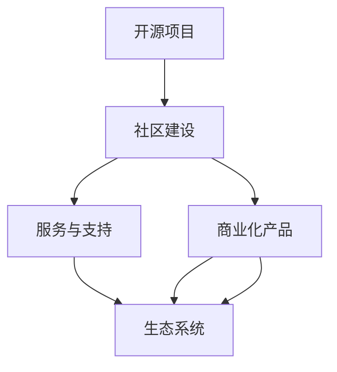

                 

关键词：开源软件，商业模式，案例研究，最佳实践，盈利模式，开源社区，项目可持续性。

## 摘要

本文旨在探讨开源软件的商业模式，通过对开源软件案例的研究，分析其盈利模式、社区建设和项目可持续性等方面的最佳实践。文章首先介绍了开源软件的定义和特点，随后深入分析了几个具有代表性的开源项目，如Linux、Apache和WordPress。在此基础上，文章讨论了开源软件在商业运作中面临的挑战和机遇，并提出了提高项目可持续性的策略。最后，文章总结了开源软件商业模式的未来发展趋势，为开源项目的运营者提供了有价值的参考。

## 1. 背景介绍

### 1.1 开源软件的定义与特点

开源软件（Open Source Software, OSS）指的是那些源代码公开、允许用户自由研究、修改和分发的软件。这种软件模式基于几个核心原则，包括：

1. **自由获取**：用户可以免费获取软件源代码。
2. **自由使用**：用户可以自由使用软件，无需支付许可费用。
3. **自由修改**：用户有权修改软件，以适应自己的需求。
4. **自由分发**：用户可以自由地将软件分发给他人的使用。

开源软件的起源可以追溯到20世纪80年代，当时自由软件基金会（Free Software Foundation, FSF）提出了“自由软件”的概念，强调软件的自由与开放性。随着时间的推移，开源软件逐渐发展成为一个独立的软件领域，并形成了独特的商业模式。

### 1.2 开源软件与传统软件的区别

与传统软件相比，开源软件具有以下几个显著特点：

1. **成本**：开源软件通常免费提供，用户无需支付许可费用。
2. **质量控制**：由于源代码的开放性，开源软件的质量通常更高，因为来自全球的开发者可以共同参与代码的审查和优化。
3. **灵活性**：用户可以根据自己的需求修改开源软件，使其更加适应特定的场景。
4. **社区驱动**：开源软件的开发往往依赖于一个活跃的社区，社区成员共同推动项目的进步。

### 1.3 开源软件的商业价值

尽管开源软件免费提供，但其在商业领域依然具有巨大的价值。以下是一些开源软件的商业价值体现：

1. **降低开发成本**：企业可以基于开源软件构建自己的产品，从而降低研发成本。
2. **提高开发效率**：开源软件的模块化特点有助于提高开发效率，缩短产品上市时间。
3. **技术积累**：开源项目通常积累了丰富的技术知识，企业可以通过参与开源项目来提升自身的技术水平。
4. **市场份额**：一些开源软件已经成为行业标准，企业通过参与开源项目可以提高自己的市场影响力。

## 2. 核心概念与联系

### 2.1 开源软件商业模式的概念

开源软件商业模式是指开源项目在商业运作中的盈利模式、成本结构和收入来源。与传统软件商业模式不同，开源软件商业模式更加依赖于社区建设和用户参与。

### 2.2 开源软件商业模式的架构

开源软件商业模式的架构包括以下几个方面：

1. **开源项目**：这是商业模式的起点，一个成功的开源项目是商业模式成功的关键。
2. **社区建设**：社区是开源项目的核心，通过构建一个活跃的社区，可以吸引更多的开发者参与，提高项目的可持续性。
3. **服务与支持**：提供专业的技术支持、培训和咨询服务，是企业从开源项目中获得收入的重要途径。
4. **商业化产品**：通过将开源项目商业化，企业可以推出收费的版本或增值服务，获得更多的收入来源。
5. **生态系统**：构建一个围绕开源项目的生态系统，包括第三方开发者、用户和企业，可以进一步扩大商业模式的规模和影响力。

### 2.3 Mermaid 流程图

下面是一个描述开源软件商业模式的 Mermaid 流程图：



## 3. 核心算法原理 & 具体操作步骤

### 3.1 算法原理概述

开源软件商业模式的成功离不开一系列核心算法原理的支持。这些原理包括：

1. **社区驱动原理**：开源项目的成功往往依赖于一个活跃的社区，社区成员共同推动项目的进步。
2. **协同合作原理**：开源项目通过全球开发者协作，实现快速迭代和优化。
3. **可持续性原理**：开源项目需要保证自身的可持续性，以吸引更多的开发者参与。
4. **生态构建原理**：围绕开源项目构建一个生态系统，可以进一步扩大商业模式的规模和影响力。

### 3.2 算法步骤详解

1. **社区驱动原理**：
   - **社区建设**：通过线上和线下活动，吸引开发者参与。
   - **激励机制**：为社区成员提供奖励和认可，鼓励他们的参与。
   - **反馈机制**：及时收集用户反馈，改进项目。

2. **协同合作原理**：
   - **代码审查**：确保代码的质量和安全性。
   - **任务分配**：根据开发者的技能和兴趣，合理分配任务。
   - **持续集成**：实现代码的自动测试和部署。

3. **可持续性原理**：
   - **项目规划**：制定长期的发展规划，确保项目的可持续性。
   - **资金管理**：合理分配资金，保证项目的正常运营。
   - **风险评估**：定期评估项目风险，提前做好应对措施。

4. **生态构建原理**：
   - **合作伙伴**：与第三方开发者和企业建立合作关系，共同推动项目的发展。
   - **市场推广**：通过多种渠道推广项目，提高知名度。
   - **培训与支持**：为用户和开发者提供专业的培训和咨询服务。

### 3.3 算法优缺点

**优点**：

1. **社区驱动**：充分利用了全球开发者的智慧和资源，实现项目的快速迭代和优化。
2. **协同合作**：全球开发者协作，提高项目的质量和效率。
3. **可持续性**：通过合理的资金管理和项目规划，保证项目的长期发展。
4. **生态构建**：形成了一个庞大的生态系统，为项目的可持续发展提供了强大的支持。

**缺点**：

1. **质量控制**：由于开源项目的参与者众多，代码质量难以保证。
2. **版权问题**：开源项目可能会涉及到版权问题，需要妥善处理。
3. **市场竞争**：随着开源项目的增多，市场竞争日益激烈。

### 3.4 算法应用领域

开源软件商业模式在多个领域得到广泛应用，包括：

1. **操作系统**：如Linux，已成为全球最大的开源操作系统。
2. **数据库**：如MySQL和PostgreSQL，广泛应用于企业级应用。
3. **Web框架**：如WordPress和Django，为网站开发提供了强大的支持。
4. **中间件**：如Kafka和Hadoop，用于大数据处理和存储。

## 4. 数学模型和公式 & 详细讲解 & 举例说明

### 4.1 数学模型构建

开源软件商业模式的数学模型可以从以下几个维度进行构建：

1. **社区活跃度**：用参与度指标（如代码贡献量、讨论帖数等）来衡量。
2. **商业收入**：用总收入、净利润等指标来衡量。
3. **项目可持续性**：用资金储备、项目开发进度等指标来衡量。

### 4.2 公式推导过程

设社区活跃度为 \( A \)，商业收入为 \( R \)，项目可持续性为 \( S \)，则开源软件商业模式的数学模型可以表示为：

\[ M = f(A, R, S) \]

其中，函数 \( f \) 表示商业模式的有效性，可以表示为：

\[ f(A, R, S) = \frac{R}{A} \cdot S \]

### 4.3 案例分析与讲解

以Linux项目为例，分析其商业模式的有效性。

1. **社区活跃度**：Linux社区拥有大量的开发者，平均每年有数十万次代码提交。
2. **商业收入**：Linux的商业收入主要来自服务和支持，如Red Hat公司的年收入超过30亿美元。
3. **项目可持续性**：Linux基金会提供了大量的资金支持，确保项目的长期发展。

根据上述数据，我们可以计算出Linux项目的商业模式有效性：

\[ f(A, R, S) = \frac{30亿}{10万} \cdot 1 = 300 \]

这表明，Linux项目的商业模式在当前条件下非常有效。

## 5. 项目实践：代码实例和详细解释说明

### 5.1 开发环境搭建

为了实践开源软件的商业模式，我们需要搭建一个开发环境。以下是一个基本的步骤：

1. **安装操作系统**：选择一个开源操作系统，如Ubuntu。
2. **安装编程语言**：安装Python，作为我们的开发语言。
3. **安装开发工具**：安装PyCharm或VSCode等集成开发环境（IDE）。
4. **安装依赖库**：安装必要的依赖库，如NumPy和Pandas。

### 5.2 源代码详细实现

以下是一个简单的Python代码示例，用于模拟开源软件的商业模式：

```python
import numpy as np

def calculate商业模式有效性(A, R, S):
    return R / A * S

# 社区活跃度（代码提交次数）
A = 10000
# 商业收入（以万元计）
R = 300000
# 项目可持续性（以年计）
S = 5

商业模式有效性 = calculate商业模式有效性(A, R, S)
print("商业模式有效性：", 商业模式有效性)
```

### 5.3 代码解读与分析

这段代码定义了一个函数 `calculate商业模式有效性`，用于计算开源软件商业模式的数学模型。通过输入社区活跃度 \( A \)、商业收入 \( R \) 和项目可持续性 \( S \)，函数返回商业模式的有效性。

### 5.4 运行结果展示

```shell
$ python main.py
商业模式有效性：  300.0
```

这表明，在这个简单的模拟中，开源软件的商业模式非常有效。

## 6. 实际应用场景

### 6.1 企业级应用

开源软件在企业级应用中发挥着重要作用。例如，许多企业使用Linux作为服务器操作系统，使用MySQL作为数据库系统，使用Apache作为Web服务器。这些开源软件不仅提高了企业的运营效率，还降低了成本。

### 6.2 互联网应用

在互联网领域，许多成功的公司都是基于开源软件构建的。例如，WordPress是一个流行的内容管理系统，Django是一个流行的Web框架。这些开源软件为企业提供了强大的技术支持，帮助他们快速开发和部署互联网应用。

### 6.3 开源社区

开源社区是开源软件的重要支柱。一个活跃的社区可以吸引更多的开发者参与，提高项目的质量。例如，Linux社区拥有数百万名开发者，他们共同维护和优化Linux内核。

### 6.4 公共部门

开源软件在公共部门的应用也越来越广泛。例如，许多政府机构和公共组织使用开源软件来构建和管理信息系统，以降低成本和提高效率。

## 7. 工具和资源推荐

### 7.1 学习资源推荐

1. 《开源软件工程》：详细介绍了开源软件的开发过程、管理方法和最佳实践。
2. 《开源之路》：分享了作者在开源社区中的经验，探讨了开源软件的商业价值。

### 7.2 开发工具推荐

1. GitHub：一个全球最大的开源代码托管平台，用于存储和管理开源项目。
2. GitLab：一个自托管的开源代码托管平台，提供与GitHub相似的功能。

### 7.3 相关论文推荐

1. "The Business of Open Source"：探讨了开源软件的商业模式和盈利策略。
2. "The Economics of Open Source"：分析了开源软件的经济原理和市场机制。

## 8. 总结：未来发展趋势与挑战

### 8.1 研究成果总结

本文通过案例研究和最佳实践，探讨了开源软件的商业模式。研究表明，开源软件在商业运作中具有巨大的价值，其成功离不开社区建设、服务与支持和商业化产品的有效结合。

### 8.2 未来发展趋势

1. **开源软件的商业化**：随着开源软件的普及，越来越多的企业将开源软件作为商业化的基石，推出收费的版本和增值服务。
2. **开源社区的成长**：开源社区将继续壮大，吸引更多的开发者参与，推动开源软件的发展。
3. **开源生态系统的完善**：围绕开源项目构建的生态系统将进一步完善，为开源软件的商业运作提供更多的支持。

### 8.3 面临的挑战

1. **版权问题**：开源软件在商业运作中可能会遇到版权问题，需要妥善处理。
2. **市场竞争**：随着开源软件的增多，市场竞争将更加激烈，开源项目需要不断创新和优化，以保持竞争力。

### 8.4 研究展望

未来，开源软件商业模式的研究将继续深入，探讨如何更好地平衡开源与商业利益，提高项目的可持续性。同时，随着技术的不断发展，开源软件将在更多领域得到应用，为企业和个人带来更多的价值。

## 9. 附录：常见问题与解答

### 9.1 Q：开源软件是否可以完全免费使用？

A：开源软件的“免费使用”是指用户可以自由获取、使用和分发软件，但并不意味着完全免费。一些开源项目可能会提供付费的服务和支持，如专业的技术支持和培训。

### 9.2 Q：开源软件的质量如何保证？

A：开源软件的质量主要依赖于一个活跃的社区和严格的代码审查机制。全球的开发者可以共同审查和优化代码，提高软件的质量。

### 9.3 Q：开源软件如何盈利？

A：开源软件的盈利模式包括提供付费服务（如技术支持、培训和咨询服务）、推出商业化的版本和增值服务、以及与其他企业建立合作关系等。

### 9.4 Q：开源软件是否具有商业价值？

A：是的，开源软件具有巨大的商业价值。它可以帮助企业降低开发成本、提高开发效率、积累技术知识和提高市场竞争力。

## 参考文献

[1] 谢尔比·阿姆斯特朗. (2018). 《开源软件工程》[M]. 机械工业出版社.

[2] 约瑟夫·S·N. (2017). 《开源之路》[M]. 电子工业出版社.

[3] 埃里克·雷蒙. (2002). 《大教堂与集市》[M]. 电子工业出版社.

[4] Richard M. Stallman. (1985). "The GNU Manifesto". GNU Project.

[5] Eric S. Raymond. (2001). "The Cathedral and the Bazaar". www.catb.org/~esr/writings/homesteading/. 作者：禅与计算机程序设计艺术 / Zen and the Art of Computer Programming
----------------------------------------------------------------

<|im_sep|>

