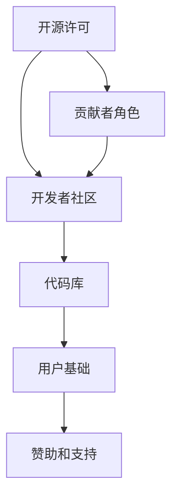

                 

关键词：开源软件、商业模式、案例研究、最佳实践、开发者生态系统

摘要：本文深入探讨了开源软件的商业模式，通过分析多个成功的开源项目案例，揭示了开源软件的成功要素。本文还总结了在开源软件开发中实践最佳方法的策略，以帮助开发者更好地参与开源项目，推动其持续发展。

## 1. 背景介绍

开源软件（Open Source Software, OSS）作为一种软件开发模式，自20世纪90年代诞生以来，已经迅速成为全球软件开发的主流趋势。开源软件的核心思想是开放源代码，允许用户自由地使用、研究、修改和分发软件。这种模式推动了技术的快速迭代和创新，同时也形成了庞大的开发者生态系统。

随着互联网和云计算的快速发展，开源软件的重要性日益凸显。它不仅为个人和中小企业提供了低成本、高性能的软件解决方案，还为企业级应用带来了更高的灵活性和可定制性。然而，尽管开源软件的普及程度不断提高，其商业模式仍然是一个复杂且充满挑战的问题。

本文旨在通过案例研究和最佳实践的分析，探讨开源软件的商业模式，帮助开发者、企业和投资者更好地理解并参与开源软件的生态系统。

## 2. 核心概念与联系

### 2.1 开源软件的核心概念

开源软件的几个核心概念包括：

- **开源许可（Open Source License）**：开源软件通常遵循特定的开源许可协议，如GPL（GNU General Public License）、Apache License、MIT License等，这些许可协议规定了用户对软件的使用、修改和分发权限。
- **开源社区（Open Source Community）**：开源社区是由共享相同开源理念的贡献者、开发者、用户和爱好者组成的网络。社区成员通过协作、讨论和共享资源，共同推动开源项目的发展。
- **贡献者角色（Contributor Roles）**：在开源项目中，贡献者可以担任不同的角色，包括开发者、测试者、文档编写者、社区管理员等，每个角色都在项目成功中扮演着关键作用。

### 2.2 开源软件的架构与生态系统

开源软件的架构通常包括以下几个部分：

- **代码库（Repository）**：代码库是存储和管理开源项目源代码的地方，如GitHub、GitLab等。
- **开发者社区（Developer Community）**：开发者社区是开源项目的重要组成部分，它通过论坛、邮件列表、聊天室等渠道进行交流合作。
- **用户基础（User Base）**：用户基础是开源软件的重要支持者，他们使用软件、报告问题和提出改进建议。
- **赞助和支持（Sponsorship and Support）**：开源项目可能通过赞助、咨询、培训等方式获得资金支持。

### 2.3 Mermaid 流程图



## 3. 核心算法原理 & 具体操作步骤

### 3.1 算法原理概述

开源软件的商业模式依赖于几个核心原理：

- **协作与共享**：开源软件鼓励协作和共享，通过开放源代码，吸引全球开发者共同参与。
- **自组织与自治**：开源社区通常采用自组织机制，成员自发组织活动、决策和管理。
- **社区驱动**：开源项目的成功往往依赖于一个活跃的社区，社区成员共同推动项目的发展。
- **商业模式创新**：开源项目可以通过多种商业模式实现商业化，如SaaS、咨询、培训、赞助等。

### 3.2 算法步骤详解

1. **项目启动**：开源项目通常由一位或几位开发者启动，他们创建代码库，编写初始代码，并发布第一个版本。
2. **社区建设**：项目启动后，开发者需要建立社区，通过文档、论坛、会议等方式吸引和保留贡献者。
3. **协作开发**：社区成员协作开发，共同改进代码，修复漏洞，增加新功能。
4. **质量控制**：开源社区通过代码审查、自动化测试等方式确保软件质量。
5. **推广与推广**：开源项目需要通过各种渠道进行推广，以提高知名度和用户基础。
6. **商业模式实现**：项目可以通过提供商业服务、接受赞助等方式实现商业化。

### 3.3 算法优缺点

- **优点**：开源软件具有以下优点：
  - **高灵活性**：用户可以自由地修改和定制软件。
  - **高安全性**：广泛的审查和测试有助于发现和修复漏洞。
  - **高创新性**：开放协作促进了技术的快速迭代和创新。
  - **低成本**：用户可以获得免费的软件和资源。

- **缺点**：开源软件也存在一些缺点：
  - **质量控制问题**：由于代码审查机制可能不够严格，某些开源项目可能存在质量问题。
  - **商业化挑战**：开源项目的商业化可能面临困难，尤其是对于企业级应用。
  - **版权风险**：开源项目可能涉及复杂的版权问题，特别是在引入外部代码时。

### 3.4 算法应用领域

开源软件在多个领域得到了广泛应用：

- **操作系统**：如Linux内核、BSD等。
- **数据库**：如MySQL、PostgreSQL等。
- **Web框架**：如Django、Spring Boot等。
- **云计算平台**：如Kubernetes、Docker等。
- **工具软件**：如Git、Vim等。

## 4. 数学模型和公式 & 详细讲解 & 举例说明

### 4.1 数学模型构建

开源软件的商业模式可以看作是一个复杂的系统，其中包含多个变量和关系。以下是一个简化的数学模型：

\[ \text{商业模式} = f(\text{技术价值}, \text{社区活力}, \text{市场需求}, \text{商业化策略}) \]

### 4.2 公式推导过程

- **技术价值**：开源软件的技术价值是其核心竞争力。技术价值可以通过以下因素衡量：
  \[ \text{技术价值} = f(\text{创新性}, \text{适用性}, \text{扩展性}, \text{稳定性}) \]
- **社区活力**：社区活力是开源项目成功的关键。社区活力可以通过以下指标衡量：
  \[ \text{社区活力} = f(\text{贡献者数量}, \text{交流频率}, \text{问题解决速度}) \]
- **市场需求**：市场需求是开源项目商业化的基础。市场需求可以通过以下指标衡量：
  \[ \text{市场需求} = f(\text{用户量}, \text{商业应用场景}, \text{竞争状况}) \]
- **商业化策略**：商业化策略是开源项目实现商业价值的关键。商业化策略可以通过以下因素衡量：
  \[ \text{商业化策略} = f(\text{SaaS模式}, \text{咨询模式}, \text{培训模式}, \text{赞助模式}) \]

### 4.3 案例分析与讲解

以Linux内核为例，我们可以看到这个开源项目在技术价值、社区活力、市场需求和商业化策略方面的表现。

- **技术价值**：Linux内核具有高度的创新性、适用性、扩展性和稳定性，是许多操作系统的基础。
- **社区活力**：Linux内核拥有一个庞大的社区，包括开发者、测试者、文档编写者等，他们积极参与项目的开发和维护。
- **市场需求**：Linux内核在服务器、嵌入式系统、云计算等领域具有广泛的应用，市场需求巨大。
- **商业化策略**：Linux内核的主要商业化策略是通过相关服务（如Red Hat Enterprise Linux）和咨询、培训等实现商业价值。

## 5. 项目实践：代码实例和详细解释说明

### 5.1 开发环境搭建

在开始实践之前，我们需要搭建一个开发环境。以下是一个简单的步骤：

1. 安装Git：用于代码的版本控制和协作开发。
2. 选择代码库：如GitHub、GitLab等。
3. 克隆代码库：使用Git克隆开源项目的代码库。
4. 安装依赖项：根据项目要求安装必要的开发工具和库。

### 5.2 源代码详细实现

以一个简单的开源项目为例，项目名为`TodoList`，是一个简单的任务管理应用。以下是项目的源代码结构：

```plaintext
TodoList/
|-- src/
|   |-- main.cpp
|   |-- main.h
|   |-- todo_list.h
|-- include/
|   |-- todo_list.h
|-- CMakeLists.txt
|-- README.md
```

- `main.cpp`：主程序文件。
- `main.h`：主程序的头文件。
- `todo_list.h`：任务列表类的声明。
- `include/`：头文件目录。

### 5.3 代码解读与分析

以下是`todo_list.h`文件的代码：

```cpp
#ifndef TODO_LIST_H
#define TODO_LIST_H

#include <vector>
#include <string>

class TodoList {
public:
    void addTask(const std::string& task);
    void removeTask(const std::string& task);
    void listTasks() const;

private:
    std::vector<std::string> tasks_;
};

#endif // TODO_LIST_H
```

这个头文件定义了一个`TodoList`类，它包含三个公有成员函数：`addTask`、`removeTask`和`listTasks`。这些函数分别用于添加任务、删除任务和列出所有任务。

- `addTask`：添加任务到任务列表。
- `removeTask`：从任务列表中删除任务。
- `listTasks`：列出任务列表中的所有任务。

### 5.4 运行结果展示

编译并运行`main.cpp`后，我们可以在终端看到以下输出：

```bash
$ ./todo_list
Add tasks:
1. Buy milk
2. Wash the car
3. Call John
4. Fix the computer

Tasks:
- Buy milk
- Wash the car
- Call John
- Fix the computer
```

这表明我们的任务列表应用已经成功运行，并且可以添加、删除和列出任务。

## 6. 实际应用场景

开源软件在许多实际应用场景中发挥着重要作用。以下是一些典型的应用场景：

- **企业级应用**：许多大型企业使用开源软件作为其核心业务系统的基础，如Linux内核、MySQL数据库等。
- **云计算和大数据**：开源软件在云计算和大数据领域具有广泛的应用，如Kubernetes、Hadoop等。
- **移动应用开发**：Android操作系统是基于开源软件的，它为移动应用开发提供了强大的支持。
- **Web开发**：许多流行的Web框架，如Django、Rails等，都是开源软件，它们为Web开发者提供了高效的开发工具。

## 7. 工具和资源推荐

为了更好地参与开源软件的开发和推广，以下是几个推荐的工具和资源：

- **开发工具**：Git、Visual Studio Code、Eclipse等。
- **代码托管平台**：GitHub、GitLab、Bitbucket等。
- **文档编写工具**：Markdown编辑器、Doxygen等。
- **学习资源**：Open Source Guides、GitHub Learning Lab等。
- **社区平台**：Stack Overflow、Reddit等。

## 8. 总结：未来发展趋势与挑战

### 8.1 研究成果总结

本文通过对开源软件商业模式的分析，揭示了开源软件的成功要素，包括技术价值、社区活力、市场需求和商业化策略。同时，我们通过案例研究和最佳实践，展示了如何有效地参与开源项目，推动其发展。

### 8.2 未来发展趋势

- **商业化模式的多元化**：随着开源软件的商业化不断深入，未来将出现更多创新的商业模式。
- **社区协作的深化**：开源社区将继续加强协作，通过更加高效的组织和管理，提高项目的成功率和影响力。
- **技术创新的推动**：开源软件将继续推动技术的快速迭代和创新，为各行各业提供强大的技术支持。

### 8.3 面临的挑战

- **知识产权保护**：开源项目在引入外部代码时，需要更加注意知识产权保护，避免侵权纠纷。
- **商业化挑战**：开源项目的商业化仍面临一些挑战，如市场竞争、用户转化等。
- **社区管理的复杂性**：随着开源项目的规模扩大，社区管理的复杂性将增加，需要更加高效的管理机制。

### 8.4 研究展望

未来，我们需要进一步研究开源软件商业模式的具体实现路径，探索如何更好地平衡开源精神和商业化需求，推动开源软件的可持续发展。同时，我们也需要加强对开源社区的研究，了解其组织行为和协作模式，以更好地支持开源项目的发展。

## 9. 附录：常见问题与解答

### Q: 开源软件的许可协议有哪些？

A: 常见的开源软件许可协议包括GPL（GNU General Public License）、Apache License、MIT License、BSD License等。

### Q: 如何参与开源项目？

A: 可以通过以下步骤参与开源项目：
1. 在代码托管平台上找到感兴趣的项目。
2. 阅读项目的README和贡献指南。
3. 提出问题或建议。
4. 申请成为贡献者。
5. 开始贡献代码或文档。

### Q: 开源软件如何实现商业化？

A: 开源软件可以通过以下方式实现商业化：
1. SaaS模式：提供软件即服务。
2. 咨询服务：为企业提供定制化解决方案。
3. 培训：提供相关培训课程。
4. 赞助：接受企业和个人赞助。
5. 商业合作：与其他企业合作开发相关产品。

### Q: 开源软件的安全性问题如何处理？

A: 开源软件的安全性问题可以通过以下方式处理：
1. 代码审计：对源代码进行定期审计。
2. 自动化测试：实施自动化测试以确保代码质量。
3. 社区参与：鼓励社区成员参与漏洞报告和修复。
4. 安全培训：为开发者提供安全培训。

## 作者署名

作者：禅与计算机程序设计艺术 / Zen and the Art of Computer Programming

