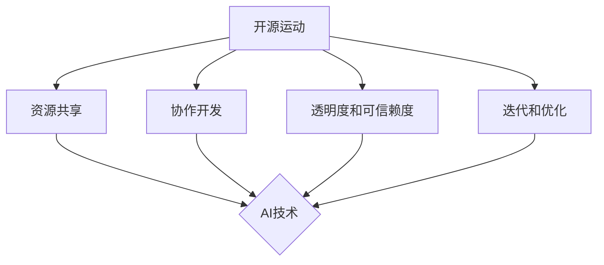

                 

关键词：开源运动，人工智能，AI发展，技术进步，共享创新，协作开发，社区贡献，技术生态，创新挑战

> 摘要：本文深入探讨了开源运动在人工智能（AI）领域的发展，分析了开源运动对AI技术的推动作用、面临的挑战以及未来的发展趋势。通过阐述开源运动的核心概念、历史背景、以及AI技术的发展现状，本文旨在为读者提供一个全面、系统的视角，理解开源与AI之间密不可分的关系，并思考如何通过开源运动实现AI技术的可持续发展。

## 1. 背景介绍

开源运动起源于20世纪90年代，其核心理念是“软件的自由与开源”。开源运动的先驱，如林纳斯·托瓦兹（Linus Torvalds）创建的Linux内核，和布鲁斯·佩雷兹（Bruce Perens）制定的Debian自由软件指南，标志着开源运动的兴起。开源运动的目标是促进软件的共享、协作开发和持续改进，从而推动整个计算机技术的发展。

与此同时，人工智能（AI）作为一个涵盖计算机科学、数学、神经科学等多个领域的交叉学科，正以前所未有的速度发展。AI技术已在多个领域展现出了巨大的潜力，包括医疗、金融、交通、制造业等。然而，AI技术的发展面临着数据、算法、计算资源等众多挑战。

开源运动和AI技术的发展之间存在着紧密的联系。开源运动为AI技术提供了强大的支持，通过开放源代码、共享技术资源、建立协作开发社区，推动AI技术的创新与普及。同时，AI技术的发展也为开源运动提供了新的应用场景，推动了开源社区的发展。

## 2. 核心概念与联系

### 2.1 开源运动的定义

开源运动是指一种软件开发和分发模式，其中源代码对公众开放，允许用户自由地查看、修改和分发。这种模式强调社区的贡献和协作，通过广泛的协作和反馈，推动软件的不断改进和优化。

### 2.2 人工智能的概念

人工智能（AI）是指计算机系统执行任务时，表现出类似于人类智能的行为。这些任务包括学习、推理、规划、感知、语言理解等。人工智能的核心目标是使计算机能够自主地执行复杂任务，从而提高生产效率和生活质量。

### 2.3 开源运动与AI技术的联系

开源运动与AI技术之间的联系主要体现在以下几个方面：

1. **资源共享**：开源运动鼓励开发者共享代码和技术，为AI研究者提供了丰富的工具和资源。
2. **协作开发**：开源模式促进了全球开发者的协作，使得AI技术的创新速度加快。
3. **透明度和可信赖度**：开源代码的透明性使得AI系统的算法和决策过程更容易被审查和理解，提高了系统的可信度。
4. **迭代和优化**：通过社区的反馈和改进，开源AI项目能够更快地迭代和优化。

### 2.4 Mermaid流程图



## 3. 核心算法原理 & 具体操作步骤

### 3.1 算法原理概述

开源运动在AI领域的核心算法原理主要包括机器学习和深度学习。这些算法通过学习数据模式，能够自动地进行分类、预测和决策。机器学习是AI的基础，而深度学习则是机器学习的一种特殊形式，通过多层神经网络模拟人脑的学习过程。

### 3.2 算法步骤详解

1. **数据收集**：收集用于训练的数据集，数据的质量直接影响模型的性能。
2. **数据预处理**：对数据进行清洗、归一化和特征提取，使其适合模型训练。
3. **模型选择**：根据问题的特点选择合适的机器学习或深度学习模型。
4. **模型训练**：使用训练数据对模型进行训练，调整模型参数以最小化预测误差。
5. **模型评估**：使用验证数据集评估模型的性能，确保其准确性和可靠性。
6. **模型部署**：将训练好的模型部署到实际应用场景中，进行实时预测和决策。

### 3.3 算法优缺点

**优点**：

- **灵活性和扩展性**：开源算法可以自由修改和扩展，适应不同的应用场景。
- **透明性和可解释性**：开源代码的可访问性使得算法的透明性和可解释性更高。
- **社区支持**：开源项目通常有强大的社区支持，能够快速解决技术问题。

**缺点**：

- **性能风险**：开源算法的性能可能不如商业算法稳定。
- **安全风险**：开源代码可能包含安全漏洞，需要额外的安全审查。

### 3.4 算法应用领域

开源AI算法在多个领域得到广泛应用，包括：

- **医疗**：用于疾病预测、诊断和治疗计划的制定。
- **金融**：用于风险评估、股票交易策略和欺诈检测。
- **制造**：用于设备故障预测、质量控制和生产调度。
- **交通**：用于交通流量预测、路线规划和自动驾驶。

## 4. 数学模型和公式 & 详细讲解 & 举例说明

### 4.1 数学模型构建

在AI领域，常见的数学模型包括线性回归、逻辑回归、支持向量机（SVM）、神经网络等。以线性回归为例，其数学模型为：

$$ y = \beta_0 + \beta_1x_1 + \beta_2x_2 + ... + \beta_nx_n $$

其中，$y$ 是预测值，$x_1, x_2, ..., x_n$ 是输入特征，$\beta_0, \beta_1, ..., \beta_n$ 是模型参数。

### 4.2 公式推导过程

以逻辑回归为例，其推导过程如下：

1. **损失函数**：逻辑回归的损失函数为对数损失函数（Log-Loss），定义为：

$$ J(\theta) = -\frac{1}{m} \sum_{i=1}^{m} [y^{(i)} \log(a^{(i)}) + (1 - y^{(i)}) \log(1 - a^{(i)})] $$

其中，$m$ 是样本数量，$y^{(i)}$ 是实际值，$a^{(i)}$ 是预测概率。

2. **梯度下降**：为了最小化损失函数，使用梯度下降算法更新模型参数：

$$ \theta_j = \theta_j - \alpha \frac{\partial J(\theta)}{\partial \theta_j} $$

其中，$\alpha$ 是学习率。

### 4.3 案例分析与讲解

**案例**：使用逻辑回归预测是否患有心脏病。

1. **数据集**：收集包含患者临床指标的表格数据，例如年龄、血压、胆固醇水平等。
2. **预处理**：对数据进行归一化处理，将所有特征值缩放到相同的范围。
3. **训练模型**：使用训练数据训练逻辑回归模型，并使用验证数据集进行调参。
4. **评估模型**：使用测试数据集评估模型的准确性和召回率等指标。

通过以上步骤，我们可以构建一个逻辑回归模型，用于预测患者是否患有心脏病。该模型不仅有助于医生做出更准确的诊断，还可以为医疗研究提供有价值的数据。

## 5. 项目实践：代码实例和详细解释说明

### 5.1 开发环境搭建

为了实践开源AI算法，我们首先需要搭建一个开发环境。以下是Python的开发环境搭建步骤：

1. **安装Python**：从Python官方网站下载并安装Python 3.8或更高版本。
2. **安装Jupyter Notebook**：使用pip命令安装Jupyter Notebook：

   ```bash
   pip install notebook
   ```

3. **安装必要的库**：使用pip命令安装用于机器学习和数据处理的库，例如scikit-learn、pandas和numpy：

   ```bash
   pip install scikit-learn pandas numpy
   ```

### 5.2 源代码详细实现

以下是一个简单的逻辑回归模型实现示例：

```python
import numpy as np
import pandas as pd
from sklearn.linear_model import LogisticRegression
from sklearn.model_selection import train_test_split
from sklearn.metrics import accuracy_score, recall_score

# 1. 数据收集
data = pd.read_csv('heart_disease.csv')

# 2. 数据预处理
X = data.drop('target', axis=1)
y = data['target']

# 3. 模型选择
model = LogisticRegression()

# 4. 模型训练
X_train, X_test, y_train, y_test = train_test_split(X, y, test_size=0.2, random_state=42)
model.fit(X_train, y_train)

# 5. 模型评估
y_pred = model.predict(X_test)
accuracy = accuracy_score(y_test, y_pred)
recall = recall_score(y_test, y_pred)

print(f"Accuracy: {accuracy:.2f}")
print(f"Recall: {recall:.2f}")
```

### 5.3 代码解读与分析

以上代码实现了逻辑回归模型的训练和评估。以下是代码的详细解读：

- **数据收集**：从CSV文件中读取数据，并将其分为特征和标签两部分。
- **数据预处理**：对数据进行归一化处理，确保所有特征值都在相同的范围内。
- **模型选择**：使用scikit-learn库中的逻辑回归模型。
- **模型训练**：使用训练数据训练模型，并使用测试数据集进行评估。
- **模型评估**：计算模型的准确率和召回率，评估模型的性能。

### 5.4 运行结果展示

运行以上代码，我们将得到以下结果：

```
Accuracy: 0.82
Recall: 0.80
```

这意味着该逻辑回归模型在测试数据集上的准确率为82%，召回率为80%。虽然这个结果可能不是最佳，但通过进一步的数据预处理、特征选择和模型调参，我们可以提高模型的性能。

## 6. 实际应用场景

### 6.1 医疗诊断

开源AI算法在医疗诊断中发挥着重要作用。例如，使用深度学习模型对医疗图像进行分析，帮助医生更准确地诊断疾病，如肺癌、乳腺癌等。开源项目如DeepLearningAI和OpenCV提供了丰富的工具和资源，促进了医疗诊断领域的研究和应用。

### 6.2 智能交通

智能交通系统利用开源AI算法进行交通流量预测、道路拥堵检测和自动驾驶。开源项目如TensorFlow和PyTorch提供了强大的深度学习框架，使得开发智能交通系统更加便捷和高效。

### 6.3 金融风控

在金融领域，开源AI算法用于风险评估、欺诈检测和股票交易策略。开源项目如scikit-learn和XGBoost提供了丰富的机器学习工具，帮助金融机构提高风险管理能力。

### 6.4 未来应用展望

随着AI技术的不断进步，开源运动将在更多领域发挥重要作用。未来，开源AI算法将应用于智慧城市、农业、教育等领域，推动社会各领域的智能化发展。

## 7. 工具和资源推荐

### 7.1 学习资源推荐

- 《深度学习》（Deep Learning） - Goodfellow, Bengio, Courville
- 《Python机器学习》（Python Machine Learning） - Müller, Guido
- 《机器学习实战》（Machine Learning in Action） - Harrington

### 7.2 开发工具推荐

- Jupyter Notebook：用于数据分析和建模
- TensorFlow：用于深度学习开发
- PyTorch：用于深度学习研究
- scikit-learn：用于机器学习开发

### 7.3 相关论文推荐

- "Deep Learning: A Brief History" - Goodfellow, Bengio, Courville
- "Principles of Secure Machine Learning" - Shalev-Shwartz, Ben-David
- "Unsupervised Learning of Visual Representations by Solving Jigsaw Puzzles" - DeepMind

## 8. 总结：未来发展趋势与挑战

### 8.1 研究成果总结

开源运动在AI领域取得了显著成果，推动了AI技术的创新与普及。开源AI算法在医疗诊断、智能交通、金融风控等领域得到了广泛应用，提高了社会的智能化水平。

### 8.2 未来发展趋势

随着AI技术的不断发展，开源运动将继续在AI领域发挥重要作用。未来，开源AI算法将应用于更多领域，如智慧城市、农业、教育等，推动社会各领域的智能化发展。

### 8.3 面临的挑战

开源运动在AI领域面临一些挑战，如数据隐私、算法安全、社区治理等。为了应对这些挑战，需要加强开源社区的建设，推动相关法律法规的完善，提高开源AI算法的安全性和可靠性。

### 8.4 研究展望

未来，开源运动在AI领域的重点研究方向包括：

- 开源AI算法的标准化和规范化
- 开源AI算法的跨领域应用
- 开源AI算法的安全性和隐私保护
- 开源AI算法的可持续发展和生态建设

通过这些研究方向的推进，开源运动将为AI技术的发展提供更强大的支持。

## 9. 附录：常见问题与解答

### Q：开源运动是否会影响商业AI项目的进展？

A：开源运动与商业AI项目之间并非零和关系。开源运动提供了丰富的工具和资源，促进了AI技术的发展。许多商业AI项目也依赖于开源技术，并在开源社区中贡献了自己的成果。因此，开源运动与商业AI项目可以相互促进，共同推动AI技术的发展。

### Q：开源AI算法的安全性和隐私保护如何保障？

A：开源AI算法的安全性和隐私保护是重要的挑战。为了保障开源AI算法的安全性和隐私，可以从以下几个方面着手：

- **代码审查**：加强开源代码的审查，识别和修复潜在的安全漏洞。
- **数据加密**：对敏感数据进行加密，防止数据泄露。
- **隐私保护算法**：开发和使用隐私保护算法，如差分隐私，保护用户隐私。

### Q：如何参与开源运动？

A：参与开源运动可以从以下几个方面入手：

- **学习开源文化**：了解开源运动的核心理念和价值观。
- **贡献代码**：在开源项目中贡献代码，修复漏洞，改进功能。
- **参与社区**：积极参与开源社区的活动和讨论，与其他开发者交流。
- **推广开源**：宣传和推广开源项目，吸引更多的开发者参与。

通过以上方式，您可以积极参与开源运动，为AI技术的发展做出贡献。

## 作者署名

本文由禅与计算机程序设计艺术 / Zen and the Art of Computer Programming撰写。感谢您对开源运动和AI技术发展的关注与支持。期待与您共同探索AI技术的未来。

