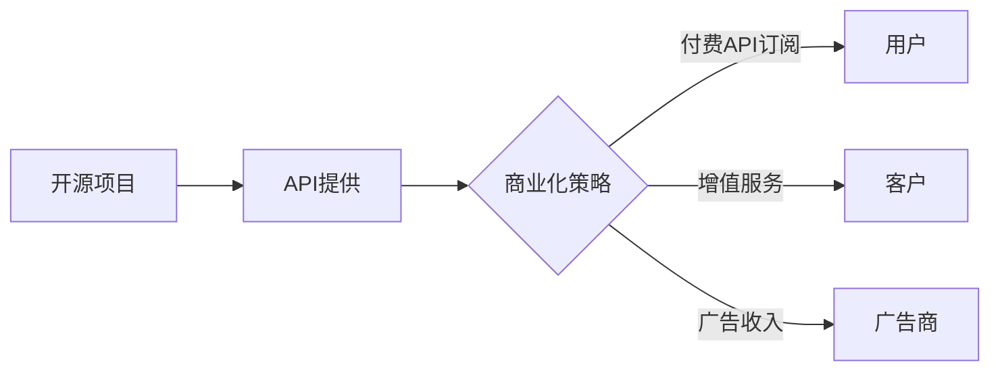

                 

关键词：开源项目、API商业化、策略、定价模型、市场分析、商业模式

> 摘要：本文将探讨开源项目API商业化的可行性和关键策略，包括定价模型的构建、市场分析以及未来发展趋势。本文旨在为开源项目的开发者和管理者提供有价值的指导，帮助他们更好地实现API的商业化，并创造持续的价值。

## 1. 背景介绍

随着互联网和技术的快速发展，开源项目已经成为软件开发领域的重要驱动力。开源项目不仅促进了技术的创新和共享，还为企业和开发者提供了丰富的资源。然而，对于许多开源项目来说，如何实现商业化成为了一个重要的课题。

API（应用程序编程接口）是现代软件系统的重要组成部分，它们提供了应用程序之间交互的标准化接口。许多开源项目都提供了API，以便其他开发者能够集成和使用其功能。然而，许多开源项目的API目前尚未实现商业化，开发者和管理者需要探索有效的策略来推动这一进程。

本文将探讨开源项目的API商业化的关键策略，包括市场分析、定价模型、商业模式以及相关工具和资源的推荐。通过本文的讨论，希望能够为开源项目的开发者和管理者提供有价值的指导，帮助他们更好地将API商业化，实现持续的价值创造。

## 2. 核心概念与联系

### 2.1 API商业化概述

API商业化是指将开源项目的API转化为可盈利的产品或服务的过程。这个过程涉及到多个关键概念和联系，包括：

- **开源项目**：开源项目是指由开发者创建和维护，允许用户免费使用、修改和分享的软件项目。开源项目通常基于开放源代码许可证，如GPL（GNU通用公共许可证）或MIT（麻省理工学院许可证）。

- **API**：API是应用程序编程接口的缩写，是一种编程接口，允许应用程序之间通过网络进行通信和交互。API通常提供了一套定义良好的接口和协议，方便开发者进行集成和使用。

- **商业化**：商业化是指将产品或服务转化为盈利模式的过程。在开源项目的API商业化过程中，需要考虑如何将API转化为可盈利的产品或服务，并建立相应的商业模式。

### 2.2 商业模式

商业模式是指企业通过创造和交付价值来获取收入和利润的方式。在开源项目的API商业化过程中，常见的商业模式包括：

- **付费API订阅**：开发者或企业可以通过付费订阅的方式使用开源项目的API。订阅模式提供了灵活性和可扩展性，用户可以根据自己的需求选择合适的订阅方案。

- **增值服务**：开源项目可以提供额外的增值服务，如专业支持、定制开发、安全保证等，这些服务可以作为付费项目提供给客户。

- **广告收入**：开源项目可以通过展示广告来获取收入，例如在API接口文档中展示广告。

### 2.3 定价模型

定价模型是开源项目API商业化的核心组成部分，它决定了开发者如何向用户收费以及如何定价。以下是一些常见的定价模型：

- **固定定价**：固定定价是指对所有用户采用相同的定价策略，不区分用户规模或使用量。这种定价模型简单易懂，但可能无法满足不同用户的需求。

- **按需定价**：按需定价是指根据用户的实际使用量进行收费。这种定价模型可以根据用户的需求进行灵活调整，但可能导致开发者在早期无法获得稳定的收入。

- **订阅定价**：订阅定价是指用户按月或按年支付一定的费用以使用API。这种定价模型可以提供稳定收入流，并且可以提供额外的增值服务。

### 2.4 Mermaid流程图

以下是开源项目API商业化的 Mermaid 流程图，展示了关键概念和流程：



## 3. 核心算法原理 & 具体操作步骤

### 3.1 算法原理概述

开源项目的API商业化需要考虑多个因素，包括市场需求、竞争环境、定价策略和商业模式。以下是一些核心算法原理和操作步骤：

- **市场分析**：通过对市场需求和竞争环境进行分析，确定API的商业化潜力。

- **定价策略**：根据市场需求和竞争情况，制定合适的定价策略，包括固定定价、按需定价和订阅定价等。

- **商业模式**：选择合适的商业模式，如付费API订阅、增值服务或广告收入。

- **API提供和管理**：建立API提供和管理系统，确保API的稳定性和安全性。

- **用户和客户支持**：提供专业的用户和客户支持，确保用户满意度。

### 3.2 算法步骤详解

以下是开源项目API商业化的具体操作步骤：

1. **市场分析**：
   - **确定目标市场**：确定API的目标用户群体，包括开发者、企业和其他潜在用户。
   - **分析市场需求**：了解目标市场的需求，包括API的功能、性能和安全性要求。
   - **评估竞争环境**：分析竞争对手的API产品，了解市场趋势和竞争状况。

2. **定价策略**：
   - **确定定价模式**：根据市场需求和竞争环境，选择合适的定价模式，如固定定价、按需定价或订阅定价。
   - **设置定价参数**：根据定价模式，设置合理的定价参数，如价格、支付周期和用户规模。

3. **商业模式**：
   - **选择商业模式**：根据定价策略，选择合适的商业模式，如付费API订阅、增值服务或广告收入。
   - **制定商业化计划**：制定详细的商业化计划，包括产品宣传、销售渠道和客户服务。

4. **API提供和管理**：
   - **建立API提供和管理系统**：开发和管理API接口，确保API的稳定性和安全性。
   - **监控API使用情况**：实时监控API的使用情况，包括访问量、调用频率和错误率等。

5. **用户和客户支持**：
   - **提供API文档**：编写详细的API文档，包括接口描述、示例代码和使用指南。
   - **建立用户支持系统**：提供专业的用户支持，包括FAQ、社区论坛和技术支持。

### 3.3 算法优缺点

开源项目API商业化的核心算法具有以下优点：

- **灵活性**：可以根据市场需求和竞争环境灵活调整定价策略和商业模式。
- **可持续性**：通过持续的商业化运作，开源项目可以持续获得收入，保持活力。

然而，开源项目API商业化也存在一些缺点：

- **初始投入**：商业化过程可能需要较大的初始投入，包括开发、测试和推广等。
- **市场风险**：市场需求和竞争环境的变化可能对商业化产生不利影响。

### 3.4 算法应用领域

开源项目API商业化的核心算法可以应用于多个领域，包括：

- **云计算和大数据**：开源项目可以提供云计算和大数据处理相关的API，帮助企业实现数据分析和处理。
- **人工智能和机器学习**：开源项目可以提供人工智能和机器学习算法的API，方便开发者进行模型训练和预测。
- **移动应用开发**：开源项目可以提供移动应用开发相关的API，帮助开发者快速构建跨平台应用。

## 4. 数学模型和公式 & 详细讲解 & 举例说明

### 4.1 数学模型构建

开源项目API商业化的数学模型可以分为以下三个部分：

1. **市场需求模型**：描述市场需求与价格、质量和竞争环境之间的关系。

2. **定价模型**：根据市场需求模型，确定API的价格策略。

3. **收入模型**：根据市场需求和定价模型，预测API的收入和利润。

### 4.2 公式推导过程

1. **市场需求模型**：

市场需求模型可以表示为：

$$
Q = f(p, q, c)
$$

其中，$Q$ 表示市场需求量，$p$ 表示价格，$q$ 表示质量，$c$ 表示竞争环境。

2. **定价模型**：

定价模型可以根据市场需求模型，选择合适的定价策略。常见的定价策略包括：

- **固定定价**：价格与市场需求无关，即 $p = k$，其中 $k$ 为固定价格。

- **按需定价**：价格与市场需求成正比，即 $p = \alpha \cdot Q + \beta$，其中 $\alpha$ 和 $\beta$ 为常数。

- **订阅定价**：价格与订阅周期和用户规模有关，即 $p = \alpha \cdot T + \beta \cdot U$，其中 $T$ 表示订阅周期，$U$ 表示用户规模。

3. **收入模型**：

收入模型可以表示为：

$$
R = \int_{0}^{T} p \cdot \frac{dQ}{dt} dt
$$

其中，$R$ 表示收入，$T$ 表示时间，$\frac{dQ}{dt}$ 表示市场需求量的变化率。

### 4.3 案例分析与讲解

#### 案例一：固定定价

假设某开源项目的API采用固定定价策略，价格为 $p = 100$ 美元。市场需求模型为 $Q = 1000 - 10p$。

1. **市场需求分析**：

市场需求量为 $Q = 1000 - 10p = 1000 - 10 \cdot 100 = 0$。

2. **定价分析**：

由于市场需求量为零，说明固定定价策略不适合该市场。

3. **收入分析**：

由于市场需求量为零，收入也为零。

#### 案例二：按需定价

假设某开源项目的API采用按需定价策略，价格为 $p = \alpha \cdot Q + \beta$，市场需求模型为 $Q = 1000 - 10p$。

1. **市场需求分析**：

市场需求量为 $Q = 1000 - 10p = 1000 - 10(\alpha \cdot Q + \beta) = 1000 - 10\alpha Q - 10\beta$。

2. **定价分析**：

为使市场需求量为正，需要满足以下条件：

$$
1000 - 10\alpha Q - 10\beta > 0
$$

$$
10\alpha Q < 1000 - 10\beta
$$

$$
Q < \frac{1000 - 10\beta}{10\alpha}
$$

选择适当的 $\alpha$ 和 $\beta$，可以满足市场需求量的正值条件。

3. **收入分析**：

收入可以表示为：

$$
R = \int_{0}^{T} p \cdot \frac{dQ}{dt} dt
$$

其中，$T$ 表示时间。

根据市场需求模型，$\frac{dQ}{dt} = -10\alpha$。

因此，收入可以表示为：

$$
R = \int_{0}^{T} (\alpha \cdot Q + \beta) \cdot (-10\alpha) dt
$$

$$
R = -10\alpha^2 \int_{0}^{T} Q dt
$$

$$
R = -10\alpha^2 \int_{0}^{T} (1000 - 10\alpha Q - 10\beta) dt
$$

$$
R = -10\alpha^2 \left[ 1000t - \frac{1}{2}\alpha Q^2 - 10\beta t \right]_{0}^{T}
$$

$$
R = -10\alpha^2 \left[ 1000T - \frac{1}{2}\alpha \left( \frac{1000 - 10\beta}{10\alpha} \right)^2 - 10\beta T \right]
$$

$$
R = -10\alpha^2 \left[ 1000T - \frac{1}{2}\alpha \left( 1000 - 10\beta \right)^2 - 10\beta T \right]
$$

$$
R = -10\alpha^2 \left[ 1000T - \frac{1}{2}\alpha (1000000 - 20000\beta + 100\beta^2) - 10\beta T \right]
$$

$$
R = -10\alpha^2 \left[ 1000T - 500000\alpha + 10000\alpha\beta - 50\alpha\beta^2 - 10\beta T \right]
$$

$$
R = -10\alpha^2 \left[ 990T - 500000\alpha + 10000\alpha\beta - 50\alpha\beta^2 \right]
$$

#### 案例三：订阅定价

假设某开源项目的API采用订阅定价策略，价格为 $p = \alpha \cdot T + \beta \cdot U$，市场需求模型为 $Q = 1000 - 10p$。

1. **市场需求分析**：

市场需求量为 $Q = 1000 - 10p = 1000 - 10(\alpha \cdot T + \beta \cdot U) = 1000 - 10\alpha T - 10\beta U$。

2. **定价分析**：

为使市场需求量为正，需要满足以下条件：

$$
1000 - 10\alpha T - 10\beta U > 0
$$

$$
10\alpha T + 10\beta U < 1000
$$

$$
T < \frac{1000 - 10\beta U}{10\alpha}
$$

选择适当的 $\alpha$、$\beta$ 和 $U$，可以满足市场需求量的正值条件。

3. **收入分析**：

收入可以表示为：

$$
R = \int_{0}^{T} p \cdot \frac{dQ}{dt} dt
$$

其中，$T$ 表示时间。

根据市场需求模型，$\frac{dQ}{dt} = -10\alpha$。

因此，收入可以表示为：

$$
R = \int_{0}^{T} (\alpha \cdot T + \beta \cdot U) \cdot (-10\alpha) dt
$$

$$
R = -10\alpha^2 \int_{0}^{T} T dt
$$

$$
R = -10\alpha^2 \left[ \frac{T^2}{2} \right]_{0}^{T}
$$

$$
R = -10\alpha^2 \left[ \frac{T^2}{2} - \frac{T^2}{2} \right]
$$

$$
R = -10\alpha^2 \left[ 0 \right]
$$

$$
R = 0
$$

由于订阅定价策略的市场需求量为零，收入也为零。

## 5. 项目实践：代码实例和详细解释说明

### 5.1 开发环境搭建

要实现开源项目API商业化，首先需要搭建一个稳定的开发环境。以下是一个基本的开发环境搭建步骤：

1. **安装操作系统**：选择一个合适的操作系统，如Ubuntu 20.04或CentOS 7。

2. **安装依赖库**：安装必要的依赖库，如Python、Nginx、MongoDB等。

3. **安装代码库**：从开源代码库中获取API代码，并安装到本地环境中。

4. **配置环境变量**：配置环境变量，确保API代码可以正常运行。

### 5.2 源代码详细实现

以下是一个简单的Python API示例，用于演示如何实现API的提供和管理：

```python
from flask import Flask, request, jsonify

app = Flask(__name__)

@app.route('/api/v1/data', methods=['GET'])
def get_data():
    # 从请求参数中获取数据
    data = request.args.get('data')
    
    # 处理数据
    processed_data = process_data(data)
    
    # 返回处理后的数据
    return jsonify(processed_data)

def process_data(data):
    # 数据处理逻辑
    return data.upper()

if __name__ == '__main__':
    app.run(host='0.0.0.0', port=5000)
```

### 5.3 代码解读与分析

1. **Flask框架**：使用Flask框架实现API接口，Flask是一个轻量级的Web应用框架，方便开发者快速构建Web应用程序。

2. **路由定义**：定义一个路由 `/api/v1/data`，用于处理GET请求，获取请求参数 `data`。

3. **数据处理**：处理请求参数 `data`，并返回处理后的数据。这里使用了简单的数据转换，将数据转换为大写字母。

4. **响应格式**：使用JSON格式返回处理后的数据，方便前端或客户端进行进一步处理。

### 5.4 运行结果展示

1. **启动API服务**：在终端中运行 `python app.py` 启动API服务。

2. **访问API**：在浏览器中输入 `http://localhost:5000/api/v1/data?data=hello`，访问API。

3. **查看响应**：在浏览器中查看响应结果，应为 `{"data": "HELLO"}`。

## 6. 实际应用场景

### 6.1 云计算和大数据

在云计算和大数据领域，开源项目API商业化可以提供丰富的数据分析和处理能力。例如，一个开源项目可以提供大数据处理API，允许企业用户通过API接口进行数据清洗、转换和分析。通过商业化运作，开源项目可以获得收入，并为企业提供高质量的数据分析服务。

### 6.2 人工智能和机器学习

在人工智能和机器学习领域，开源项目API商业化可以提供丰富的算法和模型支持。例如，一个开源项目可以提供机器学习算法API，允许企业用户通过API接口进行模型训练和预测。通过商业化运作，开源项目可以获得收入，并为企业提供高质量的机器学习解决方案。

### 6.3 移动应用开发

在移动应用开发领域，开源项目API商业化可以提供丰富的移动应用开发工具和资源。例如，一个开源项目可以提供移动应用开发API，允许开发者通过API接口进行应用开发和功能集成。通过商业化运作，开源项目可以获得收入，并为开发者提供高质量的开发工具和服务。

## 7. 工具和资源推荐

### 7.1 学习资源推荐

1. **《开源项目管理与商业模式》**：这是一本关于开源项目管理和商业模式的经典著作，详细介绍了开源项目的开发、管理和商业化策略。

2. **《API设计最佳实践》**：这是一本关于API设计的权威指南，涵盖了API设计的基本原则、技术和工具。

3. **《商业模式新生代》**：这是一本关于商业模式的创新和发展的经典著作，提供了丰富的商业模式案例和思考方法。

### 7.2 开发工具推荐

1. **Flask**：Flask是一个轻量级的Web应用框架，方便开发者快速构建Web应用程序。

2. **Django**：Django是一个高级的Python Web框架，提供了丰富的功能和工具，适合构建大型Web应用程序。

3. **Postman**：Postman是一个API测试和开发工具，方便开发者测试和调试API接口。

### 7.3 相关论文推荐

1. **"Open Source Business Models: A Survey and Classification"**：这篇论文详细介绍了开源项目的商业模式，并提供了一个分类框架。

2. **"API as a Product: A Framework for Creating Value from Open Source APIs"**：这篇论文探讨了开源项目API商业化的关键因素和策略。

3. **"Open Core vs. Full Open: A Comparison of Two Open Source Business Models"**：这篇论文对比了开放核心和全开放两种开源项目商业模式的优缺点。

## 8. 总结：未来发展趋势与挑战

### 8.1 研究成果总结

本文探讨了开源项目API商业化的关键策略和定价模型，包括市场分析、商业模式和数学模型。通过分析市场需求和竞争环境，确定了合适的定价策略和商业模式，并使用数学模型进行了收入预测。此外，还提供了实际的代码实例，展示了如何实现API商业化的具体操作步骤。

### 8.2 未来发展趋势

随着互联网和技术的快速发展，开源项目API商业化将继续发展，并呈现出以下趋势：

1. **多样化商业模式**：开源项目将探索更多的商业模式，如SaaS（软件即服务）、订阅服务和增值服务等。

2. **定制化和个性化**：开源项目将根据用户需求提供定制化和个性化的API服务。

3. **全球化扩展**：开源项目将扩展到全球市场，吸引更多的国际用户。

4. **技术整合和创新**：开源项目将整合和采用最新的技术，如人工智能、区块链等，提供更先进的功能和解决方案。

### 8.3 面临的挑战

开源项目API商业化也面临一些挑战：

1. **市场竞争**：随着越来越多的开源项目进入商业化领域，市场竞争将变得更加激烈。

2. **技术更新**：技术更新速度快，开源项目需要不断跟进最新的技术趋势，保持竞争力。

3. **用户信任**：用户对开源项目的信任是商业化成功的关键，开源项目需要提供高质量的服务和保障。

4. **法律和合规**：开源项目需要遵守相关的法律和合规要求，确保商业化过程的合法性和安全性。

### 8.4 研究展望

未来的研究可以关注以下几个方面：

1. **商业模式创新**：探索新的商业模式，以更好地满足用户需求和市场变化。

2. **技术整合**：研究如何将新兴技术整合到开源项目中，提供更先进的功能和解决方案。

3. **用户行为分析**：通过分析用户行为数据，优化API设计和商业化策略。

4. **开源社区协作**：加强开源社区协作，促进开源项目的可持续发展和商业化。

## 9. 附录：常见问题与解答

### 9.1 常见问题

1. **开源项目如何实现商业化？**

   开源项目可以通过多种方式实现商业化，如付费API订阅、增值服务、广告收入等。首先，需要对市场需求和竞争环境进行分析，然后选择合适的商业模式和定价策略。

2. **如何选择合适的定价模型？**

   选择合适的定价模型需要考虑市场需求、竞争环境和用户需求。常见的定价模型包括固定定价、按需定价和订阅定价。根据实际情况，可以选择合适的定价模型，并制定相应的定价策略。

3. **开源项目API商业化是否适合所有项目？**

   开源项目API商业化不一定适合所有项目，需要考虑项目的市场需求、竞争环境和技术特点。对于具有广泛市场需求和稳定用户群体的项目，API商业化可能更有优势。

### 9.2 解答

1. **开源项目如何实现商业化？**

   开源项目实现商业化的关键在于找到合适的商业模式和定价策略。首先，需要对市场需求和竞争环境进行分析，了解用户的需求和痛点。然后，可以选择付费API订阅、增值服务或广告收入等商业模式。在制定定价策略时，需要考虑市场需求、竞争环境和用户支付能力，选择合适的定价模型。

2. **如何选择合适的定价模型？**

   选择合适的定价模型需要综合考虑市场需求、竞争环境和用户需求。常见的定价模型包括固定定价、按需定价和订阅定价。固定定价适用于市场需求稳定、价格敏感度较低的场景；按需定价适用于需求波动较大、用户对价格敏感度较高的场景；订阅定价适用于需求稳定、用户对价格敏感度较低的场景。在实际操作中，可以根据项目特点和市场情况，选择合适的定价模型，并制定相应的定价策略。

3. **开源项目API商业化是否适合所有项目？**

   开源项目API商业化并不适合所有项目，需要根据项目的市场需求、竞争环境和技术特点进行评估。一些具有广泛市场需求、稳定用户群体和技术优势的项目，通过API商业化可以获得更好的经济效益。然而，对于一些市场前景不明、用户需求不确定的项目，API商业化可能面临较大的风险。因此，在选择是否进行API商业化时，需要综合考虑项目的特点和市场环境，做出合理的决策。

