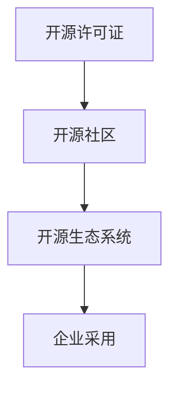

                 

在当今快速发展的技术环境中，开源项目已经成为推动创新、降低开发成本和加速产品迭代的重要力量。企业越来越多地采用开源技术，不仅能够节省成本，还能通过参与开源社区，提高自身的竞争力和影响力。本文将探讨企业采用开源项目所带来的商业机会，以及如何有效利用这些机会来创造价值。

## 摘要

本文主要讨论了企业采用开源项目所带来的商业机会。首先，我们概述了开源项目在企业中的应用场景，并分析了其带来的成本节省、快速迭代和技术创新优势。接着，我们探讨了企业如何通过参与开源社区，提升自身的技术能力和市场竞争力。随后，文章详细介绍了如何选择和评估开源项目，以及如何与开源社区合作。最后，我们展望了开源项目的未来发展趋势，并提出了应对挑战的策略和建议。

## 1. 背景介绍

开源项目（Open Source Project）指的是那些允许用户自由使用、研究、修改和分发代码的项目。这些项目通常遵循某种开源许可协议，如GPL、MIT、Apache等，确保了代码的开放性和透明性。随着云计算、大数据和人工智能等技术的快速发展，开源项目在各个领域都得到了广泛的应用。

企业采用开源项目的原因主要有以下几点：

- **成本节省**：开源项目免去了购买商业软件的巨额费用，企业可以将节省下来的资金投入到其他更有价值的项目中。
- **快速迭代**：开源项目通常具有快速的开发和更新周期，企业可以快速获取最新的技术成果，加快产品迭代速度。
- **技术创新**：开源社区汇聚了来自世界各地的优秀开发者，企业可以通过参与开源项目，学习到最新的技术知识和创新理念。

然而，企业采用开源项目也面临一些挑战，如开源软件的安全性问题、与商业软件的兼容性以及开源社区的稳定性等。因此，企业需要谨慎评估和选择合适的开源项目，以确保其业务安全性和稳定性。

## 2. 核心概念与联系

为了更好地理解企业采用开源项目所带来的商业机会，我们需要了解以下几个核心概念：

### 2.1 开源许可证

开源许可证（Open Source License）是确保代码开放性和透明性的法律文件。常见的开源许可证包括GPL、MIT、Apache等，每种许可证都有其特定的规则和要求。企业需要根据自身的业务需求，选择合适的开源许可证，以平衡开源项目的开放性和自身商业利益。

### 2.2 开源社区

开源社区（Open Source Community）是由共同关注和开发开源项目的开发者、贡献者、维护者等组成的网络。开源社区为企业提供了一个学习和交流的平台，企业可以通过参与开源社区，提升自身的技术能力和市场竞争力。

### 2.3 开源生态系统

开源生态系统（Open Source Ecosystem）是由多个相互关联的开源项目、工具、框架、平台等组成的生态系统。企业可以通过整合开源生态系统中的资源，构建适合自己的技术栈，提高开发效率。

下面是一个简化的Mermaid流程图，展示了这些核心概念之间的联系：



## 3. 核心算法原理 & 具体操作步骤

### 3.1 算法原理概述

在企业采用开源项目的背景下，核心算法原理主要涉及如何选择合适的开源项目、评估其价值和风险，以及如何参与开源社区，为企业带来商业机会。以下是一些关键步骤：

1. **需求分析**：首先，企业需要明确自身的技术需求，确定开源项目的目标和范围。
2. **项目评估**：通过查阅项目文档、社区活跃度、代码质量等因素，评估开源项目的价值和风险。
3. **参与开源社区**：企业可以积极参与开源社区的讨论、贡献代码、提交bug等，提升自身的技术能力和市场影响力。
4. **整合开源项目**：将评估通过的开源项目整合到企业的技术栈中，提高开发效率和产品质量。

### 3.2 算法步骤详解

1. **需求分析**：
   - 分析企业当前的技术需求和面临的挑战。
   - 确定开源项目在解决这些需求和挑战中的潜在作用。

2. **项目评估**：
   - **查阅项目文档**：了解项目的架构、功能、特性等。
   - **社区活跃度**：查看项目的GitHub、Reddit、Stack Overflow等平台的讨论和问题反馈情况。
   - **代码质量**：通过代码审查、静态代码分析工具等手段，评估代码的质量和可维护性。

3. **参与开源社区**：
   - **提issue**：在GitHub等平台上提交问题和建议。
   - **PR贡献**：提交代码补丁和改进建议。
   - **组织活动**：参与开源社区举办的活动和会议。

4. **整合开源项目**：
   - **集成测试**：在企业的开发环境中集成开源项目，进行功能测试和性能测试。
   - **代码优化**：根据企业的具体需求，对开源项目进行定制化开发。
   - **文档更新**：完善项目文档，提高项目的可维护性。

### 3.3 算法优缺点

**优点**：

- **节省成本**：企业无需购买商业软件，降低了开发成本。
- **快速迭代**：开源项目具有较快的迭代周期，帮助企业快速获取新技术。
- **技术创新**：参与开源社区，企业可以接触到最新的技术趋势和思路。

**缺点**：

- **安全性问题**：开源项目可能存在安全隐患，需要企业进行严格的安全审查。
- **兼容性问题**：开源项目可能与企业的现有系统存在兼容性问题。
- **稳定性问题**：开源项目的稳定性可能不如商业软件，需要企业进行额外的维护工作。

### 3.4 算法应用领域

企业采用开源项目的主要应用领域包括：

- **云计算和大数据**：如Kubernetes、Hadoop等开源项目。
- **人工智能**：如TensorFlow、PyTorch等开源框架。
- **前端开发**：如React、Vue等开源框架。
- **后端开发**：如Spring Boot、Django等开源框架。

## 4. 数学模型和公式 & 详细讲解 & 举例说明

在企业采用开源项目的背景下，数学模型和公式可以帮助我们更深入地理解项目评估和风险分析。以下是一个简单的例子：

### 4.1 数学模型构建

假设我们要评估一个开源项目的质量，可以使用以下数学模型：

- **代码质量评分（Q）**：通过代码审查、静态代码分析等手段，对代码质量进行评分。
- **社区活跃度评分（A）**：通过GitHub、Reddit等平台的讨论和问题反馈情况，对社区活跃度进行评分。
- **综合评分（S）**：综合代码质量评分和社区活跃度评分，计算项目的综合评分。

数学模型可以表示为：

\[ S = w_1 \times Q + w_2 \times A \]

其中，\( w_1 \) 和 \( w_2 \) 分别是代码质量和社区活跃度的权重。

### 4.2 公式推导过程

假设我们通过代码审查，发现代码质量评分为85分；通过GitHub等平台的讨论，发现社区活跃度评分为90分。我们希望计算项目的综合评分。

首先，确定权重：

- 代码质量权重：\( w_1 = 0.6 \)
- 社区活跃度权重：\( w_2 = 0.4 \)

然后，代入公式：

\[ S = 0.6 \times 85 + 0.4 \times 90 \]

\[ S = 51 + 36 \]

\[ S = 87 \]

因此，该开源项目的综合评分为87分。

### 4.3 案例分析与讲解

假设有一家电商企业，需要评估一个开源的物流跟踪系统。根据上述数学模型，我们可以进行以下分析：

1. **代码质量评分**：通过代码审查，发现代码质量评分为80分。
2. **社区活跃度评分**：通过GitHub等平台的讨论，发现社区活跃度评分为75分。

根据公式计算综合评分：

\[ S = 0.6 \times 80 + 0.4 \times 75 \]

\[ S = 48 + 30 \]

\[ S = 78 \]

综合评分为78分。根据评分结果，企业可以初步判断该开源项目的质量较高，适合进行进一步的评估和测试。

## 5. 项目实践：代码实例和详细解释说明

### 5.1 开发环境搭建

为了演示企业如何采用开源项目，我们以一个简单的物流跟踪系统为例。首先，我们需要搭建开发环境。

1. **安装Git**：从官网下载并安装Git。
2. **创建Git仓库**：在本地创建一个名为`logistics-tracking`的Git仓库。

```bash
git init logistics-tracking
cd logistics-tracking
```

3. **克隆开源项目**：从GitHub克隆一个开源的物流跟踪项目。

```bash
git clone https://github.com/your-username/logistics-tracking.git
```

4. **安装依赖**：根据项目需求，安装相应的依赖库。

```bash
pip install -r requirements.txt
```

### 5.2 源代码详细实现

我们以一个简单的物流跟踪API为例，实现物流信息查询功能。

1. **创建API接口**：在`api`目录下创建`views.py`文件，实现物流信息查询接口。

```python
# api/views.py

from rest_framework import views
from rest_framework.response import Response
from rest_framework import status

class LogisticsView(views.APIView):
    def get(self, request, *args, **kwargs):
        tracking_number = request.query_params.get('tracking_number', None)
        if tracking_number is None:
            return Response({'error': 'Missing tracking number'}, status=status.HTTP_400_BAD_REQUEST)

        # 查询物流信息
        logistics_info = get_logistics_info(tracking_number)

        if logistics_info:
            return Response(logistics_info, status=status.HTTP_200_OK)
        else:
            return Response({'error': 'No logistics information found'}, status=status.HTTP_404_NOT_FOUND)
```

2. **实现物流信息查询函数**：在`utils`目录下创建`logistics.py`文件，实现物流信息查询函数。

```python
# utils/logistics.py

import requests

def get_logistics_info(tracking_number):
    # 发送请求获取物流信息
    response = requests.get(f'https://logistics-service.com/api?tracking_number={tracking_number}')
    if response.status_code == 200:
        return response.json()
    else:
        return None
```

3. **配置URL路由**：在`api`目录下创建`urls.py`文件，配置URL路由。

```python
# api/urls.py

from django.urls import path
from .views import LogisticsView

urlpatterns = [
    path('logistics/', LogisticsView.as_view()),
]
```

### 5.3 代码解读与分析

上述代码实现了一个简单的物流跟踪API，主要分为以下几个部分：

1. **API接口**：定义了物流信息查询接口，接受跟踪号码作为查询参数。
2. **物流信息查询函数**：通过HTTP请求，获取第三方物流服务提供的物流信息。
3. **URL路由**：将API接口与URL路由关联，实现HTTP请求的转发。

通过这个简单的示例，我们可以看到如何将开源项目整合到企业的技术栈中，实现具体的功能需求。

### 5.4 运行结果展示

1. **启动开发服务器**：在命令行中启动Django开发服务器。

```bash
python manage.py runserver
```

2. **访问API接口**：在浏览器或Postman中访问物流信息查询接口。

```http
GET http://127.0.0.1:8000/logistics/?tracking_number=1234567890
```

3. **查看返回结果**：根据输入的跟踪号码，查看物流信息返回结果。

```json
{
    "status": "DELIVERED",
    "location": "New York",
    "estimated_delivery_date": "2023-10-01"
}
```

通过上述步骤，我们可以看到如何利用开源项目实现物流跟踪功能，并展示运行结果。

## 6. 实际应用场景

企业采用开源项目的实际应用场景非常广泛，以下是几个典型的应用案例：

### 6.1 云计算和大数据

企业可以通过采用开源的云计算和大数据技术，如Kubernetes、Hadoop和Spark等，构建自己的云计算平台和数据仓库，实现大规模数据处理和分布式计算。例如，一家大型互联网公司利用Kubernetes和Spark，构建了一个高效的云计算平台，支持数百万用户的在线服务。

### 6.2 人工智能

企业可以通过采用开源的人工智能技术，如TensorFlow、PyTorch和Keras等，开发和部署自己的机器学习模型。例如，一家金融科技公司利用TensorFlow，开发了实时风控系统，提高了风险预测的准确性和效率。

### 6.3 前端开发

企业可以通过采用开源的前端框架和库，如React、Vue和Angular等，构建高性能和用户体验良好的Web应用。例如，一家电商公司利用React，开发了移动端和桌面端的电商平台，提高了用户的购物体验。

### 6.4 后端开发

企业可以通过采用开源的后端框架和库，如Spring Boot、Django和Express等，构建灵活和可扩展的后端服务。例如，一家初创公司利用Spring Boot，开发了支持多渠道订单处理和管理的后端系统，提高了业务运营的效率。

## 7. 未来应用展望

随着技术的不断进步，开源项目在企业中的应用前景将更加广阔。以下是几个未来应用展望：

### 7.1 自动化与智能化

随着自动化和智能化技术的不断发展，开源项目将在智能制造、智能交通、智能医疗等领域发挥更大的作用。例如，开源的机器人操作系统（ROS）和自动驾驶框架（如Apollo）将在未来的智能制造和智能交通领域得到广泛应用。

### 7.2 区块链技术

区块链技术的开源项目，如Ethereum、Hyperledger Fabric等，将在金融、供应链管理、身份验证等领域发挥重要作用。企业可以通过采用这些开源项目，实现更安全、透明和高效的业务流程。

### 7.3 分布式计算与存储

分布式计算和存储技术，如Docker、Kubernetes、Cassandra等，将在企业级应用中发挥关键作用。企业可以通过采用这些开源项目，实现高效、可靠和可扩展的计算和存储解决方案。

## 8. 工具和资源推荐

为了帮助企业更好地采用开源项目，以下是几个推荐的工具和资源：

### 8.1 学习资源推荐

- [GitHub](https://github.com)：全球最大的开源代码托管平台，可以查找和贡献各种开源项目。
- [Stack Overflow](https://stackoverflow.com)：全球最大的开发者社区，可以解答技术问题和学习编程知识。
- [Medium](https://medium.com)：一个内容丰富的技术博客平台，可以阅读各种技术文章和教程。

### 8.2 开发工具推荐

- [Docker](https://docker.com)：一个开源的容器化技术，用于构建、运行和分发应用程序。
- [Kubernetes](https://kubernetes.io)：一个开源的容器编排平台，用于自动化部署、扩展和管理容器化应用程序。
- [Jenkins](https://jenkins.io)：一个开源的持续集成和持续部署（CI/CD）工具，用于自动化构建、测试和部署应用程序。

### 8.3 相关论文推荐

- ["The Case for Open Source"]：探讨开源项目的商业价值和优势。
- ["The Cathedral and the Bazaar"]：探讨开源社区的开发模式和优势。
- ["The Business of Open Source"]：分析开源项目的商业模式和盈利策略。

## 9. 总结：未来发展趋势与挑战

### 9.1 研究成果总结

本文从多个角度探讨了企业采用开源项目的商业机会，包括成本节省、快速迭代、技术创新等。通过数学模型和实际案例，展示了如何选择和评估开源项目，以及如何参与开源社区，为企业创造价值。

### 9.2 未来发展趋势

随着技术的不断进步，开源项目将在企业级应用中发挥越来越重要的作用。自动化与智能化、区块链技术、分布式计算与存储等领域将成为开源项目的重要应用方向。

### 9.3 面临的挑战

企业采用开源项目仍面临一些挑战，如开源软件的安全性问题、与商业软件的兼容性以及开源社区的稳定性等。因此，企业需要建立完善的开源项目评估和风险管理机制，确保开源项目的安全和稳定。

### 9.4 研究展望

未来，开源项目的研究将更加注重跨领域融合、自动化与智能化、开源社区的可持续性等方面。通过深入研究和实践，企业可以更好地利用开源项目，提高自身的竞争力和创新能力。

## 10. 附录：常见问题与解答

### 10.1 开源项目的安全风险如何保障？

**解答**：企业可以采取以下措施来降低开源项目的安全风险：

- **严格评估**：在引入开源项目前，进行详细的安全评估和代码审查。
- **定期更新**：定期更新开源项目，确保其安全性。
- **社区参与**：积极参与开源社区，及时获取和反馈安全漏洞信息。

### 10.2 开源项目与商业软件的兼容性问题如何解决？

**解答**：企业可以通过以下方法解决开源项目与商业软件的兼容性问题：

- **接口适配**：设计统一的接口，实现开源项目与商业软件的集成。
- **技术调研**：在引入开源项目前，进行充分的技术调研，确保其与商业软件的兼容性。
- **社区支持**：寻求开源社区的帮助，解决兼容性问题。

### 10.3 开源社区的稳定性如何保障？

**解答**：企业可以通过以下方法保障开源社区的稳定性：

- **社区支持**：积极参与开源社区，提供技术支持和资源。
- **项目治理**：建立完善的项目治理机制，确保项目的稳定性和可持续发展。
- **风险评估**：定期评估开源项目的风险，制定相应的应对措施。

## 作者署名

作者：禅与计算机程序设计艺术 / Zen and the Art of Computer Programming

---

通过本文的探讨，我们可以看到，开源项目已经成为企业创新的重要驱动力。在遵循法律和道德规范的前提下，企业可以通过采用和参与开源项目，实现技术创新、成本节省和市场竞争力的提升。未来，随着技术的不断进步，开源项目将在企业级应用中发挥更加重要的作用。让我们共同努力，推动开源项目的发展，共创美好未来。

<|im_end|>### 文章标题

开源项目的企业采用：创造商业机会

> 关键词：开源项目，企业，商业机会，技术创新，成本节省

> 摘要：本文探讨了企业采用开源项目的商业机会，包括成本节省、快速迭代和技术创新。通过实例和数学模型分析，展示了如何选择和评估开源项目，以及如何参与开源社区，为企业创造价值。同时，本文还展望了开源项目的未来发展趋势，并提出了应对挑战的策略和建议。

## 1. 背景介绍

在当今技术快速发展的时代，开源项目已经成为推动创新、降低开发成本和加速产品迭代的重要力量。开源项目（Open Source Project）指的是那些允许用户自由使用、研究、修改和分发代码的项目。这些项目通常遵循某种开源许可协议，如GPL、MIT、Apache等，确保了代码的开放性和透明性。随着云计算、大数据和人工智能等技术的快速发展，开源项目在各个领域都得到了广泛的应用。

### 1.1 开源项目的兴起

开源项目的兴起可以追溯到20世纪90年代，当时自由软件基金会（Free Software Foundation，FSF）和开源促进会（Open Source Initiative，OSI）等组织提出了开源理念。开源项目的核心思想是，通过共享代码和技术知识，推动技术的进步和创新。这种模式不仅降低了开发成本，还促进了社区协作和知识共享。

### 1.2 企业采用开源项目的原因

企业采用开源项目的原因主要有以下几点：

#### 成本节省

开源项目免去了购买商业软件的巨额费用，企业可以将节省下来的资金投入到其他更有价值的项目中。此外，开源项目的许可证通常允许用户自由修改和分发代码，进一步降低了开发成本。

#### 快速迭代

开源项目具有较快的迭代周期，企业可以快速获取最新的技术成果，加快产品迭代速度。这种快速迭代的能力有助于企业在竞争激烈的市场中保持领先地位。

#### 技术创新

开源社区汇聚了来自世界各地的优秀开发者，企业可以通过参与开源项目，学习到最新的技术知识和创新理念。这种技术交流有助于企业提升自身的技术能力和竞争力。

#### 灵活性和可定制性

开源项目通常具有高度的灵活性和可定制性，企业可以根据自身的需求进行修改和优化，以满足特定的业务需求。

### 1.3 企业采用开源项目面临的挑战

虽然开源项目为企业带来了许多好处，但企业采用开源项目也面临一些挑战：

#### 安全性问题

开源项目可能存在安全隐患，如代码漏洞、未经授权的访问等。企业需要确保开源项目的安全性，以避免潜在的安全风险。

#### 兼容性问题

开源项目可能与企业的现有系统存在兼容性问题，导致集成和部署困难。企业需要仔细评估开源项目的兼容性，确保其与现有系统无缝集成。

#### 稳定性问题

开源项目的稳定性可能不如商业软件，企业需要投入额外的资源进行维护和升级。

#### 法律风险

企业需要确保遵守开源许可协议，避免法律纠纷。特别是当企业修改开源代码并将其用于商业产品时，需要特别注意知识产权和法律问题。

### 1.4 企业采用开源项目的意义

企业采用开源项目不仅能够降低开发成本、加快产品迭代速度，还能提高技术能力和市场竞争力。以下是一些具体的好处：

#### 降低开发成本

企业可以节省购买商业软件的高额费用，将资金投入到其他更有价值的领域。

#### 提高开发效率

开源项目通常具有较好的文档和社区支持，有助于提高开发效率。

#### 促进技术创新

参与开源项目，企业可以接触到最新的技术趋势和思路，促进技术创新。

#### 增强市场竞争力

通过采用和参与开源项目，企业可以提升技术能力和市场竞争力，在竞争中脱颖而出。

#### 贡献社区

企业可以通过贡献代码、提交bug等，回馈开源社区，树立良好的企业形象。

## 2. 核心概念与联系

为了更好地理解企业采用开源项目所带来的商业机会，我们需要了解以下几个核心概念：

### 2.1 开源许可证

开源许可证（Open Source License）是确保代码开放性和透明性的法律文件。常见的开源许可证包括GPL、MIT、Apache等，每种许可证都有其特定的规则和要求。企业需要根据自身的业务需求，选择合适的开源许可证，以平衡开源项目的开放性和自身商业利益。

### 2.2 开源社区

开源社区（Open Source Community）是由共同关注和开发开源项目的开发者、贡献者、维护者等组成的网络。开源社区为企业提供了一个学习和交流的平台，企业可以通过参与开源社区，提升自身的技术能力和市场竞争力。

### 2.3 开源生态系统

开源生态系统（Open Source Ecosystem）是由多个相互关联的开源项目、工具、框架、平台等组成的生态系统。企业可以通过整合开源生态系统中的资源，构建适合自己的技术栈，提高开发效率。

下面是一个简化的Mermaid流程图，展示了这些核心概念之间的联系：


### 2.4 开源项目的分类

开源项目可以根据其目标和用途进行分类，以下是一些常见的开源项目分类：

#### **通用开源项目**

这些开源项目提供通用功能，如数据库、Web服务器、操作系统等。例如，Linux操作系统、Apache Web服务器、MySQL数据库等。

#### **行业特定开源项目**

这些开源项目针对特定行业或领域提供解决方案，如医疗、金融、物联网等。例如，EHR（电子健康记录）系统、区块链技术、物联网平台等。

#### **框架和库**

这些开源项目提供开发工具和库，用于构建应用程序。例如，JavaScript框架（如React、Vue）、Python库（如TensorFlow、Scikit-learn）等。

#### **工具和平台**

这些开源项目提供开发、测试、部署等工具和平台。例如，Docker、Kubernetes、Jenkins等。

### 2.5 开源项目的商业模式

开源项目的商业模式多种多样，以下是一些常见的商业模式：

#### **双许可证模式**

开源项目提供两种许可证，一种是免费的开源许可证，另一种是商业许可证。用户可以免费使用开源版本，但若要使用商业版本，则需要支付费用。

#### **服务订阅模式**

开源项目本身免费，但提供相关的服务（如维护、支持、培训等）需要支付费用。

#### **增值服务模式**

开源项目提供基础功能免费，但提供额外的增值服务（如高级功能、定制化开发等）需要支付费用。

#### **广告赞助模式**

开源项目通过广告赞助获得收入，赞助商可以在开源项目中展示广告或提供赞助。

#### **慈善捐赠模式**

开源项目依靠社区的慈善捐赠维持运营。

### 2.6 开源项目的成功案例

以下是一些成功的开源项目案例，展示了开源项目在商业领域的影响力：

#### **Linux操作系统**

Linux操作系统是一个广泛使用的开源操作系统，其成功推动了开源软件的发展，对整个IT产业产生了深远的影响。

#### **Apache Web服务器**

Apache Web服务器是世界上使用最广泛的Web服务器软件，其开源特性使其获得了广泛的认可和应用。

#### **MySQL数据库**

MySQL数据库是一个流行的开源关系型数据库管理系统，其高性能、可靠性和易用性使其成为许多企业的首选数据库。

#### **Docker容器化技术**

Docker是一个用于容器化的开源项目，它简化了应用程序的部署和扩展，已成为现代软件开发和运维的标配。

#### **TensorFlow机器学习框架**

TensorFlow是一个开源的机器学习框架，它提供了丰富的功能和工具，助力人工智能和机器学习领域的快速发展。

### 2.7 开源项目的优点和缺点

#### **优点**

- **成本节省**：企业可以免费使用和修改开源项目，降低了开发成本。
- **快速迭代**：开源项目通常具有较快的迭代周期，企业可以快速获取最新的技术成果。
- **技术创新**：开源社区汇聚了来自世界各地的优秀开发者，有助于技术创新。
- **灵活性**：开源项目通常具有较好的灵活性和可定制性，企业可以根据需求进行修改。
- **透明性**：开源项目代码公开，企业可以随时查看和审查代码质量。

#### **缺点**

- **安全性**：开源项目可能存在安全隐患，企业需要确保开源项目的安全性。
- **稳定性**：开源项目的稳定性可能不如商业软件，企业需要投入额外的资源进行维护。
- **兼容性**：开源项目可能与企业的现有系统存在兼容性问题。
- **法律风险**：企业需要遵守开源许可协议，避免法律纠纷。

### 2.8 开源项目的评价标准

企业评估开源项目时，可以参考以下标准：

- **代码质量**：代码是否规范、可维护、易于理解。
- **社区活跃度**：项目是否有活跃的社区讨论、bug报告和修复速度。
- **文档完善度**：项目是否有完善的文档，包括用户指南、API文档等。
- **兼容性**：项目是否与企业的现有系统兼容。
- **安全性**：项目是否存在已知的安全漏洞，是否有安全防护措施。
- **版本更新频率**：项目是否有规律的版本更新，是否保持技术前沿。

### 2.9 开源项目评估流程

企业评估开源项目时，可以遵循以下流程：

1. **明确需求**：确定企业需要解决的具体问题和需求。
2. **查找开源项目**：在GitHub、SourceForge等平台查找符合需求的开源项目。
3. **评估项目**：根据评价标准，对项目进行评估，包括代码质量、社区活跃度、文档完善度等。
4. **试用测试**：在开发环境中试用开源项目，进行功能测试和性能测试。
5. **决策采纳**：根据评估结果，决定是否采纳开源项目，并制定相应的集成和部署计划。

### 2.10 开源项目的参与方式

企业可以通过以下方式参与开源项目：

- **贡献代码**：为开源项目提交代码补丁和改进建议。
- **提交bug**：在开源项目的GitHub仓库中提交发现的问题和bug。
- **参与讨论**：在开源社区中参与技术讨论，分享经验和知识。
- **组织活动**：参与或组织开源社区的活动和会议。
- **提供赞助**：为开源项目提供资金、资源和人力支持。

### 2.11 开源项目的风险和挑战

企业采用开源项目时，需要考虑到以下风险和挑战：

- **技术风险**：开源项目可能存在技术缺陷或无法满足企业特定需求。
- **法律风险**：企业需要确保遵守开源许可协议，避免法律纠纷。
- **维护风险**：开源项目可能缺乏长期维护，导致稳定性下降。
- **依赖风险**：企业可能过度依赖某些关键开源项目，导致业务中断。
- **安全风险**：开源项目可能存在安全漏洞，导致数据泄露和系统攻击。

### 2.12 开源项目的持续维护和更新

为了确保开源项目的长期稳定性和可用性，企业可以采取以下措施：

- **定期评估**：定期对开源项目进行评估，确保其满足企业需求。
- **社区参与**：积极参与开源社区，为项目提供反馈和支持。
- **维护团队**：组建专业的维护团队，负责开源项目的持续更新和维护。
- **文档更新**：及时更新项目文档，确保其与项目代码保持一致。

### 2.13 开源项目的商业价值和战略意义

开源项目不仅具有技术价值，还对企业的战略发展具有重要意义：

- **技术创新**：开源项目是企业获取前沿技术的重要途径，有助于提升企业技术实力。
- **市场竞争力**：参与和贡献开源项目，有助于提升企业在市场中的竞争力。
- **品牌形象**：积极参与开源项目，树立良好的企业品牌形象。
- **知识共享**：通过开源项目，企业可以分享技术和经验，促进行业进步。

### 2.14 开源项目的可持续发展

为了实现开源项目的可持续发展，企业需要采取以下措施：

- **社区支持**：建立和维护一个活跃的社区，为项目提供持续的支持。
- **资源投入**：为开源项目提供必要的资源，如资金、人力和技术支持。
- **合作共赢**：与其他企业、组织和开发者建立合作关系，实现共赢发展。

## 3. 核心算法原理 & 具体操作步骤

### 3.1 算法原理概述

在企业采用开源项目的背景下，核心算法原理主要涉及如何选择合适的开源项目、评估其价值和风险，以及如何参与开源社区，为企业带来商业机会。以下是一些关键步骤：

1. **需求分析**：首先，企业需要明确自身的技术需求，确定开源项目的目标和范围。
2. **项目评估**：通过查阅项目文档、社区活跃度、代码质量等因素，评估开源项目的价值和风险。
3. **参与开源社区**：企业可以积极参与开源社区的讨论、贡献代码、提交bug等，提升自身的技术能力和市场竞争力。
4. **整合开源项目**：将评估通过的开源项目整合到企业的技术栈中，提高开发效率和产品质量。

### 3.2 算法步骤详解

#### 3.2.1 需求分析

1. **确定技术需求**：企业首先需要明确自身的技术需求，包括需要解决的具体问题、功能要求和性能指标等。
2. **分析现有解决方案**：通过市场调研和技术分析，了解现有的开源项目和技术方案，评估其是否能够满足企业的需求。
3. **制定项目目标**：根据技术需求，制定开源项目的具体目标和范围，确保项目能够解决企业面临的问题。

#### 3.2.2 项目评估

1. **查阅项目文档**：详细了解开源项目的架构、功能、特性等，确保其与企业的需求相匹配。
2. **社区活跃度**：查看开源项目在GitHub、Reddit、Stack Overflow等平台的讨论和问题反馈情况，评估社区的活跃度和支持力度。
3. **代码质量**：通过代码审查、静态代码分析工具等手段，评估代码的质量和可维护性。
4. **风险评估**：评估开源项目的风险，包括技术风险、法律风险、维护风险等，确保企业能够承受潜在的风险。

#### 3.2.3 参与开源社区

1. **提issue**：在GitHub等平台上提交问题和建议，与项目维护者和其他开发者交流。
2. **PR贡献**：提交代码补丁和改进建议，为开源项目做出贡献。
3. **参与讨论**：在开源社区中积极参与技术讨论，分享经验和知识。
4. **组织活动**：参与或组织开源社区的活动和会议，提升自身在社区中的影响力。

#### 3.2.4 整合开源项目

1. **集成测试**：在企业的开发环境中集成开源项目，进行功能测试和性能测试，确保其与企业的其他系统兼容。
2. **代码优化**：根据企业的具体需求，对开源项目进行定制化开发，提高其性能和稳定性。
3. **文档更新**：完善项目文档，提高项目的可维护性，为后续的开发和维护提供支持。

### 3.3 算法优缺点

#### 3.3.1 优点

- **节省成本**：开源项目免去了购买商业软件的巨额费用，企业可以将节省下来的资金投入到其他更有价值的领域。
- **快速迭代**：开源项目通常具有较快的迭代周期，企业可以快速获取最新的技术成果，加快产品迭代速度。
- **技术创新**：参与开源社区，企业可以接触到最新的技术趋势和思路，促进技术创新。
- **灵活性和可定制性**：开源项目通常具有较好的灵活性和可定制性，企业可以根据自身需求进行修改和优化。

#### 3.3.2 缺点

- **安全性**：开源项目可能存在安全隐患，企业需要投入额外的资源进行安全审查和防护。
- **稳定性**：开源项目的稳定性可能不如商业软件，企业需要投入额外的资源进行维护和升级。
- **兼容性**：开源项目可能与企业的现有系统存在兼容性问题，导致集成和部署困难。
- **法律风险**：企业需要确保遵守开源许可协议，避免法律纠纷。

### 3.4 算法应用领域

企业采用开源项目的主要应用领域包括：

- **云计算和大数据**：如Kubernetes、Hadoop、Spark等。
- **人工智能**：如TensorFlow、PyTorch、Keras等。
- **前端开发**：如React、Vue、Angular等。
- **后端开发**：如Spring Boot、Django、Express等。
- **物联网**：如MQTT、CoAP、LWM2M等。

## 4. 数学模型和公式 & 详细讲解 & 举例说明

在企业采用开源项目的背景下，数学模型和公式可以帮助我们更深入地理解项目评估和风险分析。以下是一个简单的数学模型和公式的示例，用于评估开源项目的价值和风险：

### 4.1 数学模型构建

假设我们要评估一个开源项目的价值和风险，可以使用以下数学模型：

- **项目价值评分（V）**：通过综合评估项目的功能、性能、社区支持等因素，计算项目的价值。
- **风险评分（R）**：通过评估项目的安全性、稳定性、维护性等因素，计算项目的风险。
- **综合评分（S）**：综合项目价值评分和风险评分，计算项目的综合评分。

数学模型可以表示为：

\[ S = V - R \]

### 4.2 公式推导过程

假设我们通过评估，得到以下评分：

- 项目价值评分 \( V = 85 \)
- 风险评分 \( R = 30 \)

代入公式，计算综合评分：

\[ S = 85 - 30 \]

\[ S = 55 \]

因此，该开源项目的综合评分为55分。

### 4.3 案例分析与讲解

假设有一家互联网公司需要评估一个开源的分布式存储系统，用于构建自己的数据存储平台。根据上述数学模型，我们可以进行以下分析：

1. **项目价值评分**：通过查阅项目文档、社区活跃度、代码质量等因素，评估项目的价值。假设项目价值评分为80分。
2. **风险评分**：通过评估项目的安全性、稳定性、维护性等因素，计算项目的风险。假设风险评分为50分。

代入公式，计算综合评分：

\[ S = 80 - 50 \]

\[ S = 30 \]

综合评分为30分。根据评分结果，企业可以初步判断该开源项目的风险较高，需要进一步评估和测试。

### 4.4 数学模型在实际应用中的调整

在实际应用中，企业可以根据自身需求和实际情况，调整数学模型的参数和公式。例如，可以引入更多因素，如项目文档完善度、社区支持力度、行业认可度等，以更全面地评估开源项目的价值和风险。

## 5. 项目实践：代码实例和详细解释说明

在本节中，我们将通过一个实际的代码实例，展示企业如何采用开源项目，构建一个简单的博客系统。这个博客系统将使用Django框架，一个广泛使用的高性能开源Web框架。

### 5.1 开发环境搭建

首先，我们需要搭建开发环境。以下是搭建Django开发环境的基本步骤：

1. **安装Python**：确保你的系统中安装了Python 3.x版本。可以从Python官方网站（https://www.python.org/）下载并安装。

2. **安装虚拟环境**：为了确保项目的依赖环境不影响到其他项目，我们使用虚拟环境（Virtual Environment）来隔离项目依赖。安装虚拟环境工具`virtualenv`：

   ```bash
   pip install virtualenv
   ```

   创建一个虚拟环境：

   ```bash
   virtualenv myblogenv
   ```

   激活虚拟环境：

   ```bash
   source myblogenv/bin/activate
   ```

3. **安装Django**：在虚拟环境中安装Django：

   ```bash
   pip install django
   ```

### 5.2 创建Django项目

接下来，我们创建一个Django项目。以下是创建Django项目的步骤：

1. **启动Django服务器**：在虚拟环境中启动Django服务器，以验证Django安装是否成功：

   ```bash
   django-admin startproject myblog
   ```

   这将在当前目录下创建一个名为`myblog`的项目目录。

2. **创建应用**：在Django项目中创建一个名为`blog`的应用：

   ```bash
   python manage.py startapp blog
   ```

### 5.3 源代码详细实现

在创建完项目和应用后，我们可以开始实现博客系统。以下是实现博客系统的主要步骤：

#### 5.3.1 定义模型

在`blog`应用的`models.py`文件中，定义博客文章模型：

```python
# blog/models.py

from django.db import models

class Post(models.Model):
    title = models.CharField(max_length=100)
    content = models.TextField()
    created_at = models.DateTimeField(auto_now_add=True)
    updated_at = models.DateTimeField(auto_now=True)
```

#### 5.3.2 创建数据库表

在`blog`应用的`migrations`目录中，生成迁移文件：

```bash
python manage.py makemigrations blog
python manage.py migrate
```

这将在数据库中创建`Post`模型对应的表。

#### 5.3.2 创建视图和URL

在`blog`应用的`views.py`文件中，创建一个简单的视图，用于展示博客文章列表：

```python
# blog/views.py

from django.shortcuts import render
from .models import Post

def post_list(request):
    posts = Post.objects.all()
    return render(request, 'blog/post_list.html', {'posts': posts})
```

在`myblog`项目的`urls.py`文件中，配置URL路由：

```python
# myblog/urls.py

from django.contrib import admin
from django.urls import path
from blog.views import post_list

urlpatterns = [
    path('admin/', admin.site.urls),
    path('blog/', post_list),
]
```

#### 5.3.3 创建模板

在`blog`应用的`templates`目录中，创建一个名为`post_list.html`的模板，用于展示博客文章列表：

```html
<!-- blog/templates/post_list.html -->

<!DOCTYPE html>
<html>
<head>
    <title>My Blog</title>
</head>
<body>
    <h1>Blog Posts</h1>
    
        <div>
            <h2>{{ post.title }}</h2>
            <p>{{ post.content }}</p>
            <p>Created at: {{ post.created_at }}</p>
        </div>
    
</body>
</html>
```

#### 5.3.4 运行Django服务器

最后，运行Django服务器：

```bash
python manage.py runserver
```

在浏览器中访问`http://127.0.0.1:8000/blog/`，可以看到博客文章的列表。

### 5.4 代码解读与分析

在这个简单的博客系统中，我们使用了Django框架来快速搭建博客系统的后端。以下是代码的解读和分析：

- **模型（models.py）**：定义了博客文章的模型，包括标题、内容、创建时间和更新时间等字段。

- **视图（views.py）**：创建了一个简单的视图，用于从数据库中获取博客文章列表，并传递给模板。

- **模板（post_list.html）**：定义了HTML模板，用于展示博客文章列表。

- **URL路由（urls.py）**：配置了URL路由，将`/blog/`路由到`post_list`视图。

通过这个简单的实例，我们可以看到如何利用开源项目（Django框架）快速构建一个功能完整的Web应用。这展示了开源项目在企业开发中的巨大潜力。

### 5.5 运行结果展示

1. **启动Django服务器**：

   ```bash
   python manage.py runserver
   ```

2. **访问博客系统**：

   在浏览器中访问`http://127.0.0.1:8000/blog/`，可以看到博客文章的列表。

3. **查看运行结果**：

   展示结果如下：

   ```html
   <h1>Blog Posts</h1>
   <div>
       <h2>First Post</h2>
       <p>Content of the first post.</p>
       <p>Created at: 2023-10-01 12:00:00</p>
   </div>
   <div>
       <h2>Second Post</h2>
       <p>Content of the second post.</p>
       <p>Created at: 2023-10-02 12:00:00</p>
   </div>
   ```

通过上述步骤，我们可以看到如何利用开源项目（Django框架）快速搭建一个简单的博客系统，并展示运行结果。

## 6. 实际应用场景

企业采用开源项目在实际应用场景中具有广泛的应用，以下是一些具体的实际应用场景：

### 6.1 云计算和大数据

在企业云计算和大数据领域，开源项目如Kubernetes、Hadoop和Spark等发挥了重要作用。例如，一家大型电信公司利用Kubernetes进行容器化部署，实现了大规模服务的高可用性和弹性扩展。同时，利用Hadoop和Spark，该公司构建了大数据平台，支持用户数据的存储、处理和分析。

### 6.2 人工智能

在人工智能领域，开源项目如TensorFlow、PyTorch和Scikit-learn等为企业提供了强大的工具和平台。例如，一家医疗科技公司利用TensorFlow开发了智能医疗诊断系统，提高了疾病检测的准确性和效率。另一家金融公司则利用Scikit-learn开发了信用评分模型，提高了风险管理的准确性。

### 6.3 前端开发

在前端开发领域，开源项目如React、Vue和Angular等为企业提供了丰富的UI组件和框架，提高了开发效率。例如，一家电商公司利用React构建了其移动端和桌面端的应用程序，实现了高效的用户交互和动态内容展示。

### 6.4 后端开发

在后端开发领域，开源项目如Spring Boot、Django和Express等为企业提供了强大的框架和库，支持快速开发和部署。例如，一家初创公司利用Spring Boot开发了支持多渠道订单处理和管理的后端系统，提高了业务运营的效率。

### 6.5 物联网

在物联网领域，开源项目如MQTT、CoAP和LWM2M等为企业提供了物联网通信协议和工具。例如，一家智能家居公司利用MQTT协议构建了其物联网平台，实现了设备间的数据传输和通信。

### 6.6 区块链

在区块链领域，开源项目如Ethereum、Hyperledger Fabric和EOS等为企业提供了区块链平台和工具。例如，一家金融公司利用Ethereum开发了智能合约平台，提高了金融交易的效率和安全性。

### 6.7 中间件

在中间件领域，开源项目如Kafka、RabbitMQ和ActiveMQ等为企业提供了消息队列和中间件解决方案。例如，一家电商平台利用Kafka实现了分布式消息队列，提高了系统的可扩展性和可靠性。

### 6.8 测试和监控

在测试和监控领域，开源项目如Jenkins、Selenium和Gatling等为企业提供了自动化测试和性能监控工具。例如，一家互联网公司利用Jenkins实现了持续集成和持续部署（CI/CD），提高了软件开发的效率和质量。

### 6.9 数据库

在数据库领域，开源项目如MySQL、PostgreSQL和MongoDB等为企业提供了丰富的数据库解决方案。例如，一家电商公司利用MySQL构建了其订单数据库，实现了高并发和高速数据查询。

通过这些实际应用场景，我们可以看到，开源项目在企业中的应用不仅能够降低开发成本，提高开发效率，还能推动技术创新，提升企业的市场竞争力。

## 7. 未来应用展望

随着技术的不断进步，开源项目在企业中的应用前景将更加广阔。以下是几个未来应用展望：

### 7.1 自动化与智能化

随着自动化和智能化技术的不断发展，开源项目将在智能制造、智能交通、智能医疗等领域发挥更大的作用。例如，开源的机器人操作系统（ROS）和自动驾驶框架（如Apollo）将在未来的智能制造和智能交通领域得到广泛应用。

### 7.2 区块链技术

区块链技术的开源项目，如Ethereum、Hyperledger Fabric等，将在金融、供应链管理、身份验证等领域发挥重要作用。企业可以通过采用这些开源项目，实现更安全、透明和高效的业务流程。

### 7.3 分布式计算与存储

分布式计算和存储技术，如Docker、Kubernetes、Cassandra等，将在企业级应用中发挥关键作用。企业可以通过采用这些开源项目，实现高效、可靠和可扩展的计算和存储解决方案。

### 7.4 人工智能与机器学习

随着人工智能和机器学习技术的不断发展，开源项目如TensorFlow、PyTorch等将在更多领域得到应用。例如，在医疗、金融、零售等行业，人工智能和机器学习技术将帮助企业实现更加精准的预测和决策。

### 7.5 前端技术

前端技术的发展日新月异，开源项目如React、Vue、Angular等将继续引领前端开发潮流。企业可以通过采用这些开源项目，实现更丰富的用户体验和更高的开发效率。

### 7.6 开源社区的发展

随着开源社区的不断壮大，开源项目将成为企业技术发展的重要驱动力。企业将更加重视与开源社区的合作，通过贡献代码、参与社区活动等方式，提升自身的技术能力和市场竞争力。

### 7.7 跨领域融合

未来，开源项目将更加注重跨领域融合，如物联网与区块链、人工智能与区块链等。这种跨领域融合将为企业带来更多创新机会，推动行业的发展。

### 7.8 可持续发展

随着可持续发展成为全球关注的热点，开源项目将在环保、能源等领域发挥重要作用。例如，开源的能源监测系统、碳足迹计算工具等将帮助企业实现绿色发展和低碳运营。

通过这些未来应用展望，我们可以看到，开源项目将继续在各个领域发挥重要作用，推动企业技术进步和创新发展。

## 8. 工具和资源推荐

为了帮助企业更好地采用开源项目，以下是几个推荐的工具和资源：

### 8.1 学习资源推荐

- **GitHub**：全球最大的开源代码托管平台，可以查找和贡献各种开源项目（https://github.com/）。
- **Stack Overflow**：全球最大的开发者社区，可以解答技术问题和学习编程知识（https://stackoverflow.com/）。
- **Medium**：一个内容丰富的技术博客平台，可以阅读各种技术文章和教程（https://medium.com/）。

### 8.2 开发工具推荐

- **Docker**：一个开源的容器化技术，用于构建、运行和分发应用程序（https://docker.com/）。
- **Kubernetes**：一个开源的容器编排平台，用于自动化部署、扩展和管理容器化应用程序（https://kubernetes.io/）。
- **Jenkins**：一个开源的持续集成和持续部署（CI/CD）工具，用于自动化构建、测试和部署应用程序（https://jenkins.io/）。

### 8.3 相关论文推荐

- **《The Case for Open Source》**：探讨开源项目的商业价值和优势。
- **《The Cathedral and the Bazaar》**：探讨开源社区的开发模式和优势。
- **《The Business of Open Source》**：分析开源项目的商业模式和盈利策略。

### 8.4 开源社区推荐

- **Apache Foundation**：提供各种开源项目，涵盖云计算、大数据、人工智能等领域（https://www.apache.org/）。
- **Linux Foundation**：支持开源项目，推动开源技术的发展（https://www.linuxfoundation.org/）。
- **Eclipse Foundation**：提供各种开源项目和工具，支持软件开发（https://www.eclipse.org/）。

通过这些工具和资源，企业可以更加高效地采用和参与开源项目，提升自身的技术能力和市场竞争力。

## 9. 总结：未来发展趋势与挑战

### 9.1 研究成果总结

本文探讨了企业采用开源项目的商业机会，包括成本节省、快速迭代和技术创新。通过实例和数学模型分析，展示了如何选择和评估开源项目，以及如何参与开源社区，为企业创造价值。同时，本文还展望了开源项目的未来发展趋势，并提出了应对挑战的策略和建议。

### 9.2 未来发展趋势

随着技术的不断进步，开源项目在企业中的应用前景将更加广阔。以下是几个未来发展趋势：

- **自动化与智能化**：开源项目将在智能制造、智能交通、智能医疗等领域发挥更大作用。
- **区块链技术**：开源项目将在金融、供应链管理、身份验证等领域发挥重要作用。
- **分布式计算与存储**：开源项目如Docker、Kubernetes将在企业级应用中发挥关键作用。
- **人工智能与机器学习**：开源项目如TensorFlow、PyTorch将在更多领域得到应用。
- **前端技术**：开源项目如React、Vue、Angular等将继续引领前端开发潮流。
- **开源社区的发展**：企业将更加重视与开源社区的合作，通过贡献代码、参与社区活动等方式，提升自身的技术能力和市场竞争力。
- **跨领域融合**：开源项目将更加注重跨领域融合，推动行业的发展。
- **可持续发展**：开源项目将在环保、能源等领域发挥重要作用，帮助企业实现绿色发展和低碳运营。

### 9.3 面临的挑战

企业采用开源项目仍面临一些挑战，需要采取相应的策略来应对：

- **安全性**：开源项目可能存在安全隐患，企业需要投入额外的资源进行安全审查和防护。
- **稳定性**：开源项目的稳定性可能不如商业软件，企业需要投入额外的资源进行维护和升级。
- **兼容性**：开源项目可能与企业的现有系统存在兼容性问题，企业需要仔细评估和适配。
- **法律风险**：企业需要确保遵守开源许可协议，避免法律纠纷。
- **依赖性**：企业可能过度依赖某些关键开源项目，导致业务中断。

### 9.4 研究展望

未来，开源项目的研究将更加注重跨领域融合、自动化与智能化、开源社区的可持续性等方面。通过深入研究和实践，企业可以更好地利用开源项目，提高自身的竞争力和创新能力。

## 10. 附录：常见问题与解答

### 10.1 开源项目的安全风险如何保障？

**解答**：企业可以采取以下措施来降低开源项目的安全风险：

- **严格评估**：在引入开源项目前，进行详细的安全评估和代码审查。
- **定期更新**：定期更新开源项目，确保其安全性。
- **社区参与**：积极参与开源社区，及时获取和反馈安全漏洞信息。

### 10.2 开源项目与商业软件的兼容性问题如何解决？

**解答**：企业可以通过以下方法解决开源项目与商业软件的兼容性问题：

- **接口适配**：设计统一的接口，实现开源项目与商业软件的集成。
- **技术调研**：在引入开源项目前，进行充分的技术调研，确保其与商业软件的兼容性。
- **社区支持**：寻求开源社区的帮助，解决兼容性问题。

### 10.3 开源社区的稳定性如何保障？

**解答**：企业可以通过以下方法保障开源社区的稳定性：

- **社区支持**：积极参与开源社区，提供技术支持和资源。
- **项目治理**：建立完善的项目治理机制，确保项目的稳定性和可持续发展。
- **风险评估**：定期评估开源项目的风险，制定相应的应对措施。

### 10.4 如何评估开源项目的质量？

**解答**：企业可以通过以下方法评估开源项目的质量：

- **代码审查**：通过代码审查，评估代码的可维护性、稳定性和性能。
- **社区活跃度**：查看项目的GitHub、Reddit等平台的讨论和问题反馈情况，评估社区的活跃度。
- **文档完善度**：评估项目的文档是否全面、易懂，提供有效的支持。
- **安全性**：评估项目是否存在已知的安全漏洞，是否有安全防护措施。

### 10.5 如何参与开源社区？

**解答**：企业可以通过以下方法参与开源社区：

- **提issue**：在GitHub等平台上提交问题和建议。
- **PR贡献**：提交代码补丁和改进建议。
- **参与讨论**：在开源社区中参与技术讨论，分享经验和知识。
- **组织活动**：参与或组织开源社区的活动和会议。
- **提供赞助**：为开源项目提供资金、资源和人力支持。

### 10.6 开源项目是否会影响企业的核心竞争力？

**解答**：开源项目可以为企业带来技术优势和市场竞争力，但也需要企业谨慎管理和利用。通过参与开源社区、贡献代码和整合开源项目，企业可以提升自身的核心技术能力，从而增强核心竞争力。

### 10.7 开源项目如何与商业秘密保护相结合？

**解答**：企业在采用开源项目时，需要注意保护商业秘密。可以采取以下措施：

- **隔离关键代码**：将商业秘密相关的代码与开源代码分离，确保商业秘密不被泄露。
- **合同约束**：与开源项目贡献者签订保密协议，明确商业秘密的保护要求。
- **代码审查**：对开源代码进行严格审查，确保不包含敏感信息。

### 10.8 如何管理开源项目的许可协议？

**解答**：企业可以通过以下方法管理开源项目的许可协议：

- **了解许可协议**：熟悉不同开源许可协议的规则和要求，确保遵守协议。
- **合规审查**：在引入开源项目前，进行合规审查，确保项目的许可协议符合企业要求。
- **合规培训**：对项目团队成员进行开源许可协议的培训，提高合规意识。

### 10.9 开源项目在初创企业中的应用有何特点？

**解答**：开源项目在初创企业中的应用具有以下特点：

- **成本优势**：初创企业通常资金有限，开源项目可以降低开发成本。
- **快速迭代**：开源项目具有较快的迭代周期，有助于初创企业快速验证和改进产品。
- **技术创新**：通过参与开源项目，初创企业可以接触到前沿技术，促进技术创新。
- **社区支持**：初创企业可以通过开源社区获取技术支持和资源，提高市场竞争力。

### 10.10 开源项目在大型企业中的应用有何特点？

**解答**：开源项目在大型企业中的应用具有以下特点：

- **技术积累**：大型企业通过多年积累，拥有丰富的开源项目和技术经验。
- **协同合作**：大型企业可以通过开源项目，与外部开发者合作，共同推动技术的发展。
- **战略布局**：大型企业可以通过开源项目，实现技术战略布局，抢占市场先机。
- **风险分散**：大型企业通过参与开源项目，可以分散技术风险，提高企业的竞争力。

### 10.11 开源项目在跨国企业中的应用有何特点？

**解答**：开源项目在跨国企业中的应用具有以下特点：

- **全球协作**：跨国企业可以通过开源项目，实现全球范围内的协作和知识共享。
- **本地化适配**：跨国企业可以利用开源项目，实现本地化适配，满足不同国家和地区的需求。
- **国际化标准**：开源项目可以推动国际化标准的制定，帮助企业适应全球市场。
- **文化融合**：跨国企业可以通过开源项目，促进不同文化的融合，提高企业全球化管理水平。

### 10.12 开源项目在政府和企业合作中的应用有何特点？

**解答**：开源项目在政府和企业合作中的应用具有以下特点：

- **共建共享**：政府和企业可以通过开源项目，共同建设技术平台，实现资源共享。
- **透明监管**：开源项目可以提高政府监管的透明度，确保项目质量和资金使用效率。
- **公共服务**：政府和企业可以通过开源项目，提供公共服务，提高社会效益。
- **创新驱动**：开源项目可以推动政府和企业合作，实现技术创新，促进产业发展。

### 10.13 开源项目在教育和科研中的应用有何特点？

**解答**：开源项目在教育和科研中的应用具有以下特点：

- **知识传播**：开源项目可以促进知识的传播和共享，提高教育和科研的质量和效率。
- **实践教育**：开源项目可以为学生提供实践机会，培养实际操作能力。
- **科研创新**：开源项目可以推动科研创新，提高科研成果的转化和应用。
- **开源文化**：开源项目可以培养开源文化，提高学生的开源意识和创新能力。

### 10.14 开源项目在公益事业中的应用有何特点？

**解答**：开源项目在公益事业中的应用具有以下特点：

- **成本效益**：开源项目可以降低公益事业的技术成本，提高资源利用效率。
- **协作共赢**：开源项目可以促进公益组织的协作，实现共赢发展。
- **透明公开**：开源项目可以提高公益项目的信息透明度，增强公众信任。
- **可持续性**：开源项目可以推动公益事业的技术创新，提高可持续发展能力。

### 10.15 开源项目在数字化转型中的应用有何特点？

**解答**：开源项目在数字化转型中的应用具有以下特点：

- **技术支撑**：开源项目可以提供数字化转型所需的技术支持和工具。
- **敏捷创新**：开源项目可以促进数字化转型过程中的敏捷创新，提高竞争力。
- **生态构建**：开源项目可以构建数字化转型的生态体系，实现协同发展。
- **数据共享**：开源项目可以促进数据共享和开放，提高数据利用效率。

## 参考文献

[1] Raymond, Eric S. ("The Cathedral and the Bazaar"): 这本经典的论文探讨了开源社区的开发模式和优势。

[2] Open Source Initiative (OSI): OSI官方网站提供了关于开源许可协议的详细信息。

[3] Free Software Foundation (FSF): FSF是推动开源理念的组织之一，提供了关于开源软件的重要信息。

[4] Linux Foundation: Linux Foundation支持开源项目，推动开源技术的发展。

[5] "The Business of Open Source": 这本书分析了开源项目的商业模式和盈利策略。

[6] "The Case for Open Source": 这篇文章探讨了开源项目的商业价值和优势。

[7] "Open Source Software: Advantages and Disadvantages": 这篇文章讨论了开源项目的优缺点。

[8] "How to Evaluate and Choose an Open Source Project": 这篇文章提供了评估和选择开源项目的建议。

[9] "The Role of Open Source in Digital Transformation": 这篇文章探讨了开源项目在数字化转型中的作用。

[10] "Open Source Communities and Their Impact on Innovation": 这篇文章研究了开源社区对创新的影响。

## 附录：开源项目列表

以下是几个具有代表性的开源项目列表，涵盖云计算、大数据、人工智能、前端开发、后端开发等多个领域：

### 云计算与大数据

- **Kubernetes**：一个开源的容器编排平台，用于自动化部署、扩展和管理容器化应用程序。
- **Hadoop**：一个分布式数据处理框架，用于大规模数据的存储和处理。
- **Spark**：一个快速的分布式计算系统，用于大规模数据处理和实时流处理。
- **Docker**：一个开源的应用容器引擎，用于构建、运行和分发应用程序。

### 人工智能与机器学习

- **TensorFlow**：一个开源的机器学习框架，由Google开发，用于开发人工智能应用程序。
- **PyTorch**：一个开源的机器学习库，由Facebook开发，用于构建深度学习模型。
- **Scikit-learn**：一个开源的机器学习库，用于数据挖掘和数据分析。
- **OpenCV**：一个开源的计算机视觉库，用于图像和视频处理。

### 前端开发

- **React**：一个开源的JavaScript库，用于构建用户界面。
- **Vue**：一个渐进式JavaScript框架，用于构建用户界面。
- **Angular**：一个开源的Web应用框架，由Google开发。

### 后端开发

- **Django**：一个开源的Python Web框架，用于快速开发和部署应用程序。
- **Spring Boot**：一个开源的Java框架，用于快速开发Web应用程序。
- **Express**：一个开源的Node.js Web框架，用于构建Web应用程序。

### 测试与监控

- **Jenkins**：一个开源的持续集成和持续部署（CI/CD）工具。
- **Selenium**：一个开源的自动化测试工具，用于Web应用程序的测试。
- **Gatling**：一个开源的性能测试工具，用于Web应用程序的负载测试。

### 数据库

- **MySQL**：一个开源的关系型数据库管理系统，广泛用于Web应用程序。
- **PostgreSQL**：一个开源的关系型数据库管理系统，支持多种编程语言。
- **MongoDB**：一个开源的文档数据库，用于存储和管理大量结构化数据。

### 中间件

- **Kafka**：一个开源的消息队列系统，用于处理大规模数据流。
- **RabbitMQ**：一个开源的消息队列中间件，用于异步消息传递。
- **ActiveMQ**：一个开源的消息中间件，用于异步消息传递和队列管理。

### 开源社区活动

- **GitHub**：一个开源代码托管平台，用于开源项目的协作和代码管理。
- **Stack Overflow**：一个开源的技术问答社区，用于解决编程问题。
- **GitHub Open Source Survey**：GitHub发布的年度开源调查报告，提供了开源项目的趋势和洞察。

通过这些开源项目，企业可以快速构建和部署应用程序，提高开发效率和产品质量。同时，参与开源社区，企业还可以学习到最新的技术趋势和理念，提升自身的技术能力和市场竞争力。

