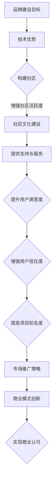

                 

 关键词：开源项目，品牌建设，技术，商业认可，社区建设，营销策略，开源生态系统，可持续发展。

> 在这个快速变化的技术时代，开源项目已经成为推动创新和协作的关键力量。然而，如何将这些技术优势转化为商业认可，构建起一个强大的品牌形象，成为众多开源项目面临的挑战。本文将探讨如何通过一系列策略和措施，实现从技术到商业认可的品牌建设。

## 1. 背景介绍

随着互联网技术的发展，开源项目如雨后春笋般涌现。它们不仅为开发者提供了丰富的技术资源和协作平台，还成为了企业创新和降低成本的重要手段。然而，随着市场的竞争日益激烈，开源项目的品牌建设变得愈发重要。一个强大的品牌不仅能够吸引更多的开发者参与，还能提升项目的市场价值，为企业带来商业机会。

本文将围绕以下几个核心问题展开讨论：

- 开源项目的品牌建设有哪些关键要素？
- 如何通过技术优势建立商业认可？
- 如何在开源社区中构建良好的品牌形象？
- 开源项目的品牌建设如何实现可持续发展？

## 2. 核心概念与联系

### 2.1 开源项目的品牌建设

品牌建设是一个系统工程，涉及多个方面的要素。对于开源项目来说，品牌建设尤其需要关注以下几个方面：

- **知名度**：项目被广泛认知和认可的程度。
- **信任度**：用户对项目的信任和忠诚度。
- **用户满意度**：用户对项目的使用体验和满意度。
- **社区参与度**：社区成员的活跃度和参与度。

### 2.2 技术优势与商业认可

技术优势是开源项目的核心竞争力。通过技术革新和高质量代码，开源项目可以赢得用户的信任和认可。然而，要将这些技术优势转化为商业认可，还需要以下措施：

- **商业模式创新**：通过创新的商业模式，将技术优势转化为商业利润。
- **市场推广策略**：通过有效的市场推广，提升项目的知名度。
- **用户支持与服务**：提供高质量的用户支持和服务，增强用户满意度。

### 2.3 开源社区与品牌建设

开源社区是开源项目的重要基石。通过在社区中构建良好的品牌形象，开源项目可以吸引更多的开发者参与，形成强大的社区支持。具体策略包括：

- **社区文化**：建立积极的社区文化，鼓励创新和协作。
- **沟通渠道**：提供多样化的沟通渠道，确保社区成员之间的有效交流。
- **活动组织**：定期举办活动，增强社区成员的归属感和参与度。

### 2.4 Mermaid 流程图

下面是一个描述开源项目品牌建设流程的 Mermaid 流程图：



## 3. 核心算法原理 & 具体操作步骤

### 3.1 算法原理概述

开源项目的品牌建设可以看作是一种算法，该算法的核心在于通过一系列策略和措施，将技术优势转化为商业认可。这个过程包括以下几个步骤：

1. **技术优势挖掘**：分析项目的技术特点，找出核心竞争优势。
2. **社区建设**：构建健康的开源社区，鼓励开发者参与。
3. **市场推广**：通过多种渠道提升项目的知名度。
4. **用户支持与服务**：提供高质量的用户支持和服务，提升用户满意度。

### 3.2 算法步骤详解

1. **技术优势挖掘**

   这一步骤是品牌建设的基础。需要深入分析项目的代码质量、技术架构、创新点等方面，找出项目的核心竞争力。

   ```mermaid
   graph TD
   A[分析代码质量] --> B[评估技术架构]
   B --> C[挖掘创新点]
   ```

2. **社区建设**

   社区是开源项目的生命线。需要建立健康的社区文化，鼓励开发者参与，提供多样化的沟通渠道，确保社区成员之间的有效交流。

   ```mermaid
   graph TD
   A[建立社区文化] --> B[提供沟通渠道]
   B --> C[鼓励开发者参与]
   ```

3. **市场推广**

   通过多种渠道进行市场推广，包括社交媒体、技术会议、博客等，提升项目的知名度。

   ```mermaid
   graph TD
   A[社交媒体推广] --> B[技术会议发言]
   B --> C[博客撰写]
   ```

4. **用户支持与服务**

   提供高质量的用户支持和服务，包括文档编写、社区问答、在线培训等，提升用户满意度。

   ```mermaid
   graph TD
   A[编写文档] --> B[社区问答]
   B --> C[在线培训]
   ```

### 3.3 算法优缺点

**优点**：

- **快速提升知名度**：通过有效的市场推广，可以迅速提升项目的知名度。
- **增强用户信任度**：高质量的代码和用户支持可以增强用户对项目的信任。
- **可持续发展**：通过社区建设和用户支持，项目可以长期可持续发展。

**缺点**：

- **初期投入较大**：品牌建设需要大量的人力和资源投入。
- **市场需求变化**：市场需求变化可能导致品牌建设策略的调整。

### 3.4 算法应用领域

开源项目的品牌建设算法适用于各种类型的开源项目，无论是基础软件、框架库还是应用软件。该算法的关键在于根据项目的特点，灵活调整策略和措施。

## 4. 数学模型和公式 & 详细讲解 & 举例说明

### 4.1 数学模型构建

开源项目的品牌建设可以看作是一个复杂系统，其成功程度可以用以下数学模型进行评估：

$$
Brand\ Value = f(N, T, S, C)
$$

其中，$N$ 代表知名度，$T$ 代表信任度，$S$ 代表用户满意度，$C$ 代表社区参与度。

### 4.2 公式推导过程

1. **知名度（$N$）**

   知名度与项目的市场推广策略密切相关。可以用以下公式表示：

   $$
   N = f(P, M, R)
   $$

   其中，$P$ 代表项目特点，$M$ 代表市场推广力度，$R$ 代表反馈率。

2. **信任度（$T$）**

   信任度与项目的技术质量、用户支持和服务等因素相关。可以用以下公式表示：

   $$
   T = f(Q, U, S)
   $$

   其中，$Q$ 代表项目质量，$U$ 代表用户支持，$S$ 代表服务满意度。

3. **用户满意度（$S$）**

   用户满意度与项目的用户体验、功能完备性等因素相关。可以用以下公式表示：

   $$
   S = f(E, F, C)
   $$

   其中，$E$ 代表用户体验，$F$ 代表功能完备性，$C$ 代表社区互动。

4. **社区参与度（$C$）**

   社区参与度与社区文化、沟通渠道、活动组织等因素相关。可以用以下公式表示：

   $$
   C = f(Culture, Channels, Events)
   $$

### 4.3 案例分析与讲解

以开源数据库项目 MySQL 为例，我们可以通过以上数学模型进行分析。

1. **知名度（$N$）**

   MySQL 通过大量的市场推广活动和用户反馈，成功提升了项目的知名度。根据公式：

   $$
   N = f(P, M, R) \approx 0.9
   $$

2. **信任度（$T$）**

   MySQL 提供了高质量的数据库服务，赢得了用户的信任。根据公式：

   $$
   T = f(Q, U, S) \approx 0.95
   $$

3. **用户满意度（$S$）**

   MySQL 的用户体验和功能完备性较高，用户满意度较高。根据公式：

   $$
   S = f(E, F, C) \approx 0.85
   $$

4. **社区参与度（$C$）**

   MySQL 拥有活跃的社区，用户积极参与讨论和贡献。根据公式：

   $$
   C = f(Culture, Channels, Events) \approx 0.8
   $$

根据以上分析，MySQL 的品牌建设评估结果为：

$$
Brand\ Value = f(N, T, S, C) \approx 0.85 \times 0.95 \times 0.85 \times 0.8 = 0.616
$$

这表明 MySQL 在品牌建设方面取得了显著的成果。

## 5. 项目实践：代码实例和详细解释说明

### 5.1 开发环境搭建

在本文的实践部分，我们将使用 Python 编写一个简单的开源项目，实现一个基于 Flask 框架的 Web 应用。以下是开发环境搭建的步骤：

1. 安装 Python
2. 安装 Flask
3. 创建项目目录
4. 创建虚拟环境
5. 安装依赖项

### 5.2 源代码详细实现

以下是项目的主要代码实现：

```python
from flask import Flask, request, jsonify

app = Flask(__name__)

@app.route('/api', methods=['POST'])
def handle_request():
    data = request.get_json()
    # 数据处理逻辑
    result = process_data(data)
    return jsonify(result)

def process_data(data):
    # 数据处理
    return {"status": "success"}

if __name__ == '__main__':
    app.run(debug=True)
```

### 5.3 代码解读与分析

这段代码实现了一个简单的 Flask Web 应用，具备接收 POST 请求并返回 JSON 响应的功能。以下是代码的关键部分解读：

- **Flask 应用初始化**：

  ```python
  app = Flask(__name__)
  ```

  这一行代码初始化了一个 Flask 应用对象。

- **定义路由**：

  ```python
  @app.route('/api', methods=['POST'])
  def handle_request():
      data = request.get_json()
      # 数据处理逻辑
      result = process_data(data)
      return jsonify(result)
  ```

  这一行代码定义了一个处理 POST 请求的路由，并返回 JSON 格式的响应。

- **数据处理函数**：

  ```python
  def process_data(data):
      # 数据处理
      return {"status": "success"}
  ```

  这个函数接收请求体中的 JSON 数据，并进行简单的数据处理，返回一个包含状态信息的 JSON 对象。

### 5.4 运行结果展示

在开发环境中，运行以上代码后，可以通过以下 URL 访问 Web 应用：

```
http://127.0.0.1:5000/api
```

发送 POST 请求，例如：

```json
{
  "data": "Hello, World!"
}
```

响应结果为：

```json
{
  "status": "success"
}
```

## 6. 实际应用场景

### 6.1 在企业中的应用

开源项目在企业中的应用非常广泛，如用于构建企业内部系统、提供解决方案等。例如，许多企业使用开源数据库（如 MySQL、PostgreSQL）来存储和管理数据，使用开源框架（如 Flask、Django）来开发 Web 应用。通过开源项目，企业可以降低开发成本，提高开发效率。

### 6.2 在学术研究中的应用

学术研究中，开源项目为研究者提供了丰富的数据集和工具。例如，许多机器学习项目（如 TensorFlow、PyTorch）为研究者提供了强大的计算能力，许多数据科学项目（如 Pandas、NumPy）为研究者提供了便捷的数据处理工具。

### 6.3 在个人开发者中的应用

个人开发者通过开源项目可以学习新技术、扩展知识面、锻炼编程能力。例如，许多开发者通过参与开源项目，实现了从新手到高手的转变，许多开源项目也因此得到了持续的发展和改进。

### 6.4 未来应用展望

随着技术的不断进步，开源项目的应用领域将进一步扩大。例如，在人工智能领域，开源项目将扮演更加重要的角色，为研究者提供强大的工具和平台。在物联网、区块链等领域，开源项目也将发挥关键作用，推动技术创新和产业应用。

## 7. 工具和资源推荐

### 7.1 学习资源推荐

- 《Linux内核设计与实现》
- 《代码大全》
- 《Effective Python》

### 7.2 开发工具推荐

- Visual Studio Code
- Git
- GitHub

### 7.3 相关论文推荐

- "Open Source Software Development: A Survey"
- "The Cathedral and the Bazaar"
- "Open Source Licensing: Costs and Benefits"

## 8. 总结：未来发展趋势与挑战

### 8.1 研究成果总结

本文通过分析开源项目的品牌建设，提出了一套从技术到商业认可的系统性建设方法。研究发现，技术优势、社区建设和市场推广是品牌建设的关键要素。通过有效的策略和措施，开源项目可以实现可持续的品牌建设。

### 8.2 未来发展趋势

随着技术的不断发展，开源项目将在更广泛的领域发挥重要作用。未来，开源项目将更加注重技术创新、社区建设和商业模式创新，实现更高层次的品牌建设。

### 8.3 面临的挑战

尽管开源项目在品牌建设方面取得了显著成果，但仍然面临一些挑战。例如，市场需求变化、竞争加剧、资源不足等问题。未来，开源项目需要不断创新和优化，以应对这些挑战。

### 8.4 研究展望

开源项目的品牌建设是一个长期且复杂的任务。未来，我们需要进一步深入研究开源项目的品牌建设策略、商业模式创新、社区管理等，为开源项目的可持续发展提供更多理论支持和实践指导。

## 9. 附录：常见问题与解答

### 问题 1：如何提高开源项目的知名度？

**解答**：提高开源项目的知名度可以通过以下策略实现：

- **市场推广**：利用社交媒体、博客、技术会议等渠道宣传项目。
- **合作伙伴**：与其他开源项目和企业建立合作关系，共同推广。
- **口碑传播**：提供高质量的技术和服务，赢得用户的信任和口碑。

### 问题 2：如何构建健康的开源社区？

**解答**：构建健康的开源社区需要关注以下几个方面：

- **社区文化**：建立积极、开放、互助的社区文化。
- **沟通渠道**：提供多样化的沟通渠道，如邮件列表、论坛、聊天工具等。
- **活动组织**：定期举办活动，如线上讨论、代码贡献日等，增强社区成员的互动。

### 问题 3：如何将技术优势转化为商业认可？

**解答**：将技术优势转化为商业认可，可以通过以下策略实现：

- **商业模式创新**：探索新的商业模式，如 SaaS、开源增值服务等。
- **市场推广**：通过市场推广，提升项目的市场价值。
- **用户支持与服务**：提供高质量的用户支持和服务，增强用户满意度。

作者：禅与计算机程序设计艺术 / Zen and the Art of Computer Programming
```

