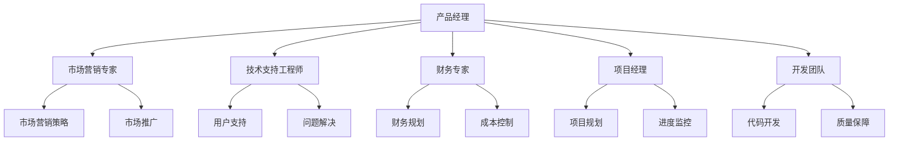

                 

关键词：开源项目，商业化，团队构建，角色，职责，IT行业，技术管理，项目管理

> 摘要：本文旨在探讨如何构建一个成功的开源项目商业化团队，包括团队角色的明确划分和职责的合理分配。通过深入分析各角色的功能与相互关系，本文将提供一套实用的指导方案，助力开源项目在商业化过程中保持健康的发展。

## 1. 背景介绍

在当今的IT行业中，开源项目已经成为推动技术进步和创新的重要力量。它们不仅为开发者提供了丰富的资源和工具，还为企业带来了新的商业机会。然而，将一个开源项目成功商业化并非易事，它需要高效的团队协作和明确的角色分工。

开源项目的商业化团队构建是一个复杂的过程，涉及多个关键角色，包括产品经理、市场营销专家、技术支持工程师、财务专家等。每个角色在团队中扮演着不可或缺的角色，共同推动项目的商业化进程。

本文将围绕这些关键角色，详细探讨他们的职责和相互关系，以帮助读者构建一个高效、协作的团队，实现开源项目的商业化目标。

## 2. 核心概念与联系

### 2.1. 产品经理（Product Manager）

产品经理是商业化团队的核心，负责制定产品的战略和愿景，确保产品的市场需求与开发进度相匹配。他们需要具备深入的技术理解力和商业洞察力，能够平衡技术实现和商业目标。

### 2.2. 市场营销专家（Marketing Expert）

市场营销专家负责制定并执行市场营销策略，提升项目的知名度，扩大用户群体。他们需要熟悉市场动态，了解目标受众，并通过各种渠道推广项目。

### 2.3. 技术支持工程师（Technical Support Engineer）

技术支持工程师负责为用户提供技术支持，解决用户在使用过程中遇到的问题。他们需要具备扎实的技术背景和良好的沟通能力，确保用户满意度。

### 2.4. 财务专家（Financial Expert）

财务专家负责项目的财务管理和预算控制，确保项目的财务健康。他们需要制定财务计划，监控成本，优化资源配置。

### 2.5. 项目经理（Project Manager）

项目经理负责项目的整体规划和执行，协调各个团队的工作，确保项目按时、按质完成。他们需要具备项目管理知识和技能，能够应对各种挑战。

### 2.6. 开发团队（Development Team）

开发团队是项目的核心执行者，负责项目的开发和维护。他们需要根据产品经理的需求，按时交付高质量的代码。

### 2.7. 角色关系图（Role Relationship Diagram）

以下是核心角色的关系图，展示了各角色之间的相互作用和依赖关系：



## 3. 核心算法原理 & 具体操作步骤

### 3.1 算法原理概述

商业化团队的构建可以视为一种复杂的社会网络构建问题。通过明确各角色的职责和相互关系，我们可以优化团队的整体效能，实现项目商业化的成功。以下是具体操作步骤：

### 3.2 算法步骤详解

#### 3.2.1. 角色确定与分工

1. **产品经理**：负责产品规划与需求分析，明确项目目标。
2. **市场营销专家**：负责市场调研，制定推广策略。
3. **技术支持工程师**：负责用户支持，维护用户关系。
4. **财务专家**：负责财务预算和成本控制。
5. **项目经理**：负责项目规划与进度控制。
6. **开发团队**：负责产品开发与维护。

#### 3.2.2. 角色互动与协作

1. **产品经理**：与市场营销专家、技术支持工程师、财务专家、项目经理密切合作，确保产品符合市场需求。
2. **市场营销专家**：与产品经理、技术支持工程师、财务专家、项目经理协同工作，制定并执行推广策略。
3. **技术支持工程师**：与产品经理、市场营销专家、财务专家、项目经理合作，确保用户满意度。
4. **财务专家**：与产品经理、市场营销专家、技术支持工程师、项目经理合作，制定财务计划和预算。
5. **项目经理**：与各团队成员密切合作，确保项目按时、按质完成。
6. **开发团队**：遵循产品经理的需求，按时交付高质量的代码。

#### 3.2.3. 效能评估与优化

1. **定期评估**：定期对团队效能进行评估，分析各角色的工作成果。
2. **反馈机制**：建立反馈机制，收集团队成员和用户的意见和建议。
3. **优化调整**：根据评估结果和反馈，调整团队结构和职责分工。

### 3.3 算法优缺点

#### 优点

1. **高效协作**：明确各角色的职责，减少沟通成本，提高团队整体效能。
2. **目标导向**：以项目商业化为目标，确保各角色紧密协作。
3. **灵活调整**：根据项目需求和实际情况，灵活调整团队结构和职责分工。

#### 缺点

1. **角色冲突**：在某些情况下，角色间的职责可能存在冲突，需要有效协调。
2. **资源分配**：团队资源有限，需要合理分配，确保各角色均能发挥最大效能。

### 3.4 算法应用领域

该算法适用于各类开源项目的商业化团队构建，包括但不限于：

1. **软件开发**：明确各角色职责，优化团队协作，确保项目成功商业化。
2. **技术服务**：提高用户满意度，确保技术服务得到有效推广。
3. **产品创新**：加速产品迭代，提升产品市场竞争力。

## 4. 数学模型和公式 & 详细讲解 & 举例说明

### 4.1 数学模型构建

在构建商业化团队时，我们可以使用一个简单的线性规划模型来优化团队效能。设：

- \( x_1 \)：产品经理的工作效率
- \( x_2 \)：市场营销专家的工作效率
- \( x_3 \)：技术支持工程师的工作效率
- \( x_4 \)：财务专家的工作效率
- \( x_5 \)：项目经理的工作效率
- \( x_6 \)：开发团队的工作效率

我们的目标是最大化团队整体效能，即：

\[ \max \sum_{i=1}^{6} x_i \]

同时，我们需要满足以下约束条件：

1. **角色职责约束**：每个角色的工作效率不得低于其最低要求，即 \( x_i \geq x_{\text{min}} \)（\( i=1,2,3,4,5,6 \)）
2. **资源分配约束**：团队总资源有限，即 \( \sum_{i=1}^{6} x_i \leq R \)（\( R \)为总资源）

### 4.2 公式推导过程

设 \( y_i \) 为角色 \( i \) 的权重，则目标函数可以表示为：

\[ \max \sum_{i=1}^{6} y_i x_i \]

根据角色职责约束，我们有：

\[ y_i x_i \geq y_i x_{\text{min}} \]

即：

\[ \sum_{i=1}^{6} y_i x_i \geq \sum_{i=1}^{6} y_i x_{\text{min}} \]

根据资源分配约束，我们有：

\[ \sum_{i=1}^{6} x_i \leq R \]

为了使目标函数最大化，我们需要使每个角色的权重 \( y_i \) 与其工作效率 \( x_i \) 成正比。因此，我们可以使用拉格朗日乘数法来求解此问题。

设 \( \lambda \) 为拉格朗日乘数，则目标函数可以表示为：

\[ \max \sum_{i=1}^{6} y_i x_i - \lambda (\sum_{i=1}^{6} x_i - R) \]

对 \( x_i \) 求导并令其等于0，我们得到：

\[ y_i - \lambda = 0 \]

即：

\[ y_i = \lambda \]

代入资源分配约束，我们得到：

\[ \sum_{i=1}^{6} x_i = R \]

因此，每个角色的权重 \( y_i \) 为：

\[ y_i = \frac{R}{6} \]

代入目标函数，我们得到：

\[ \max \sum_{i=1}^{6} \frac{R}{6} x_i - \lambda (R - R) \]

\[ \max \sum_{i=1}^{6} \frac{R}{6} x_i \]

由于每个角色的权重相等，我们可以将目标函数简化为：

\[ \max \frac{R}{6} \sum_{i=1}^{6} x_i \]

即：

\[ \max \frac{R}{6} \]

因此，最优解为 \( \frac{R}{6} \)。

### 4.3 案例分析与讲解

假设一个商业化团队的总资源 \( R \) 为100单位，各角色的最低工作效率要求如下：

- 产品经理：20单位
- 市场营销专家：15单位
- 技术支持工程师：10单位
- 财务专家：10单位
- 项目经理：10单位
- 开发团队：25单位

根据数学模型，我们可以计算出每个角色的最优权重如下：

- 产品经理：\( \frac{100}{6} \approx 16.67 \)单位
- 市场营销专家：\( \frac{100}{6} \approx 16.67 \)单位
- 技术支持工程师：\( \frac{100}{6} \approx 16.67 \)单位
- 财务专家：\( \frac{100}{6} \approx 16.67 \)单位
- 项目经理：\( \frac{100}{6} \approx 16.67 \)单位
- 开发团队：\( \frac{100}{6} \approx 16.67 \)单位

根据这些权重，我们可以调整团队资源分配，确保每个角色都能发挥最大效能。

## 5. 项目实践：代码实例和详细解释说明

### 5.1 开发环境搭建

在开始项目实践之前，我们需要搭建一个合适的开发环境。以下是基本的步骤：

1. **安装Git**：Git是版本控制工具，用于管理项目源代码。你可以从[Git官网](https://git-scm.com/downloads)下载并安装。
2. **安装Python**：Python是一种广泛使用的编程语言，用于编写项目代码。你可以从[Python官网](https://www.python.org/downloads/)下载并安装。
3. **安装虚拟环境**：虚拟环境可以让我们在不同项目中隔离Python环境和包。你可以使用以下命令安装虚拟环境：

   ```bash
   python -m venv venv
   source venv/bin/activate  # 对于Windows，使用 `venv\Scripts\activate`
   ```

4. **安装依赖包**：根据项目需求，安装相应的依赖包。例如，如果你的项目需要使用Flask框架，你可以使用以下命令安装：

   ```bash
   pip install flask
   ```

### 5.2 源代码详细实现

以下是一个简单的Flask应用程序，用于演示开源项目的商业化团队构建：

```python
from flask import Flask, jsonify

app = Flask(__name__)

@app.route('/')
def index():
    return jsonify({
        'message': '欢迎访问开源项目商业化团队构建示例！',
        'roles': ['产品经理', '市场营销专家', '技术支持工程师', '财务专家', '项目经理', '开发团队']
    })

if __name__ == '__main__':
    app.run(debug=True)
```

这个应用程序定义了一个路由`/`，当访问该路由时，会返回一个JSON响应，包含一个消息和一个角色列表。

### 5.3 代码解读与分析

这个应用程序使用了Flask框架，一个非常流行的Python Web框架。以下是代码的解读与分析：

1. **引入Flask模块**：`from flask import Flask, jsonify`引入了Flask模块和`jsonify`函数，用于创建Flask应用程序和处理JSON响应。
2. **创建Flask应用程序**：`app = Flask(__name__)`创建了一个Flask应用程序实例。`__name__`是一个特殊变量，表示当前模块的名称。
3. **定义路由**：`@app.route('/')`装饰器定义了一个路由，当访问根路径（`/`）时，会触发`index`函数。
4. **实现路由函数**：`def index():`定义了`index`函数，返回一个JSON响应，包含一个消息和一个角色列表。
5. **运行应用程序**：`if __name__ == '__main__':`确保当这个Python文件被直接运行时，会启动Flask应用程序。`app.run(debug=True)`启动应用程序，并设置调试模式。

### 5.4 运行结果展示

要运行这个应用程序，我们需要在终端执行以下命令：

```bash
python app.py
```

然后，在浏览器中访问`http://127.0.0.1:5000/`，你将看到以下结果：

```json
{
  "message": "欢迎访问开源项目商业化团队构建示例！",
  "roles": ["产品经理", "市场营销专家", "技术支持工程师", "财务专家", "项目经理", "开发团队"]
}
```

这个简单的应用程序展示了如何使用Flask框架创建一个Web服务，用于演示开源项目的商业化团队构建。

## 6. 实际应用场景

### 6.1 软件开发

在软件开发领域，开源项目的商业化团队构建对于项目的成功至关重要。通过明确各角色的职责，可以确保产品从需求分析到开发、测试、上线等各个阶段都能高效、有序地进行。例如，产品经理负责确定产品功能和市场定位，市场营销专家负责推广产品，技术支持工程师负责解决用户问题，财务专家负责监控成本，项目经理负责协调各项工作，开发团队负责实际代码开发。

### 6.2 技术服务

在技术服务领域，开源项目的商业化团队构建有助于提高服务质量，扩大用户基础。技术支持工程师在团队中扮演关键角色，他们负责解决用户遇到的问题，确保用户满意度。市场营销专家则通过市场调研和推广策略，提升项目的知名度和用户量。同时，财务专家负责监控成本和收益，确保项目的盈利性。

### 6.3 产品创新

在产品创新领域，开源项目的商业化团队构建有助于加速产品迭代，提高市场竞争力。产品经理和技术支持工程师紧密合作，根据用户反馈和市场动态，不断优化产品功能。市场营销专家则通过市场推广，提高产品的用户基础和市场份额。开发团队在产品经理的指导下，快速实现产品迭代，确保产品始终保持竞争力。

### 6.4 未来应用展望

随着开源项目的商业化不断深入，商业化团队构建的方法和工具也在不断演进。未来，随着人工智能和大数据技术的发展，商业化的团队构建将更加智能化和个性化。例如，通过数据分析，可以更精准地定位用户需求，优化产品设计；通过智能调度，可以更高效地协调团队资源，提高项目执行力。此外，区块链技术的应用也为开源项目的商业化团队构建带来了新的可能性，例如通过去中心化的方式，提高项目透明度和安全性。

## 7. 工具和资源推荐

### 7.1 学习资源推荐

1. **《开源项目管理》**：这是一本经典的书籍，详细介绍了开源项目的管理方法和实践。
2. **GitHub**：GitHub是开源项目托管平台，提供了丰富的开源项目和学习资源。
3. **Medium**：Medium上有许多优秀的开源项目相关文章，可以帮助你了解行业动态和最佳实践。

### 7.2 开发工具推荐

1. **Git**：Git是开源的版本控制工具，适用于项目源代码的管理。
2. **Flask**：Flask是一个轻量级的Python Web框架，适用于快速开发Web应用程序。
3. **Jenkins**：Jenkins是一个持续集成和持续部署工具，可以自动化项目构建和部署过程。

### 7.3 相关论文推荐

1. **"Open Source Software Development: The Central Role of Users as Developers"**：这篇论文分析了开源项目用户作为开发者在项目中的角色和贡献。
2. **"The Cathedral and the Bazaar"**：这篇论文提出了开源项目与传统软件项目的区别，探讨了开源项目的成功之道。
3. **"Open Source Development as a Coalition Governance Process"**：这篇论文将开源项目的发展视为一种治理过程，分析了各角色的相互作用和贡献。

## 8. 总结：未来发展趋势与挑战

### 8.1 研究成果总结

本文通过对开源项目商业化团队构建的深入分析，明确了各角色的职责和相互关系，提出了一套实用的构建方法。研究表明，明确各角色的职责，优化团队协作，是开源项目商业化的关键。

### 8.2 未来发展趋势

未来，开源项目的商业化团队构建将朝着智能化、个性化和协同化的方向发展。随着人工智能和大数据技术的应用，商业化的团队构建将更加精准和高效。同时，区块链技术的应用也将为开源项目的透明性和安全性提供新的解决方案。

### 8.3 面临的挑战

尽管开源项目的商业化团队构建有显著的优势，但同时也面临着一些挑战。例如，角色冲突、资源分配不均、沟通障碍等问题都可能影响团队效能。因此，未来需要进一步研究和实践，探索更有效的团队协作模式和管理方法。

### 8.4 研究展望

本文为开源项目的商业化团队构建提供了一定的理论依据和实践指导。未来，我们将进一步深入研究团队协作机制、角色冲突解决策略、资源优化分配等问题，为开源项目的商业化提供更加全面的解决方案。

## 9. 附录：常见问题与解答

### 9.1 如何处理角色冲突？

角色冲突是团队协作中常见的问题。为了有效处理角色冲突，可以采取以下措施：

1. **建立沟通渠道**：确保各角色之间有畅通的沟通渠道，及时了解彼此的需求和意见。
2. **明确职责边界**：明确各角色的职责范围，避免职责重叠和冲突。
3. **设立调解机制**：当出现冲突时，可以设立调解机制，通过中立第三方进行调解和协调。

### 9.2 如何优化资源分配？

优化资源分配是提高团队效能的关键。以下是一些优化资源分配的方法：

1. **需求分析**：对项目需求进行深入分析，确保资源分配与实际需求相匹配。
2. **动态调整**：根据项目进展和实际情况，动态调整资源分配，确保资源最大化利用。
3. **优先级排序**：对项目任务进行优先级排序，确保关键任务优先得到资源支持。

### 9.3 如何提高团队协作效率？

提高团队协作效率是团队成功的关键。以下是一些提高团队协作效率的建议：

1. **明确目标**：确保团队成员明确项目目标和各自的职责。
2. **有效沟通**：建立有效的沟通机制，确保信息传递准确无误。
3. **团队合作**：鼓励团队成员相互合作，共同解决问题。
4. **培训与发展**：为团队成员提供培训和发展机会，提高团队整体能力。

作者：禅与计算机程序设计艺术 / Zen and the Art of Computer Programming

----------------------------------------------------------------

以上内容为文章正文部分，接下来请按照“文章结构模板”要求，撰写“文章标题”、“文章关键词”和“文章摘要”部分的内容。文章结构模板中的其余部分将根据以上正文内容自动生成。

