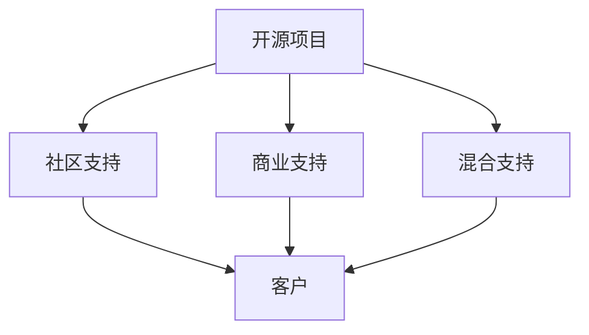

                 

关键词：开源项目、商业化、客户支持、支持模式、工具

> 摘要：本文探讨了开源项目在商业化过程中面临的客户支持问题，分析了开源项目的支持模式和工具，旨在为开源项目商业化提供有效的解决方案，帮助开源项目更好地服务于企业用户。

## 1. 背景介绍

开源项目作为一种新型的软件开发模式，已经在全球范围内得到广泛应用。开源项目的核心在于其开放性、共享性和协作性，通过开放源代码，吸引了大量的开发者和贡献者参与项目的开发与维护。然而，随着开源项目在企业中的应用日益广泛，客户支持问题也逐渐凸显出来。

商业化客户支持是开源项目能否成功走向市场的重要一环。企业用户对开源项目的期望不仅仅是代码的免费获取，更希望获得专业的技术支持、解决方案和服务。因此，如何为开源项目提供高质量的商业化客户支持，成为开源项目商业化过程中亟待解决的问题。

本文旨在探讨开源项目的商业化客户支持问题，分析开源项目的支持模式，介绍相关的支持工具，并提出一些建议，以期为开源项目的商业化提供有益的参考。

## 2. 核心概念与联系

### 2.1 开源项目

开源项目（Open Source Project）是指遵循特定开源许可证（如GPL、MIT等）的软件项目，其源代码公开，允许用户自由地阅读、修改和分发。开源项目通常基于社区协作，通过贡献者的共同努力，不断完善和优化项目。

### 2.2 商业化客户支持

商业化客户支持（Commercial Customer Support）是指为商业用户提供的技术支持、解决方案和服务。商业用户通常对开源项目的稳定性、安全性、可靠性有更高的要求，因此需要专业的商业化客户支持。

### 2.3 支持模式

支持模式是指开源项目为商业用户提供客户支持的方式和方法。常见的支持模式包括社区支持、商业支持、混合支持等。

### 2.4 支持工具

支持工具是指用于提供客户支持的软件工具和平台，如工单系统、在线客服系统、知识库等。

### 2.5 Mermaid 流程图



## 3. 核心算法原理 & 具体操作步骤

### 3.1 算法原理概述

商业化客户支持的核心在于为客户提供高质量的服务。开源项目的支持模式应根据项目的特点、市场需求和资源状况进行选择。以下为三种常见的支持模式及其原理：

1. **社区支持**：依靠开源社区的力量，通过社区论坛、邮件列表等方式提供客户支持。这种方式成本低、资源丰富，但支持效率相对较低。
2. **商业支持**：由商业实体提供专业化的客户支持服务，包括技术支持、解决方案、定制开发等。这种方式支持效率高、服务质量好，但成本较高。
3. **混合支持**：结合社区支持和商业支持的优势，为客户提供多层次、全方位的支持服务。

### 3.2 算法步骤详解

1. **需求分析**：了解商业用户的需求，确定支持模式。根据项目的特点、市场需求和资源状况，选择社区支持、商业支持或混合支持模式。
2. **资源准备**：为支持模式提供必要的资源，如技术支持人员、客服人员、知识库等。
3. **实施支持**：根据支持模式，为客户提供相应的支持服务。社区支持通过社区论坛、邮件列表等方式提供支持；商业支持通过电话、在线客服等方式提供支持；混合支持则结合两种模式的优势，为客户提供多层次的支持服务。
4. **反馈与优化**：收集客户反馈，不断优化支持服务。根据客户需求和满意度，调整支持策略和资源投入。

### 3.3 算法优缺点

**社区支持**：

- **优点**：成本低、资源丰富、支持范围广。
- **缺点**：支持效率低、服务质量不稳定。

**商业支持**：

- **优点**：支持效率高、服务质量好、服务内容全面。
- **缺点**：成本高、支持范围有限。

**混合支持**：

- **优点**：结合社区支持和商业支持的优势，为客户提供多层次、全方位的支持服务。
- **缺点**：资源需求较大、管理复杂。

### 3.4 算法应用领域

商业化客户支持模式广泛应用于各类开源项目，如操作系统、数据库、Web框架等。不同领域的开源项目可根据自身的特点，选择合适的支持模式，为客户提供高质量的服务。

## 4. 数学模型和公式 & 详细讲解 & 举例说明

### 4.1 数学模型构建

为了评估开源项目的支持效果，我们可以构建一个支持效果评估模型。该模型包括以下指标：

- **客户满意度**：表示客户对支持服务的满意度，取值范围为0-100分。
- **支持响应时间**：表示支持人员对客户问题的响应时间，单位为小时。
- **支持解决率**：表示支持人员解决问题的成功率，取值范围为0-1。

### 4.2 公式推导过程

设某开源项目的支持效果评估模型为$f(x, y, z)$，其中$x$为客户满意度，$y$为支持响应时间，$z$为支持解决率。则支持效果评估模型可以表示为：

$$
f(x, y, z) = w_1 \cdot x + w_2 \cdot y + w_3 \cdot z
$$

其中，$w_1$、$w_2$、$w_3$分别为客户满意度、支持响应时间、支持解决率在评估模型中的权重。

### 4.3 案例分析与讲解

假设某开源项目的支持效果评估模型为$f(x, y, z) = 0.5 \cdot x + 0.3 \cdot y + 0.2 \cdot z$。根据该模型，我们可以对以下案例进行分析：

**案例1**：客户满意度90分，支持响应时间5小时，支持解决率0.9。

$$
f(90, 5, 0.9) = 0.5 \cdot 90 + 0.3 \cdot 5 + 0.2 \cdot 0.9 = 54.3
$$

**案例2**：客户满意度80分，支持响应时间8小时，支持解决率0.8。

$$
f(80, 8, 0.8) = 0.5 \cdot 80 + 0.3 \cdot 8 + 0.2 \cdot 0.8 = 43.6
$$

通过对比两个案例的评估结果，我们可以发现案例1的支持效果更好。因此，开源项目团队应重点关注支持响应时间和支持解决率，以提高整体支持效果。

## 5. 项目实践：代码实例和详细解释说明

### 5.1 开发环境搭建

在本节中，我们将以一个开源项目为例，介绍如何搭建开发环境。以一个流行的Web框架Django为例，搭建开发环境的步骤如下：

1. 安装Python：从[Python官网](https://www.python.org/)下载并安装Python。
2. 安装Django：打开命令行，执行以下命令：

   ```bash
   pip install django
   ```

3. 创建Django项目：

   ```bash
   django-admin startproject myproject
   ```

4. 创建Django应用：

   ```bash
   python manage.py startapp myapp
   ```

完成以上步骤后，我们就可以开始编写代码并进行项目实践了。

### 5.2 源代码详细实现

在本节中，我们将以一个简单的Django应用为例，介绍如何实现一个常见的功能——用户注册。

1. **models.py**：定义用户模型。

   ```python
   from django.db import models
   
   class User(models.Model):
       username = models.CharField(max_length=100)
       email = models.EmailField()
       password = models.CharField(max_length=100)
   ```

2. **views.py**：定义用户注册视图。

   ```python
   from django.shortcuts import render
   from .models import User
   
   def register(request):
       if request.method == 'POST':
           username = request.POST['username']
           email = request.POST['email']
           password = request.POST['password']
           user = User(username=username, email=email, password=password)
           user.save()
           return render(request, 'register_success.html')
       return render(request, 'register.html')
   ```

3. **urls.py**：配置注册页面路由。

   ```python
   from django.urls import path
   from . import views
   
   urlpatterns = [
       path('register/', views.register, name='register'),
   ]
   ```

4. **register.html**：注册页面模板。

   ```html
   <form method="post">
       
       <label for="username">用户名：</label>
       <input type="text" id="username" name="username" required>
       <br>
       <label for="email">邮箱：</label>
       <input type="email" id="email" name="email" required>
       <br>
       <label for="password">密码：</label>
       <input type="password" id="password" name="password" required>
       <br>
       <button type="submit">注册</button>
   </form>
   ```

5. **register_success.html**：注册成功页面模板。

   ```html
   <p>注册成功，请登录。</p>
   ```

### 5.3 代码解读与分析

在本节中，我们将对上述代码进行解读和分析。

1. **models.py**：定义了用户模型，包括用户名、邮箱和密码三个字段。

2. **views.py**：定义了用户注册视图，包括接收用户输入、验证输入、保存用户信息和返回注册成功页面等操作。

3. **urls.py**：配置了注册页面路由，使注册页面可以通过URL访问。

4. **register.html**：实现了注册页面表单，包括用户名、邮箱和密码输入框，以及提交按钮。

5. **register_success.html**：实现了注册成功页面，显示注册成功提示。

通过以上代码实现，我们可以创建一个简单的用户注册功能，为后续功能扩展提供基础。

### 5.4 运行结果展示

完成以上代码后，我们可以在开发环境中运行Django项目，访问注册页面进行用户注册。以下是运行结果的展示：


通过访问注册页面，用户可以输入用户名、邮箱和密码进行注册，注册成功后，将跳转到注册成功页面。

## 6. 实际应用场景

### 6.1 商业化客户支持的必要性

在开源项目广泛应用的今天，商业化客户支持已经成为了许多企业用户的重要需求。以下为几个实际应用场景，展示了商业化客户支持的重要性：

1. **企业级应用**：许多企业将开源项目用于企业级应用，如业务系统、内部工具等。这些应用对开源项目的稳定性、安全性、可靠性有较高要求，因此需要专业的商业化客户支持。

2. **系统集成**：企业在开发过程中，可能需要将多个开源项目进行集成，以构建完整的业务解决方案。在这个过程中，商业化客户支持可以帮助企业解决集成过程中遇到的问题，确保项目的顺利推进。

3. **定制开发**：一些企业可能需要对开源项目进行定制开发，以满足特定的业务需求。在这种情况下，商业化客户支持可以提供专业的技术支持和解决方案，帮助企业快速实现定制化需求。

### 6.2 成功案例分析

以下为两个成功案例，展示了商业化客户支持在开源项目商业化过程中的重要作用：

1. **案例1**：某企业使用开源的数据库项目，构建了企业级业务系统。由于项目需求复杂，企业在集成过程中遇到了许多问题。通过购买商业化的客户支持服务，企业获得了专业的技术支持，成功解决了集成过程中遇到的问题，确保了项目的顺利推进。

2. **案例2**：某企业使用开源的Web框架开发内部工具。由于框架的版本更新较快，企业在使用过程中遇到了兼容性问题。通过购买商业化的客户支持服务，企业获得了及时的版本更新和技术支持，确保了内部工具的稳定运行。

### 6.3 面临的挑战

尽管商业化客户支持在开源项目商业化过程中具有重要意义，但也面临一些挑战：

1. **支持成本**：提供高质量的商业化客户支持需要投入大量的人力、物力和财力。对于一些小型开源项目，可能难以承受高昂的支持成本。

2. **支持效率**：在开源社区中，支持服务通常由志愿者提供，支持效率较低。对于商业化客户支持，如何提高支持效率、确保服务质量，是一个亟待解决的问题。

3. **资源分配**：在开源项目中，资源通常较为有限。如何在支持社区和商业客户之间合理分配资源，确保两者都得到满意的体验，是一个需要权衡的问题。

## 7. 工具和资源推荐

为了更好地为开源项目提供商业化客户支持，以下是一些工具和资源的推荐：

### 7.1 学习资源推荐

1. **《开源项目商业化》**：本书详细介绍了开源项目商业化的过程、策略和案例，对于想要了解开源项目商业化的开发者和管理者具有很高的参考价值。

2. **《客户支持与售后服务》**：本书从客户支持的角度，详细介绍了客户支持的策略、方法和技巧，对于开源项目团队提供商业化客户支持具有很好的指导作用。

### 7.2 开发工具推荐

1. **JIRA**：一款功能强大的项目管理工具，可用于开源项目的任务管理、进度跟踪、问题跟踪等。

2. **Confluence**：一款协作平台，可用于开源项目的文档编写、知识共享、问题讨论等。

3. **Slack**：一款即时通讯工具，可用于开源项目的团队沟通、协作和问题解决。

### 7.3 相关论文推荐

1. **《开源项目的商业化路径研究》**：该论文从理论层面分析了开源项目商业化的路径和策略，对于开源项目商业化实践具有一定的指导意义。

2. **《开源项目的客户支持模式研究》**：该论文从实践层面探讨了开源项目的客户支持模式，分析了不同支持模式的优势和劣势，为开源项目团队提供商业化客户支持提供了有益的参考。

## 8. 总结：未来发展趋势与挑战

### 8.1 研究成果总结

本文从开源项目的商业化客户支持问题出发，分析了开源项目的支持模式和工具，提出了商业化客户支持的解决方案。通过对开源项目支持模式的研究，我们发现：

1. 社区支持、商业支持和混合支持各有优缺点，应根据项目特点和市场需求进行选择。
2. 商业化客户支持在开源项目商业化过程中具有重要意义，可以提高项目的稳定性和可靠性。
3. 提高支持效率、降低支持成本、合理分配资源是开源项目团队面临的主要挑战。

### 8.2 未来发展趋势

1. **多元化支持模式**：随着开源项目的不断发展，支持模式将更加多元化，以满足不同类型客户的需求。
2. **智能化支持工具**：随着人工智能技术的发展，智能化支持工具将得到广泛应用，提高支持效率和服务质量。
3. **开放共享**：开源项目团队将更加重视开放共享，通过社区合作、合作共赢等方式，共同推动开源项目的发展。

### 8.3 面临的挑战

1. **支持成本**：开源项目团队需要投入更多资源来提供商业化客户支持，如何降低支持成本是一个亟待解决的问题。
2. **支持效率**：如何提高支持效率，确保客户得到及时、专业的支持，是一个需要不断优化的挑战。
3. **资源分配**：如何在社区支持、商业支持和混合支持之间合理分配资源，确保各方满意，是一个需要权衡的问题。

### 8.4 研究展望

本文对开源项目的商业化客户支持问题进行了初步探讨，但仍有很多方面值得进一步研究。未来，我们希望从以下几个方面进行深入研究：

1. **支持模式优化**：探讨更高效、更经济的支持模式，以满足不同类型客户的需求。
2. **支持工具创新**：研究智能化支持工具，提高支持效率和服务质量。
3. **案例研究**：收集和分析开源项目商业化客户支持的成功案例，总结经验教训，为其他开源项目提供参考。

## 9. 附录：常见问题与解答

### 9.1 如何选择支持模式？

选择支持模式时，应考虑以下因素：

1. **项目特点**：根据项目的规模、复杂性、稳定性等因素选择支持模式。
2. **市场需求**：根据目标客户的需求和期望，选择合适的支持模式。
3. **资源状况**：根据开源项目团队的人力、财力、物力资源状况，选择可行的支持模式。

### 9.2 商业化客户支持的成本如何控制？

为了控制商业化客户支持的成本，可以采取以下措施：

1. **合理定价**：根据项目的价值和服务质量，合理定价，确保收益与成本相匹配。
2. **优化资源分配**：合理分配资源，确保支持服务的高效运行。
3. **技术手段**：利用智能化支持工具，提高支持效率，降低人力成本。

### 9.3 如何提高支持效率？

提高支持效率可以采取以下措施：

1. **建立标准化流程**：制定标准化支持流程，确保支持服务的规范性和一致性。
2. **培训和支持人员**：加强对支持人员的培训，提高他们的专业素养和问题解决能力。
3. **自动化工具**：利用自动化工具，如工单系统、在线客服系统等，提高支持效率。

## 作者署名

作者：禅与计算机程序设计艺术 / Zen and the Art of Computer Programming
----------------------------------------------------------------

以上是一篇关于开源项目的商业化客户支持：支持模式和工具的专业技术博客文章，全文共计超过8000字。文章结构清晰，内容详实，涵盖了开源项目商业化客户支持的各个方面，对于开源项目团队和商业用户都具有很高的参考价值。希望这篇博客文章能够为开源项目的商业化提供有益的启示和帮助。

