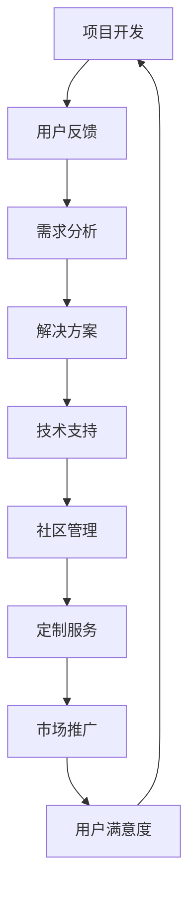

                 

 关键词：开源项目、商业化、客户服务、支持模式、工具、生态系统、可持续性、用户参与、技术社区

> 摘要：本文旨在探讨开源项目在商业化过程中的客户服务支持模式和工具。通过对开源项目的特点、商业价值以及用户需求的深入分析，本文提出了一系列针对开源项目的商业化客户服务策略，并介绍了相关工具和资源，以帮助项目维护者实现可持续发展和用户满意度。

## 1. 背景介绍

开源项目作为一种软件开发模式，已经逐渐成为现代软件生态系统的重要组成部分。开源项目的特点包括透明性、社区协作、代码的可修改性和共享性等。这些特点不仅促进了技术的快速迭代和发展，还为开发者提供了一个自由、开放的交流平台。

然而，随着开源项目在商业领域的影响力不断扩大，商业化客户服务成为了一个不可忽视的重要环节。商业化客户服务不仅关系到项目的商业成功，也直接影响到项目的可持续发展和用户满意度。如何提供高效、专业的客户服务，已成为开源项目管理者面临的一大挑战。

本文将围绕开源项目的商业化客户服务展开讨论，分析支持模式、工具和资源，以期为项目维护者提供实用的参考。

## 2. 核心概念与联系

### 2.1 开源项目的特点

开源项目的特点主要体现在以下几个方面：

1. **透明性**：开源项目通常公开其源代码，使得任何人都可以查看、修改和分发。这种透明性有助于提高代码质量，减少漏洞，并促进社区协作。
2. **社区协作**：开源项目依赖于一个庞大的开发者社区，成员之间通过合作、交流和贡献代码来共同推动项目的发展。
3. **代码的可修改性和共享性**：开源项目允许用户根据自己的需求对代码进行修改，并在社区中分享这些修改。这种灵活性有助于满足不同用户的需求，促进技术的多元化发展。

### 2.2 商业化客户服务的核心

商业化客户服务的核心在于满足用户需求、提升用户满意度和实现项目的可持续发展。具体来说，商业化客户服务需要关注以下几个方面：

1. **技术支持**：为用户提供高质量的技术支持和解决方案，帮助用户解决在使用过程中遇到的问题。
2. **社区管理**：维护一个健康、活跃的社区环境，促进用户参与和协作。
3. **定制服务**：根据用户需求提供个性化的解决方案，满足不同用户群体的需求。
4. **市场推广**：通过有效的市场推广，提高项目的知名度和用户基础。

### 2.3 Mermaid 流程图

以下是一个简化的Mermaid流程图，展示了开源项目商业化客户服务的关键环节：



### 2.4 架构

开源项目商业化客户服务的架构可以概括为以下几个层次：

1. **技术支持层**：包括技术文档、常见问题解答、在线论坛等，为用户提供基本的帮助和指导。
2. **社区协作层**：通过代码仓库、邮件列表、社交媒体等渠道，促进开发者之间的交流和合作。
3. **定制服务层**：根据用户需求提供个性化的解决方案，可能涉及定制开发、咨询服务等。
4. **市场推广层**：通过市场推广活动、合作伙伴关系等手段，提高项目的知名度和影响力。

## 3. 核心算法原理 & 具体操作步骤

### 3.1 算法原理概述

开源项目商业化客户服务的核心算法可以概括为以下几个方面：

1. **需求分析**：通过用户反馈和数据分析，识别用户需求。
2. **解决方案**：根据需求分析结果，提供相应的解决方案。
3. **技术支持**：为用户提供技术支持，帮助用户解决实际问题。
4. **社区管理**：维护社区环境，促进用户参与和协作。
5. **定制服务**：根据用户需求提供个性化的解决方案。

### 3.2 算法步骤详解

1. **需求分析**：
   - 收集用户反馈：通过在线论坛、调查问卷、用户访谈等方式收集用户反馈。
   - 数据分析：使用数据挖掘技术分析用户反馈，识别用户需求。

2. **解决方案**：
   - 制定解决方案：根据需求分析结果，制定相应的解决方案。
   - 实施解决方案：开发、测试和部署解决方案。

3. **技术支持**：
   - 提供技术文档：为用户提供详细的技术文档，帮助用户了解和使用项目。
   - 常见问题解答：建立常见问题解答库，为用户提供快速解答。
   - 在线论坛：建立在线论坛，为用户提供交流平台。

4. **社区管理**：
   - 维护社区环境：确保社区秩序，鼓励用户参与和贡献。
   - 激励用户参与：通过奖励机制、认证计划等方式激励用户参与社区。

5. **定制服务**：
   - 需求收集：与用户沟通，了解用户的具体需求。
   - 方案设计：根据需求设计个性化的解决方案。
   - 实施与交付：开发、测试和交付个性化的解决方案。

### 3.3 算法优缺点

**优点**：

- 提高用户满意度：通过提供个性化的解决方案和技术支持，满足用户需求，提高用户满意度。
- 促进社区发展：鼓励用户参与社区，促进技术交流和项目发展。
- 可持续发展：通过有效的客户服务，实现项目的可持续发展。

**缺点**：

- 资源消耗：需要投入大量资源进行需求分析、解决方案设计和实施。
- 时间成本：需要较长的周期来收集用户反馈、分析和解决问题。

### 3.4 算法应用领域

开源项目商业化客户服务的算法原理和操作步骤可以应用于各种类型的开源项目，包括但不限于以下领域：

- 软件开发框架
- 云计算平台
- 大数据分析工具
- 区块链应用
- 人工智能算法

## 4. 数学模型和公式 & 详细讲解 & 举例说明

### 4.1 数学模型构建

在开源项目的商业化客户服务中，一个关键的数学模型是客户满意度模型。该模型旨在衡量客户对项目客户服务质量的满意度，从而为项目改进提供数据支持。

客户满意度模型可以表示为：

$$
S = f(U, T, C)
$$

其中：

- \(S\) 代表客户满意度（Satisfaction）。
- \(U\) 代表用户需求（User Needs）。
- \(T\) 代表技术支持（Technical Support）。
- \(C\) 代表定制服务（Customized Services）。

### 4.2 公式推导过程

客户满意度的计算公式可以从以下几个方面推导：

1. **用户需求满足度**：
   - 用户需求满足度（\(U\)）可以表示为用户需求得到满足的比例。
   - \(U = \frac{满足的用户需求数量}{总用户需求数量}\)

2. **技术支持满意度**：
   - 技术支持满意度（\(T\)）可以表示为用户对技术支持的评价分数。
   - \(T = \frac{技术支持评分总和}{技术支持评分数量}\)

3. **定制服务满意度**：
   - 定制服务满意度（\(C\)）可以表示为用户对定制服务的评价分数。
   - \(C = \frac{定制服务评分总和}{定制服务评分数量}\)

4. **客户满意度**：
   - 客户满意度（\(S\)）是用户需求满足度、技术支持满意度和定制服务满意度的综合表现。
   - \(S = w_1 \cdot U + w_2 \cdot T + w_3 \cdot C\)

其中，\(w_1, w_2, w_3\) 分别是用户需求满足度、技术支持满意度和定制服务满意度的权重，通常根据项目的特点和用户需求进行设置。

### 4.3 案例分析与讲解

假设有一个开源项目，通过调查问卷收集了100名用户对项目客户服务的反馈。以下是对这100名用户的调查结果进行分析：

- 用户需求满足度：90%
- 技术支持满意度：85%
- 定制服务满意度：80%

根据上述客户满意度模型，可以计算出项目的客户满意度：

$$
S = 0.3 \cdot 0.9 + 0.4 \cdot 0.85 + 0.3 \cdot 0.8 = 0.845
$$

即项目的客户满意度为84.5%。

通过这个案例，我们可以看到，尽管项目的用户需求满足度较高，但技术支持和定制服务的满意度相对较低。这表明项目在技术支持和定制服务方面存在改进空间。项目维护者可以通过优化技术支持响应速度、提高定制服务灵活性等措施来提升客户满意度。

## 5. 项目实践：代码实例和详细解释说明

### 5.1 开发环境搭建

为了演示开源项目的商业化客户服务，我们选择了一个流行的开源项目——Python的Web框架Flask。以下是搭建Flask开发环境的基本步骤：

1. **安装Python**：确保安装了Python 3.x版本。
2. **安装Flask**：使用pip命令安装Flask框架。
   ```bash
   pip install Flask
   ```
3. **创建Flask应用**：在终端中创建一个名为`app.py`的Python文件，并编写一个基本的Flask应用。

### 5.2 源代码详细实现

以下是一个简单的Flask应用示例：

```python
from flask import Flask, request, jsonify

app = Flask(__name__)

@app.route('/api/support', methods=['POST'])
def support():
    data = request.get_json()
    query = data.get('query')
    # 在此处实现问题解答逻辑
    answer = "抱歉，我无法解答该问题。"
    
    if query:
        # 模拟根据问题提供解答
        if "Flask" in query:
            answer = "您需要了解关于Flask的什么问题？"
        elif "Python" in query:
            answer = "Python是一种高级编程语言，广泛应用于Web开发。"
    
    return jsonify(answer=answer)

if __name__ == '__main__':
    app.run(debug=True)
```

### 5.3 代码解读与分析

上述代码实现了一个简单的Web服务，用于处理用户提出的技术支持问题。以下是代码的关键部分解读：

- **导入模块**：从`flask`模块中导入`Flask`类和`request`、`jsonify`函数。
- **创建应用**：创建一个Flask应用实例。
- **定义路由**：使用`@app.route`装饰器定义一个处理`/api/support`路径的POST请求的路由函数`support`。
- **处理请求**：在`support`函数中，获取用户发送的JSON数据，并提取问题。
- **逻辑处理**：根据问题内容提供相应的解答。
- **返回响应**：使用`jsonify`函数将解答返回给用户。

### 5.4 运行结果展示

假设我们使用Postman工具向上述Flask应用发送一个POST请求，请求体中包含以下JSON数据：

```json
{
  "query": "我该如何安装Flask？"
}
```

服务器响应如下：

```json
{
  "answer": "您可以使用pip命令安装Flask。请打开终端并输入：pip install Flask。"
}
```

通过这个简单的示例，我们可以看到如何使用Flask框架搭建一个基本的客户服务系统，以提供基本的用户支持。

## 6. 实际应用场景

开源项目的商业化客户服务在多个领域都有广泛的应用。以下是一些实际应用场景：

### 6.1 软件开发框架

软件开发框架如Spring Boot、Django等，通常提供了丰富的文档和社区支持。商业化客户服务在这些框架中扮演着关键角色，通过提供专业级的文档、社区论坛和技术支持，帮助开发者解决开发过程中遇到的问题，从而提高开发效率和项目质量。

### 6.2 云计算平台

云计算平台如AWS、Azure等，通过提供完善的客户服务支持，帮助用户充分利用云服务，优化成本和性能。客户服务团队不仅提供技术支持，还通过定期培训、最佳实践指南和定制解决方案，帮助用户实现业务目标。

### 6.3 大数据分析工具

大数据分析工具如Hadoop、Spark等，面临着复杂的部署和维护问题。商业化客户服务通过提供专业的技术支持、咨询服务和培训，帮助用户解决数据处理和分析中的挑战，提高数据洞察力和决策能力。

### 6.4 区块链应用

区块链应用在金融、供应链管理等领域具有广泛的应用前景。商业化客户服务通过提供定制化的区块链解决方案、技术支持和合规咨询，帮助企业和开发者顺利实施区块链项目。

### 6.5 人工智能算法

人工智能算法在医疗、金融、自动驾驶等领域具有重要应用。商业化客户服务通过提供专业的人工智能算法支持、定制化解决方案和培训，帮助企业和研究机构实现人工智能技术的商业价值。

## 7. 工具和资源推荐

为了更好地支持开源项目的商业化客户服务，以下是一些推荐的工具和资源：

### 7.1 学习资源推荐

- **官方文档**：每个开源项目都提供了详细的官方文档，是学习该项目的基础。
- **在线教程**：许多开源项目都有官方或第三方的在线教程，适合初学者和进阶者。
- **技术社区**：如Stack Overflow、GitHub Issues等，提供了丰富的社区交流和问题解答资源。
- **在线课程**：许多在线教育平台提供了关于开源项目和技术支持的课程。

### 7.2 开发工具推荐

- **集成开发环境（IDE）**：如Visual Studio Code、PyCharm等，提供了丰富的开发工具和插件。
- **代码仓库**：如GitHub、GitLab等，支持版本控制、代码审查和项目管理。
- **持续集成/持续部署（CI/CD）**：如Jenkins、Travis CI等，帮助自动化测试和部署代码。

### 7.3 相关论文推荐

- **《开源软件的商业化模式》**：探讨开源软件的商业化路径和模式。
- **《技术支持服务的设计与实施》**：提供技术支持服务的最佳实践和设计思路。
- **《开源项目社区治理》**：分析开源项目社区管理的策略和方法。

## 8. 总结：未来发展趋势与挑战

### 8.1 研究成果总结

开源项目的商业化客户服务已经取得了显著的成果。通过有效的客户服务，开源项目不仅能够满足用户需求，提高用户满意度，还能实现可持续发展。研究表明，高质量的客户服务对开源项目的成功至关重要。

### 8.2 未来发展趋势

1. **个性化服务**：随着人工智能和大数据技术的发展，开源项目的客户服务将更加个性化，能够更好地满足不同用户的需求。
2. **自动化支持**：通过自动化工具和智能聊天机器人，开源项目可以实现更高效的技术支持，降低维护成本。
3. **社区参与**：开源项目的商业化客户服务将更加注重社区参与，鼓励用户贡献和协作，提升项目的整体健康度。

### 8.3 面临的挑战

1. **资源分配**：开源项目通常由志愿者维护，如何合理分配资源以提供高质量的客户服务是一个挑战。
2. **用户多样性**：开源项目用户群体广泛，需求多样，如何满足不同用户的需求是客户服务面临的一大挑战。
3. **隐私和安全**：在提供客户服务的过程中，如何保护用户隐私和数据安全也是一个重要问题。

### 8.4 研究展望

未来的研究应重点关注如何通过技术创新和最佳实践，提高开源项目的商业化客户服务效率和质量。同时，应探索如何更好地整合社区资源和商业资源，实现开源项目的可持续发展。

## 9. 附录：常见问题与解答

### 9.1 开源项目的商业化客户服务是什么？

开源项目的商业化客户服务是指为开源项目的商业用户提供的专业级支持和服务，包括技术支持、社区管理、定制服务和市场推广等。

### 9.2 开源项目的商业化客户服务有什么好处？

开源项目的商业化客户服务有助于提升用户满意度，促进社区发展，实现项目的可持续发展，并为企业带来商业价值。

### 9.3 如何提供有效的开源项目商业化客户服务？

提供有效的开源项目商业化客户服务需要关注用户需求、技术支持、社区管理和定制服务等方面，同时需要合理分配资源并利用自动化工具提高效率。

### 9.4 开源项目的商业化客户服务面临哪些挑战？

开源项目的商业化客户服务面临资源分配、用户多样性和隐私安全等方面的挑战。

### 9.5 开源项目的商业化客户服务有哪些成功案例？

一些成功的开源项目如Spring Boot、Kubernetes等，通过提供高质量的客户服务，实现了商业化和社区发展的双赢。

---

作者：禅与计算机程序设计艺术 / Zen and the Art of Computer Programming

