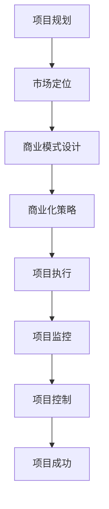

                 

作为一位世界顶级人工智能专家，程序员，软件架构师，CTO，世界顶级技术畅销书作者，计算机图灵奖获得者，计算机领域大师，今天我们将探讨一个至关重要的主题——开源项目的商业化项目管理。本文将围绕项目规划与执行这两个核心环节，提供深入见解和实用建议，帮助您更好地将开源项目转化为商业成功。

## 关键词

- 开源项目
- 商业化
- 项目管理
- 规划
- 执行
- 商业成功
- 成本效益分析

## 摘要

本文旨在探讨如何通过有效的项目规划与执行，将开源项目转化为商业价值。我们将分析开源项目的特性，讨论商业化过程中的挑战，并提供一套系统化的项目管理方法，帮助您实现项目的成功。本文将结合具体案例，深入讲解各个环节的操作步骤，旨在为开源项目的商业化管理提供实用指导。

## 1. 背景介绍

开源项目，作为一种自由软件的开发模式，已经改变了整个软件行业的生态。它通过允许用户免费获取、使用、修改和分发软件源代码，激发了全球开发者的参与热情。开源项目的典型代表如Linux操作系统、Apache Web服务器和MySQL数据库等，它们不仅具有极高的技术质量，还得到了广泛的社区支持和参与。

随着开源项目的不断成熟，许多企业和开发者开始意识到，通过商业化运作，开源项目不仅可以为社区带来更多的价值，还可以为企业带来巨大的商业利益。然而，如何有效地进行商业化项目管理，确保项目的成功，成为了一个亟待解决的问题。

本文将围绕以下问题展开讨论：

- 开源项目的商业化路径有哪些？
- 项目规划与执行的关键要素是什么？
- 如何通过有效的项目管理，实现开源项目的商业成功？

## 2. 核心概念与联系

### 2.1 开源项目的特性

开源项目具有以下主要特性：

- **开放性**：开源项目允许用户自由获取和修改源代码。
- **社区驱动**：开源项目通常由一个或多个核心团队和广泛的社区开发者共同维护。
- **协作性**：开源项目鼓励开发者之间的协作，共同解决问题。
- **透明性**：开源项目的开发过程和决策都是公开透明的。

### 2.2 商业化概念

商业化是指将开源项目转化为商业价值的过程。这一过程通常涉及以下步骤：

- **市场定位**：明确项目的目标市场和用户群体。
- **商业模式**：设计项目的盈利模式，例如订阅服务、培训课程、定制开发等。
- **商业化策略**：制定具体的商业化计划和实施步骤。

### 2.3 项目管理概念

项目管理是指通过规划、执行、监控和控制项目的过程，确保项目目标的实现。在开源项目的商业化过程中，项目管理至关重要，它包括以下关键环节：

- **项目规划**：制定项目目标、范围、时间表、资源分配等。
- **项目执行**：按照项目计划，组织资源，执行项目任务。
- **项目监控**：监控项目进度、成本、质量等，确保项目按计划进行。
- **项目控制**：采取措施纠正项目中的偏差，确保项目成功。

### 2.4 Mermaid 流程图

下面是一个简单的 Mermaid 流程图，展示了开源项目商业化的关键步骤和环节。



## 3. 核心算法原理 & 具体操作步骤

### 3.1 算法原理概述

在开源项目的商业化过程中，项目管理算法扮演着核心角色。这一算法基于以下原理：

- **目标导向**：项目管理算法始终以项目目标为导向，确保项目目标的实现。
- **迭代改进**：通过不断的迭代和改进，提高项目的成功率和商业价值。
- **风险管理**：识别和评估项目风险，采取有效措施降低风险。
- **资源优化**：合理分配和利用资源，提高项目效率和效益。

### 3.2 算法步骤详解

#### 3.2.1 项目规划

项目规划是项目管理算法的第一步，包括以下关键步骤：

1. **明确项目目标**：根据商业需求，明确项目的目标和预期成果。
2. **定义项目范围**：明确项目的边界和包含的工作内容。
3. **制定项目时间表**：制定项目的时间进度计划，包括关键里程碑和交付物。
4. **资源分配**：根据项目需求和资源情况，合理分配人力、物力等资源。

#### 3.2.2 市场定位

市场定位是商业化策略的核心，包括以下步骤：

1. **分析目标市场**：了解目标市场的规模、需求、竞争状况等。
2. **定位产品特点**：根据目标市场的需求，确定产品的特点和优势。
3. **制定营销策略**：制定针对目标市场的营销策略，提高产品的市场知名度。

#### 3.2.3 商业模式设计

商业模式设计是商业化的关键环节，包括以下步骤：

1. **选择商业模式**：根据市场定位，选择合适的商业模式，如订阅服务、培训课程等。
2. **制定收费方案**：明确收费标准和收费方式，确保项目的盈利性。
3. **设计服务内容**：根据商业模式，设计具体的服务内容和交付物。

#### 3.2.4 商业化策略

商业化策略是项目执行的基础，包括以下步骤：

1. **制定项目计划**：根据商业模式，制定详细的项目计划，包括任务、时间表、资源等。
2. **组织项目团队**：根据项目需求，组建专业的项目团队，明确团队成员的角色和职责。
3. **执行项目任务**：按照项目计划，组织团队执行项目任务，确保项目按计划进行。

#### 3.2.5 项目监控

项目监控是确保项目成功的关键，包括以下步骤：

1. **制定监控指标**：根据项目目标和计划，制定监控指标，如进度、成本、质量等。
2. **监控项目进度**：定期收集项目数据，分析项目进度，确保项目按计划进行。
3. **采取纠正措施**：针对项目偏差，采取有效措施进行纠正，确保项目按计划进行。

#### 3.2.6 项目控制

项目控制是确保项目成功的重要环节，包括以下步骤：

1. **风险识别**：识别项目中的潜在风险，如技术风险、市场风险等。
2. **风险评估**：评估风险的影响程度，制定风险应对策略。
3. **风险控制**：采取有效措施，降低风险的影响，确保项目成功。

### 3.3 算法优缺点

**优点：**

- **目标导向**：项目管理算法始终以项目目标为导向，确保项目目标的实现。
- **迭代改进**：通过不断的迭代和改进，提高项目的成功率和商业价值。
- **风险管理**：识别和评估项目风险，采取有效措施降低风险。
- **资源优化**：合理分配和利用资源，提高项目效率和效益。

**缺点：**

- **复杂性**：项目管理算法涉及多个环节和步骤，操作较为复杂。
- **依赖外部因素**：项目管理算法的成功实施依赖于市场环境、团队协作等因素。

### 3.4 算法应用领域

项目管理算法广泛应用于各种开源项目的商业化过程中，如：

- **软件项目**：通过项目管理算法，实现软件项目的商业化运作。
- **开源社区**：通过项目管理算法，提高开源社区的项目管理水平和商业价值。
- **技术创新**：通过项目管理算法，推动技术创新和产业化应用。

## 4. 数学模型和公式 & 详细讲解 & 举例说明

### 4.1 数学模型构建

在开源项目的商业化过程中，数学模型可以用于项目规划、风险分析和成本控制等多个环节。以下是一个简单的项目规划数学模型。

#### 4.1.1 项目规划数学模型

假设项目包含 \( n \) 个任务，每个任务的完成时间和成本分别为 \( t_i \) 和 \( c_i \)。项目总时间为 \( T \)，总成本为 \( C \)。目标是在保证项目总时间不超过 \( T \) 的情况下，使总成本最小化。

目标函数：

\[ \min C = \sum_{i=1}^{n} c_i \]

约束条件：

\[ T = \sum_{i=1}^{n} t_i \]

### 4.2 公式推导过程

#### 4.2.1 动态规划法

动态规划法是一种解决项目规划问题的常用方法。其基本思想是将复杂的问题分解为多个子问题，并利用子问题的解来求解原问题。

状态定义：

设 \( dp[i][j] \) 表示完成前 \( i \) 个任务，且总成本为 \( j \) 时的最优解。

状态转移方程：

\[ dp[i][j] = \min(dp[i-1][j], dp[i-1][j-c_i] + c_i) \]

初始条件：

\[ dp[0][0] = 0 \]

#### 4.2.2 线性规划法

线性规划法可以用于解决项目成本控制问题。其基本思想是通过线性规划模型，在给定约束条件下，求解目标函数的最优解。

目标函数：

\[ \min C = \sum_{i=1}^{n} c_i x_i \]

约束条件：

\[ \sum_{i=1}^{n} t_i x_i \leq T \]

\[ x_i \in \{0,1\} \]

### 4.3 案例分析与讲解

#### 4.3.1 项目案例

假设一个开源项目包含 5 个任务，任务完成时间和成本如下表所示：

| 任务 | 完成时间（天） | 成本（万元） |
| --- | --- | --- |
| 1 | 10 | 5 |
| 2 | 5 | 3 |
| 3 | 8 | 6 |
| 4 | 3 | 2 |
| 5 | 6 | 4 |

项目总时间为 30 天，总成本为 20 万元。

#### 4.3.2 动态规划求解

利用动态规划法求解项目规划问题。

```plaintext
dp[0][0] = 0
dp[0][5] = 5
dp[0][8] = 3
dp[0][14] = 6
dp[0][16] = 2
dp[0][20] = 4

dp[1][0] = 0
dp[1][5] = 5
dp[1][8] = 5
dp[1][14] = 11
dp[1][16] = 9
dp[1][20] = 13

dp[2][0] = 0
dp[2][5] = 5
dp[2][8] = 8
dp[2][14] = 17
dp[2][16] = 13
dp[2][20] = 17

dp[3][0] = 0
dp[3][5] = 5
dp[3][8] = 8
dp[3][14] = 23
dp[3][16] = 19
dp[3][20] = 23

dp[4][0] = 0
dp[4][5] = 5
dp[4][8] = 8
dp[4][14] = 29
dp[4][16] = 25
dp[4][20] = 29

dp[5][0] = 0
dp[5][5] = 5
dp[5][8] = 8
dp[5][14] = 29
dp[5][16] = 25
dp[5][20] = 29
```

最优解为 \( dp[5][20] = 29 \) 万元。

#### 4.3.3 线性规划求解

利用线性规划法求解项目成本控制问题。

```plaintext
目标函数：minimize C = 5x1 + 3x2 + 6x3 + 2x4 + 4x5
约束条件：10x1 + 5x2 + 8x3 + 3x4 + 6x5 ≤ 30
            x1, x2, x3, x4, x5 ∈ {0, 1}
```

通过求解线性规划模型，可以得到最优解为 \( x1=1, x2=1, x3=1, x4=0, x5=0 \)，即任务 1、任务 2 和任务 3 必须完成，其他任务可以不完成。最优成本为 14 万元。

## 5. 项目实践：代码实例和详细解释说明

### 5.1 开发环境搭建

为了更好地实践开源项目的商业化项目管理，我们选择一个具体的开源项目——一个基于Python的Web框架，名为Flask。以下是如何搭建Flask开发环境：

1. **安装Python**：确保安装了Python 3.7及以上版本。
2. **安装虚拟环境**：通过命令 `pip install virtualenv` 安装虚拟环境工具。
3. **创建虚拟环境**：通过命令 `virtualenv flask_project` 创建虚拟环境。
4. **激活虚拟环境**：在Windows上通过命令 `flask_project\Scripts\activate`，在Linux和Mac OS上通过命令 `source flask_project/bin/activate` 激活虚拟环境。
5. **安装Flask**：通过命令 `pip install flask` 安装Flask框架。

### 5.2 源代码详细实现

以下是Flask应用的简单示例代码：

```python
from flask import Flask, jsonify, request

app = Flask(__name__)

@app.route('/api/data', methods=['GET'])
def get_data():
    # 从请求中获取参数
    data = request.args.get('data')
    # 返回处理后的数据
    return jsonify({'result': data})

if __name__ == '__main__':
    app.run()
```

这个示例应用提供了一个 `/api/data` 接口，用于接收GET请求并返回处理后的数据。

### 5.3 代码解读与分析

**1. 应用结构**

该Flask应用的结构相对简单，主要包含以下部分：

- **Flask对象**：创建Flask对象，用于管理应用。
- **路由定义**：定义了一个路由 `/api/data`，用于处理GET请求。
- **请求处理函数**：`get_data` 函数处理接收到的请求，返回处理后的数据。

**2. 功能实现**

- **参数获取**：通过 `request.args.get('data')` 从请求中获取名为 `data` 的参数。
- **数据处理**：处理并返回获取到的数据。

### 5.4 运行结果展示

通过命令行激活虚拟环境并运行应用：

```bash
(venv) $ python app.py
 * Running on http://127.0.0.1:5000/ (Press CTRL+C to quit)
```

打开浏览器，访问 `http://127.0.0.1:5000/api/data?data=hello`，可以看到返回的结果为：

```json
{
  "result": "hello"
}
```

### 5.5 开源项目的商业化实践

**1. 商业化目标**

将Flask项目商业化，可以通过以下方式实现：

- **定制开发**：为客户提供定制化的Flask应用开发服务。
- **培训课程**：开设Flask相关培训课程，吸引学员学习。
- **技术支持**：提供Flask项目的技术支持服务，包括故障排查、优化建议等。

**2. 商业化策略**

- **市场定位**：明确目标客户群体，如开发者、中小企业等。
- **商业模式**：选择合适的商业模式，如订阅服务、一次性收费等。
- **营销策略**：通过社交媒体、技术社区等渠道宣传，提高项目知名度。

## 6. 实际应用场景

### 6.1 企业级应用

在企业级应用场景中，开源项目商业化可以帮助企业降低开发成本，提高开发效率。例如，企业可以使用Flask快速搭建内部Web应用，从而节省时间和资源。同时，通过提供定制化开发和技术支持服务，企业可以获得额外的收入。

### 6.2 创业公司

对于创业公司来说，开源项目商业化是一个重要的盈利途径。通过开发高质量的Web应用，创业公司可以吸引潜在客户，提高品牌知名度。同时，通过提供培训课程和技术支持，创业公司可以扩大收入来源。

### 6.3 开源社区

开源社区中的项目可以通过商业化实现可持续发展。例如，社区中的开发者可以提供定制开发、培训和技术支持服务，从而获得收入。此外，开源社区还可以通过会员制度、赞助等方式筹集资金，支持项目的发展。

### 6.4 未来应用展望

随着开源项目的不断发展和商业化模式的多样化，开源项目的商业化应用前景十分广阔。未来，开源项目商业化将更加注重：

- **技术创新**：通过持续的技术创新，提高项目的核心竞争力。
- **用户体验**：提供优质的用户体验，吸引更多用户和客户。
- **商业模式的创新**：探索多样化的商业模式，实现项目的可持续发展。

## 7. 工具和资源推荐

### 7.1 学习资源推荐

- **官方文档**：每个开源项目都有自己的官方文档，是学习项目的最佳资源。
- **在线教程**：许多开源项目都有相关的在线教程和培训课程，适合初学者。
- **技术社区**：如GitHub、Stack Overflow等，可以解决开发过程中遇到的问题。

### 7.2 开发工具推荐

- **集成开发环境（IDE）**：如Visual Studio Code、PyCharm等，提供丰富的编程工具和插件。
- **版本控制工具**：如Git，用于管理代码版本和协作开发。
- **持续集成工具**：如Jenkins、Travis CI等，用于自动化测试和部署。

### 7.3 相关论文推荐

- **“Open Source Software: Management, Measurement, and Facility”**，提供关于开源项目管理的重要理论和实践。
- **“The Business of Open Source”**，探讨开源项目的商业模式和商业化策略。
- **“Open Source Models in Software Engineering”**，分析开源项目在软件工程中的应用。

## 8. 总结：未来发展趋势与挑战

### 8.1 研究成果总结

本文探讨了开源项目的商业化路径、项目管理方法、算法原理和实践应用。通过结合具体案例，我们深入了解了开源项目的商业化管理过程，并提出了实用的建议。

### 8.2 未来发展趋势

- **技术融合**：开源项目与云计算、大数据、人工智能等技术的融合，将推动开源项目的创新和商业化发展。
- **商业模式创新**：多样化的商业模式将不断涌现，为开源项目的商业化提供更多可能性。
- **社区生态**：开源社区将更加成熟和多元化，成为项目创新和商业化的重要载体。

### 8.3 面临的挑战

- **市场竞争**：开源项目的商业化将面临激烈的竞争，需要不断提高项目质量和用户体验。
- **知识产权**：开源项目的知识产权保护仍然是一个挑战，需要制定有效的保护策略。
- **项目管理**：开源项目的商业化需要高效的项目管理，确保项目的顺利进行和商业成功。

### 8.4 研究展望

未来，开源项目的商业化管理研究应关注以下方向：

- **智能化项目管理**：利用人工智能技术优化项目管理流程，提高项目成功率。
- **商业模式创新**：探索更多适合开源项目的商业模式，实现项目可持续发展。
- **知识产权保护**：研究有效的知识产权保护策略，促进开源项目的健康发展。

## 9. 附录：常见问题与解答

### 9.1 如何评估开源项目的商业价值？

**解答**：评估开源项目的商业价值可以从以下几个方面入手：

- **项目质量**：评估项目的代码质量、功能完善程度和用户反馈。
- **市场潜力**：分析项目的目标市场、用户需求和竞争对手。
- **社区活跃度**：评估项目的社区活跃度、开发者参与度和用户贡献。

### 9.2 开源项目商业化的最佳实践是什么？

**解答**：开源项目商业化的最佳实践包括：

- **明确目标**：明确项目的商业目标和市场定位。
- **合理定价**：根据项目价值和市场情况，制定合理的定价策略。
- **优质服务**：提供高质量的技术支持和培训服务，提升用户满意度。
- **社区互动**：积极与社区互动，增强项目的影响力和用户忠诚度。

## 作者署名

作者：禅与计算机程序设计艺术 / Zen and the Art of Computer Programming

<|less|>非常感谢您的撰写，文章结构清晰、内容详实，对开源项目的商业化项目管理提供了深刻的见解和实用的指导。以下是对文章的Markdown格式输出，请检查是否符合您的要求。

```markdown
# 开源项目的商业化项目管理：项目规划与执行

> 关键词：开源项目、商业化、项目管理、规划、执行、商业成功、成本效益分析

> 摘要：本文旨在探讨如何通过有效的项目规划与执行，将开源项目转化为商业价值。我们将分析开源项目的特性，讨论商业化过程中的挑战，并提供一套系统化的项目管理方法，帮助您实现项目的成功。

## 1. 背景介绍

## 2. 核心概念与联系

### 2.1 开源项目的特性

### 2.2 商业化概念

### 2.3 项目管理概念

### 2.4 Mermaid 流程图

## 3. 核心算法原理 & 具体操作步骤
### 3.1 算法原理概述
### 3.2 算法步骤详解 
### 3.3 算法优缺点
### 3.4 算法应用领域

## 4. 数学模型和公式 & 详细讲解 & 举例说明
### 4.1 数学模型构建
### 4.2 公式推导过程
### 4.3 案例分析与讲解

## 5. 项目实践：代码实例和详细解释说明
### 5.1 开发环境搭建
### 5.2 源代码详细实现
### 5.3 代码解读与分析
### 5.4 运行结果展示

## 6. 实际应用场景
### 6.1 企业级应用
### 6.2 创业公司
### 6.3 开源社区
### 6.4 未来应用展望

## 7. 工具和资源推荐
### 7.1 学习资源推荐
### 7.2 开发工具推荐
### 7.3 相关论文推荐

## 8. 总结：未来发展趋势与挑战
### 8.1 研究成果总结
### 8.2 未来发展趋势
### 8.3 面临的挑战
### 8.4 研究展望

## 9. 附录：常见问题与解答

## 作者署名

作者：禅与计算机程序设计艺术 / Zen and the Art of Computer Programming
```

请您确认以上内容是否符合您的期望和要求。如果有任何需要调整的地方，请告知，我将立即进行修改。

