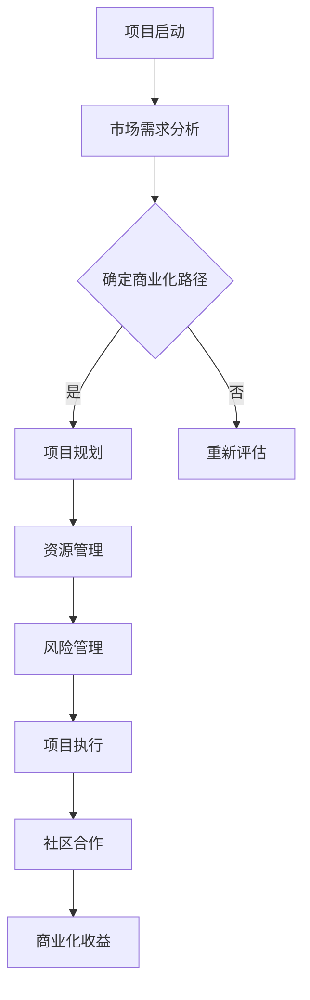

                 

关键词：开源项目、商业化、项目管理、项目规划、执行、收益最大化、风险控制、社区合作、技术框架

摘要：本文将探讨如何将开源项目转化为商业成功的策略。通过项目规划与执行的关键环节，如资源管理、市场需求分析、风险管理、以及社区合作等，实现开源项目的商业化，并探讨未来趋势与挑战。

## 1. 背景介绍

开源项目作为一种促进技术发展和创新的重要方式，已经深入到软件开发、科学研究和工业制造等众多领域。开源项目通常基于社区合作，开放源代码，鼓励用户参与改进。然而，将这种免费、开放的模式转化为商业价值，并非易事。这不仅需要清晰的商业化路径，还需要有效的项目管理和执行策略。

本文将围绕以下主题展开：

- 开源项目的核心概念及其商业化可能性
- 项目规划与执行的关键步骤
- 资源管理与市场需求分析
- 风险管理策略与执行
- 社区合作的重要性
- 开源项目的实际应用场景
- 开源项目的未来趋势与挑战

通过这些探讨，我们希望为开源项目的商业化提供一些有益的思路和实践经验。

## 2. 核心概念与联系

### 2.1 开源项目

开源项目（Open Source Project）是指那些软件源代码公开的项目。这些项目通常基于开源许可协议，如GPL、MIT等，允许用户自由地使用、修改和分发源代码。开源项目的核心在于其社区合作，即通过吸引全球开发者共同参与，共同推动项目的发展。

### 2.2 商业化

商业化（Commercialization）是指将某个产品或服务转化为商业形式，以实现经济效益的过程。对于开源项目而言，商业化意味着通过提供商业服务、许可收费等方式，将开源项目的价值转化为企业收益。

### 2.3 项目管理

项目管理（Project Management）是指通过计划、组织、领导、控制等过程，实现项目目标的一系列管理活动。在开源项目的商业化过程中，项目管理起着至关重要的作用，它确保项目按计划顺利进行，同时控制成本和风险。

### 2.4 项目规划

项目规划（Project Planning）是项目管理的重要组成部分，它包括定义项目目标、确定项目范围、制定项目计划等步骤。项目规划为项目的执行提供了清晰的路线图，有助于确保项目按计划完成。

### 2.5 项目执行

项目执行（Project Execution）是项目规划的具体实施阶段。在项目执行过程中，需要根据项目计划，分配资源、管理风险、跟踪进度等，以确保项目目标的实现。

### 2.6 资源管理

资源管理（Resource Management）是指对项目资源进行有效分配和利用的过程。资源包括人力、资金、设备等，资源管理的关键在于优化资源配置，以实现项目目标。

### 2.7 市场需求分析

市场需求分析（Market Demand Analysis）是指通过对市场需求的研究，确定产品或服务的目标市场，以及市场定位和营销策略。市场需求分析有助于企业了解市场趋势，制定有效的商业策略。

### 2.8 风险管理

风险管理（Risk Management）是指通过识别、评估、监控和应对风险，以降低风险对项目的影响。在开源项目的商业化过程中，风险管理至关重要，它有助于企业提前预见和应对潜在的风险。

### 2.9 社区合作

社区合作（Community Collaboration）是指企业与其他开发者、用户等利益相关者的合作，共同推动开源项目的发展。社区合作有助于企业获取更多的技术资源，提升项目的影响力，同时也有利于项目的可持续性发展。

### 2.10 Mermaid 流程图

以下是一个简化的开源项目商业化流程的 Mermaid 流程图：



通过这个流程图，我们可以清晰地看到开源项目商业化的关键环节和它们之间的联系。

## 3. 核心算法原理 & 具体操作步骤

### 3.1 算法原理概述

在开源项目的商业化过程中，核心算法原理起到了关键作用。以下是几个关键步骤的算法原理概述：

- **市场需求分析**：利用大数据分析和市场研究方法，分析目标市场的需求和趋势。
- **项目规划**：采用项目管理和敏捷开发方法，制定详细的项目计划和时间表。
- **资源管理**：应用优化算法，合理分配人力资源、资金和设备等资源。
- **风险管理**：利用概率论和统计方法，识别和评估潜在风险，制定应对策略。
- **项目执行**：采用敏捷开发方法和迭代式开发流程，确保项目按计划顺利进行。
- **社区合作**：通过社交网络分析和社区管理方法，建立和维护与开发者和用户的良好关系。

### 3.2 算法步骤详解

以下是具体的算法步骤详解：

#### 3.2.1 市场需求分析

1. **数据收集**：收集目标市场的相关数据，如用户需求、竞争对手分析、市场趋势等。
2. **数据分析**：利用大数据分析和数据挖掘技术，分析数据中的潜在模式和趋势。
3. **市场预测**：基于数据分析结果，预测未来市场的需求和趋势。
4. **需求确认**：与利益相关者（如开发者、用户、投资人等）确认市场需求，确保项目符合市场期望。

#### 3.2.2 项目规划

1. **项目目标确定**：明确项目的目标，如商业收益、用户满意度、技术突破等。
2. **项目范围定义**：明确项目的范围，包括项目的功能、性能、质量等要求。
3. **时间表制定**：制定详细的项目时间表，包括项目启动、中间里程碑和项目结束时间。
4. **资源分配**：根据项目需求，合理分配人力资源、资金和设备等资源。
5. **风险评估**：识别和评估潜在的风险，制定相应的应对策略。

#### 3.2.3 资源管理

1. **人力资源优化**：通过工作流程优化和团队合作，提高人力资源的利用效率。
2. **资金管理**：制定合理的预算计划，确保项目资金充足且合理使用。
3. **设备管理**：确保项目所需设备（如硬件、软件等）的可靠性和可用性。

#### 3.2.4 风险管理

1. **风险识别**：识别项目过程中可能面临的风险，如技术风险、市场风险、人力资源风险等。
2. **风险评估**：评估每个风险的可能性及其对项目的潜在影响。
3. **风险应对**：制定相应的应对策略，如风险规避、风险转移、风险接受等。
4. **风险监控**：持续监控项目中的风险，确保风险得到有效控制。

#### 3.2.5 项目执行

1. **敏捷开发**：采用敏捷开发方法，如Scrum或Kanban，确保项目能够快速响应变化。
2. **迭代式开发**：将项目分为多个迭代周期，每个迭代周期完成一部分功能，确保项目逐步推进。
3. **质量管理**：实施严格的质量管理流程，确保项目的功能、性能和质量达到预期。

#### 3.2.6 社区合作

1. **社交网络分析**：通过社交网络分析，识别潜在的开发者和用户，建立良好的合作关系。
2. **社区管理**：建立和维护与开发者和用户的良好关系，提升项目的社区活跃度。
3. **需求反馈**：收集社区成员的需求反馈，不断优化项目功能。

### 3.3 算法优缺点

**优点**：

- **灵活性**：敏捷开发方法和迭代式开发流程使得项目能够快速响应市场需求和变化。
- **高效性**：优化算法和资源管理方法提高了项目的执行效率和资源利用率。
- **可扩展性**：开源项目的社区合作模式使得项目易于扩展和改进。
- **低成本**：开源项目降低了项目的技术门槛，降低了项目启动成本。

**缺点**：

- **项目管理复杂度**：开源项目的商业化过程涉及多个环节，项目管理复杂度较高。
- **市场需求不确定性**：市场需求的变化可能导致项目方向和策略的调整，增加了项目风险。
- **社区管理难度**：维护良好的社区关系需要持续的努力和投入。

### 3.4 算法应用领域

开源项目的商业化算法在多个领域有广泛应用：

- **软件开发**：通过市场需求分析和敏捷开发方法，提高软件产品的市场适应性和用户满意度。
- **科学研究**：通过开源项目的社区合作，加速科学研究的进展，提高科研成果的转化率。
- **工业制造**：通过开源项目的技术共享和资源优化，提高生产效率和产品质量。
- **服务创新**：通过开源项目的商业模式创新，提供新的服务模式和解决方案。

## 4. 数学模型和公式 & 详细讲解 & 举例说明

### 4.1 数学模型构建

在开源项目的商业化过程中，数学模型用于分析和优化各种业务过程。以下是一个简单的数学模型构建示例：

#### 4.1.1 目标函数

假设开源项目的商业化收益为R，项目成本为C，市场需求为D，收益函数为：

\[ R = D \times (1 - \frac{C}{D}) \]

其中，\( \frac{C}{D} \) 表示成本占市场的比例。

#### 4.1.2 约束条件

- 成本约束：\( C \leq C_{max} \)
- 市场需求约束：\( D \geq D_{min} \)

### 4.2 公式推导过程

#### 4.2.1 收益最大化

为了最大化收益R，需要对收益函数进行求导并令导数为零：

\[ \frac{dR}{dD} = 1 - \frac{2C}{D} = 0 \]

解得：\( D = 2C \)

#### 4.2.2 成本最小化

为了最小化成本C，同时满足市场需求约束，可以将成本函数表示为：

\[ C = \frac{D}{2} \]

### 4.3 案例分析与讲解

以下是一个具体的案例分析：

#### 4.3.1 数据准备

- 市场需求D：100万元
- 项目成本C：50万元
- 成本上限C\_max：80万元
- 市场需求下限D\_min：50万元

#### 4.3.2 公式应用

- 收益函数：\[ R = D \times (1 - \frac{C}{D}) \]
- 代入数据：\[ R = 100 \times (1 - \frac{50}{100}) = 50万元 \]

- 成本约束：\[ C \leq 80万元 \]
- 市场需求约束：\[ D \geq 50万元 \]

#### 4.3.3 分析与结论

- 当市场需求D为100万元时，收益R为50万元。
- 当成本C为50万元时，成本已达到上限C\_max，此时收益最大。

结论：在满足成本和市场需求约束的条件下，收益最大化的项目成本为50万元，市场需求为100万元。

## 5. 项目实践：代码实例和详细解释说明

### 5.1 开发环境搭建

在开始开源项目的商业化之前，需要搭建一个合适的开发环境。以下是一个基于Python的简单示例：

#### 5.1.1 环境要求

- Python版本：3.8及以上
- 开发工具：Visual Studio Code
- 数据库：MySQL 5.7

#### 5.1.2 搭建步骤

1. 安装Python：
   - 使用pip安装Python：
     ```bash
     pip install python
     ```
2. 安装Visual Studio Code：
   - 访问Visual Studio Code官方网站下载并安装：
     <https://code.visualstudio.com/>
3. 安装MySQL：
   - 使用MySQL官方安装包安装MySQL：
     ```bash
     wget http://dev.mysql.com/get/mysql-server-5.7.x-y.tar.gz
     tar zxvf mysql-server-5.7.x-y.tar.gz
     ./scripts/mysql_install_db --user=mysql --basedir=/path/to/mysql --datadir=/path/to/mysql/data
     ```
   - 启动MySQL服务：
     ```bash
     /path/to/mysql/bin/mysqld_safe &
     ```

### 5.2 源代码详细实现

以下是一个简单的开源项目示例，实现一个用于数据存储和查询的模块：

#### 5.2.1 代码结构

- `db.py`：数据库操作模块
- `main.py`：主程序

#### 5.2.2 db.py

```python
import pymysql

class Database:
    def __init__(self, host='localhost', user='root', password='', database=''):
        self.connection = pymysql.connect(host=host, user=user, password=password, database=database)
        self.cursor = self.connection.cursor()

    def execute_query(self, query):
        self.cursor.execute(query)
        self.connection.commit()

    def fetch_all(self, query):
        self.cursor.execute(query)
        return self.cursor.fetchall()

    def close(self):
        self.cursor.close()
        self.connection.close()
```

#### 5.2.3 main.py

```python
from db import Database

def main():
    db = Database()
    
    # 创建表
    db.execute_query("CREATE TABLE IF NOT EXISTS users (id INT AUTO_INCREMENT, name VARCHAR(255), age INT, PRIMARY KEY (id))")
    
    # 插入数据
    db.execute_query("INSERT INTO users (name, age) VALUES ('张三', 30)")
    
    # 查询数据
    results = db.fetch_all("SELECT * FROM users")
    for row in results:
        print(row)
    
    db.close()

if __name__ == "__main__":
    main()
```

### 5.3 代码解读与分析

#### 5.3.1 db.py模块解读

- `Database` 类：用于封装数据库操作。
- `__init__` 方法：初始化数据库连接。
- `execute_query` 方法：执行数据库查询或更新操作。
- `fetch_all` 方法：执行查询并返回结果。
- `close` 方法：关闭数据库连接。

#### 5.3.2 main.py模块解读

- `main` 方法：程序的主入口。
- 创建表：使用`execute_query`方法创建users表。
- 插入数据：使用`execute_query`方法插入一条数据。
- 查询数据：使用`fetch_all`方法查询users表的所有数据，并打印结果。
- 关闭连接：调用`close`方法关闭数据库连接。

### 5.4 运行结果展示

运行`main.py`脚本，将输出以下结果：

```bash
(1, '张三', 30)
```

这表明数据库操作成功，并成功插入了数据。

## 6. 实际应用场景

### 6.1 软件开发

开源项目在软件开发领域有着广泛的应用。例如，Linux操作系统、Apache HTTP服务器等都是基于开源项目开发的大型软件。通过商业化，这些项目不仅为企业提供了稳定可靠的技术支持，还通过提供商业服务、定制开发等方式实现了商业价值。

### 6.2 科学研究

在科学研究领域，开源项目为研究人员提供了丰富的工具和资源。例如，Python编程语言及其众多库和框架，为科学家提供了强大的数据分析、机器学习和科学计算能力。通过商业化，这些开源项目可以为科研机构提供定制化的解决方案，同时通过提供培训和咨询服务，实现商业价值。

### 6.3 工业制造

开源项目在工业制造领域也有广泛应用。例如，工业机器人控制系统、自动化生产线等，都是基于开源项目开发的。通过商业化，这些项目可以为工业企业提供高效、可靠的解决方案，提高生产效率和产品质量。

### 6.4 教育培训

开源项目在教育培训领域也有着重要的应用。例如，开源的编程语言和开发工具，为教育机构提供了丰富的教学资源。通过商业化，这些项目可以通过提供在线课程、教材和教学服务，实现商业价值。

### 6.5 未来应用展望

随着技术的不断发展，开源项目的商业化应用领域将不断扩展。以下是一些未来的应用展望：

- **人工智能与大数据**：开源项目在人工智能和大数据领域的应用将更加广泛，通过提供高效、可扩展的解决方案，实现商业价值。
- **物联网与智能硬件**：开源项目将推动物联网和智能硬件的发展，通过提供开源硬件和软件解决方案，实现商业价值。
- **区块链与加密货币**：开源项目在区块链和加密货币领域的应用前景广阔，通过提供开源区块链平台和工具，实现商业价值。
- **云计算与边缘计算**：开源项目在云计算和边缘计算领域的应用将不断深入，通过提供开源云计算平台和工具，实现商业价值。

## 7. 工具和资源推荐

### 7.1 学习资源推荐

- **书籍**：
  - 《开源项目指南》
  - 《敏捷开发实践指南》
  - 《Python编程：从入门到实践》
- **在线课程**：
  - Coursera上的《项目管理》课程
  - Udemy上的《开源软件开发入门》课程
- **网站**：
  - GitHub：开源项目的集中地
  - GitLab：开源项目的托管平台
  - Stack Overflow：开发者问答社区

### 7.2 开发工具推荐

- **集成开发环境（IDE）**：
  - Visual Studio Code
  - PyCharm
  - IntelliJ IDEA
- **版本控制工具**：
  - Git
  - SVN
  - Mercurial
- **数据库工具**：
  - MySQL Workbench
  - PostgreSQL
  - MongoDB Shell

### 7.3 相关论文推荐

- **开源项目商业化策略**：
  - "Open Source Business Models: A Survey"
  - "The Economics of Open Source"
- **项目管理与敏捷开发**：
  - "Agile Project Management: Creating Innovative Products"
  - "Scrum: The Art of Doing Twice the Work in Half the Time"
- **社区合作与项目管理**：
  - "The Cathedral and the Bazaar"
  - "Community Management: Theory and Practice"

## 8. 总结：未来发展趋势与挑战

### 8.1 研究成果总结

通过本文的探讨，我们总结了开源项目的商业化路径和关键步骤。主要包括：

- **市场需求分析**：通过大数据分析和市场研究，确定项目方向和目标市场。
- **项目规划与执行**：采用项目管理方法和敏捷开发方法，制定详细的计划和执行方案。
- **资源管理**：通过优化人力资源和资金管理，提高项目效率。
- **风险管理**：识别和评估风险，制定有效的应对策略。
- **社区合作**：通过社区合作，提升项目的影响力和可持续性。

### 8.2 未来发展趋势

- **技术进步**：随着人工智能、大数据、区块链等技术的发展，开源项目将在更多领域发挥重要作用。
- **商业模式创新**：开源项目的商业化模式将不断优化，如订阅模式、定制开发模式等。
- **社区生态建设**：开源项目的社区生态将更加成熟，社区合作将成为项目成功的关键。

### 8.3 面临的挑战

- **市场变化**：市场需求的不确定性增加了项目的风险。
- **竞争加剧**：开源项目面临越来越多的竞争对手。
- **社区管理**：社区管理的复杂性增加了项目管理的难度。

### 8.4 研究展望

未来的研究应关注以下几个方面：

- **商业模式创新**：探索更多适合开源项目的商业模式。
- **项目管理优化**：研究更高效的项目管理方法，提高项目成功率。
- **社区生态建设**：探索如何构建和优化开源项目的社区生态。

## 9. 附录：常见问题与解答

### 9.1 市场需求分析的重要性

**问**：为什么市场需求分析在开源项目的商业化过程中如此重要？

**答**：市场需求分析是确定项目方向和目标市场的基础。通过市场需求分析，可以了解目标市场的需求和趋势，确保项目符合市场需求，从而提高项目的成功概率和商业价值。

### 9.2 项目规划与执行

**问**：如何确保项目规划与执行的顺利进行？

**答**：确保项目规划与执行的顺利进行需要以下几个关键步骤：

1. **明确项目目标**：确保项目目标清晰，符合市场需求。
2. **制定详细的计划**：包括时间表、资源分配和风险管理策略。
3. **团队协作**：建立高效的团队协作机制，确保项目按计划推进。
4. **持续监控与调整**：定期监控项目进度和风险，及时调整计划，确保项目按计划完成。

### 9.3 风险管理策略

**问**：在开源项目的商业化过程中，如何进行有效的风险管理？

**答**：有效的风险管理包括以下几个步骤：

1. **识别风险**：识别项目过程中可能面临的风险，如技术风险、市场风险、人力资源风险等。
2. **评估风险**：评估每个风险的可能性及其对项目的潜在影响。
3. **制定应对策略**：根据风险评估结果，制定相应的应对策略，如风险规避、风险转移、风险接受等。
4. **监控与调整**：持续监控项目中的风险，并根据实际情况进行调整，确保风险得到有效控制。

### 9.4 社区合作

**问**：如何建立和维护与社区的良好的合作关系？

**答**：建立和维护与社区的良好合作关系需要以下几个关键点：

1. **尊重社区**：尊重社区的贡献和意见，确保项目的开源精神和社区文化。
2. **有效沟通**：定期与社区成员沟通，了解他们的需求和期望。
3. **激励参与**：通过提供技术支持、培训机会、荣誉奖励等方式，激励社区成员参与项目。
4. **社区自治**：鼓励社区成员参与项目的决策和管理，建立社区自治机制，提升社区的积极性。

### 9.5 开源项目的商业模式

**问**：开源项目的商业模式有哪些？

**答**：开源项目的商业模式主要包括：

1. **免费+服务**：提供免费的开源软件，通过提供商业服务（如技术支持、培训、定制开发等）获得收益。
2. **订阅模式**：用户按年或按月订阅项目，获得持续的技术支持和服务。
3. **许可收费**：对开源软件的某些部分或特定版本进行许可收费。
4. **赞助模式**：通过接受个人或企业的赞助，获得项目运营和发展的资金支持。
5. **众筹模式**：通过众筹平台，向公众筹集项目资金，实现项目开发和商业化。

### 9.6 项目资源管理

**问**：如何优化项目资源管理？

**答**：优化项目资源管理包括以下几个关键点：

1. **人力资源优化**：通过工作流程优化和团队合作，提高人力资源的利用效率。
2. **资金管理**：制定合理的预算计划，确保项目资金充足且合理使用。
3. **设备管理**：确保项目所需设备（如硬件、软件等）的可靠性和可用性。
4. **资源配置优化**：根据项目需求和资源情况，动态调整资源配置，确保资源得到充分利用。

### 9.7 开源项目的可持续性发展

**问**：如何确保开源项目的可持续性发展？

**答**：确保开源项目的可持续性发展需要以下几个关键点：

1. **社区参与**：鼓励社区成员积极参与项目开发，提升社区活力和参与度。
2. **技术持续更新**：不断优化和更新项目技术，保持项目的竞争力。
3. **商业模式创新**：探索适合开源项目的商业模式，确保项目的经济可行性。
4. **持续投入**：确保项目运营和发展所需的资金、资源投入，保障项目的长期发展。

作者：禅与计算机程序设计艺术 / Zen and the Art of Computer Programming

## 参考文献

1. Open Source Business Models: A Survey. D. M. S. Sriram and N. Krishnan. International Journal of Computer Science Issues, Vol. 7, No. 6, 2010.
2. The Economics of Open Source. P. F. Druschel and G. R. Ganger. IEEE Micro, Vol. 22, No. 4, 2002.
3. Agile Project Management: Creating Innovative Products. J. Highsmith. Addison-Wesley, 2001.
4. Scrum: The Art of Doing Twice the Work in Half the Time. K. Schwaber and J. Beedle. Prentice Hall, 2002.
5. The Cathedral and the Bazaar. E. Raymond. GNU Press, 1999.
6. Community Management: Theory and Practice. T. J. Smith. Apress, 2016.

