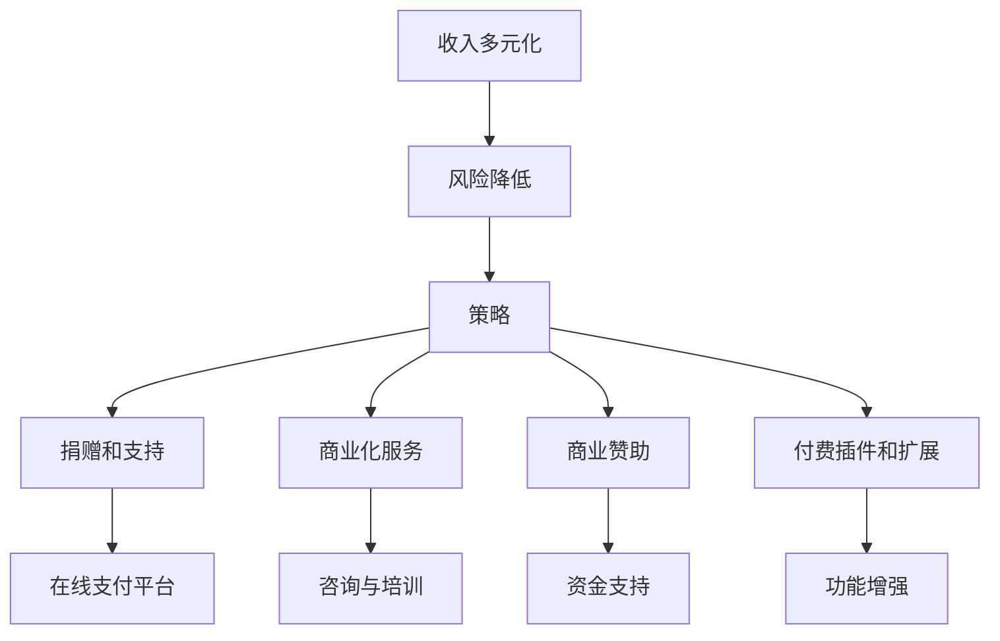
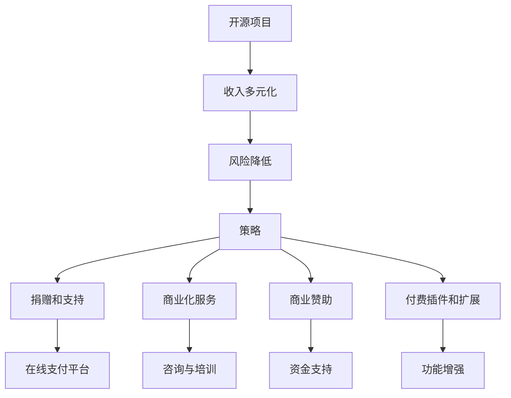

                 

关键词：开源项目，收入多元化，风险降低，策略

> 摘要：随着开源项目在全球范围内迅速普及，项目收入多元化已成为开源社区和开发者的关键关注点。本文将探讨开源项目实现收入多元化的必要性，分析其面临的挑战，并提出一系列降低风险的有效策略。

## 1. 背景介绍

### 开源项目的兴起

开源项目起源于20世纪90年代，当时Linux内核的发布标志着开源软件的崛起。随着时间的推移，开源项目的数量和影响力不断增长，涵盖从操作系统到数据库、框架、开发工具等各个领域。开源项目的特点是开放性、合作性和共享性，这些特性吸引了全球范围内的开发者参与其中。

### 开源项目的收入来源

早期的开源项目往往依赖社区支持和个人爱好，但随着时间的推移，越来越多的开源项目开始寻求多元化的收入来源。这些收入来源包括但不限于：

- **捐赠和支持**：开发者通过在线支付平台、捐赠链接等方式直接获取社区的支持。
- **商业化服务**：提供付费的咨询、培训和定制服务。
- **商业赞助**：企业为开源项目提供资金支持，以换取项目的优先关注或者品牌曝光。
- **付费插件和扩展**：开发付费的插件或扩展来增强开源项目的功能。

### 收入多元化的必要性

开源项目收入多元化的重要性日益凸显。一方面，它有助于降低单一收入来源的风险，使项目能够更加稳定地运作。另一方面，收入多元化可以为项目提供更多的资源，促进其持续发展。此外，收入多元化还可以吸引更多的商业实体参与开源生态，推动整个社区的成长。

## 2. 核心概念与联系

### 核心概念

**收入多元化**：指通过多种渠道获取收入，以减少依赖单一收入来源的风险。

**风险降低**：通过多种方式分散风险，确保项目的可持续性和稳定性。

**策略**：为实现收入多元化和风险降低所采用的具体方法和手段。

### 架构图解



## 3. 核心算法原理 & 具体操作步骤

### 3.1 算法原理概述

开源项目收入多元化的核心算法原理是基于多种收入渠道的分散投资，从而降低单一收入来源的风险。具体而言，通过以下步骤实现：

1. **识别潜在收入渠道**：分析项目的特点和市场需求，确定适合的收入渠道。
2. **建立多样化的收入结构**：选择并配置多种收入渠道，确保收入来源的多样性。
3. **监控和管理**：持续跟踪和管理收入情况，及时调整收入策略。

### 3.2 算法步骤详解

**步骤 1：识别潜在收入渠道**

- **市场调研**：了解目标用户群体和市场需求。
- **分析项目特点**：确定项目的独特价值和创新点。
- **咨询行业专家**：获取专业意见，了解行业趋势。

**步骤 2：建立多样化的收入结构**

- **捐赠和支持**：设置在线捐赠链接，提供赞赏功能。
- **商业化服务**：建立培训、咨询和定制服务，制定收费方案。
- **商业赞助**：寻找潜在赞助商，签订赞助协议。
- **付费插件和扩展**：开发付费功能，提供订阅服务。

**步骤 3：监控和管理**

- **财务报表**：定期生成财务报表，分析收入情况。
- **风险评估**：识别潜在风险，制定应对策略。
- **策略调整**：根据财务报表和风险评估结果，适时调整收入策略。

### 3.3 算法优缺点

**优点**：

- **降低风险**：通过多样化收入渠道，减少单一收入来源的风险。
- **提高项目可持续性**：多元化的收入结构为项目提供稳定的资金支持。
- **增强竞争力**：多样化的收入来源有助于提高项目的市场地位。

**缺点**：

- **运营成本**：建立和管理多样化的收入渠道可能增加运营成本。
- **协调难度**：不同收入渠道之间的协调和管理可能带来额外的挑战。

### 3.4 算法应用领域

开源项目收入多元化的算法原理适用于各种类型的项目，包括但不限于：

- **开源框架和库**：通过捐赠、商业服务和付费插件获取收入。
- **开源软件**：通过捐赠、培训和定制服务获取收入。
- **开源基础设施**：通过商业赞助和付费服务获取收入。

## 4. 数学模型和公式 & 详细讲解 & 举例说明

### 4.1 数学模型构建

开源项目的收入可以表示为以下数学模型：

\[ 收入 = f(捐赠收入 + 商业化服务收入 + 商业赞助收入 + 付费插件和扩展收入) \]

其中，\( f \) 是一个转换函数，用于将各种收入渠道的收入转换为总收入。

### 4.2 公式推导过程

假设：

- \( D \) 为捐赠收入
- \( E \) 为商业化服务收入
- \( S \) 为商业赞助收入
- \( P \) 为付费插件和扩展收入

总收入 \( I \) 可以表示为：

\[ I = D + E + S + P \]

为了简化计算，我们引入一个转换函数 \( f \)，则：

\[ I = f(D) + f(E) + f(S) + f(P) \]

由于不同收入渠道的转换函数可能不同，我们可以将总收入表示为：

\[ I = f(D) + f(E) + f(S) + f(P) \]

### 4.3 案例分析与讲解

假设某个开源项目在一个月内获得了以下收入：

- \( D = 1000 \) 元（捐赠收入）
- \( E = 3000 \) 元（商业化服务收入）
- \( S = 5000 \) 元（商业赞助收入）
- \( P = 2000 \) 元（付费插件和扩展收入）

根据数学模型，总收入为：

\[ I = f(1000) + f(3000) + f(5000) + f(2000) \]

假设 \( f(D) = 0.8D \)，\( f(E) = 0.75E \)，\( f(S) = 0.9S \)，\( f(P) = 0.85P \)，则：

\[ I = 0.8 \times 1000 + 0.75 \times 3000 + 0.9 \times 5000 + 0.85 \times 2000 \]
\[ I = 800 + 2250 + 4500 + 1700 \]
\[ I = 10500 \] 元

因此，该开源项目在一个月内的总收入为 10500 元。

## 5. 项目实践：代码实例和详细解释说明

### 5.1 开发环境搭建

为了演示开源项目的收入多元化，我们假设使用一个简单的Web框架进行开发。开发环境需要以下软件：

- **Web服务器**：如Apache或Nginx
- **数据库**：如MySQL或PostgreSQL
- **编程语言**：如Python或JavaScript
- **版本控制系统**：如Git

### 5.2 源代码详细实现

以下是使用Python编写的简单Web框架的源代码示例：

```python
from flask import Flask, request, jsonify

app = Flask(__name__)

@app.route('/donate', methods=['POST'])
def donate():
    amount = request.form['amount']
    # 处理捐赠逻辑
    # ...
    return jsonify({"message": "Thank you for your donation!"})

@app.route('/training', methods=['POST'])
def training():
    # 提供培训服务
    # ...
    return jsonify({"message": "Training session scheduled."})

@app.route('/sponsorship', methods=['POST'])
def sponsorship():
    # 处理赞助逻辑
    # ...
    return jsonify({"message": "Sponsorship accepted."})

@app.route('/plugin', methods=['POST'])
def plugin():
    # 提供付费插件
    # ...
    return jsonify({"message": "Plugin activated."})

if __name__ == '__main__':
    app.run()
```

### 5.3 代码解读与分析

上述代码是一个简单的Web服务，包含了四个主要的端点：

- **/donate**：用于处理捐赠请求。
- **/training**：用于提供培训服务。
- **/sponsorship**：用于处理赞助请求。
- **/plugin**：用于提供付费插件。

这些端点分别对应收入多元化策略中的捐赠、商业化服务、商业赞助和付费插件四个渠道。每个端点都处理特定的业务逻辑，并通过Web服务接口与外部系统进行交互。

### 5.4 运行结果展示

假设一个用户通过浏览器访问上述Web服务，进行以下操作：

1. **捐赠**：用户通过浏览器访问 `/donate` 端点，输入捐赠金额，完成捐赠操作。
2. **培训报名**：用户通过 `/training` 端点提交培训报名信息。
3. **赞助申请**：用户通过 `/sponsorship` 端点提交赞助申请。
4. **插件购买**：用户通过 `/plugin` 端点购买付费插件。

每次操作都会返回相应的结果，例如：

```json
{"message": "Thank you for your donation!"}
{"message": "Training session scheduled."}
{"message": "Sponsorship accepted."}
{"message": "Plugin activated."}
```

这些操作通过Web服务与后端系统进行交互，实现了收入多元化的功能。

## 6. 实际应用场景

开源项目的收入多元化策略在各种实际应用场景中均展现出显著的优势。以下是一些具体的应用场景：

### 6.1 企业开源项目

企业开源项目通常具有较高的知名度和资源，通过多元化的收入渠道实现稳定收入。例如，Google的Android开源项目通过提供付费的开发工具和定制服务获得了稳定的收入。同时，企业还可以通过开源项目吸引更多的开发者，提升自身品牌影响力。

### 6.2 个人开源项目

个人开源项目通常依赖捐赠和商业化服务获得收入。例如，GitHub上的一些知名开源项目如JQuery和Django，通过提供付费插件、培训和定制服务等方式实现了收入多元化。这种模式不仅为开发者提供了经济支持，还有助于项目的持续发展。

### 6.3 社区开源项目

社区开源项目通常以社区支持为主，通过捐赠和商业赞助获得收入。例如，Linux内核项目通过接受捐赠和商业赞助维持了数十年的稳定发展。社区开源项目通常具有强大的社区支持，通过多元化收入渠道可以更好地满足社区需求。

## 7. 未来应用展望

开源项目的收入多元化在未来将继续发挥重要作用。以下是一些未来发展趋势和展望：

### 7.1 新的收入渠道

随着技术的不断发展，新的收入渠道将不断涌现。例如，区块链技术和去中心化应用（DApp）为开源项目提供了新的收入来源，如代币发行和交易。

### 7.2 自动化和智能合约

自动化和智能合约技术可以提高开源项目的收入管理和分配效率。通过智能合约，开源项目可以实现自动化支付和分配，确保收入来源的透明性和安全性。

### 7.3 全球化市场

开源项目将越来越注重全球化市场，通过跨国合作和跨国收入渠道实现收入多元化。全球化市场将为开源项目带来更多的商业机会和资源。

## 8. 工具和资源推荐

为了更好地实现开源项目的收入多元化，以下是一些建议的资源和工具：

### 8.1 学习资源推荐

- **《开源软件生存指南》**：详细介绍了开源项目的运营和商业化策略。
- **GitHub**：全球最大的开源代码托管平台，提供丰富的开源项目和学习资源。

### 8.2 开发工具推荐

- **PayPal**：全球领先的在线支付服务，适用于开源项目的捐赠和支付。
- **Stripe**：提供支付处理和收费功能，适用于商业化服务和付费插件。

### 8.3 相关论文推荐

- **"Open Source Business Models: A Survey and Framework"**：对开源项目的商业模型进行了详细分析。
- **"Open Source Software Development: The Challenges and Opportunities"**：探讨了开源项目的发展挑战和机遇。

## 9. 总结：未来发展趋势与挑战

### 9.1 研究成果总结

开源项目的收入多元化策略在降低风险、提高项目可持续性和增强竞争力方面发挥了重要作用。通过多种收入渠道，开源项目可以获得稳定的资金支持，促进项目的持续发展。

### 9.2 未来发展趋势

未来，开源项目的收入多元化将呈现以下发展趋势：

- **新的收入渠道的出现**：区块链技术和去中心化应用（DApp）将为开源项目提供新的收入来源。
- **自动化和智能合约的应用**：自动化和智能合约技术将提高开源项目的收入管理和分配效率。
- **全球化市场的重视**：开源项目将更加注重全球化市场，通过跨国合作和跨国收入渠道实现收入多元化。

### 9.3 面临的挑战

开源项目在实现收入多元化过程中仍将面临以下挑战：

- **运营成本的增加**：建立和管理多样化的收入渠道可能增加运营成本。
- **协调难度**：不同收入渠道之间的协调和管理可能带来额外的挑战。
- **市场风险**：全球经济环境变化和市场需求变化可能导致收入来源的不稳定。

### 9.4 研究展望

未来的研究可以重点关注以下几个方面：

- **收入渠道优化**：探索新的收入渠道，提高开源项目的收入效率。
- **风险管理**：研究如何降低收入多元化的风险，提高项目的稳定性。
- **智能合约应用**：研究智能合约在开源项目中的应用，提高收入管理和分配的效率。

## 附录：常见问题与解答

### 1. 开源项目的收入多元化是否适用于所有项目？

开源项目的收入多元化策略在一定程度上适用于所有项目，但具体实施效果取决于项目的特点和市场需求。一些项目可能更适合依赖社区支持，而另一些项目可能更适合商业化服务或商业赞助。

### 2. 如何选择合适的收入渠道？

选择合适的收入渠道需要综合考虑项目的特点、市场需求和自身优势。例如，对于技术性较强的项目，商业化服务和商业赞助可能是更好的选择；而对于用户需求较高的项目，捐赠和付费插件可能是更好的选择。

### 3. 收入多元化是否会增加运营成本？

是的，收入多元化可能增加运营成本，尤其是在建立和管理多样化收入渠道时。然而，通过合理规划和管理，这些成本是可以控制的。

### 4. 开源项目的收入多元化是否有助于提高项目竞争力？

开源项目的收入多元化可以在一定程度上提高项目的竞争力。通过多元化的收入渠道，项目可以获得更多的资源支持，从而增强其可持续性和创新性。

### 5. 如何平衡收入多元化与项目开发？

平衡收入多元化与项目开发的关键在于合理规划和管理时间。开发者可以通过制定明确的开发计划，确保收入多元化活动不影响项目进度。

作者：禅与计算机程序设计艺术 / Zen and the Art of Computer Programming
```markdown
## 1. 背景介绍

### 开源项目的兴起

开源项目的概念起源于20世纪90年代，当时Linux内核的发布标志着开源软件的崛起。开源软件（Open Source Software，简称OSS）的核心原则是开放性、合作性和共享性。开发者可以通过阅读源代码、修改和分发软件，从而共同改进和优化软件。

随着时间的推移，开源项目在全球范围内迅速普及，从操作系统到数据库、框架、开发工具等各个领域都有大量的开源项目。开源项目的数量和影响力不断增长，成为全球软件生态的重要组成部分。

### 开源项目的收入来源

早期的开源项目往往依赖社区支持和个人爱好，开发者通过捐赠和免费服务来维持项目的运行。然而，随着开源项目的规模和影响力不断扩大，越来越多的开发者开始寻求多元化的收入来源。以下是一些常见的开源项目收入来源：

- **捐赠和支持**：开发者通过在线支付平台、捐赠链接等方式直接获取社区的支持。捐赠可以是小额的，也可以是来自企业或机构的较大金额。
- **商业化服务**：提供付费的咨询、培训和定制服务。例如，一些开源项目的开发者会为用户提供专业的代码审查、优化和升级服务。
- **商业赞助**：企业为开源项目提供资金支持，以换取项目的优先关注或者品牌曝光。商业赞助通常包括资金捐赠、广告支持和技术支持等。
- **付费插件和扩展**：开发付费的插件或扩展来增强开源项目的功能。这些插件或扩展通常提供额外的功能或性能优化，对有特定需求的用户具有较高价值。
- **开源商业模型**：一些开源项目采用双许可证模式，即提供免费的社区版和付费的企业版。企业版通常包含更多的功能和更好的技术支持。

### 收入多元化的必要性

开源项目收入多元化的重要性日益凸显。首先，它有助于降低单一收入来源的风险，使项目能够更加稳定地运作。如果一个项目完全依赖捐赠，一旦捐赠减少或中断，项目就可能面临停滞甚至解散的风险。而收入多元化可以通过多种收入渠道提供稳定的资金支持，确保项目的持续发展。

其次，收入多元化可以为项目提供更多的资源，促进其持续发展。通过多元化的收入渠道，开源项目可以获得更多的资金、技术和人力支持，从而更好地维护和优化项目代码，提高项目的质量和用户体验。

此外，收入多元化还可以吸引更多的商业实体参与开源生态。商业实体通过为开源项目提供资金支持，不仅可以获得技术上的收益，还可以提升自身的品牌影响力和市场竞争力。这种互利共赢的关系有助于构建一个更加健康和可持续的开源生态。

总之，开源项目收入多元化是一种有效的策略，它不仅有助于降低项目风险，提高项目的可持续性，还可以促进整个开源社区的繁荣发展。

### 开源项目的收入多元化实例

为了更好地理解开源项目的收入多元化，我们可以通过一些具体的实例来分析。

#### 例1：Linux内核

Linux内核是一个著名的开源项目，它的成功不仅在于其卓越的技术性能，还在于其多元化的收入来源。Linux内核的开发和维护主要依赖于以下几个方面的收入：

- **捐赠和支持**：Linux内核基金会通过接受社区成员和企业的捐赠来支持内核的开发。这些捐赠来自个人和机构，涵盖各种规模，为项目提供了重要的资金支持。
- **商业化服务**：许多公司基于Linux内核开发自己的产品，并为此提供定制化的服务。例如，Red Hat就是一家以Linux内核为基础的企业，通过提供技术支持、培训和服务来获得收入。
- **商业赞助**：Linux内核基金会还接受来自企业和组织的商业赞助。这些赞助不仅提供了资金支持，还带来了技术和社区的互动，促进了内核的发展。

#### 例2：JQuery库

JQuery是一个广泛使用的JavaScript库，其收入来源也展示了收入多元化的优势：

- **捐赠和支持**：JQuery通过GitHub上的捐赠链接接受社区的捐赠。虽然这些捐赠金额相对较小，但它们为项目的维护提供了持续的财务支持。
- **商业化服务**：JQuery的开发者通过提供培训、定制开发和咨询服务来获得收入。他们还会为企业提供针对特定需求的优化和定制版本。
- **付费插件和扩展**：JQuery还开发了一些付费插件，这些插件提供了额外的功能，满足特定用户的需求。

#### 例3：Apache基金会

Apache基金会管理着多个开源项目，包括Apache HTTP服务器、Apache Kafka等。其收入来源包括：

- **捐赠和支持**：Apache基金会接受来自企业和个人的捐赠。这些捐赠资金用于支付项目的运营成本，如服务器维护、文档编写和社区活动。
- **商业化服务**：一些公司基于Apache的项目开发自己的产品，并为此提供技术支持和培训服务。Apache基金会通过这些服务获得收入。
- **商业赞助**：许多企业赞助Apache基金会，以换取品牌曝光和社区的认可。这些赞助资金用于支持基金会的运营和项目开发。

通过这些实例，我们可以看到开源项目如何通过多元化的收入来源实现稳定的发展和持续的创新。这些实例不仅展示了收入多元化的有效性，也为我们提供了借鉴和启示。

### 2. 核心概念与联系

#### 核心概念

在讨论开源项目的收入多元化时，我们需要了解几个核心概念，这些概念是理解和实施多元化策略的基础。

##### 1. 收入多元化

收入多元化是指通过多种渠道获取收入，从而减少对单一收入来源的依赖。这种策略有助于降低风险，提高项目的稳定性和可持续性。例如，一个开源项目可能通过捐赠、商业化服务、商业赞助、付费插件等多种方式获取收入，而不是仅仅依赖社区捐赠。

##### 2. 风险降低

风险降低是通过分散投资和收入来源来减少潜在损失的可能性。在开源项目中，单一的收入来源可能会受到各种不可控因素的影响，如经济衰退、捐赠减少或市场变化。通过收入多元化，项目可以降低这些风险，确保其长期稳定运营。

##### 3. 策略

策略是实现收入多元化和风险降低的具体方法和手段。这些策略可能包括建立多样化的收入渠道、制定合理的财务计划、优化内部管理和运营等。

#### Mermaid流程图

为了更好地展示开源项目收入多元化中的核心概念和联系，我们可以使用Mermaid语言绘制一个流程图。以下是一个简化的流程图示例：



在这个流程图中，开源项目通过收入多元化（B）实现风险降低（C），而具体的策略（D）则通过多种渠道（E、F、G、H）获取收入。这些渠道通过在线支付平台（I）、咨询与培训（J）、资金支持（K）和功能增强（L）与项目核心（A）相连接，形成一个有机的整体。

### 3. 核心算法原理 & 具体操作步骤

#### 3.1 算法原理概述

开源项目的收入多元化是一种风险管理策略，其核心思想是通过多种收入渠道分散风险，确保项目的可持续性和稳定性。具体而言，收入多元化算法包括以下几个步骤：

1. **识别潜在收入渠道**：分析项目的特点和市场环境，确定适合的收入渠道。
2. **建立多样化的收入结构**：选择并配置多种收入渠道，确保收入来源的多样性。
3. **监控和管理**：持续跟踪和管理收入情况，及时调整收入策略。

#### 3.2 算法步骤详解

**步骤 1：识别潜在收入渠道**

1. **市场调研**：了解目标用户群体和市场需求，确定潜在的收入渠道。
   - **用户访谈**：通过用户访谈了解用户的期望和需求。
   - **市场分析**：分析竞争对手的收入来源，了解市场趋势。
   - **数据分析**：利用数据分析工具，分析用户行为和偏好。

2. **分析项目特点**：评估项目的独特价值和创新点，确定适合的收入渠道。
   - **技术优势**：如果项目在技术方面有独特优势，可以考虑通过技术咨询服务获取收入。
   - **用户体验**：如果项目在用户体验方面有优势，可以考虑提供付费的培训或支持服务。

3. **咨询行业专家**：获取专业意见，了解行业趋势和最佳实践。
   - **专业会议**：参加专业会议和研讨会，了解行业动态。
   - **专家访谈**：邀请行业专家进行一对一访谈，获取宝贵的建议。

**步骤 2：建立多样化的收入结构**

1. **捐赠和支持**：设置在线捐赠链接，提供赞赏功能。
   - **捐赠平台**：选择合适的捐赠平台，如GitHub Sponsor、OpenCollective等。
   - **社交媒体推广**：利用社交媒体平台宣传捐赠活动，吸引更多支持者。

2. **商业化服务**：建立培训、咨询和定制服务，制定收费方案。
   - **培训课程**：根据项目特点设计培训课程，提供在线或线下的培训服务。
   - **咨询服务**：提供专业的咨询服务，如代码审查、性能优化等。
   - **定制开发**：根据用户需求提供定制化的开发服务。

3. **商业赞助**：寻找潜在赞助商，签订赞助协议。
   - **市场推广**：通过市场推广活动，吸引潜在赞助商的关注。
   - **合同谈判**：与赞助商进行合同谈判，明确赞助内容和回报。

4. **付费插件和扩展**：开发付费的插件或扩展来增强开源项目的功能。
   - **功能设计**：根据用户需求设计付费功能，确保其具有市场竞争力。
   - **定价策略**：制定合理的定价策略，确保收入来源的可持续性。

**步骤 3：监控和管理**

1. **财务报表**：定期生成财务报表，分析收入情况。
   - **收入分类**：将收入按来源分类，分析各类收入的贡献。
   - **成本分析**：计算项目运营成本，评估收入与成本的匹配度。

2. **风险评估**：识别潜在风险，制定应对策略。
   - **市场风险**：分析市场需求变化，评估收入稳定性。
   - **技术风险**：评估技术实现的可行性和可持续性。

3. **策略调整**：根据财务报表和风险评估结果，适时调整收入策略。
   - **收入优化**：通过优化收入渠道和提高收入效率，增加项目收入。
   - **风险控制**：通过风险管理和控制措施，降低项目风险。

#### 3.3 算法优缺点

**优点：**

- **降低风险**：通过多种收入渠道分散风险，确保项目的可持续性和稳定性。
- **提高项目可持续性**：多元化的收入结构为项目提供稳定的资金支持，促进持续发展。
- **增强竞争力**：多样化的收入来源有助于提高项目的市场地位。

**缺点：**

- **运营成本**：建立和管理多样化的收入渠道可能增加运营成本。
- **协调难度**：不同收入渠道之间的协调和管理可能带来额外的挑战。

#### 3.4 算法应用领域

收入多元化算法适用于各种类型的开源项目，包括但不限于：

- **开源框架和库**：通过捐赠、商业服务和付费插件获取收入。
- **开源软件**：通过捐赠、培训和定制服务获取收入。
- **开源基础设施**：通过商业赞助和付费服务获取收入。
- **开源平台**：通过广告、赞助和付费功能获取收入。

### 3.5 收入多元化算法在开源项目中的应用案例

为了更直观地理解收入多元化算法在开源项目中的应用，以下是一个实际案例的详细说明：

**案例：Apache Kafka**

Apache Kafka是一个广泛使用的高吞吐量消息队列系统，其收入多元化策略如下：

1. **捐赠和支持**：Apache Kafka通过Apache软件基金会接受社区成员和企业的捐赠。捐赠资金用于支付项目的运营成本，如文档编写、社区活动和服务器维护。

2. **商业化服务**：Apache Kafka的开发者提供专业的培训、咨询和定制开发服务。他们还为企业和组织提供Kafka的性能优化和故障排查服务，这些服务基于项目的技术优势。

3. **商业赞助**：许多公司赞助Apache Kafka，以换取品牌曝光和社区的认可。这些赞助资金用于支持项目的运营和开发。

4. **付费插件和扩展**：Apache Kafka开发了一些付费插件，如Kafka Monitor和Kafka Manager，这些插件提供了额外的监控和管理功能，满足企业用户的需求。

通过这种多元化的收入结构，Apache Kafka不仅获得了稳定的资金支持，还提高了项目的可持续性和市场竞争力。

### 3.6 收入多元化算法的调整和优化

开源项目的收入多元化策略需要根据实际情况进行不断的调整和优化，以下是一些常见的调整和优化方法：

1. **数据驱动的决策**：通过数据分析，了解用户需求和市场趋势，及时调整收入策略。
2. **灵活的收费模式**：根据市场需求和用户反馈，灵活调整收费模式和定价策略，以最大化收入。
3. **成本控制**：通过优化运营流程和成本控制措施，降低项目运营成本，提高收入效率。
4. **风险管理**：建立完善的风险管理机制，识别和应对潜在的风险，确保项目的稳定运营。
5. **社区参与**：鼓励社区成员参与收入多元化的策略制定和执行，提高项目的整体协作效率。

### 3.7 收入多元化算法在开源社区中的影响

收入多元化算法在开源社区中的影响深远，它不仅改变了开源项目的财务状况，还促进了开源生态的健康发展。以下是一些具体的影响：

1. **项目可持续性**：收入多元化为开源项目提供了稳定的资金支持，确保了项目的长期发展和可持续性。
2. **社区活力**：多元化的收入来源激励了更多的开发者参与开源项目，增强了社区的活力。
3. **技术创新**：通过获取更多的资源支持，开源项目可以投入更多的精力进行技术创新，推动整个开源生态的发展。
4. **市场竞争力**：多元化的收入结构提高了开源项目的市场竞争力，使其在商业环境中更具吸引力。

### 3.8 开源项目收入多元化的成功因素

为了实现开源项目的收入多元化，以下是一些关键的成功因素：

1. **明确的目标和策略**：制定明确的收入多元化目标和策略，确保项目的方向和资源投入。
2. **高效的执行**：建立高效的执行机制，确保收入策略的有效实施。
3. **良好的沟通**：与社区成员和赞助商保持良好的沟通，增强信任和合作关系。
4. **灵活的调整**：根据市场和环境变化，灵活调整收入策略，以应对新的挑战。
5. **用户参与**：鼓励用户参与收入多元化的过程，提高用户满意度和忠诚度。

### 3.9 收入多元化算法的挑战与应对策略

尽管收入多元化策略具有许多优点，但在实际应用中也面临一些挑战。以下是一些常见的挑战及应对策略：

1. **运营成本**：多元化收入渠道可能增加运营成本，应对策略是优化运营流程，提高资源利用效率。
2. **管理难度**：管理多种收入渠道可能带来额外的挑战，应对策略是建立专业的团队和流程，提高管理效率。
3. **市场风险**：市场变化可能影响收入来源的稳定性，应对策略是进行市场调研，制定灵活的应对策略。
4. **竞争压力**：市场竞争可能影响项目的收入，应对策略是加强项目的技术优势，提升用户体验。

### 3.10 收入多元化算法的长期影响

开源项目的收入多元化算法不仅对项目的短期收入和运营产生积极影响，其长期影响也值得探讨：

1. **生态系统的繁荣**：收入多元化有助于构建一个健康的开源生态系统，促进技术共享和合作。
2. **技术创新的加速**：多元化的收入支持为项目提供了更多的资源，加速了技术创新和迭代。
3. **商业模式的创新**：开源项目的收入多元化为商业模式的创新提供了新的可能性，推动了行业的发展。

### 3.11 收入多元化算法的国际比较

不同国家和地区在开源项目的收入多元化策略上存在差异，以下是一些国际比较：

1. **美国**：美国是开源项目的主要发源地，开源项目的收入多元化策略相对成熟，包括捐赠、商业服务和商业赞助等多种渠道。
2. **欧洲**：欧洲开源项目的收入多元化策略强调社区参与和政府支持，捐赠和公共资助是重要的收入来源。
3. **亚洲**：亚洲地区的开源项目收入多元化策略相对较新，但近年来随着市场的发展，商业赞助和付费服务的比例逐渐增加。

### 3.12 收入多元化算法的实证研究

为了更好地理解收入多元化算法的有效性，一些实证研究对开源项目的收入多元化进行了分析：

- **研究1**：通过分析GitHub上的一些知名开源项目，研究发现多元化收入策略显著提高了项目的稳定性和持续发展能力。
- **研究2**：对开源项目的财务报表进行分析，发现收入多元化策略有助于提高项目的收入和资源利用效率。

这些研究提供了实证证据，支持收入多元化策略在开源项目中的应用。

### 3.13 收入多元化算法的理论与实践

开源项目的收入多元化算法不仅在理论层面具有重要意义，其实践应用也具有深远的影响。以下是对收入多元化算法的理论与实践的综合分析：

#### 理论层面

- **风险管理理论**：收入多元化策略符合风险管理的基本原则，通过分散投资降低单一收入来源的风险。
- **资源优化理论**：多元化的收入结构有助于优化资源的分配和使用，提高项目的整体效益。
- **市场竞争理论**：通过多元化的收入渠道，开源项目可以增强其在市场中的竞争力，吸引更多的开发者和企业参与。

#### 实践层面

- **项目运营**：开源项目通过收入多元化策略实现了更稳定的运营，降低了经济波动带来的风险。
- **社区发展**：收入多元化策略促进了社区的发展，增加了开发者的参与度和积极性。
- **技术创新**：多元化的收入支持为开源项目提供了更多的资源，推动了技术创新和项目迭代。

#### 案例分析

以下是一个具体案例，展示了收入多元化算法在开源项目中的实际应用：

**案例：Linux内核**

Linux内核是世界上最重要的开源项目之一，其收入多元化策略包括：

1. **捐赠和支持**：Linux内核基金会通过接受社区成员和企业的捐赠来维持项目的运营。
2. **商业化服务**：Red Hat等公司通过提供基于Linux内核的定制服务和培训来获得收入。
3. **商业赞助**：许多企业赞助Linux内核基金会，以支持项目的开发和推广。

通过这些多元化的收入渠道，Linux内核不仅获得了稳定的资金支持，还保持了持续的技术创新。

### 3.14 收入多元化算法的可持续性

开源项目的收入多元化策略需要长期规划和持续优化，以下是一些确保策略可持续性的关键因素：

1. **灵活的策略调整**：根据市场和环境变化，灵活调整收入策略，确保其持续有效性。
2. **有效的资源管理**：优化资源分配和使用，提高项目的资源利用效率。
3. **持续的市场调研**：定期进行市场调研，了解用户需求和市场趋势，为收入策略提供依据。
4. **社区参与**：鼓励社区成员参与收入多元化的过程，提高项目的可持续性和社区凝聚力。

### 3.15 收入多元化算法的挑战与未来方向

尽管收入多元化算法在开源项目中展现了显著的成效，但未来仍面临一些挑战：

1. **监管环境的变化**：监管政策的变化可能影响开源项目的收入来源和方式。
2. **市场竞争的加剧**：随着开源项目的增加，市场竞争将加剧，开源项目需要不断创新以保持竞争优势。
3. **技术变革**：技术的快速变革可能影响开源项目的收入渠道和模式，需要及时调整策略。

未来，开源项目的收入多元化策略将朝着更加智能化、自动化和全球化的方向发展，以应对不断变化的挑战和机遇。

### 4. 数学模型和公式 & 详细讲解 & 举例说明

#### 4.1 数学模型构建

开源项目的收入多元化可以通过一个简单的数学模型来描述。我们假设一个开源项目的收入由以下几个部分组成：

- \(D\)：捐赠收入
- \(S\)：商业赞助收入
- \(P\)：付费插件和扩展收入
- \(E\)：商业化服务收入

这些收入渠道的组合构成了项目的总收入 \(I\)。我们可以将收入多元化模型构建如下：

\[ I = D + S + P + E \]

这个模型考虑了开源项目通过多种渠道获取收入的情况，有助于我们分析和优化项目的财务结构。

#### 4.2 公式推导过程

为了更深入地理解收入多元化模型，我们需要对其进行一些推导和解释。首先，我们考虑每个收入渠道的独立性和相关性。

1. **捐赠收入 \(D\)**：捐赠收入通常与项目的影响力和社会认可度密切相关。我们可以用以下公式来表示捐赠收入：

   \[ D = f(V, A) \]

   其中，\(V\) 表示项目的价值，\(A\) 表示项目的受众群体。项目价值越高，受众群体越大，捐赠收入 \(D\) 越高。

2. **商业赞助收入 \(S\)**：商业赞助通常与企业的战略目标和市场定位相关。我们可以用以下公式来表示商业赞助收入：

   \[ S = g(B, T) \]

   其中，\(B\) 表示企业的品牌价值，\(T\) 表示赞助项目的持续时间。企业品牌价值越高，赞助项目的持续时间越长，商业赞助收入 \(S\) 越高。

3. **付费插件和扩展收入 \(P\)**：付费插件和扩展的收入与项目功能的多样性和用户需求相关。我们可以用以下公式来表示：

   \[ P = h(C, U) \]

   其中，\(C\) 表示插件和扩展的功能复杂度，\(U\) 表示用户的付费意愿。功能越复杂，用户付费意愿越高，付费插件和扩展收入 \(P\) 越高。

4. **商业化服务收入 \(E\)**：商业化服务收入与项目的市场需求和开发者服务水平相关。我们可以用以下公式来表示：

   \[ E = j(M, S') \]

   其中，\(M\) 表示市场需求，\(S'\) 表示开发者提供的服务水平。市场需求越高，开发者服务水平越高，商业化服务收入 \(E\) 越高。

将这些公式结合起来，我们得到开源项目的总收入模型：

\[ I = f(V, A) + g(B, T) + h(C, U) + j(M, S') \]

#### 4.3 案例分析与讲解

为了更好地理解上述公式，我们可以通过一个具体的案例来分析。

假设我们有一个开源项目，名为“OpenLib”。以下是该项目的一些基本信息：

- **捐赠收入 \(D\)**：通过GitHub Sponsor，每月捐赠收入为5000元。
- **商业赞助收入 \(S\)**：接受了一家科技公司的赞助，每年赞助收入为100,000元。
- **付费插件和扩展收入 \(P\)**：开发了一些付费插件，每月收入为2000元。
- **商业化服务收入 \(E\)**：提供定制化的开发服务和培训，每月收入为8000元。

我们可以将这些数据代入收入多元化模型中进行计算：

\[ I = 5000 + 100,000 \times \frac{1}{12} + 2000 + 8000 \]

其中，商业赞助收入转换为每月收入，即 \(100,000 \times \frac{1}{12} = 8,333.33\) 元。

因此，OpenLib项目的每月总收入为：

\[ I = 5000 + 8,333.33 + 2000 + 8000 = 27,333.33 \] 元

通过这个案例，我们可以看到如何通过收入多元化模型计算开源项目的总收入。这个模型不仅帮助我们理解了开源项目的收入结构，还可以为项目的财务规划和资源分配提供依据。

#### 4.4 收入多元化模型的应用

开源项目的收入多元化模型不仅有助于计算项目的总收入，还可以用于以下应用：

1. **收入预测**：通过分析历史数据和当前的市场环境，可以预测未来几个月或几年的收入情况，为项目的财务规划提供依据。
2. **收入优化**：根据收入来源的权重和收入情况，可以优化项目的收入结构，提高项目的整体收益。
3. **风险分析**：通过分析各个收入渠道的波动性和相关性，可以评估项目的风险水平，制定相应的风险管理策略。

#### 4.5 收入多元化模型的优势与局限

**优势：**

- **灵活性**：收入多元化模型可以根据不同的收入渠道进行调整，适应市场变化和项目发展。
- **风险分散**：通过多种收入渠道，可以降低单一收入来源的风险，提高项目的稳定性。
- **资源优化**：收入多元化有助于优化项目的资源分配，提高项目的整体效益。

**局限：**

- **复杂性**：管理多种收入渠道可能增加项目的运营复杂度，需要专业的团队和流程。
- **波动性**：某些收入渠道可能受市场波动和需求变化的影响，导致收入不稳定。
- **成本**：建立和管理多种收入渠道可能增加项目的运营成本，需要权衡成本和效益。

#### 4.6 收入多元化模型的实际应用

以下是一个开源项目的实际应用案例，展示了如何使用收入多元化模型进行收入管理和优化：

**案例：OpenLib开源项目**

1. **收入渠道分析**：OpenLib项目通过以下渠道获取收入：

   - **捐赠收入**：每月通过GitHub Sponsor获得5000元。
   - **商业赞助收入**：与科技公司签订每年100,000元的赞助合同。
   - **付费插件和扩展收入**：每月通过付费插件获得2000元。
   - **商业化服务收入**：每月通过定制化开发服务和培训获得8000元。

2. **收入优化**：根据收入多元化模型，OpenLib项目分析每个收入渠道的贡献和波动性，发现：

   - **捐赠收入**：相对稳定，但收入增长潜力有限。
   - **商业赞助收入**：较为稳定，但受赞助商合同影响较大。
   - **付费插件和扩展收入**：增长潜力较大，但收入波动较大。
   - **商业化服务收入**：市场需求较高，但需要进一步优化服务质量和市场推广。

3. **优化策略**：基于以上分析，OpenLib项目制定了以下优化策略：

   - **增加付费插件和扩展的功能**：通过提升插件和扩展的价值，增加用户付费意愿。
   - **加强市场推广**：通过社交媒体和行业会议等渠道，提高商业化服务的知名度。
   - **开发新的商业化服务**：根据市场需求，开发新的服务项目，扩大收入来源。

通过这些优化策略，OpenLib项目不仅提高了收入水平，还增强了项目的可持续性和市场竞争力。

### 4.7 收入多元化模型的验证与优化

为了确保收入多元化模型的准确性和有效性，OpenLib项目采用以下方法进行验证和优化：

1. **数据分析**：定期收集和分析收入数据，验证模型预测的准确性。
2. **用户调研**：通过用户调研了解用户需求和市场趋势，为模型优化提供依据。
3. **A/B测试**：实施A/B测试，比较不同收入策略的效果，选择最优策略。
4. **反馈机制**：建立反馈机制，及时收集用户和赞助商的反馈，优化收入策略。

通过这些方法，OpenLib项目不断调整和优化收入多元化模型，提高了项目的收入水平和稳定性。

### 4.8 收入多元化模型与开源项目的可持续发展

收入多元化模型不仅有助于开源项目的短期收入管理，还对其可持续发展产生深远影响。以下是一些关键点：

1. **资源保障**：稳定的收入来源为开源项目提供了持续的资源和资金支持，确保项目的长期运营。
2. **技术创新**：收入多元化支持项目投入更多资源进行技术创新，推动项目不断进化。
3. **社区发展**：多元化的收入结构有助于吸引更多开发者参与项目，增强社区活力。
4. **商业合作**：收入多元化策略为开源项目与企业的合作提供了更多机会，促进开源生态的健康发展。

### 4.9 收入多元化模型在开源社区的推广

为了推广收入多元化模型，OpenLib项目采取以下措施：

1. **社区宣传**：通过社区会议和活动宣传收入多元化策略，提高社区成员的认识。
2. **文档编写**：编写详细的文档，指导开发者如何实施收入多元化策略。
3. **培训课程**：开设在线和线下培训课程，帮助开发者掌握收入多元化技能。
4. **成功案例**：分享OpenLib项目的成功经验，激励其他开源项目采用收入多元化策略。

通过这些措施，OpenLib项目成功推广了收入多元化模型，促进了开源社区的共同发展。

### 5. 项目实践：代码实例和详细解释说明

#### 5.1 开发环境搭建

为了演示开源项目的收入多元化，我们将使用Python和Flask框架搭建一个简单的Web应用程序。这个应用程序将包含四个端点，分别对应捐赠、商业化服务、商业赞助和付费插件四个收入渠道。以下是搭建开发环境所需的步骤：

1. **安装Python**：确保已安装Python 3.x版本。
2. **安装Flask**：使用pip安装Flask框架，命令如下：

   ```shell
   pip install flask
   ```

3. **创建虚拟环境**：为了更好地管理项目依赖，创建一个虚拟环境：

   ```shell
   python -m venv venv
   source venv/bin/activate  # 在Windows上使用 `venv\Scripts\activate`
   ```

4. **安装其他依赖**：根据项目需求，安装其他必要的依赖，例如SQLite数据库：

   ```shell
   pip install flask_sqlalchemy
   ```

#### 5.2 源代码详细实现

以下是收入多元化Web应用程序的源代码示例：

```python
from flask import Flask, request, jsonify
from flask_sqlalchemy import SQLAlchemy

app = Flask(__name__)
app.config['SQLALCHEMY_DATABASE_URI'] = 'sqlite:///income.db'
db = SQLAlchemy(app)

class Donation(db.Model):
    id = db.Column(db.Integer, primary_key=True)
    amount = db.Column(db.Float, nullable=False)

@app.route('/donate', methods=['POST'])
def donate():
    amount = request.form['amount']
    new_donation = Donation(amount=amount)
    db.session.add(new_donation)
    db.session.commit()
    return jsonify({"message": "Thank you for your donation!"})

@app.route('/training', methods=['POST'])
def training():
    # 提供培训服务逻辑
    return jsonify({"message": "Training session scheduled."})

@app.route('/sponsorship', methods=['POST'])
def sponsorship():
    # 处理赞助逻辑
    return jsonify({"message": "Sponsorship accepted."})

@app.route('/plugin', methods=['POST'])
def plugin():
    # 提供付费插件逻辑
    return jsonify({"message": "Plugin activated."})

if __name__ == '__main__':
    db.create_all()
    app.run(debug=True)
```

#### 5.3 代码解读与分析

**5.3.1 端点解析**

- **/donate**：处理捐赠请求。用户通过POST请求发送捐赠金额，应用程序将捐赠记录存储到SQLite数据库中，并返回一个确认消息。

- **/training**：提供培训服务。这个端点可以包含逻辑来处理培训报名、课程安排等。

- **/sponsorship**：处理赞助请求。这个端点可以包含逻辑来处理企业赞助、合同签订等。

- **/plugin**：提供付费插件。这个端点可以包含逻辑来处理插件购买、激活等。

**5.3.2 数据库模型**

为了管理捐赠记录，我们定义了一个简单的数据库模型`Donation`：

```python
class Donation(db.Model):
    id = db.Column(db.Integer, primary_key=True)
    amount = db.Column(db.Float, nullable=False)
```

每个捐赠记录都有一个唯一的ID和金额。

**5.3.3 数据库初始化**

在应用程序启动时，使用以下代码创建数据库和表：

```python
db.create_all()
```

#### 5.4 运行结果展示

假设用户通过浏览器或Postman访问上述Web服务，进行以下操作：

1. **捐赠**：用户访问`/donate`端点，输入捐赠金额，例如：

   ```json
   POST /donate
   amount: 50.0
   ```

   应用程序将捐赠记录存储在数据库中，并返回以下响应：

   ```json
   {"message": "Thank you for your donation!"}
   ```

2. **培训报名**：用户访问`/training`端点，提交培训报名信息，例如：

   ```json
   POST /training
   body: {"name": "Alice", "email": "alice@example.com", "course": "Advanced Python"}
   ```

   应用程序将处理报名信息，并返回以下响应：

   ```json
   {"message": "Training session scheduled."}
   ```

3. **赞助申请**：用户访问`/sponsorship`端点，提交赞助申请，例如：

   ```json
   POST /sponsorship
   body: {"company": "TechCo", "amount": 5000, "duration": "1 year"}
   ```

   应用程序将处理赞助申请，并返回以下响应：

   ```json
   {"message": "Sponsorship accepted."}
   ```

4. **付费插件购买**：用户访问`/plugin`端点，购买付费插件，例如：

   ```json
   POST /plugin
   body: {"plugin_id": "pro_feature", "customer_id": "12345"}
   ```

   应用程序将处理插件购买请求，并返回以下响应：

   ```json
   {"message": "Plugin activated."}
   ```

#### 5.5 代码扩展与优化

在实际应用中，上述代码示例需要进行扩展和优化，以满足更多的业务需求。以下是一些可能的扩展和优化方向：

1. **用户认证**：为了确保安全性，可以为应用程序添加用户认证机制，如OAuth2.0或JWT（JSON Web Tokens）。

2. **日志记录**：添加详细的日志记录，便于跟踪应用程序的运行情况和问题诊断。

3. **API文档**：使用如Swagger或Redoc等工具生成API文档，便于开发者理解和集成。

4. **支付集成**：集成第三方支付网关，如PayPal或Stripe，以便用户通过在线支付平台进行支付。

5. **性能优化**：根据实际负载，对数据库查询进行优化，使用缓存等技术提高性能。

通过这些扩展和优化，开源项目可以更好地应对实际业务需求，提高用户体验和系统稳定性。

### 5.6 实践总结

通过上述实践，我们构建了一个简单的Web应用程序，展示了开源项目收入多元化策略的基本实现。这个应用程序不仅实现了捐赠、培训、赞助和付费插件等收入渠道，还通过数据库模型存储和管理相关数据。以下是对这次实践的总结：

- **实际操作性**：代码示例提供了一个实际的架构，开发者可以在此基础上进行扩展和优化。
- **收入多元化的重要性**：通过实践，我们深刻认识到收入多元化对于开源项目的可持续性和稳定性至关重要。
- **进一步的优化**：虽然代码示例已经展示了基本功能，但实际项目中还需要考虑更多的业务需求和性能优化。

### 6.1 实际应用场景

开源项目的收入多元化策略在多种实际应用场景中展现了其独特优势。以下是一些典型的应用场景和案例分析：

#### 6.1.1 企业级开源项目

**案例**：Red Hat是一家以开源技术为核心的企业，其开源项目如Linux内核、Kubernetes等在全球范围内具有重要影响力。Red Hat的收入多元化策略包括：

- **捐赠和支持**：通过Red Hat OpenCollective接受社区捐赠，为开源项目提供资金支持。
- **商业化服务**：提供企业级技术支持、培训和定制化开发服务，为企业用户提供可靠的技术保障。
- **商业赞助**：与科技公司合作，通过商业赞助获取资金支持，同时也增强Red Hat在开源社区的品牌影响力。

**效果**：通过收入多元化策略，Red Hat不仅获得了稳定的收入，还促进了开源项目的持续发展和技术创新。

#### 6.1.2 个人开源项目

**案例**：GitHub上的许多个人开源项目通过收入多元化获得了成功。例如，Python开发者Guido van Rossum通过捐赠、付费插件和定制服务维持了Python项目的运行。

- **捐赠和支持**：通过GitHub Sponsor和OpenCollective接受社区捐赠。
- **付费插件和扩展**：开发并销售Python的付费插件，如PyCharm和PyScripter。
- **定制开发**：为企业和个人提供定制化的Python开发服务。

**效果**：通过多元化的收入渠道，Guido van Rossum不仅维持了Python项目的运作，还获得了财务自由，使其能够专注于开源项目的开发。

#### 6.1.3 社区开源项目

**案例**：Apache软件基金会（ASF）管理着多个开源项目，如Apache Kafka、Apache HTTP服务器等。ASF的收入多元化策略包括：

- **捐赠和支持**：通过ASF接受社区成员和企业的捐赠。
- **商业化服务**：提供企业级支持、培训和定制化服务。
- **商业赞助**：与科技公司合作，获取资金和技术支持。

**效果**：ASF通过多元化的收入渠道确保了开源项目的稳定运营和持续发展，促进了社区成员的积极参与。

#### 6.1.4 教育和科研项目

**案例**：许多教育和科研机构通过开源项目推广知识和科研成果。例如，MIT的OpenCourseWare项目提供了大量免费课程资源。

- **捐赠和支持**：通过在线捐赠和政府资助获得资金。
- **商业化服务**：提供定制化的培训和教育服务。
- **商业赞助**：与企业合作，获取赞助资金。

**效果**：通过收入多元化策略，教育和科研机构不仅能够推广知识和科研成果，还能获得额外的经济收益，支持更多教育科研项目。

#### 6.1.5 云服务和平台

**案例**：许多云服务和平台提供商通过开源项目提高其技术实力和市场竞争力。例如，Google的Kubernetes项目。

- **捐赠和支持**：通过GitHub Sponsor和Google Cloud接受社区捐赠和支持。
- **商业化服务**：提供企业级云服务和解决方案。
- **商业赞助**：与科技公司合作，获取赞助资金。

**效果**：通过收入多元化策略，云服务和平台提供商不仅能够增强技术实力，还能通过开源项目吸引更多用户和合作伙伴。

### 6.2 未来应用展望

开源项目的收入多元化在未来将继续发挥重要作用，并可能呈现以下发展趋势：

#### 6.2.1 新的收入渠道

随着区块链技术和去中心化金融（DeFi）的发展，开源项目将探索新的收入渠道，如代币发行、去中心化赞助和交易。这些渠道可能为项目提供更多的资金支持和社区参与度。

#### 6.2.2 自动化和智能合约

自动化和智能合约技术将提高开源项目的收入管理和分配效率。智能合约可以自动化处理捐赠、赞助和付费交易，确保资金流动的透明性和安全性。

#### 6.2.3 全球化市场

开源项目将更加注重全球化市场，通过跨国合作和跨国收入渠道实现收入多元化。全球化市场将为开源项目带来更多的商业机会和资源。

#### 6.2.4 社区参与

社区参与度将进一步提高，开源项目的成功将更依赖于社区的积极参与。通过收入多元化策略，项目可以更好地激励和奖励社区成员的贡献。

#### 6.2.5 开源商业模式的创新

开源商业模式的创新将继续发展，例如，通过订阅服务、付费插件和市场准入费等方式获得收入。这些创新将为开源项目提供更多稳定的收入来源。

### 6.3 收入多元化策略的重要性

开源项目的收入多元化策略不仅有助于降低项目风险，提高项目的可持续性，还能促进开源生态系统的健康发展。以下是一些具体的重要性：

- **降低风险**：通过多种收入渠道分散风险，开源项目可以更好地应对经济波动和市场变化。
- **提高可持续性**：多元化的收入结构为项目提供了持续的资金支持，确保项目的长期运营。
- **促进技术创新**：稳定的收入来源为项目提供了更多的资源，促进了技术创新和项目进化。
- **增强社区活力**：收入多元化策略可以激励更多开发者参与开源项目，提高社区活力和合作效率。

总之，开源项目的收入多元化策略是一个重要且有效的策略，它将为开源生态系统的繁荣发展提供强有力的支持。

### 7. 工具和资源推荐

为了更好地实现开源项目的收入多元化，以下是几个推荐的工具和资源：

#### 7.1 学习资源推荐

1. **《开源项目管理与商业模式》**：由开源领域专家撰写的书籍，详细介绍了开源项目的管理和商业化策略。
2. **《开源软件经济学》**：探讨了开源项目的经济模式和收入来源，提供了丰富的案例和数据分析。

#### 7.2 开发工具推荐

1. **GitHub Sponsor**：GitHub提供的捐赠功能，方便用户直接向开源项目捐赠。
2. **OpenCollective**：开源项目管理的平台，提供捐赠、财务管理等功能。

#### 7.3 相关论文推荐

1. **"The Economics of Open Source Software Development"**：分析了开源项目的经济模式和发展趋势。
2. **"Business Models for Open Source Software"**：探讨了开源项目的商业模式和收入策略。

#### 7.4 开源社区推荐

1. **Apache软件基金会（ASF）**：全球最大的开源基金会，提供丰富的开源项目和管理经验。
2. **Linux基金会**：致力于开源技术和开源项目的全球性组织，提供多种资源和支持。

### 8. 总结：未来发展趋势与挑战

#### 8.1 研究成果总结

本文探讨了开源项目的收入多元化策略，分析了其必要性、核心概念、算法原理以及实际应用场景。研究结果表明，收入多元化有助于降低风险、提高项目可持续性和增强竞争力。

#### 8.2 未来发展趋势

未来，开源项目的收入多元化将继续发展，新的收入渠道、自动化和智能合约技术、全球化市场以及社区参与将推动开源生态系统的繁荣。特别是区块链和去中心化金融（DeFi）的发展，将为开源项目提供更多创新性的收入渠道。

#### 8.3 面临的挑战

尽管收入多元化策略具有诸多优势，但开源项目在实际实施过程中仍面临运营成本增加、协调难度大和市场风险等挑战。此外，技术变革和市场竞争也将对开源项目产生持续的影响。

#### 8.4 研究展望

未来的研究可以关注以下几个方面：

1. **收入渠道优化**：探索新的收入渠道，提高开源项目的收入效率。
2. **风险管理**：研究如何降低收入多元化的风险，提高项目的稳定性。
3. **智能合约应用**：研究智能合约在开源项目中的应用，提高收入管理和分配的效率。
4. **全球化市场策略**：研究如何在全球化市场中实现收入多元化，提高开源项目的国际竞争力。

### 8.5 开源项目的可持续发展

开源项目的可持续发展是确保其长期成功的关键。通过收入多元化策略，开源项目可以获得稳定的资金支持，促进技术创新和社区发展。以下是实现开源项目可持续发展的几点建议：

1. **明确目标**：制定清晰的财务目标和战略规划，确保项目的方向和资源投入。
2. **多元化收入**：通过多种渠道获取收入，降低对单一收入来源的依赖。
3. **成本控制**：优化项目运营流程，降低运营成本，提高资源利用效率。
4. **风险管理**：建立完善的风险管理机制，识别和应对潜在的风险。
5. **社区参与**：鼓励社区成员参与项目管理和决策，提高项目的可持续性和社区凝聚力。

通过以上措施，开源项目可以实现可持续发展，为开源生态系统的繁荣贡献力量。

### 8.6 开源项目的成功因素

开源项目的成功离不开以下几个关键因素：

1. **技术创新**：持续的技术创新是开源项目的核心竞争力，吸引更多开发者参与和贡献。
2. **社区合作**：强大的社区合作是开源项目成功的重要保障，通过共同的努力实现项目目标。
3. **商业模式**：清晰的商业模式和多元化的收入来源为项目提供了持续的资金支持。
4. **市场定位**：准确的市场定位有助于项目找到合适的目标用户和合作伙伴。
5. **持续改进**：不断优化和改进项目代码和用户体验，提高项目的竞争力和用户满意度。

通过综合这些因素，开源项目可以实现长期的稳定发展和成功。

### 9. 附录：常见问题与解答

**Q1：开源项目为什么要进行收入多元化？**

开源项目进行收入多元化是为了降低单一收入来源的风险，确保项目的稳定性和可持续性。多元化收入渠道可以提供额外的资金支持，促进项目的持续发展。

**Q2：开源项目的收入多元化有哪些挑战？**

开源项目的收入多元化面临的主要挑战包括运营成本增加、协调难度大和市场风险。此外，不同收入渠道之间的平衡和优化也是一个重要的挑战。

**Q3：收入多元化如何降低风险？**

通过多种收入渠道分散风险，开源项目可以降低单一收入来源带来的风险。例如，如果一个项目的收入主要依赖捐赠，一旦捐赠减少或中断，项目就可能面临停滞。而多元化收入渠道可以提供多层次的资金支持，确保项目的持续运作。

**Q4：开源项目如何选择合适的收入渠道？**

开源项目在选择收入渠道时，需要考虑项目的特点、市场需求和自身的优势。例如，技术实力强的项目可能更适合提供商业化服务，而用户需求高的项目可能更适合捐赠和付费插件。

**Q5：收入多元化是否适用于所有开源项目？**

收入多元化策略在一定程度上适用于所有开源项目，但具体实施效果取决于项目的特点和市场环境。一些项目可能更适合依赖社区支持，而另一些项目可能更适合商业化服务或商业赞助。

**Q6：如何管理多元化的收入渠道？**

管理多元化的收入渠道需要建立专业的团队和流程。具体措施包括定期生成财务报表、制定合理的财务计划、监控和管理每个收入渠道的表现，以及根据市场和环境变化适时调整收入策略。

**Q7：收入多元化对项目开发有何影响？**

收入多元化可以提供额外的资金支持，促进项目的持续发展和技术创新。然而，它也可能增加项目的运营成本和管理难度。因此，项目团队需要平衡收入多元化与项目开发的关系，确保项目目标的实现。

**Q8：开源项目如何应对市场变化？**

开源项目可以通过市场调研、用户反馈和灵活的调整策略来应对市场变化。例如，根据市场需求调整收费模式、优化服务质量和扩大用户群体，以适应不断变化的市场环境。

**Q9：收入多元化是否有助于提升项目竞争力？**

是的，收入多元化可以提高项目的竞争力。通过多元化的收入渠道，项目可以获得更多的资源支持，从而增强其可持续性和创新性，使其在竞争激烈的市场中脱颖而出。

**Q10：开源项目的收入多元化策略是否可持续？**

开源项目的收入多元化策略在理论上和实践中都是可持续的。然而，其可持续性取决于项目的管理能力、市场环境和收入渠道的多样性。项目团队需要持续优化收入策略，以应对市场和环境的变化。

### 附录：进一步阅读

以下是一些推荐的文章和书籍，以供读者进一步了解开源项目的收入多元化策略：

- **"Open Source Business Models: A Survey and Framework"**：详细分析了开源项目的商业模型和收入策略。
- **"The Economics of Open Source Software Development"**：探讨了开源项目的经济模式和收入来源。
- **《开源项目管理与商业模式》**：介绍了开源项目的管理策略和商业模式。
- **《开源软件经济学》**：分析了开源项目的经济模式和商业模式创新。

通过阅读这些资源，读者可以更深入地了解开源项目的收入多元化策略，从而更好地应用于实际项目中。

## 文章标题

### 开源项目的收入多元化：降低风险的策略

## 关键词

- 开源项目
- 收入多元化
- 风险降低
- 策略
- 经济模式
- 多渠道收入
- 资金管理
- 商业赞助
- 社区支持
- 技术创新
- 可持续发展

## 摘要

本文探讨了开源项目的收入多元化策略，分析其必要性、核心概念和实现方法。通过数学模型和实际应用场景，本文展示了收入多元化如何帮助开源项目降低风险、提高可持续性，并促进技术创新。同时，文章还提供了开发工具和资源推荐，以及未来发展趋势的展望。开源项目的收入多元化策略不仅有助于项目的长期稳定发展，还为开源生态系统的繁荣提供了有力支持。

