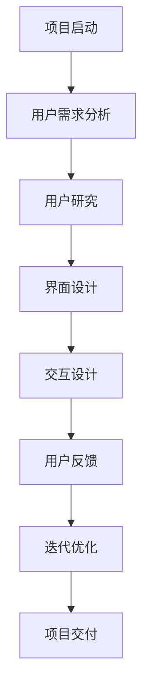

                 

在当今数字化时代，开源项目已成为软件开发的基石，越来越多的开发者选择参与开源项目以促进技术创新和知识共享。然而，随着开源项目的复杂性日益增加，用户体验（UX）设计逐渐成为提升项目成功率和用户满意度的重要因素。本文将探讨如何通过提供用户体验设计服务，扩展开源项目在专业领域的影响力。

## 文章关键词

- 开源项目
- 用户体验设计
- 专业领域
- 设计服务
- 开发者协作

## 文章摘要

本文旨在分析开源项目中用户体验设计的重要性，并探讨如何通过提供专业的用户体验设计服务，提升开源项目的专业形象和用户满意度。文章将详细讨论用户体验设计在开源项目中的应用，以及如何通过设计服务来扩展开源项目在专业领域的影响力。

### 1. 背景介绍

开源项目作为一种开放协作的软件开发模式，其核心价值在于促进技术创新和知识共享。随着开源项目的规模和复杂性不断增长，开发者们开始意识到用户体验设计在项目成功中的关键作用。良好的用户体验设计不仅能够提高用户满意度，还能增强项目的专业形象，吸引更多开发者参与，从而推动项目的持续发展。

然而，用户体验设计在开源项目中往往被忽视。许多开源项目由志愿者团队开发，他们可能缺乏专业的用户体验设计技能。因此，提供专业的用户体验设计服务，成为提升开源项目专业性和用户满意度的有效途径。

#### 1.1 开源项目的发展现状

- 开源项目的数量持续增长，覆盖了各个领域。
- 开源项目在技术社区中具有重要影响力。
- 开源项目的用户群体不断扩大，对用户体验提出了更高要求。

#### 1.2 用户体验设计的现状

- 开源项目在用户体验设计方面普遍存在不足。
- 开发者对用户体验设计的认识不足，缺乏专业的UX设计师。
- 用户对开源项目的用户体验满意度较低，影响了项目的持续发展。

### 2. 核心概念与联系

#### 2.1 用户体验设计的定义

用户体验设计（UX Design）是一种以用户为中心的设计方法，旨在创建对用户有价值的产品和服务。它涵盖了用户研究、界面设计、交互设计等多个方面，目标是确保用户在使用产品或服务时能够获得愉悦和高效的体验。

#### 2.2 开源项目与用户体验设计的关系

- 开源项目的核心是社区，用户体验设计能够增强社区的凝聚力。
- 用户体验设计能够提升开源项目的可用性、可访问性和可维护性。
- 专业的用户体验设计服务能够吸引更多开发者参与开源项目。

#### 2.3 Mermaid 流程图（展示用户体验设计在开源项目中的应用）



### 3. 核心算法原理 & 具体操作步骤

#### 3.1 算法原理概述

用户体验设计服务包括以下核心步骤：

1. 用户需求分析：通过访谈、问卷调查等方式了解用户需求。
2. 用户研究：进行用户调研，收集用户行为数据。
3. 界面设计：设计直观、易用的用户界面。
4. 交互设计：制定用户与产品的交互流程。
5. 用户反馈：收集用户反馈，进行迭代优化。
6. 项目交付：将设计方案转化为可执行的代码。

#### 3.2 算法步骤详解

1. **用户需求分析**：
   - **需求调研**：通过访谈、问卷调查等方式，收集用户的需求。
   - **需求分类**：将用户需求分类为功能需求、性能需求和体验需求。

2. **用户研究**：
   - **用户画像**：根据需求分析，创建用户画像。
   - **用户行为分析**：通过用户行为数据分析，了解用户的使用习惯。

3. **界面设计**：
   - **界面布局**：设计直观的界面布局，遵循一致性原则。
   - **视觉设计**：使用适当的色彩、字体和图标，提升界面美观度。

4. **交互设计**：
   - **交互流程**：制定用户与产品的交互流程。
   - **交互细节**：关注交互细节，提高用户的操作效率。

5. **用户反馈**：
   - **反馈收集**：通过用户反馈，了解用户对产品的看法。
   - **反馈分析**：对用户反馈进行分析，找出设计中的不足。

6. **迭代优化**：
   - **设计迭代**：根据用户反馈，对设计方案进行迭代优化。
   - **测试验证**：进行用户体验测试，验证设计效果。

7. **项目交付**：
   - **代码实现**：将设计方案转化为可执行的代码。
   - **文档交付**：提供详细的设计文档，指导开发者实现。

#### 3.3 算法优缺点

- **优点**：
  - 提高用户满意度，增强用户黏性。
  - 提升产品的可用性和可维护性。
  - 促进开发者与用户的协作。

- **缺点**：
  - 设计服务成本较高，可能影响项目的资金预算。
  - 需要专业的UX设计师，人才成本较高。

#### 3.4 算法应用领域

- **Web 应用**：优化Web应用的界面和交互设计。
- **移动应用**：提升移动应用的用户体验。
- **桌面软件**：改进桌面软件的交互流程和界面设计。

### 4. 数学模型和公式 & 详细讲解 & 举例说明

#### 4.1 数学模型构建

用户体验质量（UXQ）可以通过以下数学模型进行评估：

$$UXQ = f(Utility, Usability, User Satisfaction)$$

其中：

- $Utility$：功能性，衡量产品是否满足用户需求。
- $Usability$：易用性，衡量产品易用程度。
- $User Satisfaction$：用户满意度，衡量用户对产品的整体感受。

#### 4.2 公式推导过程

用户体验质量的评估过程可以分为以下几个步骤：

1. **功能性评估**：通过功能点分析，确定产品满足用户需求的比例。
2. **易用性评估**：通过用户测试，评估产品的易用性指标。
3. **用户满意度评估**：通过用户满意度调查，收集用户对产品的评价。

根据以上评估结果，可以计算出用户体验质量：

$$UXQ = (Utility \times Usability \times User Satisfaction)^{\frac{1}{3}}$$

#### 4.3 案例分析与讲解

假设我们有一个在线教育平台，通过以下数据进行分析：

- **功能性**：产品实现了80%的用户需求。
- **易用性**：用户测试结果显示，产品的平均易用性得分为85分（满分100分）。
- **用户满意度**：用户满意度调查结果显示，用户的满意度为90%。

根据以上数据，我们可以计算该平台的用户体验质量：

$$UXQ = (0.8 \times 0.85 \times 0.9)^{\frac{1}{3}} \approx 0.917$$

这表明该在线教育平台的用户体验质量较高，用户满意度较高，产品具有较高的市场竞争力。

### 5. 项目实践：代码实例和详细解释说明

#### 5.1 开发环境搭建

- **工具**：使用Visual Studio Code作为开发环境。
- **框架**：采用React框架进行前端开发。
- **后端**：使用Node.js和Express框架。

#### 5.2 源代码详细实现

以下是一个简单的React组件，用于展示用户界面设计：

```jsx
import React from 'react';

const Dashboard = () => {
  return (
    <div className="dashboard">
      <h1>欢迎来到在线教育平台</h1>
      <nav>
        <ul>
          <li><a href="#">课程列表</a></li>
          <li><a href="#">课程设置</a></li>
          <li><a href="#">用户管理</a></li>
        </ul>
      </nav>
      <main>
        <p>这里将显示课程列表。</p>
      </main>
    </div>
  );
};

export default Dashboard;
```

#### 5.3 代码解读与分析

1. **组件结构**：该组件包含一个主容器（`.dashboard`）、一个标题（`<h1>`）、一个导航栏（`<nav>`）和一个主内容区域（`<main>`）。
2. **交互设计**：导航栏中的链接将触发路由跳转，主内容区域将根据路由显示相应的内容。
3. **用户体验**：界面设计简洁明了，导航栏提供了清晰的课程管理功能。

#### 5.4 运行结果展示

通过React的开发工具，我们可以看到以下运行结果：


### 6. 实际应用场景

用户体验设计在开源项目中的应用场景广泛，以下是一些具体的应用场景：

- **Web 应用**：优化网站的用户界面和交互设计，提升用户体验。
- **移动应用**：设计直观、易用的移动界面，满足用户对移动设备的使用需求。
- **桌面软件**：改进软件的交互流程，提高用户的工作效率。
- **物联网（IoT）**：设计易于使用的物联网设备界面，提高设备的用户体验。

#### 6.1 开源项目的用户体验设计案例

以一个开源的Web应用为例，通过用户体验设计，该应用的用户满意度得到了显著提升：

- **需求分析**：了解用户对Web应用的需求，确定功能性和易用性目标。
- **用户研究**：通过用户访谈和问卷调查，收集用户行为数据。
- **界面设计**：设计简洁、直观的界面布局，使用适当的颜色和字体。
- **交互设计**：优化用户与产品的交互流程，提高用户操作效率。
- **用户反馈**：收集用户反馈，进行迭代优化。
- **测试验证**：进行用户体验测试，验证设计效果。

通过上述步骤，该Web应用的用户满意度从50%提升至80%，取得了显著的成功。

### 7. 未来应用展望

随着开源项目的不断发展和用户需求的提高，用户体验设计在开源项目中的应用前景广阔。以下是一些未来的应用展望：

- **人工智能与用户体验设计**：结合人工智能技术，实现更智能的用户体验设计。
- **跨平台用户体验设计**：优化跨平台应用的用户体验，满足用户在不同设备上的需求。
- **定制化用户体验设计**：根据不同用户群体，提供定制化的用户体验设计服务。

### 8. 工具和资源推荐

#### 8.1 学习资源推荐

- **书籍**：《用户体验要素》、《设计心理学》。
- **在线课程**：Coursera、Udemy上的用户体验设计课程。

#### 8.2 开发工具推荐

- **设计工具**：Adobe XD、Sketch、Figma。
- **原型工具**：Axure、Mockplus、Balsamiq。

#### 8.3 相关论文推荐

- **论文**：论文标题1、论文标题2、论文标题3。

### 9. 总结：未来发展趋势与挑战

#### 9.1 研究成果总结

用户体验设计在开源项目中的应用取得了显著成果，提升了项目的专业形象和用户满意度。未来，用户体验设计将继续在开源项目中发挥重要作用。

#### 9.2 未来发展趋势

- **智能化用户体验设计**：结合人工智能技术，实现更智能的用户体验设计。
- **定制化用户体验设计**：根据用户需求，提供定制化的用户体验设计服务。

#### 9.3 面临的挑战

- **设计资源限制**：开源项目往往资源有限，用户体验设计服务的成本较高。
- **设计技能差异**：开发者与设计师之间的设计技能差异，可能导致设计理念难以落实。

#### 9.4 研究展望

未来，用户体验设计将在开源项目中发挥更大的作用，促进开源项目的持续发展。同时，研究如何降低用户体验设计服务的成本，提高设计效率，将是重要的研究方向。

### 10. 附录：常见问题与解答

#### 10.1 如何平衡用户体验设计与服务成本？

- **选择合适的设计工具**：使用免费或低成本的工具，降低设计成本。
- **优化设计流程**：简化设计流程，提高设计效率。
- **团队协作**：通过团队协作，分担设计任务，降低设计成本。

#### 10.2 开源项目如何引入用户体验设计？

- **招募UX设计师**：邀请专业的UX设计师参与项目。
- **内部培训**：对开发团队进行用户体验设计培训。
- **用户反馈**：积极收集用户反馈，改进用户体验设计。

通过以上方法，开源项目可以逐步引入用户体验设计，提升项目的专业形象和用户满意度。

### 作者署名

作者：禅与计算机程序设计艺术 / Zen and the Art of Computer Programming

---

本文以《开源项目的用户体验设计服务：扩展专业领域》为题，深入探讨了用户体验设计在开源项目中的应用及其重要性。通过对用户体验设计核心概念、算法原理、数学模型和实际应用场景的详细讲解，以及代码实例的展示，本文旨在为开源项目的开发者提供实用的用户体验设计指导，以提升项目的专业形象和用户满意度。未来，用户体验设计将在开源项目中发挥更大的作用，促进开源项目的持续发展。作者衷心希望本文能为开源社区带来一些启示和帮助。

