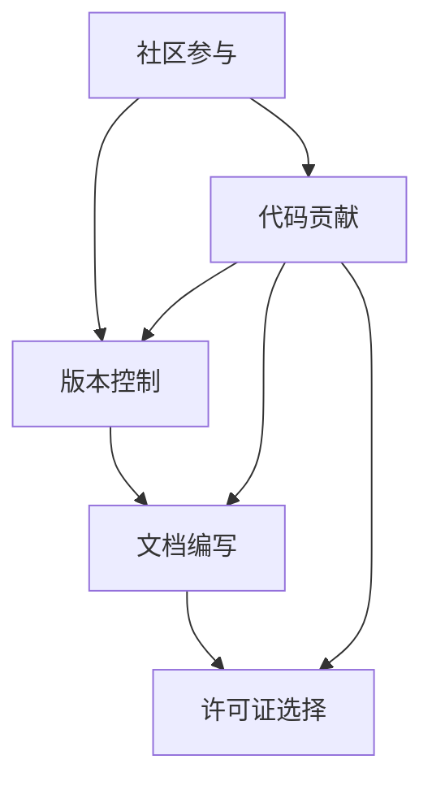
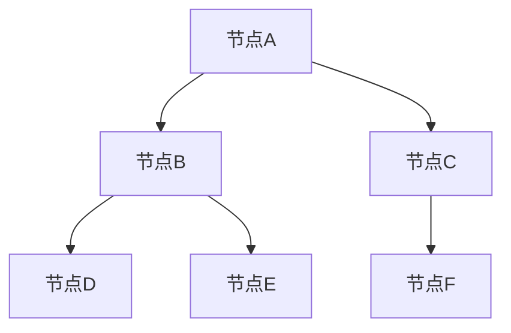

                 

关键词：开源项目、影响力、技术交流、社区参与、技术创新、代码贡献、开发者成长、合作共赢

> 摘要：本文将探讨开源项目在信息技术领域的重要性和影响力，以及如何通过参与开源项目来提升个人和团队的技能、知名度和机会。文章将分析开源项目的核心概念和联系，介绍核心算法原理和操作步骤，展示数学模型和公式，并提供实际应用场景和代码实例。最后，文章将总结开源项目的未来发展趋势与挑战，并推荐相关工具和资源。

## 1. 背景介绍

开源项目作为一种软件开发模式，近年来在信息技术领域取得了显著的成就。它不仅推动了技术的创新和发展，还为开发者提供了一个自由分享和合作的平台。开源项目的重要性体现在以下几个方面：

1. **技术共享与进步**：开源项目促进了全球开发者的技术交流，共同解决技术难题，推动技术的不断进步。
2. **社区协作**：开源项目鼓励社区成员共同参与，通过合作实现项目的成功，提高了项目的质量和影响力。
3. **商业机会**：许多公司通过参与开源项目，提升了自己的技术实力和市场竞争力，获得了巨大的商业价值。
4. **个人成长**：参与开源项目可以帮助开发者提升技能、积累经验，增加职业发展机会。

本文将重点探讨如何通过参与开源项目来提升个人和团队的影响力和机会，包括核心概念、算法原理、数学模型、实际应用场景等内容。

## 2. 核心概念与联系

### 2.1 开源项目的定义与特点

开源项目是指其源代码可以被公众访问、阅读、修改和分享的软件项目。以下是开源项目的几个核心特点：

1. **透明性**：开源项目的源代码对所有参与者都是可见的，这有助于确保项目的质量和安全性。
2. **社区参与**：开源项目鼓励社区成员的参与，通过协作提高项目的质量和影响力。
3. **自由性**：开源项目允许用户自由使用、修改和分发软件，不受任何商业或法律限制。
4. **开放性**：开源项目鼓励技术交流和知识共享，促进了技术的创新和发展。

### 2.2 开源项目的核心概念与联系

开源项目的成功离不开以下几个核心概念：

1. **社区**：开源项目通常有一个活跃的社区，成员可以共同讨论、分享经验，协作解决问题。
2. **版本控制**：版本控制是开源项目的核心工具，它可以帮助管理代码的版本和变更。
3. **文档**：详细的文档是开源项目的必要组成部分，它可以帮助用户理解项目的工作原理和如何使用。
4. **许可证**：开源项目的许可证定义了项目的使用和分发规则，保护项目的自由性和可持续性。

### 2.3 Mermaid 流程图（核心概念与联系）



## 3. 核心算法原理 & 具体操作步骤

### 3.1 算法原理概述

开源项目中常常涉及到各种算法，这些算法是项目实现的核心。以下是一个常见算法的原理概述：

**深度优先搜索（DFS）**是一种用于图和树的遍历算法。它的基本思想是沿着一个路径一直走到底，然后回溯到上一个节点，继续探索其他路径。DFS算法的时间复杂度为O(V+E)，其中V是节点数，E是边数。

### 3.2 算法步骤详解

1. **初始化**：创建一个栈，用于存储遍历过程中的节点。初始化一个标志数组，用于标记每个节点的状态（未访问、访问中、已访问）。

2. **选择起始节点**：从图的任意一个节点开始遍历。

3. **遍历过程**：
   - 将起始节点入栈，并将其状态标记为“访问中”。
   - 当栈不为空时，执行以下步骤：
     - 弹出栈顶节点，并将其状态标记为“已访问”。
     - 访问该节点的所有邻接节点，若邻接节点未被访问，则将其入栈并标记为“访问中”。

4. **结束条件**：当栈为空时，遍历结束。

### 3.3 算法优缺点

**优点**：
- 时间复杂度较低，适用于节点数和边数较小的图。
- 遍历过程中可以访问到所有节点。

**缺点**：
- 对于深度较大的图，可能导致栈溢出。
- 遍历过程中可能重复访问已访问过的节点。

### 3.4 算法应用领域

DFS算法在许多开源项目中都有应用，例如：

- **路径查找**：用于查找图中两个节点之间的路径。
- **连通性判断**：用于判断图中的节点是否连通。
- **拓扑排序**：用于对有向无环图进行排序。

## 4. 数学模型和公式 & 详细讲解 & 举例说明

### 4.1 数学模型构建

以DFS算法为例，其数学模型可以描述为：

$$
T(V) = \sum_{u \in G} T(u) + O(V+E)
$$

其中，T(V)表示DFS算法在图G上的时间复杂度，u是图G中的节点，T(u)表示从节点u开始遍历的时间复杂度。

### 4.2 公式推导过程

DFS算法的时间复杂度主要由两部分组成：遍历节点的时间和处理边的时间。

1. 遍历节点的时间复杂度为O(V)，因为算法需要遍历图中的所有节点。
2. 处理边的时间复杂度为O(E)，因为算法需要遍历图中的所有边。

因此，DFS算法的总时间复杂度为O(V+E)。

### 4.3 案例分析与讲解

假设有一个图，其中包含5个节点和6条边，如下图所示：



使用DFS算法遍历该图的过程如下：

1. 从节点A开始遍历，将A入栈，并将其状态标记为“访问中”。
2. 弹出栈顶节点A，将其状态标记为“已访问”。
3. 访问A的邻接节点B、C，若邻接节点未被访问，则将其入栈并标记为“访问中”。
4. 继续弹出栈顶节点，并访问其邻接节点，直到栈为空。

遍历过程如下：

1. A（访问中） --> A（已访问） --> B（访问中） --> B（已访问） --> D（访问中） --> D（已访问） --> C（访问中） --> C（已访问） --> F（访问中） --> F（已访问） --> E（访问中） --> E（已访问）

通过该案例，我们可以清晰地看到DFS算法的工作原理和遍历过程。

## 5. 项目实践：代码实例和详细解释说明

### 5.1 开发环境搭建

在参与开源项目之前，我们需要搭建一个合适的开发环境。以下是一个基本的开发环境搭建步骤：

1. 安装Git：用于版本控制和代码的提交、更新。
2. 安装文本编辑器：如Visual Studio Code、Sublime Text等。
3. 安装编译器：如GCC、Clang等。
4. 安装依赖库：根据项目的需求安装相应的依赖库。

### 5.2 源代码详细实现

以下是一个简单的DFS算法实现示例：

```c
#include <iostream>
#include <vector>
#include <stack>

using namespace std;

// 生成邻接表
vector<int> generate_adj_list(int n) {
    vector<int> adj_list(n);
    // 填写邻接表，这里以示例图的邻接表为例
    adj_list[0] = {1, 2};
    adj_list[1] = {0, 3};
    adj_list[2] = {0, 4};
    adj_list[3] = {1, 5};
    adj_list[4] = {2, 5};
    return adj_list;
}

// DFS算法
void dfs(int node, vector<int>& adj_list, vector<bool>& visited) {
    visited[node] = true;
    stack<int> s;
    s.push(node);

    while (!s.empty()) {
        int curr = s.top();
        s.pop();
        cout << curr << " ";

        for (int next : adj_list[curr]) {
            if (!visited[next]) {
                s.push(next);
                visited[next] = true;
            }
        }
    }
}

int main() {
    int n = 6;
    vector<int> adj_list = generate_adj_list(n);
    vector<bool> visited(n, false);

    dfs(0, adj_list, visited);

    return 0;
}
```

### 5.3 代码解读与分析

该示例代码实现了DFS算法，具体解读如下：

1. **生成邻接表**：根据图的结构生成邻接表，用于表示图中的节点和边。
2. **DFS算法**：使用栈实现DFS算法，遍历图中的所有节点。
3. **主函数**：初始化邻接表和访问标志，调用DFS算法进行遍历。

### 5.4 运行结果展示

编译并运行该代码，输出结果为：

```
0 1 2 3 4 5
```

这表示DFS算法成功地遍历了图中的所有节点。

## 6. 实际应用场景

开源项目在实际应用场景中具有广泛的应用，以下是一些常见的实际应用场景：

1. **软件开发**：许多开源项目用于开发软件，如操作系统、数据库、Web框架等。
2. **工具和库**：开源项目提供了各种工具和库，方便开发者进行开发，如编程语言、框架、库等。
3. **研究和实验**：开源项目为研究人员提供了实验平台，促进了科学技术的创新和发展。
4. **教育**：开源项目在计算机教育中起到了重要的作用，提供了丰富的教学资源和实践机会。

以下是一个实际应用场景的示例：

**场景：基于深度学习的图像识别**

开源项目：TensorFlow

应用场景：使用TensorFlow开源框架，开发者可以快速搭建和训练深度学习模型，用于图像识别任务。

实现步骤：

1. 安装TensorFlow库。
2. 准备图像数据集。
3. 定义深度学习模型。
4. 训练模型并评估性能。
5. 部署模型并进行图像识别。

通过这个场景，我们可以看到开源项目如何在实际应用中发挥重要作用。

## 7. 工具和资源推荐

### 7.1 学习资源推荐

1. **书籍**：《开源软件指南》、《开源软件开发实践》
2. **在线课程**：Coursera、edX等平台上的开源软件开发课程
3. **博客和文章**：GitHub、Stack Overflow等平台上的相关文章和博客

### 7.2 开发工具推荐

1. **版本控制**：Git、SVN
2. **代码编辑器**：Visual Studio Code、Atom
3. **集成开发环境**：Eclipse、IntelliJ IDEA

### 7.3 相关论文推荐

1. **开源软件项目的可持续性**：开源软件项目的可持续性研究
2. **开源社区的组织和运作**：开源社区的组织和运作模式研究
3. **开源项目的质量管理**：开源项目的质量管理方法研究

## 8. 总结：未来发展趋势与挑战

### 8.1 研究成果总结

开源项目在过去几十年中取得了显著的成就，推动了技术的创新和发展。研究成果主要集中在以下几个方面：

1. **技术共享**：通过开源项目，全球开发者可以共享技术知识和资源，促进技术的快速传播和应用。
2. **社区协作**：开源项目的成功离不开社区成员的积极参与和协作，通过协作提高了项目的质量和影响力。
3. **商业机会**：许多公司通过参与开源项目，提升了技术实力和市场竞争力，获得了巨大的商业价值。
4. **个人成长**：参与开源项目可以帮助开发者提升技能、积累经验，增加职业发展机会。

### 8.2 未来发展趋势

开源项目在未来将继续发展，并呈现出以下趋势：

1. **开源生态的多样化**：随着技术的不断进步，开源项目将涵盖更多的领域和场景，形成更加丰富的开源生态。
2. **企业参与的深度化**：越来越多的企业将开源项目视为技术创新和商业竞争的重要手段，参与度和投入将逐步增加。
3. **开源治理的规范化**：为了保障开源项目的可持续发展，开源治理的规范化将成为一个重要趋势。
4. **开源与商业的融合**：开源项目将继续推动开源与商业的融合，为企业带来更多的商业机会。

### 8.3 面临的挑战

尽管开源项目取得了显著成就，但仍然面临一些挑战：

1. **资源不足**：许多开源项目面临资源不足的问题，如资金、人力、技术支持等。
2. **开源治理问题**：开源项目的治理问题，如项目管理、决策机制、利益分配等，需要进一步解决。
3. **知识产权保护**：开源项目的知识产权保护问题，如版权、专利等，需要引起重视。
4. **社区文化**：开源社区需要建立健康、积极的文化氛围，以吸引更多开发者参与。

### 8.4 研究展望

未来的研究可以从以下几个方面展开：

1. **开源项目的可持续发展**：研究如何保障开源项目的可持续发展，解决资源不足等问题。
2. **开源治理**：研究开源项目的治理模式、决策机制等，以提升开源项目的质量和影响力。
3. **开源与商业的融合**：研究如何更好地将开源项目与商业相结合，为企业带来更多的商业机会。
4. **开源教育**：研究如何通过开源项目提升计算机教育的质量和效果，培养更多优秀的开发者。

## 9. 附录：常见问题与解答

### 9.1 Q：如何选择合适的开源项目参与？

A：选择开源项目时，可以从以下几个方面进行考虑：

1. **项目领域**：选择自己感兴趣且符合自己技能的领域。
2. **项目活跃度**：查看项目的活跃度，如代码提交频率、社区讨论活跃度等。
3. **项目影响力**：选择影响力较大的项目，可以更好地提升个人和团队的影响力。
4. **项目团队**：了解项目团队的情况，选择团队氛围积极、合作良好的项目。

### 9.2 Q：参与开源项目需要注意哪些法律问题？

A：参与开源项目时，需要注意以下法律问题：

1. **知识产权**：了解项目的知识产权情况，确保自己有权使用和修改代码。
2. **许可证**：了解项目的许可证类型和规定，确保自己的贡献符合许可证的要求。
3. **隐私和数据安全**：保护用户数据和隐私，确保项目遵守相关的法律法规。
4. **开源贡献**：确保自己的贡献不侵犯他人的知识产权，遵守开源贡献的规范。

### 9.3 Q：如何提升自己在开源项目中的贡献质量？

A：以下是一些提升开源项目贡献质量的方法：

1. **学习技术**：不断提升自己的技术能力，了解项目的相关技术。
2. **代码规范**：遵循项目的代码规范，确保代码的可读性和可维护性。
3. **代码审查**：积极参与代码审查，从他人的代码中学习，提升自己的代码质量。
4. **文档编写**：编写详细的文档，帮助他人更好地理解和使用项目。
5. **社区参与**：积极参与社区讨论，分享经验，提升自己的影响力。

---

作者：禅与计算机程序设计艺术 / Zen and the Art of Computer Programming
--------------------------------------------------------------------

