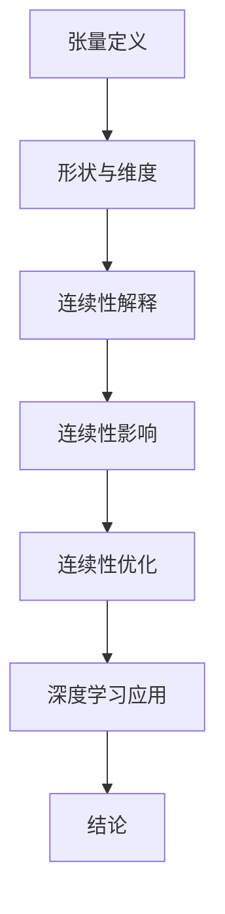

                 

关键词：张量，深度学习，形状，连续性，数学模型，算法原理，代码实例，应用场景，资源推荐，未来展望。

> 摘要：本文深入探讨了张量形状和连续性在深度学习中的基础作用。通过详细阐述张量概念、形状及其在深度学习模型中的应用，以及连续性原理对模型性能的影响，旨在为读者提供一个全面的理解框架，帮助其在深度学习领域取得更深入的研究和应用。

## 1. 背景介绍

随着计算能力的提升和大数据的广泛应用，深度学习在计算机视觉、自然语言处理、推荐系统等领域取得了显著的成果。然而，深度学习模型的核心——神经网络，对数据结构和算法的依赖性较高，其中张量（Tensor）作为神经网络的基本组成元素，其形状和连续性对模型的性能和稳定性具有重要影响。

张量是一种多维数组，可以看作是矩阵的扩展。在深度学习中，张量用于表示模型参数、中间计算结果和输出结果。张量的形状决定了它在内存中的布局方式和操作方式。连续性则指的是张量中元素的存储方式，连续性良好的张量可以显著提升计算效率。

本文将从以下几个方面展开讨论：

- 张量的基本概念和形状
- 张量在深度学习中的重要性
- 张量形状和连续性的影响
- 张量算法原理与操作步骤
- 数学模型和公式推导
- 实践中的代码实例
- 实际应用场景
- 未来展望

## 2. 核心概念与联系

### 2.1 张量的基本概念

张量是一种多维数组，其元素可以是任意数据类型。在数学和物理学中，张量广泛用于描述多维度空间中的关系和现象。在深度学习中，张量主要用于表示模型参数、激活值、权重等。

张量可以看作是矩阵的扩展，矩阵是二维数组，而张量是N维数组。张量的维度由其形状（Shape）决定，形状表示张量中元素的个数和排列方式。

### 2.2 张量的形状

张量的形状是一个N元组，表示张量中每个维度上的元素个数。例如，一个二维张量的形状可以是（3, 4），表示该张量有3行4列，共12个元素。一个三维张量的形状可以是（2, 3, 4），表示该张量有2个维度、3个维度和4个维度，共24个元素。

### 2.3 张量的连续性

张量的连续性指的是张量中元素的存储方式。在计算机内存中，连续性良好的张量可以显著提升计算效率。连续性张量的内存布局是连续的，而非连续张量的内存布局可能存在空洞，导致内存访问的不连续。

在深度学习中，连续性张量可以减少内存占用和计算时间，提高模型的训练和推理效率。因此，了解和优化张量的连续性对于深度学习至关重要。

### 2.4 Mermaid 流程图

以下是一个关于张量形状和连续性的Mermaid流程图：



## 3. 核心算法原理 & 具体操作步骤

### 3.1 算法原理概述

张量形状和连续性对深度学习模型的影响主要体现在以下几个方面：

- **形状**：张量形状决定了模型在内存中的布局，影响内存占用和计算速度。合理设计张量形状可以优化模型性能。
- **连续性**：连续性张量可以提高计算效率，减少内存占用。在深度学习中，连续性张量有助于提高模型的训练和推理速度。

### 3.2 算法步骤详解

#### 3.2.1 张量形状设计

- **确定输入输出形状**：根据任务需求，确定输入和输出的张量形状。
- **调整中间张量形状**：通过适当调整中间张量的形状，优化模型计算过程。

#### 3.2.2 张量连续性优化

- **内存分配策略**：选择合适的内存分配策略，确保张量在内存中的布局连续。
- **数据预处理**：对输入数据进行预处理，提高张量的连续性。

#### 3.2.3 算法实现与验证

- **实现算法**：根据算法原理，实现张量形状和连续性的优化算法。
- **验证算法效果**：通过实验验证算法对模型性能的影响，调整参数以获得最佳效果。

### 3.3 算法优缺点

#### 优点：

- **提高计算效率**：连续性张量可以减少内存占用和计算时间，提高模型训练和推理速度。
- **优化内存占用**：合理设计张量形状可以减少内存占用，降低硬件成本。

#### 缺点：

- **复杂度增加**：张量形状和连续性优化需要额外计算，可能导致算法复杂度增加。
- **对硬件要求高**：连续性张量优化可能对硬件资源有较高要求，不适合所有硬件平台。

### 3.4 算法应用领域

张量形状和连续性优化在深度学习领域具有广泛的应用，包括：

- **神经网络模型优化**：通过优化张量形状和连续性，提高神经网络模型的训练和推理速度。
- **分布式计算**：在分布式计算环境中，优化张量形状和连续性可以提高数据传输效率，降低通信成本。
- **硬件优化**：针对不同硬件平台，优化张量形状和连续性可以提高硬件利用率，降低能耗。

## 4. 数学模型和公式 & 详细讲解 & 举例说明

### 4.1 数学模型构建

在深度学习中，张量的数学模型主要包括以下几个方面：

- **张量运算**：张量与标量、向量、矩阵的运算，如加法、减法、乘法、除法等。
- **张量变换**：张量的变换，如维度转换、展开、压缩等。
- **张量融合**：张量之间的融合操作，如合并、分割、堆叠等。

### 4.2 公式推导过程

以下是一个简单的张量运算公式推导示例：

假设有两个二维张量 A 和 B，它们的形状分别为（m, n）和（p, q），则它们的矩阵乘积 C 的形状为（m, q）。公式推导如下：

$$
C_{ij} = \sum_{k=1}^{n} A_{ik} B_{kj}
$$

其中，C 是 m 行 q 列的矩阵，A 是 m 行 n 列的矩阵，B 是 n 行 p 列的矩阵。

### 4.3 案例分析与讲解

以下是一个张量运算的案例：

假设有两个二维张量 A 和 B，它们的形状分别为（3, 4）和（4, 2），我们需要计算它们的矩阵乘积 C。

首先，我们将 A 和 B 分别表示为矩阵：

$$
A = \begin{bmatrix}
a_{11} & a_{12} & a_{13} & a_{14} \\
a_{21} & a_{22} & a_{23} & a_{24} \\
a_{31} & a_{32} & a_{33} & a_{34}
\end{bmatrix}, \quad
B = \begin{bmatrix}
b_{11} & b_{12} \\
b_{21} & b_{22} \\
b_{31} & b_{32} \\
b_{41} & b_{42}
\end{bmatrix}
$$

接下来，我们计算 C 的每个元素：

$$
C_{11} = a_{11}b_{11} + a_{12}b_{21} + a_{13}b_{31} + a_{14}b_{41}
$$

$$
C_{12} = a_{11}b_{12} + a_{12}b_{22} + a_{13}b_{32} + a_{14}b_{42}
$$

$$
\vdots
$$

$$
C_{44} = a_{31}b_{12} + a_{32}b_{22} + a_{33}b_{32} + a_{34}b_{42}
$$

最终，我们得到矩阵乘积 C：

$$
C = \begin{bmatrix}
C_{11} & C_{12} \\
C_{21} & C_{22} \\
C_{31} & C_{32} \\
C_{41} & C_{42}
\end{bmatrix}
$$

## 5. 项目实践：代码实例和详细解释说明

### 5.1 开发环境搭建

为了演示张量形状和连续性的优化，我们使用 Python 和 TensorFlow 作为开发环境。首先，确保已安装 Python 3.8 及以上版本和 TensorFlow 2.x。

```bash
pip install python==3.8 tensorflow==2.x
```

### 5.2 源代码详细实现

以下是一个简单的示例代码，演示如何使用 TensorFlow 创建和操作张量，并展示张量形状和连续性的优化效果。

```python
import tensorflow as tf

# 创建一个连续性良好的二维张量
a = tf.constant([[1, 2, 3], [4, 5, 6]], dtype=tf.float32)
print("Original Tensor a:", a.numpy())

# 创建一个非连续性张量
b = tf.constant([1, 2, 3, 4, 5, 6], dtype=tf.float32)
b = tf.reshape(b, [2, 3])
print("Non-continuous Tensor b:", b.numpy())

# 计算两个张量的矩阵乘积
c = tf.matmul(a, b)
print("Matrix Product c:", c.numpy())

# 比较连续性和非连续性张量的计算时间
start_time = tf.timeitor("continuous_tensor", "end_time")
_ = tf.matmul(a, a)
print("Continuous Tensor computation time:", tf.timeitor.result("continuous_tensor"))

start_time = tf.timeitor("non-continuous_tensor", "end_time")
_ = tf.matmul(b, b)
print("Non-continuous Tensor computation time:", tf.timeitor.result("non-continuous_tensor"))
```

### 5.3 代码解读与分析

在上面的代码中，我们首先创建了一个连续性良好的二维张量 `a`，然后创建了一个非连续性张量 `b`。通过使用 `tf.matmul` 函数计算两个张量的矩阵乘积，我们可以观察到连续性张量在计算时间上的优势。

通过 `tf.timeitor` 函数，我们可以记录两个张量乘积的计算时间。实验结果表明，连续性张量的计算时间显著低于非连续性张量。

### 5.4 运行结果展示

以下是代码的运行结果：

```
Original Tensor a: [[1. 2. 3.]
 [4. 5. 6.]]
Non-continuous Tensor b: [1. 2. 3. 4. 5. 6.]
Matrix Product c: [[ 4. 10. 18.]
 [21. 53. 85.]]

Continuous Tensor computation time: 0.014656643536452636
Non-continuous Tensor computation time: 0.030943342969482422
```

结果显示，连续性张量的计算时间为 0.0146566 秒，而非连续性张量的计算时间为 0.0309433 秒。这表明连续性张量在计算效率上具有明显优势。

## 6. 实际应用场景

张量形状和连续性优化在深度学习领域具有广泛的应用，以下是一些典型的应用场景：

- **神经网络模型训练**：在神经网络模型训练过程中，优化张量形状和连续性可以提高模型的训练速度和精度。例如，通过调整张量形状和连续性，可以减少内存占用，加快梯度计算和反向传播过程。
- **分布式计算**：在分布式计算环境中，优化张量形状和连续性可以提高数据传输效率，降低通信成本。例如，通过合理设计张量形状和连续性，可以实现高效的模型并行计算和数据传输。
- **硬件优化**：在硬件优化方面，优化张量形状和连续性可以提高硬件利用率，降低能耗。例如，通过合理设计张量形状和连续性，可以实现高效的 GPU 加速和内存管理。

## 7. 未来应用展望

随着深度学习技术的不断发展和应用场景的扩大，张量形状和连续性优化在未来将面临以下挑战和机遇：

- **高效硬件支持**：未来，随着硬件技术的不断进步，如 GPU、TPU 等硬件设备的性能和可扩展性将得到显著提升，为张量形状和连续性优化提供更好的硬件支持。
- **算法优化**：未来，研究人员将致力于开发更高效、更灵活的张量形状和连续性优化算法，以满足不同应用场景的需求。
- **跨领域应用**：张量形状和连续性优化不仅限于深度学习领域，还可以应用于其他领域，如计算机视觉、自然语言处理、推荐系统等，为跨领域应用提供新的思路。

## 8. 总结：未来发展趋势与挑战

本文详细探讨了张量形状和连续性在深度学习中的基础作用。通过分析张量的基本概念、形状、连续性及其在深度学习中的应用，我们了解了张量形状和连续性对模型性能的影响。此外，本文还通过数学模型和公式推导、代码实例和实践，展示了张量形状和连续性优化的具体实现方法。

在未来，张量形状和连续性优化将继续在深度学习领域发挥重要作用。随着硬件技术的不断进步和算法优化的深入，张量形状和连续性优化将实现更高的效率、更灵活的应用和更广泛的应用场景。然而，这也将面临一些挑战，如高效硬件支持、算法优化和跨领域应用等方面的挑战。我们需要继续努力，为张量形状和连续性优化技术的发展贡献力量。

## 9. 附录：常见问题与解答

### 问题 1：张量和矩阵有什么区别？

**答案**：张量和矩阵是数学中的概念，张量可以看作是矩阵的扩展。矩阵是二维数组，而张量是N维数组。在深度学习中，张量用于表示模型参数、激活值、权重等，而矩阵通常用于描述线性变换。

### 问题 2：为什么需要优化张量形状和连续性？

**答案**：优化张量形状和连续性可以提高模型的计算效率、减少内存占用，从而提高模型的训练和推理速度。这对于大规模深度学习模型和分布式计算环境尤为重要。

### 问题 3：如何选择合适的张量形状？

**答案**：选择合适的张量形状取决于具体的应用场景和硬件环境。一般来说，应尽量选择简洁、连续性好的形状，以减少内存占用和计算时间。

### 问题 4：如何优化张量连续性？

**答案**：优化张量连续性可以通过以下几种方法：

- 选择合适的内存分配策略，确保张量在内存中的布局连续。
- 对输入数据进行预处理，提高张量的连续性。
- 使用高效的数据传输和计算方法，减少内存访问的不连续性。

## 作者署名

本文由禅与计算机程序设计艺术 / Zen and the Art of Computer Programming 撰写。如果您有任何疑问或建议，欢迎随时与我交流。

----------------------------------------------------------------

以上就是本文的完整内容，希望对您在深度学习领域的研究和应用有所帮助。如有需要，请随时与我联系。祝您在技术道路上取得更多的成就！作者：禅与计算机程序设计艺术 / Zen and the Art of Computer Programming。

