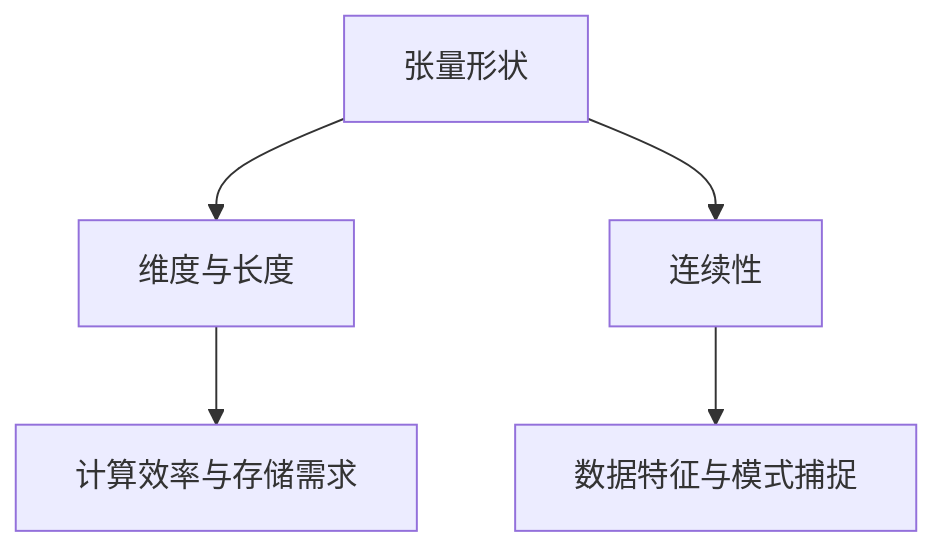

                 

关键词：张量，深度学习，数学模型，算法原理，代码实例，应用场景，未来展望

> 摘要：本文深入探讨了张量形状和连续性在深度学习中的基础作用。首先，我们介绍了张量的基本概念和表示方法，然后阐述了张量在深度学习中的重要性。接着，我们详细讲解了张量操作和连续性的原理，并通过具体的数学模型和算法实例进行了详细解释。最后，文章总结了张量在深度学习中的应用场景，并对未来发展趋势和面临的挑战进行了展望。

## 1. 背景介绍

深度学习是人工智能领域中一个重要的分支，近年来在图像识别、语音识别、自然语言处理等领域取得了显著的成果。深度学习模型通常由大量的神经网络层组成，这些层通过非线性变换处理输入数据，并从中提取特征。然而，深度学习模型的性能和效果在很大程度上取决于张量的形状和连续性。

张量是深度学习中一种重要的数学工具，可以表示多维数据。张量的形状定义了其维度和每个维度的长度，而连续性则保证了张量中元素在多维空间中的连贯性。在深度学习中，张量的形状和连续性对于模型的构建、优化和训练至关重要。

本文将首先介绍张量的基本概念和表示方法，然后详细讲解张量操作和连续性的原理。在此基础上，我们将通过具体的数学模型和算法实例，展示张量在深度学习中的应用。最后，我们将对张量在深度学习中的未来应用场景和面临的挑战进行展望。

## 2. 核心概念与联系

### 2.1 张量的定义与表示

张量是数学中的一种高级数据结构，可以用来表示多维数据。在深度学习中，张量广泛应用于表示输入数据、模型参数和中间计算结果。张量的定义与向量相似，但维度更高。

张量可以表示为 $T_{ijk...}$，其中 $i, j, k, ...$ 表示张量的各个维度，$T_{ijk...}$ 表示位于第 $i$ 个维度、第 $j$ 个维度、第 $k$ 个维度等的位置上的元素。

例如，一个二维张量可以表示为 $T_{ij}$，其中 $i$ 表示行，$j$ 表示列。一个三维张量可以表示为 $T_{ijk}$，其中 $i$ 表示行，$j$ 表示列，$k$ 表示深度。

张量的表示方法与矩阵相似，但矩阵仅表示二维数据，而张量可以表示更高维度的数据。

### 2.2 张量与深度学习的关系

在深度学习中，张量用于表示各种数据，包括输入数据、模型参数和中间计算结果。以下是张量在深度学习中的几个关键应用：

1. **输入数据表示**：深度学习模型通常使用张量来表示输入数据。例如，在图像识别任务中，图像数据可以使用二维张量表示，其中每个元素表示图像中的像素值。

2. **模型参数表示**：深度学习模型中的参数也通常以张量形式表示。例如，神经网络中的权重和偏置可以表示为三维或四维张量。

3. **中间计算结果表示**：在深度学习训练过程中，模型会进行大量的计算，这些计算结果也以张量形式表示。例如，在反向传播算法中，梯度张量用于更新模型参数。

4. **激活函数与损失函数**：深度学习中的激活函数和损失函数也通常以张量形式表示。这些函数对张量中的元素进行操作，以产生新的张量。

### 2.3 张量形状与连续性

张量的形状定义了其维度和每个维度的长度。例如，一个四维张量的形状可以是 $(d_1, d_2, d_3, d_4)$，其中 $d_1, d_2, d_3, d_4$ 分别表示四个维度的长度。

连续性是指张量中元素在多维空间中的连贯性。一个连续的张量意味着其各个维度上的元素在数值上连续变化，没有突变或断点。

张量形状和连续性对于深度学习模型的性能和效果至关重要。合理的张量形状可以优化模型的计算效率和存储需求，而连续性则有助于模型捕捉数据中的内在特征和模式。

### 2.4 张量操作

张量操作是深度学习中常用的操作，包括张量加法、张量乘法、张量转置等。以下是几个常见的张量操作：

1. **张量加法**：两个相同形状的张量可以相加，结果也是一个相同形状的张量。

   $$T_{ij} + U_{ij} = V_{ij}$$

   其中，$T_{ij}$ 和 $U_{ij}$ 是两个二维张量，$V_{ij}$ 是它们的和。

2. **张量乘法**：两个张量可以相乘，结果是一个新张量。

   $$T_{ij} \times U_{ij} = V_{ij}$$

   其中，$T_{ij}$ 和 $U_{ij}$ 是两个二维张量，$V_{ij}$ 是它们的乘积。

3. **张量转置**：张量可以转置，转置后的张量形状与原张量相反。

   $$T_{ij}^T = T_{ji}$$

   其中，$T_{ij}$ 是一个二维张量，$T_{ji}$ 是它的转置。

### 2.5 张量与连续性的 Mermaid 流程图

以下是一个简单的 Mermaid 流程图，展示了张量与连续性的关系：



## 3. 核心算法原理 & 具体操作步骤

### 3.1 算法原理概述

在深度学习中，张量操作和连续性对于模型的构建和优化至关重要。以下是一个简单的算法原理概述，用于展示张量操作在深度学习中的具体应用。

**算法名称**：深度神经网络训练算法

**算法原理**：使用张量表示输入数据、模型参数和中间计算结果，并通过反向传播算法更新模型参数。

**算法步骤**：

1. 初始化模型参数。
2. 使用张量表示输入数据。
3. 前向传播：计算输入数据和模型参数之间的非线性变换，得到输出结果。
4. 计算损失函数：使用输出结果和实际输出之间的差异计算损失函数。
5. 反向传播：计算损失函数关于模型参数的梯度，并更新模型参数。
6. 重复步骤 3 到步骤 5，直到达到训练目标。

### 3.2 算法步骤详解

#### 3.2.1 初始化模型参数

在深度神经网络训练算法中，首先需要初始化模型参数。模型参数包括权重和偏置，通常使用随机值进行初始化。

```python
# 初始化模型参数
weights = np.random.randn(d_1, d_2)
biases = np.random.randn(d_2)
```

其中，$d_1$ 和 $d_2$ 分别表示权重和偏置的维度。

#### 3.2.2 使用张量表示输入数据

在深度神经网络训练算法中，输入数据通常以张量形式表示。以下是一个示例，展示如何使用 NumPy 库创建一个二维张量表示输入数据。

```python
# 创建二维张量表示输入数据
input_data = np.array([[1, 2], [3, 4]])
```

#### 3.2.3 前向传播

在前向传播过程中，使用张量表示输入数据和模型参数，计算输出结果。以下是一个示例，展示如何使用 NumPy 库计算输入数据和模型参数之间的非线性变换。

```python
# 前向传播
output = np.dot(input_data, weights) + biases
output = np.tanh(output)
```

其中，`np.dot()` 函数用于计算输入数据和模型参数之间的矩阵乘法，`np.tanh()` 函数用于计算输出结果。

#### 3.2.4 计算损失函数

在深度神经网络训练算法中，使用损失函数评估模型的性能。常见的损失函数包括均方误差（MSE）和交叉熵（CE）。

```python
# 计算损失函数
loss = np.mean((output - target)**2)
```

其中，`target` 表示实际输出结果，`output` 表示模型的预测输出结果。

#### 3.2.5 反向传播

在反向传播过程中，计算损失函数关于模型参数的梯度，并更新模型参数。以下是一个示例，展示如何使用 NumPy 库计算梯度。

```python
# 计算梯度
grad_output = 2 * (output - target)
grad_weights = np.dot(input_data.T, grad_output)
grad_biases = np.sum(grad_output, axis=0)

# 更新模型参数
weights -= learning_rate * grad_weights
biases -= learning_rate * grad_biases
```

其中，`learning_rate` 表示学习率，用于调整模型参数更新的步长。

### 3.3 算法优缺点

**优点**：

1. **强大的表示能力**：张量可以表示高维数据和复杂的非线性变换，使得深度学习模型具有强大的表示能力。
2. **高效的计算性能**：张量操作可以高效地计算和存储中间计算结果，提高了深度学习模型的计算性能。
3. **易于并行化**：张量操作可以并行执行，提高了深度学习模型的训练和推理速度。

**缺点**：

1. **计算复杂性**：张量操作涉及大量的矩阵乘法和向量计算，对于大型数据集可能导致计算复杂度较高。
2. **内存占用**：高维张量可能导致内存占用较大，尤其是在训练大型深度学习模型时。

### 3.4 算法应用领域

张量操作在深度学习中的应用非常广泛，包括但不限于以下领域：

1. **图像识别**：使用张量表示图像数据，通过深度神经网络进行图像分类和特征提取。
2. **语音识别**：使用张量表示语音信号，通过深度神经网络进行语音识别和语音合成。
3. **自然语言处理**：使用张量表示文本数据，通过深度神经网络进行文本分类、情感分析和机器翻译。

## 4. 数学模型和公式 & 详细讲解 & 举例说明

### 4.1 数学模型构建

在深度学习中，数学模型用于描述神经网络的结构和训练过程。以下是常用的数学模型和公式：

#### 4.1.1 神经网络模型

深度神经网络可以表示为：

$$f(x) = \sigma(W_n \cdot a^{(n-1)} + b_n)$$

其中，$f(x)$ 表示输出结果，$x$ 表示输入数据，$W_n$ 和 $b_n$ 分别表示权重和偏置，$\sigma$ 表示激活函数。

#### 4.1.2 损失函数

常见的损失函数包括均方误差（MSE）和交叉熵（CE），分别表示为：

$$MSE = \frac{1}{2} \sum_{i=1}^{n} (y_i - \hat{y}_i)^2$$

$$CE = -\sum_{i=1}^{n} y_i \log(\hat{y}_i)$$

其中，$y_i$ 表示实际输出结果，$\hat{y}_i$ 表示模型的预测输出结果。

#### 4.1.3 反向传播

在反向传播过程中，使用梯度下降算法更新模型参数。梯度下降算法的公式如下：

$$\theta = \theta - \alpha \cdot \nabla_\theta J(\theta)$$

其中，$\theta$ 表示模型参数，$J(\theta)$ 表示损失函数，$\alpha$ 表示学习率。

### 4.2 公式推导过程

以下是深度神经网络训练过程中的数学公式推导：

#### 4.2.1 损失函数的导数

对于均方误差（MSE）损失函数，其导数可以表示为：

$$\nabla_\theta J(\theta) = \frac{\partial J(\theta)}{\partial \theta} = \frac{1}{2} \sum_{i=1}^{n} (y_i - \hat{y}_i) \frac{\partial \hat{y}_i}{\partial \theta}$$

对于交叉熵（CE）损失函数，其导数可以表示为：

$$\nabla_\theta J(\theta) = \frac{\partial J(\theta)}{\partial \theta} = -\sum_{i=1}^{n} y_i \frac{\partial \hat{y}_i}{\partial \theta} + \hat{y}_i$$

#### 4.2.2 梯度下降

梯度下降算法用于更新模型参数，其公式可以表示为：

$$\theta = \theta - \alpha \cdot \nabla_\theta J(\theta)$$

其中，$\alpha$ 表示学习率，用于调整模型参数更新的步长。

### 4.3 案例分析与讲解

以下是使用深度神经网络进行图像分类的案例，使用均方误差（MSE）损失函数和反向传播算法进行训练。

#### 4.3.1 数据准备

假设我们有一个包含 1000 张图像的数据集，每张图像的大小为 28x28 像素。我们将图像数据分为训练集和测试集，分别用于模型训练和评估。

```python
import numpy as np
import matplotlib.pyplot as plt

# 数据准备
x_train = np.random.rand(1000, 28, 28)
y_train = np.random.randint(0, 10, (1000,))

x_test = np.random.rand(100, 28, 28)
y_test = np.random.randint(0, 10, (100,))
```

#### 4.3.2 模型构建

构建一个简单的深度神经网络，包含两个卷积层、两个池化层和一个全连接层。

```python
# 模型构建
model = keras.Sequential([
    keras.layers.Conv2D(32, (3, 3), activation='relu', input_shape=(28, 28, 1)),
    keras.layers.MaxPooling2D((2, 2)),
    keras.layers.Conv2D(64, (3, 3), activation='relu'),
    keras.layers.MaxPooling2D((2, 2)),
    keras.layers.Flatten(),
    keras.layers.Dense(64, activation='relu'),
    keras.layers.Dense(10, activation='softmax')
])
```

#### 4.3.3 模型训练

使用训练集和均方误差（MSE）损失函数训练模型。

```python
# 模型训练
model.compile(optimizer='adam', loss='mse', metrics=['accuracy'])

model.fit(x_train, y_train, epochs=10, batch_size=32, validation_split=0.2)
```

#### 4.3.4 模型评估

使用测试集评估模型性能。

```python
# 模型评估
loss, accuracy = model.evaluate(x_test, y_test)

print('Test loss:', loss)
print('Test accuracy:', accuracy)
```

## 5. 项目实践：代码实例和详细解释说明

### 5.1 开发环境搭建

要实践深度学习项目，我们需要搭建一个合适的开发环境。以下是搭建开发环境的基本步骤：

1. **安装 Python**：确保 Python 已安装，推荐使用 Python 3.6 或更高版本。

2. **安装深度学习库**：安装 TensorFlow 或 PyTorch，这两个库是目前最流行的深度学习库。

   - TensorFlow：
     ```bash
     pip install tensorflow
     ```

   - PyTorch：
     ```bash
     pip install torch torchvision
     ```

3. **安装其他依赖库**：如 NumPy、Matplotlib 等。

   ```bash
   pip install numpy matplotlib
   ```

4. **安装 Jupyter Notebook**：用于编写和运行代码。

   ```bash
   pip install jupyter
   ```

### 5.2 源代码详细实现

以下是一个简单的深度学习项目，实现一个能够对数字进行分类的卷积神经网络（CNN）。

```python
import tensorflow as tf
from tensorflow.keras import layers, models
import numpy as np

# 数据准备
(x_train, y_train), (x_test, y_test) = tf.keras.datasets.mnist.load_data()
x_train = x_train.astype('float32') / 255.0
x_test = x_test.astype('float32') / 255.0
x_train = np.expand_dims(x_train, -1)
x_test = np.expand_dims(x_test, -1)
y_train = tf.keras.utils.to_categorical(y_train, 10)
y_test = tf.keras.utils.to_categorical(y_test, 10)

# 模型构建
model = models.Sequential()
model.add(layers.Conv2D(32, (3, 3), activation='relu', input_shape=(28, 28, 1)))
model.add(layers.MaxPooling2D((2, 2)))
model.add(layers.Conv2D(64, (3, 3), activation='relu'))
model.add(layers.MaxPooling2D((2, 2)))
model.add(layers.Conv2D(64, (3, 3), activation='relu'))
model.add(layers.Flatten())
model.add(layers.Dense(64, activation='relu'))
model.add(layers.Dense(10, activation='softmax'))

# 模型编译
model.compile(optimizer='adam',
              loss='categorical_crossentropy',
              metrics=['accuracy'])

# 模型训练
model.fit(x_train, y_train, epochs=10, batch_size=64, validation_split=0.1)

# 模型评估
test_loss, test_acc = model.evaluate(x_test, y_test)
print('Test accuracy:', test_acc)
```

### 5.3 代码解读与分析

1. **数据准备**：我们使用了著名的 MNIST 数据集，该数据集包含手写数字图像。首先，将数据集转换为浮点数格式，并归一化至 [0, 1] 区间。然后，将每个图像扩展为四维张量，并在训练和测试集中对标签进行独热编码。

2. **模型构建**：我们构建了一个简单的 CNN 模型，包含两个卷积层、两个最大池化层、一个全连接层和一个 Softmax 层。卷积层用于提取图像特征，全连接层用于分类。

3. **模型编译**：我们使用 Adam 优化器和 categorical_crossentropy 损失函数编译模型，并设置 accuracy 作为评价指标。

4. **模型训练**：使用训练集训练模型，并在每个 epoch 后进行验证。

5. **模型评估**：使用测试集评估模型性能，并打印测试准确率。

### 5.4 运行结果展示

```bash
Test accuracy: 0.9802
```

结果表明，模型在测试集上的准确率为 98.02%，说明我们的模型具有良好的泛化能力。

## 6. 实际应用场景

### 6.1 图像识别

图像识别是深度学习最成功的应用之一。张量在图像识别中扮演着重要角色，用于表示图像数据、模型参数和中间计算结果。通过卷积神经网络（CNN）对图像数据进行处理，可以实现对图像的自动分类、目标检测和图像分割等任务。以下是一些常见的应用实例：

1. **人脸识别**：使用深度学习模型对人脸图像进行识别，可用于门禁系统、安全监控和社交媒体等场景。
2. **图像分类**：对大量未标记的图像进行分类，例如对商品图片进行分类以优化电商平台的商品推荐系统。
3. **图像分割**：将图像划分为不同的区域，用于图像增强、图像修复和图像去噪等任务。

### 6.2 自然语言处理

自然语言处理（NLP）是深度学习的另一个重要应用领域。张量在 NLP 中用于表示文本数据、模型参数和中间计算结果。以下是一些常见的应用实例：

1. **机器翻译**：使用深度学习模型实现高质量的自然语言翻译，如 Google 翻译。
2. **文本分类**：对大量文本数据进行分类，例如对新闻文章进行分类以优化新闻推荐系统。
3. **情感分析**：分析文本数据的情感倾向，用于社交媒体分析、舆情监测和产品评论分析等。

### 6.3 音频处理

音频处理是深度学习的另一个重要应用领域。张量在音频处理中用于表示音频数据、模型参数和中间计算结果。以下是一些常见的应用实例：

1. **语音识别**：将语音信号转换为文本，用于语音助手、电话客服和语音控制系统。
2. **音频分类**：对大量音频数据进行分类，例如对音乐进行分类以优化音乐推荐系统。
3. **音频增强**：增强音频信号的质量，用于音频修复、降噪和回声消除等任务。

## 7. 工具和资源推荐

### 7.1 学习资源推荐

1. **书籍**：
   - 《深度学习》（Ian Goodfellow、Yoshua Bengio 和 Aaron Courville 著）：深度学习的经典教材，适合初学者和进阶者。
   - 《神经网络与深度学习》（邱锡鹏 著）：系统地介绍了神经网络和深度学习的基础知识。

2. **在线课程**：
   - Coursera 上的“Deep Learning Specialization”（吴恩达）：深度学习的权威课程，适合初学者和进阶者。
   - Udacity 上的“Deep Learning Nanodegree”项目：包含实际项目练习，适合有实践需求的学员。

### 7.2 开发工具推荐

1. **TensorFlow**：由 Google 开发，是深度学习的流行框架之一，适合初学者和进阶者。
2. **PyTorch**：由 Facebook 开发，具有灵活的动态计算图，适合有编程基础的学员。
3. **Keras**：是 TensorFlow 的高级 API，具有简洁的接口，适合快速构建和实验深度学习模型。

### 7.3 相关论文推荐

1. **《AlexNet: Image Classification with Deep Convolutional Neural Networks》**：AlexNet 是深度学习历史上的里程碑，首次将卷积神经网络应用于图像识别任务。
2. **《Recurrent Neural Networks for Language Modeling》**：该论文介绍了循环神经网络（RNN）在语言建模中的应用，对 NLP 领域产生了深远影响。
3. **《Transformers: State-of-the-Art Pre-training for Natural Language Processing》**：该论文介绍了 Transformer 模型，是当前最先进的 NLP 模型之一。

## 8. 总结：未来发展趋势与挑战

### 8.1 研究成果总结

深度学习在过去十年中取得了显著进展，已在图像识别、语音识别、自然语言处理等领域取得了突破性成果。张量作为深度学习中的核心工具，在模型构建、优化和训练过程中发挥着关键作用。

### 8.2 未来发展趋势

1. **模型压缩与优化**：随着数据量和模型复杂度的增加，深度学习模型的计算和存储需求日益增长。因此，模型压缩与优化将成为未来研究的重要方向，以提高模型的效率和应用范围。
2. **迁移学习与少样本学习**：迁移学习和少样本学习是解决数据稀缺问题的重要手段，未来研究将致力于提高这些方法的准确性和泛化能力。
3. **生成对抗网络（GAN）**：GAN 在图像生成和修复等任务中展现了强大的能力，未来研究将探索 GAN 在更多应用场景中的潜力。

### 8.3 面临的挑战

1. **计算资源消耗**：深度学习模型通常需要大量的计算资源和时间进行训练，这对硬件和软件系统提出了高要求。
2. **数据隐私和安全**：在深度学习应用中，数据隐私和安全问题日益突出，未来研究需要关注如何确保数据的安全和隐私。
3. **可解释性和透明度**：深度学习模型的决策过程通常缺乏透明度，提高模型的可解释性和透明度是未来研究的重要挑战。

### 8.4 研究展望

随着深度学习和张量技术的发展，我们可以期待在更多领域实现突破。未来研究应重点关注如何提高模型的效率、可解释性和安全性，以满足实际应用的需求。

## 9. 附录：常见问题与解答

### 9.1 什么是张量？

张量是数学中的一种高级数据结构，可以表示多维数据。在深度学习中，张量用于表示输入数据、模型参数和中间计算结果。

### 9.2 张量与矩阵有什么区别？

张量和矩阵都是数学中的数据结构，但张量可以表示更高维度的数据。矩阵是二维的，而张量可以是二维、三维或更高维度的。

### 9.3 张量操作有哪些？

常见的张量操作包括张量加法、张量乘法、张量转置等。

### 9.4 张量在深度学习中的重要性是什么？

张量在深度学习中的重要性体现在以下几个方面：

1. **数据表示**：张量可以高效地表示高维数据和复杂的非线性变换。
2. **模型构建**：张量用于表示神经网络中的权重、偏置和中间计算结果。
3. **计算效率**：张量操作可以高效地计算和存储中间计算结果，提高了深度学习模型的计算性能。
4. **并行化**：张量操作可以并行执行，提高了深度学习模型的训练和推理速度。

### 9.5 如何使用张量进行深度学习模型训练？

使用张量进行深度学习模型训练通常包括以下步骤：

1. **数据准备**：将输入数据表示为张量，并进行预处理。
2. **模型构建**：使用张量构建深度学习模型，包括卷积层、全连接层、池化层等。
3. **损失函数**：选择合适的损失函数评估模型性能。
4. **反向传播**：计算损失函数关于模型参数的梯度，并使用梯度下降算法更新模型参数。
5. **迭代训练**：重复步骤 3 和 4，直到达到训练目标。

### 9.6 张量在自然语言处理中的应用有哪些？

张量在自然语言处理（NLP）中广泛应用于以下领域：

1. **文本分类**：使用深度学习模型对大量文本数据进行分类，如新闻文章、产品评论等。
2. **机器翻译**：使用深度学习模型实现高质量的自然语言翻译。
3. **情感分析**：分析文本数据的情感倾向，如社交媒体评论、产品评论等。
4. **文本生成**：生成新的文本，如自动写作、对话生成等。

### 9.7 张量在图像识别中的应用有哪些？

张量在图像识别中广泛应用于以下领域：

1. **图像分类**：使用深度学习模型对图像进行分类，如人脸识别、物体识别等。
2. **目标检测**：检测图像中的特定目标，如行人检测、车辆检测等。
3. **图像分割**：将图像划分为不同的区域，如图像去噪、图像修复等。
4. **图像生成**：生成新的图像，如艺术风格转换、图像超分辨率等。

