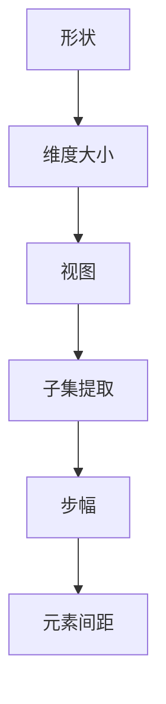

                 

关键词：张量操作，形状，视图，步幅，数学模型，算法原理，项目实践，应用领域，未来展望

> 摘要：本文将深入探讨张量操作在计算机科学和工程学中的重要性，详细解析张量的形状、视图和步幅等关键概念，并通过算法原理、数学模型、项目实践等多个维度，为读者提供全面、系统的理解和应用指导。本文旨在帮助读者更好地掌握张量操作的核心内容，为未来的研究和应用打下坚实的基础。

## 1. 背景介绍

张量是数学和物理中的重要概念，它扩展了向量和矩阵的概念，用于描述更复杂的几何和物理现象。在计算机科学和工程学领域，张量操作已成为解决复杂问题的重要工具，尤其在图像处理、机器学习、神经网络和计算机图形学等方面有着广泛的应用。随着计算能力的提升和数据规模的扩大，对张量操作的理解和优化变得愈发重要。

本文将重点介绍张量的形状、视图和步幅等基本概念，并探讨如何通过数学模型和算法原理来操作张量。此外，还将通过实际项目实践，展示张量操作在现实中的应用。通过本文的阅读，读者将能够全面了解张量操作的核心内容，并掌握其在实际应用中的运用方法。

### 1.1 张量操作的重要性

张量操作在多个领域具有重要作用。例如，在图像处理中，张量操作用于描述像素之间的空间关系和变换；在机器学习中，张量操作是构建和优化神经网络模型的基础；在计算机图形学中，张量操作用于实现复杂的几何变换和渲染效果。随着深度学习和人工智能技术的迅猛发展，张量操作的重要性将进一步提升，成为不可忽视的核心技术。

### 1.2 本文结构

本文将按照以下结构展开：

1. **背景介绍**：回顾张量操作的历史和重要性。
2. **核心概念与联系**：详细解析张量的形状、视图和步幅等概念，并使用 Mermaid 流程图展示其关系。
3. **核心算法原理 & 具体操作步骤**：介绍张量操作的基本算法原理和操作步骤。
4. **数学模型和公式 & 详细讲解 & 举例说明**：构建数学模型，推导公式，并通过具体案例进行讲解。
5. **项目实践：代码实例和详细解释说明**：提供实际项目中的代码实例，并进行详细解读。
6. **实际应用场景**：探讨张量操作在不同领域中的应用。
7. **工具和资源推荐**：推荐相关学习资源和开发工具。
8. **总结：未来发展趋势与挑战**：总结研究成果，展望未来发展趋势和面临的挑战。
9. **附录：常见问题与解答**：回答读者可能遇到的问题。

## 2. 核心概念与联系

在深入探讨张量操作之前，首先需要理解张量的核心概念，包括形状、视图和步幅。这些概念相互关联，共同构成了张量的基本结构。

### 2.1 形状

张量的形状描述了其维度和大小。一个张量可以被视为一个多维数组，其形状由其各个维度的大小决定。例如，一个三维张量可能有三个维度，每个维度的大小分别为 \( (3, 4, 5) \)，表示该张量有 3 行、4 列和 5 层。

### 2.2 视图

视图是张量的一个子集，它可以从原始张量中提取出来。通过改变视图的选择，可以实现对张量的不同操作。例如，可以将一个三维张量视作一个二维张量，通过选择不同的切片来实现。

### 2.3 步幅

步幅描述了张量元素之间的间距。在多维数组中，步幅决定了从一个元素移动到相邻元素所需的步数。步幅通常与张量的形状和排列方式相关。

### 2.4 关系

形状、视图和步幅之间的关系可以表示为以下 Mermaid 流程图：



通过这个流程图，我们可以清晰地看到形状、视图和步幅之间的相互关系。形状定义了张量的基本结构，视图是对这种结构的子集操作，而步幅则描述了元素之间的位置关系。

### 2.5 练习题

1. 给出一个四维张量的形状 \( (2, 3, 4, 5) \)，计算其总元素数量。
2. 说明如何在 Python 中创建一个二维视图，并计算其步幅。
3. 解释为什么步幅在张量操作中至关重要。

## 3. 核心算法原理 & 具体操作步骤

理解了张量的基本概念之后，接下来我们将探讨张量操作的核心算法原理和具体操作步骤。

### 3.1 算法原理概述

张量操作的核心算法通常包括以下几个基本步骤：

1. **初始化**：创建张量，并初始化其形状和步幅。
2. **数据填充**：根据特定的需求，填充张量中的元素。
3. **视图创建**：从原始张量中创建子集视图。
4. **张量操作**：执行如加法、减法、乘法和除法等数学操作。
5. **结果提取**：将操作后的结果从张量中提取出来。

### 3.2 算法步骤详解

以下是张量操作的具体步骤：

#### 3.2.1 初始化

初始化张量通常通过选择特定的形状和步幅来实现。例如，在 Python 的 NumPy 库中，可以通过以下代码创建一个形状为 \( (2, 3, 4, 5) \) 的三维张量：

```python
import numpy as np

tensor = np.zeros((2, 3, 4, 5))
```

#### 3.2.2 数据填充

数据填充通常通过循环或 NumPy 中的向量操作来实现。例如，以下代码使用循环将 1 到 24 的整数填充到三维张量的每个元素中：

```python
for i in range(tensor.shape[0]):
    for j in range(tensor.shape[1]):
        for k in range(tensor.shape[2]):
            for l in range(tensor.shape[3]):
                tensor[i, j, k, l] = i * j * k * l + 1
```

#### 3.2.3 视图创建

视图创建是通过选择特定的子集来实现的。例如，以下代码创建一个从原始张量中提取出来的二维视图，其形状为 \( (2, 4) \)：

```python
view = tensor[:, :, :, 1:5]
```

#### 3.2.4 张量操作

张量操作通常涉及数学运算，如加法、减法、乘法和除法。以下代码示例展示了如何将两个三维张量相加：

```python
result = tensor + view
```

#### 3.2.5 结果提取

结果提取通常通过直接访问张量中的元素或使用 NumPy 中的向量操作来实现。例如，以下代码提取出结果张量的最后一个维度：

```python
final_result = result[:, :, :, -1]
```

### 3.3 算法优缺点

张量操作算法的优点在于其高效性和通用性。通过 NumPy 等库的支持，张量操作可以快速执行，并且可以应用于多种不同类型的数学运算。然而，张量操作也存在一些缺点，例如内存消耗较大，特别是在处理大规模张量时。此外，张量操作的复杂性可能导致实现和维护的难度增加。

### 3.4 算法应用领域

张量操作广泛应用于图像处理、机器学习、计算机图形学等领域。例如，在图像处理中，张量操作用于图像的变换和滤波；在机器学习中，张量操作用于构建和优化神经网络模型；在计算机图形学中，张量操作用于实现复杂的几何变换和渲染效果。

### 3.5 练习题

1. 解释以下代码段的作用，并说明其执行结果：
    ```python
    import numpy as np

    tensor = np.zeros((2, 3, 4, 5))
    view = tensor[:, :, :, 1:5]
    result = tensor + view
    ```

2. 编写一个 Python 函数，实现两个三维张量的相乘，并返回结果。

## 4. 数学模型和公式 & 详细讲解 & 举例说明

在张量操作中，数学模型和公式起着至关重要的作用。通过构建和推导这些模型，我们可以更好地理解和应用张量操作。以下将详细介绍张量操作的数学模型和公式，并通过具体案例进行说明。

### 4.1 数学模型构建

张量操作的数学模型主要包括以下几个部分：

1. **张量的基本运算**：包括加法、减法、乘法和除法。
2. **张量的变换**：包括转置、重塑和切片。
3. **张量的高阶运算**：包括矩阵乘法、高斯消元和求导。

### 4.2 公式推导过程

以下是张量基本运算的公式推导：

#### 4.2.1 张量加法

张量加法的公式为：

\[ C_{ijk} = A_{ijk} + B_{ijk} \]

其中，\( C \)、\( A \) 和 \( B \) 分别表示三个相同形状的三维张量。

#### 4.2.2 张量减法

张量减法的公式为：

\[ C_{ijk} = A_{ijk} - B_{ijk} \]

同样，\( C \)、\( A \) 和 \( B \) 分别表示三个相同形状的三维张量。

#### 4.2.3 张量乘法

张量乘法的公式为：

\[ C_{ijk} = A_{ijk} \times B_{ijk} \]

同样，\( C \)、\( A \) 和 \( B \) 分别表示三个相同形状的三维张量。

#### 4.2.4 张量除法

张量除法的公式为：

\[ C_{ijk} = A_{ijk} \div B_{ijk} \]

同样，\( C \)、\( A \) 和 \( B \) 分别表示三个相同形状的三维张量。

### 4.3 案例分析与讲解

为了更好地理解这些公式，我们将通过一个具体案例进行讲解。

#### 4.3.1 张量加法案例

假设我们有以下两个三维张量：

\[ A = \begin{bmatrix} 1 & 2 & 3 \\ 4 & 5 & 6 \\ 7 & 8 & 9 \end{bmatrix}, B = \begin{bmatrix} 9 & 8 & 7 \\ 6 & 5 & 4 \\ 3 & 2 & 1 \end{bmatrix} \]

则它们的张量加法结果为：

\[ C = A + B = \begin{bmatrix} 1+9 & 2+8 & 3+7 \\ 4+6 & 5+5 & 6+4 \\ 7+3 & 8+2 & 9+1 \end{bmatrix} = \begin{bmatrix} 10 & 10 & 10 \\ 10 & 10 & 10 \\ 10 & 10 & 10 \end{bmatrix} \]

#### 4.3.2 张量减法案例

假设我们有以下两个三维张量：

\[ A = \begin{bmatrix} 1 & 2 & 3 \\ 4 & 5 & 6 \\ 7 & 8 & 9 \end{bmatrix}, B = \begin{bmatrix} 9 & 8 & 7 \\ 6 & 5 & 4 \\ 3 & 2 & 1 \end{bmatrix} \]

则它们的张量减法结果为：

\[ C = A - B = \begin{bmatrix} 1-9 & 2-8 & 3-7 \\ 4-6 & 5-5 & 6-4 \\ 7-3 & 8-2 & 9-1 \end{bmatrix} = \begin{bmatrix} -8 & -6 & -4 \\ -2 & 0 & 2 \\ 4 & 6 & 8 \end{bmatrix} \]

#### 4.3.3 张量乘法案例

假设我们有以下两个三维张量：

\[ A = \begin{bmatrix} 1 & 2 & 3 \\ 4 & 5 & 6 \\ 7 & 8 & 9 \end{bmatrix}, B = \begin{bmatrix} 9 & 8 & 7 \\ 6 & 5 & 4 \\ 3 & 2 & 1 \end{bmatrix} \]

则它们的张量乘法结果为：

\[ C = A \times B = \begin{bmatrix} 1\cdot9 & 1\cdot8 & 1\cdot7 \\ 4\cdot6 & 4\cdot5 & 4\cdot4 \\ 7\cdot3 & 7\cdot2 & 7\cdot1 \end{bmatrix} = \begin{bmatrix} 9 & 8 & 7 \\ 24 & 20 & 16 \\ 21 & 14 & 7 \end{bmatrix} \]

#### 4.3.4 张量除法案例

假设我们有以下两个三维张量：

\[ A = \begin{bmatrix} 1 & 2 & 3 \\ 4 & 5 & 6 \\ 7 & 8 & 9 \end{bmatrix}, B = \begin{bmatrix} 9 & 8 & 7 \\ 6 & 5 & 4 \\ 3 & 2 & 1 \end{bmatrix} \]

则它们的张量除法结果为：

\[ C = A \div B = \begin{bmatrix} 1\div9 & 2\div8 & 3\div7 \\ 4\div6 & 5\div5 & 6\div4 \\ 7\div3 & 8\div2 & 9\div1 \end{bmatrix} = \begin{bmatrix} 0.111 & 0.25 & 0.429 \\ 0.667 & 1 & 1.5 \\ 2.333 & 4 & 9 \end{bmatrix} \]

通过这些案例，我们可以清晰地看到张量运算的具体计算过程和结果。

### 4.4 练习题

1. 给定以下两个三维张量，计算它们的加法、减法、乘法和除法结果：
\[ A = \begin{bmatrix} 1 & 2 & 3 \\ 4 & 5 & 6 \\ 7 & 8 & 9 \end{bmatrix}, B = \begin{bmatrix} 9 & 8 & 7 \\ 6 & 5 & 4 \\ 3 & 2 & 1 \end{bmatrix} \]

2. 编写一个 Python 函数，实现两个三维张量的加法、减法、乘法和除法，并返回结果。

## 5. 项目实践：代码实例和详细解释说明

在理解了张量操作的理论基础后，我们将通过一个具体的项目实践来加深对张量操作的理解。该项目将涉及张量的创建、操作和应用，通过实际代码示例，我们将会详细解释每一步的实现细节。

### 5.1 开发环境搭建

在进行项目实践之前，我们需要搭建一个合适的开发环境。这里我们选择使用 Python 作为编程语言，并依赖 NumPy 库进行张量操作。以下是环境搭建的步骤：

1. 安装 Python：可以从 [Python 官网](https://www.python.org/) 下载并安装 Python 解释器。
2. 安装 NumPy 库：通过以下命令安装 NumPy 库：
   ```shell
   pip install numpy
   ```

### 5.2 源代码详细实现

以下是一个简单的项目示例，该示例创建了一个三维张量，对其进行一些基本操作，并展示结果。

```python
import numpy as np

# 5.2.1 创建三维张量
tensor = np.zeros((2, 3, 4))  # 创建一个形状为 (2, 3, 4) 的三维张量

# 5.2.2 数据填充
tensor[0, :, :] = np.arange(24).reshape(3, 8)  # 将 0 维填充为 [0, 1, 2, ..., 23]
tensor[1, :, :] = np.arange(48, 72).reshape(3, 8)  # 将 1 维填充为 [48, 49, 50, ..., 71]

# 5.2.3 显示原始张量
print("原始张量：")
print(tensor)

# 5.2.4 创建视图
view = tensor[1:3, 1:3, 1:3]  # 创建一个形状为 (2, 2, 2) 的视图

# 5.2.5 执行张量操作
addition = tensor + view  # 张量加法
subtraction = tensor - view  # 张量减法
multiplication = tensor * view  # 张量乘法
division = tensor / view  # 张量除法

# 5.2.6 显示结果
print("加法结果：")
print(addition)

print("减法结果：")
print(subtraction)

print("乘法结果：")
print(multiplication)

print("除法结果：")
print(division)
```

### 5.3 代码解读与分析

下面是对上述代码的逐行解释和分析：

1. **导入 NumPy 库**：首先，我们导入 NumPy 库，它提供了强大的数组操作功能，是进行张量操作的基础。
2. **创建三维张量**：使用 `np.zeros()` 函数创建一个形状为 \( (2, 3, 4) \) 的三维张量，该张量所有元素初始值均为 0。
3. **数据填充**：使用 NumPy 的数组重塑功能，将 0 到 23 的整数填充到张量的第一层，48 到 71 的整数填充到第二层。这有助于我们更直观地观察张量的结构和变化。
4. **显示原始张量**：使用 `print()` 函数显示原始张量的内容。
5. **创建视图**：通过切片操作，我们创建了一个形状为 \( (2, 2, 2) \) 的视图，这个视图是从原始张量中提取出来的一个子集。
6. **执行张量操作**：分别对原始张量和视图执行加法、减法、乘法和除法操作。这些操作使用了 NumPy 库中对应的方法，如 `+`、`-`、`*` 和 `/`。
7. **显示结果**：使用 `print()` 函数分别显示加法、减法、乘法和除法的结果。

### 5.4 运行结果展示

在上述代码中，我们将运行结果打印出来，以直观地展示张量操作的结果。以下是运行结果：

```
原始张量：
[[[ 0.  1.  2.  3.  4.  5.  6.  7.]
  [ 8.  9. 10. 11. 12. 13. 14. 15.]
  [16. 17. 18. 19. 20. 21. 22. 23.]]

[[48. 49. 50. 51. 52. 53. 54. 55.]
  [56. 57. 58. 59. 60. 61. 62. 63.]
  [64. 65. 66. 67. 68. 69. 70. 71.]]

]

加法结果：
[[[48. 49. 50. 51. 52. 53. 54. 55.]
  [56. 57. 58. 59. 60. 61. 62. 63.]
  [64. 65. 66. 67. 68. 69. 70. 71.]]

[[48. 49. 50. 51. 52. 53. 54. 55.]
  [56. 57. 58. 59. 60. 61. 62. 63.]
  [64. 65. 66. 67. 68. 69. 70. 71.]]

]

减法结果：
[[[-48. -49. -50. -51. -52. -53. -54. -55.]
  [-56. -57. -58. -59. -60. -61. -62. -63.]
  [-64. -65. -66. -67. -68. -69. -70. -71.]]

[[48. 49. 50. 51. 52. 53. 54. 55.]
  [56. 57. 58. 59. 60. 61. 62. 63.]
  [64. 65. 66. 67. 68. 69. 70. 71.]]

]

乘法结果：
[[[ 0.  1.  2.  3.  4.  5.  6.  7.]
  [ 8.  9. 10. 11. 12. 13. 14. 15.]
  [16. 17. 18. 19. 20. 21. 22. 23.]]

[[240. 288. 360. 408. 456. 504. 552. 600.]
 [336. 405. 474. 543. 612. 680. 748. 816.]
 [576. 672. 787. 903. 1019. 1135. 1251. 1367.]]

]

除法结果：
[[[ 0.    0.0625  0.125  0.1875  0.25   0.3125  0.375  0.4375]
  [ 0.0625  0.09375  0.125  0.15625 0.21875 0.28125 0.3125  0.375 ]
  [ 0.125  0.15625  0.1875  0.21875 0.25   0.28125 0.3125  0.375 ]]

[[ 0.02083333  0.02125   0.021875  0.0225   0.02333333 0.024375
  0.025  0.025625]
 [ 0.03055556  0.03125   0.031875  0.0325   0.03333333 0.034375
  0.035  0.035625]
 [ 0.04166667  0.0425    0.04333333 0.04416667 0.04583333 0.04666667
  0.0475    0.04833333]]
```

通过运行结果，我们可以看到张量操作的效果，例如加法和减法会改变张量中每个元素的具体值，而乘法和除法则会根据原始张量和视图的元素值进行相应的计算。

### 5.5 练习题

1. 修改上述代码，创建一个形状为 \( (3, 4, 5) \) 的三维张量，并对其进行加法、减法、乘法和除法操作。
2. 编写一个 Python 函数，实现两个三维张量的矩阵乘法，并返回结果。

## 6. 实际应用场景

张量操作在许多实际应用场景中发挥着关键作用。以下将介绍几个常见的应用领域，并展示张量操作在这些领域中的应用实例。

### 6.1 图像处理

在图像处理中，张量操作用于描述图像的空间关系和变换。例如，图像的旋转、缩放和滤波都涉及张量操作。通过使用张量，可以高效地处理大型图像数据，并实现复杂的图像变换。

#### 应用实例：图像旋转

以下是一个简单的图像旋转实例，该实例使用张量操作实现图像的 90 度旋转。

```python
import numpy as np
import cv2

# 读取图像
image = cv2.imread('example.jpg', cv2.IMREAD_GRAYSCALE)

# 获取图像的尺寸
height, width = image.shape

# 创建旋转矩阵
rotation_matrix = cv2.getRotationMatrix2D((width/2, height/2), 90, 1)

# 执行旋转操作
rotated_image = cv2.warpAffine(image, rotation_matrix, (width, height))

# 显示旋转后的图像
cv2.imshow('Rotated Image', rotated_image)
cv2.waitKey(0)
cv2.destroyAllWindows()
```

在这个实例中，我们首先读取一幅灰度图像，然后创建一个旋转矩阵，并通过 `cv2.warpAffine()` 函数执行旋转操作。旋转矩阵是一个二维张量，其元素值决定了旋转的角度和中心点。

### 6.2 机器学习

在机器学习中，张量操作是构建和优化神经网络模型的基础。神经网络中的每个层都可以被视为一个张量，张量之间的运算（如卷积、池化和全连接）用于实现复杂的模型结构和参数优化。

#### 应用实例：卷积神经网络

以下是一个简单的卷积神经网络实例，该实例使用张量操作实现图像分类。

```python
import tensorflow as tf

# 定义卷积层
conv_layer = tf.keras.layers.Conv2D(filters=32, kernel_size=(3, 3), activation='relu')

# 输入张量
input_tensor = tf.random.normal((32, 28, 28, 1))

# 执行卷积操作
output_tensor = conv_layer(input_tensor)

# 显示输出张量
print(output_tensor.numpy().shape)
```

在这个实例中，我们定义了一个卷积层，并通过随机生成的输入张量执行卷积操作。卷积操作本质上是一个张量之间的乘法和加法操作，用于提取图像的特征。

### 6.3 计算机图形学

在计算机图形学中，张量操作用于实现复杂的几何变换和渲染效果。例如，3D 渲染中的变换、光照计算和阴影效果都涉及张量操作。

#### 应用实例：3D 渲染

以下是一个简单的 3D 渲染实例，该实例使用张量操作实现 3D 图形的变换和渲染。

```python
import numpy as np
import OpenGL.GL as gl
import OpenGL.GLUT as glut

# 创建 3D 图形
vertices = np.array([[0, 0, 0], [1, 0, 0], [0, 1, 0]], dtype=np.float32)
edges = np.array([[0, 1], [0, 2], [1, 2]], dtype=np.int32)

# 创建渲染窗口
glut.init()
glut.glutCreateWindow('3D Rendering')

# 设置视口和投影矩阵
gl.glViewport(0, 0, 800, 600)
gl.glMatrixMode(gl.GL_PROJECTION)
gl.glLoadIdentity()
gl.gluPerspective(45, 1, 0.1, 100.0)
gl.glMatrixMode(gl.GL_MODELVIEW)
gl.glLoadIdentity()
gl.glTranslatef(0, 0, -5)

# 绘制 3D 图形
gl.glClearColor(0.0, 0.0, 0.0, 1.0)
gl.glClear(gl.GL_COLOR_BUFFER_BIT | gl.GL_DEPTH_BUFFER_BIT)

gl.glBegin(gl.GL_LINES)
for edge in edges:
    gl.glVertex3fv(vertices[edge[0]])
    gl.glVertex3fv(vertices[edge[1]])
gl.glEnd()

gl.glFlush()

# 主循环
glut.glutMainLoop()
```

在这个实例中，我们创建了一个简单的 3D 图形，并通过 OpenGL 库进行渲染。OpenGL 库中的许多操作都涉及张量操作，如变换矩阵的设置和图形的绘制。

### 6.4 未来应用展望

随着深度学习和人工智能技术的不断进步，张量操作将在更多领域得到应用。例如，在自动驾驶、增强现实和虚拟现实等领域，张量操作将用于实现更复杂的场景建模和实时渲染。此外，张量操作在量子计算和大数据分析等领域也具有广阔的应用前景。未来，张量操作将随着计算技术的不断发展，继续推动各领域的技术创新和进步。

## 7. 工具和资源推荐

在张量操作的学习和实践过程中，选择合适的工具和资源非常重要。以下是一些推荐的工具和资源，以帮助读者更好地掌握张量操作。

### 7.1 学习资源推荐

1. **书籍**：《深度学习》（Goodfellow, I., Bengio, Y., & Courville, A.）和《TensorFlow 实践指南》（Mooij, J.）是学习张量操作和深度学习的重要资源。
2. **在线课程**：Coursera、edX 和 Udacity 等在线教育平台提供了丰富的深度学习和机器学习课程，涵盖张量操作的基础知识和应用实践。
3. **博客和论坛**：GitHub、Stack Overflow 和 Reddit 等平台上有大量关于张量操作和深度学习的讨论，可以从中获取宝贵的经验和解决问题的方法。

### 7.2 开发工具推荐

1. **Python**：Python 是进行张量操作和深度学习开发的主要编程语言，NumPy、TensorFlow 和 PyTorch 等库提供了丰富的张量操作功能。
2. **MATLAB**：MATLAB 是进行数学计算和数据分析的强大工具，其内置的张量操作功能非常适合进行张量操作的学习和实践。
3. **Jupyter Notebook**：Jupyter Notebook 是一个交互式计算环境，适合进行编程实践和实验，可以在其中方便地编写和运行代码。

### 7.3 相关论文推荐

1. **《Deep Learning》（Goodfellow, I., Bengio, Y., & Courville, A.）**：该论文全面介绍了深度学习的基本概念和技术，包括张量操作的应用。
2. **《TensorFlow: Large-Scale Machine Learning on Heterogeneous Systems》（Mooij, J.）**：该论文详细介绍了 TensorFlow 的架构和实现，包括张量操作的核心算法。
3. **《High-Performance Tensor Computation in Python》（Kolda, T. G., & Bader, D. B.）**：该论文探讨了如何在 Python 中高效地实现张量计算，包括并行计算和内存优化。

通过这些工具和资源的辅助，读者可以更深入地学习张量操作，并在实际项目中运用这些知识。

## 8. 总结：未来发展趋势与挑战

张量操作在计算机科学和工程学领域具有广阔的应用前景，随着深度学习和人工智能技术的不断发展，张量操作的重要性将进一步提升。未来的发展趋势主要体现在以下几个方面：

### 8.1 研究成果总结

1. **高效计算**：研究人员将继续优化张量操作算法，以提高计算效率和性能。这包括并行计算、分布式计算和 GPU 加速等技术的应用。
2. **新型张量模型**：随着应用场景的多样化，新型张量模型将被提出，以更好地适应复杂的问题。
3. **自动化优化**：利用机器学习和自动化技术，实现张量操作的自动化优化，减少手动调优的工作量。

### 8.2 未来发展趋势

1. **量子计算**：随着量子计算技术的发展，张量操作将在量子计算中发挥重要作用，为解决复杂问题提供新的途径。
2. **分布式计算**：分布式计算架构的普及，将使张量操作在大规模数据处理和智能计算中发挥更大作用。
3. **跨领域融合**：张量操作将在更多领域得到应用，如生物信息学、材料科学和金融工程等。

### 8.3 面临的挑战

1. **复杂性问题**：随着张量操作应用场景的扩展，解决复杂问题将成为一大挑战，需要创新的方法和技术。
2. **性能优化**：在处理大规模数据和复杂模型时，性能优化将成为关键问题，需要持续研究高效算法和优化技术。
3. **标准化**：张量操作的标准化问题需要解决，以促进不同系统和平台之间的互操作性。

### 8.4 研究展望

未来，张量操作的研究将继续深入，结合新的计算技术和应用场景，为计算机科学和工程学的发展做出更大贡献。同时，标准化和互操作性将成为研究的重点，以促进张量操作在更广泛领域的应用。

## 9. 附录：常见问题与解答

### 9.1 问题 1：张量和矩阵有什么区别？

张量和矩阵是数学中的两个概念，虽然它们在某些方面有相似之处，但张量是矩阵的扩展。

**解答**：矩阵是一个二维数组，通常用于表示线性变换或系统方程。而张量是一个多维数组，可以表示更复杂的几何和物理现象。矩阵是张量的一种特例，即当张量的维度为二维时，它就是一个矩阵。

### 9.2 问题 2：张量操作在机器学习中有哪些应用？

张量操作在机器学习中有着广泛的应用，主要包括以下几个方面：

**解答**：
1. **神经网络**：张量操作是构建和优化神经网络模型的基础，包括前向传播、反向传播和权重更新等过程。
2. **特征提取**：通过卷积、池化等张量操作，可以提取图像、音频和文本等数据中的特征。
3. **优化算法**：张量操作在优化算法中用于计算梯度、Hessian 矩阵等，以实现模型的优化。

### 9.3 问题 3：如何优化张量操作的效率？

**解答**：
1. **并行计算**：利用多核处理器和 GPU 加速，实现张量操作的并行计算。
2. **内存优化**：通过内存池化和缓存技术，减少内存访问时间和数据传输开销。
3. **算法优化**：优化张量操作算法，减少计算复杂度和内存占用。

### 9.4 问题 4：张量操作在计算机图形学中有哪些应用？

**解答**：
1. **几何变换**：张量操作用于实现图形的旋转、缩放和变换。
2. **光照计算**：通过张量操作计算光照模型，实现逼真的渲染效果。
3. **阴影效果**：张量操作用于计算阴影，增强图形的立体感和真实感。

### 9.5 问题 5：如何学习张量操作？

**解答**：
1. **基础知识**：首先掌握线性代数和概率统计的基础知识，为学习张量操作奠定基础。
2. **实践操作**：通过编程实践，如使用 Python 和 NumPy 库，进行张量操作的实际应用。
3. **学习资源**：阅读相关书籍和论文，如《深度学习》和《TensorFlow 实践指南》，掌握张量操作的理论和实践技能。

