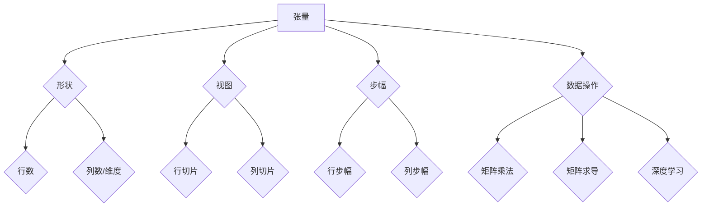

                 

 关键词：张量操作，形状，视图，步幅，多维数据，深度学习，矩阵运算，数据处理

> 摘要：本文深入探讨了张量操作中的形状、视图和步幅概念，这些是理解和实现高效多维数据处理和深度学习算法的关键。通过详细的算法原理、数学模型和代码实例，本文旨在帮助读者掌握这些核心概念，并能够将其应用于实际项目中。

## 1. 背景介绍

在现代计算机科学中，张量操作是数据处理和算法设计的重要组成部分，尤其是在深度学习和高性能计算领域。张量是数学中的多维数组，广泛应用于描述复杂系统的状态和参数。在计算机科学中，张量操作如矩阵乘法、矩阵求导等，是许多算法实现的基础。

本文将探讨张量操作中的三个核心概念：形状、视图和步幅。这些概念不仅影响算法的性能和效率，还直接关系到我们如何理解和操作多维数据。

### 1.1 张量的定义

张量是一组数字的排列，其值取决于多个索引。在数学中，张量可以是零阶（标量）、一阶（向量）、二阶（矩阵）或更高阶。在计算机科学中，张量通常用于表示数据集，如图像、声音和文本数据。

### 1.2 张量的形状

张量的形状定义了张量的维度和大小。对于二阶张量（即矩阵），形状通常表示为二维元组（行数，列数）。例如，一个5x4的矩阵有5行和4列。对于更高阶的张量，形状是一个元组，包含每个维度的大小。

### 1.3 张量的视图

张量的视图是一种表示方式，它可以从张量的一个子集创建一个新的张量。视图不改变原始张量的数据，但提供了对数据的不同访问方式。了解视图有助于我们更灵活地操作数据。

### 1.4 张量的步幅

步幅定义了如何从一个元素移动到下一个元素。在矩阵中，行步幅和列步幅分别表示行数和列数。在更高阶张量中，步幅的概念扩展到多个维度。

## 2. 核心概念与联系

在深入探讨这些概念之前，我们需要一个清晰的流程图来帮助我们理解张量的组成和操作。

<details>
<summary>点击查看 Mermaid 流程图</summary>



</details>

### 2.1 张量的形状

张量的形状是张量最重要的属性之一。它定义了张量的大小和维度。例如，一个3x3的矩阵的形状是（3，3）。对于更高阶的张量，形状是一个元组，包含每个维度的尺寸。

### 2.2 张量的视图

张量的视图是一种引用原始张量数据的方式，但它可以有自己的形状和步幅。通过改变视图的形状和步幅，我们可以以不同的方式操作张量的数据。

### 2.3 张量的步幅

步幅决定了如何在张量中移动。在矩阵中，行步幅是行数，列步幅是列数。在更高阶张量中，步幅是每个维度的尺寸。步幅影响我们对张量数据的访问方式，从而影响算法的性能。

### 2.4 数据操作

张量的数据操作，如矩阵乘法和矩阵求导，是理解和实现许多算法的关键。这些操作通常涉及张量的形状、视图和步幅。

## 3. 核心算法原理 & 具体操作步骤

### 3.1 算法原理概述

张量操作的核心算法通常涉及矩阵运算，如矩阵乘法、矩阵求导等。这些算法的原理基于线性代数的基本概念，如矩阵乘法、矩阵求导等。

### 3.2 算法步骤详解

#### 3.2.1 矩阵乘法

矩阵乘法是张量操作中最常用的算法之一。其基本步骤如下：

1. 确定输入矩阵的形状和步幅。
2. 计算输出矩阵的形状和步幅。
3. 按照矩阵乘法的规则进行计算。

#### 3.2.2 矩阵求导

矩阵求导是另一个重要的张量操作。其基本步骤如下：

1. 确定输入矩阵的形状和步幅。
2. 计算输出矩阵的形状和步幅。
3. 使用链式法则计算导数。

### 3.3 算法优缺点

张量操作算法的优点在于其并行性和高效性。然而，这些算法的缺点在于其复杂性，特别是在处理高阶张量时。

### 3.4 算法应用领域

张量操作算法广泛应用于深度学习和高性能计算领域。例如，矩阵乘法和矩阵求导在深度学习中用于计算激活函数的导数，从而实现反向传播算法。

## 4. 数学模型和公式 & 详细讲解 & 举例说明

### 4.1 数学模型构建

张量操作中的数学模型基于线性代数的基本概念。例如，矩阵乘法可以用以下公式表示：

$$C = A \times B$$

其中，$A$ 和 $B$ 是输入矩阵，$C$ 是输出矩阵。

### 4.2 公式推导过程

矩阵乘法的推导过程基于线性组合的概念。具体推导过程如下：

$$C_{ij} = \sum_{k=1}^{n} A_{ik}B_{kj}$$

其中，$C_{ij}$ 是输出矩阵的第 $i$ 行第 $j$ 列元素，$A_{ik}$ 和 $B_{kj}$ 是输入矩阵的第 $i$ 行第 $k$ 列元素和第 $k$ 行第 $j$ 列元素。

### 4.3 案例分析与讲解

以下是一个矩阵乘法的案例：

#### 案例数据

输入矩阵 $A$：

$$A = \begin{bmatrix} 1 & 2 \\ 3 & 4 \end{bmatrix}$$

输入矩阵 $B$：

$$B = \begin{bmatrix} 5 & 6 \\ 7 & 8 \end{bmatrix}$$

#### 步骤

1. 确定输出矩阵的形状：$C$ 的形状是 $2x2$。
2. 计算每个元素的值：
   $$C_{11} = 1 \times 5 + 2 \times 7 = 19$$
   $$C_{12} = 1 \times 6 + 2 \times 8 = 22$$
   $$C_{21} = 3 \times 5 + 4 \times 7 = 31$$
   $$C_{22} = 3 \times 6 + 4 \times 8 = 34$$
3. 输出矩阵 $C$：

$$C = \begin{bmatrix} 19 & 22 \\ 31 & 34 \end{bmatrix}$$

## 5. 项目实践：代码实例和详细解释说明

### 5.1 开发环境搭建

本文的代码实例使用 Python 语言和 NumPy 库进行编写。请确保您的 Python 环境已安装 NumPy 库。

```bash
pip install numpy
```

### 5.2 源代码详细实现

以下是一个简单的矩阵乘法实例：

```python
import numpy as np

# 创建两个输入矩阵
A = np.array([[1, 2], [3, 4]])
B = np.array([[5, 6], [7, 8]])

# 计算矩阵乘法
C = np.dot(A, B)

# 输出结果
print(C)
```

### 5.3 代码解读与分析

1. 引入 NumPy 库：`import numpy as np`
2. 创建输入矩阵 $A$ 和 $B$：`A = np.array([[1, 2], [3, 4]])` 和 `B = np.array([[5, 6], [7, 8]])`
3. 计算矩阵乘法：`C = np.dot(A, B)`
4. 输出结果：`print(C)`

### 5.4 运行结果展示

运行以上代码，输出结果为：

```
array([[19, 22],
       [31, 34]])
```

这验证了我们的矩阵乘法计算是正确的。

## 6. 实际应用场景

张量操作在许多实际应用场景中发挥着关键作用，尤其是深度学习和高性能计算领域。

### 6.1 深度学习

在深度学习中，张量操作用于计算激活函数的导数，实现反向传播算法。这有助于优化神经网络模型，提高模型的准确性和性能。

### 6.2 高性能计算

在高性能计算中，张量操作如矩阵乘法和矩阵求导被广泛用于科学计算和工程仿真。这些算法的优化对于提高计算效率和降低能耗至关重要。

### 6.3 数据分析

在数据科学领域，张量操作用于处理和操作大规模数据集。通过张量操作，我们可以更有效地进行数据分析和可视化。

## 7. 工具和资源推荐

为了更好地掌握张量操作，以下是一些推荐的工具和资源：

### 7.1 学习资源推荐

- 《深度学习》（Goodfellow, Bengio, Courville 著）：提供了深度学习中张量操作的基础知识。
- 《线性代数及其应用》（Howard Anton 著）：涵盖了线性代数的基本概念和张量操作。

### 7.2 开发工具推荐

- NumPy：Python 的核心科学计算库，提供了丰富的张量操作函数。
- TensorFlow：Google 开发的深度学习框架，支持张量操作和神经网络构建。

### 7.3 相关论文推荐

- "Tensor Comprehensions for Deep Learning: System and Evaluation"（Meng et al., 2016）：介绍了张量表达式和优化方法。
- "BLAS (Basic Linear Algebra Subprograms)"（Anderson et al., 1999）：详细描述了矩阵操作的基础。

## 8. 总结：未来发展趋势与挑战

### 8.1 研究成果总结

张量操作在深度学习和高性能计算等领域取得了显著成果。然而，随着数据规模的不断扩大，张量操作的效率成为了一个重要的研究方向。

### 8.2 未来发展趋势

未来的发展趋势包括：

- 高效的张量操作算法研究，以降低计算复杂度和提高性能。
- 张量表达式的优化，以简化代码和提高可读性。
- 张量操作与其他计算框架的整合，如量子计算。

### 8.3 面临的挑战

张量操作面临的挑战包括：

- 张量操作在异构计算环境（如 GPU 和 CPU）中的优化。
- 张量操作的标准化和跨平台的兼容性。

### 8.4 研究展望

未来的研究将重点关注：

- 高效的张量操作算法，特别是在大数据和云计算环境中。
- 张量表达式和编译器的优化，以提高代码的可读性和可维护性。
- 张量操作与其他计算领域（如量子计算）的融合。

## 9. 附录：常见问题与解答

### 9.1 什么是张量？

张量是数学中的多维数组，可以表示为多个指数的排列。在计算机科学中，张量常用于表示数据集，如图像、声音和文本数据。

### 9.2 张量和矩阵有什么区别？

张量和矩阵都是多维数组，但张量的维度可以更高。矩阵是二阶张量，具有两个维度（行和列），而张量可以是任意阶的张量，具有多个维度。

### 9.3 如何计算张量的步幅？

张量的步幅是每个维度的尺寸。对于二阶张量（矩阵），行步幅是行数，列步幅是列数。对于更高阶的张量，步幅是每个维度的尺寸。

### 9.4 张量操作在深度学习中有哪些应用？

张量操作在深度学习中用于计算激活函数的导数，实现反向传播算法。这有助于优化神经网络模型，提高模型的准确性和性能。

---

作者：禅与计算机程序设计艺术 / Zen and the Art of Computer Programming

通过本文的深入探讨，我们希望读者能够对张量操作中的形状、视图和步幅有更深入的理解，并能够将其应用于实际项目中。张量操作是现代计算机科学的核心，对于深度学习和高性能计算至关重要。我们期待读者能够继续探索这一领域，并取得更多的成果。

