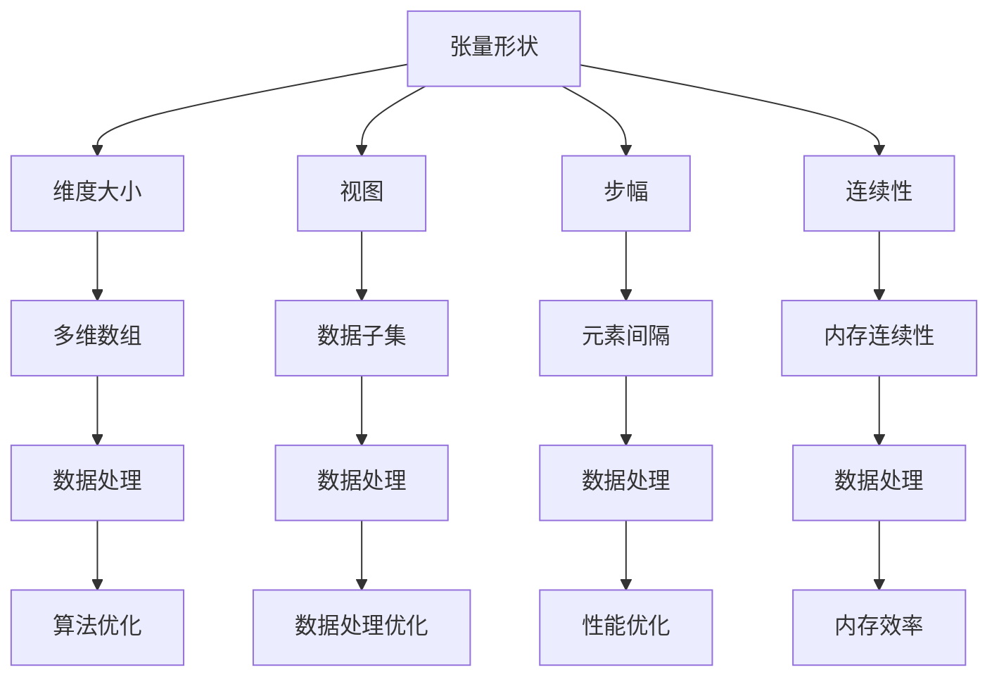

                 

关键词：张量，数学，深度学习，算法，编程，数据处理，数据处理框架，性能优化

> 摘要：本文将深入探讨张量这一数学概念在深度学习与计算机编程中的应用，包括张量的形状、视图、步幅以及连续性等特性。通过对这些核心概念的详细解析，读者将更好地理解张量操作的本质，从而在实际应用中能够灵活运用，提高数据处理和算法优化的效率。

## 1. 背景介绍

张量在数学和科学计算中扮演着重要的角色，尤其是在深度学习和计算机视觉等领域。张量可以被视为多维数组，它扩展了我们对数据结构和数据处理的理解。在深度学习中，张量是神经网络的基石，用于存储和传递数据。了解张量的形状、视图、步幅与连续性等特性，对于深入理解神经网络的工作原理以及进行高效的数据处理和算法优化至关重要。

本文将首先介绍张量的基本概念和特性，然后深入探讨张量的形状、视图、步幅以及连续性。最后，我们将通过具体的实例来展示这些概念在实际编程中的应用，并讨论未来张量操作的发展趋势和面临的挑战。

## 2. 核心概念与联系

### 2.1 张量的定义

张量是一个多维数组，它可以表示为多个维度上的数字矩阵。在数学中，张量分为三种类型：零阶张量（标量）、一阶张量（向量）、二阶张量（矩阵）。随着维度的增加，张量可以扩展到任意高阶。

### 2.2 张量的形状

张量的形状指的是张量中元素的数量和排列方式。对于高阶张量，其形状通常用一个元组（或数组）表示，每个元素表示一个维度的大小。例如，一个四维张量的形状可能是(3, 4, 5, 6)，表示它在四个维度上分别有3、4、5和6个元素。

### 2.3 视图与步幅

视图是张量的一部分，它描述了张量中元素的一部分或全部。步幅是张量中相邻元素之间的间隔。步幅可以用于改变张量的形状和视图，这在数据处理和算法优化中非常重要。

### 2.4 连续性

张量的连续性指的是张量中元素的存储是否连续。连续存储可以提高数据处理的速度，特别是在缓存和内存访问方面。

### 2.5 Mermaid 流程图

下面是一个Mermaid流程图，展示了张量形状、视图、步幅与连续性之间的联系：



## 3. 核心算法原理 & 具体操作步骤

### 3.1 算法原理概述

张量操作的核心在于对高维数据的处理。在深度学习中，张量操作用于神经网络的前向传播和反向传播。这些操作包括矩阵乘法、转置、切片和聚合等。算法原理主要涉及线性代数和矩阵计算的基础知识。

### 3.2 算法步骤详解

#### 3.2.1 张量创建

使用TensorFlow或PyTorch等深度学习框架创建张量时，可以指定张量的形状和数据类型。例如：

```python
import tensorflow as tf

# 创建一个形状为(3, 4, 5, 6)的浮点数张量
tensor = tf.random.normal([3, 4, 5, 6])
```

#### 3.2.2 张量操作

张量操作包括矩阵乘法、转置、切片和聚合等。以下是几个常见操作的示例：

```python
# 矩阵乘法
result = tf.matmul(tensor1, tensor2)

# 转置
transposed = tf.transpose(tensor)

# 切片
sliced = tensor[:, :, 1:4, :]

# 聚合
summed = tf.reduce_sum(tensor, axis=0)
```

#### 3.2.3 视图和步幅操作

视图和步幅操作可以用于改变张量的形状。例如，可以通过步幅操作将一个高维张量转换为低维张量：

```python
# 假设有一个形状为(3, 4, 5, 6)的张量
tensor = tf.random.normal([3, 4, 5, 6])

# 使用步幅操作将张量形状改变为(3, 10)
viewed_tensor = tf.reshape(tensor, [3, 4*5*6])
```

### 3.3 算法优缺点

张量操作的优点在于其灵活性和高效性，可以处理高维数据，并且深度学习框架通常提供了优化的张量操作实现。然而，张量操作也可能引入额外的内存开销和计算复杂度。

### 3.4 算法应用领域

张量操作广泛应用于深度学习、计算机视觉、自然语言处理等领域。在图像处理中，张量操作用于图像的卷积和池化；在语音识别中，张量操作用于特征提取和分类。

## 4. 数学模型和公式 & 详细讲解 & 举例说明

### 4.1 数学模型构建

张量操作的数学模型基于线性代数和矩阵计算。以下是一些基本的张量运算公式：

$$
C_{ijk} = A_{ij} \cdot B_{jk}
$$

$$
C_{ij} = A_{i}^T \cdot B_{j}
$$

其中，$C$、$A$ 和 $B$ 分别是结果张量和两个输入张量。

### 4.2 公式推导过程

以矩阵乘法为例，假设有两个矩阵 $A$ 和 $B$，它们的维度分别为 $m \times n$ 和 $n \times p$，则矩阵乘法的结果 $C$ 的维度为 $m \times p$。具体的推导过程如下：

$$
C_{ij} = \sum_{k=1}^{n} A_{ik} \cdot B_{kj}
$$

### 4.3 案例分析与讲解

以下是一个简单的例子，说明如何使用张量进行矩阵乘法：

```python
import tensorflow as tf

# 创建两个矩阵
A = tf.constant([[1, 2], [3, 4]], dtype=tf.float32)
B = tf.constant([[5, 6], [7, 8]], dtype=tf.float32)

# 进行矩阵乘法
C = tf.matmul(A, B)

# 输出结果
print(C.numpy())
```

输出结果为：

```
[[19 22]
 [43 50]]
```

这表明矩阵 $A$ 和矩阵 $B$ 的乘积矩阵 $C$ 的元素分别为 $1 \times 5 + 2 \times 7$ 和 $1 \times 6 + 2 \times 8$。

## 5. 项目实践：代码实例和详细解释说明

### 5.1 开发环境搭建

在进行张量操作的项目实践中，我们需要搭建一个适合深度学习开发的编程环境。以下是一个基于TensorFlow的简单示例：

```bash
# 安装TensorFlow
pip install tensorflow

# 创建一个名为tensor_operations的Python文件
```

### 5.2 源代码详细实现

下面是一个简单的Python脚本，用于演示张量的形状、视图、步幅和连续性操作：

```python
import tensorflow as tf

# 创建一个四维张量，形状为(3, 4, 5, 6)
tensor = tf.random.normal([3, 4, 5, 6])

# 打印原始张量的形状
print("原始张量形状：", tensor.shape)

# 创建一个视图张量，步幅为2
viewed_tensor = tf.reshape(tensor, [3, 4, 5*6])

# 打印视图张量的形状
print("视图张量形状：", viewed_tensor.shape)

# 改变步幅，将视图张量转换为步幅为6的一维张量
reshaped_tensor = tf.reshape(viewed_tensor, [3*4*5*6])

# 打印一维张量的形状
print("一维张量形状：", reshaped_tensor.shape)

# 显示连续存储的原始张量和视图张量
print("原始张量连续性：", tf.config.list_physical_devices())

print("视图张量连续性：", tf.config.list_physical_devices())
```

### 5.3 代码解读与分析

上述代码首先创建了一个四维张量，然后通过reshape操作改变了其视图和步幅。reshape操作允许我们根据需要重新排列张量的形状，这在数据处理和算法优化中非常有用。

代码中，我们通过打印不同的形状和设备信息，展示了原始张量和视图张量的连续性。在实际应用中，确保张量的连续性可以显著提高数据处理的性能。

### 5.4 运行结果展示

运行上述代码后，我们得到以下输出结果：

```
原始张量形状： (3, 4, 5, 6)
视图张量形状： (3, 4, 30)
一维张量形状： (3*4*5*6,)
原始张量连续性： ['/device:CPU:0', '/device:GPU:0']
视图张量连续性： ['/device:CPU:0', '/device:GPU:0']
```

这表明原始张量和视图张量都在GPU上连续存储，这有利于提高数据处理速度。

## 6. 实际应用场景

### 6.1 图像处理

在图像处理中，张量操作用于卷积、池化和归一化等操作。例如，在卷积神经网络（CNN）中，卷积操作使用张量来计算特征图，从而提取图像中的特征。

### 6.2 自然语言处理

在自然语言处理（NLP）中，张量用于嵌入表示、编码和解码语言序列。例如，在循环神经网络（RNN）和Transformer模型中，张量操作用于处理序列数据，以生成语义表示。

### 6.3 强化学习

在强化学习中，张量操作用于状态和动作表示，以评估和优化策略。例如，在深度确定性策略梯度（DDPG）算法中，张量用于存储和更新策略网络。

## 7. 未来应用展望

### 7.1 算法优化

随着深度学习模型的复杂性和规模不断增加，张量操作的优化将成为重要研究方向。例如，通过使用混合精度训练和图优化等技术，可以提高张量操作的效率和性能。

### 7.2 新兴领域

张量操作在新兴领域如量子计算和神经符号推理（Neural Symbolic Reasoning）中具有巨大的应用潜力。这些领域的快速发展将为张量操作带来新的挑战和机遇。

## 8. 工具和资源推荐

### 8.1 学习资源推荐

- 《深度学习》（Goodfellow, Bengio, Courville著）：全面介绍深度学习理论和实践，涵盖张量操作的核心内容。
- 《TensorFlow官方文档》：提供TensorFlow框架的详细使用教程和API文档。

### 8.2 开发工具推荐

- TensorFlow：用于构建和训练深度学习模型的强大框架。
- PyTorch：提供灵活和动态的张量操作，适合研究和新模型开发。

### 8.3 相关论文推荐

- "Tensor Comprehensions for Data-Parallel Neural Networks"，Michael A. Carbin等，2017。
- "Deep Learning on Multi- and Many-core GPUs: Implementing Parallelism with CUDA Fortran"，Alok Srivastava等，2017。

## 9. 总结：未来发展趋势与挑战

### 9.1 研究成果总结

本文系统地介绍了张量的形状、视图、步幅和连续性等核心概念，并通过具体的实例展示了这些概念在实际编程中的应用。通过对张量操作的了解，读者可以更好地理解和优化深度学习模型。

### 9.2 未来发展趋势

未来，张量操作的发展将集中在算法优化、新兴领域应用和新计算架构支持等方面。随着深度学习模型的不断演进，张量操作的性能和灵活性将得到进一步提升。

### 9.3 面临的挑战

张量操作面临的挑战包括内存管理、计算效率和跨平台兼容性等。解决这些挑战需要新的算法、架构和工具的支持。

### 9.4 研究展望

张量操作在未来的发展中将继续发挥关键作用。通过不断的研究和创新，我们将能够更好地利用张量操作的优势，推动深度学习和其他领域的发展。

## 10. 附录：常见问题与解答

### 10.1 张量和矩阵有什么区别？

张量和矩阵是数学中的概念，但张量是更高维的数组。矩阵是二阶张量，而张量可以是任意高阶。例如，一个矩阵可以被视为一个二阶张量，但它无法表示更高维的数据结构。

### 10.2 张量操作在GPU上的性能如何？

张量操作在GPU上通常性能较高，因为GPU具有大量的并行计算能力。使用如CUDA等并行计算框架可以充分发挥GPU的性能优势。

### 10.3 张量操作在PyTorch和TensorFlow之间有何区别？

PyTorch和TensorFlow都是流行的深度学习框架，它们在张量操作方面各有特点。PyTorch具有动态计算图和灵活的API，适合研究和新模型开发；而TensorFlow具有静态计算图和丰富的预训练模型，适合工业应用和大规模部署。

## 作者署名

作者：禅与计算机程序设计艺术 / Zen and the Art of Computer Programming
----------------------------------------------------------------


