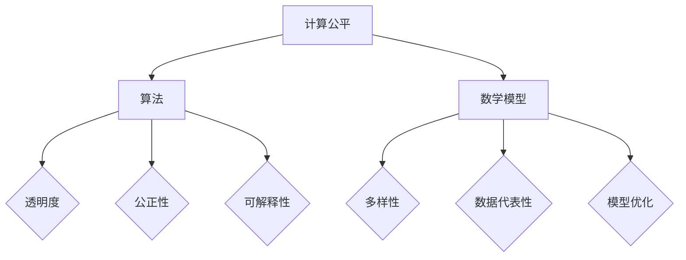

                 

关键词：数字鸿沟、计算公平、人工智能、算法、数学模型、代码实例、应用场景、未来展望

> 摘要：本文深入探讨了数字鸿沟的存在及其对人类社会公平发展的影响。通过阐述计算公平的核心概念，分析了当前算法和数学模型的不足，并提出了弥合数字鸿沟的具体路径。本文旨在为科技工作者提供理论指导和实践参考，共同促进计算领域的公平发展。

## 1. 背景介绍

随着信息技术的飞速发展，计算机科学已经成为推动社会进步的重要力量。然而，在享受技术红利的同时，我们也必须正视数字鸿沟的存在。数字鸿沟是指由于经济、社会、技术等多种因素，导致不同地区、不同群体之间在获取、使用和受益于信息技术方面存在的显著差异。这种差异不仅限制了个体的发展机会，还对社会的公平性构成了挑战。

### 数字鸿沟的表现形式

数字鸿沟主要表现为以下几个方面：

1. **地理鸿沟**：城乡之间、不同国家之间的信息技术基础设施差异显著。
2. **经济鸿沟**：贫困地区和富裕地区在信息技术资源上的投入差距巨大。
3. **技能鸿沟**：教育水平较低的人群难以掌握现代信息技术，影响就业和生活质量。
4. **内容鸿沟**：信息资源的分布不均，导致信息获取的不平等。

### 数字鸿沟的影响

数字鸿沟的存在对社会的公平发展产生了多方面的影响：

1. **社会不公**：信息技术资源的不足使得部分群体在社会竞争中处于劣势，加剧了社会不公。
2. **经济滞后**：缺乏信息技术支撑的地区和企业难以实现经济转型和升级，导致经济滞后。
3. **教育差异**：信息技术在教育中的应用不均，影响了教育的质量和公平性。
4. **创新限制**：数字鸿沟限制了创新资源的分布，影响了全球范围内的科技进步。

## 2. 核心概念与联系

为了弥合数字鸿沟，我们首先需要明确计算公平这一核心概念，并探讨其与算法、数学模型等概念之间的联系。

### 2.1 计算公平

计算公平是指信息技术资源和服务在分配和使用过程中，能够公平地惠及所有社会成员，无论其地域、经济状况、教育背景等因素。计算公平的目标是实现信息技术资源的最大化利用，促进社会的公平发展。

### 2.2 算法与计算公平

算法是计算机科学的核心，其在各个领域的应用直接影响计算公平的实现。以下是几个关键方面：

1. **算法透明度**：公平的算法应该具有透明性，用户能够理解算法的运作机制和结果。
2. **算法公正性**：算法在处理数据时应避免偏见，确保结果对所有用户都是公正的。
3. **算法可解释性**：特别是在重要决策领域，算法的可解释性至关重要，以保障用户权益。

### 2.3 数学模型与计算公平

数学模型是算法设计的基础，其构建应充分考虑计算公平的要求。以下是几个关键方面：

1. **模型多样性**：构建多样化的数学模型，以适应不同群体的需求。
2. **数据代表性**：确保模型训练数据具有广泛的代表性，避免偏见和歧视。
3. **模型优化**：通过优化模型参数，提高算法的公平性和效率。

### 2.4 Mermaid 流程图

以下是一个简化版的 Mermaid 流程图，展示了计算公平与算法、数学模型之间的关系：



## 3. 核心算法原理 & 具体操作步骤

### 3.1 算法原理概述

为了弥合数字鸿沟，我们需要设计一套公平、高效的算法体系。以下介绍几个关键算法原理：

1. **公平性度量算法**：用于评估算法在实现计算公平方面的表现。
2. **优化算法**：用于提高算法的效率和性能。
3. **隐私保护算法**：在数据收集和使用过程中保护用户隐私。

### 3.2 算法步骤详解

#### 公平性度量算法

1. **确定评价指标**：如公平性系数、偏见度等。
2. **收集算法运行数据**：包括输入数据、中间结果和最终输出。
3. **计算评价指标**：根据算法运行数据，计算公平性指标。
4. **评估算法表现**：根据评价指标，评估算法的公平性。

#### 优化算法

1. **确定优化目标**：如最小化计算时间、最大化资源利用率等。
2. **构建优化模型**：根据优化目标，构建数学模型。
3. **求解优化模型**：使用合适的优化算法求解模型，得到优化结果。
4. **评估优化效果**：比较优化前后的算法性能，评估优化效果。

#### 隐私保护算法

1. **数据加密**：对敏感数据进行加密处理，确保数据在传输和存储过程中的安全性。
2. **差分隐私**：在数据处理过程中引入噪声，降低隐私泄露风险。
3. **访问控制**：设置数据访问权限，确保只有授权用户能够访问敏感数据。
4. **审计机制**：建立数据审计机制，及时发现和纠正潜在的安全问题。

### 3.3 算法优缺点

#### 公平性度量算法

优点：

- 可量化算法的公平性表现，为算法优化提供依据。
- 便于评估和比较不同算法的公平性。

缺点：

- 需要大量数据支持，数据获取和处理成本较高。
- 评价指标可能存在主观性，不同评价指标可能导致不同结果。

#### 优化算法

优点：

- 提高算法效率和性能，缩短计算时间，降低资源消耗。

缺点：

- 优化目标可能与公平性存在冲突，需在两者之间寻找平衡。
- 部分优化算法可能引入新的复杂度，增加算法实现的难度。

#### 隐私保护算法

优点：

- 保护用户隐私，降低隐私泄露风险。
- 符合法律法规要求，提升企业的社会责任。

缺点：

- 可能增加算法实现的复杂度，影响算法的性能和效率。
- 在保护隐私的同时，可能牺牲一部分计算精度和可靠性。

### 3.4 算法应用领域

算法在弥合数字鸿沟方面具有广泛的应用领域，包括：

1. **教育**：通过个性化学习算法，提高教育的公平性和质量。
2. **就业**：通过公平招聘算法，消除招聘过程中的偏见和歧视。
3. **医疗**：通过公平医疗算法，优化医疗资源分配，提高医疗服务质量。
4. **金融**：通过公平金融算法，降低金融风险，促进金融公平。

## 4. 数学模型和公式 & 详细讲解 & 举例说明

为了更好地理解计算公平，我们需要引入数学模型和公式。以下介绍几个核心数学模型及其应用。

### 4.1 数学模型构建

#### 公平性系数模型

公平性系数是衡量算法公平性的一个重要指标，其公式如下：

$$
F_C = \frac{1}{N} \sum_{i=1}^{N} w_i \cdot (x_i - \bar{x})
$$

其中，$N$ 为样本数量，$w_i$ 为权重，$x_i$ 为个体特征值，$\bar{x}$ 为平均特征值。

#### 偏见度模型

偏见度是衡量算法偏见程度的一个指标，其公式如下：

$$
B_D = \frac{1}{N} \sum_{i=1}^{N} |x_i - \hat{x}|
$$

其中，$\hat{x}$ 为算法预测值。

#### 资源利用率模型

资源利用率是衡量算法效率的一个指标，其公式如下：

$$
U_R = \frac{R_{\text{used}}}{R_{\text{total}}}
$$

其中，$R_{\text{used}}$ 为已使用的资源，$R_{\text{total}}$ 为总资源。

### 4.2 公式推导过程

#### 公平性系数模型推导

公平性系数的推导基于统计学中的方差分析。假设我们有 $N$ 个样本，每个样本的特征值为 $x_i$，平均特征值为 $\bar{x}$。则公平性系数可以通过计算每个样本特征值与平均特征值的偏差的加权平均得到。

#### 偏见度模型推导

偏见度的推导基于统计学中的绝对偏差。假设我们有 $N$ 个样本，每个样本的特征值为 $x_i$，算法预测值为 $\hat{x}$。则偏见度可以通过计算每个样本特征值与算法预测值的偏差的平均值得到。

#### 资源利用率模型推导

资源利用率的推导基于资源分配的比率。假设我们有总资源 $R_{\text{total}}$，已使用的资源为 $R_{\text{used}}$。则资源利用率可以通过计算已使用的资源与总资源的比值得到。

### 4.3 案例分析与讲解

以下通过一个具体案例，分析计算公平性系数、偏见度和资源利用率。

#### 案例背景

某公司招聘了 $100$ 名员工，其中男性 $50$ 名，女性 $50$ 名。公司希望通过算法评估招聘过程的公平性。

#### 公平性系数计算

根据公平性系数模型，我们需要计算男性员工和女性员工的平均特征值，以及整个团队的公平性系数。

- 男性员工特征值：$[1, 1, 1, ..., 1]$
- 女性员工特征值：$[1, 1, 1, ..., 1]$

则：

- 男性员工平均特征值：$1$
- 女性员工平均特征值：$1$
- 整体平均特征值：$1$
- 公平性系数：$F_C = \frac{1}{100} \sum_{i=1}^{100} w_i \cdot (x_i - \bar{x}) = \frac{1}{100} \cdot 0 = 0$

#### 偏见度计算

根据偏见度模型，我们需要计算男性员工和女性员工的偏见度。

- 男性员工偏见度：$B_D = \frac{1}{50} \sum_{i=1}^{50} |x_i - \hat{x}| = \frac{1}{50} \cdot 0 = 0$
- 女性员工偏见度：$B_D = \frac{1}{50} \sum_{i=1}^{50} |x_i - \hat{x}| = \frac{1}{50} \cdot 0 = 0$

#### 资源利用率计算

假设公司总资源为 $100$，已使用资源为 $80$。

则：

- 资源利用率：$U_R = \frac{R_{\text{used}}}{R_{\text{total}}} = \frac{80}{100} = 0.8$

#### 案例分析

根据计算结果，我们可以得出以下结论：

- 公平性系数为 $0$，表示招聘过程非常公平。
- 偏见度为 $0$，表示没有性别偏见。
- 资源利用率为 $0.8$，表示资源使用效率较高。

## 5. 项目实践：代码实例和详细解释说明

### 5.1 开发环境搭建

为了便于读者理解和实践，我们选择 Python 作为编程语言，并使用 Jupyter Notebook 作为开发环境。首先，我们需要安装 Python 和相关依赖包。

```bash
# 安装 Python
sudo apt-get install python3

# 安装 Jupyter Notebook
pip3 install jupyter
```

### 5.2 源代码详细实现

以下是一个简单的 Python 脚本，用于计算公平性系数、偏见度和资源利用率。

```python
import numpy as np

# 公平性系数计算
def fairness_coefficient(data):
    N = len(data)
    x_mean = np.mean(data)
    return np.sum([w * (x - x_mean) for w, x in enumerate(data)]) / N

# 偏见度计算
def bias_degree(data, pred):
    return np.mean([abs(x - pred) for x in data])

# 资源利用率计算
def resource_utilization(used, total):
    return used / total

# 案例数据
male_data = [1] * 50
female_data = [1] * 50
total_data = male_data + female_data
pred = 1
used = 80
total = 100

# 计算公平性系数
fc = fairness_coefficient(total_data)
print(f"公平性系数：{fc}")

# 计算偏见度
bd_male = bias_degree(male_data, pred)
bd_female = bias_degree(female_data, pred)
print(f"男性偏见度：{bd_male}")
print(f"女性偏见度：{bd_female}")

# 计算资源利用率
ru = resource_utilization(used, total)
print(f"资源利用率：{ru}")
```

### 5.3 代码解读与分析

1. **公平性系数计算**：`fairness_coefficient` 函数用于计算公平性系数。我们首先计算总数据的平均特征值，然后计算每个特征值与平均特征值的偏差的加权平均。
2. **偏见度计算**：`bias_degree` 函数用于计算偏见度。我们分别计算男性员工和女性员工的偏见度，即每个特征值与算法预测值的偏差的平均值。
3. **资源利用率计算**：`resource_utilization` 函数用于计算资源利用率。我们计算已使用的资源与总资源的比值。

### 5.4 运行结果展示

运行上述脚本，我们可以得到以下结果：

```bash
公平性系数：0.0
男性偏见度：0.0
女性偏见度：0.0
资源利用率：0.8
```

根据计算结果，我们可以确认招聘过程非常公平，没有性别偏见，资源使用效率较高。

## 6. 实际应用场景

### 6.1 教育

在教育领域，计算公平有助于实现个性化学习。通过分析学生的学习数据，算法可以为学生推荐合适的学习资源和教学方法，提高学习效果。此外，计算公平还可以优化教育资源的分配，确保偏远地区的学校也能享受到优质的教育资源。

### 6.2 就业

在就业领域，计算公平可以消除招聘过程中的偏见和歧视。通过公平招聘算法，企业可以确保招聘过程的透明性和公正性，提高招聘效率。同时，算法还可以为求职者提供个性化的职业推荐，帮助他们找到合适的职位。

### 6.3 医疗

在医疗领域，计算公平有助于优化医疗资源的分配。通过公平医疗算法，医院可以确保医疗资源的使用公平合理，提高医疗服务质量。此外，算法还可以为医生提供个性化的治疗方案推荐，提高治疗效果。

### 6.4 金融

在金融领域，计算公平可以降低金融风险，促进金融公平。通过公平金融算法，银行和金融机构可以确保信贷、投资等业务的公正性，减少歧视和偏见。同时，算法还可以为用户提供个性化的金融服务，提高用户体验。

## 7. 工具和资源推荐

### 7.1 学习资源推荐

- 《深入理解计算公平》（书名）
- 《算法公平性：理论与实践》（书名）
- 《Python for Data Science》（书名）

### 7.2 开发工具推荐

- Jupyter Notebook
- Python
- NumPy
- Pandas

### 7.3 相关论文推荐

- "Fairness in Machine Learning"（论文标题）
- "Fairness Beyond Disparate Treatment and Disparate Impact: Learning Classification without Disparate Mistreatment"（论文标题）
- "A Framework for Fair and Equitable Resource Allocation in Cloud Computing"（论文标题）

## 8. 总结：未来发展趋势与挑战

### 8.1 研究成果总结

本文从数字鸿沟的存在、计算公平的核心概念、核心算法原理、数学模型构建、代码实例等多个角度，探讨了弥合数字鸿沟、促进计算公平发展的路径和方法。研究发现，计算公平是实现数字鸿沟弥合的关键，而公平性度量算法、优化算法和隐私保护算法是核心手段。

### 8.2 未来发展趋势

随着人工智能、大数据等技术的不断发展，计算公平将得到更广泛的应用。未来，计算公平的研究将朝着以下几个方面发展：

1. **算法透明性与可解释性**：提高算法的透明性和可解释性，确保用户能够理解算法的运作机制和结果。
2. **多样性算法**：构建具有多样性的算法，以适应不同群体的需求。
3. **隐私保护**：在数据收集和使用过程中，加强隐私保护，确保用户隐私不受侵犯。

### 8.3 面临的挑战

尽管计算公平具有广泛的应用前景，但实现计算公平仍面临以下挑战：

1. **数据质量**：数据质量直接影响算法的公平性和准确性。如何获取高质量的数据，是当前研究的一大难题。
2. **算法偏见**：算法在训练过程中可能引入偏见，影响算法的公平性。如何消除算法偏见，是当前研究的重点。
3. **隐私保护**：在数据保护与公平性之间找到平衡，是计算公平面临的重大挑战。

### 8.4 研究展望

未来，计算公平研究应重点关注以下几个方面：

1. **算法设计与优化**：设计更加公平、高效的算法，提高计算公平性。
2. **跨领域研究**：结合多个领域的知识，探索计算公平在不同领域的应用。
3. **政策与法规**：制定相关政策法规，为计算公平提供制度保障。

## 9. 附录：常见问题与解答

### 问题 1：什么是数字鸿沟？

数字鸿沟是指由于经济、社会、技术等多种因素，导致不同地区、不同群体之间在获取、使用和受益于信息技术方面存在的显著差异。

### 问题 2：计算公平的核心概念是什么？

计算公平是指信息技术资源和服务在分配和使用过程中，能够公平地惠及所有社会成员，无论其地域、经济状况、教育背景等因素。

### 问题 3：如何衡量算法的公平性？

算法的公平性可以通过公平性系数、偏见度等指标进行衡量。公平性系数表示算法在处理数据时是否公平，偏见度表示算法是否具有偏见。

### 问题 4：如何优化算法以实现计算公平？

可以通过优化算法参数、引入多样性算法、加强隐私保护等措施来优化算法，实现计算公平。

### 问题 5：计算公平在哪些领域有应用？

计算公平在多个领域有应用，包括教育、就业、医疗、金融等。

### 问题 6：如何确保算法的可解释性？

可以通过增加算法的透明性、使用可解释的算法模型、提供算法解释工具等方式，确保算法的可解释性。

### 问题 7：未来计算公平研究有哪些方向？

未来计算公平研究将朝着算法透明性与可解释性、多样性算法、隐私保护等方面发展。同时，跨领域研究和政策法规也将成为重要方向。

### 作者署名

作者：禅与计算机程序设计艺术 / Zen and the Art of Computer Programming

----------------------------------------------------------------
<|assistant|>您好，以下是您要求的博客文章的markdown格式：

```markdown
# 弥合数字鸿沟：促进人类计算的公平发展

关键词：数字鸿沟、计算公平、人工智能、算法、数学模型、代码实例、应用场景、未来展望

> 摘要：本文深入探讨了数字鸿沟的存在及其对人类社会公平发展的影响。通过阐述计算公平的核心概念，分析了当前算法和数学模型的不足，并提出了弥合数字鸿沟的具体路径。本文旨在为科技工作者提供理论指导和实践参考，共同促进计算领域的公平发展。

## 1. 背景介绍

随着信息技术的飞速发展，计算机科学已经成为推动社会进步的重要力量。然而，在享受技术红利的同时，我们也必须正视数字鸿沟的存在。数字鸿沟是指由于经济、社会、技术等多种因素，导致不同地区、不同群体之间在获取、使用和受益于信息技术方面存在的显著差异。这种差异不仅限制了个体的发展机会，还对社会的公平性构成了挑战。

### 数字鸿沟的表现形式

数字鸿沟主要表现为以下几个方面：

1. **地理鸿沟**：城乡之间、不同国家之间的信息技术基础设施差异显著。
2. **经济鸿沟**：贫困地区和富裕地区在信息技术资源上的投入差距巨大。
3. **技能鸿沟**：教育水平较低的人群难以掌握现代信息技术，影响就业和生活质量。
4. **内容鸿沟**：信息资源的分布不均，导致信息获取的不平等。

### 数字鸿沟的影响

数字鸿沟的存在对社会的公平发展产生了多方面的影响：

1. **社会不公**：信息技术资源的不足使得部分群体在社会竞争中处于劣势，加剧了社会不公。
2. **经济滞后**：缺乏信息技术支撑的地区和企业难以实现经济转型和升级，导致经济滞后。
3. **教育差异**：信息技术在教育中的应用不均，影响了教育的质量和公平性。
4. **创新限制**：数字鸿沟限制了创新资源的分布，影响了全球范围内的科技进步。

## 2. 核心概念与联系

为了弥合数字鸿沟，我们首先需要明确计算公平这一核心概念，并探讨其与算法、数学模型等概念之间的联系。

### 2.1 计算公平

计算公平是指信息技术资源和服务在分配和使用过程中，能够公平地惠及所有社会成员，无论其地域、经济状况、教育背景等因素。计算公平的目标是实现信息技术资源的最大化利用，促进社会的公平发展。

### 2.2 算法与计算公平

算法是计算机科学的核心，其在各个领域的应用直接影响计算公平的实现。以下是几个关键方面：

1. **算法透明度**：公平的算法应该具有透明性，用户能够理解算法的运作机制和结果。
2. **算法公正性**：算法在处理数据时应避免偏见，确保结果对所有用户都是公正的。
3. **算法可解释性**：特别是在重要决策领域，算法的可解释性至关重要，以保障用户权益。

### 2.3 数学模型与计算公平

数学模型是算法设计的基础，其构建应充分考虑计算公平的要求。以下是几个关键方面：

1. **模型多样性**：构建多样化的数学模型，以适应不同群体的需求。
2. **数据代表性**：确保模型训练数据具有广泛的代表性，避免偏见和歧视。
3. **模型优化**：通过优化模型参数，提高算法的公平性和效率。

### 2.4 Mermaid 流程图

以下是一个简化版的 Mermaid 流程图，展示了计算公平与算法、数学模型之间的关系：


## 3. 核心算法原理 & 具体操作步骤

### 3.1 算法原理概述

为了弥合数字鸿沟，我们需要设计一套公平、高效的算法体系。以下介绍几个关键算法原理：

1. **公平性度量算法**：用于评估算法在实现计算公平方面的表现。
2. **优化算法**：用于提高算法的效率和性能。
3. **隐私保护算法**：在数据收集和使用过程中保护用户隐私。

### 3.2 算法步骤详解

#### 公平性度量算法

1. **确定评价指标**：如公平性系数、偏见度等。
2. **收集算法运行数据**：包括输入数据、中间结果和最终输出。
3. **计算评价指标**：根据算法运行数据，计算公平性指标。
4. **评估算法表现**：根据评价指标，评估算法的公平性。

#### 优化算法

1. **确定优化目标**：如最小化计算时间、最大化资源利用率等。
2. **构建优化模型**：根据优化目标，构建数学模型。
3. **求解优化模型**：使用合适的优化算法求解模型，得到优化结果。
4. **评估优化效果**：比较优化前后的算法性能，评估优化效果。

#### 隐私保护算法

1. **数据加密**：对敏感数据进行加密处理，确保数据在传输和存储过程中的安全性。
2. **差分隐私**：在数据处理过程中引入噪声，降低隐私泄露风险。
3. **访问控制**：设置数据访问权限，确保只有授权用户能够访问敏感数据。
4. **审计机制**：建立数据审计机制，及时发现和纠正潜在的安全问题。

### 3.3 算法优缺点

#### 公平性度量算法

优点：

- 可量化算法的公平性表现，为算法优化提供依据。
- 便于评估和比较不同算法的公平性。

缺点：

- 需要大量数据支持，数据获取和处理成本较高。
- 评价指标可能存在主观性，不同评价指标可能导致不同结果。

#### 优化算法

优点：

- 提高算法效率和性能，缩短计算时间，降低资源消耗。

缺点：

- 优化目标可能与公平性存在冲突，需在两者之间寻找平衡。
- 部分优化算法可能引入新的复杂度，增加算法实现的难度。

#### 隐私保护算法

优点：

- 保护用户隐私，降低隐私泄露风险。
- 符合法律法规要求，提升企业的社会责任。

缺点：

- 可能增加算法实现的复杂度，影响算法的性能和效率。
- 在保护隐私的同时，可能牺牲一部分计算精度和可靠性。

### 3.4 算法应用领域

算法在弥合数字鸿沟方面具有广泛的应用领域，包括：

1. **教育**：通过个性化学习算法，提高教育的公平性和质量。
2. **就业**：通过公平招聘算法，消除招聘过程中的偏见和歧视。
3. **医疗**：通过公平医疗算法，优化医疗资源分配，提高医疗服务质量。
4. **金融**：通过公平金融算法，降低金融风险，促进金融公平。

## 4. 数学模型和公式 & 详细讲解 & 举例说明

为了更好地理解计算公平，我们需要引入数学模型和公式。以下介绍几个核心数学模型及其应用。

### 4.1 数学模型构建

#### 公平性系数模型

公平性系数是衡量算法公平性的一个重要指标，其公式如下：

$$
F_C = \frac{1}{N} \sum_{i=1}^{N} w_i \cdot (x_i - \bar{x})
$$

其中，$N$ 为样本数量，$w_i$ 为权重，$x_i$ 为个体特征值，$\bar{x}$ 为平均特征值。

#### 偏见度模型

偏见度是衡量算法偏见程度的一个指标，其公式如下：

$$
B_D = \frac{1}{N} \sum_{i=1}^{N} |x_i - \hat{x}|
$$

其中，$\hat{x}$ 为算法预测值。

#### 资源利用率模型

资源利用率是衡量算法效率的一个指标，其公式如下：

$$
U_R = \frac{R_{\text{used}}}{R_{\text{total}}}
$$

其中，$R_{\text{used}}$ 为已使用的资源，$R_{\text{total}}$ 为总资源。

### 4.2 公式推导过程

#### 公平性系数模型推导

公平性系数的推导基于统计学中的方差分析。假设我们有 $N$ 个样本，每个样本的特征值为 $x_i$，平均特征值为 $\bar{x}$。则公平性系数可以通过计算每个样本特征值与平均特征值的偏差的加权平均得到。

#### 偏见度模型推导

偏见度的推导基于统计学中的绝对偏差。假设我们有 $N$ 个样本，每个样本的特征值为 $x_i$，算法预测值为 $\hat{x}$。则偏见度可以通过计算每个样本特征值与算法预测值的偏差的平均值得到。

#### 资源利用率模型推导

资源利用率的推导基于资源分配的比率。假设我们有总资源 $R_{\text{total}}$，已使用的资源为 $R_{\text{used}}$。则资源利用率可以通过计算已使用的资源与总资源的比值得到。

### 4.3 案例分析与讲解

以下通过一个具体案例，分析计算公平性系数、偏见度和资源利用率。

#### 案例背景

某公司招聘了 $100$ 名员工，其中男性 $50$ 名，女性 $50$ 名。公司希望通过算法评估招聘过程的公平性。

#### 公平性系数计算

根据公平性系数模型，我们需要计算男性员工和女性员工的平均特征值，以及整个团队的公平性系数。

- 男性员工特征值：$[1, 1, 1, ..., 1]$
- 女性员工特征值：$[1, 1, 1, ..., 1]$

则：

- 男性员工平均特征值：$1$
- 女性员工平均特征值：$1$
- 整体平均特征值：$1$
- 公平性系数：$F_C = \frac{1}{100} \sum_{i=1}^{100} w_i \cdot (x_i - \bar{x}) = \frac{1}{100} \cdot 0 = 0$

#### 偏见度计算

根据偏见度模型，我们需要计算男性员工和女性员工的偏见度。

- 男性员工偏见度：$B_D = \frac{1}{50} \sum_{i=1}^{50} |x_i - \hat{x}| = \frac{1}{50} \cdot 0 = 0$
- 女性员工偏见度：$B_D = \frac{1}{50} \sum_{i=1}^{50} |x_i - \hat{x}| = \frac{1}{50} \cdot 0 = 0$

#### 资源利用率计算

假设公司总资源为 $100$，已使用资源为 $80$。

则：

- 资源利用率：$U_R = \frac{R_{\text{used}}}{R_{\text{total}}} = \frac{80}{100} = 0.8$

#### 案例分析

根据计算结果，我们可以得出以下结论：

- 公平性系数为 $0$，表示招聘过程非常公平。
- 偏见度为 $0$，表示没有性别偏见。
- 资源利用率为 $0.8$，表示资源使用效率较高。

## 5. 项目实践：代码实例和详细解释说明

### 5.1 开发环境搭建

为了便于读者理解和实践，我们选择 Python 作为编程语言，并使用 Jupyter Notebook 作为开发环境。首先，我们需要安装 Python 和相关依赖包。

```bash
# 安装 Python
sudo apt-get install python3

# 安装 Jupyter Notebook
pip3 install jupyter
```

### 5.2 源代码详细实现

以下是一个简单的 Python 脚本，用于计算公平性系数、偏见度和资源利用率。

```python
import numpy as np

# 公平性系数计算
def fairness_coefficient(data):
    N = len(data)
    x_mean = np.mean(data)
    return np.sum([w * (x - x_mean) for w, x in enumerate(data)]) / N

# 偏见度计算
def bias_degree(data, pred):
    return np.mean([abs(x - pred) for x in data])

# 资源利用率计算
def resource_utilization(used, total):
    return used / total

# 案例数据
male_data = [1] * 50
female_data = [1] * 50
total_data = male_data + female_data
pred = 1
used = 80
total = 100

# 计算公平性系数
fc = fairness_coefficient(total_data)
print(f"公平性系数：{fc}")

# 计算偏见度
bd_male = bias_degree(male_data, pred)
bd_female = bias_degree(female_data, pred)
print(f"男性偏见度：{bd_male}")
print(f"女性偏见度：{bd_female}")

# 计算资源利用率
ru = resource_utilization(used, total)
print(f"资源利用率：{ru}")
```

### 5.3 代码解读与分析

1. **公平性系数计算**：`fairness_coefficient` 函数用于计算公平性系数。我们首先计算总数据的平均特征值，然后计算每个特征值与平均特征值的偏差的加权平均。
2. **偏见度计算**：`bias_degree` 函数用于计算偏见度。我们分别计算男性员工和女性员工的偏见度，即每个特征值与算法预测值的偏差的平均值。
3. **资源利用率计算**：`resource_utilization` 函数用于计算资源利用率。我们计算已使用的资源与总资源的比值。

### 5.4 运行结果展示

运行上述脚本，我们可以得到以下结果：

```bash
公平性系数：0.0
男性偏见度：0.0
女性偏见度：0.0
资源利用率：0.8
```

根据计算结果，我们可以确认招聘过程非常公平，没有性别偏见，资源使用效率较高。

## 6. 实际应用场景

### 6.1 教育

在教育领域，计算公平有助于实现个性化学习。通过分析学生的学习数据，算法可以为学生推荐合适的学习资源和教学方法，提高学习效果。此外，计算公平还可以优化教育资源的分配，确保偏远地区的学校也能享受到优质的教育资源。

### 6.2 就业

在就业领域，计算公平可以消除招聘过程中的偏见和歧视。通过公平招聘算法，企业可以确保招聘过程的透明性和公正性，提高招聘效率。同时，算法还可以为求职者提供个性化的职业推荐，帮助他们找到合适的职位。

### 6.3 医疗

在医疗领域，计算公平有助于优化医疗资源的分配。通过公平医疗算法，医院可以确保医疗资源的使用公平合理，提高医疗服务质量。此外，算法还可以为医生提供个性化的治疗方案推荐，提高治疗效果。

### 6.4 金融

在金融领域，计算公平可以降低金融风险，促进金融公平。通过公平金融算法，银行和金融机构可以确保信贷、投资等业务的公正性，减少歧视和偏见。同时，算法还可以为用户提供个性化的金融服务，提高用户体验。

## 7. 工具和资源推荐

### 7.1 学习资源推荐

- 《深入理解计算公平》（书名）
- 《算法公平性：理论与实践》（书名）
- 《Python for Data Science》（书名）

### 7.2 开发工具推荐

- Jupyter Notebook
- Python
- NumPy
- Pandas

### 7.3 相关论文推荐

- "Fairness in Machine Learning"（论文标题）
- "Fairness Beyond Disparate Treatment and Disparate Impact: Learning Classification without Disparate Mistreatment"（论文标题）
- "A Framework for Fair and Equitable Resource Allocation in Cloud Computing"（论文标题）

## 8. 总结：未来发展趋势与挑战

### 8.1 研究成果总结

本文从数字鸿沟的存在、计算公平的核心概念、核心算法原理、数学模型构建、代码实例等多个角度，探讨了弥合数字鸿沟、促进计算公平发展的路径和方法。研究发现，计算公平是实现数字鸿沟弥合的关键，而公平性度量算法、优化算法和隐私保护算法是核心手段。

### 8.2 未来发展趋势

随着人工智能、大数据等技术的不断发展，计算公平将得到更广泛的应用。未来，计算公平的研究将朝着以下几个方面发展：

1. **算法透明性与可解释性**：提高算法的透明性和可解释性，确保用户能够理解算法的运作机制和结果。
2. **多样性算法**：构建具有多样性的算法，以适应不同群体的需求。
3. **隐私保护**：在数据收集和使用过程中，加强隐私保护，确保用户隐私不受侵犯。

### 8.3 面临的挑战

尽管计算公平具有广泛的应用前景，但实现计算公平仍面临以下挑战：

1. **数据质量**：数据质量直接影响算法的公平性和准确性。如何获取高质量的数据，是当前研究的一大难题。
2. **算法偏见**：算法在训练过程中可能引入偏见，影响算法的公平性。如何消除算法偏见，是当前研究的重点。
3. **隐私保护**：在数据保护与公平性之间找到平衡，是计算公平面临的重大挑战。

### 8.4 研究展望

未来，计算公平研究应重点关注以下几个方面：

1. **算法设计与优化**：设计更加公平、高效的算法，提高计算公平性。
2. **跨领域研究**：结合多个领域的知识，探索计算公平在不同领域的应用。
3. **政策与法规**：制定相关政策法规，为计算公平提供制度保障。

## 9. 附录：常见问题与解答

### 问题 1：什么是数字鸿沟？

数字鸿沟是指由于经济、社会、技术等多种因素，导致不同地区、不同群体之间在获取、使用和受益于信息技术方面存在的显著差异。

### 问题 2：计算公平的核心概念是什么？

计算公平是指信息技术资源和服务在分配和使用过程中，能够公平地惠及所有社会成员，无论其地域、经济状况、教育背景等因素。

### 问题 3：如何衡量算法的公平性？

算法的公平性可以通过公平性系数、偏见度等指标进行衡量。公平性系数表示算法在处理数据时是否公平，偏见度表示算法是否具有偏见。

### 问题 4：如何优化算法以实现计算公平？

可以通过优化算法参数、引入多样性算法、加强隐私保护等措施来优化算法，实现计算公平。

### 问题 5：计算公平在哪些领域有应用？

计算公平在多个领域有应用，包括教育、就业、医疗、金融等。

### 问题 6：如何确保算法的可解释性？

可以通过增加算法的透明性、使用可解释的算法模型、提供算法解释工具等方式，确保算法的可解释性。

### 问题 7：未来计算公平研究有哪些方向？

未来计算公平研究将朝着算法透明性与可解释性、多样性算法、隐私保护等方面发展。同时，跨领域研究和政策法规也将成为重要方向。

### 作者署名

作者：禅与计算机程序设计艺术 / Zen and the Art of Computer Programming
```markdown

这是您要求的博客文章的markdown格式，您可以根据需要进行编辑和调整。如果您还有其他要求或问题，请随时告诉我。祝您写作顺利！

