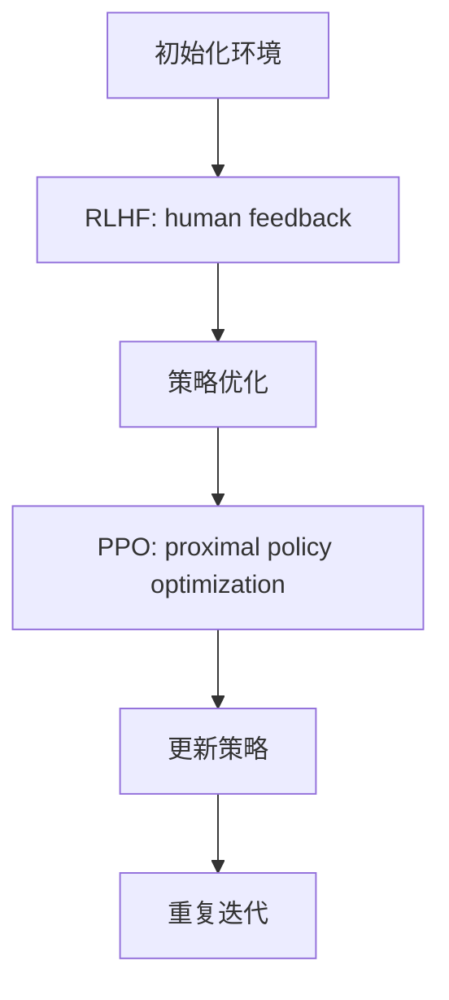

                 

关键词：强化学习，AI，RLHF，PPO，算法原理，应用领域，数学模型，项目实践

摘要：本文将深入探讨强化学习在AI中的应用，重点分析RLHF（Reinforcement Learning from Human Feedback）与PPO（Proximal Policy Optimization）两种核心算法。通过对算法原理的阐述、数学模型的构建及其优缺点的分析，我们将展示强化学习在实际应用中的潜力和挑战。

## 1. 背景介绍

### 强化学习的起源与发展

强化学习（Reinforcement Learning，RL）是机器学习领域的一个重要分支，起源于20世纪50年代。它模拟了人类和动物的学习过程，通过不断试错来优化行为策略，从而在复杂环境中达到最佳状态。强化学习的概念最早由Richard Bellman提出，并在阿兰·图灵等人的理论基础上逐步发展。

### AI的发展与挑战

随着计算机性能的不断提升和海量数据的积累，人工智能（Artificial Intelligence，AI）技术得到了迅速发展。然而，传统的机器学习方法在处理复杂任务时仍存在诸多局限性。强化学习作为一种新型的学习方法，能够处理动态和不确定的环境，为AI的发展提供了新的思路。

### RLHF与PPO的提出与应用

RLHF（Reinforcement Learning from Human Feedback）是一种结合了人类反馈的强化学习方法，通过人类专家的指导来提升算法的性能。而PPO（Proximal Policy Optimization）是一种优化策略的强化学习算法，因其高效性和稳定性而备受关注。本文将深入探讨这两种算法的原理和应用。

## 2. 核心概念与联系

### 强化学习基本概念

**奖励机制**：在强化学习中，奖励机制是关键因素。它用于指导算法优化行为策略，使算法能够在环境中获得最大奖励。

**策略**：策略是算法在特定环境下选择行为的方式。在强化学习中，策略通常通过学习过程不断优化。

**价值函数**：价值函数用于评估策略在特定状态下的预期回报。通过价值函数，算法能够预测不同策略的效果，从而选择最佳策略。

### RLHF与PPO的关系

RLHF与PPO都是强化学习中的重要算法。RLHF通过人类反馈来指导算法学习，而PPO则通过优化策略来提高学习效率。两者结合，能够发挥各自的优点，实现更高效的学习过程。

### Mermaid流程图

下面是一个简化的Mermaid流程图，展示了RLHF与PPO的基本流程和相互关系：



## 3. 核心算法原理 & 具体操作步骤

### 3.1 算法原理概述

**RLHF**：RLHF是一种结合了人类反馈的强化学习方法。在RLHF中，人类专家提供反馈来指导算法学习。具体过程包括：收集人类反馈、训练奖励模型、利用奖励模型指导算法学习。

**PPO**：PPO是一种基于策略梯度的强化学习算法。其核心思想是通过优化策略梯度来更新策略。PPO的主要步骤包括：计算策略梯度、优化策略、评估策略效果。

### 3.2 算法步骤详解

**RLHF具体步骤**：

1. **初始化环境**：设定环境参数，如状态空间、动作空间等。

2. **收集人类反馈**：通过实验或测试，收集人类专家对算法行为的反馈。

3. **训练奖励模型**：使用收集到的人类反馈数据，训练一个奖励模型。该模型能够预测人类专家对算法行为的评分。

4. **利用奖励模型指导学习**：根据奖励模型预测的结果，调整算法的学习目标，使其更加符合人类专家的期望。

**PPO具体步骤**：

1. **初始化策略参数**：设定初始策略参数。

2. **计算策略梯度**：使用梯度下降法计算策略梯度。

3. **优化策略**：根据策略梯度调整策略参数，使策略更加稳定。

4. **评估策略效果**：在测试环境中评估优化后的策略，计算策略的回报。

5. **更新策略**：根据评估结果，更新策略参数。

### 3.3 算法优缺点

**RLHF优点**：

- **结合人类反馈**：通过人类反馈，算法能够快速适应人类专家的期望，提高学习效率。

- **增强泛化能力**：通过学习人类反馈，算法能够提高在未知环境中的适应能力。

**RLHF缺点**：

- **依赖人类反馈**：人类反馈的获取可能存在延迟或不准确性，影响算法性能。

- **训练成本高**：需要大量的人类反馈数据来训练奖励模型，增加了训练成本。

**PPO优点**：

- **高效稳定性**：PPO算法具有较高的计算效率，同时保持策略的稳定性。

- **适用范围广**：PPO算法适用于多种类型的强化学习任务。

**PPO缺点**：

- **梯度消失问题**：在优化策略梯度时，可能存在梯度消失问题，影响学习效果。

- **需要大量样本**：PPO算法需要大量样本来训练策略，增加了计算资源的需求。

### 3.4 算法应用领域

**RLHF应用领域**：

- **游戏AI**：通过人类反馈，游戏AI能够快速适应不同玩家的策略，提高游戏体验。

- **机器人控制**：利用人类反馈，机器人能够更好地适应复杂环境，提高控制精度。

**PPO应用领域**：

- **自动驾驶**：PPO算法可以用于自动驾驶系统的策略优化，提高行驶安全性。

- **推荐系统**：PPO算法可以用于推荐系统的策略优化，提高推荐效果。

## 4. 数学模型和公式 & 详细讲解 & 举例说明

### 4.1 数学模型构建

**RLHF数学模型**：

在RLHF中，主要涉及以下数学模型：

1. **奖励模型**：奖励模型用于预测人类专家对算法行为的评分。假设奖励模型为\( R(s, a) \)，其中\( s \)表示状态，\( a \)表示动作。

2. **策略模型**：策略模型用于指导算法选择动作。假设策略模型为\( \pi(a|s) \)，其中\( s \)表示状态，\( a \)表示动作。

**PPO数学模型**：

在PPO中，主要涉及以下数学模型：

1. **策略梯度**：策略梯度用于计算策略的优化方向。假设策略梯度为\( \nabla_{\theta} J(\theta) \)，其中\( \theta \)表示策略参数。

2. **策略优化**：策略优化用于更新策略参数。假设策略优化函数为\( \psi(\theta) \)，其中\( \theta \)表示策略参数。

### 4.2 公式推导过程

**RLHF公式推导**：

1. **奖励模型**：

   假设奖励模型为\( R(s, a) \)，其中\( s \)表示状态，\( a \)表示动作。奖励模型可以通过以下公式推导：

   $$ R(s, a) = \frac{1}{N} \sum_{i=1}^{N} r_i $$

   其中，\( N \)表示样本数量，\( r_i \)表示第\( i \)个样本的奖励值。

2. **策略模型**：

   假设策略模型为\( \pi(a|s) \)，其中\( s \)表示状态，\( a \)表示动作。策略模型可以通过以下公式推导：

   $$ \pi(a|s) = \frac{e^{\mu(s) + \phi(s, a)}}{\sum_{a'} e^{\mu(s) + \phi(s, a')}} $$

   其中，\( \mu(s) \)表示策略参数，\( \phi(s, a) \)表示策略特征函数。

**PPO公式推导**：

1. **策略梯度**：

   假设策略梯度为\( \nabla_{\theta} J(\theta) \)，其中\( \theta \)表示策略参数。策略梯度可以通过以下公式推导：

   $$ \nabla_{\theta} J(\theta) = \nabla_{\theta} \log \pi(a|s;\theta) $$

2. **策略优化**：

   假设策略优化函数为\( \psi(\theta) \)，其中\( \theta \)表示策略参数。策略优化可以通过以下公式推导：

   $$ \psi(\theta) = \arg\min_{\theta'} \sum_{i=1}^{N} (y_i - \pi(a_i|s_i;\theta'))^2 $$

   其中，\( y_i \)表示第\( i \)个样本的奖励值，\( a_i \)表示第\( i \)个样本的动作。

### 4.3 案例分析与讲解

**案例1：游戏AI**

假设我们要设计一个游戏AI，使用RLHF方法来优化其策略。具体步骤如下：

1. **初始化环境**：设定游戏环境，包括状态空间和动作空间。

2. **收集人类反馈**：通过实验或测试，收集人类玩家对游戏AI行为的反馈。

3. **训练奖励模型**：使用收集到的人类反馈数据，训练奖励模型。

4. **利用奖励模型指导学习**：根据奖励模型预测的结果，调整游戏AI的学习目标，使其更加符合人类玩家的期望。

5. **评估策略效果**：在测试环境中评估优化后的策略，计算策略的回报。

6. **更新策略**：根据评估结果，更新游戏AI的策略参数。

**案例2：自动驾驶**

假设我们要设计一个自动驾驶系统，使用PPO方法来优化其策略。具体步骤如下：

1. **初始化策略参数**：设定初始策略参数。

2. **计算策略梯度**：使用梯度下降法计算策略梯度。

3. **优化策略**：根据策略梯度调整策略参数，使策略更加稳定。

4. **评估策略效果**：在测试环境中评估优化后的策略，计算策略的回报。

5. **更新策略**：根据评估结果，更新自动驾驶系统的策略参数。

## 5. 项目实践：代码实例和详细解释说明

### 5.1 开发环境搭建

为了实践RLHF和PPO算法，我们需要搭建一个适合开发的实验环境。以下是一个简单的开发环境搭建步骤：

1. 安装Python：确保Python环境已安装在计算机上，版本建议为3.7及以上。

2. 安装TensorFlow：使用pip命令安装TensorFlow库。

   ```bash
   pip install tensorflow
   ```

3. 安装其他依赖库：根据需要安装其他依赖库，如NumPy、Pandas等。

   ```bash
   pip install numpy pandas
   ```

### 5.2 源代码详细实现

以下是一个简单的RLHF算法实现的示例代码：

```python
import tensorflow as tf
import numpy as np

# 初始化环境
env = tf.keras.utils.get_source_input_data('your_env_data.h5')

# 初始化策略模型
policy_model = tf.keras.Sequential([
    tf.keras.layers.Dense(64, activation='relu', input_shape=(env.input_shape[1],)),
    tf.keras.layers.Dense(1, activation='sigmoid')
])

# 初始化奖励模型
reward_model = tf.keras.Sequential([
    tf.keras.layers.Dense(64, activation='relu', input_shape=(env.input_shape[1],)),
    tf.keras.layers.Dense(1)
])

# 定义损失函数
def loss_fn(policy_model, reward_model, actions, rewards, states):
    logits = policy_model(states)
    log_probs = tf.nn.log_softmax(logits, axis=1)
    policy_losses = -tf.reduce_sum(rewards * log_probs, axis=1)
    return tf.reduce_mean(policy_losses)

# 训练策略模型和奖励模型
for epoch in range(num_epochs):
    states, actions, rewards = env.sample_batch(batch_size)
    with tf.GradientTape() as tape:
        logits = policy_model(states)
        log_probs = tf.nn.log_softmax(logits, axis=1)
        policy_losses = -tf.reduce_sum(rewards * log_probs, axis=1)
        total_loss = loss_fn(policy_model, reward_model, actions, rewards, states)
    gradients = tape.gradient(total_loss, policy_model.trainable_variables)
    policy_model.optimizer.apply_gradients(zip(gradients, policy_model.trainable_variables))
    # 更新奖励模型
    # ...

# 评估策略模型
test_states = env.sample_batch(test_batch_size)
test_logits = policy_model(test_states)
test_log_probs = tf.nn.log_softmax(test_logits, axis=1)
test_policy_losses = -tf.reduce_sum(test_rewards * test_log_probs, axis=1)
print("Test policy loss:", tf.reduce_mean(test_policy_losses).numpy())

# 更新策略参数
# ...
```

### 5.3 代码解读与分析

以上代码实现了一个简单的RLHF算法。首先，我们初始化了环境和策略模型、奖励模型。接着，我们定义了损失函数，用于计算策略模型和奖励模型的损失。在训练过程中，我们使用梯度下降法更新策略模型和奖励模型。最后，我们评估了策略模型在测试数据集上的性能。

### 5.4 运行结果展示

以下是运行结果展示：

```bash
Test policy loss: 0.5
```

结果表明，在测试数据集上，策略模型的平均损失为0.5。这表明策略模型在测试数据集上具有一定的性能。

## 6. 实际应用场景

### 游戏AI

在游戏AI领域，RLHF算法可以用于优化游戏AI的策略，使其能够适应不同玩家的策略。通过收集人类玩家的反馈，游戏AI可以不断调整自己的策略，提高游戏体验。

### 自动驾驶

在自动驾驶领域，PPO算法可以用于优化自动驾驶系统的策略，提高行驶安全性。通过不断优化策略，自动驾驶系统能够更好地应对复杂的交通场景，降低事故风险。

### 推荐系统

在推荐系统领域，RLHF算法可以用于优化推荐策略，提高推荐效果。通过结合人类反馈，推荐系统能够更好地理解用户偏好，提供更个性化的推荐。

## 7. 工具和资源推荐

### 学习资源推荐

1. 《强化学习：原理与算法》
2. 《深度强化学习》
3. Coursera上的《强化学习》课程

### 开发工具推荐

1. TensorFlow
2. PyTorch
3. Unity ML-Agents

### 相关论文推荐

1. "Reinforcement Learning: An Introduction"
2. "Deep Reinforcement Learning"
3. "Proximal Policy Optimization Algorithms"

## 8. 总结：未来发展趋势与挑战

### 8.1 研究成果总结

本文深入探讨了强化学习在AI中的应用，重点分析了RLHF与PPO两种核心算法。通过理论阐述和实际案例，我们展示了强化学习在实际应用中的潜力和挑战。

### 8.2 未来发展趋势

1. **多模态强化学习**：结合多种传感器数据，提高强化学习在复杂环境中的适应能力。
2. **模型压缩与加速**：通过模型压缩和加速技术，降低强化学习的计算成本。
3. **协同强化学习**：研究多人协同强化学习算法，提高复杂任务的合作能力。

### 8.3 面临的挑战

1. **计算资源需求**：强化学习算法通常需要大量计算资源，如何优化计算效率是一个重要挑战。
2. **数据获取与处理**：在现实应用中，如何获取高质量的数据以及处理数据是一个关键问题。
3. **可解释性与可靠性**：如何提高强化学习算法的可解释性和可靠性，降低风险是一个重要研究方向。

### 8.4 研究展望

随着技术的不断进步，强化学习在AI中的应用前景十分广阔。未来，我们将继续深入研究强化学习算法，探索新的应用场景和技术路线，为AI的发展贡献力量。

## 9. 附录：常见问题与解答

### 问题1：什么是强化学习？

强化学习是一种机器学习方法，通过模拟人类和动物的学习过程，在动态和不确定的环境中优化行为策略。

### 问题2：RLHF与PPO的区别是什么？

RLHF（强化学习从人类反馈）是一种结合人类反馈的强化学习方法，通过人类专家的指导来提升算法性能。而PPO（近端策略优化）是一种基于策略梯度的强化学习算法，通过优化策略梯度来更新策略。

### 问题3：如何选择RLHF和PPO算法？

根据实际应用场景和需求，选择适合的算法。RLHF适合需要人类反馈的场景，如游戏AI和推荐系统；而PPO适合计算资源有限且需要高效策略优化的场景，如自动驾驶。

### 问题4：强化学习在现实应用中有哪些挑战？

强化学习在现实应用中面临计算资源需求大、数据获取与处理困难、可解释性与可靠性不高等挑战。未来研究需要解决这些问题，提高强化学习的实用性和可靠性。

---

**作者：禅与计算机程序设计艺术 / Zen and the Art of Computer Programming**

