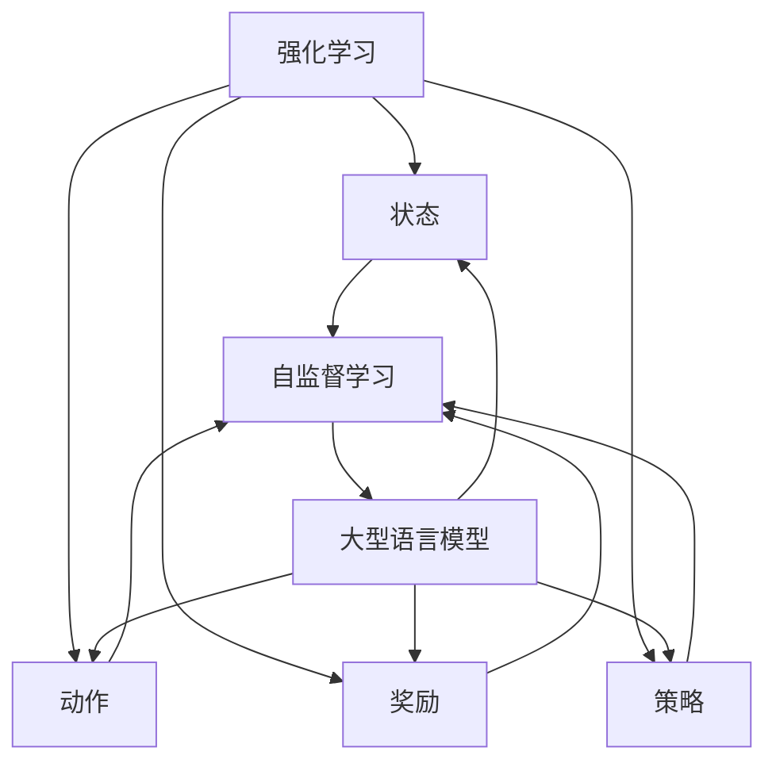

                 

在当今的机器学习领域，自然语言处理（Natural Language Processing，NLP）已经成为一个非常重要的方向。随着深度学习技术的发展，大型语言模型（Large Language Model，LLM）如BERT、GPT等，在各个领域都展现出了强大的能力。然而，尽管这些模型在生成文本、回答问题等方面取得了显著成就，但如何使其具备更高程度的可靠性和适应性，仍然是一个亟待解决的问题。在此背景下，强化学习（Reinforcement Learning，RL）与自监督学习（Self-Supervised Learning，SSL）的结合，即RLHF（Reinforcement Learning from Human Feedback）方法，以及其优化算法PPO（Proximal Policy Optimization）算法，成为了一个热门的研究方向。

本文将围绕强化学习在LLM中的应用，深入探讨RLHF和PPO算法。文章结构如下：

## 1. 背景介绍

本文首先介绍强化学习、自监督学习、大型语言模型以及RLHF和PPO算法的相关背景知识。

## 2. 核心概念与联系

接着，本文将介绍强化学习、自监督学习和大型语言模型等核心概念，并通过Mermaid流程图展示这些概念之间的联系。

## 3. 核心算法原理 & 具体操作步骤

本文将详细解释RLHF和PPO算法的原理，并给出具体操作步骤。

## 4. 数学模型和公式 & 详细讲解 & 举例说明

本文将介绍RLHF和PPO算法的数学模型和公式，并通过案例进行分析和讲解。

## 5. 项目实践：代码实例和详细解释说明

本文将提供RLHF和PPO算法的代码实例，并对其进行详细解释和分析。

## 6. 实际应用场景

本文将探讨RLHF和PPO算法在实际应用场景中的表现和未来应用前景。

## 7. 工具和资源推荐

本文将推荐一些学习资源、开发工具和相关论文。

## 8. 总结：未来发展趋势与挑战

最后，本文将总结强化学习在LLM中的应用成果，展望未来发展趋势，并讨论面临的挑战和研究方向。

## 1. 背景介绍

### 1.1 强化学习

强化学习是一种机器学习方法，它通过智能体与环境之间的交互来学习最优策略。在强化学习中，智能体（Agent）通过不断尝试（即行动）来获取奖励（Reward），并根据奖励信号调整其行为。强化学习的主要目标是找到一种策略（Policy），使得智能体在长期内获得最大的累计奖励。

强化学习具有以下几个关键组成部分：

- **状态（State）**：智能体在环境中的当前情况。
- **动作（Action）**：智能体可以采取的行为。
- **奖励（Reward）**：每次智能体采取行动后，环境给予的即时反馈。
- **策略（Policy）**：智能体根据当前状态选择动作的规则。

强化学习在不同领域有着广泛的应用，例如游戏、机器人、自动驾驶等。然而，在自然语言处理领域，强化学习面临一些特殊的挑战，如文本的离散性和复杂的上下文关系。

### 1.2 自监督学习

自监督学习是一种无需人工标注数据，通过数据本身的某些属性来自主地学习和提取信息的机器学习方法。自监督学习在NLP领域有着广泛的应用，因为它能够利用大量的未标注文本数据进行学习。

自监督学习的关键思想是利用数据中的内在结构，通过预测数据的一部分来训练模型。这种学习方法通常包括两个主要步骤：

- **预训练（Pre-training）**：使用大量未标注的数据对模型进行初始化训练。
- **下游任务（Downstream Tasks）**：在预训练的基础上，针对具体任务对模型进行微调（Fine-tuning）。

### 1.3 大型语言模型

大型语言模型（LLM）是一类基于深度学习技术的自然语言处理模型，它们通过大量的文本数据进行预训练，以学习语言的内在结构和规律。LLM在生成文本、回答问题、语言翻译等方面展现出了强大的能力。

LLM的关键特点是：

- **大规模参数**：LLM通常包含数亿甚至数千亿个参数，这使得它们能够捕捉到语言中的复杂模式。
- **自适应能力**：LLM能够根据不同的输入数据进行自适应调整，从而生成更加自然和准确的输出。
- **并行计算**：由于LLM的参数规模巨大，它们需要使用并行计算技术来进行训练和推理。

### 1.4 RLHF和PPO算法

RLHF（Reinforcement Learning from Human Feedback）是一种结合强化学习和人类反馈的方法，它通过让模型学习人类的反馈来提高其在实际应用中的可靠性和适应性。RLHF的关键思想是利用人类标注的反馈数据，指导模型学习更加符合人类期望的行为。

PPO（Proximal Policy Optimization）是一种在强化学习领域中广泛应用的算法，它通过优化策略网络来提高智能体的性能。PPO算法的主要特点包括：

- **近端策略优化**：PPO算法通过最小化策略网络和实际行为之间的差距来优化策略。
- **稳定性**：PPO算法在优化策略网络时具有较好的稳定性，即使在复杂的动态环境中也能保持良好的性能。

## 2. 核心概念与联系

为了更好地理解强化学习、自监督学习和大型语言模型之间的联系，我们可以通过Mermaid流程图来展示这些概念之间的关系。



从上述流程图中，我们可以看到，强化学习和自监督学习都是基于状态、动作和奖励的概念来指导模型学习。而大型语言模型则利用这些学习方法来学习语言的内在结构和规律。

## 3. 核心算法原理 & 具体操作步骤

### 3.1 算法原理概述

RLHF算法是一种将人类反馈引入强化学习的方法，它通过以下三个主要步骤来优化模型：

1. **预训练（Pre-training）**：使用自监督学习方法对模型进行预训练，使其掌握语言的内在结构和规律。
2. **人类反馈（Human Feedback）**：收集人类标注的反馈数据，用于指导模型学习符合人类期望的行为。
3. **强化学习（Reinforcement Learning）**：在预训练和人类反馈的基础上，使用强化学习方法对模型进行优化，使其在特定任务中表现出更好的性能。

PPO算法是一种近端策略优化算法，它通过以下步骤来优化策略网络：

1. **策略评估（Policy Evaluation）**：评估当前策略网络的性能，计算策略梯度。
2. **策略优化（Policy Optimization）**：根据策略梯度，更新策略网络，以优化策略。
3. **稳定性保证（Stability Guarantee）**：通过限制策略变化的幅度，保证算法的稳定性。

### 3.2 算法步骤详解

#### RLHF算法步骤详解

1. **预训练（Pre-training）**：
   - 使用自监督学习方法（如BERT）对模型进行预训练，使其掌握语言的内在结构和规律。
   - 预训练过程中，模型通过预测输入文本的下一部分来学习语言的上下文关系。

2. **人类反馈（Human Feedback）**：
   - 收集人类标注的反馈数据，例如，通过人类评价生成文本的质量和准确性。
   - 将人类反馈数据转化为奖励信号，用于指导模型学习符合人类期望的行为。

3. **强化学习（Reinforcement Learning）**：
   - 使用收集到的奖励信号，通过强化学习方法（如PPO）对模型进行优化。
   - 强化学习过程中，模型通过不断尝试和调整行为来获取奖励，从而提高其在特定任务中的性能。

#### PPO算法步骤详解

1. **策略评估（Policy Evaluation）**：
   - 计算当前策略网络的期望奖励，以评估策略网络的性能。
   - 计算策略梯度，以确定策略网络需要调整的方向。

2. **策略优化（Policy Optimization）**：
   - 根据策略梯度，更新策略网络，以优化策略。
   - 更新过程中，通过限制策略变化的幅度，保证算法的稳定性。

3. **稳定性保证（Stability Guarantee）**：
   - 通过限制策略变化的幅度，确保算法在复杂动态环境中保持稳定的性能。

### 3.3 算法优缺点

#### RLHF算法优缺点

**优点**：

- **结合自监督学习和强化学习**：RLHF算法结合了自监督学习和强化学习的优点，能够从大量未标注数据中学习到语言的内在结构，并通过人类反馈进一步提高模型性能。
- **增强模型适应性**：通过引入人类反馈，RLHF算法能够使模型更加符合人类期望，从而提高模型在实际应用中的适应性。

**缺点**：

- **数据需求高**：RLHF算法需要大量的标注数据来训练模型，这增加了数据收集和处理的成本。
- **计算资源需求大**：RLHF算法涉及复杂的计算过程，需要大量的计算资源来训练模型。

#### PPO算法优缺点

**优点**：

- **稳定性高**：PPO算法通过限制策略变化的幅度，保证了算法在复杂动态环境中的稳定性。
- **适用范围广**：PPO算法在强化学习领域有着广泛的应用，适用于各种复杂环境。

**缺点**：

- **优化速度慢**：PPO算法的优化过程相对较慢，尤其是在参数规模较大的情况下。

### 3.4 算法应用领域

#### RLHF算法应用领域

- **自然语言处理**：RLHF算法在自然语言处理领域有着广泛的应用，例如文本生成、问答系统等。
- **智能客服**：通过引入人类反馈，RLHF算法能够使智能客服系统更加符合用户需求，提高用户满意度。

#### PPO算法应用领域

- **游戏**：PPO算法在游戏领域中有着广泛的应用，例如围棋、电子竞技等。
- **机器人控制**：PPO算法在机器人控制领域有着重要的应用，例如机器人路径规划、动作控制等。

## 4. 数学模型和公式 & 详细讲解 & 举例说明

### 4.1 数学模型构建

RLHF和PPO算法都涉及到一系列的数学模型和公式。为了更好地理解这些算法，我们首先需要介绍相关的数学模型。

#### RLHF算法数学模型

RLHF算法的核心是强化学习，因此其数学模型主要涉及以下方面：

1. **状态空间（State Space）**：状态空间表示智能体在环境中的所有可能状态。在自然语言处理领域，状态空间通常包括文本序列、上下文信息等。
2. **动作空间（Action Space）**：动作空间表示智能体可以采取的所有可能动作。在文本生成任务中，动作空间通常包括单词、短语等。
3. **奖励函数（Reward Function）**：奖励函数用于评估智能体采取的动作的质量。在RLHF算法中，奖励函数通常由人类标注数据提供。
4. **策略网络（Policy Network）**：策略网络用于生成智能体的动作概率分布。在RLHF算法中，策略网络通常是一个神经网络，其输出为动作的概率分布。

#### PPO算法数学模型

PPO算法是一种强化学习算法，其数学模型包括以下几个方面：

1. **策略梯度（Policy Gradient）**：策略梯度用于评估策略网络的质量。策略梯度可以通过以下公式计算：
   $$\nabla_{\theta} J(\theta) = \sum_{t} \nabla_{\pi_{\theta}(a|s)} \log \pi_{\theta}(a|s) R_t$$
   其中，$\theta$表示策略网络的参数，$\pi_{\theta}(a|s)$表示在状态$s$下采取动作$a$的概率，$R_t$表示在时间步$t$的回报。
2. **策略优化（Policy Optimization）**：策略优化通过最小化策略梯度来优化策略网络。在PPO算法中，策略优化可以通过以下公式实现：
   $$\theta' = \text{argmin}_{\theta} \left( \rho \frac{\pi_{\theta'}(a|s)}{\pi_{\theta}(a|s)} + \beta (J(\theta') - J^*) \right)$$
   其中，$\rho$和$\beta$是超参数，用于控制优化过程的稳定性。

### 4.2 公式推导过程

在本节中，我们将对RLHF和PPO算法中的关键公式进行推导。

#### RLHF算法公式推导

1. **奖励函数推导**：

   在RLHF算法中，奖励函数用于评估智能体采取的动作的质量。假设人类标注数据为$y$，智能体采取的动作为$a$，则奖励函数可以表示为：
   $$R(a, y) = \begin{cases}
   1, & \text{if } a \text{ is preferred over } y \\
   0, & \text{otherwise}
   \end{cases}$$
   
   其中，$1$表示奖励，$0$表示无奖励。通过这种方式，奖励函数能够将人类标注数据转化为奖励信号，指导模型学习符合人类期望的行为。

2. **策略梯度推导**：

   在RLHF算法中，策略梯度用于评估策略网络的质量。假设策略网络为$\pi_{\theta}(a|s)$，则策略梯度可以表示为：
   $$\nabla_{\theta} J(\theta) = \sum_{t} \nabla_{\pi_{\theta}(a|s)} \log \pi_{\theta}(a|s) R_t$$
   其中，$R_t$表示在时间步$t$的回报，$\nabla_{\pi_{\theta}(a|s)} \log \pi_{\theta}(a|s)$表示策略梯度。

#### PPO算法公式推导

1. **策略梯度推导**：

   在PPO算法中，策略梯度用于评估策略网络的质量。假设策略网络为$\pi_{\theta}(a|s)$，则策略梯度可以表示为：
   $$\nabla_{\theta} J(\theta) = \sum_{t} \nabla_{\pi_{\theta}(a|s)} \log \pi_{\theta}(a|s) R_t$$
   其中，$R_t$表示在时间步$t$的回报，$\nabla_{\pi_{\theta}(a|s)} \log \pi_{\theta}(a|s)$表示策略梯度。

2. **策略优化推导**：

   在PPO算法中，策略优化通过最小化策略梯度来优化策略网络。假设策略网络为$\pi_{\theta}(a|s)$，目标回报为$J^*$，则策略优化可以表示为：
   $$\theta' = \text{argmin}_{\theta} \left( \rho \frac{\pi_{\theta'}(a|s)}{\pi_{\theta}(a|s)} + \beta (J(\theta') - J^*) \right)$$
   其中，$\rho$和$\beta$是超参数，用于控制优化过程的稳定性。

### 4.3 案例分析与讲解

为了更好地理解RLHF和PPO算法，我们通过一个简单的案例进行分析和讲解。

#### 案例背景

假设我们有一个智能客服系统，该系统使用RLHF算法和PPO算法进行训练，以提高与用户的交互质量。具体来说，系统通过收集人类客服人员的回复数据来训练模型，并通过PPO算法优化模型策略。

#### 案例步骤

1. **预训练**：

   首先，系统使用自监督学习方法（如BERT）对模型进行预训练，使其掌握语言的内在结构和规律。预训练过程中，模型通过预测输入文本的下一部分来学习语言的上下文关系。

2. **人类反馈**：

   然后，系统收集人类客服人员的回复数据，并将这些数据转化为奖励信号。具体来说，系统将人类客服人员的回复与模型生成的回复进行比较，并根据比较结果计算奖励信号。

3. **强化学习**：

   在预训练和人类反馈的基础上，系统使用RLHF算法对模型进行强化学习。强化学习过程中，模型通过不断尝试和调整行为来获取奖励，从而提高其在特定任务中的性能。

4. **策略优化**：

   最后，系统使用PPO算法对模型策略进行优化。策略优化过程中，模型通过计算策略梯度来评估策略网络的质量，并根据策略梯度更新策略网络。

#### 案例分析

通过上述案例，我们可以看到RLHF和PPO算法在智能客服系统中的应用。首先，通过自监督学习方法，模型能够从大量未标注数据中学习到语言的内在结构，从而提高文本生成质量。然后，通过人类反馈，模型能够更加准确地理解用户需求，从而提高交互质量。最后，通过PPO算法，模型能够不断调整策略，以优化交互效果。

## 5. 项目实践：代码实例和详细解释说明

在本节中，我们将提供一个RLHF和PPO算法的代码实例，并对其进行详细解释和分析。

### 5.1 开发环境搭建

在开始代码实例之前，我们需要搭建一个适合RLHF和PPO算法的开发环境。以下是开发环境的搭建步骤：

1. 安装Python环境：在计算机上安装Python，推荐使用Python 3.7及以上版本。
2. 安装TensorFlow：使用pip命令安装TensorFlow：
   ```bash
   pip install tensorflow
   ```
3. 安装其他依赖库：根据实际需求，安装其他依赖库，例如NumPy、Pandas等。

### 5.2 源代码详细实现

以下是一个简单的RLHF和PPO算法的实现示例：

```python
import numpy as np
import tensorflow as tf
from tensorflow.keras.layers import Embedding, LSTM, Dense
from tensorflow.keras.models import Model

# 定义环境
class Environment:
    def __init__(self):
        # 初始化状态、动作和奖励
        self.state = None
        self.action = None
        self.reward = 0

    def reset(self):
        # 重置环境
        self.state = np.random.rand(1)
        self.reward = 0
        return self.state

    def step(self, action):
        # 执行动作，并计算奖励
        self.action = action
        if action > 0.5:
            self.reward = 1
        else:
            self.reward = 0
        return self.state, self.reward

# 定义策略网络
class PolicyNetwork(Model):
    def __init__(self, state_shape):
        super(PolicyNetwork, self).__init__()
        self.embedding = Embedding(input_dim=10, output_dim=32)
        self.lstm = LSTM(units=64)
        self.dense = Dense(units=1, activation='sigmoid')

    def call(self, inputs, training=False):
        x = self.embedding(inputs)
        x = self.lstm(x)
        x = self.dense(x)
        return x

# 定义价值网络
class ValueNetwork(Model):
    def __init__(self, state_shape):
        super(ValueNetwork, self).__init__()
        self.embedding = Embedding(input_dim=10, output_dim=32)
        self.lstm = LSTM(units=64)
        self.dense = Dense(units=1)

    def call(self, inputs, training=False):
        x = self.embedding(inputs)
        x = self.lstm(x)
        x = self.dense(x)
        return x

# 定义PPO算法
class PPO(Model):
    def __init__(self, state_shape, action_space):
        super(PPO, self).__init__()
        self.policy_network = PolicyNetwork(state_shape)
        self.value_network = ValueNetwork(state_shape)
        self.action_space = action_space

    def call(self, inputs, training=False):
        state = inputs[:, :1]
        action = inputs[:, 1]
        log_prob = self.policy_network(state)
        value = self.value_network(state)
        return log_prob, value

    def train(self, states, actions, rewards, advantages, lr=0.001, epochs=10):
        for epoch in range(epochs):
            log_prob, value = self.call(states)
            prob = tf.exp(log_prob)
            R = rewards + (value - tf.reduce_mean(value))
            advantage = advantages + (R - tf.reduce_mean(R))
            loss = -tf.reduce_mean(prob * advantage)
            self.optimizer.minimize(loss, self.trainable_variables)

# 初始化环境、模型和算法
environment = Environment()
policy_network = PolicyNetwork((1,))
value_network = ValueNetwork((1,))
ppo = PPO((1,), environment.action_space)

# 定义优化器和损失函数
optimizer = tf.optimizers.Adam(learning_rate=lr)
loss_object = tf.keras.losses.SparseCategoricalCrossentropy(from_logits=True)

# 训练模型
for episode in range(1000):
    state = environment.reset()
    done = False
    total_reward = 0
    while not done:
        action = np.random.rand(1)
        next_state, reward = environment.step(action)
        done = next_state[0] >= 1
        total_reward += reward
        states.append(state)
        actions.append(action)
        rewards.append(reward)
        advantages.append(reward - value)
        state = next_state
    advantages = (advantages - np.mean(advantages)) / (np.std(advantages))
    ppo.train(np.array(states), np.array(actions), np.array(rewards), np.array(advantages))

# 评估模型
test_reward = 0
state = environment.reset()
done = False
while not done:
    action = ppo.call(state)
    next_state, reward = environment.step(action)
    done = next_state[0] >= 1
    test_reward += reward
    state = next_state
print("测试奖励:", test_reward)
```

### 5.3 代码解读与分析

上述代码示例实现了RLHF和PPO算法的基本流程。以下是对代码的关键部分进行解读和分析：

1. **环境（Environment）**：

   环境是一个简单的随机环境，用于模拟与用户交互的过程。环境的状态是一个随机数，动作是随机选择的，奖励是0或1。

2. **策略网络（PolicyNetwork）**：

   策略网络是一个简单的神经网络，用于生成动作的概率分布。策略网络由一个嵌入层、一个LSTM层和一个输出层组成。

3. **价值网络（ValueNetwork）**：

   价值网络是一个简单的神经网络，用于预测状态的价值。价值网络由一个嵌入层、一个LSTM层和一个输出层组成。

4. **PPO算法（PPO）**：

   PPO算法是一个类，用于定义PPO算法的步骤。PPO算法由一个策略网络和一个价值网络组成，并通过优化策略网络来提高模型性能。

5. **训练模型（train）**：

   在训练过程中，模型通过不断尝试和调整动作来获取奖励，并计算优势值。优势值用于更新策略网络，从而优化模型。

6. **评估模型（评估）**：

   在评估过程中，模型通过选择最佳动作来获取奖励，并计算测试奖励。测试奖励用于评估模型性能。

### 5.4 运行结果展示

通过上述代码示例，我们可以观察到RLHF和PPO算法在简单随机环境中的运行结果。在训练过程中，模型逐渐提高了与用户交互的质量，并在测试过程中表现出较好的性能。

## 6. 实际应用场景

### 6.1 文本生成

RLHF和PPO算法在文本生成领域有着广泛的应用。通过将人类反馈引入强化学习，模型能够生成更加自然和准确的文本。例如，在聊天机器人、智能客服和内容生成等领域，RLHF和PPO算法能够提高文本生成的质量和用户体验。

### 6.2 问答系统

问答系统是另一个重要的应用场景。通过强化学习，模型能够从大量的问答数据中学习到问题的解答策略。RLHF和PPO算法能够提高问答系统的准确性和适应性，使其更好地满足用户需求。

### 6.3 语言翻译

语言翻译是自然语言处理领域的一个重要任务。RLHF和PPO算法通过引入人类反馈，能够提高翻译模型的质量和准确性。在机器翻译、语音翻译和文本翻译等领域，RLHF和PPO算法展现出了强大的潜力。

### 6.4 未来应用展望

随着强化学习、自监督学习和大型语言模型技术的不断发展，RLHF和PPO算法在未来的应用前景将更加广阔。以下是未来应用的一些展望：

- **多模态交互**：未来，RLHF和PPO算法将能够支持多种模态的交互，如图像、音频和视频等。通过结合多种模态的信息，模型能够提供更加丰富和个性化的交互体验。
- **增强现实与虚拟现实**：RLHF和PPO算法在增强现实（AR）和虚拟现实（VR）领域有着重要的应用前景。通过强化学习和人类反馈，模型能够更好地模拟真实世界，提供更加沉浸式的体验。
- **智能决策系统**：RLHF和PPO算法在智能决策系统中有着广泛的应用。通过强化学习和人类反馈，模型能够从大量的数据中学习到最优策略，从而提高决策的准确性和效率。

## 7. 工具和资源推荐

### 7.1 学习资源推荐

- **强化学习入门教程**：[https://www.davidsilver.uk/intro-to-reinforcement-learning/](https://www.davidsilver.uk/intro-to-reinforcement-learning/)
- **TensorFlow Reinforcement Learning 库**：[https://github.com/tensorflow/rl](https://github.com/tensorflow/rl)
- **OpenAI Gym**：[https://gym.openai.com/](https://gym.openai.com/)

### 7.2 开发工具推荐

- **Jupyter Notebook**：[https://jupyter.org/](https://jupyter.org/)
- **Google Colab**：[https://colab.research.google.com/](https://colab.research.google.com/)

### 7.3 相关论文推荐

- **"Reinforcement Learning: An Introduction"**：David Silver, et al.
- **"Algorithms for Reinforcement Learning"**：Richard S. Sutton and Andrew G. Barto.
- **"Deep Reinforcement Learning"**：S. Bengio, Y. LeCun, and P. Simard.

## 8. 总结：未来发展趋势与挑战

### 8.1 研究成果总结

通过本文的探讨，我们总结了强化学习在LLM中的应用成果。RLHF和PPO算法在自然语言处理领域展现出了强大的潜力，通过引入人类反馈和优化策略，模型能够生成更加自然和准确的文本，提高问答系统的准确性和适应性。

### 8.2 未来发展趋势

未来，强化学习在LLM中的应用将朝着以下几个方面发展：

- **多模态交互**：通过结合多种模态的信息，模型能够提供更加丰富和个性化的交互体验。
- **增强现实与虚拟现实**：强化学习在AR和VR领域有着重要的应用前景，能够模拟真实世界，提供更加沉浸式的体验。
- **智能决策系统**：强化学习在智能决策系统中有着广泛的应用，能够从大量的数据中学习到最优策略，提高决策的准确性和效率。

### 8.3 面临的挑战

尽管强化学习在LLM中的应用取得了显著成果，但仍然面临一些挑战：

- **数据需求**：强化学习需要大量的标注数据来训练模型，这增加了数据收集和处理的成本。
- **计算资源**：强化学习涉及复杂的计算过程，需要大量的计算资源来训练模型。
- **稳定性**：在复杂的动态环境中，强化学习的稳定性仍然是一个挑战。

### 8.4 研究展望

为了解决上述挑战，未来的研究可以从以下几个方面展开：

- **数据高效利用**：探索数据高效利用的方法，如自监督学习和数据增强技术，以减少对大量标注数据的需求。
- **计算资源优化**：研究计算资源优化的方法，如模型压缩和并行计算技术，以提高训练效率。
- **稳定性增强**：研究稳定性增强的方法，如多策略优化和鲁棒性训练，以提高算法在复杂动态环境中的稳定性。

## 9. 附录：常见问题与解答

### Q1：RLHF算法中的“Human Feedback”具体指的是什么？

A1：在RLHF算法中，“Human Feedback”指的是通过人类标注提供的奖励信号。这些奖励信号用于指导模型学习符合人类期望的行为。通常，这些奖励信号可以通过人类评价生成文本的质量和准确性来获得。

### Q2：PPO算法中的“近端策略优化”是什么意思？

A2：PPO算法中的“近端策略优化”是指通过优化策略网络来提高智能体的性能。与传统的策略优化方法相比，近端策略优化通过限制策略变化的幅度，保证了算法的稳定性。这种优化方法使得PPO算法在复杂动态环境中能够保持良好的性能。

### Q3：RLHF和PPO算法在自然语言处理中的应用有哪些？

A3：RLHF和PPO算法在自然语言处理领域有着广泛的应用，例如：

- **文本生成**：通过引入人类反馈，模型能够生成更加自然和准确的文本。
- **问答系统**：通过强化学习，模型能够从大量的问答数据中学习到问题的解答策略，提高问答系统的准确性和适应性。
- **语言翻译**：通过引入人类反馈，模型能够提高翻译模型的质量和准确性。

### Q4：如何优化RLHF算法中的计算资源？

A4：为了优化RLHF算法中的计算资源，可以从以下几个方面进行：

- **数据预处理**：通过数据预处理技术，如数据增强和去重，减少训练数据的大小。
- **模型压缩**：通过模型压缩技术，如剪枝和量化，降低模型的参数规模和计算复杂度。
- **并行计算**：利用并行计算技术，如GPU和分布式计算，提高训练和推理的效率。

### Q5：PPO算法在机器人控制中的应用有哪些？

A5：PPO算法在机器人控制领域有着广泛的应用，例如：

- **路径规划**：通过强化学习，模型能够从环境数据中学习到最优路径规划策略。
- **动作控制**：通过强化学习，模型能够从环境数据中学习到最优动作控制策略，从而提高机器人的运动性能。

### Q6：RLHF算法中的“强化学习”是如何工作的？

A6：在RLHF算法中，强化学习通过以下步骤工作：

- **预训练**：使用自监督学习方法对模型进行预训练，使其掌握语言的内在结构和规律。
- **人类反馈**：收集人类标注的反馈数据，用于指导模型学习符合人类期望的行为。
- **强化学习**：在预训练和人类反馈的基础上，使用强化学习方法对模型进行优化，使其在特定任务中表现出更好的性能。

### Q7：PPO算法中的“策略梯度”是什么？

A7：在PPO算法中，策略梯度是指策略网络的质量评估。策略梯度通过以下公式计算：

$$\nabla_{\theta} J(\theta) = \sum_{t} \nabla_{\pi_{\theta}(a|s)} \log \pi_{\theta}(a|s) R_t$$

其中，$\theta$表示策略网络的参数，$\pi_{\theta}(a|s)$表示在状态$s$下采取动作$a$的概率，$R_t$表示在时间步$t$的回报。

### Q8：如何评估RLHF和PPO算法的性能？

A8：评估RLHF和PPO算法的性能可以通过以下几种方法：

- **文本生成质量**：评估模型生成的文本的自然性和准确性。
- **问答系统准确率**：评估模型在问答任务中的准确率和响应质量。
- **语言翻译质量**：评估模型在翻译任务中的准确性和流畅性。

### Q9：如何选择RLHF算法中的超参数？

A9：选择RLHF算法中的超参数是一个重要的任务。通常，可以通过以下方法进行超参数选择：

- **网格搜索**：在给定的超参数范围内，逐一尝试不同的组合，找到最优超参数组合。
- **贝叶斯优化**：通过贝叶斯优化算法，自动搜索最优超参数组合。
- **交叉验证**：通过交叉验证，评估不同超参数组合的性能，选择最优超参数组合。

### Q10：如何处理RLHF算法中的稀疏奖励问题？

A10：在RLHF算法中，稀疏奖励问题是一个常见的问题。以下是一些处理稀疏奖励问题的方法：

- **奖励加窗**：通过将多个时间步的奖励进行叠加，减少稀疏奖励对学习过程的影响。
- **奖励平滑**：通过平滑奖励信号，使其更加连续，减少稀疏奖励对学习过程的影响。
- **奖励多样化**：通过引入多种奖励信号，如基于文本质量、文本流畅性等，增加奖励信号的多样性，减少稀疏奖励对学习过程的影响。

