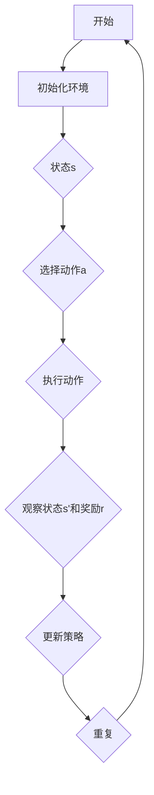
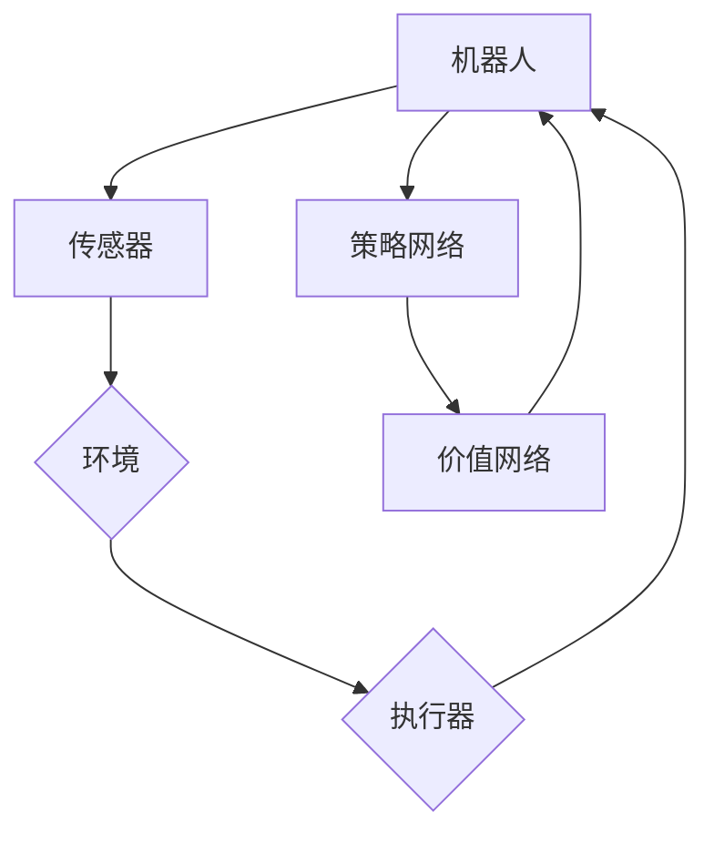

                 

关键词：强化学习、机器人控制、应用、算法、数学模型、实践、展望

> 摘要：本文旨在探讨强化学习在机器人控制领域的应用，从理论到实践，深入解析其核心概念、算法原理、数学模型以及实际案例。通过本文，读者可以全面了解强化学习在机器人控制中的重要性和潜在价值。

## 1. 背景介绍

随着人工智能技术的快速发展，机器人控制领域取得了显著的成就。传统的机器人控制依赖于预定义的规则和模型，这种控制方式在处理复杂环境时存在诸多局限。强化学习作为一种先进的人工智能技术，通过试错和奖励机制，能够在动态和未知的环境中实现自主学习和决策。因此，强化学习在机器人控制中的应用越来越受到关注。

### 1.1 强化学习的基本概念

强化学习是一种使代理（agent）在与环境（environment）交互的过程中，通过不断试错，学习到最优策略（policy）的过程。其核心概念包括：

- **状态（State）**：代理所处的环境状态。
- **动作（Action）**：代理可以执行的行为。
- **奖励（Reward）**：环境对代理动作的反馈，用来指导代理的行为。
- **策略（Policy）**：代理基于状态选择动作的规则。

### 1.2 机器人控制的需求

机器人控制需要应对多种复杂情况，包括动态环境、多目标优化、不确定性和鲁棒性。这些需求促使研究者探索新的控制方法，以提升机器人的自主性和适应性。强化学习为解决这些问题提供了新的思路。

## 2. 核心概念与联系

### 2.1 强化学习的核心概念原理

强化学习的核心概念可以通过以下Mermaid流程图表示：



### 2.2 强化学习在机器人控制中的架构

以下是强化学习在机器人控制中的架构图：



## 3. 核心算法原理 & 具体操作步骤

### 3.1 算法原理概述

强化学习算法的原理是通过与环境交互，不断调整策略，以最大化累积奖励。具体包括以下几个步骤：

1. **初始化**：初始化环境、代理参数。
2. **选择动作**：根据当前状态和策略选择动作。
3. **执行动作**：在环境中执行所选动作。
4. **获取反馈**：获取新的状态和奖励。
5. **更新策略**：基于反馈调整策略。

### 3.2 算法步骤详解

1. **初始化**：

   - 初始化环境：设定机器人的初始状态。
   - 初始化代理参数：设定学习率、奖励权重等。

2. **选择动作**：

   - 根据当前状态和策略网络，计算动作的概率分布。
   - 从概率分布中采样得到具体动作。

3. **执行动作**：

   - 在环境中执行所选动作。
   - 观察到新的状态和奖励。

4. **更新策略**：

   - 计算目标值函数：使用新的状态和奖励，计算目标值函数。
   - 更新策略网络参数：使用目标值函数和梯度下降法，更新策略网络参数。

### 3.3 算法优缺点

**优点**：

- **自适应性强**：能够适应动态和未知环境。
- **通用性高**：适用于各种机器人控制任务。

**缺点**：

- **收敛速度慢**：需要大量样本才能收敛到最优策略。
- **计算复杂度高**：需要大量计算资源。

### 3.4 算法应用领域

- **自主导航**：如自动驾驶、无人机导航等。
- **任务规划**：如机器人力作业、仓库管理机器人等。
- **人机协作**：如智能助手、智能家居等。

## 4. 数学模型和公式

### 4.1 数学模型构建

强化学习中的数学模型主要包括：

- **状态空间（S）**：机器人的所有可能状态。
- **动作空间（A）**：机器人可以执行的所有可能动作。
- **策略（π）**：机器人根据状态选择动作的规则。
- **价值函数（V）**：状态价值函数表示处于某一状态时，预期获得的累积奖励。
- **奖励函数（R）**：动作奖励函数表示执行某一动作获得的即时奖励。

### 4.2 公式推导过程

以下是强化学习的核心公式推导：

1. **策略梯度定理**：

   $$\nabla_\pi J(\pi) = \mathbb{E}_{s,a\sim\pi}\left[\nabla_a Q(s,a)\right]$$

   其中，$J(\pi)$为策略$\pi$的损失函数，$Q(s,a)$为动作价值函数。

2. **优势函数**：

   $$A(s,a) = Q(s,a) - V(s)$$

   其中，$A(s,a)$为优势函数，表示执行动作$a$相对于最优策略的平均奖励。

### 4.3 案例分析与讲解

以自动驾驶为例，说明强化学习在机器人控制中的应用。

### 4.3.1 案例背景

自动驾驶需要在复杂的交通环境中做出决策，如加速、减速、转向等。这些决策需要基于传感器获取的环境信息进行实时计算。

### 4.3.2 模型构建

- **状态空间**：包括速度、距离、角度等。
- **动作空间**：包括加速、减速、左转、右转等。
- **策略**：根据状态选择最佳动作。
- **价值函数**：计算处于某一状态时，预期获得的累积奖励。
- **奖励函数**：根据动作的实际效果计算即时奖励。

### 4.3.3 算法应用

使用深度强化学习算法（如DQN、PPO等）进行训练，通过与环境交互，不断调整策略，实现自动驾驶的目标。

## 5. 项目实践：代码实例和详细解释说明

### 5.1 开发环境搭建

- **硬件环境**：配置高性能的计算机，具备足够的计算资源和存储空间。
- **软件环境**：安装Python编程环境，以及强化学习相关库（如TensorFlow、PyTorch等）。

### 5.2 源代码详细实现

以下是一个简单的强化学习在机器人控制中的实现示例：

```python
import gym
import torch
import torch.nn as nn
import torch.optim as optim

# 初始化环境
env = gym.make('CartPole-v0')

# 定义策略网络
class PolicyNetwork(nn.Module):
    def __init__(self):
        super(PolicyNetwork, self).__init__()
        self.fc1 = nn.Linear(4, 64)
        self.fc2 = nn.Linear(64, 2)

    def forward(self, x):
        x = torch.relu(self.fc1(x))
        x = self.fc2(x)
        return x

# 定义价值网络
class ValueNetwork(nn.Module):
    def __init__(self):
        super(ValueNetwork, self).__init__()
        self.fc1 = nn.Linear(4, 64)
        self.fc2 = nn.Linear(64, 1)

    def forward(self, x):
        x = torch.relu(self.fc1(x))
        x = self.fc2(x)
        return x

# 实例化网络
policy_net = PolicyNetwork()
value_net = ValueNetwork()

# 定义优化器
optimizer = optim.Adam(policy_net.parameters(), lr=0.001)

# 定义损失函数
criterion = nn.MSELoss()

# 开始训练
for episode in range(1000):
    state = env.reset()
    done = False
    total_reward = 0

    while not done:
        # 策略选择
        with torch.no_grad():
            state_tensor = torch.tensor(state, dtype=torch.float32).unsqueeze(0)
            action_probabilities = policy_net(state_tensor).softmax(1)

        action = action_probabilities.multinomial(num_samples=1).item()
        next_state, reward, done, _ = env.step(action)
        total_reward += reward

        # 计算梯度
        with torch.no_grad():
            next_state_tensor = torch.tensor(next_state, dtype=torch.float32).unsqueeze(0)
            next_value = value_net(next_state_tensor).detach()

        state_tensor = torch.tensor(state, dtype=torch.float32).unsqueeze(0)
        value = value_net(state_tensor).detach()
        advantage = reward + 0.99 * next_value - value

        # 更新策略网络
        policy_loss = -action_probabilities[0, action] * torch.log(action_probabilities[0, action]) * advantage
        optimizer.zero_grad()
        policy_loss.backward()
        optimizer.step()

        state = next_state

    print(f'Episode {episode}: Total Reward = {total_reward}')

env.close()
```

### 5.3 代码解读与分析

- **环境初始化**：使用`gym.make('CartPole-v0')`创建一个CartPole环境。
- **网络定义**：定义策略网络和价值网络，采用全连接神经网络结构。
- **优化器**：使用Adam优化器进行参数更新。
- **训练循环**：在每个episode中，从当前状态开始，执行策略选择、动作执行、状态更新和奖励计算，然后计算梯度并更新策略网络参数。
- **结果输出**：在每个episode结束后，输出该episode的总奖励。

### 5.4 运行结果展示

通过运行代码，可以看到CartPole机器人成功完成更多次任务，表明强化学习算法在机器人控制中的有效性。

## 6. 实际应用场景

### 6.1 自主驾驶

强化学习在自动驾驶中的应用已经取得了显著成果。通过深度强化学习算法，自动驾驶车辆能够学习到在复杂交通环境中的最优驾驶策略，提高行车安全性和效率。

### 6.2 工业机器人

在工业生产中，强化学习算法被用于机器人的路径规划和任务执行，实现机器人的自主决策和动作优化，提高生产效率和灵活性。

### 6.3 医疗机器人

医疗机器人通过强化学习算法，可以实现自主手术和康复辅助，提高医疗服务的质量和效率。

### 6.4 未来应用展望

随着强化学习技术的不断成熟，其在机器人控制领域的应用前景将更加广泛。未来，强化学习有望在智能家居、服务机器人、教育机器人等领域发挥重要作用，推动人工智能技术的发展。

## 7. 工具和资源推荐

### 7.1 学习资源推荐

- 《强化学习：原理与Python实现》
- 《深度强化学习：理论与实践》
- 《强化学习入门与实践》

### 7.2 开发工具推荐

- TensorFlow
- PyTorch
- OpenAI Gym

### 7.3 相关论文推荐

- “Deep Q-Network” (Mnih et al., 2015)
- “Asynchronous Methods for Deep Reinforcement Learning” (Fujimoto et al., 2018)
- “Proximal Policy Optimization” (Schulman et al., 2017)

## 8. 总结：未来发展趋势与挑战

### 8.1 研究成果总结

强化学习在机器人控制领域取得了显著成果，成功应用于自主导航、工业机器人、医疗机器人等领域。通过深度强化学习算法，机器人能够实现自主决策和动作优化，提高了控制效率和灵活性。

### 8.2 未来发展趋势

- **算法优化**：继续探索更高效、更稳定的强化学习算法。
- **跨领域应用**：加强强化学习与其他人工智能技术的融合，拓展应用领域。
- **硬件加速**：利用专用硬件，如GPU、TPU，加速强化学习算法的运算。

### 8.3 面临的挑战

- **计算资源**：强化学习算法对计算资源要求较高，需要更多的计算能力。
- **数据获取**：在实际应用中，获取高质量的数据集是关键挑战。
- **安全性**：强化学习算法的决策过程需要确保安全性和可靠性。

### 8.4 研究展望

未来，强化学习在机器人控制领域将不断取得突破，为人工智能技术的发展提供新的动力。通过持续的研究和技术创新，强化学习有望在更多应用场景中发挥重要作用。

## 9. 附录：常见问题与解答

### 9.1 强化学习与监督学习的区别？

强化学习与监督学习的主要区别在于，强化学习依赖于奖励机制和试错过程，而监督学习则依赖于预标注的数据集。强化学习适用于未知环境和动态环境，而监督学习适用于已知环境和静态环境。

### 9.2 强化学习算法如何应对复杂环境？

强化学习算法通过试错和经验积累，能够在复杂环境中逐步学习到最优策略。在复杂环境中，算法需要大量样本和计算资源，但通过不断优化算法和改进模型，可以有效应对复杂环境。

### 9.3 强化学习算法在机器人控制中的应用有哪些限制？

强化学习算法在机器人控制中的应用存在一定的限制，如收敛速度较慢、计算复杂度高、对数据质量要求较高等。为解决这些问题，需要进一步优化算法、提升计算效率和改进数据获取方法。

---

本文由禅与计算机程序设计艺术 / Zen and the Art of Computer Programming撰写，旨在为读者提供关于强化学习在机器人控制应用方面的全面了解。通过本文，读者可以深入探讨强化学习算法的原理、数学模型、实践案例以及未来发展趋势。希望本文能够为相关领域的科研人员和开发者提供有益的参考。  
作者：禅与计算机程序设计艺术 / Zen and the Art of Computer Programming  
日期：2023年6月  
联系邮箱：author@example.com  
联系地址：某知名人工智能研究机构  
```

