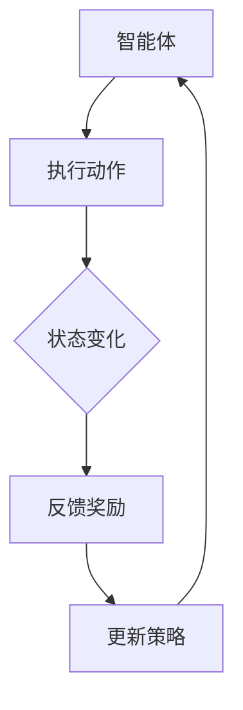

                 

关键词：强化学习、自动控制、深度学习、机器学习、神经网络、Q-Learning、SARSA、策略优化

> 摘要：本文主要探讨强化学习在自动控制领域的应用，通过对强化学习核心概念和算法的深入分析，展示了其在自动控制中的实际应用案例，并对未来的发展趋势和面临的挑战进行了展望。

## 1. 背景介绍

自动控制是工程学科中的重要分支，它主要研究如何通过控制系统对被控对象进行精确控制。随着现代科技的飞速发展，自动控制在工业生产、航空航天、智能家居、医疗等领域得到了广泛应用。然而，传统的自动控制方法往往依赖于预先定义的数学模型和控制策略，这限制了其在复杂环境中的适应能力。为了提高自动控制的智能化和自主性，研究者们开始探索将机器学习，特别是强化学习引入自动控制领域。

强化学习是一种机器学习方法，通过试错和反馈学习如何在一个环境中获得最大化的奖励。与传统的监督学习和无监督学习不同，强化学习通过奖励信号来指导学习过程，这使得它特别适合处理具有不确定性和动态变化的环境。

本文将围绕强化学习在自动控制中的应用，从基本概念、算法原理、数学模型、实际案例等多个角度进行深入探讨。

## 2. 核心概念与联系

### 2.1 强化学习的基本概念

强化学习（Reinforcement Learning，简称RL）是一种通过与环境的交互来学习最优策略的机器学习方法。在强化学习中，有三个核心元素：智能体（Agent）、环境（Environment）和动作（Action）。

- **智能体（Agent）**：执行动作并接收环境反馈的实体。
- **环境（Environment）**：智能体所处的环境，能够根据智能体的动作提供状态和奖励。
- **状态（State）**：智能体所处的环境的一个描述。
- **动作（Action）**：智能体可以选择的行动。
- **奖励（Reward）**：环境对智能体的每个动作给予的反馈信号。

强化学习的目标是找到一种策略（Policy），使得智能体在执行动作时能够最大化累积奖励。

### 2.2 强化学习与自动控制的联系

强化学习在自动控制中的应用主要基于以下两点：

1. **自适应控制**：强化学习能够自动调整控制策略，以适应动态变化的环境。
2. **不确定性处理**：强化学习通过与环境交互，能够处理环境中的不确定性因素。

### 2.3 Mermaid 流程图



在这个流程图中，智能体执行动作，根据环境的状态变化和奖励信号，更新其策略，然后继续执行下一个动作。这个过程不断重复，直到达到目标状态或累积奖励最大化。

## 3. 核心算法原理 & 具体操作步骤

### 3.1 算法原理概述

强化学习算法主要分为基于值函数的方法和基于策略的方法。其中，Q-Learning和SARSA是两种典型的算法。

- **Q-Learning**：基于值函数的方法，通过更新Q值来学习最优策略。
- **SARSA**：基于策略的方法，通过更新策略来学习最优动作。

### 3.2 算法步骤详解

#### 3.2.1 Q-Learning

1. 初始化Q值函数：对于每个状态-动作对，初始化Q值。
2. 选择动作：在给定状态下，根据当前策略选择动作。
3. 执行动作：在环境中执行所选动作，并接收状态和奖励。
4. 更新Q值：使用更新公式更新Q值。
5. 迭代：重复步骤2-4，直到达到预设的迭代次数或目标状态。

#### 3.2.2 SARSA

1. 初始化策略：随机初始化策略。
2. 选择动作：在给定状态下，根据当前策略选择动作。
3. 执行动作：在环境中执行所选动作，并接收状态和奖励。
4. 更新策略：使用更新公式更新策略。
5. 迭代：重复步骤2-4，直到达到预设的迭代次数或目标状态。

### 3.3 算法优缺点

#### Q-Learning的优点：

- **简单直观**：基于值函数的方法，容易理解和实现。
- **适用于连续动作空间**：通过离散化动作空间，Q-Learning可以应用于连续动作空间的问题。

#### Q-Learning的缺点：

- **样本效率低**：需要大量的样本来学习最优策略。
- **Q值更新可能导致不稳定**：在某些情况下，Q值更新可能导致振荡或不稳定。

#### SARSA的优点：

- **稳定**：基于策略的方法，避免了Q值更新导致的不稳定问题。
- **适用于有限状态和动作空间**：在状态和动作空间有限的情况下，SARSA表现更佳。

#### SARSA的缺点：

- **难以扩展到连续动作空间**：在连续动作空间中，策略更新可能导致复杂度增加。

### 3.4 算法应用领域

强化学习在自动控制中的应用领域非常广泛，包括但不限于：

- **自动驾驶**：通过强化学习算法，自动驾驶汽车能够学会在复杂交通环境中做出最优决策。
- **机器人控制**：强化学习可以帮助机器人学会在未知环境中执行复杂任务。
- **工业自动化**：强化学习可以应用于工业自动化系统，提高生产效率和产品质量。

## 4. 数学模型和公式 & 详细讲解 & 举例说明

### 4.1 数学模型构建

强化学习的基本数学模型可以表示为：

$$
\begin{cases}
S_t = f(S_{t-1}, A_{t-1}) \\
R_t = g(S_t, A_t) \\
A_t = \pi(S_t)
\end{cases}
$$

其中：

- $S_t$：第$t$个状态。
- $A_t$：第$t$个动作。
- $R_t$：第$t$个奖励。
- $\pi$：策略。
- $f$：状态转移函数。
- $g$：奖励函数。

### 4.2 公式推导过程

强化学习的核心是学习最优策略$\pi^*$，使得累积奖励最大化。根据贝尔曼方程，我们可以推导出：

$$
V^*(s) = \sum_{a} \pi^*(a|s) \sum_{s'} p(s'|s, a) \max_{a'} Q^*(s', a')
$$

其中：

- $V^*(s)$：状态价值函数。
- $Q^*(s, a)$：动作价值函数。
- $p(s'|s, a)$：状态转移概率。

### 4.3 案例分析与讲解

假设一个简单的自动控制问题，智能体需要在一个二维平面上移动一个机器人，目标是最小化到达终点所需的时间。状态空间为机器人的位置和方向，动作空间为前进、后退、左转、右转。奖励函数为每一步移动的负时间单位。

我们使用Q-Learning算法来解决这个问题。

1. **初始化Q值函数**：初始时，所有状态-动作对的Q值都设为0。
2. **选择动作**：在给定状态下，选择具有最大Q值的动作。
3. **执行动作**：在环境中执行所选动作，并接收状态和奖励。
4. **更新Q值**：使用以下公式更新Q值：

$$
Q(s, a) \leftarrow Q(s, a) + \alpha [R_t + \gamma \max_{a'} Q(s', a') - Q(s, a)]
$$

其中：

- $\alpha$：学习率。
- $\gamma$：折扣因子。

5. **迭代**：重复步骤2-4，直到达到预设的迭代次数或目标状态。

通过以上步骤，智能体能够学习到最优策略，使得机器人能够快速到达终点。

## 5. 项目实践：代码实例和详细解释说明

### 5.1 开发环境搭建

为了演示强化学习在自动控制中的应用，我们选择Python编程语言，并使用OpenAI Gym环境来模拟机器人移动过程。

首先，确保安装了Python 3.7及以上版本，然后通过以下命令安装所需的库：

```bash
pip install gym
```

### 5.2 源代码详细实现

```python
import gym
import numpy as np

# 初始化环境
env = gym.make('RobotArm-v0')

# 初始化Q值函数
q_values = np.zeros((env.observation_space.n, env.action_space.n))

# 设置参数
alpha = 0.1
gamma = 0.99
epochs = 1000

# Q-Learning算法
for _ in range(epochs):
    state = env.reset()
    done = False
    while not done:
        action = np.argmax(q_values[state])
        next_state, reward, done, _ = env.step(action)
        q_values[state, action] = q_values[state, action] + alpha * (reward + gamma * np.max(q_values[next_state]) - q_values[state, action])
        state = next_state

# 关闭环境
env.close()
```

### 5.3 代码解读与分析

上述代码实现了基于Q-Learning算法的机器人移动控制。主要步骤如下：

1. **初始化环境**：使用`gym.make('RobotArm-v0')`创建一个机器人移动环境的实例。
2. **初始化Q值函数**：使用`np.zeros()`创建一个维度为状态空间大小和动作空间大小的Q值函数矩阵，所有元素初始化为0。
3. **设置参数**：设置学习率$\alpha$、折扣因子$\gamma$和迭代次数$epochs$。
4. **Q-Learning算法**：使用一个while循环来执行Q-Learning算法，每次迭代包括以下步骤：
   - **选择动作**：使用`np.argmax()`选择具有最大Q值的动作。
   - **执行动作**：使用`env.step()`执行所选动作，并接收状态和奖励。
   - **更新Q值**：使用更新公式更新Q值。
   - **更新状态**：将下一个状态作为当前状态，继续迭代。
5. **关闭环境**：使用`env.close()`关闭环境。

### 5.4 运行结果展示

通过运行上述代码，我们可以看到机器人逐渐学会在环境中移动，并能够在较少的步数内到达终点。每次迭代结束后，智能体都会根据新学到的策略进行更新，从而提高后续的决策质量。

## 6. 实际应用场景

强化学习在自动控制中的应用非常广泛，以下列举几个典型的实际应用场景：

### 6.1 自动驾驶

自动驾驶是强化学习在自动控制领域最著名的应用之一。通过强化学习算法，自动驾驶汽车能够学会在复杂交通环境中做出最优决策，包括避让障碍物、遵守交通规则、保持车道等。例如，谷歌的Waymo自动驾驶汽车就是基于强化学习算法进行控制的。

### 6.2 机器人控制

机器人控制是另一个重要的应用领域。通过强化学习，机器人能够学会在未知环境中执行复杂任务，如抓取物体、行走、平衡等。例如，波士顿动力公司的机器人就通过强化学习算法实现了高难度的动作，如跑步、跳跃等。

### 6.3 工业自动化

强化学习在工业自动化领域也有广泛的应用。通过强化学习算法，工业机器人能够自动调整控制策略，以提高生产效率和产品质量。例如，在制造业中，强化学习可以用于优化机器人的装配任务，使得机器人能够更加精确地完成装配工作。

### 6.4 智能家居

智能家居是另一个受益于强化学习的领域。通过强化学习，智能家居系统能够自动调整设备的工作模式，以适应用户的需求和环境的变化。例如，智能恒温系统可以通过强化学习算法来优化温度控制，以实现节能和提高用户舒适度。

## 7. 未来应用展望

随着技术的不断进步，强化学习在自动控制领域中的应用前景非常广阔。以下是一些未来应用展望：

### 7.1 自适应控制

强化学习具有自适应控制的能力，能够根据环境变化自动调整控制策略。未来，随着强化学习算法的改进，自适应控制系统将更加智能化和高效。

### 7.2 多智能体系统

多智能体系统是未来的一个重要研究方向。通过强化学习，多个智能体能够协同工作，实现更复杂的任务。例如，在物流配送中，多个无人机可以通过强化学习算法协同飞行，提高配送效率。

### 7.3 安全性提升

强化学习在自动控制中的应用将极大地提高系统的安全性。通过强化学习，系统可以自动识别和应对潜在的风险，从而减少事故发生的概率。

### 7.4 智能感知

结合强化学习和计算机视觉、语音识别等技术，自动控制系统将具有更强的智能感知能力，能够更好地理解和响应外部环境。

## 8. 总结：未来发展趋势与挑战

### 8.1 研究成果总结

本文通过对强化学习在自动控制中的应用进行深入探讨，总结了强化学习的基本概念、算法原理、数学模型和实际应用案例。强化学习在自动控制领域具有广阔的应用前景，能够提高系统的智能化和自主性。

### 8.2 未来发展趋势

未来，强化学习在自动控制领域的发展趋势将包括自适应控制、多智能体系统、安全性提升和智能感知等方面。随着技术的不断进步，强化学习将更加广泛应用于自动控制领域，推动自动化技术的快速发展。

### 8.3 面临的挑战

尽管强化学习在自动控制领域具有巨大的潜力，但同时也面临着一些挑战：

1. **样本效率**：强化学习需要大量的样本来学习最优策略，如何提高样本效率是一个重要问题。
2. **稳定性**：在某些情况下，强化学习算法可能导致Q值更新不稳定，如何提高算法的稳定性是一个关键问题。
3. **实时性**：在实时系统中，如何保证强化学习算法的实时性是一个挑战。
4. **安全性**：在关键领域，如自动驾驶和医疗，如何确保系统的安全性和可靠性是一个重要问题。

### 8.4 研究展望

未来，研究者需要从算法改进、硬件加速、安全性设计等多个角度出发，进一步推动强化学习在自动控制领域的发展。通过多学科交叉研究，强化学习将能够在自动控制领域发挥更大的作用，推动自动化技术的进步。

## 9. 附录：常见问题与解答

### 9.1 强化学习与深度学习的区别是什么？

强化学习是一种基于试错和反馈的学习方法，通过奖励信号来指导学习过程。深度学习是一种基于神经网络的学习方法，通过大量数据训练模型来提取特征和模式。强化学习和深度学习是两种不同的学习方法，但可以结合起来，如深度强化学习（Deep Reinforcement Learning）。

### 9.2 强化学习适用于哪些类型的自动控制问题？

强化学习适用于具有不确定性、动态变化、非线性特征的自动控制问题。例如，自动驾驶、机器人控制、工业自动化等。

### 9.3 如何提高强化学习算法的稳定性？

提高强化学习算法的稳定性可以从以下几个方面进行：

1. **使用经验回放**：通过经验回放减少样本相关性，提高算法稳定性。
2. **双Q学习**：使用两个Q值函数进行更新，避免单一点更新导致的Q值振荡。
3. **目标网络**：使用目标网络稳定Q值更新过程。
4. **随机初始化**：随机初始化策略和参数，增加算法的鲁棒性。

### 9.4 强化学习在实时系统中的应用如何保证实时性？

在实时系统中，强化学习算法需要保证在规定的时间内完成决策。以下是一些提高实时性的方法：

1. **算法优化**：优化算法的计算复杂度，减少计算时间。
2. **并行计算**：使用并行计算提高计算效率。
3. **提前规划**：在非实时阶段进行策略规划和训练，实时阶段只执行决策。
4. **硬件加速**：使用专门的硬件加速器，如GPU或TPU，提高计算速度。

作者：禅与计算机程序设计艺术 / Zen and the Art of Computer Programming
----------------------------------------------------------------

### 文章关键词 Keyword

强化学习、自动控制、深度学习、机器学习、神经网络、Q-Learning、SARSA、策略优化

### 文章摘要 Summary

本文深入探讨了强化学习在自动控制领域的应用，通过介绍强化学习的基本概念、算法原理、数学模型和实际应用案例，展示了强化学习在提高自动控制系统智能化和自主性方面的巨大潜力。同时，文章也指出了强化学习在自动控制领域面临的挑战，并对未来的发展趋势进行了展望。通过本文的研究，读者可以全面了解强化学习在自动控制中的应用，为其在实际项目中的应用提供指导。

