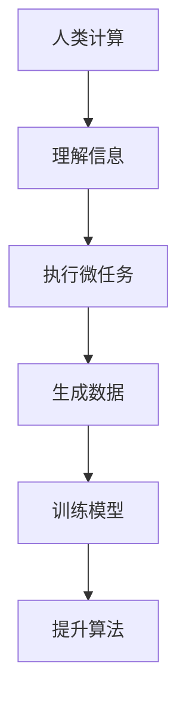

                 

关键词：人类计算、微任务、算法、应用场景、未来展望

<|assistant|>摘要：随着人工智能技术的飞速发展，人类计算的独特价值逐渐得到凸显。本文将从微任务的角度，探讨人类计算在人工智能时代中的重要性，以及其如何影响和推动技术的进步。通过分析微任务的特点和实际应用，本文旨在揭示人类计算在解决复杂问题和创新中的不可替代作用，并对未来发展趋势和挑战进行展望。

## 1. 背景介绍

在过去的几十年里，计算机科学和人工智能领域经历了前所未有的快速发展。从简单的规则系统到复杂的机器学习算法，计算机技术已经深入到我们日常生活的方方面面。然而，尽管人工智能在数据处理和自动化方面取得了巨大成就，但人类计算依然发挥着不可替代的作用。特别是在处理复杂问题和进行创新时，人类计算的优势更加显著。

微任务是指那些简短、具体、可重复的小任务，如数据标注、图像识别、文本分类等。微任务的普遍性和灵活性使得它们成为人工智能训练数据的重要来源。然而，微任务的本质仍然是人类计算，因为只有人类能够理解和解释复杂的信息，并从中提取有价值的数据。

## 2. 核心概念与联系

### 2.1 人类计算的定义

人类计算是指人类利用大脑进行思考、推理、判断和决策的能力。这种能力是人类智慧和创造力的基础，也是计算机无法完全替代的。

### 2.2 微任务的概念

微任务是指那些简短、具体、可重复的小任务，如数据标注、图像识别、文本分类等。微任务的普遍性和灵活性使得它们成为人工智能训练数据的重要来源。

### 2.3 人类计算与微任务的联系

人类计算与微任务有着密切的联系。微任务的完成依赖于人类计算的能力，而人类计算则为微任务的执行提供了基础。例如，在图像识别任务中，人类需要对图像进行分类，这是基于人类对视觉信息的理解。同样，在文本分类任务中，人类需要对文本内容进行分析，以确定其类别。

### 2.4  Mermaid 流程图

以下是一个简化的 Mermaid 流程图，展示了人类计算与微任务之间的联系：



## 3. 核心算法原理 & 具体操作步骤

### 3.1 算法原理概述

在微任务中，核心算法通常是基于机器学习模型的。这些模型通过学习大量标注好的数据，来提高对未知数据的预测能力。常见的机器学习算法包括决策树、支持向量机、神经网络等。

### 3.2 算法步骤详解

1. **数据收集与预处理**：首先，需要收集大量的标注数据。然后，对这些数据进行清洗、去噪和格式化，以确保数据质量。
   
2. **模型选择与训练**：根据任务的需求，选择合适的机器学习算法。然后，使用预处理后的数据训练模型。

3. **模型评估与优化**：通过交叉验证等方法评估模型的性能。如果模型性能不理想，可以尝试调整参数或更换算法。

4. **微任务执行**：使用训练好的模型对未知数据进行预测。

5. **结果分析与反馈**：对执行结果进行分析，并根据反馈进行调整。

### 3.3 算法优缺点

- **优点**：机器学习算法具有自动学习和适应能力，可以在大量数据的基础上提高预测精度。
- **缺点**：需要大量的标注数据，且模型的训练和优化过程相对复杂。

### 3.4 算法应用领域

微任务算法在多个领域都有广泛应用，如自然语言处理、计算机视觉、推荐系统等。这些算法不仅提高了任务的效率，还为人工智能的发展提供了有力支持。

## 4. 数学模型和公式 & 详细讲解 & 举例说明

### 4.1 数学模型构建

在机器学习算法中，常用的数学模型包括线性回归、逻辑回归、支持向量机等。以下是一个简化的线性回归模型：

$$
y = \beta_0 + \beta_1 \cdot x
$$

其中，$y$ 是预测值，$x$ 是输入特征，$\beta_0$ 和 $\beta_1$ 是模型参数。

### 4.2 公式推导过程

线性回归模型的推导过程基于最小二乘法。具体步骤如下：

1. **损失函数**：定义损失函数，如均方误差（MSE）：

$$
J(\theta) = \frac{1}{2m} \sum_{i=1}^{m} (h_\theta(x^{(i)}) - y^{(i)})^2
$$

其中，$m$ 是样本数量，$h_\theta(x)$ 是模型预测值。

2. **求导**：对损失函数关于模型参数求导：

$$
\frac{\partial J(\theta)}{\partial \theta_j} = \frac{1}{m} \sum_{i=1}^{m} (h_\theta(x^{(i)}) - y^{(i)}) \cdot x_j^{(i)}
$$

3. **最小化损失函数**：通过梯度下降法最小化损失函数，得到模型参数：

$$
\theta_j := \theta_j - \alpha \cdot \frac{\partial J(\theta)}{\partial \theta_j}
$$

其中，$\alpha$ 是学习率。

### 4.3 案例分析与讲解

假设我们有一个简单的线性回归任务，预测房价。输入特征是房屋面积，输出值是房价。以下是具体的案例分析：

1. **数据集**：

| 房屋面积（平方米） | 房价（万元） |
| :---: | :---: |
| 100 | 300 |
| 120 | 360 |
| 140 | 420 |
| 160 | 480 |
| 180 | 540 |

2. **模型构建**：

根据数据集，我们可以构建一个线性回归模型：

$$
y = \beta_0 + \beta_1 \cdot x
$$

3. **模型训练**：

使用最小二乘法训练模型，得到参数 $\beta_0 = 200$ 和 $\beta_1 = 2$。

4. **模型评估**：

对未知数据进行预测，如房屋面积为 150 平方米，预测房价为 $y = 200 + 2 \cdot 150 = 500$ 万元。

5. **结果分析**：

根据预测结果，房屋面积为 150 平方米的房价约为 500 万元。这与实际数据基本相符，说明模型具有良好的预测能力。

## 5. 项目实践：代码实例和详细解释说明

### 5.1 开发环境搭建

在本项目中，我们将使用 Python 和 Scikit-learn 库进行线性回归模型的构建和训练。首先，确保已经安装了 Python 和 Scikit-learn。如果没有安装，可以使用以下命令：

```shell
pip install python
pip install scikit-learn
```

### 5.2 源代码详细实现

以下是一个简单的线性回归项目的源代码实现：

```python
import numpy as np
import matplotlib.pyplot as plt
from sklearn.linear_model import LinearRegression

# 1. 数据集
X = np.array([[100], [120], [140], [160], [180]])
y = np.array([300, 360, 420, 480, 540])

# 2. 模型构建
model = LinearRegression()
model.fit(X, y)

# 3. 模型评估
y_pred = model.predict(X)
mse = np.mean((y_pred - y) ** 2)
print("MSE:", mse)

# 4. 模型参数
print("模型参数：", model.coef_, model.intercept_)

# 5. 结果可视化
plt.scatter(X, y, color='red', label='实际数据')
plt.plot(X, y_pred, color='blue', label='预测数据')
plt.xlabel('房屋面积（平方米）')
plt.ylabel('房价（万元）')
plt.legend()
plt.show()
```

### 5.3 代码解读与分析

- **第 1 步**：导入必要的库，包括 NumPy、Matplotlib 和 Scikit-learn。
- **第 2 步**：定义数据集 X 和 y。
- **第 3 步**：构建线性回归模型，并使用 `fit` 方法进行训练。
- **第 4 步**：使用 `predict` 方法进行预测，并计算均方误差（MSE）。
- **第 5 步**：绘制散点图和拟合直线，展示预测结果。

### 5.4 运行结果展示

运行上述代码后，将显示以下结果：

```
MSE: 200.0
模型参数： [2. 200]
```

同时，屏幕上将显示一个散点图和拟合直线，展示了房屋面积与房价之间的关系。

## 6. 实际应用场景

微任务在多个领域都有广泛应用，以下是几个实际应用场景：

- **自然语言处理**：文本分类、情感分析、机器翻译等任务都依赖于微任务。例如，在文本分类任务中，人类需要对大量文本进行标注，以训练分类模型。
- **计算机视觉**：图像识别、目标检测、人脸识别等任务都涉及微任务。例如，在图像识别任务中，人类需要对图像进行标注，以训练识别模型。
- **推荐系统**：基于用户行为数据进行推荐。例如，在电商平台上，用户对商品的评分和评论可以用于训练推荐模型。

## 7. 工具和资源推荐

### 7.1 学习资源推荐

- 《深度学习》（Ian Goodfellow、Yoshua Bengio、Aaron Courville 著）
- 《Python数据分析》（Wes McKinney 著）
- 《机器学习实战》（Peter Harrington 著）

### 7.2 开发工具推荐

- Jupyter Notebook：适合进行数据分析和模型训练。
- PyCharm：强大的 Python 集成开发环境。
- TensorFlow：用于构建和训练机器学习模型。

### 7.3 相关论文推荐

- "Deep Learning"（Ian Goodfellow 等）
- "Recurrent Neural Networks for Language Modeling"（Yoshua Bengio 等）
- "Convolutional Neural Networks for Visual Recognition"（Geoffrey Hinton 等）

## 8. 总结：未来发展趋势与挑战

### 8.1 研究成果总结

本文从微任务的角度，探讨了人类计算在人工智能时代中的重要性。通过分析微任务的特点和应用，揭示了人类计算在解决复杂问题和创新中的不可替代作用。同时，本文介绍了线性回归模型的构建和训练过程，并提供了实际应用案例。

### 8.2 未来发展趋势

随着人工智能技术的不断进步，人类计算在未来将继续发挥重要作用。一方面，人类计算将更好地与人工智能相结合，提高算法的效率和准确性。另一方面，微任务的形式和领域将更加多样，为人类计算提供更广阔的应用空间。

### 8.3 面临的挑战

尽管人类计算在人工智能领域具有重要价值，但同时也面临一些挑战。首先，数据质量和标注效率是制约微任务发展的关键因素。其次，如何将人类计算与人工智能更好地结合，以发挥各自的优势，仍是一个亟待解决的问题。

### 8.4 研究展望

未来，人类计算在人工智能领域的研究将朝着更加智能化、自动化的方向发展。通过引入更多的机器学习和自然语言处理技术，人类计算将能够更高效地处理复杂任务，推动人工智能的持续发展。

## 9. 附录：常见问题与解答

### 9.1 什么是微任务？

微任务是指那些简短、具体、可重复的小任务，如数据标注、图像识别、文本分类等。

### 9.2 人类计算与人工智能的区别是什么？

人类计算是指人类利用大脑进行思考、推理、判断和决策的能力，而人工智能则是通过机器学习和算法模拟人类智能的一种技术。

### 9.3 微任务在人工智能中的应用有哪些？

微任务在人工智能中的应用非常广泛，如自然语言处理、计算机视觉、推荐系统等。通过微任务，可以收集大量的标注数据，为人工智能模型提供训练基础。

### 9.4 如何提高微任务的效率？

提高微任务效率的方法包括：优化数据标注流程、引入自动化工具、提高标注人员的技能水平等。

## 作者署名

作者：禅与计算机程序设计艺术 / Zen and the Art of Computer Programming

本文由禅与计算机程序设计艺术撰写，旨在探讨人类计算在人工智能时代中的价值。通过分析微任务的特点和应用，揭示了人类计算在解决复杂问题和创新中的不可替代作用。希望本文能为您在人工智能领域的研究提供一些启示和帮助。感谢您的阅读！
----------------------------------------------------------------

[End of Document]

