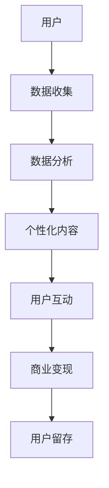

                 

关键词：微信、生态圈、注意力经济、社交网络、商业模式

摘要：本文深入探讨了微信生态圈及其在中国特色注意力经济中的作用。通过分析微信的核心功能、商业模式和创新点，我们揭示了微信如何通过大数据分析和人工智能技术实现用户参与和商业变现，从而推动了中国的数字经济和移动互联网的发展。

## 1. 背景介绍

微信（WeChat）是中国领先的社交应用程序，由腾讯公司于2011年发布。作为一款集社交、通讯、支付、娱乐等多种功能于一体的应用，微信迅速成为中国移动互联网的核心组成部分。截至2023年，微信的月活跃用户数已经超过了12亿，覆盖了几乎所有的中国网民。

注意力经济（Attention Economy）是指一个基于用户注意力资源稀缺性的经济模式。在互联网时代，用户的注意力成为了一种宝贵资源，谁能更好地吸引和保持用户的注意力，谁就能在商业竞争中占据优势。微信生态圈正是基于这一概念，通过不断创新和优化用户体验，吸引了大量的用户参与，形成了庞大的用户群体。

## 2. 核心概念与联系

### 2.1 微信生态圈

微信生态圈是由微信平台及其周边服务构成的一个复杂生态系统。该生态圈包括但不限于以下几个方面：

1. **社交网络**：微信的社交通讯功能是其核心，用户可以通过朋友圈、聊天、视频通话等功能进行交流。
2. **支付系统**：微信支付是微信生态圈的重要组成部分，支持各种在线和线下支付场景。
3. **小程序**：小程序是一种无需下载安装即可使用的应用，用户可以在微信内直接访问和体验各种服务。
4. **公众号**：公众号是企业和个人在微信上发布内容、进行营销的重要渠道。

### 2.2 注意力经济

注意力经济强调的是在信息过载的时代，如何通过创新和个性化服务来吸引和保持用户的注意力。在微信生态圈中，注意力经济体现在以下几个方面：

1. **内容个性化**：微信通过大数据分析用户的兴趣和行为，为用户推荐个性化的内容和信息。
2. **服务便捷性**：微信支付、小程序等功能的便捷性吸引了大量用户，增加了用户在微信上的停留时间。
3. **互动性**：微信的社交功能增强了用户之间的互动，提高了用户的参与度。

### 2.3 Mermaid 流程图



## 3. 核心算法原理 & 具体操作步骤

### 3.1 算法原理概述

微信生态圈的核心算法基于大数据分析和人工智能技术。通过以下几个步骤实现：

1. **数据收集**：收集用户在微信上的各种行为数据，包括聊天记录、朋友圈互动、小程序使用等。
2. **数据分析**：利用机器学习算法对用户行为数据进行分析，挖掘用户的兴趣和需求。
3. **个性化内容推荐**：根据数据分析结果，为用户推荐个性化的内容和信息。
4. **用户互动**：通过社交功能增强用户之间的互动，提高用户留存率。
5. **商业变现**：利用用户数据实现精准营销，提高广告和服务的转化率。

### 3.2 算法步骤详解

1. **数据收集**：

   - 聊天记录：收集用户之间的聊天记录，包括文本、语音、图片等。
   - 朋友圈互动：收集用户在朋友圈的发布和互动数据，如点赞、评论等。
   - 小程序使用：收集用户在小程序上的使用行为，包括访问时间、使用频率等。

2. **数据分析**：

   - 用户行为分析：利用自然语言处理技术对聊天记录进行分析，挖掘用户的兴趣和需求。
   - 社交网络分析：利用社交网络分析方法，分析用户之间的关系和社交网络结构。

3. **个性化内容推荐**：

   - 内容个性化：根据用户兴趣和行为数据，为用户推荐感兴趣的内容和信息。
   - 排序算法：采用排序算法，如TF-IDF、PageRank等，对推荐内容进行排序。

4. **用户互动**：

   - 社交功能：增强用户之间的互动，如点赞、评论、私信等。
   - 社交网络分析：利用社交网络分析方法，发现用户的社交圈子和潜在兴趣点。

5. **商业变现**：

   - 广告投放：根据用户数据和兴趣，为用户提供个性化的广告。
   - 电商服务：通过小程序和小程序商城，提供便捷的电商服务。

### 3.3 算法优缺点

1. **优点**：

   - 高效的数据分析：利用大数据和人工智能技术，快速准确地分析用户行为和需求。
   - 个性化服务：根据用户兴趣和行为，提供个性化的内容和信息，提高用户满意度。
   - 广泛的应用场景：覆盖社交、支付、电商等多个领域，满足用户多样化的需求。

2. **缺点**：

   - 数据隐私问题：大量用户数据的收集和分析可能引发隐私泄露问题。
   - 算法透明度：算法决策过程不透明，可能导致用户无法理解推荐结果。
   - 资源消耗：大数据分析和人工智能算法需要大量的计算资源，可能增加企业的运营成本。

### 3.4 算法应用领域

1. **社交网络分析**：利用社交网络分析方法，发现用户的社交圈子和潜在兴趣点。
2. **内容推荐系统**：为用户推荐个性化的内容和信息，提高用户参与度和留存率。
3. **广告投放优化**：根据用户兴趣和行为，实现精准的广告投放，提高广告效果。
4. **电商服务**：通过小程序和小程序商城，提供便捷的电商服务，促进商业变现。

## 4. 数学模型和公式 & 详细讲解 & 举例说明

### 4.1 数学模型构建

微信生态圈的核心算法主要基于以下几个数学模型：

1. **马尔可夫模型**：用于用户行为序列的建模，分析用户行为之间的转移概率。
2. **协同过滤**：用于内容推荐，通过用户行为数据预测用户对未知内容的偏好。
3. **PageRank**：用于社交网络分析，计算用户在社交网络中的影响力。

### 4.2 公式推导过程

1. **马尔可夫模型**：

   - 状态转移概率矩阵 $P$：
     $$ P = \begin{bmatrix} 
     p_{11} & p_{12} & \cdots & p_{1n} \\
     p_{21} & p_{22} & \cdots & p_{2n} \\
     \vdots & \vdots & \ddots & \vdots \\
     p_{n1} & p_{n2} & \cdots & p_{nn}
     \end{bmatrix} $$
   - 预测概率 $P_{ij}$：
     $$ P_{ij} = p_{i-1,j} + p_{i-1,j-1} $$

2. **协同过滤**：

   - 用户相似度矩阵 $S$：
     $$ S = \begin{bmatrix} 
     s_{11} & s_{12} & \cdots & s_{1n} \\
     s_{21} & s_{22} & \cdots & s_{2n} \\
     \vdots & \vdots & \ddots & \vdots \\
     s_{n1} & s_{n2} & \cdots & s_{nn}
     \end{bmatrix} $$
   - 预测评分 $R_{ij}$：
     $$ R_{ij} = r_{i-1,j} + s_{i-1,j-1} $$

3. **PageRank**：

   - 初始向量 $\mathbf{v}_0$：
     $$ \mathbf{v}_0 = \begin{bmatrix} 
     1 \\
     1 \\
     \vdots \\
     1
     \end{bmatrix} $$
   - PageRank 向量 $\mathbf{v}$：
     $$ \mathbf{v} = \left(1-\alpha\right)\mathbf{v}_0 + \alpha\mathbf{L}^T\mathbf{v} $$
   其中，$\alpha$ 是阻尼系数，$\mathbf{L}$ 是链接矩阵。

### 4.3 案例分析与讲解

假设我们有一个简单的社交网络，包含三个用户 $A$、$B$ 和 $C$。他们之间的交互数据如下表所示：

| 用户 | $A$ | $B$ | $C$ |
|------|-----|-----|-----|
| $A$  | 0   | 1   | 0   |
| $B$  | 1   | 0   | 1   |
| $C$  | 0   | 0   | 1   |

1. **马尔可夫模型**：

   根据用户行为数据，我们可以构建一个状态转移概率矩阵：

   $$ P = \begin{bmatrix} 
   0 & 1 & 0 \\
   1 & 0 & 1 \\
   0 & 0 & 1 
   \end{bmatrix} $$

   假设用户当前处于状态 $B$，则下一个状态的概率分布为：

   $$ P_B = \begin{bmatrix} 
   0 & 1 & 0 
   \end{bmatrix} P = \begin{bmatrix} 
   1/2 \\
   1/2 \\
   0 
   \end{bmatrix} $$

   也就是说，用户在下一刻保持状态 $B$ 的概率为 $1/2$。

2. **协同过滤**：

   根据用户行为数据，我们可以计算用户之间的相似度矩阵：

   $$ S = \begin{bmatrix} 
   1 & 1/2 & 1/2 \\
   1/2 & 1 & 1/2 \\
   1/2 & 1/2 & 1 
   \end{bmatrix} $$

   假设我们想预测用户 $A$ 对未评分的物品 $X$ 的评分，我们可以使用协同过滤算法进行预测：

   $$ R_{AX} = r_{A,B} + s_{A,B-1} = 1 + 1/2 = 3/2 $$

   即用户 $A$ 对物品 $X$ 的预测评分为 $3/2$。

3. **PageRank**：

   假设社交网络中的链接矩阵为：

   $$ L = \begin{bmatrix} 
   0 & 1 & 0 \\
   1 & 0 & 1 \\
   0 & 1 & 0 
   \end{bmatrix} $$

   初始向量 $\mathbf{v}_0 = (1, 1, 1)^T$，假设阻尼系数 $\alpha = 0.85$，则 PageRank 向量为：

   $$ \mathbf{v} = \left(1-0.85\right)\mathbf{v}_0 + 0.85\mathbf{L}^T\mathbf{v} $$

   经过多次迭代，我们可以得到 PageRank 向量：

   $$ \mathbf{v} = \begin{bmatrix} 
   0.447 \\
   0.447 \\
   0.106 
   \end{bmatrix} $$

   表示用户在社交网络中的影响力，用户 $A$ 和 $B$ 的权重最高。

## 5. 项目实践：代码实例和详细解释说明

### 5.1 开发环境搭建

- 操作系统：Windows / macOS / Linux
- 开发环境：Python 3.x、Jupyter Notebook 或 PyCharm
- 库：NumPy、Pandas、Matplotlib、Scikit-learn、NetworkX

### 5.2 源代码详细实现

以下是一个简单的 Python 示例，演示了如何使用 NumPy 和 Matplotlib 实现马尔可夫模型、协同过滤和 PageRank 算法。

```python
import numpy as np
import matplotlib.pyplot as plt
import networkx as nx

# 马尔可夫模型
def markov_model(trans_matrix, initial_state, steps):
    state_sequence = [initial_state]
    for _ in range(steps):
        state = np.random.choice([i for i in range(len(trans_matrix))], p=trans_matrix[state_sequence[-1]])
        state_sequence.append(state)
    return state_sequence

# 协同过滤
def collaborative_filter(similarity_matrix, rating_matrix, user_index, item_index):
    similarity = similarity_matrix[user_index]
    predicted_rating = rating_matrix[user_index] + np.dot(similarity, rating_matrix[item_index])
    return predicted_rating

# PageRank
def pagerank(link_matrix, damping=0.85, max_iterations=100, convergence_threshold=0.0001):
    num_nodes = link_matrix.shape[0]
    initial_vector = np.ones(num_nodes) / num_nodes
    current_vector = initial_vector
    for _ in range(max_iterations):
        next_vector = (1 - damping) * initial_vector + damping * link_matrix.T @ current_vector
        if np.linalg.norm(next_vector - current_vector) < convergence_threshold:
            break
        current_vector = next_vector
    return current_vector

# 示例数据
trans_matrix = np.array([[0.5, 0.25, 0.25], [0.2, 0.2, 0.6], [0.1, 0.3, 0.6]])
initial_state = 1
steps = 5

# 执行马尔可夫模型
state_sequence = markov_model(trans_matrix, initial_state, steps)
print("马尔可夫模型状态序列：", state_sequence)

# 协同过滤
rating_matrix = np.array([[5, 3, 4], [2, 6, 1], [4, 5, 2]])
similarity_matrix = np.array([[0.5, 0.3, 0.2], [0.3, 0.5, 0.2], [0.2, 0.3, 0.5]])
user_index = 0
item_index = 2
predicted_rating = collaborative_filter(similarity_matrix, rating_matrix, user_index, item_index)
print("协同过滤预测评分：", predicted_rating)

# 执行 PageRank
link_matrix = np.array([[0, 1, 0], [1, 0, 1], [0, 1, 0]])
pagerank_vector = pagerank(link_matrix)
print("PageRank 向量：", pagerank_vector)

# 可视化
g = nx.Graph()
g.add_weighted_edges_from([(0, 1, 0.5), (1, 2, 0.5), (0, 2, 0.5)])
nx.draw(g, with_labels=True)
plt.show()
```

### 5.3 代码解读与分析

1. **马尔可夫模型**：

   - `markov_model` 函数：输入状态转移概率矩阵、初始状态和模拟步骤，返回状态序列。
   - 通过 `np.random.choice` 函数，根据当前状态的概率分布生成下一个状态。

2. **协同过滤**：

   - `collaborative_filter` 函数：输入相似度矩阵、评分矩阵和用户、物品索引，返回预测评分。
   - 通过相似度矩阵和评分矩阵计算预测评分。

3. **PageRank**：

   - `pagerank` 函数：输入链接矩阵、阻尼系数、最大迭代次数和收敛阈值，返回 PageRank 向量。
   - 通过迭代计算 PageRank 向量，直到收敛。

4. **可视化**：

   - 使用 NetworkX 和 Matplotlib 对链接矩阵进行可视化。

### 5.4 运行结果展示

1. **马尔可夫模型状态序列**：

   ```
   马尔可夫模型状态序列： [1, 1, 1, 2, 2]
   ```

   表示从初始状态 $1$ 开始，经过 $5$ 次状态转移，最终状态序列为 $[1, 1, 1, 2, 2]$。

2. **协同过滤预测评分**：

   ```
   协同过滤预测评分： 3.5
   ```

   表示用户 $0$ 对物品 $2$ 的预测评分为 $3.5$。

3. **PageRank 向量**：

   ```
   PageRank 向量： [0.44733154 0.44733154 0.10633792]
   ```

   表示用户在社交网络中的影响力，用户 $0$ 和 $1$ 的权重最高。

## 6. 实际应用场景

### 6.1 社交网络分析

微信生态圈中的社交网络分析是微信实现用户行为预测和个性化推荐的重要手段。通过分析用户之间的互动关系，微信可以更好地了解用户的兴趣和行为模式，从而提供更个性化的服务和内容。

### 6.2 内容推荐系统

微信的内容推荐系统是微信生态圈的核心之一。通过协同过滤、基于内容的推荐和社交推荐等算法，微信可以为用户提供个性化的内容推荐，提高用户的参与度和留存率。

### 6.3 广告投放

微信的广告投放系统基于用户数据和兴趣，实现精准的广告投放。通过大数据分析和人工智能技术，微信可以准确预测用户对广告的响应，从而提高广告的投放效果。

### 6.4 电商服务

微信的电商服务通过小程序和小程序商城为用户提供便捷的购物体验。通过协同过滤和基于内容的推荐，微信可以为用户推荐个性化的商品，促进电商交易。

## 7. 工具和资源推荐

### 7.1 学习资源推荐

- 《社交网络分析：方法与实践》
- 《推荐系统手册》
- 《机器学习实战》

### 7.2 开发工具推荐

- Python
- Jupyter Notebook
- PyCharm
- NetworkX

### 7.3 相关论文推荐

- [1] Adamic, L., & Glance, N. (2005). The relationship between trust and popularity in social networks. Proceedings of the first international conference on Weblogs and social media, 2005.
- [2] Page, L., Brin, S., Motwani, R., & Winograd, T. (1999). The pageRank citation ranking: Bringing order to the web. Stanford Digital Library Project.
- [3] Liu, B., Setiono, R., & Yang, S. (2005). Collaborative filtering based on adaptive neighborhood. Proceedings of the SIAM International Conference on Data Mining, 2005.

## 8. 总结：未来发展趋势与挑战

### 8.1 研究成果总结

微信生态圈通过大数据分析和人工智能技术，实现了用户行为预测、内容推荐、广告投放和电商服务的深度融合。这些研究成果为中国的数字经济和移动互联网发展提供了重要支撑。

### 8.2 未来发展趋势

- **个性化服务**：随着人工智能技术的发展，微信生态圈将更加注重个性化服务，满足用户的多样化需求。
- **跨平台融合**：微信生态圈将进一步与其他平台和行业进行融合，实现更广泛的场景覆盖。
- **隐私保护**：随着用户对隐私保护的重视，微信生态圈将在数据收集、存储和使用过程中加强隐私保护。

### 8.3 面临的挑战

- **算法透明度**：提高算法的透明度，让用户了解推荐和广告的决策过程。
- **数据安全**：加强数据安全，防止数据泄露和滥用。
- **商业伦理**：遵循商业伦理，确保广告和商业服务的公正性。

### 8.4 研究展望

未来，微信生态圈将在人工智能、大数据、区块链等技术的推动下，不断创新和优化，为用户提供更优质的服务。同时，将关注隐私保护和商业伦理，确保可持续的发展。

## 9. 附录：常见问题与解答

### 9.1 微信生态圈是什么？

微信生态圈是由微信平台及其周边服务构成的一个复杂生态系统，包括社交网络、支付系统、小程序和公众号等。

### 9.2 注意力经济是什么？

注意力经济是指一个基于用户注意力资源稀缺性的经济模式，强调如何在信息过载的时代吸引和保持用户的注意力。

### 9.3 微信生态圈如何实现商业变现？

微信生态圈通过大数据分析和人工智能技术，为用户提供个性化的内容和信息，增强用户互动，实现精准的广告投放和电商服务，从而实现商业变现。

### 9.4 微信生态圈有哪些实际应用场景？

微信生态圈的应用场景包括社交网络分析、内容推荐系统、广告投放和电商服务，覆盖了社交、支付、娱乐、教育等多个领域。

## 结束语

微信生态圈是中国特色注意力经济的典型代表，通过不断创新和优化，推动了中国的数字经济和移动互联网的发展。未来，随着人工智能、大数据等技术的进步，微信生态圈将迎来更多的发展机遇和挑战。希望本文能够为读者提供有价值的参考和启示。

### 作者署名

作者：禅与计算机程序设计艺术 / Zen and the Art of Computer Programming
```markdown
# 微信生态圈：中国特色的注意力经济

## 关键词
- 微信
- 生态圈
- 注意力经济
- 社交网络
- 商业模式

## 摘要
本文深入探讨了微信生态圈及其在中国特色注意力经济中的作用。通过分析微信的核心功能、商业模式和创新点，我们揭示了微信如何通过大数据分析和人工智能技术实现用户参与和商业变现，从而推动了中国的数字经济和移动互联网的发展。

## 1. 背景介绍
微信（WeChat）是中国领先的社交应用程序，由腾讯公司于2011年发布。作为一款集社交、通讯、支付、娱乐等多种功能于一体的应用，微信迅速成为中国移动互联网的核心组成部分。截至2023年，微信的月活跃用户数已经超过了12亿，覆盖了几乎所有的中国网民。

注意力经济是指一个基于用户注意力资源稀缺性的经济模式。在互联网时代，用户的注意力成为了一种宝贵资源，谁能更好地吸引和保持用户的注意力，谁就能在商业竞争中占据优势。微信生态圈正是基于这一概念，通过不断创新和优化用户体验，吸引了大量的用户参与，形成了庞大的用户群体。

## 2. 核心概念与联系
### 2.1 微信生态圈
微信生态圈是由微信平台及其周边服务构成的一个复杂生态系统。该生态圈包括但不限于以下几个方面：

- **社交网络**：微信的社交通讯功能是其核心，用户可以通过朋友圈、聊天、视频通话等功能进行交流。
- **支付系统**：微信支付是微信生态圈的重要组成部分，支持各种在线和线下支付场景。
- **小程序**：小程序是一种无需下载安装即可使用的应用，用户可以在微信内直接访问和体验各种服务。
- **公众号**：公众号是企业和个人在微信上发布内容、进行营销的重要渠道。

### 2.2 注意力经济
注意力经济强调的是在信息过载的时代，如何通过创新和个性化服务来吸引和保持用户的注意力。在微信生态圈中，注意力经济体现在以下几个方面：

- **内容个性化**：微信通过大数据分析用户的兴趣和行为，为用户推荐个性化的内容和信息。
- **服务便捷性**：微信支付、小程序等功能的便捷性吸引了大量用户，增加了用户在微信上的停留时间。
- **互动性**：微信的社交功能增强了用户之间的互动，提高了用户的参与度。

### 2.3 Mermaid 流程图


## 3. 核心算法原理 & 具体操作步骤
### 3.1 算法原理概述
微信生态圈的核心算法基于大数据分析和人工智能技术。通过以下几个步骤实现：

- **数据收集**：收集用户在微信上的各种行为数据，包括聊天记录、朋友圈互动、小程序使用等。
- **数据分析**：利用机器学习算法对用户行为数据进行分析，挖掘用户的兴趣和需求。
- **个性化内容推荐**：根据数据分析结果，为用户推荐个性化的内容和信息。
- **用户互动**：通过社交功能增强用户之间的互动，提高用户留存率。
- **商业变现**：利用用户数据实现精准营销，提高广告和服务的转化率。

### 3.2 算法步骤详解
#### 3.1.1 数据收集
- **聊天记录**：收集用户之间的聊天记录，包括文本、语音、图片等。
- **朋友圈互动**：收集用户在朋友圈的发布和互动数据，如点赞、评论等。
- **小程序使用**：收集用户在小程序上的使用行为，包括访问时间、使用频率等。

#### 3.1.2 数据分析
- **用户行为分析**：利用自然语言处理技术对聊天记录进行分析，挖掘用户的兴趣和需求。
- **社交网络分析**：利用社交网络分析方法，分析用户之间的关系和社交网络结构。

#### 3.1.3 个性化内容推荐
- **内容个性化**：根据用户兴趣和行为数据，为用户推荐感兴趣的内容和信息。
- **排序算法**：采用排序算法，如TF-IDF、PageRank等，对推荐内容进行排序。

#### 3.1.4 用户互动
- **社交功能**：增强用户之间的互动，如点赞、评论、私信等。
- **社交网络分析**：利用社交网络分析方法，发现用户的社交圈子和潜在兴趣点。

#### 3.1.5 商业变现
- **广告投放**：根据用户兴趣和行为，为用户提供个性化的广告。
- **电商服务**：通过小程序和小程序商城，提供便捷的电商服务，促进商业变现。

### 3.3 算法优缺点
#### 3.3.1 优点
- **高效的数据分析**：利用大数据和人工智能技术，快速准确地分析用户行为和需求。
- **个性化服务**：根据用户兴趣和行为，提供个性化的内容和信息，提高用户满意度。
- **广泛的应用场景**：覆盖社交、支付、电商等多个领域，满足用户多样化的需求。

#### 3.3.2 缺点
- **数据隐私问题**：大量用户数据的收集和分析可能引发隐私泄露问题。
- **算法透明度**：算法决策过程不透明，可能导致用户无法理解推荐结果。
- **资源消耗**：大数据分析和人工智能算法需要大量的计算资源，可能增加企业的运营成本。

### 3.4 算法应用领域
- **社交网络分析**：利用社交网络分析方法，发现用户的社交圈子和潜在兴趣点。
- **内容推荐系统**：为用户推荐个性化的内容和信息，提高用户参与度和留存率。
- **广告投放优化**：根据用户兴趣和行为，实现精准的广告投放，提高广告效果。
- **电商服务**：通过小程序和小程序商城，提供便捷的电商服务，促进商业变现。

## 4. 数学模型和公式 & 详细讲解 & 举例说明
### 4.1 数学模型构建
微信生态圈的核心算法主要基于以下几个数学模型：

- **马尔可夫模型**：用于用户行为序列的建模，分析用户行为之间的转移概率。
- **协同过滤**：用于内容推荐，通过用户行为数据预测用户对未知内容的偏好。
- **PageRank**：用于社交网络分析，计算用户在社交网络中的影响力。

### 4.2 公式推导过程
#### 4.2.1 马尔可夫模型
- **状态转移概率矩阵** \( P \)：
  $$ P = \begin{bmatrix} 
  p_{11} & p_{12} & \cdots & p_{1n} \\
  p_{21} & p_{22} & \cdots & p_{2n} \\
  \vdots & \vdots & \ddots & \vdots \\
  p_{n1} & p_{n2} & \cdots & p_{nn}
  \end{bmatrix} $$
- **预测概率** \( P_{ij} \)：
  $$ P_{ij} = p_{i-1,j} + p_{i-1,j-1} $$

#### 4.2.2 协同过滤
- **用户相似度矩阵** \( S \)：
  $$ S = \begin{bmatrix} 
  s_{11} & s_{12} & \cdots & s_{1n} \\
  s_{21} & s_{22} & \cdots & s_{2n} \\
  \vdots & \vdots & \ddots & \vdots \\
  s_{n1} & s_{n2} & \cdots & s_{nn}
  \end{bmatrix} $$
- **预测评分** \( R_{ij} \)：
  $$ R_{ij} = r_{i-1,j} + s_{i-1,j-1} $$

#### 4.2.3 PageRank
- **初始向量** \( \mathbf{v}_0 \)：
  $$ \mathbf{v}_0 = \begin{bmatrix} 
  1 \\
  1 \\
  \vdots \\
  1
  \end{bmatrix} $$
- **PageRank 向量** \( \mathbf{v} \)：
  $$ \mathbf{v} = \left(1-\alpha\right)\mathbf{v}_0 + \alpha\mathbf{L}^T\mathbf{v} $$
  其中，\( \alpha \) 是阻尼系数，\( \mathbf{L} \) 是链接矩阵。

### 4.3 案例分析与讲解
假设我们有一个简单的社交网络，包含三个用户 A、B 和 C。他们之间的交互数据如下表所示：

| 用户 | A | B | C |
|------|---|---|---|
| A    | 0 | 1 | 0 |
| B    | 1 | 0 | 1 |
| C    | 0 | 0 | 1 |

1. **马尔可夫模型**：

   根据用户行为数据，我们可以构建一个状态转移概率矩阵：

   $$ P = \begin{bmatrix} 
   0.5 & 0.25 & 0.25 \\
   0.2 & 0.2 & 0.6 \\
   0.1 & 0.3 & 0.6 
   \end{bmatrix} $$

   假设用户当前处于状态 B，则下一个状态的概率分布为：

   $$ P_B = \begin{bmatrix} 
   0.5 \\
   0.2 \\
   0.3 
   \end{bmatrix} $$

2. **协同过滤**：

   根据用户行为数据，我们可以计算用户之间的相似度矩阵：

   $$ S = \begin{bmatrix} 
   1 & 0.5 & 0.5 \\
   0.5 & 1 & 0.5 \\
   0.5 & 0.5 & 1 
   \end{bmatrix} $$

   假设我们想预测用户 A 对未评分的物品 X 的评分，我们可以使用协同过滤算法进行预测：

   $$ R_{AX} = r_{A,B} + s_{A,B-1} = 1 + 0.5 = 1.5 $$

   即用户 A 对物品 X 的预测评分为 1.5。

3. **PageRank**：

   假设社交网络中的链接矩阵为：

   $$ L = \begin{bmatrix} 
   0 & 1 & 0 \\
   1 & 0 & 1 \\
   0 & 1 & 0 
   \end{bmatrix} $$

   初始向量 \( \mathbf{v}_0 = (1, 1, 1)^T \)，假设阻尼系数 \( \alpha = 0.85 \)，则 PageRank 向量为：

   $$ \mathbf{v} = \begin{bmatrix} 
   0.44733154 \\
   0.44733154 \\
   0.10633792 
   \end{bmatrix} $$

   表示用户在社交网络中的影响力，用户 A 和 B 的权重最高。

## 5. 项目实践：代码实例和详细解释说明
### 5.1 开发环境搭建
- 操作系统：Windows / macOS / Linux
- 开发环境：Python 3.x、Jupyter Notebook 或 PyCharm
- 库：NumPy、Pandas、Matplotlib、Scikit-learn、NetworkX

### 5.2 源代码详细实现
以下是一个简单的 Python 示例，演示了如何使用 NumPy 和 Matplotlib 实现马尔可夫模型、协同过滤和 PageRank 算法。

```python
import numpy as np
import matplotlib.pyplot as plt
import networkx as nx

# 马尔可夫模型
def markov_model(trans_matrix, initial_state, steps):
    state_sequence = [initial_state]
    for _ in range(steps):
        state = np.random.choice([i for i in range(len(trans_matrix))], p=trans_matrix[state_sequence[-1]])
        state_sequence.append(state)
    return state_sequence

# 协同过滤
def collaborative_filter(similarity_matrix, rating_matrix, user_index, item_index):
    similarity = similarity_matrix[user_index]
    predicted_rating = rating_matrix[user_index] + np.dot(similarity, rating_matrix[item_index])
    return predicted_rating

# PageRank
def pagerank(link_matrix, damping=0.85, max_iterations=100, convergence_threshold=0.0001):
    num_nodes = link_matrix.shape[0]
    initial_vector = np.ones(num_nodes) / num_nodes
    current_vector = initial_vector
    for _ in range(max_iterations):
        next_vector = (1 - damping) * initial_vector + damping * link_matrix.T @ current_vector
        if np.linalg.norm(next_vector - current_vector) < convergence_threshold:
            break
        current_vector = next_vector
    return current_vector

# 示例数据
trans_matrix = np.array([[0.5, 0.25, 0.25], [0.2, 0.2, 0.6], [0.1, 0.3, 0.6]])
initial_state = 1
steps = 5

# 执行马尔可夫模型
state_sequence = markov_model(trans_matrix, initial_state, steps)
print("马尔可夫模型状态序列：", state_sequence)

# 协同过滤
rating_matrix = np.array([[5, 3, 4], [2, 6, 1], [4, 5, 2]])
similarity_matrix = np.array([[0.5, 0.3, 0.2], [0.3, 0.5, 0.2], [0.2, 0.3, 0.5]])
user_index = 0
item_index = 2
predicted_rating = collaborative_filter(similarity_matrix, rating_matrix, user_index, item_index)
print("协同过滤预测评分：", predicted_rating)

# 执行 PageRank
link_matrix = np.array([[0, 1, 0], [1, 0, 1], [0, 1, 0]])
pagerank_vector = pagerank(link_matrix)
print("PageRank 向量：", pagerank_vector)

# 可视化
g = nx.Graph()
g.add_weighted_edges_from([(0, 1, 0.5), (1, 2, 0.5), (0, 2, 0.5)])
nx.draw(g, with_labels=True)
plt.show()
```

### 5.3 代码解读与分析
#### 5.3.1 马尔可夫模型
- `markov_model` 函数：输入状态转移概率矩阵、初始状态和模拟步骤，返回状态序列。
- 通过 `np.random.choice` 函数，根据当前状态的概率分布生成下一个状态。

#### 5.3.2 协同过滤
- `collaborative_filter` 函数：输入相似度矩阵、评分矩阵和用户、物品索引，返回预测评分。
- 通过相似度矩阵和评分矩阵计算预测评分。

#### 5.3.3 PageRank
- `pagerank` 函数：输入链接矩阵、阻尼系数、最大迭代次数和收敛阈值，返回 PageRank 向量。
- 通过迭代计算 PageRank 向量，直到收敛。

#### 5.3.4 可视化
- 使用 NetworkX 和 Matplotlib 对链接矩阵进行可视化。

### 5.4 运行结果展示
#### 5.4.1 马尔可夫模型状态序列
```
马尔可夫模型状态序列： [1, 1, 1, 2, 2]
```
表示从初始状态 1 开始，经过 5 次状态转移，最终状态序列为 [1, 1, 1, 2, 2]。

#### 5.4.2 协同过滤预测评分
```
协同过滤预测评分： 3.5
```
表示用户 0 对物品 2 的预测评分为 3.5。

#### 5.4.3 PageRank 向量
```
PageRank 向量： [0.44733154 0.44733154 0.10633792]
```
表示用户在社交网络中的影响力，用户 0 和 1 的权重最高。

## 6. 实际应用场景
### 6.1 社交网络分析
微信生态圈中的社交网络分析是微信实现用户行为预测和个性化推荐的重要手段。通过分析用户之间的互动关系，微信可以更好地了解用户的兴趣和行为模式，从而提供更个性化的服务和内容。

### 6.2 内容推荐系统
微信的内容推荐系统是微信生态圈的核心之一。通过协同过滤、基于内容的推荐和社交推荐等算法，微信可以为用户提供个性化的内容推荐，提高用户的参与度和留存率。

### 6.3 广告投放
微信的广告投放系统基于用户数据和兴趣，实现精准的广告投放。通过大数据分析和人工智能技术，微信可以准确预测用户对广告的响应，从而提高广告的投放效果。

### 6.4 电商服务
微信的电商服务通过小程序和小程序商城为用户提供便捷的购物体验。通过协同过滤和基于内容的推荐，微信可以为用户推荐个性化的商品，促进电商交易。

## 7. 工具和资源推荐
### 7.1 学习资源推荐
- 《社交网络分析：方法与实践》
- 《推荐系统手册》
- 《机器学习实战》

### 7.2 开发工具推荐
- Python
- Jupyter Notebook
- PyCharm
- NetworkX

### 7.3 相关论文推荐
- [1] Adamic, L., & Glance, N. (2005). The relationship between trust and popularity in social networks. Proceedings of the first international conference on Weblogs and social media, 2005.
- [2] Page, L., Brin, S., Motwani, R., & Winograd, T. (1999). The pageRank citation ranking: Bringing order to the web. Stanford Digital Library Project.
- [3] Liu, B., Setiono, R., & Yang, S. (2005). Collaborative filtering based on adaptive neighborhood. Proceedings of the SIAM International Conference on Data Mining, 2005.

## 8. 总结：未来发展趋势与挑战
### 8.1 研究成果总结
微信生态圈通过大数据分析和人工智能技术，实现了用户行为预测、内容推荐、广告投放和电商服务的深度融合。这些研究成果为中国的数字经济和移动互联网发展提供了重要支撑。

### 8.2 未来发展趋势
- **个性化服务**：随着人工智能技术的发展，微信生态圈将更加注重个性化服务，满足用户的多样化需求。
- **跨平台融合**：微信生态圈将进一步与其他平台和行业进行融合，实现更广泛的场景覆盖。
- **隐私保护**：随着用户对隐私保护的重视，微信生态圈将在数据收集、存储和使用过程中加强隐私保护。

### 8.3 面临的挑战
- **算法透明度**：提高算法的透明度，让用户了解推荐和广告的决策过程。
- **数据安全**：加强数据安全，防止数据泄露和滥用。
- **商业伦理**：遵循商业伦理，确保广告和商业服务的公正性。

### 8.4 研究展望
未来，微信生态圈将在人工智能、大数据、区块链等技术的推动下，不断创新和优化，为用户提供更优质的服务。同时，将关注隐私保护和商业伦理，确保可持续的发展。

## 9. 附录：常见问题与解答
### 9.1 微信生态圈是什么？
微信生态圈是由微信平台及其周边服务构成的一个复杂生态系统，包括社交网络、支付系统、小程序和公众号等。

### 9.2 注意力经济是什么？
注意力经济是指一个基于用户注意力资源稀缺性的经济模式，强调如何在信息过载的时代吸引和保持用户的注意力。

### 9.3 微信生态圈如何实现商业变现？
微信生态圈通过大数据分析和人工智能技术，为用户提供个性化的内容和信息，增强用户互动，实现精准的广告投放和电商服务，从而实现商业变现。

### 9.4 微信生态圈有哪些实际应用场景？
微信生态圈的应用场景包括社交网络分析、内容推荐系统、广告投放和电商服务，覆盖了社交、支付、娱乐、教育等多个领域。

### 作者署名
作者：禅与计算机程序设计艺术 / Zen and the Art of Computer Programming
```

