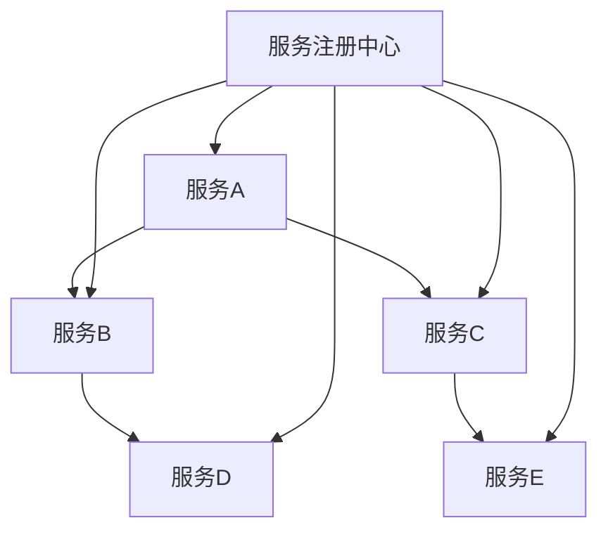

                 

关键词：微服务架构、设计、部署、管理、分布式系统、SOA、容器化、持续集成、容器编排、DevOps

> 摘要：本文将深入探讨微服务架构的设计、部署和管理，旨在帮助读者理解微服务架构的核心概念、架构模式、设计原则以及在实际项目中的应用。通过本文，读者将了解到微服务架构的优势、挑战和最佳实践，为构建高可用、可扩展、灵活的分布式系统提供参考。

## 1. 背景介绍

随着互联网的飞速发展，企业面临的数据量和业务需求日益增长，传统的单体应用架构逐渐暴露出诸多弊端，如系统复杂性高、扩展性差、维护困难等。为了应对这些挑战，微服务架构逐渐成为一种主流的分布式系统架构风格。

微服务架构（Microservices Architecture）是一种将应用程序作为一套小服务的组合的方式进行构建的一种架构风格。每个服务具有自己的业务功能，独立部署、独立扩展，并通过轻量级的通信协议（如RESTful API）进行交互。微服务架构旨在解决传统单体应用在复杂性和扩展性方面的瓶颈，提高系统的可维护性和灵活性。

### 1.1 微服务架构的发展历程

微服务架构的概念最早由马丁·福勒（Martin Fowler）在2014年提出。在此之前，分布式计算和SOA（Service-Oriented Architecture，面向服务架构）已经存在了多年。微服务架构可以看作是SOA的一种延续和优化。

- **分布式计算**：早期分布式系统的目标是实现数据的分布式存储和处理，以提高系统的性能和可靠性。
- **SOA**：SOA将业务功能划分为一系列的服务，通过标准化的接口进行通信，实现了业务的模块化和松耦合。
- **微服务架构**：在SOA的基础上，微服务架构将服务进一步细化，每个服务负责一个特定的业务功能，更加独立和自治。

### 1.2 微服务架构的优势

微服务架构具有以下优势：

- **高可扩展性**：每个服务可以独立扩展，根据业务需求灵活调整资源分配。
- **高可维护性**：服务之间解耦，降低了系统的复杂度，使得开发、测试和部署更加便捷。
- **高容错性**：服务的独立性使得某个服务的故障不会影响整个系统的运行。
- **快速迭代**：服务可以独立部署和升级，加快了软件迭代的速度。

## 2. 核心概念与联系

### 2.1 微服务架构的核心概念

在微服务架构中，核心概念包括：

- **服务**：微服务架构中的基本构建块，每个服务负责一个特定的业务功能。
- **服务拆分**：将复杂的业务逻辑拆分成多个小型服务，以提高系统的模块化和独立性。
- **服务发现**：服务启动时注册到服务注册中心，其他服务通过服务注册中心发现可用服务并进行调用。
- **负载均衡**：通过负载均衡器将请求分配到多个服务实例上，提高系统的吞吐量和可用性。
- **服务网关**：作为外部请求的统一入口，负责处理跨域请求、协议转换、认证授权等。
- **配置管理**：服务运行时配置的集中管理和动态更新。
- **服务监控**：对服务的运行状态进行监控，及时发现和解决问题。

### 2.2 微服务架构的联系

微服务架构中的各个概念相互关联，构成了一个完整的生态系统：

- **服务与服务之间的关系**：服务之间通过轻量级的通信协议进行通信，如HTTP/REST、gRPC、RabbitMQ等。
- **服务与服务注册中心的关系**：服务启动时注册到服务注册中心，服务停止时注销。服务注册中心维护服务实例的列表，供其他服务发现和调用。
- **服务与容器的关系**：微服务通常部署在容器环境中，如Docker、Kubernetes等，以实现服务的轻量级部署和隔离。
- **服务与持续集成的关系**：通过持续集成和持续部署（CI/CD）工具，实现服务的自动化构建、测试和部署。

### 2.3 微服务架构的 Mermaid 流程图



## 3. 核心算法原理 & 具体操作步骤

### 3.1 算法原理概述

微服务架构的核心在于服务的拆分和协调。核心算法原理主要包括：

- **服务拆分**：根据业务功能将复杂系统拆分成多个小型服务。
- **服务发现**：服务启动时注册到服务注册中心，其他服务通过服务注册中心发现可用服务。
- **负载均衡**：通过负载均衡器将请求分配到多个服务实例上。
- **服务网关**：作为外部请求的统一入口，处理跨域请求、协议转换等。

### 3.2 算法步骤详解

1. **服务拆分**：
   - 分析业务需求，确定服务边界。
   - 根据业务功能将系统拆分成多个小型服务。
   - 确保服务之间职责清晰，避免重复功能。

2. **服务发现**：
   - 服务启动时，向服务注册中心注册自身信息。
   - 服务停止时，从服务注册中心注销。
   - 其他服务通过服务注册中心查询可用服务。

3. **负载均衡**：
   - 使用负载均衡器（如Nginx、HAProxy等）将请求分配到多个服务实例上。
   - 选择负载均衡算法（如轮询、加权轮询、最少连接等）。

4. **服务网关**：
   - 作为外部请求的统一入口，处理跨域请求、协议转换等。
   - 进行认证授权、日志记录等中间件功能。

### 3.3 算法优缺点

**优点**：

- **高可扩展性**：每个服务可以独立扩展，提高系统整体性能。
- **高可维护性**：服务之间解耦，降低了系统的复杂度。
- **高容错性**：服务的独立性使得某个服务的故障不会影响整个系统。

**缺点**：

- **分布式系统复杂性**：需要处理服务间通信、数据一致性、负载均衡等问题。
- **调试难度增加**：服务分布在不同的主机上，调试时需要考虑网络延迟、系统负载等因素。
- **运维成本**：需要管理多个服务实例、容器等。

### 3.4 算法应用领域

微服务架构广泛应用于电商、金融、物联网、社交媒体等场景，以下是一些具体应用领域：

- **电商系统**：订单处理、商品管理、用户中心等模块可以拆分为多个独立服务。
- **金融系统**：交易处理、账户管理、风控等模块可以拆分为多个独立服务。
- **物联网系统**：设备管理、数据采集、数据处理等模块可以拆分为多个独立服务。
- **社交媒体系统**：用户关系、内容发布、消息推送等模块可以拆分为多个独立服务。

## 4. 数学模型和公式 & 详细讲解 & 举例说明

### 4.1 数学模型构建

在微服务架构中，可以构建以下数学模型：

- **服务响应时间**：\( T_r = \frac{T_{p}}{T_{s}} \)
  - \( T_r \)：服务响应时间
  - \( T_{p} \)：请求处理时间
  - \( T_{s} \)：服务间通信时间

- **系统吞吐量**：\( Q = \frac{N \cdot T_r}{T_{p}} \)
  - \( Q \)：系统吞吐量
  - \( N \)：服务实例数量
  - \( T_r \)：服务响应时间
  - \( T_{p} \)：请求处理时间

### 4.2 公式推导过程

服务响应时间公式 \( T_r = \frac{T_{p}}{T_{s}} \) 的推导过程如下：

1. 假设服务间通信时间为 \( T_{s} \)，请求处理时间为 \( T_{p} \)。
2. 服务响应时间 \( T_r \) 等于请求处理时间 \( T_{p} \) 除以服务间通信时间 \( T_{s} \)。

系统吞吐量公式 \( Q = \frac{N \cdot T_r}{T_{p}} \) 的推导过程如下：

1. 假设系统包含 \( N \) 个服务实例，每个实例的响应时间 \( T_r \) 相同。
2. 系统吞吐量 \( Q \) 等于每个服务实例的响应时间 \( T_r \) 乘以服务实例数量 \( N \)，再除以请求处理时间 \( T_{p} \)。

### 4.3 案例分析与讲解

假设一个电商系统包含订单处理服务、商品管理服务、用户中心服务等三个微服务，每个服务有多个实例。请求处理时间 \( T_{p} \) 为 1 秒，服务间通信时间 \( T_{s} \) 为 0.5 秒。

1. 计算服务响应时间：

\( T_r = \frac{T_{p}}{T_{s}} = \frac{1}{0.5} = 2 \) 秒

2. 计算系统吞吐量：

\( Q = \frac{N \cdot T_r}{T_{p}} \)

- 当 \( N = 1 \) 时，系统吞吐量 \( Q = \frac{1 \cdot 2}{1} = 2 \) 次/秒
- 当 \( N = 2 \) 时，系统吞吐量 \( Q = \frac{2 \cdot 2}{1} = 4 \) 次/秒

通过增加服务实例数量，可以显著提高系统吞吐量。

## 5. 项目实践：代码实例和详细解释说明

### 5.1 开发环境搭建

1. 安装Docker：在操作系统上安装Docker，版本要求为1.13及以上。

2. 安装Kubernetes：安装Kubernetes集群，可以选择使用Minikube、Kubeadm或第三方管理平台（如Rancher）。

3. 安装Kubectl：安装Kubernetes命令行工具kubectl，用于管理Kubernetes集群。

### 5.2 源代码详细实现

以下是一个简单的微服务架构示例，包含订单处理服务、商品管理服务和用户中心服务。

**订单处理服务（OrderService）**：

```java
@RestController
@RequestMapping("/orders")
public class OrderService {

    @Autowired
    private OrderRepository orderRepository;

    @PostMapping
    public ResponseEntity<Order> createOrder(@RequestBody Order order) {
        // 处理订单创建逻辑
        orderRepository.save(order);
        return ResponseEntity.ok(order);
    }
}
```

**商品管理服务（ProductService）**：

```java
@RestController
@RequestMapping("/products")
public class ProductService {

    @Autowired
    private ProductRepository productRepository;

    @GetMapping("/{id}")
    public ResponseEntity<Product> getProduct(@PathVariable Long id) {
        // 处理商品查询逻辑
        Product product = productRepository.findById(id).orElseThrow(() -> new ResourceNotFoundException("Product not found"));
        return ResponseEntity.ok(product);
    }
}
```

**用户中心服务（UserService）**：

```java
@RestController
@RequestMapping("/users")
public class UserService {

    @Autowired
    private UserRepository userRepository;

    @GetMapping("/{id}")
    public ResponseEntity<User> getUser(@PathVariable Long id) {
        // 处理用户查询逻辑
        User user = userRepository.findById(id).orElseThrow(() -> new ResourceNotFoundException("User not found"));
        return ResponseEntity.ok(user);
    }
}
```

### 5.3 代码解读与分析

1. **订单处理服务（OrderService）**：该服务负责处理订单创建逻辑。通过`@RestController`注解，将类标记为RESTful服务。`@RequestMapping`注解定义了服务的URL路径，`@PostMapping`注解表示处理POST请求。`@Autowired`注解用于注入订单存储库（OrderRepository）。

2. **商品管理服务（ProductService）**：该服务负责处理商品查询逻辑。通过`@RestController`注解，将类标记为RESTful服务。`@RequestMapping`注解定义了服务的URL路径，`@GetMapping`注解表示处理GET请求。`@Autowired`注解用于注入商品存储库（ProductRepository）。

3. **用户中心服务（UserService）**：该服务负责处理用户查询逻辑。通过`@RestController`注解，将类标记为RESTful服务。`@RequestMapping`注解定义了服务的URL路径，`@GetMapping`注解表示处理GET请求。`@Autowired`注解用于注入用户存储库（UserRepository）。

### 5.4 运行结果展示

1. 启动Kubernetes集群。

2. 使用Kubectl工具启动三个微服务容

