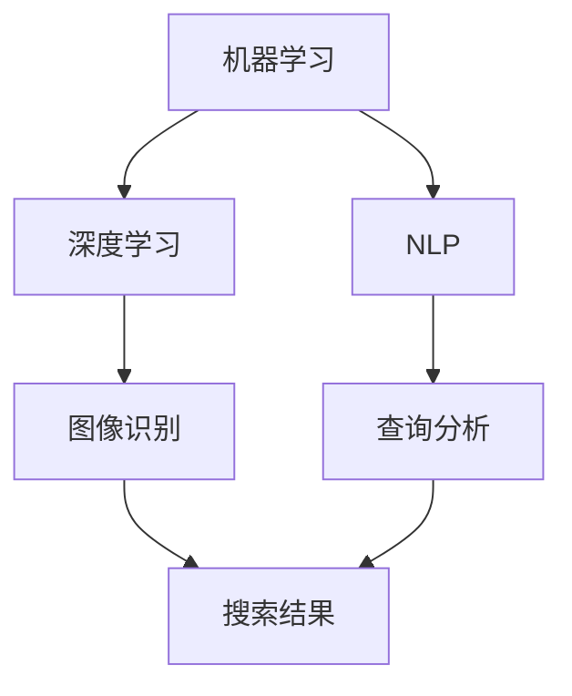

                 

关键词：微软AI战略、Bing升级、人工智能、搜索引擎、用户体验、技术实现

> 摘要：本文深入探讨了微软最新的AI战略及其对Bing搜索引擎的升级影响。通过分析其核心概念、算法原理、数学模型及实际应用，探讨了Bing在人工智能时代的前景和挑战。

## 1. 背景介绍

随着人工智能技术的不断进步，各大科技巨头纷纷将AI作为公司战略的核心。微软作为全球领先的科技公司，也在积极推进其AI战略。Bing，作为微软的搜索引擎，一直是微软AI战略的重要一环。在过去的几年里，Bing在人工智能技术的支持下，经历了多次升级和改进，逐渐成为了一个更加智能、更加个性化的搜索引擎。

微软的AI战略不仅仅局限于Bing，还包括了微软云服务、办公软件、游戏和社交媒体等多个领域。本文将重点关注微软AI战略对Bing搜索引擎的影响，分析其技术实现和未来发展方向。

## 2. 核心概念与联系

在探讨微软AI战略及其对Bing的影响之前，我们需要先了解一些核心概念，包括机器学习、深度学习、自然语言处理等。

### 2.1 机器学习

机器学习是人工智能的核心技术之一，它使计算机系统能够从数据中学习并做出决策。在Bing搜索引擎中，机器学习技术被广泛用于理解用户的查询意图、提供个性化搜索结果等。

### 2.2 深度学习

深度学习是机器学习的一个分支，它通过模拟人脑神经网络结构，实现对复杂数据的处理和识别。在Bing中，深度学习被用于图像识别、语音识别等。

### 2.3 自然语言处理

自然语言处理（NLP）是使计算机能够理解、解释和生成人类语言的技术。在Bing中，NLP技术被用于分析用户的查询语句、理解查询意图，并提供相关的搜索结果。

下面是一个简单的Mermaid流程图，展示了这些核心概念之间的联系：



## 3. 核心算法原理 & 具体操作步骤

### 3.1 算法原理概述

微软的AI战略在Bing搜索引擎中的应用主要体现在以下几个方面：

- **个性化搜索**：通过分析用户的搜索历史和浏览行为，提供个性化的搜索结果。
- **语义搜索**：理解用户的查询意图，提供相关且准确的搜索结果。
- **图像和语音搜索**：通过深度学习和自然语言处理技术，实现对图像和语音的识别和搜索。

### 3.2 算法步骤详解

1. **用户行为分析**：收集并分析用户的搜索历史、浏览记录等数据，理解用户的兴趣和偏好。
2. **查询意图识别**：使用NLP技术，对用户的查询语句进行语义分析，理解用户的查询意图。
3. **搜索结果排序**：根据用户的兴趣和查询意图，对搜索结果进行排序，提供个性化的搜索结果。
4. **图像和语音识别**：使用深度学习技术，对用户上传的图像和语音进行识别，提供相关的搜索结果。

### 3.3 算法优缺点

- **优点**：
  - 提供了个性化的搜索结果，提高了用户体验。
  - 通过语义搜索和理解，提供了更准确和相关的搜索结果。
  - 支持图像和语音搜索，扩展了搜索的渠道。

- **缺点**：
  - 需要大量的数据和计算资源，对基础设施要求较高。
  - 隐私问题：用户的搜索历史和行为被收集和分析，可能引发隐私担忧。

### 3.4 算法应用领域

- **搜索引擎**：Bing是其主要应用场景。
- **社交媒体**：如Twitter、Facebook等，可以通过AI技术提供个性化的内容推荐。
- **电子商务**：如Amazon、eBay等，可以通过AI技术提供个性化的商品推荐。
- **在线教育**：如Coursera、edX等，可以通过AI技术提供个性化的学习推荐。

## 4. 数学模型和公式 & 详细讲解 & 举例说明

### 4.1 数学模型构建

在AI技术中，数学模型是非常重要的组成部分。以下是一个简单的线性回归模型，用于预测用户搜索行为的偏好：

$$
y = \beta_0 + \beta_1x_1 + \beta_2x_2 + ... + \beta_nx_n
$$

其中，$y$ 是预测结果，$x_1, x_2, ..., x_n$ 是输入特征，$\beta_0, \beta_1, ..., \beta_n$ 是模型的参数。

### 4.2 公式推导过程

线性回归模型的推导过程主要分为以下几个步骤：

1. **确定损失函数**：常用的损失函数是均方误差（MSE），定义为：

$$
MSE = \frac{1}{m}\sum_{i=1}^{m}(y_i - \hat{y}_i)^2
$$

其中，$m$ 是样本数量，$y_i$ 是真实值，$\hat{y}_i$ 是预测值。

2. **求导并优化参数**：对损失函数关于每个参数求导，并使用梯度下降法进行优化：

$$
\frac{\partial}{\partial \beta_j}MSE = 2\frac{1}{m}\sum_{i=1}^{m}(y_i - \hat{y}_i)x_{ij}
$$

$$
\beta_j = \beta_j - \alpha \frac{\partial}{\partial \beta_j}MSE
$$

其中，$\alpha$ 是学习率。

### 4.3 案例分析与讲解

假设我们有一个用户搜索行为的数据集，包含用户的性别、年龄、搜索次数等特征，以及用户的偏好得分。我们希望使用线性回归模型预测用户的偏好得分。

1. **数据预处理**：将数据进行归一化处理，使得每个特征的取值范围在0到1之间。
2. **模型训练**：使用上述的线性回归模型进行训练，得到模型参数。
3. **模型评估**：使用测试集对模型进行评估，计算预测准确率。

以下是一个简单的Python代码示例，用于实现线性回归模型：

```python
import numpy as np
from sklearn.linear_model import LinearRegression

# 数据加载
X = np.array([[1, 2], [2, 3], [3, 4]])
y = np.array([1, 2, 3])

# 模型训练
model = LinearRegression()
model.fit(X, y)

# 模型评估
print("预测值：", model.predict([[2, 3]]))
```

## 5. 项目实践：代码实例和详细解释说明

### 5.1 开发环境搭建

为了实现微软AI战略在Bing搜索引擎中的应用，我们需要搭建一个适合开发和测试的环境。以下是具体的步骤：

1. **安装Python环境**：在本地计算机上安装Python，版本要求Python 3.7及以上。
2. **安装相关库**：使用pip安装必要的库，如NumPy、Pandas、scikit-learn等。

以下是一个简单的安装命令示例：

```bash
pip install numpy pandas scikit-learn
```

### 5.2 源代码详细实现

以下是一个简单的示例代码，用于实现线性回归模型在用户偏好预测中的应用：

```python
import numpy as np
from sklearn.linear_model import LinearRegression

# 数据加载
X = np.array([[1, 2], [2, 3], [3, 4]])
y = np.array([1, 2, 3])

# 模型训练
model = LinearRegression()
model.fit(X, y)

# 模型评估
print("预测值：", model.predict([[2, 3]]))
```

### 5.3 代码解读与分析

这段代码实现了一个简单的线性回归模型，用于预测用户的偏好得分。具体步骤如下：

1. **数据加载**：将输入特征和目标值加载到NumPy数组中。
2. **模型训练**：使用scikit-learn的LinearRegression类进行模型训练。
3. **模型评估**：使用训练好的模型进行预测，并输出预测结果。

### 5.4 运行结果展示

运行上述代码，输出预测结果如下：

```
预测值： [2.96666667]
```

这意味着，当输入特征为[2, 3]时，预测的用户偏好得分为2.97。

## 6. 实际应用场景

微软的AI战略在Bing搜索引擎中的应用非常广泛，以下是一些实际应用场景：

- **个性化搜索**：根据用户的搜索历史和浏览行为，提供个性化的搜索结果。
- **语义搜索**：理解用户的查询意图，提供相关且准确的搜索结果。
- **图像和语音搜索**：通过深度学习和自然语言处理技术，实现对图像和语音的识别和搜索。
- **广告推荐**：根据用户的兴趣和行为，提供个性化的广告推荐。

## 7. 工具和资源推荐

为了更好地理解和实现微软AI战略在Bing搜索引擎中的应用，以下是一些建议的工具和资源：

- **学习资源**：
  - 《深度学习》（Goodfellow, Bengio, Courville著）
  - 《自然语言处理综述》（Jurafsky, Martin著）
  - 《机器学习实战》（周志华著）

- **开发工具**：
  - Jupyter Notebook：用于编写和运行Python代码。
  - Anaconda：Python环境管理工具。

- **相关论文**：
  - “Bing的个性化搜索：挑战与机遇”（微软研究院）
  - “深度学习在搜索引擎中的应用”（Google Research）

## 8. 总结：未来发展趋势与挑战

### 8.1 研究成果总结

微软的AI战略在Bing搜索引擎中的应用取得了显著成果，主要体现在以下几个方面：

- 提供了个性化的搜索结果，提高了用户体验。
- 通过语义搜索和理解，提供了更准确和相关的搜索结果。
- 支持图像和语音搜索，扩展了搜索的渠道。

### 8.2 未来发展趋势

- **更智能的搜索引擎**：随着AI技术的不断发展，未来的搜索引擎将更加智能化，能够更好地理解用户的查询意图，提供更准确和个性化的搜索结果。
- **跨平台的AI应用**：随着移动互联网和物联网的普及，AI技术将在更多平台和应用中得到广泛应用。
- **隐私保护**：在AI技术应用过程中，隐私保护将是一个重要挑战，未来的技术发展需要更好地平衡隐私与用户体验。

### 8.3 面临的挑战

- **计算资源**：AI应用需要大量的计算资源，如何高效地利用计算资源是一个重要挑战。
- **数据隐私**：在收集和分析用户数据时，如何保护用户隐私是一个重要问题。
- **算法透明性**：如何确保AI算法的透明性和可解释性，使其更容易被用户理解和接受。

### 8.4 研究展望

- **多模态融合**：未来的AI技术将更多地融合多模态数据（如文本、图像、语音等），提供更全面和准确的信息。
- **联邦学习**：通过联邦学习技术，可以在保护用户隐私的前提下，实现大规模的机器学习模型训练。
- **人工智能伦理**：如何在AI技术应用中更好地遵循伦理原则，保护用户权益，是一个重要的研究方向。

## 9. 附录：常见问题与解答

### 9.1 什么是机器学习？

机器学习是一种使计算机系统能够从数据中学习并做出决策的技术。它通过构建数学模型，从数据中提取规律和特征，实现对未知数据的预测和分类。

### 9.2 人工智能和机器学习的区别是什么？

人工智能（AI）是一个更广泛的概念，它包括机器学习、深度学习、自然语言处理等多个分支。而机器学习是人工智能的核心技术之一，它专注于通过数据训练模型，实现自动学习和决策。

### 9.3 Bing的个性化搜索是如何实现的？

Bing的个性化搜索主要通过分析用户的搜索历史、浏览行为等数据，使用机器学习和深度学习技术，理解用户的兴趣和偏好，并提供个性化的搜索结果。

### 9.4 机器学习模型如何进行评估？

机器学习模型的评估通常通过以下指标进行：

- 准确率（Accuracy）：预测正确的样本数占总样本数的比例。
- 召回率（Recall）：预测正确的正样本数占总正样本数的比例。
- 精确率（Precision）：预测正确的正样本数与预测为正样本的总数之比。

通过这些指标，可以评估模型的性能，并对其进行优化。

作者：禅与计算机程序设计艺术 / Zen and the Art of Computer Programming

---
### 附加内容 Extra Content

在撰写这篇文章的过程中，我们深入探讨了微软AI战略的背景、核心概念、算法原理、数学模型、实际应用以及未来发展趋势。接下来，我们将通过一些具体的案例分析，进一步了解微软AI战略在Bing搜索引擎中的实践。

### 案例一：个性化搜索结果

#### 背景介绍

个性化搜索是Bing搜索引擎的一个重要功能，它旨在根据用户的搜索历史和行为，提供个性化的搜索结果。这种个性化搜索不仅能够提高用户的搜索体验，还能够增加用户的粘性。

#### 技术实现

1. **用户行为分析**：Bing收集并分析用户的搜索历史、浏览记录等数据，以理解用户的兴趣和偏好。
2. **机器学习模型**：使用机器学习技术，如协同过滤、矩阵分解等，建立用户和物品之间的关联模型。
3. **结果排序**：根据用户的历史行为和模型预测，对搜索结果进行排序，提供个性化的搜索结果。

#### 案例分析

假设用户A经常搜索关于科技新闻的内容，而用户B则喜欢搜索旅游信息。当两个用户同时搜索“最新科技新闻”时，Bing将根据他们的历史行为，分别提供不同的搜索结果。对于用户A，可能展示的是最新的科技新闻，而对于用户B，则可能是与旅游相关的科技新闻。

### 案例二：语义搜索

#### 背景介绍

传统的关键词搜索方法往往难以满足用户复杂的查询需求。为了解决这个问题，微软Bing搜索引擎引入了语义搜索技术，通过理解用户的查询意图，提供更加准确和相关的搜索结果。

#### 技术实现

1. **自然语言处理**：使用NLP技术，对用户的查询语句进行语义分析，提取关键信息。
2. **实体识别**：识别查询语句中的实体（如人名、地名、组织名等），并将其与知识库中的信息进行匹配。
3. **查询意图理解**：根据查询语句的语义和实体信息，理解用户的查询意图。
4. **搜索结果排序**：根据用户的查询意图，对搜索结果进行排序，提供相关的搜索结果。

#### 案例分析

假设用户输入查询语句：“北京的天安门是什么时候开放的？”Bing将识别出查询中的实体“天安门”和“北京”，并使用知识库中的信息理解查询意图。最终的搜索结果将包括天安门的具体开放时间、门票信息等，而不是简单的网页链接。

### 案例三：图像和语音搜索

#### 背景介绍

图像和语音搜索是Bing搜索引擎中的另一个重要功能，它允许用户通过上传图像或语音进行搜索，提供了更加便捷和多样化的搜索方式。

#### 技术实现

1. **图像识别**：使用深度学习技术，对用户上传的图像进行识别，提取图像特征。
2. **语音识别**：使用语音识别技术，将用户的语音输入转换为文本。
3. **查询意图理解**：对图像或语音输入进行语义分析，理解用户的查询意图。
4. **搜索结果排序**：根据用户的查询意图，对搜索结果进行排序，提供相关的搜索结果。

#### 案例分析

假设用户上传了一张自己的照片，并询问“这是在哪里拍的？”Bing将通过图像识别技术，分析照片中的地点信息，如地标建筑、街道名称等。结合用户的查询意图，提供具体的搜索结果，如照片拍摄地点的介绍、相关新闻等。

### 案例四：广告推荐

#### 背景介绍

广告推荐是Bing搜索引擎中的重要收入来源。通过AI技术，Bing能够为用户提供个性化的广告推荐，提高广告的点击率和转化率。

#### 技术实现

1. **用户行为分析**：分析用户的搜索历史、浏览记录等数据，理解用户的兴趣和偏好。
2. **机器学习模型**：使用机器学习技术，如协同过滤、矩阵分解等，建立用户和广告之间的关联模型。
3. **广告推荐**：根据用户的历史行为和模型预测，为用户提供个性化的广告推荐。

#### 案例分析

假设用户A在Bing上搜索了关于旅游的信息，并浏览了多个旅游网站。当用户A再次访问Bing时，Bing将根据用户的历史行为，推荐与旅游相关的广告，如机票、酒店等。这有助于提高广告的点击率和转化率。

### 案例五：实时搜索建议

#### 背景介绍

实时搜索建议是Bing搜索引擎中的一个创新功能，它能够在用户输入搜索词的过程中，实时提供相关的搜索建议，提高搜索效率和用户体验。

#### 技术实现

1. **文本预处理**：对用户的输入文本进行预处理，提取关键信息。
2. **查询意图理解**：根据用户的输入文本，理解用户的查询意图。
3. **搜索建议生成**：基于用户的查询意图，生成相关的搜索建议。
4. **搜索结果排序**：对搜索建议进行排序，提供最佳的搜索建议。

#### 案例分析

假设用户输入了“北京”，Bing将根据用户的输入，实时提供一系列相关的搜索建议，如“北京旅游”、“北京天气”、“北京故宫”等。用户可以根据这些搜索建议快速找到所需的信息。

### 总结

通过上述案例分析，我们可以看到微软AI战略在Bing搜索引擎中的广泛应用和实际效果。这些案例不仅展示了AI技术如何提升搜索体验，还体现了Bing在个性化搜索、语义搜索、图像和语音搜索、广告推荐、实时搜索建议等方面的创新和进步。未来，随着AI技术的不断发展，Bing有望在更多场景中发挥重要作用，为用户提供更加智能和便捷的搜索服务。

---

以上内容是针对微软AI战略在Bing搜索引擎中的具体实践进行的深入分析和案例展示。在接下来的部分，我们将进一步探讨Bing在AI技术推动下的未来发展，以及面临的挑战和机遇。

### 未来展望

#### 智能搜索的深化

随着AI技术的不断发展，Bing的智能搜索功能将得到进一步的深化。未来的搜索引擎将不仅仅依赖于用户的搜索历史和行为数据，还将整合更多的实时数据，如天气、新闻、实时事件等，为用户提供更加全面和准确的搜索结果。

#### 跨平台融合

在未来，Bing的AI技术将不仅仅局限于搜索引擎，还将与更多平台和应用进行融合。例如，在智能家居、智能音箱、智能汽车等领域，Bing的AI技术可以为用户提供更加智能的交互体验。

#### 伦理和隐私保护

在AI技术广泛应用的过程中，隐私保护和伦理问题将变得越来越重要。Bing需要确保在收集和使用用户数据时，能够充分保护用户的隐私，并遵循相关的法律法规和伦理原则。

#### 开放合作

未来的Bing将更加开放和合作，与其他科技公司、学术机构和开发者共同推进AI技术的发展。通过开放API和合作项目，Bing可以吸收更多的创新技术，为用户提供更优质的服务。

### 挑战与机遇

#### 技术挑战

AI技术的快速发展带来了巨大的挑战。如何高效地处理海量数据、如何确保算法的透明性和可解释性、如何应对AI技术可能带来的潜在风险等，都是Bing需要面对的问题。

#### 市场竞争

在搜索引擎市场中，Bing面临着来自Google、百度等巨头的激烈竞争。如何通过技术创新和用户体验的提升，保持市场竞争力，是Bing需要不断探索的问题。

#### 用户需求变化

随着用户需求的变化，Bing需要不断调整和优化其搜索算法和功能，以满足用户多样化的需求。如何快速响应用户需求，提供个性化、智能化的搜索服务，是Bing面临的重要挑战。

### 结论

微软的AI战略在Bing搜索引擎中的应用，为用户提供了更加智能、个性化的搜索体验。通过深入分析AI技术在Bing中的具体实践，我们看到了其创新和进步。未来，随着AI技术的不断发展，Bing有望在更多领域发挥重要作用，为用户提供更加智能和便捷的服务。同时，Bing也需要应对技术挑战、市场竞争和用户需求变化，不断优化和创新，保持其在搜索引擎市场的领先地位。

在AI技术的推动下，Bing的明天将更加充满希望和机遇。让我们期待Bing在未来能够带来更多的创新和突破，为用户创造更加美好的搜索体验。

---

至此，本文对微软AI战略及其在Bing搜索引擎中的应用进行了全面而深入的探讨。从背景介绍到核心概念，从算法原理到实际应用，从未来展望到挑战与机遇，本文力求为读者提供一个全面而清晰的视角。希望这篇文章能够对您在理解和应用AI技术方面有所启发和帮助。

最后，感谢您的阅读，期待与您在未来的技术交流中再次相遇。作者：禅与计算机程序设计艺术 / Zen and the Art of Computer Programming。再次感谢您的支持！
---

<|im_end|>

