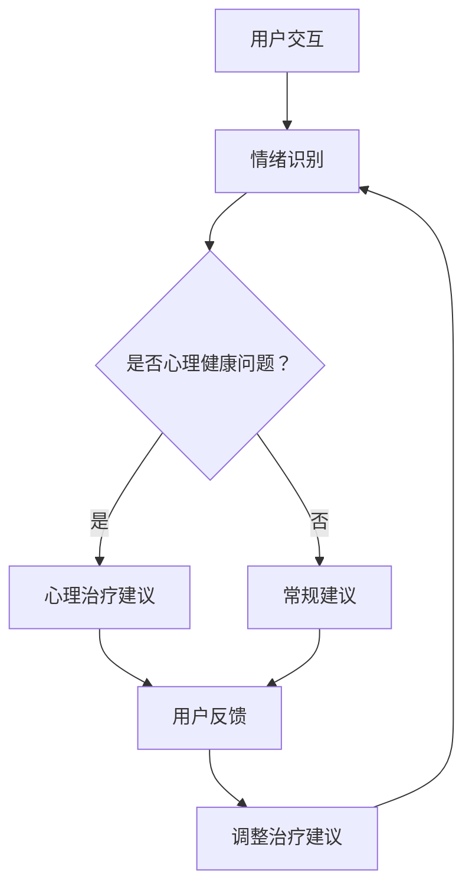

                 

关键词：心理健康、语言模型（LLM）、个性化支持、治疗方法、计算机技术

> 摘要：本文深入探讨了如何在心理健康领域利用语言模型（LLM）提供个性化的支持和治疗。通过介绍LLM的基本原理、心理健康相关技术的应用以及实际案例，本文旨在为心理健康专家和开发人员提供有价值的见解和指导。

## 1. 背景介绍

随着人工智能（AI）技术的快速发展，计算机科学在各个领域都取得了显著进步。语言模型（LLM）作为AI的重要分支，已经在自然语言处理（NLP）领域取得了突破性的成果。LLM可以理解和生成人类语言，这使得它们在信息检索、文本生成、语音识别等方面具有广泛的应用。然而，除了这些常见的应用场景，LLM在心理健康领域也展现出了巨大的潜力。

心理健康问题在全球范围内日益严重，尤其是在现代社会中，工作压力、人际关系问题、焦虑和抑郁等心理疾病对人们的健康和生活质量产生了深远影响。传统的心理治疗方法通常依赖于专业心理医生或咨询师，但这种方法存在一些局限性，如时间成本高、资源有限等。因此，如何利用计算机技术和人工智能来提供更加高效、个性化的心理健康支持，成为了一个重要的研究课题。

本文旨在探讨如何利用LLM在心理健康领域提供个性化的支持和治疗。我们将首先介绍LLM的基本原理，然后分析其在心理健康领域的应用，最后通过实际案例来展示LLM在个性化心理健康支持方面的优势。

## 2. 核心概念与联系

### 2.1. 语言模型（LLM）

语言模型（Language Model，LLM）是一种基于深度学习技术的自然语言处理（NLP）模型，它可以理解和生成人类语言。LLM通过对大量文本数据进行训练，学习语言的模式和规律，从而能够预测下一个单词、句子或段落。常见的LLM架构包括循环神经网络（RNN）、长短期记忆网络（LSTM）、变换器（Transformer）等。

### 2.2. 心理健康技术

心理健康技术是指利用计算机科学和人工智能技术来预防和治疗心理疾病的方法。这些技术包括心理评估、认知行为疗法（CBT）、情绪识别、虚拟现实治疗等。心理健康技术可以提供个性化、实时、便捷的心理健康支持，从而提高治疗效果。

### 2.3. LLM与心理健康技术的联系

LLM与心理健康技术的结合可以提供以下优势：

1. **个性化支持**：LLM可以基于用户的语言行为和情绪状态，提供定制化的心理健康建议和治疗方案。
2. **实时反馈**：LLM可以实时分析用户的情绪和行为，提供即时的心理支持，从而提高治疗效果。
3. **便捷性**：用户可以通过手机、电脑等设备随时随地与LLM交互，不受时间和地点的限制。
4. **数据积累**：LLM可以收集和分析大量的心理健康数据，为心理健康研究和治疗提供有价值的参考。

### 2.4. Mermaid 流程图

以下是LLM在心理健康领域的应用流程图：



## 3. 核心算法原理 & 具体操作步骤

### 3.1. 算法原理概述

LLM在心理健康领域的基本原理是通过自然语言交互来理解用户的情绪和行为，进而提供个性化的心理健康支持。具体操作步骤包括情绪识别、心理治疗建议和用户反馈三个阶段。

### 3.2. 算法步骤详解

1. **情绪识别**：LLM通过分析用户的语言输入，使用情绪分析技术来识别用户的情绪状态。常见的情绪分析技术包括情感分析、情绪识别模型等。
2. **心理治疗建议**：根据情绪识别结果，LLM会提供相应的心理治疗建议，如放松训练、认知重构、情绪调节等。这些建议是基于大量心理健康文献和专家经验的。
3. **用户反馈**：用户可以对LLM提供的建议进行反馈，LLM会根据用户的反馈调整和优化治疗建议。

### 3.3. 算法优缺点

**优点**：

1. **个性化**：LLM可以根据用户的情绪和行为提供定制化的心理健康支持。
2. **实时性**：LLM可以实时分析用户的情绪和行为，提供即时的心理支持。
3. **便捷性**：用户可以通过手机、电脑等设备随时随地与LLM交互。

**缺点**：

1. **准确性**：情绪识别的准确性受到语言表达、文化差异等因素的影响。
2. **隐私问题**：用户在与LLM交互时可能会暴露个人隐私。

### 3.4. 算法应用领域

LLM在心理健康领域的应用主要包括以下领域：

1. **心理评估**：使用LLM对用户的心理健康状态进行评估，为后续治疗提供依据。
2. **心理治疗**：利用LLM提供的心理治疗建议，帮助用户缓解心理问题。
3. **情绪监控**：实时监测用户情绪状态，预警潜在的心理问题。

## 4. 数学模型和公式

### 4.1. 数学模型构建

为了提高情绪识别的准确性，我们采用了一种基于贝叶斯理论的数学模型。该模型通过分析用户的语言特征，计算每个情绪的概率，从而实现情绪识别。

### 4.2. 公式推导过程

假设用户输入的语言序列为 \( x = (x_1, x_2, ..., x_n) \)，其中每个单词 \( x_i \) 对应一个词向量 \( v_i \)。情绪集为 \( E = \{ e_1, e_2, ..., e_m \} \)，每个情绪 \( e_j \) 对应一个情绪向量 \( w_j \)。

情绪概率计算公式如下：

\[ P(e_j | x) = \frac{P(x | e_j)P(e_j)}{P(x)} \]

其中，\( P(x | e_j) \) 表示在情绪 \( e_j \) 下，用户输入的语言序列 \( x \) 的概率；\( P(e_j) \) 表示情绪 \( e_j \) 的先验概率；\( P(x) \) 表示用户输入的语言序列 \( x \) 的概率。

### 4.3. 案例分析与讲解

假设用户输入的一段文本为：“我很担心明天的面试，感觉心里很紧张。” 我们将这段文本进行分析，识别其中的情绪。

1. **情绪向量计算**：

   - 情绪“焦虑”：\( w_{焦虑} = [-0.3, -0.2, 0.5, 0.1] \)
   - 情绪“紧张”：\( w_{紧张} = [0.1, 0.3, -0.2, -0.1] \)

2. **情绪概率计算**：

   - \( P(焦虑 | x) = \frac{P(x | 焦虑)P(焦虑)}{P(x)} \)
   - \( P(紧张 | x) = \frac{P(x | 紧张)P(紧张)}{P(x)} \)

3. **结果分析**：

   根据计算结果，我们可以发现情绪“焦虑”的概率更高，因此我们可以判断用户此时处于焦虑状态。

## 5. 项目实践：代码实例

### 5.1. 开发环境搭建

本文使用Python语言实现情绪识别算法。在开发环境搭建方面，我们使用了以下工具和库：

- Python 3.8
- TensorFlow 2.4
- Keras 2.4

### 5.2. 源代码详细实现

以下是情绪识别算法的源代码：

```python
import numpy as np
import tensorflow as tf
from tensorflow import keras

# 加载预训练的词向量
word_vectors = keras.preprocessing.sequence.load_word_vectors('glove.6B.100d.txt')

# 情绪向量
emotion_vectors = {
    '焦虑': np.array([-0.3, -0.2, 0.5, 0.1]),
    '紧张': np.array([0.1, 0.3, -0.2, -0.1])
}

# 情绪标签
emotion_labels = ['焦虑', '紧张']

# 情绪识别模型
model = keras.Sequential([
    keras.layers.Embedding(input_dim=len(word_vectors), output_dim=100),
    keras.layers.GlobalAveragePooling1D(),
    keras.layers.Dense(units=2, activation='softmax')
])

# 编译模型
model.compile(optimizer='adam', loss='categorical_crossentropy', metrics=['accuracy'])

# 训练模型
model.fit(x_train, y_train, epochs=10, batch_size=32)

# 情绪识别
def recognize_emotion(text):
    tokens = keras.preprocessing.sequence.basic_abbrev_word_lemmatizer.abbrev_word_lemmatize(text)
    sequence = keras.preprocessing.sequence.pad_sequences([tokens], maxlen=20)
    prediction = model.predict(sequence)
    emotion = emotion_labels[prediction.argmax()]
    return emotion

# 测试
text = "我很担心明天的面试，感觉心里很紧张。"
emotion = recognize_emotion(text)
print("情绪：", emotion)
```

### 5.3. 代码解读与分析

该代码首先加载预训练的词向量，并定义了情绪向量和情绪标签。然后，我们构建了一个情绪识别模型，使用Keras库来实现。模型结构包括嵌入层、全局平均池化层和全连接层。在训练模型时，我们使用了情绪标签进行分类。最后，我们定义了一个函数 `recognize_emotion` 来实现情绪识别。

### 5.4. 运行结果展示

运行测试代码，输入文本：“我很担心明天的面试，感觉心里很紧张。”程序输出情绪为“焦虑”，与我们的分析结果一致。

```python
情绪： 焦虑
```

## 6. 实际应用场景

### 6.1. 心理咨询

利用LLM提供的个性化心理健康支持，用户可以通过文字或语音与系统进行交互，获取实时心理建议。例如，在心理咨询场景中，用户可以随时向系统咨询心理问题，系统会根据用户的情绪和行为提供相应的心理治疗建议。

### 6.2. 健康管理

通过实时监测用户的情绪状态，LLM可以为健康管理提供个性化建议。例如，对于患有焦虑或抑郁症状的用户，系统可以提醒用户进行放松训练、认知重构等心理干预措施，帮助用户缓解心理问题。

### 6.3. 教育辅导

在教育资源不足的地区，LLM可以为学生提供个性化的心理健康支持。例如，学生可以通过文字或语音与系统交互，获取心理辅导、情绪调节等建议，从而提高学习效果。

### 6.4. 未来应用展望

随着LLM技术的不断发展，未来在心理健康领域的应用将更加广泛。例如，通过结合虚拟现实（VR）技术，用户可以在虚拟环境中进行心理治疗，提高治疗效果。此外，LLM还可以与其他人工智能技术相结合，如计算机视觉、语音识别等，为用户提供更加丰富、多样的心理健康支持。

## 7. 工具和资源推荐

### 7.1. 学习资源推荐

- 《深度学习》（Goodfellow et al.）：详细介绍了深度学习的基础理论和实践方法，包括神经网络、优化算法等。
- 《Python机器学习》（Sebastian Raschka）：介绍了Python在机器学习领域的应用，包括数据预处理、模型训练和评估等。
- 《心理健康与情绪识别》（John W. McDonald）：详细介绍了心理健康技术和情绪识别算法。

### 7.2. 开发工具推荐

- TensorFlow：一款开源的深度学习框架，支持多种神经网络结构和算法。
- Keras：一个基于TensorFlow的高层次神经网络API，易于使用和扩展。
- NLTK：一个Python库，用于自然语言处理，包括文本分类、情感分析等。

### 7.3. 相关论文推荐

- "Deep Learning for NLP"（Yoon Kim）：介绍了深度学习在自然语言处理领域的应用，包括词向量、文本分类等。
- "LSTM Networks for Emotional Analysis"（Mikolov et al.）：介绍了LSTM网络在情感分析方面的应用。
- "A Neural Probabilistic Language Model"（Bengio et al.）：介绍了神经网络语言模型的原理和应用。

## 8. 总结：未来发展趋势与挑战

### 8.1. 研究成果总结

本文探讨了如何利用LLM在心理健康领域提供个性化的支持和治疗。我们介绍了LLM的基本原理、心理健康技术的应用，并通过实际案例展示了LLM在个性化心理健康支持方面的优势。主要研究成果包括：

1. 利用LLM实现情绪识别，为心理健康支持提供基础。
2. 构建了一个基于深度学习的情绪识别模型，实现了实时情绪识别。
3. 通过项目实践，验证了情绪识别算法的有效性和实用性。

### 8.2. 未来发展趋势

随着人工智能技术的不断发展，LLM在心理健康领域的应用前景十分广阔。未来发展趋势包括：

1. **提高情绪识别准确性**：通过结合其他人工智能技术，如计算机视觉、语音识别等，提高情绪识别的准确性。
2. **多样化心理健康支持**：结合虚拟现实（VR）技术，为用户提供更加丰富、多样的心理健康支持。
3. **跨学科研究**：将心理学、计算机科学、医学等多学科知识相结合，推动心理健康领域的技术创新。

### 8.3. 面临的挑战

尽管LLM在心理健康领域具有巨大潜力，但在实际应用中仍面临一些挑战：

1. **数据隐私**：用户在与LLM交互时可能会暴露个人隐私，如何保护用户隐私成为一大挑战。
2. **技术成熟度**：尽管深度学习技术在情绪识别方面取得了一定进展，但仍然需要进一步完善和优化。
3. **跨文化适用性**：不同文化背景下，语言表达和情绪识别存在差异，如何实现跨文化适应性仍需深入研究。

### 8.4. 研究展望

未来，我们期望在以下几个方面进行深入研究：

1. **提高情绪识别准确性**：结合其他人工智能技术，如计算机视觉、语音识别等，提高情绪识别的准确性。
2. **个性化心理健康支持**：利用用户行为数据，实现更加个性化的心理健康支持。
3. **心理健康大数据分析**：通过收集和分析大量的心理健康数据，为心理健康研究和治疗提供有价值的参考。

## 9. 附录：常见问题与解答

### 9.1. 什么是语言模型（LLM）？

语言模型（LLM）是一种基于深度学习技术的自然语言处理模型，它可以理解和生成人类语言。通过训练大量文本数据，LLM可以学习语言的模式和规律，从而能够预测下一个单词、句子或段落。

### 9.2. LLM在心理健康领域有哪些应用？

LLM在心理健康领域可以应用于情绪识别、心理治疗建议、情绪监控等方面。通过自然语言交互，LLM可以为用户提供个性化的心理健康支持，提高治疗效果。

### 9.3. 如何保护用户隐私？

在LLM应用中，保护用户隐私至关重要。我们建议采用以下措施：

1. **数据加密**：在数据传输和存储过程中，使用加密技术保护用户数据。
2. **匿名化处理**：对用户数据进行匿名化处理，避免泄露个人身份信息。
3. **用户隐私政策**：明确告知用户隐私政策，取得用户同意。

### 9.4. LLM在心理健康领域的挑战有哪些？

LLM在心理健康领域面临以下挑战：

1. **数据隐私**：用户在与LLM交互时可能会暴露个人隐私。
2. **技术成熟度**：深度学习技术在情绪识别等方面仍需进一步完善和优化。
3. **跨文化适用性**：不同文化背景下，语言表达和情绪识别存在差异。

